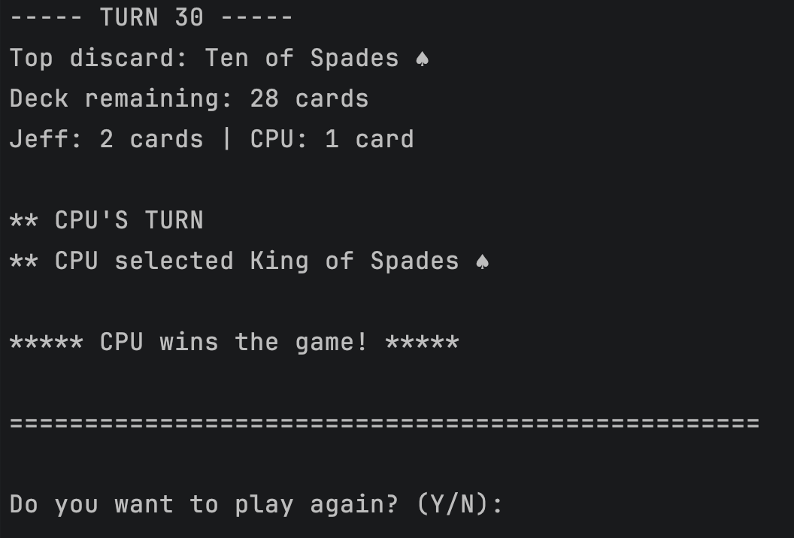

# CrazyEights Assignment 1 Solution

This solution implements a console-based version of the card game Crazy 8’s using object-oriented design principles.

This assignment is not about game sophistication. It is explicitly about demonstrating correct and intentional use of:

- Interfaces
- Abstract classes
- Concrete classes
- Polymorphism
- Dynamic dispatch
- Encapsulation
- Composition Root Pattern


## Running the Application from CLI

From the root directory, use the following commands:

```bash
cd src/CrazyEights
dotnet run -- [randomSeed] [handSize] [showAllHands]
```

Arguments (optional):
- `randomSeed`: Integer used to seed the random number generator for reproducible games, for example `42`. Default `0`
- `handSize`: Integer for starting cards per player, for example `5`. Default `5`
- `showAllHands`: Boolean-like flag to reveal all hands, use `true` to show or `false` to hide (example `true`). Default `false`

## Building and Running with Docker

From the root directory:

```bash
cd src/CrazyEights
docker build --no-cache -t crazy-eights .
docker run --rm -it crazy-eights [randomSeed] [handSize] [showAllHands]
```

> Ensure Docker is installed and running on your system.
> `-it` is required for console interactivity.

## Environment Requirements

- [.NET 6 SDK](https://dotnet.microsoft.com/en-us/download/dotnet/6.0) or later
- C# 10 or later
- [Docker](https://www.docker.com/get-started) (optional, for containerized builds)
- Compatible operating system: Windows, macOS, or Linux
- Internet connection (for dependency downloads)

## Screenshots



