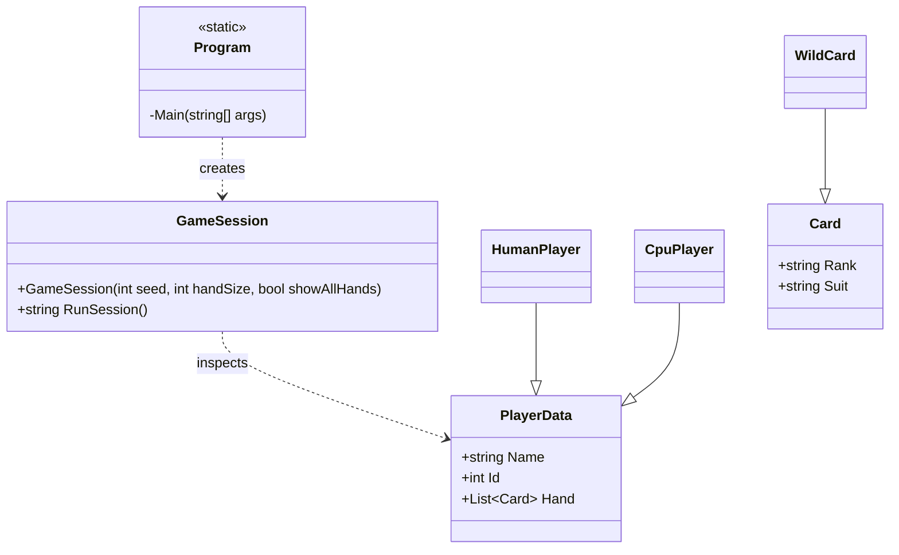

# CrazyEightsBadExample (single namespace)

## Purpose

This project is a deliberately poor design demo of Crazy Eights. It keeps the code working while concentrating responsibilities, increasing coupling, and using procedural logic in a small set of classes.

> This project was AI-generated from the CrazyEights solution using Codex and Visual Studio Code.

## Class Analysis

- `Program` mixes argument parsing, UI text, and game replay control; expanding options or adding new modes requires touching the entry point and retesting everything.
- `GameSession` centralizes deck creation, shuffling, dealing, input/output, turn logic, and win conditions in one class; it is difficult to modify rules without introducing regressions, and branching logic makes it hard to reason about behavior.
- `PlayerData` exposes mutable fields directly and serves as a shared bag of state; there is no validation or encapsulation, making it easy to introduce inconsistent state.
- `HumanPlayer` adds no behavior beyond `PlayerData`, so any human-specific changes require more type checks in `GameSession`.
- `CpuPlayer` also adds no behavior, leaving AI decisions embedded in `GameSession`; adding multiple AI types would require more conditional logic rather than new classes.
- `Card` is a passive data holder and relies on external code to interpret rank and suit, which duplicates logic across the codebase.
- `WildCard` exists only to be checked by type; any new special cards would force new `is` checks and more branching.

### Comparison to Assignment 1 Goals

#### Meets Requirement

- Game is playable from the console and completes a full round with a win condition.
- Core Crazy Eights rule set is implemented: match rank or suit, eights are wild, draw when no play is available.
- Deck creation, shuffling, and hand dealing are present and functional.
- Human vs. CPU gameplay is supported with a basic random CPU.
- Replay loop allows multiple games without restarting the application.

#### Does Not Meet Requirement

- No separation of concerns; UI, game rules, and data manipulation are tightly coupled.
- No context objects or clear composition root; configuration leaks into game flow.
- Minimal polymorphism and heavy type inspection instead of dynamic dispatch.
- Large, monolithic classes with low cohesion and high cyclomatic complexity.
- Data objects expose mutable state directly with no encapsulation or validation.

## UML (Mermaid)



## Running the Application from CLI

From the root directory, use the following commands:

```bash
cd src-bad-example
dotnet run
```

## Building and Running with Docker

From the root directory:

```bash
cd src-bad-example
docker build --no-cache -t crazy-eights-bad .
docker run --rm -it crazy-eights-bad
```

> Ensure Docker is installed and running on your system.
> `-it` is required for console interactivity.
