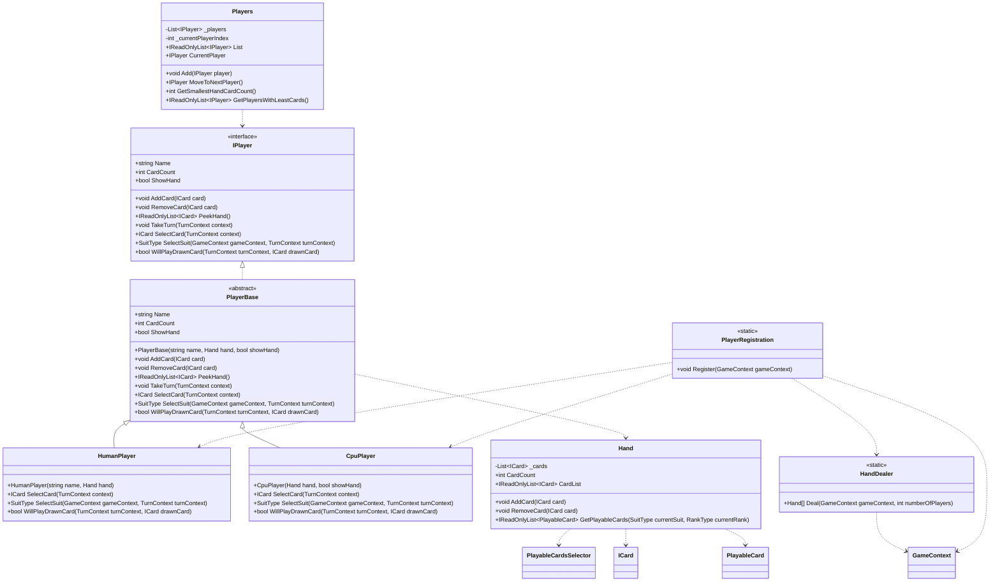

# CrazyEights.Player

## Purpose

Defines player behavior and hand management. This namespace provides the player interface and base class, concrete human/CPU strategies, and supporting classes for dealing and player rotation.

## Analysis vs. assignment-1.md

- `IPlayer` and `PlayerBase` meet the interface and abstract class requirements while keeping hand state encapsulated in `Hand`.
- `HumanPlayer` and `CpuPlayer` implement decision-making, enabling `GameEngine` to call `TakeTurn` without checking types, which matches the polymorphism requirement.
- `Hand` provides controlled access to cards and uses domain playability checks, aligning with encapsulation rules (no public mutable hand list).
- `Players` stores a collection of `IPlayer`, enabling turn rotation through the interface as required.
- `PlayerRegistration` and `HandDealer` keep setup logic out of `Main`, though `PlayerRegistration` performs console input directly rather than through a UI abstraction.

## UML (Mermaid)

