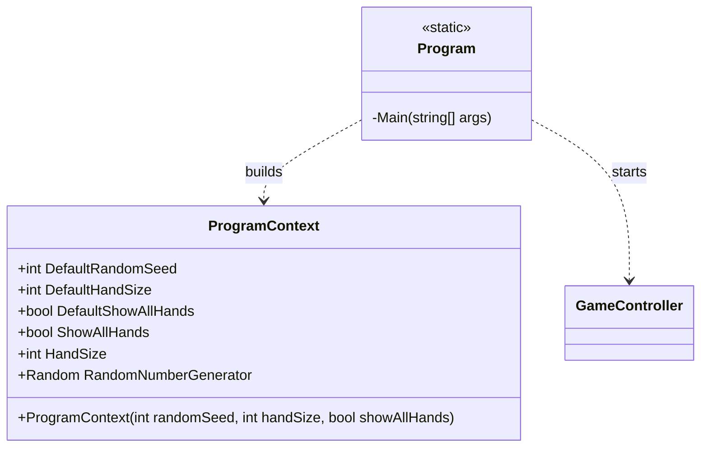
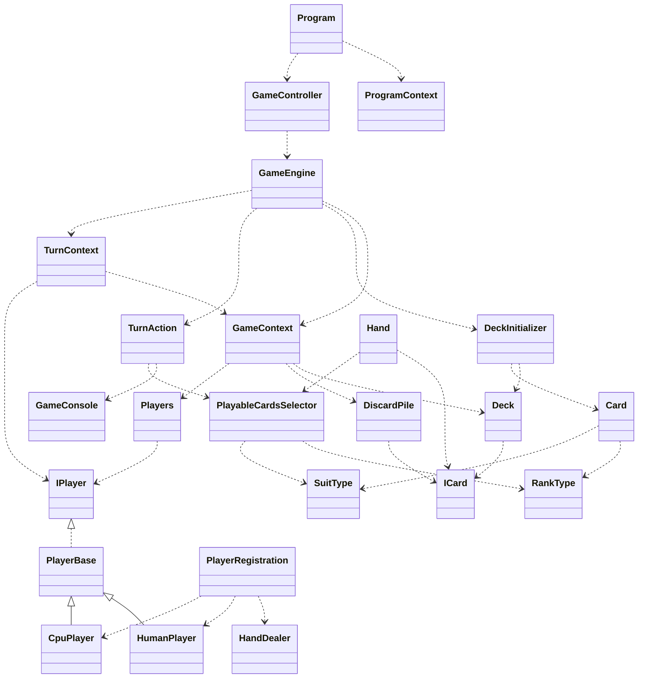

# CrazyEights (root namespace)

## Purpose

The root namespace is the composition root for the application. It owns startup wiring and runtime configuration, then hands control to the game layer without embedding gameplay rules.

## Analysis vs. assignment-1.md

- `Program` constructs a `ProgramContext`, creates `GameController`, and starts the game, which matches the requirement that `Main` only wires objects and launches gameplay.
- `ProgramContext` centralizes configuration (seed, hand size, reveal hands) so other namespaces can accept a context object instead of many parameters, aligning with the assignment's context-object guidance.
- No game rules, turn logic, or card-matching logic appear here, keeping the composition root "short and boring" as requested.

## UML (Mermaid)

## Cross-namespace UML (Mermaid)

