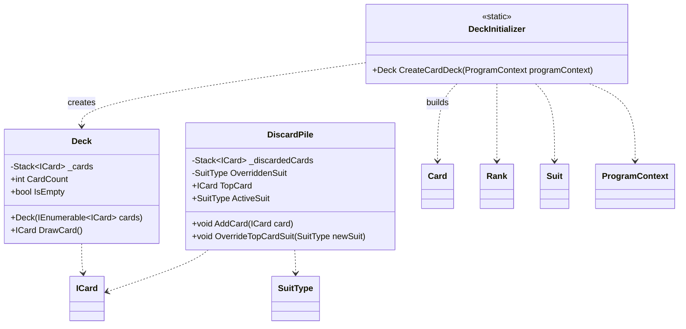

# CrazyEights.CardDeck

## Purpose

Encapsulates deck and discard pile state transitions. This namespace owns card creation, shuffling, drawing, and discard pile rules so that other parts of the system cannot mutate collections directly.

## Analysis vs. assignment-1.md

- `Deck` and `DiscardPile` hide their internal stacks and expose only safe operations (`DrawCard`, `AddCard`, `OverrideTopCardSuit`), meeting the encapsulation requirements.
- `DeckInitializer` builds a standard deck and shuffles using the program context RNG, keeping deck setup out of `Main` and avoiding hard-coded rules in the engine.
- Discard pile suit overrides implement the "eights are wild" rule while keeping suit state centralized in the pile, aligning with the rule ownership guidance.

## UML (Mermaid)

