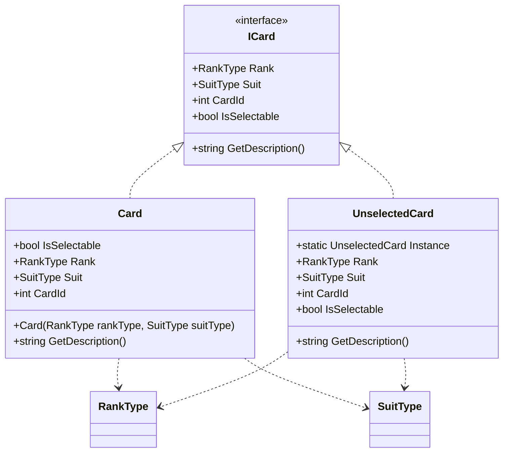

# CrazyEights.Cards

## Purpose

Defines the card abstractions used by the engine and players. This namespace provides the `ICard` interface and concrete card implementations that hide rank/suit details behind a minimal contract.

## Analysis vs. assignment-1.md

- `ICard` satisfies the required card interface and keeps state immutable via read-only properties, aligning with encapsulation expectations.
- `Card` is the concrete implementation used by the deck; `UnselectedCard` is a null-object used to avoid type checks in the turn flow, supporting polymorphism and dynamic dispatch.
- The interface includes `GetDescription()` which is presentation-oriented, but the UI logic remains in `GameConsole`/players, so the engine still consumes `ICard` generically.

## UML (Mermaid)

