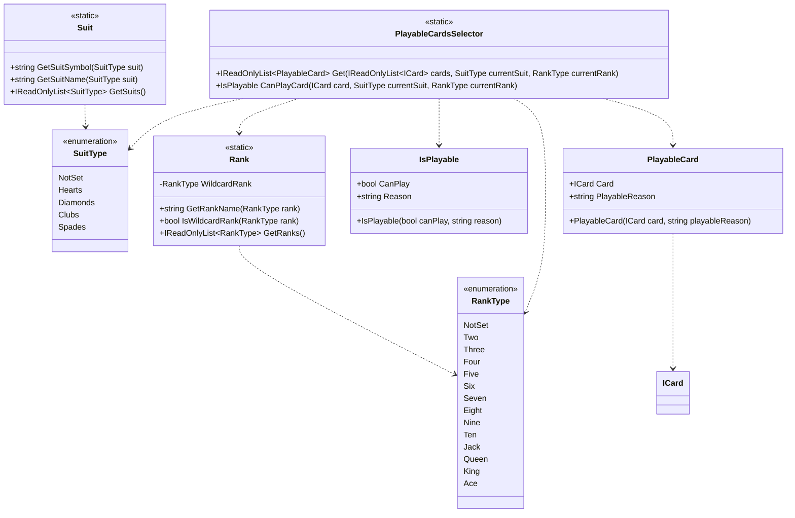

# CrazyEights.Domain

## Purpose

The domain namespace defines the *game concepts and rules* independent of UI or storage. It models ranks, suits, and "playability" rules so that other namespaces can ask domain questions ("can this card be played now?") without duplicating logic.

## Analysis vs. assignment-1.md

- `RankType` and `SuitType` are explicit domain vocabularies, keeping card identity and rule comparisons strongly typed.
- `Rank` and `Suit` expose domain rules (wildcard rank, valid ranks/suits, name/label helpers), which centralizes rules instead of scattering conditionals across the codebase.
- `PlayableCardsSelector` and `IsPlayable` encode the matching rules (rank, suit, wildcard), aligning directly with the assignment's simplified Crazy Eights rules and reducing the need for type checks.
- This namespace stays UI-free and is reusable by both the engine and players, matching the expectation that domain logic should be isolated from interaction concerns.

## UML (Mermaid)

