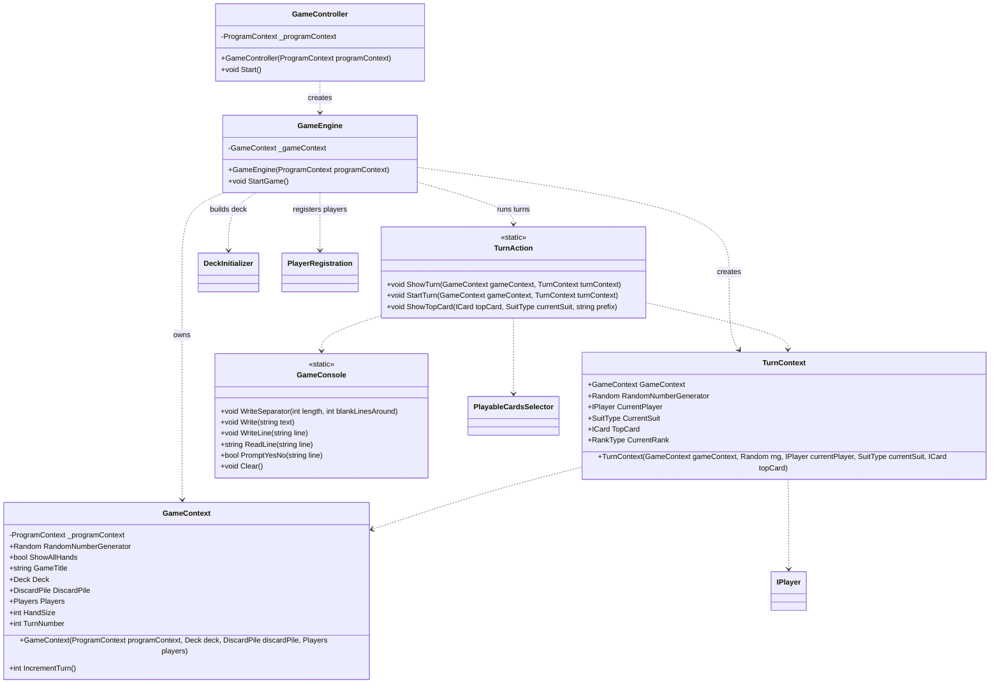

# CrazyEights.Game

## Purpose

Coordinates gameplay flow, turn sequencing, and console interaction. This namespace owns the game loop, turn context, and high-level rules while remaining agnostic to concrete player types.

## Analysis vs. assignment-1.md

- `GameEngine` drives the loop using `Players` and `IPlayer.TakeTurn`, demonstrating polymorphism and dynamic dispatch without `is` checks.
- `TurnContext` and `GameContext` act as context objects, reducing parameter sprawl and aligning with the assignment's recommendation.
- `TurnAction` consolidates turn flow (select, draw, discard, wildcard suit changes) and keeps state transitions inside the engine rather than player hands, meeting the encapsulation guidance.
- `GameController` wraps replay behavior and introduction text, keeping `Program` focused on wiring only.
- `GameConsole` isolates I/O concerns so that the engine and domain are not tightly coupled to `Console` calls.

## UML (Mermaid)

