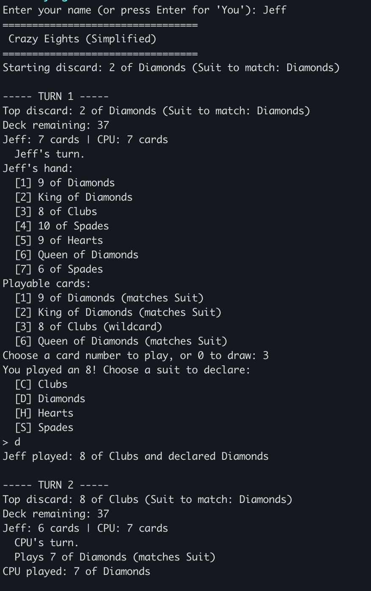
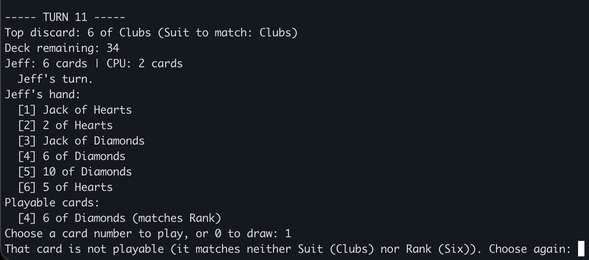
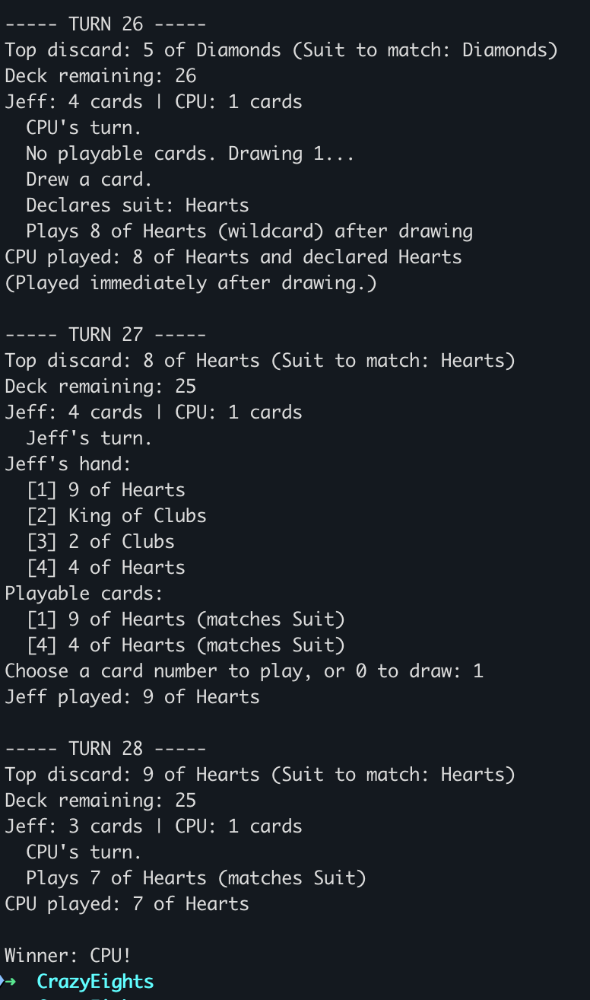
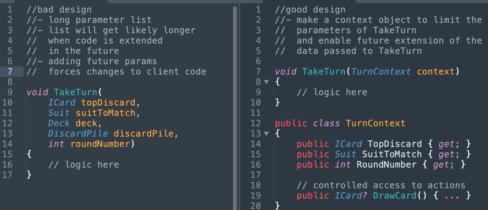
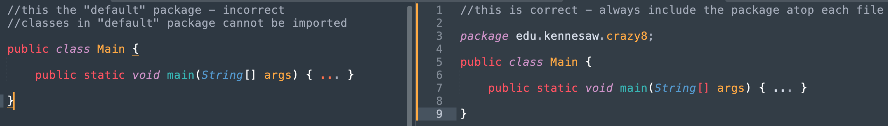
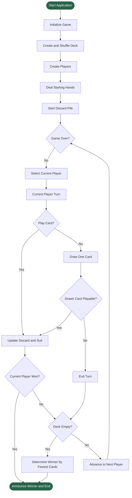

# Assignment 1 

## Simplified Crazy 8’s Console-Based Card Game
#### OO Foundations Practice

[KSU SWE 4743: Object-Oriented Design](../README.md)

---

## Overview

In this assignment, you will implement a **console-based version of the card game Crazy 8’s** using **object-oriented design principles**.

This assignment is **not about game sophistication**. It is explicitly about demonstrating correct and intentional use of:

- Interfaces  
- Abstract classes  
- Concrete classes  
- Polymorphism  
- Dynamic dispatch  
- Encapsulation  

Your implementation should be clean, readable, and easy to reason about.

#### Related Lecture Materials

- [Why Design Matters](../presentations/01_2-why-design-matters.pdf)
- [OO Foundations Review](../presentations/02-oo-foundations-review.pdf)

#### Related Code Examples

The OO Foundations Review evolved a solution starting with inheritance and adding examples of polymorphism, encapsulation, dynamic dispatch, and namespacing.

- Inheritance
  [C#](../demos/02-foundations-review/csharp/01-inheritance/README.md) | [Java (also demonstrates Java namespacing)](../demos/02-foundations-review/java/README.md) 
- Polymorphism
  [C# 1](../demos/02-foundations-review/csharp/02-polymorphism-1/README.md) | [C# 2](../demos/02-foundations-review/csharp/03-polymorphism-2/README.md) | [C# 3](../demos/02-foundations-review/csharp/04-polymorphism-3/README.md)
- Encapsulation
  [C# 1](../demos/02-foundations-review/csharp/05-encapsulation-1/README.md) | [C# 2](../demos/02-foundations-review/csharp/06-encapsulation-2/README.md)
- Namespaces
  [C#](../demos/02-foundations-review/csharp/07-namespaces/README.md)

---

## Table of Contents

- [Learning Objectives](#learning-objectives)
- [Game Rules](#game-rules)
  - [On a turn](#on-a-turn)
  - [Winning](#winning)
  - [Online Example](#online-example)
  - [Example Implementation](#example-implementation)
- [Required Design Architecture](#required-design-architecture)
  - [Interfaces (Required)](#interfaces-required)
  - [Abstract Classes (Required)](#abstract-classes-required)
  - [Concrete Classes (Examples)](#concrete-classes-examples)
- [Encapsulation Requirements](#encapsulation-requirements)
- [Polymorphism & Dynamic Dispatch](#polymorphism--dynamic-dispatch)
- [File Organization (Required)](#file-organization-required)
- [Starter Repository Structure (Required)](#starter-repository-structure-required)
  - [Top-level Layout (Both Languages)](#top-level-layout-both-languages)
  - [C# Starter Structure](#c-starter-structure)
  - [Java Starter Structure](#java-starter-structure)
- [Flow Diagram](#flow-diagram)
- [Technical Requirements](#technical-requirements)
- [README.md Requirements (Mandatory)](#readmemd-requirements-mandatory)
- [Coding Standards (Required)](#coding-standards-required)
- [Main / Program Entry Point Requirements](#main--program-entry-point-requirements)
- [Constraints (Important)](#constraints-important)
- [FAQ](#faq)
- [Encapsulation Examples](#encapsulation-examples)
- [Final Advice](#final-advice)
- [Submitting Your Assignment](#submitting-your-assignment)

---

## Learning Objectives

By completing this assignment, you will demonstrate that you can:

- Design software around **abstractions**, not concrete implementations
- Use **interfaces** to define contracts
- Use **abstract base classes** to share behavior and state
- Apply **polymorphism** via collections of base types
- Rely on **dynamic dispatch** instead of conditionals
- Protect internal state using **encapsulation**
- Organize a small but non-trivial application into cohesive classes
- Use **source control (GitHub)** to manage and share a non-trivial codebase
- **Document** a console-based application using a clear, professional `README.md`, including build and execution instructions
- Practice **communicating design intent** through code organization, naming, and documentation.

---

## Game Rules

You will implement a simplified **two-player** version of Crazy 8’s:

- **Human Player vs Computer Player**
- Standard **52-card deck**
- Deal **7 cards** to each player
- One card is placed face-up to start the discard pile

### On a turn
A player may:

- Play **one card** that matches either:
  - the **rank** (the value on the card, e.g., *2, 7, 10, Jack, Queen, King, Ace*), or
  - the **suit** (the symbol on the card: *Clubs ♣, Diamonds ♦, Hearts ♥, Spades ♠*)
  
  of the **top discard card**.

  **Example:**  
  If the top discard card is **7 of Hearts**, you may play:
  - any **7** (7 of Clubs, 7 of Spades, etc.), or  
  - any **Heart** (2 of Hearts, King of Hearts, etc.).

- **Eights are wild** (Eights are CRAZY!)
  
  - An **8** may be played at any time, regardless of rank or suit
  - When an 8 is played, the player **declares a suit** and the declared suit becomes the suit to match until a non-8 card is played.
    (e.g., “Hearts”), and the next player must match that suit
  
- If no playable card exists:
  - Draw **one card**
  - If the drawn card is playable, it *may* be played immediately
  - Otherwise, the turn ends

### Winning
- The **first player to empty their hand wins**

> Please do not implement additional rules (stacking, draw-twos, skips, reverses, etc.). 

### Online Example

The following link provides an online version of Crazy Eights. 

> [https://cardgames.io/crazyeights](https://cardgames.io/crazyeights/)

The gameplay in this example is more sophisticated than what you will implement for this assignment. For example, in this assignment you will play one card per turn, whereas the online version allows multiple cards of the same rank to be played in a single turn.

This example is provided to help you understand the basic gameplay before you get started. Do not attempt to match all of the rules or features of the online version.

Anytime you start a new project, creating a strong mental model of the domain before you begin design and coding will help you produce better results with less refactoring and debugging.

### Example Implementation







#### Notes on Example Implementation

- Shows why a card can be placed (matches suit, matches rank, wildcard)
- Explains why a card cannot be selected
- Options are case-insensitive (choose `C` or `c` to select `Clubs`, for example)

---

## Required Design Architecture

### Interfaces (Required)
At minimum:
- C# `ICard` 
  Java `Card`
- C#`IPlayer`
  Java `Player`

The game engine must interact with cards and players **only through these interfaces**.

#### Interface Design Notes

- Interfaces must be **minimal** — include only what the game engine truly needs.
- Interfaces define **behavior**, not implementation details.
- **Do not expose internal state**:
  - No public fields
  - No mutable collections (e.g., List<Card>)
- Interfaces must **not contain UI logic** (no printing, no input handling).
- Interfaces should represent **roles** (e.g., “can take a turn”), not concrete types.
- Interfaces should enable **polymorphism and dynamic dispatch**:
  - The engine should never check concrete types (is, instanceof).
- If a method is not required by *every* implementation, it **does not belong in the interface**
  *Methods not required by every implementation are often Liskov Violations. We will explore this further when we study the Liskov Substitution Principle (the L in SOLID).*
- Prefer passing a **context object** over many method parameters.
  

---

### Abstract Classes (Required)
At minimum:
- An abstract player base class (e.g., `PlayerBase`) that:
  - Encapsulates the player’s hand
  - Provides shared helper logic (finding playable cards, removing cards, etc.)
  - Leaves decision-making to subclasses

---

### Concrete Classes (Examples)
You may rename these, but the structure must remain clear:

- `StandardCard`
- `HumanPlayer`
- `CpuPlayer`
- `Deck`
- `DiscardPile`
- `GameEngine` or `CrazyEightsGame`

Each class must have **one clear responsibility**.

---

## Encapsulation Requirements

- No public access to a player’s hand list
- No public mutation of the deck or discard pile
- State transitions (drawing, playing, discarding) must occur through methods - not list or property mutations
- No public fields

---

## Polymorphism & Dynamic Dispatch

- Players must be stored as `List<IPlayer>`
- The engine must call:

```csharp
currentPlayer.TakeTurn(context);
```

without knowing whether the player is human or computer.

- Do **not** use `if (player is HumanPlayer)` or equivalent logic

---

## File Organization (Required)

- **Each class must be in its own file**
- [No “God files”](https://en.wikipedia.org/wiki/God_object)
- [Logical package / namespace structure is expected](https://medium.com/@vitorbritto/the-package-by-feature-approach-c62a197a8a3d)

---

## Starter Repository Structure (Required)

Students must organize their repository using the following structure.

### Top-level Layout (Both Languages)

```
crazy-eights/
│
├── README.md
├── screenshot.png
│
├── src/
│   └── (language-specific)
│
└── .gitignore
```

---

### C# Starter Structure

```
crazy-eights/
│
├── README.md
├── screenshot.png
├── CrazyEights.sln
│
├── src/
│   └── CrazyEights/
│       ├── CrazyEights.csproj
│       ├── Program.cs
│       │
│       ├── Cards/
│       │   ├── ICard.cs
│       │   ├── StandardCard.cs
│       │
│       ├── Players/
│       │   ├── IPlayer.cs
│       │   ├── PlayerBase.cs
│       │   ├── HumanPlayer.cs
│       │   ├── CpuPlayer.cs
│       │
│       ├── Game/
│       │   ├── CrazyEightsGame.cs
│       │   ├── TurnContext.cs
│       │   ├── TurnAction.cs
│       │
│       ├── Deck/
│       │   ├── Deck.cs
│       │   ├── DiscardPile.cs
│       │
│       └── Domain/
│           ├── Suit.cs
│           ├── Rank.cs
│
└── .gitignore
```

Recommended namespaces:

```
CrazyEights.Cards
CrazyEights.Players
CrazyEights.Game
CrazyEights.Deck
CrazyEights.Domain
```

---

### Java Starter Structure

```
my-crazy-eights/
│
├── README.md
├── screenshot.png
│
├── src/
│   └── main/
│       └── java/
│           └── edu/
│               └── kennesaw/
│                   └── crazy8/
│                       │
│                       ├── Main.java
│                       │
│                       ├── cards/
│                       │   ├── Card.java (interface)
│                       │   ├── StandardCard.java
│                       │
│                       ├── players/
│                       │   ├── Player.java (interface)
│                       │   ├── PlayerBase.java
│                       │   ├── HumanPlayer.java
│                       │   ├── CpuPlayer.java
│                       │
│                       ├── game/
│                       │   ├── CrazyEightsGame.java
│                       │   ├── TurnContext.java
│                       │   ├── TurnAction.java
│                       │
│                       ├── deck/
│                       │   ├── Deck.java
│                       │   ├── DiscardPile.java
│                       │
│                       └── domain/
│                           ├── Suit.java
│                           ├── Rank.java
│
└── .gitignore
```

Students **must not** use the default package in Java.


---

## Flow Diagram



#### How the Flow Diagram Might Inform Your Solution

- The diagram shows **control flow**, not class structure. It illustrates *what happens*, not *how it is implemented*.
- “Current Player” is intentionally generic. The game engine does not know or care **what kind of player** is taking a turn (human, CPU, etc.). This reinforces **polymorphism and dynamic dispatch**.
- Player behavior is invoked at a single point (“Current Player Turn”), which corresponds to calling a method through an **interface** (e.g., IPlayer.TakeTurn(...)).
- State changes (deck, discard pile, declared suit) occur in the **game engine**, not in the player. This reflects **encapsulation** and proper ownership of state.
- The loop structure emphasizes that the game progresses by **iterating over a collection of players**, not by hard-coding player-specific logic.
- Decision points (diamonds) represent **domain rules**, not conditionals on concrete types. The rules apply equally to all players.
- Initialization steps are separated from the game loop, reinforcing the idea that **startup logic belongs in** **Main** **(the Composition Root)** and gameplay logic belongs elsewhere.

## Technical Requirements

### Language
- Your console application must be written in **C#** or **Java**.

---

### Repository & Submission
- Application must be submitted via a public **GitHub repository**
- Commit history should show incremental development. Commit as you work - not a single giant commit.
- Your repository must include:

  - your source code under the `/src` folder. 
  - a README.md markdown file with an inline screenshot of the working application.
    
    > [https://www.markdownguide.org/basic-syntax](https://www.markdownguide.org/basic-syntax/)
    > [https://medium.com/analytics-vidhya/writing-github-readme-e593f278a796](https://medium.com/analytics-vidhya/writing-github-readme-e593f278a796)
  - a `.gitignore` file appropriate to C# or Java.
    
    > [https://www.atlassian.com/git/tutorials/saving-changes/gitignore](https://www.atlassian.com/g it/tutorials/saving-changes/gitignore)
    >
    > - [C# example](https://gist.github.com/takekazuomi/10955889)
    > - [Java example](https://gist.github.com/dedunumax/54e82214715e35439227)
  

---

## README.md Requirements (Mandatory)

Your repository **must include a `README.md`** with:

### 1. Project Description
- Brief explanation of the game
- Description of OO concepts demonstrated

### 2. How to Run the Application (Console)
- **Not from an IDE**
- Examples:

**C#:**
```bash
dotnet run
```

**Java (example):**
```bash
javac *.java
java edu.kennesaw.crazy8.Main
```

(Maven/Gradle acceptable if clearly documented)

### 3. Screenshot
- Include **at least one screenshot** of the running game
- Display it **inline** using Markdown:

```markdown

```

---

## Coding Standards (Required)

Your code must follow standard conventions for your chosen language.

### C#
Microsoft C# Coding Conventions  
https://learn.microsoft.com/en-us/dotnet/csharp/fundamentals/coding-style/coding-conventions

### Java
Oracle Java Code Conventions  
https://www.oracle.com/java/technologies/javase/codeconventions-introduction.html

---

## Main / Program Entry Point Requirements

Your `Main` method (Java) or `Program.Main` (C#) must be **short and boring**.

### What `Main` is allowed to do

`Main` should only:

- Create the top-level objects (players, deck, game engine)
- “Wire” those objects together (dependency setup)
- Start the game (e.g., `game.Run()` / `game.run()`)

### What `Main` must NOT do

`Main` must NOT contain:

- Game rules
- Turn logic
- Card matching logic
- Large conditional logic on types (no `is` / `instanceof`)
- Large methods (avoid “God-method” `Main`)

If your `Main` method is more than ~20–30 lines, it is probably doing too much.

> **Strive to keep your `Main` method limited to initializing the application and launching the game - nothing more. Think of it as the switch that turns the game on.**

### Further Reading: The Composition Root Pattern

The **Composition Root** is the single place in an application where:

- concrete objects are **created**
- dependencies are **wired together**
- the application is **started**

https://dev.to/nuculabs_dev/composition-root-pattern-how-to-write-modular-software-21p0

---

### Example: Proper `Main` in C#

```csharp
using CrazyEights.Cards;
using CrazyEights.Deck;
using CrazyEights.Game;
using CrazyEights.Players;

namespace CrazyEights;

public static class Program
{
    public static void Main(string[] args)
    {
        IPlayer human = new HumanPlayer("You");
        IPlayer cpu = new CpuPlayer("CPU");

        Deck deck = Deck.CreateStandardShuffled();
        CrazyEightsGame game = new CrazyEightsGame(deck, human, cpu);

        game.Run();
    }
}
```

---

### Example: Proper `Main` in Java

```java
package edu.kennesaw.crazy8;

import edu.kennesaw.crazy8.deck.Deck;
import edu.kennesaw.crazy8.game.CrazyEightsGame;
import edu.kennesaw.crazy8.players.CpuPlayer;
import edu.kennesaw.crazy8.players.HumanPlayer;
import edu.kennesaw.crazy8.players.Player;

public class Main {

    public static void main(String[] args) {
        Player human = new HumanPlayer("You");
        Player cpu = new CpuPlayer("CPU");

        Deck deck = Deck.createStandardShuffled();
        CrazyEightsGame game = new CrazyEightsGame(deck, human, cpu);

        game.run();
    }
}
```

> Note: Your package and imports must match your actual folder/package structure.

---

## Constraints (Important)

**Do NOT:**

- Use large `switch` statements on card rank or suit
- Use `instanceof` / `is` checks to control behavior
- Put all logic in `Main`
- Use external libraries
- Add unnecessary game features
- Create God classes or God methods
- Place more than one top-level class in a single file. Nested classes are not permitted for this assignment
- Produce high-cyclomatic methods (i.e., long methods with many branches and conditionals)
  https://linearb.io/blog/cyclomatic-complexity

**DO:**

- Add behavior by adding new classes
- Let objects control their own behavior
- Keep the game engine generic

---

## Final Note

This assignment is intentionally modest in scope.  
You will be evaluated on **how you design**, not how clever the game is.

If your solution is easy to read, easy to extend, and clearly object-oriented, you are doing it right.


---

# FAQ

## 1. “Can I put everything in `Main` / `Program.cs` and refactor later?”
**No.**

This assignment is about **design**, not refactoring.
`Main` / `Program` should only create objects and start the game.
If most of your logic is in `Main`, you will lose design points.

---

## 2. “Can I use `if (player is HumanPlayer)` or `instanceof`?”
**No.**

This defeats polymorphism and dynamic dispatch.
All decision-making must live inside the concrete player classes.
The game engine must interact with players only through `IPlayer`.

---

## 3. “Can I use a big `switch` on card rank or suit?”
**No.**

Large conditional logic based on card properties is procedural design.
Behavior must be driven by objects, not conditionals.

---

## 4. “Do I have to match the provided class names exactly?”
**No**, but your design must clearly demonstrate:
- interfaces
- abstract classes
- polymorphic collections
- dynamic dispatch
- encapsulation

---

## 5. “Can my Player expose its hand publicly?”
**No.**

Hands must be private or protected.
You may return a **read-only view**, but not a mutable collection.

---

## 6. “Can I mutate the deck or discard pile directly?”
**No.**

Decks and discard piles must control their own state.
All changes must go through methods like `Draw()` or `Push()`.

---

## 7. “Can I add extra rules or special cards?”
**Please do not.**

This is not a game design assignment.
Extra rules often hide poor design and make grading harder.

---

## 8. “What if the deck runs out of cards?”
Handle it simply:
- end the game, or
- declare the player with fewer cards the winner (or if all players have the same number of cards, declare a draw).

Do not overengineer this case.

---

## 9. “Can I use standard collections like List, Stack, or Queue?”
**Yes.**

These are expected.
Do not use external libraries or frameworks.

---

## 10. “How large should a class be?”
As a rule of thumb:

> If a class exceeds ~200 lines, it likely has too many responsibilities.

---

## Encapsulation Examples

The following examples illustrate **what is and is not allowed** for this assignment.
They are provided to clarify the encapsulation requirements.

---

### No public access to a player’s hand list

####  Incorrect (violates encapsulation)

```csharp
public class Player
{
    public List<ICard> Hand = new List<ICard>();
}
```

This allows any other class to freely add, remove, or reorder cards, bypassing game rules.

---

####  Correct (encapsulated)

```csharp
public class Player
{
    private readonly List<ICard> _hand = new List<ICard>();

    public void Draw(ICard card)
    {
        _hand.Add(card);
    }

    public ICard PlayCardAt(int index)
    {
        ICard card = _hand[index];
        _hand.RemoveAt(index);
        return card;
    }

    public IReadOnlyList<ICard> PeekHand()
    {
        return _hand.AsReadOnly();
    }
}
```

The player fully controls its own state. Other objects may observe, but not mutate, the hand.

---

### No public mutation of the deck or discard pile

####  Incorrect (violates encapsulation)

```csharp
public class Deck
{
    public List<ICard> Cards = new List<ICard>();
}
```

This allows arbitrary removal, insertion, or clearing of cards.

---

####  Correct (encapsulated)

```csharp
public class Deck
{
    private readonly Stack<ICard> _cards;

    public Deck(IEnumerable<ICard> cards)
    {
        _cards = new Stack<ICard>(cards);
    }

    public ICard? Draw()
    {
        if (_cards.Count == 0)
            return null;

        return _cards.Pop();
    }

    public int Count => _cards.Count;
}
```

```csharp
public class DiscardPile
{
    private readonly Stack<ICard> _pile = new Stack<ICard>();

    public void Push(ICard card)
    {
        _pile.Push(card);
    }

    public ICard Top => _pile.Peek();
}
```

Decks and discard piles must protect their internal collections and expose only safe operations.

---

**Guiding rule:**  
If another object can directly mutate your internal collection, your class does **not** own its state.

---

## Final Advice

- A **simple, boring, well-designed** solution is better than a clever but tangled one.

- In the real world, users do not care about your internal design—they care that the software works.  **Ultimately, you must ship working software.**
  Good engineers balance sound design, good coding habits, and practical decisions in order to build, maintain, and ship software within real constraints.

  > [The dangers of Gold Plating](https://blog.3d-logic.com/2024/08/23/what-is-gold-plating-and-why-you-should-avoid-it/?utm_source=chatgpt.com)

## Submitting Your Assignment

**Assignments are not graded**; the work is its own reward. The primary goal is learning and feedback, not points.

I am happy to provide a detailed review of your assignment upon request. Reviews are typically conducted via a recorded Loom video.

**To request an assignment review:**

1. Complete all (or part) of the assignment.
2. Push your work to a public GitHub repository in your GitHub account.
3. Email me the repository URL that I can clone at JAdkiss1@Kennesaw.edu.

   > I will not review code submitted as a zip file. Learning how to properly use source control to share work is an expected part of this course.

**Before requesting a review, ensure that:**

- your code compiles, and
- your `README.md` includes clear console execution instructions.  
  
  > I will not run your assignment from an IDE, though I may review it there. Learning how to execute your applications outside of an IDE is an expected part of this course.