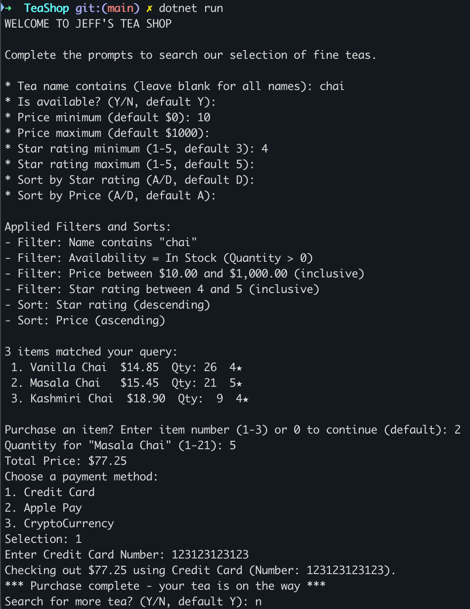
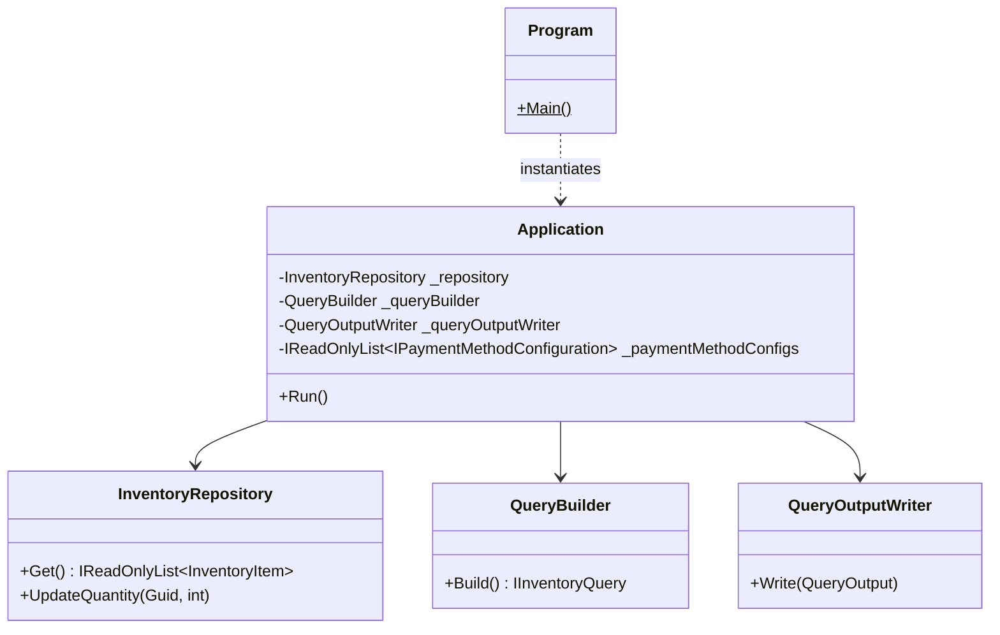
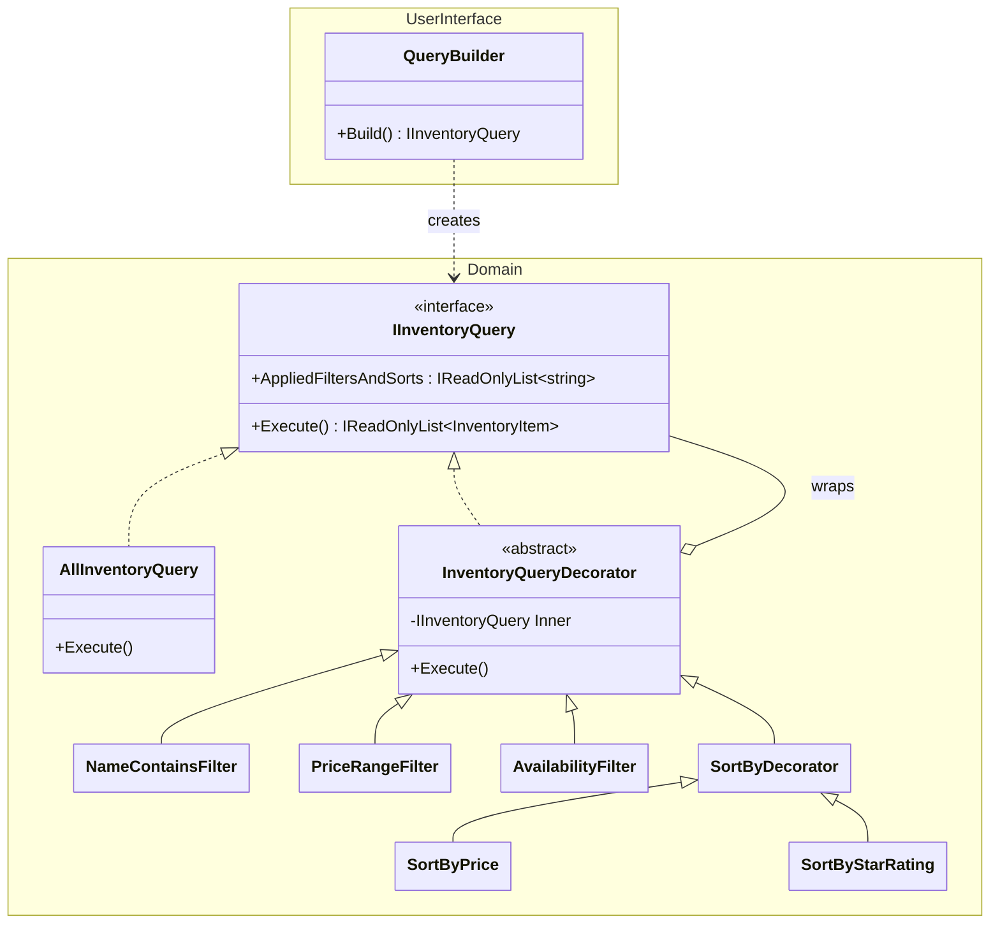
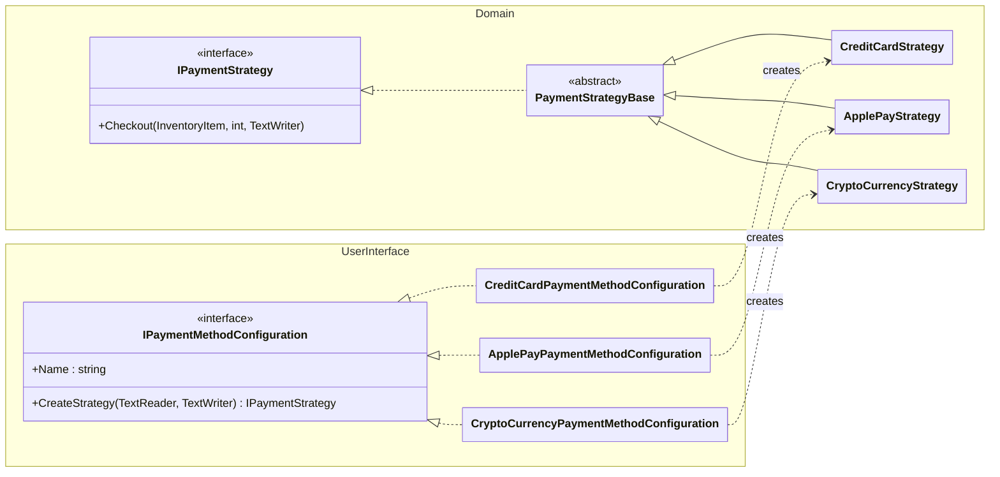

# Tea Shop Application

## Description

The Tea Shop Application is a console-based .NET application
that allows users to browse, search, and purchase various types of tea.
It features a basic inventory management system with
filtering and sorting capabilities, and supports multiple
(fake/demo) payment methods (Credit Card, Apple Pay, and CryptoCurrency).

## Screenshot



## CLI Execution Instructions

To run the application directly from your terminal, ensure you have the .NET 10 SDK installed.

1. Navigate to the root directory of the solution.
2. Run the following command:
   ```bash
   dotnet run --project TeaShop/TeaShop.csproj
   ```

## Docker Build Instructions

To build and run the application using Docker, you can use the following commands.

**Note:** Ensure you have Docker installed and a `Dockerfile` present in the root directory (or use the one provided
below as a template).

### 1. Build the Docker Image

```bash
docker build -t teashop .
```

### 2. Run the Docker Container

Since this is an interactive console application, you need to run it with the `-it` flags:

```bash
docker run -it --rm teashop
```

## Unit Test Execution Instructions

The solution includes a comprehensive suite of unit tests using Xunit.

To execute all tests, run the following command from the root directory:

```bash
dotnet test
```

To run tests with detailed output:

```bash
dotnet test --logger "console;verbosity=detailed"
```

## Architecture Overview

The project demonstrates object-oriented design patterns such as:

- **Strategy Pattern**: Used for different payment methods.
- **Decorator Pattern**: Used for building complex inventory queries with filters and sorts.
- **Repository Pattern**: Naive implementation to query and modify the tea inventory.
- **Polymorphism and Dependency Injection**: For I/O handling and testability.

## SOLID Principles

- **Single Responsibility Principle (SRP)**: Each class has a well-defined purpose. For example, the `Domain` logic is
  strictly separated from the `UserInterface`, and specific tasks like query construction (`QueryBuilder`), data
  access (`InventoryRepository`), and output formatting (`QueryOutputWriter`) are handled by dedicated classes.
- **Open/Closed Principle (OCP)**: The system is designed to be easily extendable without modifying existing core logic.
  New payment methods can be added by implementing `IPaymentStrategy`, and new inventory filters can be added by
  creating new `InventoryQueryDecorator` subclasses, both without changing the `Application` or `InventoryRepository`
  classes.

## Design Patterns Summary

| Pattern                  | Purpose in this Project                                                   | Key Classes                                                      |
|:-------------------------|:--------------------------------------------------------------------------|:-----------------------------------------------------------------|
| **Strategy**             | Decouples payment processing logic from the user interface.               | `IPaymentStrategy`, `CreditCardStrategy`                         |
| **Decorator**            | Dynamically composes complex inventory queries at runtime.                | `IInventoryQuery`, `InventoryQueryDecorator`, `PriceRangeFilter` |
| **Repository**           | Provides a clean API for data access, hiding the data source.             | `InventoryRepository` <br>(naive/simplistic implementation)      |
| **Dependency Injection** | Injects `TextReader`/`TextWriter` and Repositories to enable testability. | `QueryBuilder`, `Application`                                    |

## What Goes in the Domain Namespace?

The `Domain` namespace is the heart of the application. it contains the **Domain Logic** (also known as Business
Logic) — the rules, behaviors, and data structures that define how the tea shop operates, independent of how it is
presented to the user or how data is stored.

#### Determining What Belongs in `Domain`:

* **Domain Logic (Inside `Domain`):**
    * **Core Entities:** Objects like `InventoryItem` that represent real-world concepts.
    * **Business Rules:** Logic that governs how the business works (e.g., how to filter teas, how to calculate prices,
      or the rules for processing a payment strategy).
    * **Abstractions of Core Operations:** Interfaces and base classes for core behaviors, such as `IInventoryQuery` or
      `IPaymentStrategy`.
    * **Stateless Rules:** Pure logic that doesn't depend on specific UI frameworks or external I/O.
    * [**Invariants:**](https://en.wikipedia.org/wiki/Class_invariant) Critical business rules that must always be true
      for an object to be considered valid. For example, `StarRating` ensures that a tea's rating can never be outside
      the 1–5 range, preventing "impossible" data from entering the system.

* **Non-Domain Logic (Outside `Domain`):**
    * **User Interface (`UserInterface`):** Anything related to how the user interacts with the system. This includes
      `Console.WriteLine` calls, parsing user input strings, and managing the flow of the CLI application (e.g.,
      `Application`, `QueryBuilder`).
    * **Infrastructure/External Concerns:** Code that deals with specific databases, file systems, or network protocols.
      While this project uses a simple in-memory `InventoryRepository`, in a larger system, the implementation details
      of data persistence would live in an `Infrastructure` layer.

> **The Golden Rule:** If you changed the application from a Console app to a Web app or a Mobile app, *everything* in
> the `Domain` namespace should remain **unchanged**, while the `UserInterface` namespace would be completely replaced.
> Here the concept is demonstrated by abstracting away all user interaction from the domain logic via `TextReader`/
`TextWriter` and interfaces.

## Extension Points: "How do I add..."

The architecture is designed to be "Open for Extension, but Closed for Modification" (the Open/Closed Principle).

### ...a New Inventory Filter?

1. Create a new class in `Domain.Query.Filters` that inherits from `InventoryQueryDecorator`.
2. Override the `Execute()` method to apply your logic to the results of the `Inner` query.
3. Update `QueryBuilder` in the UI layer to prompt the user for the new filter criteria and wrap the query with your new
   decorator.

### ...a New Payment Method?

1. **Domain Layer**: Create a new strategy class in `Domain.PaymentStrategy` implementing `IPaymentStrategy`.
2. **UI Layer**: Create a new configuration class in `UserInterface.PaymentMethod` implementing
   `IPaymentMethodConfiguration`.
3. **Application**: Add an instance of your new configuration class to the list in `Program.cs` or the `Application`
   constructor.

### ...a New Data Source?

The `InventoryRepository` currently uses a hardcoded list. To support a database or file:

1. Update `InventoryRepository` to accept a data source or implement an interface (e.g., `IInventoryRepository`) that
   can be swapped out via Dependency Injection.

## Class Diagrams

#### Application Structure

The `Program` class serves as the entry point, while `Application` coordinates the interactions between the user, the
repository, and various builders.



#### Query Decorator

The query system utilizes the Decorator pattern to dynamically compose filtering and sorting logic at runtime. Similar
to the payment strategy, the construction of these queries is separated from the core domain logic:

1. **`QueryBuilder` (UI Layer)**: This class handles the user-interactive process of gathering search criteria (name,
   price range, etc.) via `TextReader`/`TextWriter`. It then "decorates" a base `AllInventoryQuery` with multiple filter
   and sort decorators based on the user's input.
2. **`IInventoryQuery` (Domain Layer)**: The core interface and its implementations (decorators) handle the actual
   execution of the query against the inventory data.



#### Payment Method Strategy

The application uses the Strategy pattern to decouple the payment processing logic from the user interface.

To maintain a clean separation of concerns, the design uses a "Bridge" of sorts between the User Interface and the
Domain logic:

1. **`IPaymentMethodConfiguration` (UI Layer)**: This interface is responsible for the user-interactive part of
   selecting a payment method. It handles prompting the user for details (like credit card numbers or wallet addresses)
   via `TextReader`/`TextWriter`. Once the data is collected, it instantiates the appropriate domain strategy.
2. **`IPaymentStrategy` (Domain Layer)**: This interface defines the actual execution of the payment (the `Checkout`
   method). It is "pure" in the sense that it doesn't know how the payment details were gathered; it only knows how to
   process the transaction with the data it was given at construction.

This separation ensures that the domain logic for "how a payment is processed" is not cluttered with "how we ask the
user for their credit card number."



## I/O Abstraction for Testing and Polymorphism

The application demonstrates a powerful technique for handling User Interface I/O by injecting `TextReader` and
`TextWriter` abstractions instead of relying directly on `Console.ReadLine()` and `Console.WriteLine()`.

This approach provides several key benefits:

1. **Polymorphic Behavior**: At runtime, the application passes `Console.In` and `Console.Out` (which are subclasses of
   `TextReader` and `TextWriter`) to the UI components. However, the components themselves only care that they are
   working with *any* `TextReader` or `TextWriter`.
2. **Support for Unit Testing**: By abstracting I/O, we can easily unit test interactive console logic. In tests, we
   inject `StringReader` to simulate user input and `StringWriter` to capture and verify the application's output, all
   without needing to interact with the actual system console.
3. **Separation of Concerns**: The domain logic and UI builders remain agnostic of the specific I/O device, making the
   code more flexible and easier to maintain.

#### Example: Injecting I/O in `QueryBuilder`

```csharp
public class QueryBuilder
{
    private readonly TextReader _input;
    private readonly TextWriter _output;

    public QueryBuilder(InventoryRepository repository, TextReader input, TextWriter output)
    {
        _repository = repository;
        _input = input;
        _output = output;
    }

    public IInventoryQuery Build()
    {
        _output.Write("* Tea name contains: ");
        var name = _input.ReadLine();
        // ... build query ...
    }
}
```

#### Example: Unit Testing with `StringReader`/`StringWriter`

```csharp
[Fact]
public void QueryBuilder_Build_ReturnsConfiguredQuery()
{
    // Arrange
    var input = new StringReader("Green\nY\n10\n20\n4\n5\nD\nA");
    var output = new StringWriter();
    var builder = new QueryBuilder(repository, input, output);

    // Act
    var query = builder.Build();

    // Assert
    Assert.Contains("Green", query.AppliedFiltersAndSorts[0]);
    Assert.Contains("Enter Tea name contains:", output.ToString());
}
```

