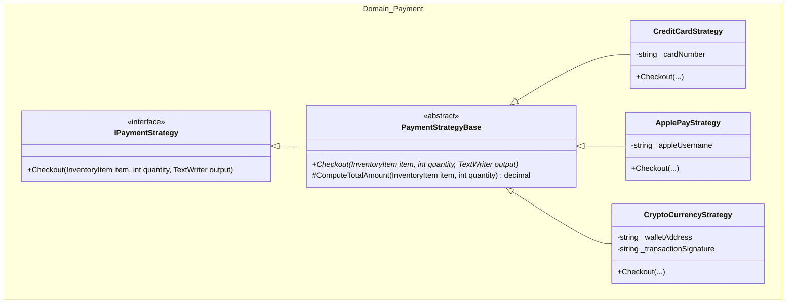

# Payment Strategy Pattern

This directory contains the implementation of the **Strategy Pattern** for processing payments in the tea shop.

## Implementing a New Payment Strategy

To implement a new payment strategy, follow these steps:

1. **Inherit from `PaymentStrategyBase`**: All concrete payment strategies should inherit from the `PaymentStrategyBase`
   abstract class. This ensures access to common functionality like total amount computation.
2. **Define a Constructor**: The constructor should capture any necessary payment-specific information (e.g., account
   details, tokens, or signatures) required to process the transaction.
3. **Override `Checkout`**: Implement the `Checkout` method to define how the payment is processed. Use the
   `ComputeTotalAmount` method from the base class to calculate the final price and output the transaction details to
   the provided `TextWriter`.

### Example: Custom Payment Strategy (`Domain.Payment` namespace)

```csharp
public sealed class GiftCardStrategy : PaymentStrategyBase
{
    private readonly string _giftCardCode;

    public GiftCardStrategy(string giftCardCode)
    {
        _giftCardCode = giftCardCode;
    }

    public override void Checkout(InventoryItem item, int quantity, TextWriter output)
    {
        var total = ComputeTotalAmount(item, quantity);
        output.WriteLine($"Checking out {total:C} using Gift Card (Code: {_giftCardCode}).");
    }
}
```

## Strategy Pattern Structure

The following diagram illustrates the relationship between the strategy interface, the base class, and the concrete
implementations:



### Relationships Explained:

- **`IPaymentStrategy` (Interface)**: Defines the common contract for all payment methods. This allows the application
  to remain decoupled from specific payment implementations.
- **`PaymentStrategyBase` (Abstract Class)**: Provides a base implementation of the interface and includes shared logic,
  such as `ComputeTotalAmount`, which reduces duplication across concrete strategies.
- **Concrete Strategies**: Classes like `CreditCardStrategy`, `ApplePayStrategy`, and `CryptoCurrencyStrategy` implement
  the specific details of each payment method while adhering to the `IPaymentStrategy` contract.

## More Realistic Generic Architecture

In a production environment, the payment strategy system would be more robust:

- **Asynchronous Processing**: The `Checkout` method would be asynchronous (`async Task`) to handle network latency and
  external API calls without blocking the application thread.
- **External API Integration**: Instead of just printing to a `TextWriter`, strategies would interact with payment
  gateways (e.g., Stripe, PayPal, or crypto processors).
- **Result Objects**: Instead of a `void` return type, `Checkout` would return a `PaymentResult` object containing
  transaction IDs, status codes, and error messages.
- **Dependency Injection**: Payment strategies would be registered in a DI container, allowing for easier testing and
  configuration of environment-specific credentials.
