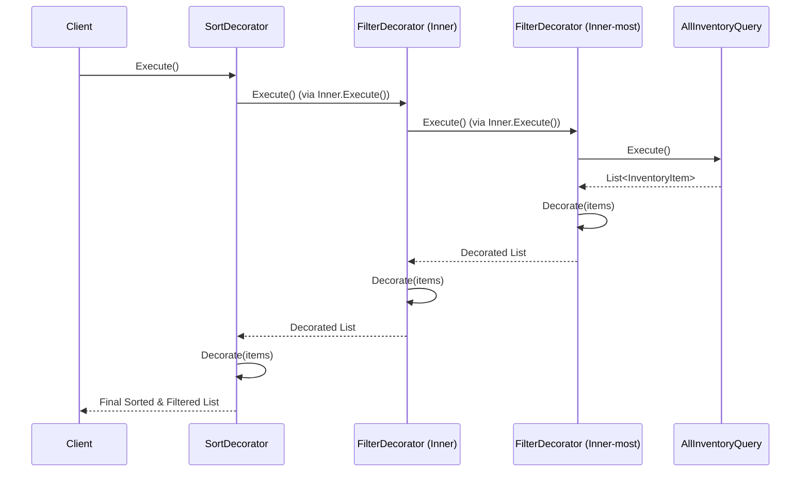

# Query Builder via Decorator

This directory contains the classes and interfaces related to querying and filtering the tea shop's inventory using the Decorator Pattern.

## Implementing a New Filter or Sort Decorator

To implement a new filter or sort concrete decorator, follow these steps:

1.  **Inherit from `InventoryQueryDecoratorBase`**: All concrete decorators must inherit from the `InventoryQueryDecoratorBase` abstract class.
2.  **Define a Constructor**: The constructor should accept an `IInventoryQuery` as its first parameter (the inner query being decorated) and pass it to the base constructor. Any parameters specific to your filter or sort logic should also be defined here.
3.  **Override `AppliedDescription`**: Provide a human-readable description of the filter or sort being applied. This is used to track the list of applied operations.
4.  **Override `Decorate`**: This is where the core logic resides. The `Decorate` method receives an `IReadOnlyList<InventoryItem>` from the inner query. Implement your filtering or sorting logic and return the resulting list.

### Example: Simple Filter Decorator

```csharp
public sealed class MyFilterDecorator : InventoryQueryDecoratorBase
{
    private readonly string _criteria;

    public MyFilterDecorator(IInventoryQuery inner, string criteria) : base(inner)
    {
        _criteria = criteria;
    }

    protected override string? AppliedDescription => $"Filter: MyCriteria = {_criteria}";

    protected override IReadOnlyList<InventoryItem> Decorate(IReadOnlyList<InventoryItem> items)
    {
        return items.Where(i => i.Property == _criteria).ToList().AsReadOnly();
    }
}
```

### Example: Simple Sort Decorator

```csharp
public sealed class MySortDecorator : InventoryQueryDecoratorBase
{
    public MySortDecorator(IInventoryQuery inner) : base(inner) { }

    protected override string? AppliedDescription => "Sort: MyProperty (ascending)";

    protected override IReadOnlyList<InventoryItem> Decorate(IReadOnlyList<InventoryItem> items)
    {
        return items.OrderBy(i => i.MyProperty).ToList().AsReadOnly();
    }
}
```

### Execution Flow Enforcement

The `InventoryQueryDecoratorBase` class uses the **Template Method Pattern** in its `Execute()` method to strictly enforce the order of execution:

```csharp
public IReadOnlyList<InventoryItem> Execute()
{
    var items = Inner.Execute(); // 1. Execute the inner query first
    return Decorate(items);      // 2. Then apply the current decorator's logic
}
```

By making `Execute()` final (non-virtual) and requiring concrete decorators to implement the `Decorate()` method, the base class ensures that the inner query is always processed before the current decorator's logic is applied. This prevents a common pitfall in the Decorator pattern where a decorator might accidentally execute its own logic before the inner component, which would reverse the intended execution flow (the decorator stack) and lead to confusing results, especially when combining multiple filters and sorts.

#### Composing a Query

The following example demonstrates how to compose a query by wrapping the base `AllInventoryQuery` with multiple decorators, matching the structure shown in the sequence diagram below:

```csharp
// 1. Start with the base query 
//    (the inner-most concrete component to be decorated)
IInventoryQuery query = new AllInventoryQuery();

// 2. Wrap with the first filter decorator (Inner-most)
query = new AvailabilityFilterDecorator(query, isAvailable: true);

// 3. Wrap with the second filter decorator (Inner)
query = new MinStarRatingFilterDecorator(query, minRatingInclusive: 4);

// 4. Wrap with the sort decorator (Outer-most)
query = new SortByPriceDecorator(query, SortDirection.Ascending);

// 5. Execute the entire chain
IReadOnlyList<InventoryItem> results = query.Execute();
```

#### Sequence Diagram



### More Realistic Generic Architecture

The current implementation uses a simplistic approach where each decorator in the chain immediately executes its logic on an materialized list. This results in $N \times O(N)$ mutations (where $N$ is the number of decorators), as each step involves creating and populating a new list.

In a more sophisticated, production-ready architecture, one would typically use **deferred execution**. Instead of materializing the list at each step, the decorators would build up a query (e.g., using `IEnumerable<T>` or `IQueryable<T>`). The entire query would then be executed once at the final stage. This is how modern ORMs like **Entity Framework** function, allowing the database to optimize the entire query (including all filters and sorts) before execution, significantly improving performance and reducing memory overhead.
