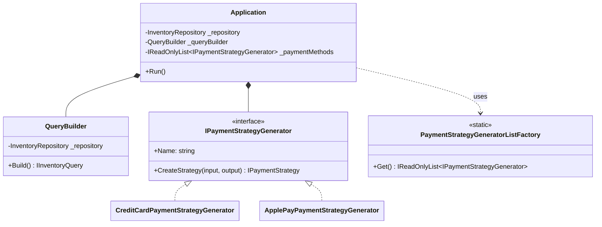

# User Interface Layer

This directory contains the classes and interfaces responsible for managing the user's interaction with the tea shop application. It coordinates the domain logic (inventory, queries, and payments) and provides a text-based console interface.

## Adding a New Payment Method

The application uses a factory-like approach to dynamically create payment strategies based on user input. To add a new payment method:

1.  **Implement `IPaymentStrategyGenerator`**: Create a new class in the `PaymentMethodGenerator` namespace that implements the `IPaymentStrategyGenerator` interface.
2.  **Implement `Name`**: Provide a display name for the payment method (e.g., "PayPal").
3.  **Implement `CreateStrategy`**: This method should handle the UI-specific logic for collecting payment details from the user (via `TextReader`/`TextWriter`) and then return a concrete instance of a `IPaymentStrategy`.
4.  **Register the Generator**: Add your new generator class to the list in `PaymentStrategyGeneratorListFactory.Get()`.

### Example: New Payment Method Generator

```csharp
public sealed class PayPalPaymentStrategyGenerator : IPaymentStrategyGenerator
{
    public string Name => "PayPal";

    public IPaymentStrategy CreateStrategy(TextReader input, TextWriter output)
    {
        output.Write("Enter PayPal Email: ");
        var email = input.ReadLine() ?? string.Empty;
        // In a real app, you'd validate the email here
        return new PayPalStrategy(email); // Returns a Domain strategy
    }
}
```

## UI Architecture

The following diagram illustrates the relationship between the main application controller, the query builder, and the payment strategy generators:



### Key Components:

- **`Application`**: The central controller that manages the main execution loop, prompts the user to search for items, and coordinates the checkout process.
- **`QueryBuilder`**: Decouples the UI logic for gathering search criteria from the domain's query execution. It progressively wraps the `IInventoryQuery` with decorators based on user input.
- **`IPaymentStrategyGenerator`**: Bridges the UI and Domain layers. It captures UI-specific input needed for a payment method and instantiates the corresponding Domain-level `IPaymentStrategy`.

## More Realistic Generic Architecture

In a production-ready application, the User Interface layer would likely be more complex:

- **Separation of Concerns (MVC/MVVM)**: Instead of a single `Application` class handling everything, the UI would be split into Controllers/ViewModels and Views.
- **Dependency Injection**: Generators, repositories, and builders would be injected via a DI container, improving testability and flexibility.
- **Pluggable UI**: The domain layer would be entirely independent of the UI. This would allow the same domain logic to be used across different UI implementations, such as a Web API (using ASP.NET Core), a Mobile App (using MAUI), or a Desktop App (using WPF).
- **Validation Layer**: A dedicated validation system would ensure that all user input is sanitized and validated against domain rules before reaching the business logic.
