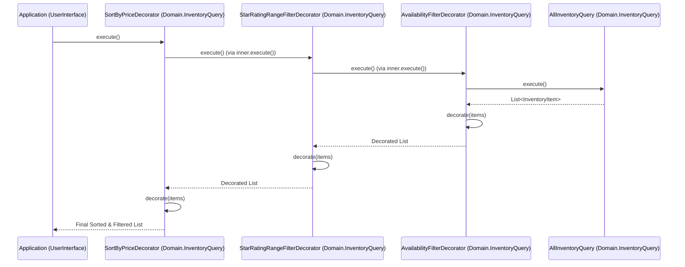

# Query Builder via Decorator (Java)

This directory contains the classes and interfaces related to querying and filtering the tea shop's inventory using the
Decorator Pattern.

## Implementing a New Filter or Sort Decorator

To implement a new filter or sort concrete decorator, follow these steps:

1. **Inherit from `InventoryQueryDecoratorBase`**: All concrete decorators must extend the
   `InventoryQueryDecoratorBase` abstract class.
2. **Define a Constructor**: The constructor should accept an `IInventoryQuery` as its first parameter (the inner query
   being decorated) and pass it to the base constructor. Any parameters specific to your filter or sort logic should
   also be defined here.
3. **Override `getAppliedDescription()`**: Provide a human-readable description of the filter or sort being applied.
   This is used to track the list of applied operations.
4. **Override `decorate(...)`**: This is where the core logic resides. The `decorate` method receives a
   `List<InventoryItem>` from the inner query. Implement your filtering or sorting logic and return the resulting
   list.

### Example: Simple Filter Decorator (`domain.inventoryquery` package)

```java
public final class MyFilterDecorator extends InventoryQueryDecoratorBase {
    private final String criteria;

    public MyFilterDecorator(IInventoryQuery inner, String criteria) {
        super(inner);
        this.criteria = criteria;
    }

    @Override
    protected String getAppliedDescription() {
        return "Filter: MyCriteria = " + criteria;
    }

    @Override
    protected List<InventoryItem> decorate(List<InventoryItem> items) {
        return items.stream()
            .filter(i -> i.getProperty().equals(criteria))
            .collect(Collectors.toUnmodifiableList());
    }
}
```

### Example: Simple Sort Decorator (`domain.inventoryquery` package)

```java
public final class MySortDecorator extends InventoryQueryDecoratorBase {
    public MySortDecorator(IInventoryQuery inner) {
        super(inner);
    }

    @Override
    protected String getAppliedDescription() {
        return "Sort: MyProperty (ascending)";
    }

    @Override
    protected List<InventoryItem> decorate(List<InventoryItem> items) {
        return items.stream()
            .sorted(Comparator.comparing(InventoryItem::getMyProperty))
            .collect(Collectors.toUnmodifiableList());
    }
}
```

### Execution Flow Enforcement

The `InventoryQueryDecoratorBase` class uses the **Template Method Pattern** in its `execute()` method to strictly
enforce the order of execution:

```java
public List<InventoryItem> execute() {
    var items = inner.execute(); // 1. Execute the inner query first
    return decorate(items);      // 2. Then apply the current decorator's logic
}
```

By making `execute()` final (or non-overridable) and requiring concrete decorators to implement the `decorate()`
method, the base class ensures that the inner query is always processed before the current decorator's logic is
applied. This prevents a common pitfall in the Decorator pattern where a decorator might accidentally execute its own
logic before the inner component, which would reverse the intended execution flow (the decorator stack) and lead to
confusing results, especially when combining multiple filters and sorts.

#### Composing a Query

The following example demonstrates how to compose a query by wrapping the base `AllInventoryQuery` with multiple
decorators, matching the structure shown in the sequence diagram below:

```java
// 1. Start with the base query 
//    (the inner-most concrete component to be decorated)
IInventoryQuery query = new AllInventoryQuery(repository);

// 2. Wrap with the first filter decorator (Inner-most)
query = new AvailabilityFilterDecorator(query, true);

// 3. Wrap with the second filter decorator (Inner)
query = new StarRatingRangeFilterDecorator(query, 4, 5);

// 4. Wrap with the sort decorator (Outer-most)
query = new SortByPriceDecorator(query, SortDirection.ASCENDING);

// 5. Execute the entire chain
List<InventoryItem> results = query.execute();
```

#### Sequence Diagram (`domain.inventoryquery` and `userinterface.querybuilder`)



### More Realistic Generic Architecture

The current implementation uses a simplistic approach where each decorator in the chain immediately executes its logic
on a materialized list. This results in $N \times O(N)$ mutations (where $N$ is the number of decorators), as each step
involves creating and populating a new list.

In a more sophisticated, production-ready architecture, one would typically use **deferred execution**. Instead of
materializing the list at each step, the decorators would build up a query (e.g., using Java Streams). The entire query
would then be executed once at the final stage. This is similar to how modern ORMs optimize queries by combining
filters and sorts before execution.
