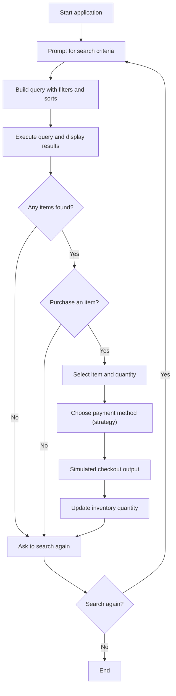
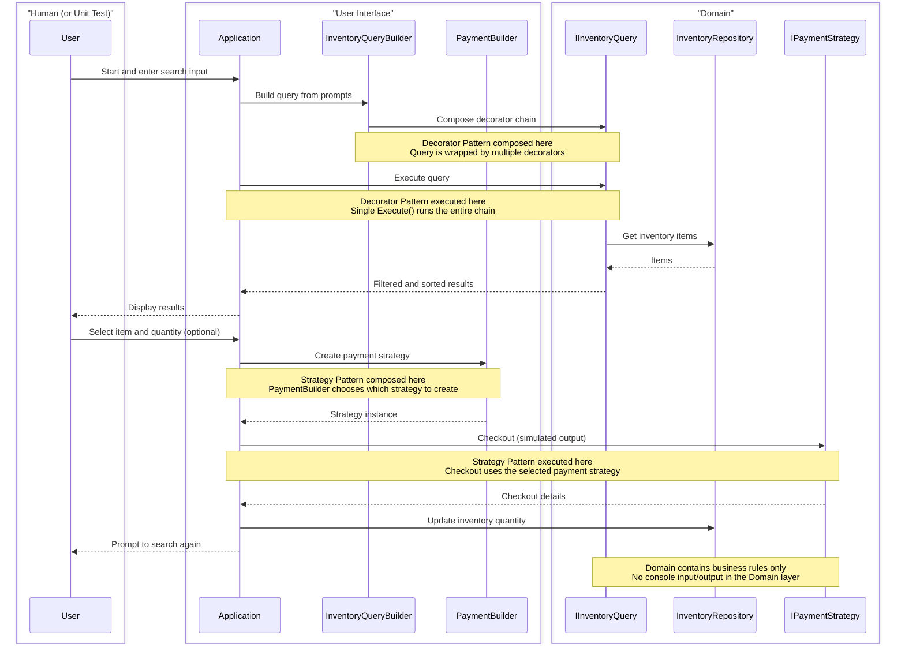

# Assignment 2

## Single Responsibility, Open-Closed Principle, Strategy Pattern, and Decorator Pattern
#### OO Foundations Practice

[KSU SWE 4743: Object-Oriented Design](../README.md)

---

## Overview

In this assignment, you will build a **console-based Tea Shop application** that allows users to **search, filter, sort,
and purchase** tea from an inventory.

This assignment is **not about UI polish**. It is explicitly about demonstrating correct and intentional use of:

- The **Single Responsibility Principle (SRP)**
- The **Open/Closed Principle (OCP)**
- The **Strategy Pattern**
- The **Decorator Pattern**
- **Encapsulation**
- **Polymorphism and dynamic dispatch**

Your implementation should be clean, readable, and easy to reason about.

## Table of Contents

- [Learning Objectives](#learning-objectives)
- [Application Requirements](#application-requirements)
- [Inventory and Search](#inventory-and-search)
- [Query Filters and Sorts](#query-filters-and-sorts)
- [Query Output](#query-output)
- [Purchasing and Checkout](#purchasing-and-checkout)
- [Search Loop](#search-loop)
- [Input Handling and Defaults](#input-handling-and-defaults)
- [Example Implementation Console Output](#example-implementation-console-output)
- [Required Design Architecture](#required-design-architecture)
- [Domain vs UserInterface (Required)](#domain-vs-userinterface-required)
- [Interfaces (Required)](#interfaces-required)
- [Abstract Classes (Required)](#abstract-classes-required)
- [Concrete Classes (Examples)](#concrete-classes-examples)
- [SOLID Requirements](#solid-requirements)
- [Single Responsibility Principle (SRP)](#single-responsibility-principle-srp)
- [Open-Closed Principle (OCP)](#open-closed-principle-ocp)
- [Strategy Pattern Requirements](#strategy-pattern-requirements)
- [Decorator Pattern Requirements](#decorator-pattern-requirements)
- [Encapsulation Requirements](#encapsulation-requirements)
- [Polymorphism & Dynamic Dispatch](#polymorphism--dynamic-dispatch)
- [File Organization (Required)](#file-organization-required)
- [Starter Repository Structure (Required)](#starter-repository-structure-required)
- [Top-level Layout (Both Languages)](#top-level-layout-both-languages)
- [C# Starter Structure](#c-starter-structure)
- [Java Starter Structure](#java-starter-structure)
- [Sequence Diagram](#sequence-diagram)
- [Technical Requirements](#technical-requirements)
- [README.md Requirements (Mandatory)](#readmemd-requirements-mandatory)
- [Coding Standards (Required)](#coding-standards-required)
- [Main / Program Entry Point Requirements](#main--program-entry-point-requirements)
- [Constraints (Important)](#constraints-important)
- [FAQ](#faq)
- [Final Advice](#final-advice)
- [Submitting Your Assignment](#submitting-your-assignment)
- [Solutions](#solutions)

---

## Learning Objectives

By completing this assignment, you will demonstrate that you can:

- Design software around **principles and patterns** instead of ad-hoc conditionals
- Apply **SRP** by keeping classes focused on a single responsibility
- Apply **OCP** by extending behavior without modifying core logic
- Use the **Strategy Pattern** to encapsulate payment behavior
- Use the **Decorator Pattern** to compose filters and sorts at runtime
- Separate **Domain** logic from **User Interface** logic
- Use **polymorphism and dynamic dispatch** instead of type checking
- Protect internal state via **encapsulation**
- Organize a medium-sized console application into cohesive classes
- Document a console application using a clear, professional `README.md`

---

## Application Requirements

Your tea shop must support **searching**, **filtering**, **sorting**, and **purchasing**.

> Note: These are user requirements - not technical design - so the material here is focused on *what* the application will do, not *how*. The *how* is detailed after this section.

### Inventory and Search

- Store a **pre-defined inventory** of teas (at least 12 items).
- Users must be able to search and refine results using prompts.

Each tea item must include the following fields:
- Name
- Price
- Quantity
- Star rating (1-5)

### Query Filters and Sorts

Your query builder must support **all** of the following:

- Filter: name contains (case-insensitive, optional)
- Filter: availability (in stock vs out of stock)
- Filter: price range (min and max)
- Filter: star rating range (min and max)
- Sort: price (ascending or descending)
- Sort: star rating (ascending or descending)

### Query Output

After executing a query, display:

- A list of **applied filters and sorts**
- A **numbered result list**

The result list must show:
- Index
- Name
- Price
- Quantity (or "OUT OF STOCK")
- Star rating

### Purchasing and Checkout

If the query returns results, allow the user to:

- Select an item by number
- Choose a quantity (must be in stock)
- See a total price
- Choose a payment method
- Complete checkout and update inventory

Required payment methods:

- Credit Card
- Apple Pay
- CryptoCurrency

### Search Loop

After checkout (or skipping checkout), prompt the user to search again.

---

### High-Level Flow



---

### Input Handling and Defaults

All prompts should be **case-insensitive** and support **blank input** for defaults.

Defaults must match the following:

- Availability: default **Yes**
- Price minimum: default **0**
- Price maximum: default **1000**
- Star rating minimum: default **3**
- Star rating maximum: default **5**
- Sort by price: default **Ascending**
- Sort by star rating: default **Descending**
- Purchase selection: blank means **skip purchase**
- Search again: blank means **Yes**

For invalid input, re-prompt with a clear error message.

These small UX decisions help users focus on their goal (finding and purchasing tea) instead of struggling with narrow input rules. Never forget the user experience.

---

### Example Implementation Console Output

```
WELCOME TO JEFF'S TEA SHOP

Complete the prompts to search our selection of fine teas.

* Tea name contains (leave blank for all names):
* Is available? (Y/N, default Y):
* Price minimum (default $0):
* Price maximum (default $1000):
* Star rating minimum (1-5, default 3):
* Star rating maximum (1-5, default 5):
* Sort by Price (A/D, default A):
* Sort by Star rating (A/D, default D):

Applied Filters and Sorts:
- Filter: Availability = In Stock (Quantity > 0)
- Filter: Star rating between 3 and 5
- Sort: Price (ascending)
- Sort: Star rating (descending)

7 items matched your query:
 1. Green Tea            $15.99  Qty: 50    4 stars
 2. Jasmine Green        $16.75  Qty: 35    4 stars
 3. Oolong Tea           $18.00  Qty: 10    5 stars
 4. Sencha               $19.25  Qty: 40    4 stars
 5. Darjeeling           $21.60  Qty: 18    5 stars
 6. White Tea            $22.50  Qty: 25    4 stars
 7. Matcha               $29.99  (OUT OF STOCK)  4 stars

Purchase an item? Enter item number 1-7 or 0 to continue (default):
Quantity for "Green Tea" (1-50): 2
*** Total Price: $31.98
*** Choose a payment method:
1. Credit Card
2. Apple Pay
3. CryptoCurrency
Selection: 1
Enter Credit Card Number: 1234567890123456
*** Purchase complete. Your 2 packages of Green Tea is on the way ***

Search for more tea? (Y/N, default Y):
```

---

## Required Design Architecture

### Domain vs UserInterface (Required)

Your solution must separate **Domain logic** from **User Interface logic**.

- Domain contains inventory, inventory queries, and payment strategies.
- UserInterface contains console I/O, prompts, and flow control.
- Domain **must not** call `Console.ReadLine()` or `Console.WriteLine()`.

### Interfaces (Required)

At minimum:

- C# `IInventoryQuery`
  Java `InventoryQuery`
  > This is your decorator interface for querying and sorting the tea repository.
  
- C# `IPaymentStrategy`
  Java `PaymentStrategy`
  > This is your strategy interface for accepting payment via various payment processors.

These interfaces must define behavior, not implementation details.

### Abstract Classes (Required)

At minimum:

- `InventoryQueryDecoratorBase`
  > This is where your "inner" reference to the decorated instance lives.
- `PaymentStrategyBase`
  > This is where any shared payment logic goes, such as amount.

### Concrete Classes (Examples)

You may rename classes, but the roles must be clear. Group your classes by concern:

Domain (Inventory):
- `InventoryItem` - this is a row of inventory data
- `StarRating` - this is a class implementing the 1-5 invariant validation rule
- `InventoryRepository` - this exposes the inventory data and provides safe mutation methods

Domain (InventoryQuery / Decorator):
- `AllInventoryQuery` - the base query class to be decorated
- `InventoryQueryDecoratorBase`
- `QueriedInventoryItem`
- `SortDirection`
- `NameContainsFilterDecorator`
- `AvailabilityFilterDecorator`
- `MinStarRatingFilterDecorator`
- `PriceRangeFilterDecorator`
- `StarRatingRangeFilterDecorator`
- `SortByPriceDecorator`
- `SortByStarRatingDecorator`

Domain (Payment):
- `PaymentStrategyBase`
- `CreditCardStrategy`
- `ApplePayStrategy`
- `CryptoCurrencyStrategy`

User Interface:
- `Application`
- `InventoryQueryBuilder`
- `InventoryQueryOutput`
- `InventoryQueryOutputWriter`
- `PaymentBuilderListFactory`
- `CreditCardPaymentBuilder`
- `ApplePayPaymentBuilder`
- `CryptoCurrencyPaymentBuilder`

Each class must have **one clear responsibility**.

---

## SOLID Requirements

### Single Responsibility Principle (SRP)

- A class should have **one reason to change**.
- Do not mix UI prompting with domain rules.
- Do not place inventory filtering logic inside your UI classes.

### Open-Closed Principle (OCP)

- You should be able to add a **new payment method** by adding a new class,
  without modifying the checkout logic.
- You should be able to add a **new filter or sort** by adding a new decorator,
  without modifying the query builder or query engine.

---

## Strategy Pattern Requirements

You must implement payment processing using the **Strategy Pattern**:

- The application must depend on `IPaymentStrategy`, not concrete types.
- Each strategy must encapsulate its own checkout logic.
- Do **not** use `if/else` or `switch` statements on payment type.

Note: Payment processing is **simulated** by printing output to the console. You are not building real payment
integrations for this assignment.

---

## Decorator Pattern Requirements

You must implement inventory queries using the **Decorator Pattern**:

- The base query returns all inventory items.
- Each filter/sort wraps another `IInventoryQuery`.
- Decorators must override a single method that applies their specific logic.
- The final query is executed by calling `Execute()` once.

---

## Encapsulation Requirements

- The inventory list must not be publicly mutable.
- Inventory updates must go through repository methods.
- Star ratings must enforce the 1-5 invariant.
- Quantities must never become negative.

---

## Polymorphism & Dynamic Dispatch

- Payment methods will be executed through the `IPaymentStrategy` interface.
- Payment selection must execute the simulated payment operation without knowing the concrete type.
- Queries must be built and executed as `IInventoryQuery`, not concrete decorators.

---

## File Organization (Required)

- Each class must be in its own file.
- Do not create "God files" or "God classes".
- Use logical namespace or package structure.

---

## Starter Repository Structure (Required)

Students must organize their repository using the following structure.

### Top-level Layout (Both Languages)

```
tea-shop/
|
|-- README.md
|-- screenshot.png
|
|-- src/
|   `-- (your solution)
|
`-- .gitignore
```

---

### C# Starter Structure

```
tea-shop/
|
|-- README.md
|-- screenshot.png
|-- TeaShop.sln
|
|-- src/
|   `-- TeaShop/
|       |-- TeaShop.csproj
|       |-- Program.cs
|       |
|       |-- Domain/
|       |   |-- Inventory/
|       |   |-- InventoryQuery/
|       |   `-- Payment/
|       |
|       `-- UserInterface/
|           |-- Application.cs
|           |-- QueryBuilder/
|           `-- PaymentBuilder/
|
`-- .gitignore
```

Recommended namespaces:

```text
Assignment2Solution.Domain.Inventory
Assignment2Solution.Domain.InventoryQuery
Assignment2Solution.Domain.Payment
Assignment2Solution.UserInterface
Assignment2Solution.UserInterface.QueryBuilder
Assignment2Solution.UserInterface.PaymentBuilder
```

Note the careful separation of domain logic and UI logic. The UI references the domain logic. The domain logic has no knowledge of the UI.

---

### Java Starter Structure

```
tea-shop/
|
|-- README.md
|-- screenshot.png
|
|-- src/
|   `-- main/
|       `-- java/
|           `-- edu/
|               `-- kennesaw/
|                   `-- teashop/
|                       |
|                       |-- Main.java
|                       |
|                       |-- domain/
|                       |   |-- inventory/
|                       |   |-- inventoryquery/
|                       |   `-- payment/
|                       |
|                       `-- userinterface/
|                           |-- Application.java
|                           |-- querybuilder/
|                           `-- paymentbuilder/
|
`-- .gitignore
```

Students **must not** use the default package in Java.

Note the careful separation of domain logic and UI logic. The UI references the domain logic. The domain logic has no knowledge of the UI.


---

## Sequence Diagram

The following diagram visually demonstrates how to separate user interface concerns (console logic) from domain concerns. Your implementation does not have to match this, but it should demonstrate the same concepts.

> Reminder: Builders (mechanisms that collect the input required by domain logic) live in the **User Interface** layer, while strategies and queries live in the **Domain** layer.



---

## Technical Requirements

### Language

- Your console application must be written in **C#** or **Java**.

### Repository and Submission

- Application must be submitted via a public **GitHub repository**.
- Commit history should show incremental development.

Your repository must include:
- Source code under the `/src` folder.
- A `README.md` with an inline screenshot.
- A `.gitignore` file appropriate to C# or Java.

### Unit Tests (Optional)

The provided solution includes unit tests. You may **optionally** implement tests using:

- C#: **xUnit**
- Java: **JUnit**

If you choose to write tests:

- Tests must run from the command line (no IDE required).
- Tests should **not** require interactive console input.
- Update your `README.md` with test execution instructions.

---

## README.md Requirements (Mandatory)

Your repository **must include a `README.md`** with:

### 1. Project Description

- Brief explanation of the Tea Shop application.
- Description of SRP, OCP, Strategy, and Decorator usage.

### 2. How to Run the Application (Console)

- **Not from an IDE**.
- Examples:

**C#:**
```bash
dotnet run --project TeaShop/TeaShop.csproj
```

**Java (example):**
```bash
javac *.java
java edu.kennesaw.teashop.Main
```

(Maven or Gradle acceptable if clearly documented)

#### Docker

Including Docker execution instructions really simplifies clone-and-go trials of your application. This is excellent experience and highly recommended. See the C# solution README for an example.

### 3. Screenshot

- Include at least one screenshot of the running application.
- Display it inline using Markdown:

```markdown

```

### 4. Tests (Optional)

- If you implemented unit tests, include how to run them.

> Note: If you find running tests against your UI logic too challenging, limit your tests to your domain logic only. It is better to have limited unit test coverage than no coverage.

---

## Coding Standards (Required)

Your code must follow standard conventions for your chosen language.

### C#

Microsoft C# Coding Conventions  
https://learn.microsoft.com/en-us/dotnet/csharp/fundamentals/coding-style/coding-conventions

### Java

Oracle Java Code Conventions  
https://www.oracle.com/java/technologies/javase/codeconventions-introduction.html

---

## Main / Program Entry Point Requirements

Your `Main` method (Java) or `Program.Main` (C#) must be **short and boring**.

### What `Main` is allowed to do

- Create top-level objects (repository, builders, application)
- Wire dependencies together
- Start the application (e.g., `app.Run()`)

### What `Main` must NOT do

- Query logic
- Payment logic
- Inventory filtering logic
- UI loops

If your `Main` method is more than ~20-30 lines, it is probably doing too much.

Prefer `Main` to follow the **Composition Root** pattern: create objects, wire dependencies, and start the application.

### Example: Proper `Main` in C#

```csharp
using Assignment2Solution.UserInterface;

namespace Assignment2Solution;

public static class Program
{
    public static void Main()
    {
        var application = new Application(Console.In, Console.Out);
        application.Run();
    }
}
```

### Example: Proper `Main` in Java

```java
package edu.kennesaw.teashop;

import edu.kennesaw.teashop.userinterface.Application;

public class Main {
    public static void main(String[] args) {
        Application app = new Application(System.in, System.out);
        app.run();
    }
}
```

> Note: Your package and imports must match your actual folder/package structure.

---

## Constraints (Important)

**Do NOT:**

- Use `if/else` or `switch` statements to select payment logic
- Put filtering/sorting logic inside UI classes
- Mix Domain logic with Console I/O
- Use external libraries
- Add unnecessary features
- Create God classes or God methods
- Put multiple top-level classes in a single file

**DO:**

- Add behavior by adding new classes
- Keep each class narrowly focused
- Keep the Domain layer free of UI concerns
- Use interfaces and abstract base classes appropriately

---

## FAQ

## 1. "Can I put all logic in `Application` and refactor later?"
**This is a bad approach. Layout your project according to the guidelines in this document, then attempt to get it working one step at a time. If you cannot get the decorator working, get the query prompts working, then refactor into the decorator pattern. But do not write a monolithic solution in Application, then try to split a thousand lines of code into the appropriate places.**

This assignment is about **design**, not refactoring.

---

## 2. "Can I use a big `switch` on payment type or filters?"
**No.**

This defeats the Strategy and Decorator patterns.

If you are having trouble understanding how to implement the patterns, create another throwaway project just to understand the technique, then return to this one.

> Pro Tip: I regularly follow this approach... I try really simple techniques in LinqPad or create throwaway projects in an IDE. The goal is to understand the technique, then learn how to apply it to your problem domain.

---

## 3. "Do I have to match the provided class names exactly?"
**No**, but your design must clearly demonstrate:

- SRP and OCP
- Strategy Pattern
- Decorator Pattern
- Encapsulation
- Polymorphism and dynamic dispatch

---

## 4. "Can I use a database or JSON file for inventory?"
**No.**

Use a simple in-memory repository for this assignment.

The following examples include:

- Unique ID
- Name
- Price
- Quantity
- Star Rating (do not make this a simple integer - make it a class that can enforce the 1-5 invariant rule).

### Example: 12-item Inventory List (C#)

```csharp
var items = new List<InventoryItem>
{
    new(Guid.NewGuid(), "Green Tea", 15.99m, 50, new StarRating(4)),
    new(Guid.NewGuid(), "Black Tea", 12.49m, 75, new StarRating(5)),
    new(Guid.NewGuid(), "Herbal Tea", 14.29m, 30, new StarRating(3)),
    new(Guid.NewGuid(), "Oolong Tea", 18.00m, 10, new StarRating(5)),
    new(Guid.NewGuid(), "Matcha", 29.99m, 0, new StarRating(4)),
    new(Guid.NewGuid(), "White Tea", 22.50m, 25, new StarRating(4)),
    new(Guid.NewGuid(), "Chai Tea", 10.99m, 60, new StarRating(3)),
    new(Guid.NewGuid(), "Earl Grey", 13.99m, 45, new StarRating(5)),
    new(Guid.NewGuid(), "Rooibos", 17.10m, 0, new StarRating(5)),
    new(Guid.NewGuid(), "Mint Tea", 11.89m, 80, new StarRating(1)),
    new(Guid.NewGuid(), "Jasmine Green", 16.75m, 35, new StarRating(4)),
    new(Guid.NewGuid(), "Darjeeling", 21.60m, 18, new StarRating(5))
};
```

### Example: 12-item Inventory List (Java)

```java
List<InventoryItem> items = List.of(
    new InventoryItem(UUID.randomUUID(), "Green Tea", 15.99, 50, new StarRating(4)),
    new InventoryItem(UUID.randomUUID(), "Black Tea", 12.49, 75, new StarRating(5)),
    new InventoryItem(UUID.randomUUID(), "Herbal Tea", 14.29, 30, new StarRating(3)),
    new InventoryItem(UUID.randomUUID(), "Oolong Tea", 18.00, 10, new StarRating(5)),
    new InventoryItem(UUID.randomUUID(), "Matcha", 29.99, 0, new StarRating(4)),
    new InventoryItem(UUID.randomUUID(), "White Tea", 22.50, 25, new StarRating(4)),
    new InventoryItem(UUID.randomUUID(), "Chai Tea", 10.99, 60, new StarRating(3)),
    new InventoryItem(UUID.randomUUID(), "Earl Grey", 13.99, 45, new StarRating(5)),
    new InventoryItem(UUID.randomUUID(), "Rooibos", 17.10, 0, new StarRating(5)),
    new InventoryItem(UUID.randomUUID(), "Mint Tea", 11.89, 80, new StarRating(1)),
    new InventoryItem(UUID.randomUUID(), "Jasmine Green", 16.75, 35, new StarRating(4)),
    new InventoryItem(UUID.randomUUID(), "Darjeeling", 21.60, 18, new StarRating(5))
);
```

---

## 5. "Do I have to write unit tests?"
**No.**

Tests are optional, but encouraged.

Why? Tests increase your confidence that refactors do not break behavior, and they expose design problems early.

UI tests are slightly harder because input and output are interactive. To make them testable, you must plan for it in your OO design by abstracting I/O behind `TextReader`/`TextWriter` (or similar) so tests can inject fake input and capture output. This is exactly the kind of design thinking this assignment is trying to build.

See the C# solution for a demonstration of this technique.

---

## 6. "Can I add more filters or payment methods?"
**Yes,** but only after you complete the required features.

---

## Final Advice

- A **simple, boring, well-designed** solution is better than a clever but tangled one.
- Focus on clear responsibilities and clean boundaries.

---

## Submitting Your Assignment

**Assignments are not graded**; the work is its own reward. The primary goal is learning and feedback, not points.

I am happy to provide a detailed review of your assignment upon request. Reviews are typically conducted via a recorded Loom video.

**To request an assignment review:**

1. Complete all (or part) of the assignment.
2. Push your work to a public GitHub repository in your GitHub account.
3. Email me the repository URL that I can clone at JAdkiss1@Kennesaw.edu.

   > I will not review code submitted as a zip file. Learning how to properly use source control to share work is an expected part of this course.

**Before requesting a review, ensure that:**

- your code compiles, and
- your `README.md` includes clear console execution instructions.

---

## Solutions

There are two solutions available:

- [C# solution](assignment-2-solution/src-csharp/README.md)
- Java solution - converted from the C# solution via AI using Codex and VS Code

[Visit the Assignment 2 solution folder](assignment-2-solution/README.md) for links to the source you wish to review.

#### Executing Solutions from the CLI

Each solution includes CLI commands to execute the solution using the appropriate language commands.

#### Executing Solutions Using Docker

You can also run the solutions using Docker. Each solution includes a Dockerfile that:

- defines a consistent runtime environment,
- copies the source code into the container,
- compiles the source into an executable, and
- runs the compiled application.

Docker is optional but recommended if you do not have the required tooling installed locally.
