# Assignment 3

## Tea Shop MVC Application using SOLID Architecture

### Using Factory, Singleton, Strategy, Decorator, and Dependency Injection

[KSU SWE 4743: Object-Oriented Design](../README.md)


---

## Overview

In this assignment, you will evolve your **Assignment 2 Tea Shop** from a console application into a **server-rendered MVC web application** using either:

- **C# with ASP.NET Core MVC  
  [Overview of ASP.NET Core MVC](https://learn.microsoft.com/en-us/aspnet/core/mvc/overview?view=aspnetcore-10.0) | [Get started with ASP.NET Core MVC](https://learn.microsoft.com/en-us/aspnet/core/tutorials/first-mvc-app/start-mvc?view=aspnetcore-10.0)
- Java with Spring Boot (Maven) and MVC templates  
  [Developing Your First Spring Boot Application](https://docs.spring.io/spring-boot/tutorial/first-application/index.html) | [Spring Boot Maven Plugin: Getting Started](https://docs.spring.io/spring-boot/maven-plugin/getting-started.html)
  
  > If you are new to Spring Boot project setup, using [Spring Initializr](https://start.spring.io/) is strongly recommended.

**The goal of this assignment is to explore SOLID principles and the patterns covered so far in a moderately complex web application while using good dependency injection practice.**

The application must preserve the core behavior from Assignment 2:

- Search tea inventory
- Filter and sort results
- Purchase tea with a selected payment method
- Update in-memory inventory quantities after checkout

This assignment is still primarily about **design quality**, not visual polish.

You must demonstrate intentional use of:

- **All SOLID principles** ([SRP](../presentations/04-single-responsibility-principle.md), [OCP](../presentations/05-open-closed-principle-and-decorator.md), [LSP](../presentations/06-liskov-substitution-principle.md), [ISP](../presentations/07-interface-segregation-principle.md), [DIP](../presentations/09-dependency-inversion-principle.md))
- **Dependency Injection** ([Lecture 10](../presentations/10-dependency-injection.md))
- **Factory Pattern** (payment strategy selection, [Lecture 8](../presentations/08-factory-singleton.md))
- **Decorator Pattern** (tea filtering/sorting query composition, [Lecture 5](../presentations/05-open-closed-principle-and-decorator.md))
- **Singleton Pattern via DI** (DI-managed in-memory inventory repository; no global accessor, [Lecture 8](../presentations/08-factory-singleton.md), [Lecture 10](../presentations/10-dependency-injection.md))
- **Thread-safe mutation** of shared inventory quantity state

You are building a **traditional MVC web app**, not a SPA.

Assignment 2 references:

- [Assignment 2 specification](assignment-2.md)
- [Assignment 2 solution index](assignment-2-solution/README.md)
- [Assignment 2 C# solution](assignment-2-solution/src-csharp/README.md)
- [Assignment 2 Java solution](assignment-2-solution/src-java/README.md)

> If you have not performed Assignment 2, consider using the Assignment 2 solution as your starting point. 

### Video introduction

[Watch this video generated by NotebookLM to get started.](assignment-3-video-intro.mp4)

### Do not be a transactional student that only performs an assignment for a grade!

**The work is its own reward.** 

This assignment is not graded or timed, so you have plenty of freedom to execute it within your schedule.µ Without practice, you are hurting your ability to execute in a very competitve market. 

Do not be a bystander in your career - use this time to become the expert engineer you are capable of becoming.

### Code with intention! 

Contastantly work to evolve your solution not only to achieve a working solution, but to also produce a solution that is maintainable and durable over a long period within a team of developers. 

**This is the path to success in any engineering discipline.**

---

## Table of Contents

- [Overview](#overview)
- [Learning Objectives](#learning-objectives)
- [Application Requirements](#application-requirements)
- [Required Design Architecture](#required-design-architecture)
- [SOLID Requirements](#solid-requirements)
- [Factory Pattern Requirements](#factory-pattern-requirements)
- [Decorator Pattern Requirements](#decorator-pattern-requirements)
- [Singleton Inventory Repository Requirements](#singleton-inventory-repository-requirements)
- [Dependency Injection Requirements](#dependency-injection-requirements)
- [Web MVC Requirements](#web-mvc-requirements)
- [File Organization (Required)](#file-organization-required)
- [Starter Repository Structure (Required)](#starter-repository-structure-required)
- [Sequence Diagram](#sequence-diagram)
- [Technical Requirements](#technical-requirements)
- [README.md Requirements (Mandatory)](#readmemd-requirements-mandatory)
- [Coding Standards (Required)](#coding-standards-required)
- [Program Entry Point / Composition Root Requirements](#program-entry-point--composition-root-requirements)
- [Constraints (Important)](#constraints-important)
- [Code Smells to Avoid](#code-smells-to-avoid)
- [FAQ](#faq)
- [Final Advice](#final-advice)
- [Submitting Your Assignment](#submitting-your-assignment)
- Assignment 3 Solution
  *Coming soon!*
- [Appendix: Seed Data](#appendix-seed-data)

---

## Learning Objectives

By completing this assignment, you will demonstrate that you can:

- Evolve an existing OO design into a web MVC architecture while preserving behavior
- Apply **[SRP](../presentations/04-single-responsibility-principle.md)** through clean class and service boundaries
- Apply **[OCP](../presentations/05-open-closed-principle-and-decorator.md)** through additive extension points
- Apply **[LSP](../presentations/06-liskov-substitution-principle.md)** through substitution-safe contracts and implementations
- Apply **[ISP](../presentations/07-interface-segregation-principle.md)** through focused interfaces aligned to client needs
- Apply **[DIP](../presentations/09-dependency-inversion-principle.md)** by depending on abstractions, not details
- Use **[Dependency Injection](../presentations/10-dependency-injection.md)** to compose object graphs cleanly
- Use **[Factory Pattern](../presentations/08-factory-singleton.md)** to select payment strategies without branching in business flow
- Use **[Decorator Pattern](../presentations/05-open-closed-principle-and-decorator.md)** to compose runtime inventory query behavior
- Use a **[Singleton](../presentations/08-factory-singleton.md)** repository responsibly in a concurrent web server
- Implement thread-safe inventory quantity mutations that prevent race conditions
- Deliver a runnable web app via **Docker** with professional README documentation

---

## Application Requirements

Your Tea Shop web application must support **filtering**, **sorting**, and **purchasing**, with behavior equivalent to [Assignment 2](assignment-2.md).

> Note: This section defines *what* the application must do. Architecture and design constraints are defined later.

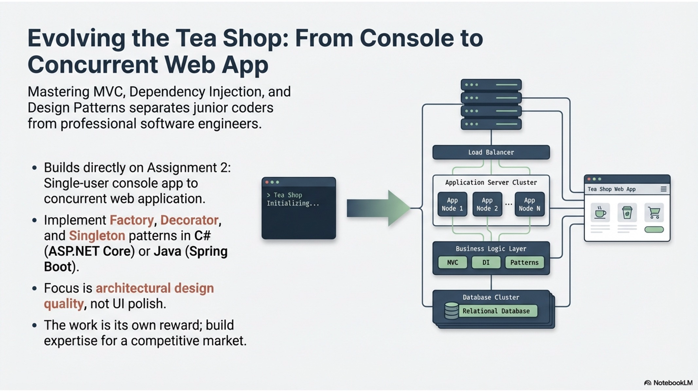

### Functional Parity with Assignment 2

Your Assignment 3 application must preserve all core user capabilities from [Assignment 2](assignment-2.md), but in a web workflow instead of an interactive console loop.

- Users can submit search criteria
- Users can view filtered/sorted tea results
- Users can choose an item and quantity to purchase
- Users can choose payment method
- Inventory quantity updates after successful checkout
- Users can perform additional searches and purchases

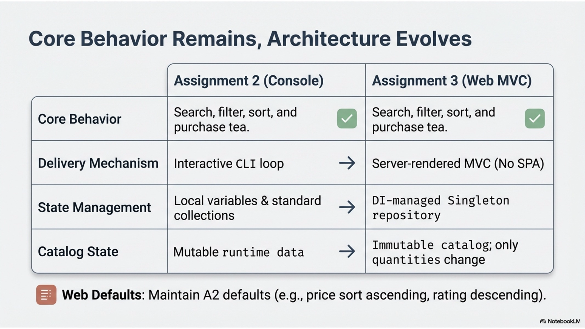

### Web User Experience Requirements

The web UI should be intentionally simple and server-rendered:

- No SPA frameworks
- No heavy client-side logic for business rules
- Use MVC controllers and server-side views/templates
- Use standard HTML forms for user input
- Keep JavaScript minimal and optional

> UI polish is not the primary grading focus. However, in interviews and portfolio walkthroughs, a clean presentation helps communicate professionalism and project quality.  
> For minimal effort with good visual results, consider using [Pico CSS](https://picocss.com/).
>
> https://blog.logrocket.com/getting-started-pico-css/

### Inventory and Search

- Use a **pre-defined in-memory inventory** of at least 12 items
- Load your seed data from the [Appendix inventory repository template](#inventory-repository-data-and-shape-required-template)
- Inventory item fields must include:
  - Name
  - Price
  - Quantity
  - Star rating (1-5)
- Users can search and refine using web form inputs

### Query Filters and Sorts

Your query pipeline must support all of the following:

- Filter: name contains (case-insensitive, optional)
- Filter: availability (in stock vs out of stock)
- Filter: price range (min and max)
- Filter: star rating range (min and max)
- Sort: price (ascending or descending)
- Sort: star rating (ascending or descending)

### Query Output

After executing a query, show:

- The applied filters/sorts summary
- A numbered or clearly selectable result list

Each result must show:

- Name
- Price
- Quantity (or `OUT OF STOCK`)
- Star rating

### Purchasing and Checkout

If query results contain purchasable items, allow the user to:

- Select an item
- Choose a purchase quantity
- View calculated total price
- Select payment method
- Complete checkout

Required payment methods:

- Credit Card
- Apple Pay
- CryptoCurrency

Payment is simulated (no real provider integration required).

### Input Handling and Defaults

Default behavior must match Assignment 2 where applicable:

- Availability default: `Yes` (in stock)
- Price min default: `0`
- Price max default: `1000`
- Star min default: `3`
- Star max default: `5`
- Sort by price default: ascending
- Sort by rating default: descending

Validation requirements:

- Invalid input must return user-friendly validation messages
- Quantity cannot exceed current stock
- Quantity cannot be less than 1 during checkout

### High-Level Web Flow

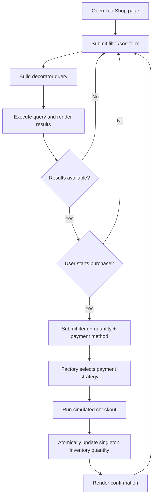

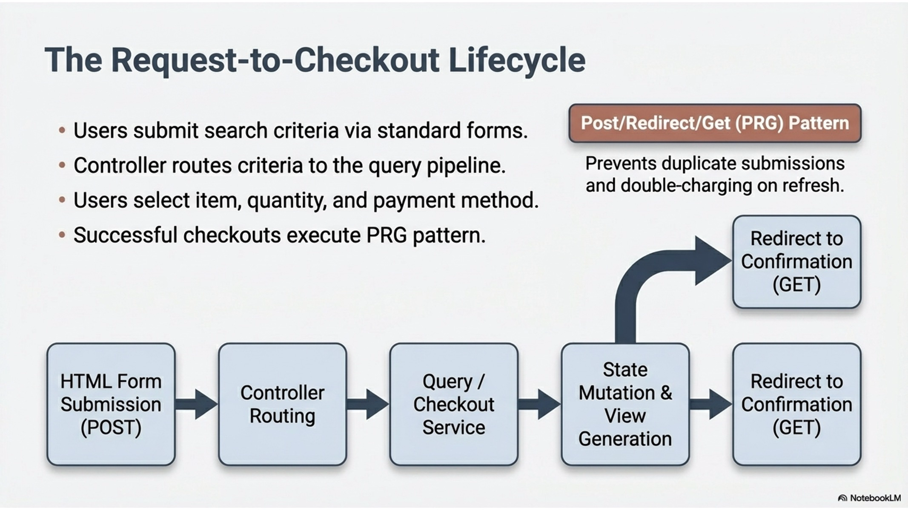

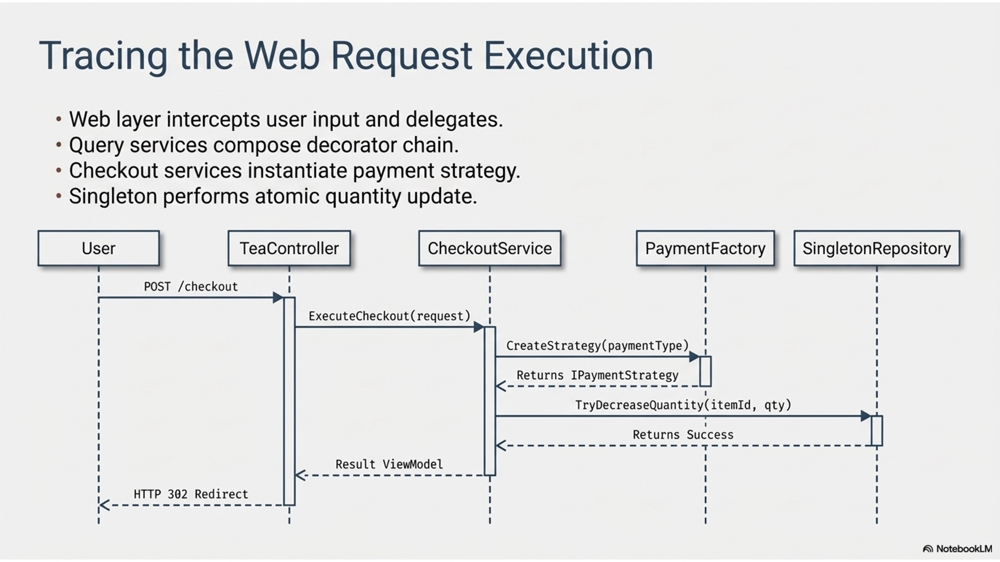

---

## Required Design Architecture

### Layering Rules (Required)

You must separate the solution into clear layers.

- **Domain layer**
  - Entities/value objects (`InventoryItem`, `StarRating`, etc.)
  - Query abstractions/decorators
  - Payment strategy abstractions/implementations

- **Application/Service layer**
  - Use-case orchestration services (query service, checkout service)
  - Factory interfaces/implementations
  - Repository abstractions

- **Web layer (MVC)**
  - Controllers
  - View models
  - Views/templates
  - Request/response mapping

Rules:

- Controllers must not implement business rules
- Domain layer must not depend on MVC/web framework types
- Views/templates must not contain business logic

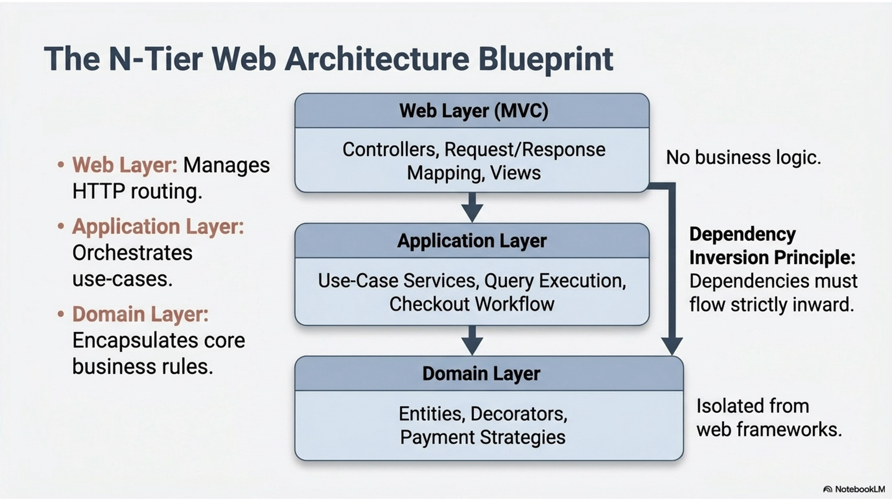

### Required Interfaces and Services

At minimum, your solution must include contracts equivalent to the following responsibilities:

- `InventoryRepository` abstraction for reading inventory and mutating quantity safely
- `InventoryQuery` abstraction for decorator composition and execution
- `PaymentStrategy` abstraction for payment behavior
- `PaymentStrategyFactory` abstraction for selecting payment strategy by user choice
- Application service for query execution
- Application service for checkout workflow

Language naming conventions:

- C#: typically prefixed interfaces (`IInventoryRepository`)
- Java: interface names without `I` prefix are acceptable (`InventoryRepository`)

---

## SOLID Requirements

Your design must explicitly demonstrate all five SOLID principles.

Lecture references:

- [SRP](../presentations/04-single-responsibility-principle.md)
- [OCP](../presentations/05-open-closed-principle-and-decorator.md)
- [LSP](../presentations/06-liskov-substitution-principle.md)
- [ISP](../presentations/07-interface-segregation-principle.md)
- [DIP](../presentations/09-dependency-inversion-principle.md)

### Single Responsibility Principle (SRP)

- Controllers orchestrate HTTP concerns only
- Query decorators each apply one query concern
- Payment strategies each handle one payment behavior
- Repository handles inventory persistence concerns only

### Open-Closed Principle (OCP)

- New payment methods should be added via new strategy classes
- New query filters/sorts should be added via new decorators
- Existing checkout and query orchestration should not require modification for these additions

### Liskov Substitution Principle (LSP)

- Implementations must be safely substitutable for declared abstractions
- Do not introduce subtype behavior that violates contract expectations
- Avoid subtype-specific surprises such as unsupported operations for valid contract calls

### Interface Segregation Principle (ISP)

- Keep interfaces focused by capability
- Do not force clients to depend on methods they do not use
- Split broad interfaces when unrelated clients use disjoint method sets

### Dependency Inversion Principle (DIP)

- High-level checkout/query policy services must depend on abstractions
- Framework, persistence, and runtime details must depend on those abstractions
- Composition root (startup) owns concrete wiring

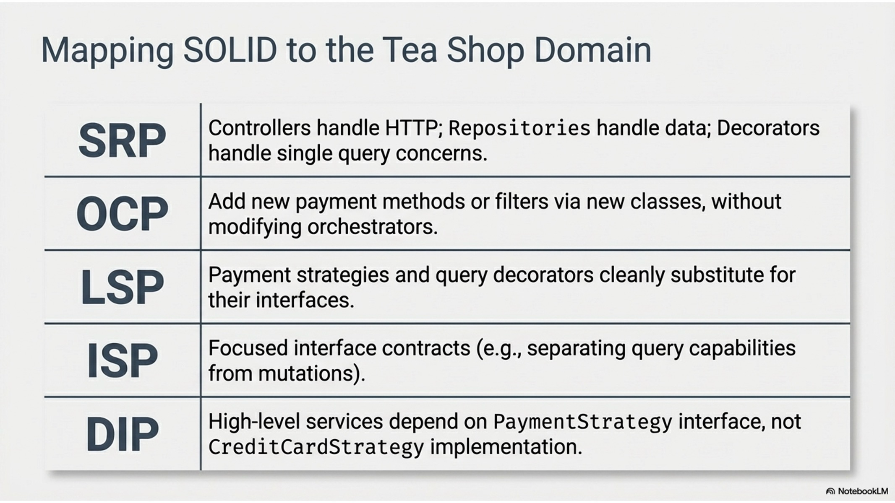

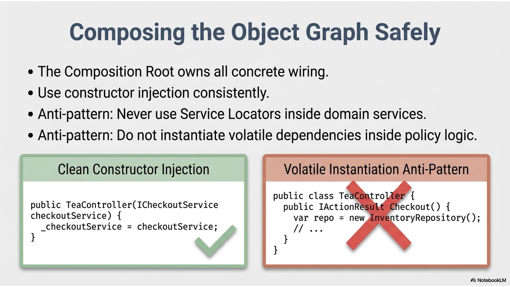

---

## Factory Pattern Requirements

You must use the **Factory Pattern** to select the payment strategy.

Lecture references:

- [Factory and Singleton (Lecture 8)](../presentations/08-factory-singleton.md)
- [Strategy Pattern (Lecture 4.2)](../presentations/04_2-strategy-pattern.pptx)

Required behavior:

- Payment method key/value from user input must be resolved by a factory
- Factory returns a `PaymentStrategy` abstraction
- Checkout service operates on the abstraction, not concrete strategy types

Prohibited behavior:

- Branching (`if/else`, `switch`) in controllers or checkout service for payment type selection

Notes:

- A central registration map/dictionary is acceptable
- Unsupported payment key must fail with a clear user-facing validation message

---

## Decorator Pattern Requirements

You must use the **Decorator Pattern** to build inventory filtering and sorting behavior.

Lecture reference: [OCP and Decorator (Lecture 5)](../presentations/05-open-closed-principle-and-decorator.md)

Required behavior:

- Base query returns all inventory items
- Each filter/sort concern is implemented as a decorator
- Decorators compose at runtime based on submitted search criteria
- Final query executes through a single abstraction call

Prohibited behavior:

- Monolithic query classes with large conditional blocks replacing decorator composition
- Putting filtering/sorting logic in controllers or views

---

## Singleton Inventory Repository Requirements

You must use a **Singleton** repository for in-memory inventory storage.

Lecture references:

- [Factory and Singleton (Lecture 8)](../presentations/08-factory-singleton.md)
- [Dependency Injection (Lecture 10)](../presentations/10-dependency-injection.md)

Required behavior:

- Inventory is loaded once at startup using the [Appendix inventory repository template](#inventory-repository-data-and-shape-required-template)
- Inventory repository singleton lifetime must be controlled by the DI container
- Product catalog is immutable after load:
  - products cannot be added
  - products cannot be removed
  - product metadata (name, price, rating) cannot be changed
- Only quantity can change after startup

DI-only singleton rule:

- Register the inventory repository as a singleton service in framework DI
- Consume it through constructor injection in services/controllers
- Do **not** implement a globally accessible singleton (`static Instance`, `GetInstance()`, global state holder)

Thread-safety requirements:

- Quantity mutation must be thread-safe under concurrent requests
- Stock decrement must be atomic (check-then-decrement must not race)
- Quantity can never become negative

Expected repository operation shape:

- `TryDecreaseQuantity(itemId, requestedQuantity)` (or equivalent) returns success/failure atomically

Implementation guidance:

- C#: `lock`, `Monitor`, `Interlocked`, or equivalent thread-safe mechanism
- Java: `synchronized`, `ReentrantLock`, `AtomicInteger`, or equivalent thread-safe mechanism

---

## Dependency Injection Requirements

Your application must use framework-supported DI (ASP.NET Core DI or Spring DI).

Lecture references:

- [DIP (Lecture 9)](../presentations/09-dependency-inversion-principle.md)
- [Dependency Injection (Lecture 10)](../presentations/10-dependency-injection.md)

Container documentation references:

- C# / ASP.NET Core DI container:
  - [Dependency injection in ASP.NET Core](https://learn.microsoft.com/en-us/aspnet/core/fundamentals/dependency-injection?view=aspnetcore-10.0)
  - [.NET dependency injection overview](https://learn.microsoft.com/en-us/dotnet/core/extensions/dependency-injection/overview)
- Java / Spring DI container:
  - [Spring Beans and Dependency Injection (Spring Boot)](https://docs.spring.io/spring-boot/reference/using/spring-beans-and-dependency-injection.html)
  - [Introduction to the Spring IoC Container and Beans](https://docs.spring.io/spring-framework/reference/core/beans/introduction.html)
  - [Dependency Injection (Spring Framework)](https://docs.spring.io/spring-framework/reference/core/beans/dependencies/factory-collaborators.html)

Required:

- Constructor injection for required dependencies
- Service registration/configuration in one composition root area
- Intentional lifetimes/scopes

Minimum lifetime expectation:

- Inventory repository registered as singleton
- Inventory singleton accessed only through DI-injected dependencies

Prohibited:

- Service locator usage in domain/business services
- Hidden runtime lookup for core collaborators in business logic
- Direct `new` of volatile dependencies inside policy services

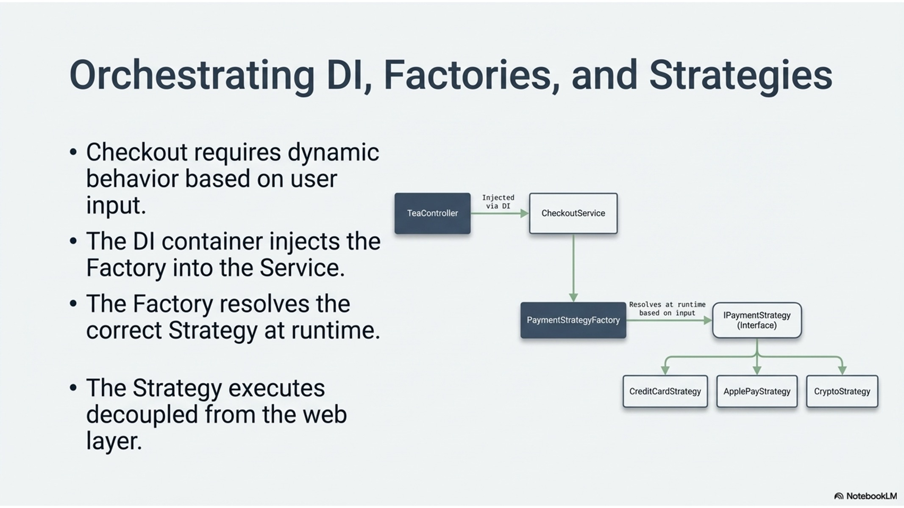

---

## Web MVC Requirements

You must implement this as a **server-rendered MVC application**.

Required:

- MVC controller(s) for search and checkout workflow
- Server-side templates/views for rendering forms and results
- View models for request/response binding
- Post/Redirect/Get flow for successful checkout submission

Prohibited:

- SPA architectures (React/Angular/Vue front-end as primary app)
- Moving core business rules into JavaScript
- Building API-only backend without MVC views/templates

---

## File Organization (Required)

- Each class should be in its own file
- Use cohesive package/namespace structure by responsibility
- Avoid god classes and god files

---

## Starter Repository Structure (Required)

`.gitignore` is essential. Proper source control hygiene is required for this assignment.

- Commit source, docs, and configuration intentionally
- Do not commit build artifacts, IDE metadata, OS junk files, secrets, or generated binaries
- Your repository should reflect professional, reviewable version-control practice

### Top-level Layout (Both Languages)

```text
tea-shop-web/
|
|-- README.md
|-- screenshot.png
|-- Dockerfile
|
|-- src/
|   `-- (your solution)
|
`-- .gitignore
```

---

### C# Starter Structure (ASP.NET Core MVC)

```text
tea-shop-web/
|
|-- README.md
|-- screenshot.png
|-- Dockerfile
|-- TeaShop.Web.sln
|
|-- src/
|   `-- TeaShop.Web/
|       |-- TeaShop.Web.csproj
|       |-- Program.cs
|       |
|       |-- Domain/
|       |   |-- Inventory/
|       |   |-- InventoryQuery/
|       |   `-- Payment/
|       |
|       |-- Application/
|       |   |-- Services/
|       |   `-- Factories/
|       |
|       |-- Web/
|       |   |-- Controllers/
|       |   |-- ViewModels/
|       |   `-- Views/
|       |
|       `-- Infrastructure/
|           `-- Repository/
|
`-- .gitignore
```

Recommended namespaces:

```text
Assignment3Solution.Domain.Inventory
Assignment3Solution.Domain.InventoryQuery
Assignment3Solution.Domain.Payment
Assignment3Solution.Application.Services
Assignment3Solution.Application.Factories
Assignment3Solution.Infrastructure.Repository
Assignment3Solution.Web.Controllers
Assignment3Solution.Web.ViewModels
```

---

### Java Starter Structure (Spring Boot + Maven)

```text
tea-shop-web/
|
|-- README.md
|-- screenshot.png
|-- Dockerfile
|-- pom.xml
|
|-- src/
|   |-- main/
|   |   |-- java/
|   |   |   `-- edu/
|   |   |       `-- kennesaw/
|   |   |           `-- teashop/
|   |   |               |-- TeaShopApplication.java
|   |   |               |
|   |   |               |-- domain/
|   |   |               |   |-- inventory/
|   |   |               |   |-- inventoryquery/
|   |   |               |   `-- payment/
|   |   |               |
|   |   |               |-- application/
|   |   |               |   |-- services/
|   |   |               |   `-- factories/
|   |   |               |
|   |   |               |-- infrastructure/
|   |   |               |   `-- repository/
|   |   |               |
|   |   |               `-- web/
|   |   |                   |-- controller/
|   |   |                   `-- viewmodel/
|   |   |
|   |   `-- resources/
|   |       |-- templates/
|   |       `-- application.properties
|   |
|   `-- test/
|       `-- java/
|           `-- edu/... (optional tests)
|
`-- .gitignore
```

Students must not use the Java default package.

---

## Sequence Diagram

This demonstrates one valid separation of concerns for web MVC + DI + patterns.

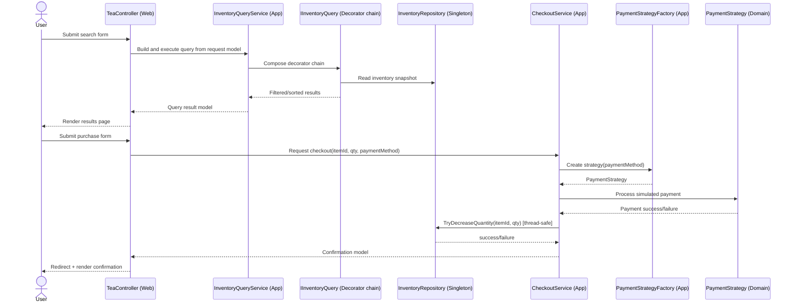

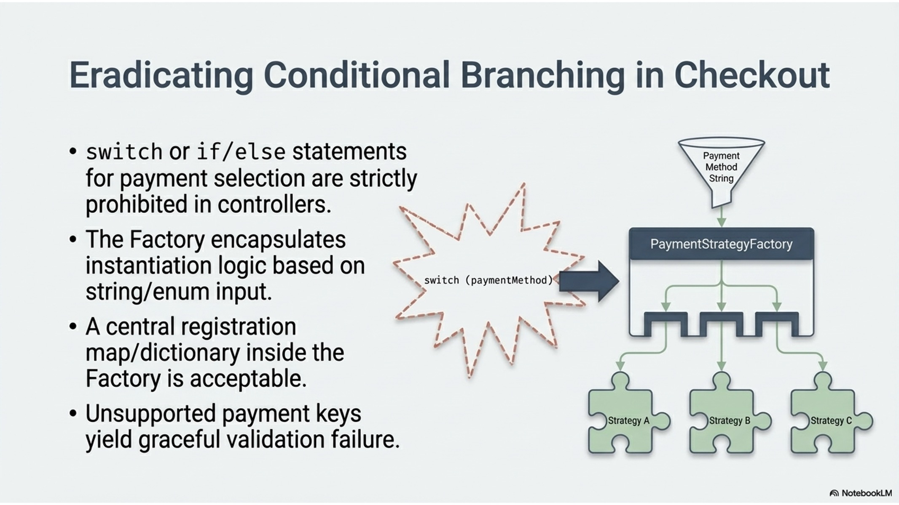

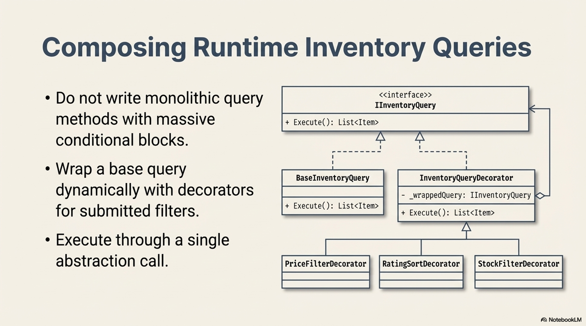

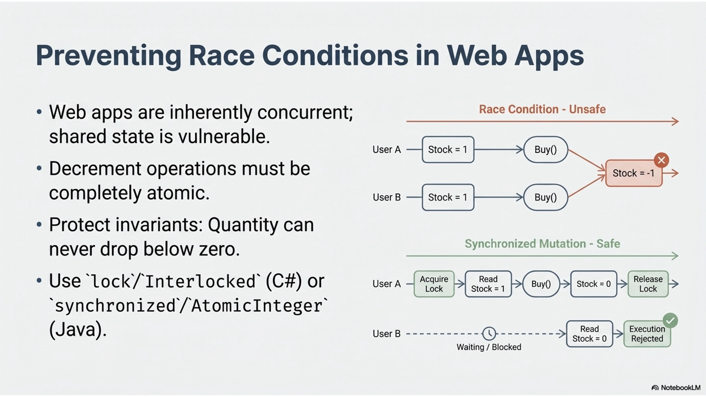

---

## Technical Requirements

### Language and Framework

Choose one stack:

- **C#**: ASP.NET Core MVC
- **Java**: Spring Boot MVC with Maven

### Docker (Mandatory)

Your repository must include a working `Dockerfile` and documented commands to run the app.

Required outcomes:

- Anyone should be able to clone and run your app using Docker
- Container must start the web app successfully
- README must include exact Docker commands

### Repository and Submission

- Submit via public GitHub repository
- Commit history should show incremental development

Repository must include:

- Source code under `/src`
- `README.md`
- `Dockerfile`
- `.gitignore`
- Screenshot(s)

### Unit Tests (Optional, Recommended)

If you write tests:

- C#: xUnit
- Java: JUnit

Suggested high-value test areas:

- Decorator query composition behavior
- Factory payment strategy selection
- Inventory repository thread-safe quantity mutation
- Checkout workflow with fake strategies/repositories

I recommend using an AI to generate your Unit Tests. Codex (OpenAI) and Claude Code (Anthropic) are both excellent for this task. All code generated by an AI must be reviewed by you.

---

## README.md Requirements (Mandatory)

Your repository **must include a `README.md`** consistent with Assignment 2 documentation expectations.

Reference: [Assignment 2](assignment-2.md), [Assignment 2 solution index](assignment-2-solution/README.md), [Assignment 2 C# solution](assignment-2-solution/src-csharp/README.md), and [Assignment 2 Java solution](assignment-2-solution/src-java/README.md)

>  **Never forget: Great engineers are great communicators!** Your documentation is very important. It demonstrates your ability to communicate complex ideas to teammates and customers, saves time, and ensures that employers perusing your git portfolio can easily understand and try your work.

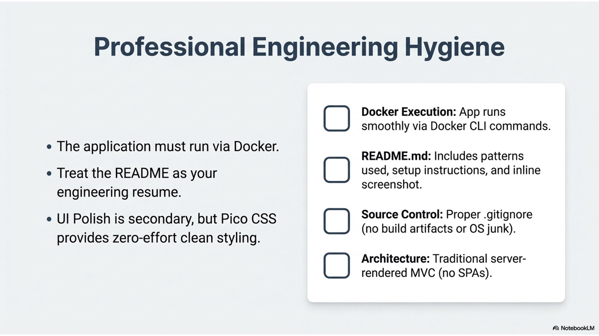

### 1. Project Description

Include:

- Brief description of the Tea Shop web app
- Statement that this is the [Assignment 2](assignment-2.md) web evolution
- Summary of where and how SOLID principles are applied
- Summary of Factory, Decorator, Singleton, and DI usage

### 2. How to Run the Application (CLI, Not IDE)

Include local run instructions and Docker run instructions.

Example local commands:

**C#**

```bash
dotnet run --project src/TeaShop.Web/TeaShop.Web.csproj
```

**Java (Maven)**

```bash
mvn spring-boot:run
```

#### Docker

Include exact commands, for example:

```bash
docker build -t tea-shop-web .
docker run --rm -p 8080:8080 tea-shop-web
```

Use the actual port and command for your implementation.

### 3. Screenshot

Include at least one screenshot of the running web application, embedded inline:

```markdown

```

### 4. Tests (Optional)

If tests are implemented, include how to run them.

---

## Coding Standards (Required)

### C#

Microsoft C# Coding Conventions  
https://learn.microsoft.com/en-us/dotnet/csharp/fundamentals/coding-style/coding-conventions

### Java

Oracle Java Code Conventions  
https://www.oracle.com/java/technologies/javase/codeconventions-introduction.html

---

## Program Entry Point / Composition Root Requirements

Your startup entry point must remain short and focused.

### What startup is allowed to do

- Register dependencies in DI container
- Configure MVC and web host
- Start application

### What startup must NOT do

- Implement business logic
- Implement query filtering logic
- Implement payment selection logic
- Implement checkout logic

### Composition Root Guidance

- C#: `Program.cs` and service registration area
- Java: Spring Boot application startup + configuration classes

Keep concrete wiring localized to this boundary.

---

## Constraints (Important)

**Do NOT:**

- Build a SPA or API-only replacement for this assignment
- Put business logic in controllers/views
- Use `if/else` or `switch` in checkout/controller to select payment strategies
- Replace decorator composition with one large procedural filter method
- Use a non-singleton mutable repository for inventory state
- Implement singleton access through `static` global accessor patterns
- Allow inventory product add/remove/update after initial load
- Ignore concurrency concerns for quantity updates
- Introduce service locator in domain/business services

**DO:**

- Keep the domain model independent from web framework concerns
- Use constructor injection consistently
- Keep interfaces focused and substitution-safe
- Add behavior through new classes/decorators/strategies
- Keep shared mutable state minimal and thread-safe

---

## Code Smells to Avoid

- **Service Locator in business code**: if domain/application classes request dependencies from a container/provider at runtime, dependencies become hidden and hard to test.
- **Magic strings**: avoid hard-coded selector keys and behavior switches scattered in code (payment keys, sort options, filter names). Centralize and strongly type where possible.
- **Magic numbers**: avoid unexplained constants for defaults, bounds, and limits. Use named constants or value objects.
- **Complex `if/then` chains**: long branching trees usually signal missing abstraction. Prefer Strategy, Factory, and Decorator extension points.
- **Unexamined `new` usage (`new` is glue)**: every `new` creates coupling. Be intentional about where construction occurs.
  - In general, `new` belongs in composition root, focused factories, and tests.
  - Avoid ad hoc `new` inside policy services and controllers for volatile dependencies.
- **God classes and mixed concerns**: if one class handles HTTP, business rules, persistence, and formatting, split responsibilities immediately.
- **Global mutable state**: static/global access to mutable data creates hidden coupling and race-condition risk.

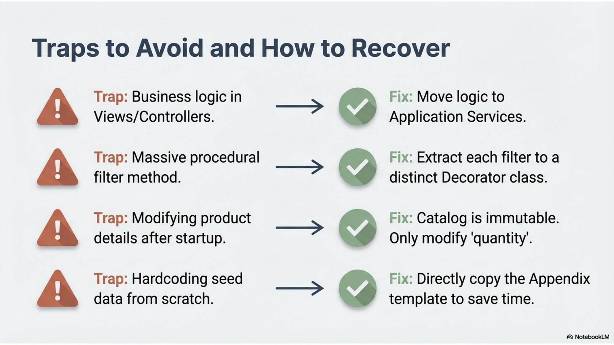

---

## FAQ

### 1. "Can I build this as a React front-end with an API backend?"
**No.**

This assignment is specifically about a server-rendered MVC architecture.

---

### 2. "Can I use a `switch` statement in checkout to select payment type?"
**No.**

Payment strategy selection must be delegated to a Factory.

---

### 3. "Can I use a regular in-memory list instead of a singleton repository?"
You may use an in-memory collection **inside** the singleton repository, but the repository itself must be a singleton service with thread-safe quantity mutation behavior.

---

### 4. "Do I have to handle thread safety even if I only test as one user?"
**Yes.**

Web applications are concurrent by nature. Your quantity update path must be safe under concurrent requests.

---

### 5. "Can I implement singleton with `static Instance` and call it directly?"
**No.**

Singleton lifetime for this assignment must be controlled by the DI container and consumed through constructor injection.

---

### 6. "Can I use a database for inventory?"
**No.**

Use an in-memory singleton repository for this assignment.

---

### 7. "Do I have to write unit tests?"
**No, but they are strongly recommended.**

At minimum, validate your thread-safe quantity mutation path manually if you do not implement tests.

---

## Final Advice

- Keep the architecture boring, explicit, and easy to reason about.
- Favor clean boundaries over clever framework tricks.
- If behavior parity with Assignment 2 is unclear, preserve the Assignment 2 interpretation.

---

## Submitting Your Assignment

**Assignments are not graded**; the work is for skill development and feedback.

If you want a detailed review:

1. Push your work to a public GitHub repository.
2. Ensure it runs locally and via Docker using your README instructions.
3. Email your repository URL to JAdkiss1@Kennesaw.edu.

Before requesting review, ensure:

- your project builds and runs from CLI and via Docker.
- your `README.md` contains complete local and Docker run instructions, and
- your web app screenshot is present and viewable in the README.

A short Loom video showing your solution running is also highly recommended.

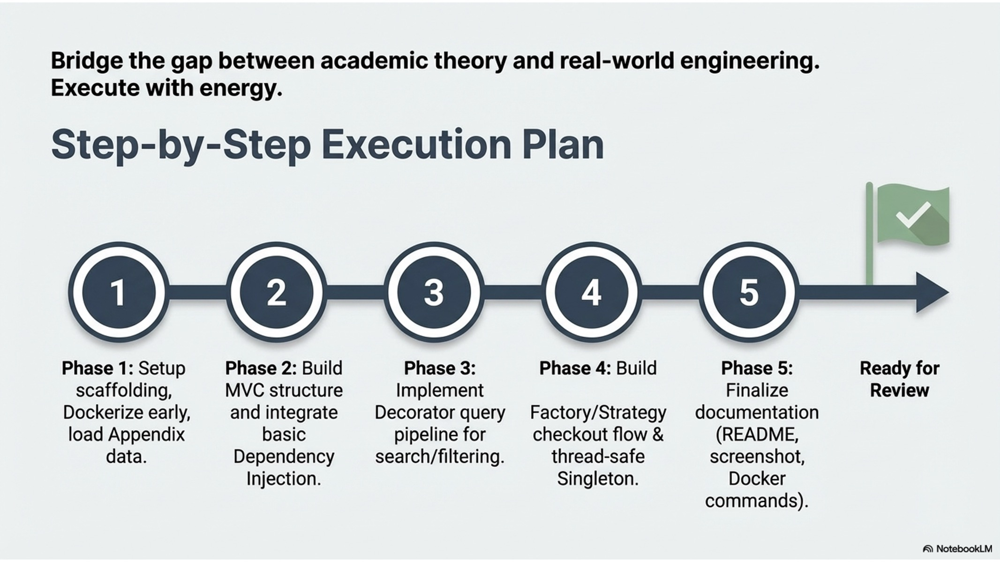

---

## Appendix: Seed Data

### Inventory Repository Data and Shape (Required Template)

Use the following repository seed data and structure directly. This removes data-entry work and keeps focus on design and architecture.

You may copy this template as a starting point and then adapt naming/package structure to your project.

### C# Template

```csharp
using System;
using System.Collections.Generic;

namespace Assignment3Solution.Domain.Inventory;

public sealed class InventoryRepository : IInventoryRepository
{
    private readonly object _syncRoot = new();
    private readonly List<InventoryItem> _items;

    public InventoryRepository()
    {
        _items = new List<InventoryItem>
        {
            new(Guid.NewGuid(), "Green Tea", 15.99m, 50, new StarRating(4)),
            new(Guid.NewGuid(), "Black Tea", 12.49m, 75, new StarRating(5)),
            new(Guid.NewGuid(), "Herbal Tea", 14.29m, 30, new StarRating(3)),
            new(Guid.NewGuid(), "Oolong Tea", 18.00m, 10, new StarRating(5)),
            new(Guid.NewGuid(), "Matcha", 29.99m, 0, new StarRating(4)),
            new(Guid.NewGuid(), "White Tea", 22.50m, 25, new StarRating(4)),
            new(Guid.NewGuid(), "Chai Tea", 10.99m, 60, new StarRating(3)),
            new(Guid.NewGuid(), "Earl Grey", 13.99m, 45, new StarRating(5)),
            new(Guid.NewGuid(), "Rooibos", 17.10m, 0, new StarRating(5)),
            new(Guid.NewGuid(), "Mint Tea", 11.89m, 80, new StarRating(1)),
            new(Guid.NewGuid(), "Jasmine Green", 16.75m, 35, new StarRating(4)),
            new(Guid.NewGuid(), "Genmaicha", 14.10m, 28, new StarRating(3)),
            new(Guid.NewGuid(), "Sencha", 19.25m, 40, new StarRating(4)),
            new(Guid.NewGuid(), "Darjeeling", 21.60m, 18, new StarRating(5)),
            new(Guid.NewGuid(), "Assam", 13.40m, 55, new StarRating(4)),
            new(Guid.NewGuid(), "Ceylon", 12.90m, 62, new StarRating(3)),
            new(Guid.NewGuid(), "Lapsang Souchong", 20.75m, 12, new StarRating(2)),
            new(Guid.NewGuid(), "Keemun", 17.35m, 22, new StarRating(4)),
            new(Guid.NewGuid(), "Pu-erh", 26.80m, 15, new StarRating(5)),
            new(Guid.NewGuid(), "Hojicha", 15.20m, 48, new StarRating(3)),
            new(Guid.NewGuid(), "Gyokuro", 32.50m, 8, new StarRating(5)),
            new(Guid.NewGuid(), "Bancha", 9.95m, 90, new StarRating(2)),
            new(Guid.NewGuid(), "Yerba Mate", 11.50m, 70, new StarRating(3)),
            new(Guid.NewGuid(), "Tulsi", 13.25m, 33, new StarRating(4)),
            new(Guid.NewGuid(), "Chamomile", 8.75m, 120, new StarRating(2)),
            new(Guid.NewGuid(), "Lavender", 9.60m, 44, new StarRating(2)),
            new(Guid.NewGuid(), "Lemongrass", 10.40m, 52, new StarRating(3)),
            new(Guid.NewGuid(), "Peppermint", 9.25m, 0, new StarRating(1)),
            new(Guid.NewGuid(), "Spearmint", 9.10m, 66, new StarRating(2)),
            new(Guid.NewGuid(), "Ginger Tea", 12.15m, 58, new StarRating(3)),
            new(Guid.NewGuid(), "Lemon Ginger", 11.80m, 47, new StarRating(3)),
            new(Guid.NewGuid(), "Turmeric Tea", 13.95m, 38, new StarRating(4)),
            new(Guid.NewGuid(), "Hibiscus", 10.25m, 41, new StarRating(2)),
            new(Guid.NewGuid(), "Rosehip", 10.55m, 29, new StarRating(3)),
            new(Guid.NewGuid(), "Berry Blend", 12.05m, 34, new StarRating(4)),
            new(Guid.NewGuid(), "Cinnamon Spice", 11.35m, 57, new StarRating(3)),
            new(Guid.NewGuid(), "Vanilla Chai", 14.85m, 26, new StarRating(4)),
            new(Guid.NewGuid(), "Masala Chai", 15.45m, 21, new StarRating(5)),
            new(Guid.NewGuid(), "Kashmiri Chai", 18.90m, 9, new StarRating(4)),
            new(Guid.NewGuid(), "London Fog", 13.70m, 31, new StarRating(3)),
            new(Guid.NewGuid(), "Breakfast Blend", 12.20m, 63, new StarRating(4)),
            new(Guid.NewGuid(), "English Breakfast", 11.95m, 77, new StarRating(4)),
            new(Guid.NewGuid(), "Irish Breakfast", 12.65m, 54, new StarRating(3)),
            new(Guid.NewGuid(), "Scottish Breakfast", 13.15m, 0, new StarRating(2)),
            new(Guid.NewGuid(), "Smoky Earl Grey", 14.55m, 24, new StarRating(5)),
            new(Guid.NewGuid(), "Orange Pekoe", 10.85m, 68, new StarRating(3)),
            new(Guid.NewGuid(), "Lemon Zest", 9.75m, 83, new StarRating(2)),
            new(Guid.NewGuid(), "Peach Oolong", 17.90m, 14, new StarRating(4)),
            new(Guid.NewGuid(), "Coconut Green", 16.40m, 0, new StarRating(3)),
            new(Guid.NewGuid(), "Caramel Rooibos", 18.35m, 19, new StarRating(4))
        };
    }

    public IReadOnlyList<InventoryItem> Get()
    {
        return _items.AsReadOnly();
    }

    // Required shape for Assignment 3 thread-safe quantity mutation.
    public bool TryDecreaseQuantity(Guid inventoryItemId, int requestedQuantity)
    {
        if (requestedQuantity <= 0) return false;

        lock (_syncRoot)
        {
            var index = _items.FindIndex(i => i.InventoryItemId == inventoryItemId);
            if (index == -1) return false;

            var current = _items[index];
            if (current.Quantity < requestedQuantity) return false;

            _items[index] = current with { Quantity = current.Quantity - requestedQuantity };
            return true;
        }
    }
}
```

DI registration reminder (required):

```csharp
services.AddSingleton<IInventoryRepository, InventoryRepository>();
```

### Java Template

```java
package edu.kennesaw.teashop.domain.inventory;

import java.math.BigDecimal;
import java.util.ArrayList;
import java.util.Collections;
import java.util.List;
import java.util.UUID;

public final class InventoryRepository implements InventoryRepositoryPort {
    private final Object syncRoot = new Object();
    private final List<InventoryItem> items;

    public InventoryRepository() {
        items = new ArrayList<>(List.of(
            new InventoryItem(UUID.randomUUID(), "Green Tea", new BigDecimal("15.99"), 50, new StarRating(4)),
            new InventoryItem(UUID.randomUUID(), "Black Tea", new BigDecimal("12.49"), 75, new StarRating(5)),
            new InventoryItem(UUID.randomUUID(), "Herbal Tea", new BigDecimal("14.29"), 30, new StarRating(3)),
            new InventoryItem(UUID.randomUUID(), "Oolong Tea", new BigDecimal("18.00"), 10, new StarRating(5)),
            new InventoryItem(UUID.randomUUID(), "Matcha", new BigDecimal("29.99"), 0, new StarRating(4)),
            new InventoryItem(UUID.randomUUID(), "White Tea", new BigDecimal("22.50"), 25, new StarRating(4)),
            new InventoryItem(UUID.randomUUID(), "Chai Tea", new BigDecimal("10.99"), 60, new StarRating(3)),
            new InventoryItem(UUID.randomUUID(), "Earl Grey", new BigDecimal("13.99"), 45, new StarRating(5)),
            new InventoryItem(UUID.randomUUID(), "Rooibos", new BigDecimal("17.10"), 0, new StarRating(5)),
            new InventoryItem(UUID.randomUUID(), "Mint Tea", new BigDecimal("11.89"), 80, new StarRating(1)),
            new InventoryItem(UUID.randomUUID(), "Jasmine Green", new BigDecimal("16.75"), 35, new StarRating(4)),
            new InventoryItem(UUID.randomUUID(), "Genmaicha", new BigDecimal("14.10"), 28, new StarRating(3)),
            new InventoryItem(UUID.randomUUID(), "Sencha", new BigDecimal("19.25"), 40, new StarRating(4)),
            new InventoryItem(UUID.randomUUID(), "Darjeeling", new BigDecimal("21.60"), 18, new StarRating(5)),
            new InventoryItem(UUID.randomUUID(), "Assam", new BigDecimal("13.40"), 55, new StarRating(4)),
            new InventoryItem(UUID.randomUUID(), "Ceylon", new BigDecimal("12.90"), 62, new StarRating(3)),
            new InventoryItem(UUID.randomUUID(), "Lapsang Souchong", new BigDecimal("20.75"), 12, new StarRating(2)),
            new InventoryItem(UUID.randomUUID(), "Keemun", new BigDecimal("17.35"), 22, new StarRating(4)),
            new InventoryItem(UUID.randomUUID(), "Pu-erh", new BigDecimal("26.80"), 15, new StarRating(5)),
            new InventoryItem(UUID.randomUUID(), "Hojicha", new BigDecimal("15.20"), 48, new StarRating(3)),
            new InventoryItem(UUID.randomUUID(), "Gyokuro", new BigDecimal("32.50"), 8, new StarRating(5)),
            new InventoryItem(UUID.randomUUID(), "Bancha", new BigDecimal("9.95"), 90, new StarRating(2)),
            new InventoryItem(UUID.randomUUID(), "Yerba Mate", new BigDecimal("11.50"), 70, new StarRating(3)),
            new InventoryItem(UUID.randomUUID(), "Tulsi", new BigDecimal("13.25"), 33, new StarRating(4)),
            new InventoryItem(UUID.randomUUID(), "Chamomile", new BigDecimal("8.75"), 120, new StarRating(2)),
            new InventoryItem(UUID.randomUUID(), "Lavender", new BigDecimal("9.60"), 44, new StarRating(2)),
            new InventoryItem(UUID.randomUUID(), "Lemongrass", new BigDecimal("10.40"), 52, new StarRating(3)),
            new InventoryItem(UUID.randomUUID(), "Peppermint", new BigDecimal("9.25"), 0, new StarRating(1)),
            new InventoryItem(UUID.randomUUID(), "Spearmint", new BigDecimal("9.10"), 66, new StarRating(2)),
            new InventoryItem(UUID.randomUUID(), "Ginger Tea", new BigDecimal("12.15"), 58, new StarRating(3)),
            new InventoryItem(UUID.randomUUID(), "Lemon Ginger", new BigDecimal("11.80"), 47, new StarRating(3)),
            new InventoryItem(UUID.randomUUID(), "Turmeric Tea", new BigDecimal("13.95"), 38, new StarRating(4)),
            new InventoryItem(UUID.randomUUID(), "Hibiscus", new BigDecimal("10.25"), 41, new StarRating(2)),
            new InventoryItem(UUID.randomUUID(), "Rosehip", new BigDecimal("10.55"), 29, new StarRating(3)),
            new InventoryItem(UUID.randomUUID(), "Berry Blend", new BigDecimal("12.05"), 34, new StarRating(4)),
            new InventoryItem(UUID.randomUUID(), "Cinnamon Spice", new BigDecimal("11.35"), 57, new StarRating(3)),
            new InventoryItem(UUID.randomUUID(), "Vanilla Chai", new BigDecimal("14.85"), 26, new StarRating(4)),
            new InventoryItem(UUID.randomUUID(), "Masala Chai", new BigDecimal("15.45"), 21, new StarRating(5)),
            new InventoryItem(UUID.randomUUID(), "Kashmiri Chai", new BigDecimal("18.90"), 9, new StarRating(4)),
            new InventoryItem(UUID.randomUUID(), "London Fog", new BigDecimal("13.70"), 31, new StarRating(3)),
            new InventoryItem(UUID.randomUUID(), "Breakfast Blend", new BigDecimal("12.20"), 63, new StarRating(4)),
            new InventoryItem(UUID.randomUUID(), "English Breakfast", new BigDecimal("11.95"), 77, new StarRating(4)),
            new InventoryItem(UUID.randomUUID(), "Irish Breakfast", new BigDecimal("12.65"), 54, new StarRating(3)),
            new InventoryItem(UUID.randomUUID(), "Scottish Breakfast", new BigDecimal("13.15"), 0, new StarRating(2)),
            new InventoryItem(UUID.randomUUID(), "Smoky Earl Grey", new BigDecimal("14.55"), 24, new StarRating(5)),
            new InventoryItem(UUID.randomUUID(), "Orange Pekoe", new BigDecimal("10.85"), 68, new StarRating(3)),
            new InventoryItem(UUID.randomUUID(), "Lemon Zest", new BigDecimal("9.75"), 83, new StarRating(2)),
            new InventoryItem(UUID.randomUUID(), "Peach Oolong", new BigDecimal("17.90"), 14, new StarRating(4)),
            new InventoryItem(UUID.randomUUID(), "Coconut Green", new BigDecimal("16.40"), 0, new StarRating(3)),
            new InventoryItem(UUID.randomUUID(), "Caramel Rooibos", new BigDecimal("18.35"), 19, new StarRating(4))
        ));
    }

    public List<InventoryItem> get() {
        return Collections.unmodifiableList(items);
    }

    // Required shape for Assignment 3 thread-safe quantity mutation.
    public boolean tryDecreaseQuantity(UUID inventoryItemId, int requestedQuantity) {
        if (requestedQuantity <= 0) return false;

        synchronized (syncRoot) {
            int index = -1;
            for (int i = 0; i < items.size(); i++) {
                if (items.get(i).getInventoryItemId().equals(inventoryItemId)) {
                    index = i;
                    break;
                }
            }

            if (index == -1) return false;

            InventoryItem current = items.get(index);
            if (current.getQuantity() < requestedQuantity) return false;

            items.set(index, new InventoryItem(
                current.getInventoryItemId(),
                current.getName(),
                current.getPrice(),
                current.getQuantity() - requestedQuantity,
                current.getStarRating()
            ));
            return true;
        }
    }
}
```

DI registration reminder (required):

```java
import org.springframework.context.annotation.Bean;
import org.springframework.context.annotation.Configuration;

@Configuration
public class InventoryConfig {
    @Bean
    public InventoryRepositoryPort inventoryRepository() {
        return new InventoryRepository();
    }
}
```
