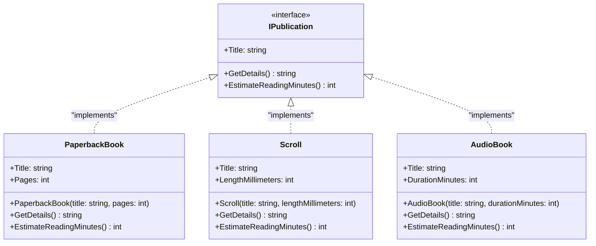

# Polymorphism 2

## How To Run
`dotnet run Program-03.cs`

_Note: Requires C# 10 to run from the command line without a `.csproj` file._

## Class Diagram

```mermaid
classDiagram
direction BT

class IPublication {
  <<interface>>
  +Title: string
  +GetDetails() string
  +EstimateReadingMinutes() int
}

class PaperbackBook {
  +Title: string
  +Pages: int
  +PaperbackBook(title: string, pages: int)
  +GetDetails() string
  +EstimateReadingMinutes() int
}

class Scroll {
  +Title: string
  +LengthMillimeters: int
  +Scroll(title: string, lengthMillimeters: int)
  +GetDetails() string
  +EstimateReadingMinutes() int
}

class AudioBook {
  +Title: string
  +DurationMinutes: int
  +AudioBook(title: string, durationMinutes: int)
  +GetDetails() string
  +EstimateReadingMinutes() int
}

PaperbackBook ..|> IPublication : "implements"
Scroll ..|> IPublication : "implements"
AudioBook ..|> IPublication : "implements"
```