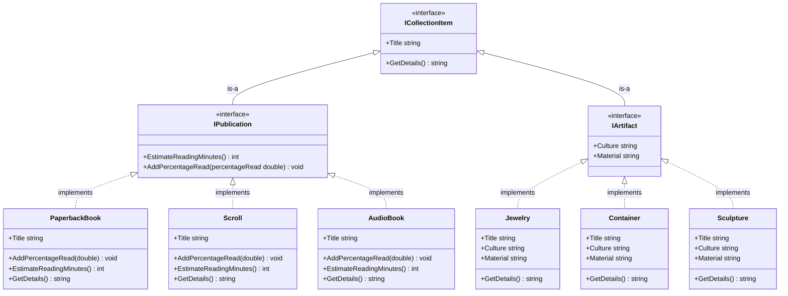

# Encapsulation 1

## How To Run
`dotnet run Program-05.cs`

_Note: Requires C# 10 to run from the command line without a `.csproj` file._

## Class Diagram

```mermaid
classDiagram
direction TB

%% =============================
%% Interfaces (Abstractions)
%% =============================

class ICollectionItem {
  <<interface>>
  +Title string
  +GetDetails() string
}

class IPublication {
  <<interface>>
  +EstimateReadingMinutes() int
  +AddPercentageRead(percentageRead double) void
}

class IArtifact {
  <<interface>>
  +Culture string
  +Material string
}

%% Interface inheritance (is-a)
ICollectionItem <|-- IPublication : is-a
ICollectionItem <|-- IArtifact : is-a


%% =============================
%% Publication Implementations
%% =============================

class PaperbackBook {
  +Title string
  +AddPercentageRead(double) void
  +EstimateReadingMinutes() int
  +GetDetails() string
}

class Scroll {
  +Title string
  +AddPercentageRead(double) void
  +EstimateReadingMinutes() int
  +GetDetails() string
}

class AudioBook {
  +Title string
  +AddPercentageRead(double) void
  +EstimateReadingMinutes() int
  +GetDetails() string
}

IPublication <|.. PaperbackBook : implements
IPublication <|.. Scroll : implements
IPublication <|.. AudioBook : implements


%% =============================
%% Artifact Implementations
%% =============================

class Jewelry {
  +Title string
  +Culture string
  +Material string
  +GetDetails() string
}

class Container {
  +Title string
  +Culture string
  +Material string
  +GetDetails() string
}

class Sculpture {
  +Title string
  +Culture string
  +Material string
  +GetDetails() string
}

IArtifact <|.. Jewelry : implements
IArtifact <|.. Container : implements
IArtifact <|.. Sculpture : implements
```