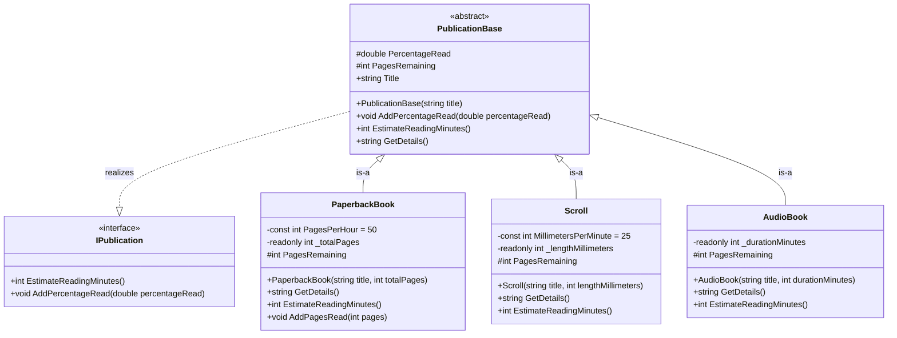

# Namespaces

## Class Diagram

```mermaid
classDiagram
direction TB

class IPublication {
  <<interface>>
  +int EstimateReadingMinutes()
  +void AddPercentageRead(double percentageRead)
}

class PublicationBase {
  <<abstract>>
  #double PercentageRead
  #int PagesRemaining
  +string Title

  +PublicationBase(string title)
  +void AddPercentageRead(double percentageRead)
  +int EstimateReadingMinutes()
  +string GetDetails()
}

class PaperbackBook {
  -const int PagesPerHour = 50
  -readonly int _totalPages
  #int PagesRemaining

  +PaperbackBook(string title, int totalPages)
  +string GetDetails()
  +int EstimateReadingMinutes()
  +void AddPagesRead(int pages)
}

class Scroll {
  -const int MillimetersPerMinute = 25
  -readonly int _lengthMillimeters
  #int PagesRemaining

  +Scroll(string title, int lengthMillimeters)
  +string GetDetails()
  +int EstimateReadingMinutes()
}

class AudioBook {
  -readonly int _durationMinutes
  #int PagesRemaining

  +AudioBook(string title, int durationMinutes)
  +string GetDetails()
  +int EstimateReadingMinutes()
}

PublicationBase ..|> IPublication : realizes
PublicationBase <|-- PaperbackBook : is-a
PublicationBase <|-- Scroll : is-a
PublicationBase <|-- AudioBook : is-a
```