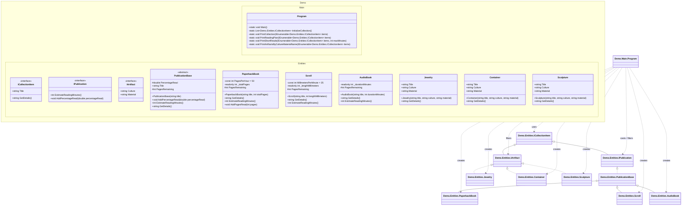

# Namespaces

## Class Diagram

```mermaid
classDiagram
direction TB

%% =============================
%% Demo.Main
%% =============================
namespace Demo.Main {
  class Program {
    +static void Main()
    -static List~Demo.Entities.ICollectionItem~ InitializeCollection()
    -static void PrintCollection(IEnumerable~Demo.Entities.ICollectionItem~ items)
    -static void PrintReadingPlan(IEnumerable~Demo.Entities.ICollectionItem~ items)
    -static void PrintShortReads(IEnumerable~Demo.Entities.ICollectionItem~ items, int maxMinutes)
    -static void PrintArtifactsByCultureMaterialName(IEnumerable~Demo.Entities.ICollectionItem~ items)
  }
}

%% =============================
%% Demo.Entities
%% =============================
namespace Demo.Entities {

  class ICollectionItem {
    <<interface>>
    +string Title
    +string GetDetails()
  }

  class IPublication {
    <<interface>>
    +int EstimateReadingMinutes()
    +void AddPercentageRead(double percentageRead)
  }

  class IArtifact {
    <<interface>>
    +string Culture
    +string Material
  }

  class PublicationBase {
    <<abstract>>
    #double PercentageRead
    +PublicationBase(string title)
    +string Title
    #int PagesRemaining
    +void AddPercentageRead(double percentageRead)
    +int EstimateReadingMinutes()
    +string GetDetails()
  }

  class PaperbackBook {
    -const int PagesPerHour = 50
    -readonly int _totalPages
    +PaperbackBook(string title, int totalPages)
    #int PagesRemaining
    +string GetDetails()
    +int EstimateReadingMinutes()
    +void AddPagesRead(int pages)
  }

  class Scroll {
    -const int MillimetersPerMinute = 25
    -readonly int _lengthMillimeters
    +Scroll(string title, int lengthMillimeters)
    #int PagesRemaining
    +string GetDetails()
    +int EstimateReadingMinutes()
  }

  class AudioBook {
    -readonly int _durationMinutes
    +AudioBook(string title, int durationMinutes)
    #int PagesRemaining
    +string GetDetails()
    +int EstimateReadingMinutes()
  }

  class Jewelry {
    +Jewelry(string title, string culture, string material)
    +string Title
    +string Culture
    +string Material
    +string GetDetails()
  }

  class Container {
    +Container(string title, string culture, string material)
    +string Title
    +string Culture
    +string Material
    +string GetDetails()
  }

  class Sculpture {
    +Sculpture(string title, string culture, string material)
    +string Title
    +string Culture
    +string Material
    +string GetDetails()
  }
}

%% =============================
%% Relationships (MUST be outside namespaces)
%% =============================

Demo.Entities.ICollectionItem <|-- Demo.Entities.IPublication
Demo.Entities.ICollectionItem <|-- Demo.Entities.IArtifact

Demo.Entities.IPublication <|.. Demo.Entities.PublicationBase

Demo.Entities.PublicationBase <|-- Demo.Entities.PaperbackBook
Demo.Entities.PublicationBase <|-- Demo.Entities.Scroll
Demo.Entities.PublicationBase <|-- Demo.Entities.AudioBook

Demo.Entities.IArtifact <|.. Demo.Entities.Jewelry
Demo.Entities.IArtifact <|.. Demo.Entities.Container
Demo.Entities.IArtifact <|.. Demo.Entities.Sculpture

Demo.Main.Program ..> Demo.Entities.ICollectionItem : uses
Demo.Main.Program ..> Demo.Entities.IPublication : casts / filters
Demo.Main.Program ..> Demo.Entities.IArtifact : filters
Demo.Main.Program ..> Demo.Entities.PaperbackBook : creates
Demo.Main.Program ..> Demo.Entities.Scroll : creates
Demo.Main.Program ..> Demo.Entities.AudioBook : creates
Demo.Main.Program ..> Demo.Entities.Jewelry : creates
Demo.Main.Program ..> Demo.Entities.Container : creates
Demo.Main.Program ..> Demo.Entities.Sculpture : creates
```