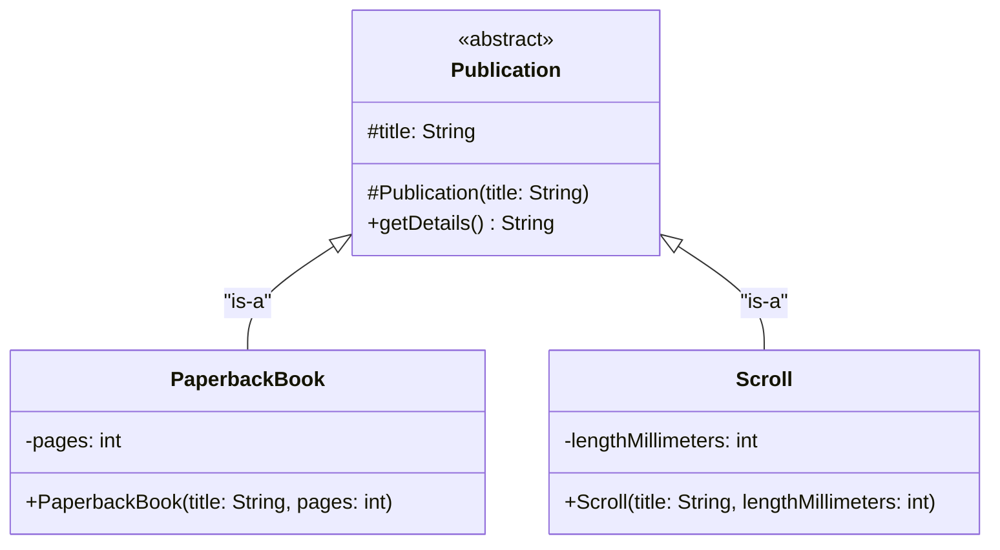

# Inheritance

## How To Run

From the ~/java/directory, `java inheritance/demo/main/Program.java`

## Class Diagram

```mermaid
---
config:
  theme: mc
---
classDiagram
direction BT

class Publication {
  <<abstract>>
  #title: String
  #Publication(title: String)
  +getDetails() String
}

class PaperbackBook {
  -pages: int
  +PaperbackBook(title: String, pages: int)
}

class Scroll {
  -lengthMillimeters: int
  +Scroll(title: String, lengthMillimeters: int)
}

PaperbackBook --|> Publication : "is-a"
Scroll --|> Publication : "is-a"
```