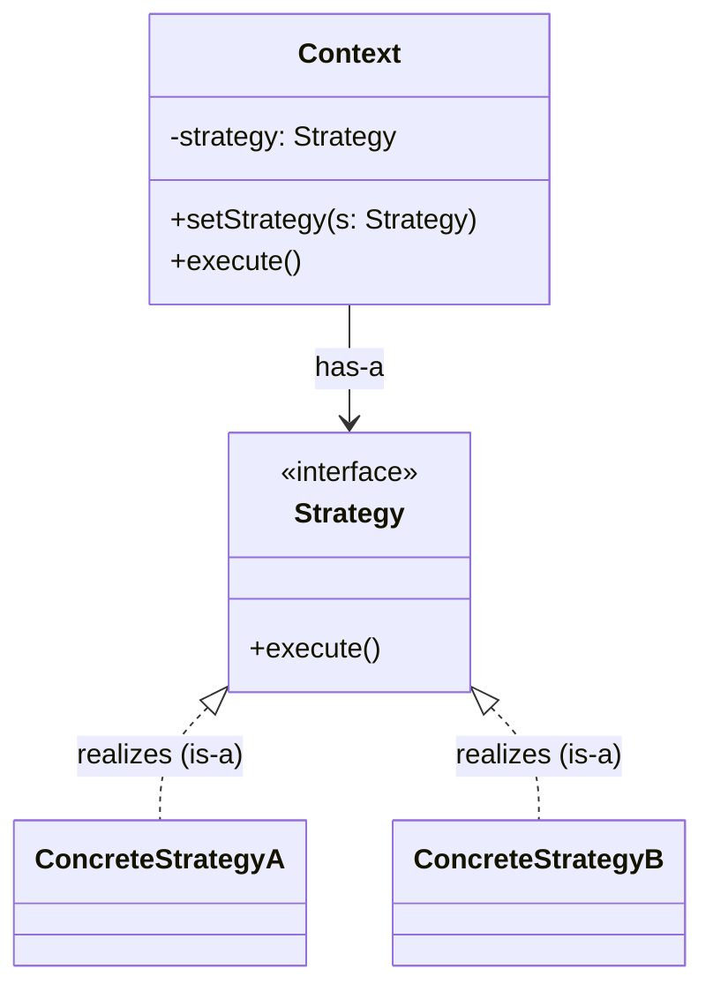
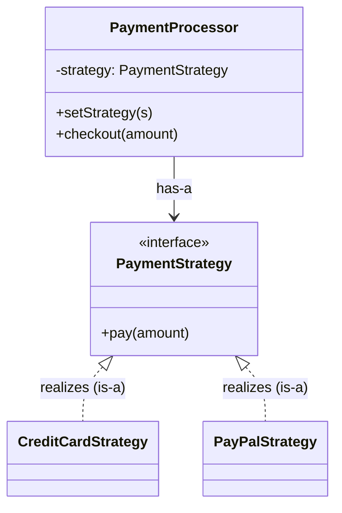
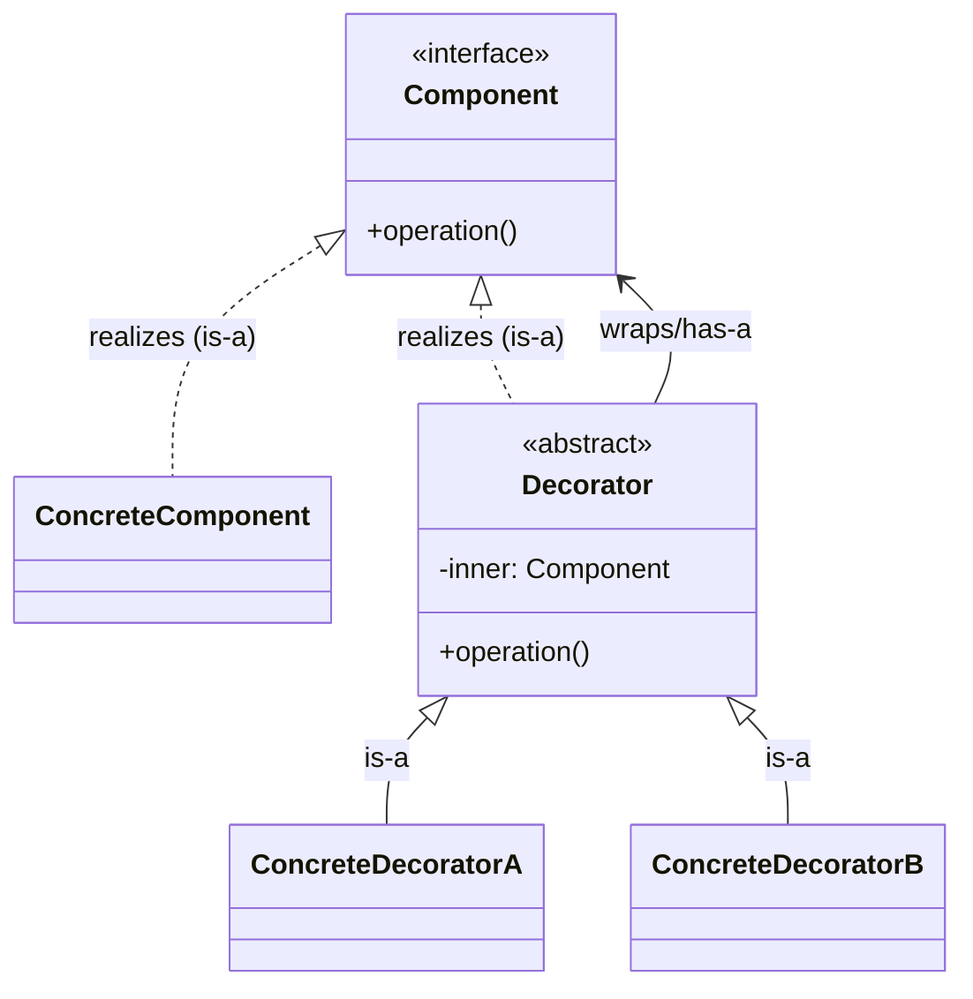
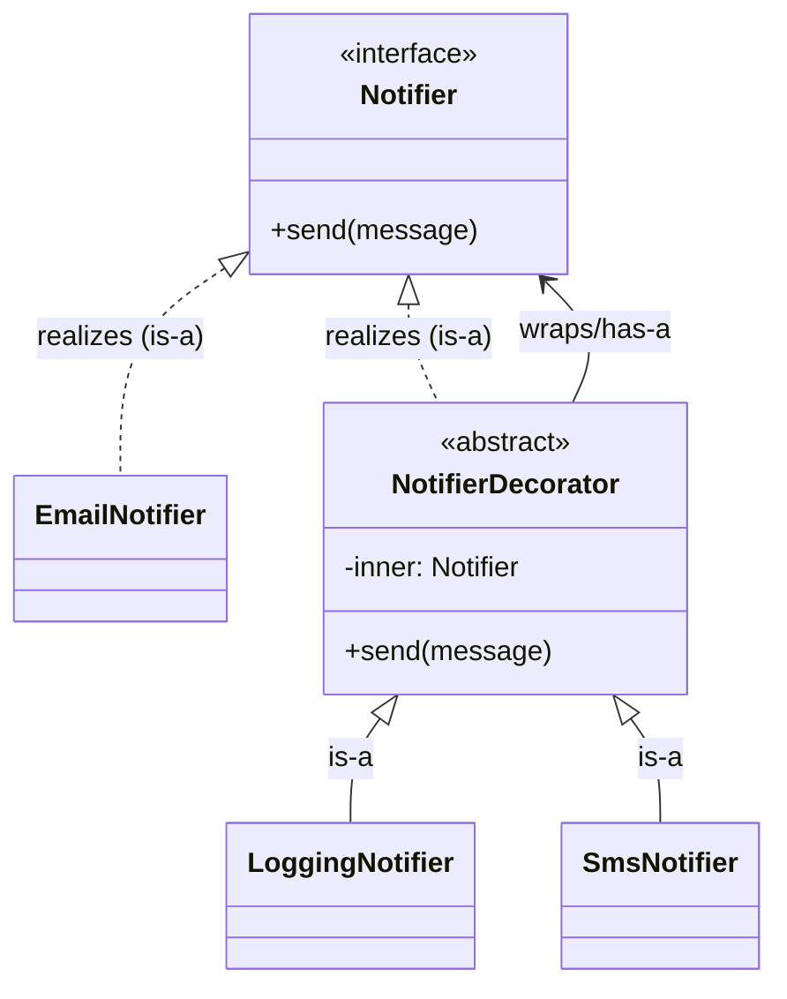
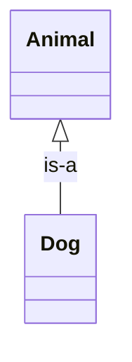
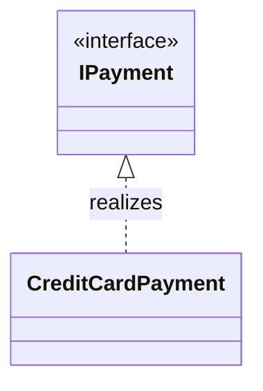
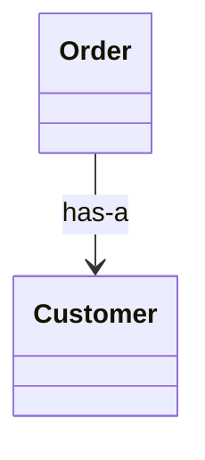
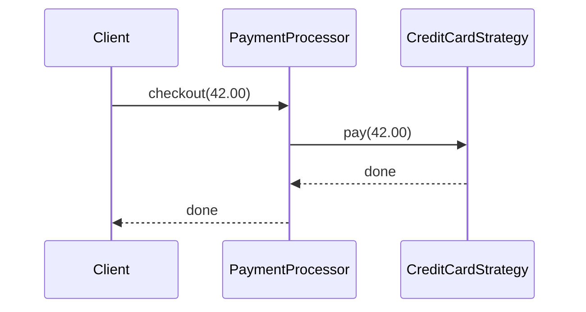

# Exam 1 Study Guide

## Introduction
This guide summarizes Exam 1 topics from the course presentations and assignments. It is a review aid, not a replacement for the original materials.

The scope of Exam 1 is:

- All lectures through Liskov Substitution Principle.
- The concepts explored in Assignments 1 and 2 including OO fundamentals, the strategy pattern, and the decorator pattern.
- Ousterhout's Philosophy of Software Design through chapter 8.

The format of Exam 1 is in-person, written, closed-book, and no devices.

Question types include true/false, multiple choice, and short answer.

If there is any mismatch between this guide and in-class/D2L announcements, follow the instructor's latest announcement.

#### AI Attribution

> Some parts of this document were AI-generated by Codex using the course's lecture material, assignments, and assignment solutions.

## Table of Contents:

- [Introduction](#introduction)
- [Concepts](#concepts)
- [Philosophy of Software Design](#philosophy-of-software-design)
- [Patterns](#patterns)
- [Concept Comparisons](#concept-comparisons)
- [UML Relationships](#uml-relationships)
- [Terminology](#terminology)
- [Example Questions](#example-questions)
- [Example Questions - Answers](#example-questions---answers)

## Concepts
### Lecture 1 - Course Introduction
Focus: course expectations, professional habits, and prerequisites that frame how you will be evaluated.

Key ideas include the expectation of strong OO fundamentals, the importance of writing code (not just reading it), and using GitHub for sharing and review. If you are missing prerequisites like polymorphism, encapsulation, inheritance, or Big O, review them immediately because later lectures assume them.

Source: [01_1-course-introduction.pdf](../presentations/01_1-course-introduction.pdf)

### Lecture 1 - Why Design Matters
Focus: design as change management.

Design is about making change safe and affordable over time. Most software cost is in modifying code, not writing it. Good design makes intent clear, limits cognitive load, and prevents "just one more if" from growing into brittle, tangled logic. Abstraction hides the right details so changes stay localized.

Source: [01_2-why-design-matters.pdf](../presentations/01_2-why-design-matters.pdf)

### Lecture 2 - OO Foundations Review
Focus: shared OO vocabulary and mechanics.

Key concepts include inheritance, abstract vs concrete classes, interfaces as contracts, polymorphism through base-type collections, dynamic dispatch, encapsulation, and controlled access to state. The lecture also emphasized organization (namespaces/modules), avoiding deep inheritance chains, and using helper methods to keep `Main` small and focused.

Sources: [02-oo-foundations-review.md](../presentations/02-oo-foundations-review.md), [02-lecture-2-conclusion-and-assignment1-summary.md](../presentations/02-lecture-2-conclusion-and-assignment1-summary.md)

### Assignment 1 - Crazy Eights (OO Foundations Practice)
Focus: applying OO fundamentals to a concrete problem.

The assignment reinforces intentional use of interfaces, abstract classes, polymorphism, dynamic dispatch, and encapsulation. Design guidance emphasized "program to abstractions," avoid branch-on-type logic, keep a small composition root in `Main`, bundle growing parameter lists into context objects, and use random seeds for repeatable testing.

Source: [assignment-1.md](../assignments/assignment-1.md)

### Lecture 3 - UML Class Diagramming
Focus: class diagrams as a design and communication tool.

UML class diagrams show static structure (not execution flow). Key relationships include inheritance, interface realization, dependency, association, aggregation, and composition. Structural vs non-structural relationships clarify lifetime and ownership. Multiplicity is a design constraint that must be enforced in code. Diagrams should be selective and used to clarify responsibilities and alternatives.

Sources: [03-uml-class-diagramming.md](../presentations/03-uml-class-diagramming.md), [03-uml-class-diagramming_html/index.html](../presentations/03-uml-class-diagramming_html/index.html)

### Lecture 4 - Single Responsibility Principle (SRP)
Focus: responsibility boundaries as a strategy for managing change.

SRP is about one actor (source of change) per module. Actors represent change pressure, not specific people. Key themes include axes of change, change amplification, cohesion and coupling balance, SRP vs DRY (apply SRP first), and "screaming architecture" that communicates business intent. SRP applies fractally from class to system level.

Sources: [04-single-responsibility-principle.md](../presentations/04-single-responsibility-principle.md), [04-single-responsibility-principle_html/index.html](../presentations/04-single-responsibility-principle_html/index.html)

### Lecture 4.2 - Strategy Pattern
Focus: decoupling algorithms and enforcing SRP through interfaces.

Strategy defines a family of algorithms, encapsulates each, and makes them interchangeable at runtime. The context depends on a stable interface and stays oblivious to which concrete strategy runs, while the client/configuration selects the concrete strategy. This prevents monolithic "God methods" where multiple behaviors are tangled together.

Source: [04_2-strategy-pattern_html/index.html](../presentations/04_2-strategy-pattern_html/index.html)

### Lecture 5 - Open-Closed Principle (OCP) and Decorator
Focus: extension without repeated modification.

OCP is about localizing change: "open for extension, closed for modification." It depends on SRP because you cannot close a class that has multiple reasons to change. Refactor toward OCP only when variation appears. Over-abstraction is a risk. Strategy addresses algorithm variation; Decorator addresses "do the same thing, but also..." behavior layering.

Sources: [05-open-closed-principle-and-decorator.md](../presentations/05-open-closed-principle-and-decorator.md), [05-open-closed-principle-and-decorator_html/index.html](../presentations/05-open-closed-principle-and-decorator_html/index.html)

### Lecture 6 - Liskov Substitution Principle (LSP)
Focus: trust in abstractions and behavioral substitutability.

LSP requires that a subtype can replace its base type without surprises. It is about semantics (behavioral promises), not just syntax. Subtypes must not strengthen preconditions, must not weaken postconditions, and must preserve invariants. LSP is the safety foundation for polymorphism and OCP.

Sources: [06-liskov-substitution-principle.md](../presentations/06-liskov-substitution-principle.md), [06-liskov-substitution-principle_html/index.html](../presentations/06-liskov-substitution-principle_html/index.html)

### Assignment 2 - Tea Shop (SRP, OCP, Strategy, Decorator)
Focus: applying SRP and OCP with Strategy and Decorator in a medium-sized app.

The application separates Domain logic from User Interface logic, uses Strategy for payment behaviors, and Decorator for composable filters/sorts. It reinforces polymorphism, dynamic dispatch, and encapsulation while requiring clear responsibilities and clean organization.

Source: [assignment-2.md](../assignments/assignment-2.md)

## Philosophy of Software Design

*Textbook Readings: A Philosophy of Software Design, 2nd Edition, Ousterhout*

### Chapter 1 - Complexity
- Complexity is the primary cause of software problems and maintenance cost.<br>
*This aligns with Lecture 1 "Why Design Matters" on change cost in long-lived systems.*
- The goal of design is to reduce complexity for future readers, not just make code work today.<br>
*The UML lecture emphasizes communication and intent for future developers.*
- Even small complexity accumulates; good design prevents that accumulation.<br>
*SRP and OCP stress preventing change amplification over time.*

### Chapter 2 - The Nature of Complexity
- Complexity shows up as change amplification, cognitive load, and unknown unknowns.<br>
*SRP highlights change amplification as a primary warning signal.*
- Systems become fragile when understanding one part requires understanding many others.<br>
*UML relationship types help reveal and reduce unnecessary coupling.*
- Good design isolates details so most changes affect only a small area.<br>
*OCP and Strategy/Decorator localize change to extension points.*

### Chapter 3 - Working Code Is Not Enough
- "It works" is not sufficient if the design increases future complexity.<br>
*Assignments 1 and 2 emphasize design quality, not just working output.*
- Tactical programming optimizes for speed now; strategic programming optimizes for long-term simplicity.<br>
*OCP is framed as a refactoring discipline, not day-one over-design.*
- Refactoring is a normal cost of good design, not a failure.<br>
*The OCP lecture shows progressive evolution as change pressure appears.*

### Chapter 4 - Modules Should Be Deep
- A deep module provides powerful functionality with a simple interface.<br>
*Strategy hides algorithm details behind a stable interface in Lecture 4.2.*
- Shallow modules expose too many details relative to the value they provide.<br>
*Encapsulation guidance in Lecture 2 warns against exposing internal lists and state.*
- The best modules hide complexity rather than distribute it.<br>
*UML class diagrams stress abstraction over implementation detail.*

Example class UML:

*Note: A deep module offers a small interface while hiding multiple collaborators.*

### Chapter 5 - Information Hiding
- Each module should hide design decisions and internal details that are likely to change.<br>
*SRP uses actors and axes of change to identify what to hide.*
- Public interfaces should be stable; internal representations should be free to evolve.<br>
*LSP focuses on honoring semantic promises of those public interfaces.*
- Encapsulation is most valuable when it hides volatility.<br>
*Assignment 1 explicitly requires protecting internal state and collections.*

Example class UML:

*Note: Clients depend on a stable interface while storage details remain private.*

### Chapter 6 - General-Purpose Modules
- General-purpose modules can reduce duplication and simplify clients when designed carefully.<br>
*The SRP vs DRY tension explains when reuse helps or hurts.*
- Avoid overgeneralization: unnecessary options and configurations create complexity.<br>
*OCP warns against interfaces without evidence of variation.*
- Build generality when multiple real use cases demand it.<br>
*Strategy is introduced when policies repeatedly change in the same method.*

Example class UML:

*Note: General-purpose modules are most justified when multiple clients already need them.*

### Chapter 7 - Different Layer, Different Abstraction
- Each layer should provide a different level of abstraction than the layers around it.<br>
*Assignment 2 requires separating Domain logic from User Interface logic.*
- Leaky abstractions and redundant layers increase cognitive load.<br>
*Lecture 1 emphasizes design that reduces what developers must think about.*
- Cross-layer coupling is a warning sign that responsibilities are unclear.<br>
*UML diagrams help spot these relationships early.*

Example class UML:

*Note: Each layer raises the abstraction level for the layer above it.*

### Chapter 8 - Pull Complexity Downwards
- Keep high-level modules simple by pushing complexity into lower-level components.<br>
*Strategy and Decorator keep the context simple while variation lives below.*
- Define clear, simple interfaces upward; hide complicated logic downward.<br>
*The UML lecture encourages depending on abstractions, not concrete classes.*
- The best designs allow most developers to work without touching deep complexity.<br>
*OCP localizes change, reducing the number of files touched for new features.*

Example class UML:

*Note: Complexity is pushed downward so most changes avoid top-level logic.*

## Patterns
### Strategy Pattern
**Intent:** Encapsulate interchangeable algorithms behind a stable interface and swap them at runtime.

**Canonical UML:**


**Code Sample (Payment Strategy):**
```text
// Java
public interface PaymentStrategy {
    void pay(double amount);
}

public class CreditCardStrategy implements PaymentStrategy {
    public void pay(double amount) { /* card logic */ }
}

public class PayPalStrategy implements PaymentStrategy {
    public void pay(double amount) { /* paypal logic */ }
}

public class PaymentProcessor {
    private PaymentStrategy strategy;
    public PaymentProcessor(PaymentStrategy strategy) { this.strategy = strategy; }
    public void setStrategy(PaymentStrategy strategy) { this.strategy = strategy; }
    public void checkout(double amount) { strategy.pay(amount); }
}

// C#
public interface IPaymentStrategy
{
    void Pay(decimal amount);
}

public class CreditCardStrategy : IPaymentStrategy
{
    public void Pay(decimal amount) { /* card logic */ }
}

public class PayPalStrategy : IPaymentStrategy
{
    public void Pay(decimal amount) { /* paypal logic */ }
}

public class PaymentProcessor
{
    private IPaymentStrategy _strategy;
    public PaymentProcessor(IPaymentStrategy strategy) { _strategy = strategy; }
    public void SetStrategy(IPaymentStrategy strategy) { _strategy = strategy; }
    public void Checkout(decimal amount) { _strategy.Pay(amount); }
}
```

**UML Class Diagram of Code Sample:**


**Sequence Diagram of Code Sample:**


**Relation to SRP, OCP, LSP:**
Strategy isolates each algorithm into its own class (SRP), lets you add new algorithms without editing the context (OCP), and relies on consistent behavior from each strategy implementation (LSP).

### Decorator Pattern
**Intent:** Add responsibilities by wrapping objects rather than modifying or subclassing them repeatedly.

**Canonical UML:**


**Code Sample (Notifier Decorators):**
```text
// Java
public interface Notifier {
    void send(String message);
}

public class EmailNotifier implements Notifier {
    public void send(String message) { /* email */ }
}

public abstract class NotifierDecorator implements Notifier {
    protected Notifier inner;
    public NotifierDecorator(Notifier inner) { this.inner = inner; }
}

public class LoggingNotifier extends NotifierDecorator {
    public LoggingNotifier(Notifier inner) { super(inner); }
    public void send(String message) { /* log */ inner.send(message); }
}

public class SmsNotifier extends NotifierDecorator {
    public SmsNotifier(Notifier inner) { super(inner); }
    public void send(String message) { inner.send(message); /* sms */ }
}

// C#
public interface INotifier
{
    void Send(string message);
}

public class EmailNotifier : INotifier
{
    public void Send(string message) { /* email */ }
}

public abstract class NotifierDecorator : INotifier
{
    protected INotifier Inner;
    protected NotifierDecorator(INotifier inner) { Inner = inner; }
    public abstract void Send(string message);
}

public class LoggingNotifier : NotifierDecorator
{
    public LoggingNotifier(INotifier inner) : base(inner) { }
    public override void Send(string message) { /* log */ Inner.Send(message); }
}

public class SmsNotifier : NotifierDecorator
{
    public SmsNotifier(INotifier inner) : base(inner) { }
    public override void Send(string message) { Inner.Send(message); /* sms */ }
}
```

**UML Class Diagram of Code Sample:**


**Sequence Diagram of Code Sample:**


**Relation to SRP, OCP, LSP:**
Decorator keeps each added responsibility in its own class (SRP), composes new behavior without changing existing components (OCP), and requires decorators to preserve the component contract (LSP).

## Concept Comparisons
### Strategy vs Decorator
- **Strategy**: choose one algorithm/policy (usually selected by client/configuration).
- **Decorator**: stack additional behaviors around the same base operation.
- **Key shape**: Strategy has a context with one selected strategy; Decorator has wrapper chains.
- **Common trap**: using Strategy when you really need behavior layering (logging + retry + metrics), or using Decorator when you only need one policy choice.

### Dependency vs Association vs Composition
- **Dependency**: temporary method-level usage (parameter/local variable).
- **Association**: long-lived reference between objects.
- **Composition**: strong ownership where part lifetime is bound to whole.
- **Common trap**: drawing composition when the part is actually supplied externally and can outlive the owner (that is aggregation/association, not composition).

### SRP vs DRY
- **SRP** optimizes for change boundaries (one actor/reason to change).
- **DRY** optimizes duplication removal.
- **Rule of thumb**: when they conflict, prioritize clear responsibility boundaries first, then remove duplication safely.

## UML Relationships
### Inheritance (Generalization)
Inheritance is **structural** and **type-level (compile-time)**; it models an **is-a** relationship where a subtype extends a base class.



```text
// Java
public class Animal { }
public class Dog extends Animal { }

// C#
public class Animal { }
public class Dog : Animal { }
```

### Interface Realization
Realization is **structural** and **type-level (compile-time)**; it shows a class implementing an interface contract and is an **is-a** relationship (the class is-a implementer of the interface).



```text
// Java
public interface Payment { void pay(); }
public class CreditCardPayment implements Payment { public void pay() { } }

// C#
public interface IPayment { void Pay(); }
public class CreditCardPayment : IPayment { public void Pay() { } }
```

### Dependency
A dependency is **non-structural (usage)** and **runtime/temporary**; it is a short-lived relationship, usually via parameters or local variables. It is **not** an is-a or has-a relationship.


```text
// Java
public class ReportService {
    public void print(ReportFormatter formatter) { }
}

// C#
public class ReportService {
    public void Print(ReportFormatter formatter) { }
}
```

### Association
Association is **structural** and **state-level (runtime)**; it indicates a long-lived relationship stored as a field and is a **has-a** relationship. Prefer Association over Aggregation and Composition unless instance lifetime must be explicitly defined.



```text
// Java
public class Order {
    private Customer customer;
}

// C#
public class Order {
    private Customer _customer;
}
```

### Aggregation
Aggregation is **structural** and **state-level (runtime)**; it is a **has-a** whole-part relationship where the part is supplied externally and can outlive the whole.


```text
// Java
public class Team {
    private List<Player> players;
    public Team(List<Player> players) { this.players = players; }
}

// C#
public class Team {
    private List<Player> _players;
    public Team(List<Player> players) { _players = players; }
}
```

### Composition
Composition is **structural** and **state-level (runtime)**; it is a strong **has-a** relationship where the part is created internally and lifetimes are bound.


```text
// Java
public class House {
    private Room room = new Room();
}

// C#
public class House {
    private Room _room = new Room();
}
```

## Terminology
- **Abstraction** - Hiding irrelevant details to reduce cognitive load and localize change.
- **Abstract class** - Partially implemented base type that can share state/behavior but cannot be instantiated.
- **Actor (SRP)** - Conceptual source of change that requests modifications to code.
- **Aggregation (UML)** - Weak ownership; the part's lifetime is independent of the whole.
- **Association (UML)** - Objects know about each other; no ownership implied.
- **Behavioral subtyping** - LSP rules for preconditions, postconditions, and invariants.
- **Change amplification** - Small changes cause widespread edits or failures.
- **Cohesion** - How tightly related a class's responsibilities are.
- **Composition** - Strong ownership; part's lifetime is bound to the whole.
- **Composition root** - Where dependencies are wired; keep `Main` short and boring.
- **Concrete class** - Instantiable type with full implementation.
- **Context object** - Bundles related data to avoid long parameter lists.
- **Contract** - The behavioral promises a type makes to its clients.
- **Coupling** - Degree of dependency between modules.
- **Decorator** - Pattern that wraps a component to add behavior.
- **Dependency (UML)** - A temporary usage relationship during execution.
- **Dynamic dispatch** - Runtime selection of the correct overridden method.
- **Encapsulation** - Protecting state and exposing controlled behavior.
- **Fractal SRP** - SRP applies at multiple levels: classes, packages, systems.
- **Inheritance** - "Is-a" relationship enabling reuse of base behavior/state.
- **Interface** - Contract defining required members without implementation.
- **Liskov Substitution Principle (LSP)** - Subtypes must be usable anywhere their base type is expected without surprises.
- **Multiplicity** - UML constraint on how many related instances exist; must be enforced in code.
- **Open-Closed Principle (OCP)** - Extend behavior without modifying stable code.
- **Polymorphism** - Using a base type to work with many concrete types.
- **Precondition** - What must be true before a method runs.
- **Postcondition** - What must be true after a method completes.
- **Semantic promise** - The meaning/behavior clients expect from a type.
- **Single Responsibility Principle (SRP)** - One actor (reason to change) per module.
- **Strategy** - Pattern that encapsulates interchangeable algorithms.
- **Substitutability** - Ability to replace a base type with any subtype safely.
- **UML class diagram** - Static structural view of classes and relationships.

## Example Questions

> These were written by Codex with detailed prompt guidelines from Jeff.
>
> The actual exam will be handmade by Jeff. 
>
> These are provided to facilitate discussion, reduce exam anxiety, and give you a glimpse of the type of material you will see.
>
> *Most* questions on the actual exam will be Bloom 3 or 4 (which require problem-solving and analysis using the course material). The remainder will be Bloom 1 or 2 (memorization, basic understanding). Look up Bloom's Taxonomy for more details on Bloom levels.

### True/False
1. (True/False, Bloom 3/4) A class that both enforces business rules and formats console output is likely violating SRP, and splitting those responsibilities can reduce change amplification even if minor duplication appears.
2. (True/False, Bloom 1/2) UML class diagrams primarily model static structure, not runtime execution flow.
3. (True/False, Bloom 3/4) If a subtype rejects an input that the base contract accepts, it can still satisfy LSP as long as method signatures compile.
4. (True/False, Bloom 3/4) Replacing a growing payment `if/else` with `PaymentStrategy` implementations is an OCP-oriented refactor.
5. (True/False, Bloom 1/2) Composition is a stronger ownership relationship than aggregation.
6. (True/False, Bloom 3/4) A decorator that does not preserve expected component behavior can violate substitutability.

### Multiple Choice
7. (Multiple choice, Bloom 3/4) `CheckoutService` has a growing `if/else` on tax rule by state, and new rules arrive monthly. Which refactor best supports OCP?
A. Keep adding branches in `CheckoutService`  
B. Introduce `TaxStrategy` and per-state concrete strategies  
C. Duplicate `CheckoutService` per state  
D. Move all tax logic into `Main`  

8. (Multiple choice, Bloom 1/2) Which UML relationship is typically shown for temporary method-level usage (parameter/local variable)?
A. Composition  
B. Aggregation  
C. Dependency  
D. Realization  

9. (Multiple choice, Bloom 3/4) Which change most directly addresses SRP in a class that performs calculation, persistence, and email notification?
A. Add caching to the same class  
B. Split into separate calculation, persistence, and notification classes  
C. Convert all methods to static  
D. Add one interface around the class without splitting behavior  

10. (Multiple choice, Bloom 1/2) Which statement best describes LSP?
A. Subclasses are valid if they compile  
B. Subtypes must preserve behavioral promises of the base type  
C. Subtypes should always add new methods  
D. Subtypes should be smaller than base types  

11. (Multiple choice, Bloom 3/4) You need to keep the same notification behavior but optionally add logging, retry, and metrics in different combinations at runtime. Which pattern fits best?
A. Strategy  
B. Decorator  
C. Singleton  
D. Factory Method  

12. (Multiple choice, Bloom 1/2) In Strategy, who typically selects which concrete strategy is used at runtime?
A. Client/configuration code  
B. Strategy interface  
C. Concrete strategy itself  
D. Compiler  

13. (Multiple choice, Bloom 3/4) `Team` receives `List<Player>` from outside and stores it. Players can outlive the team. Which relationship best matches this whole-part modeling?
A. Composition  
B. Aggregation  
C. Dependency  
D. Realization  

14. (Multiple choice, Bloom 3/4) A module exposes many methods but each client uses only a tiny subset, and callers must understand internal details to use it correctly. In Ousterhout terms, this module is most likely:
A. Deep  
B. Stable  
C. Shallow  
D. Naughty  

15. (Multiple choice, Bloom 3/4) `OrderController` directly runs SQL and also applies business rules, while `OrderService` duplicates some rules. What is the strongest design diagnosis?
A. Strong information hiding  
B. Clear layer abstraction boundaries  
C. Blurred responsibility/layer boundaries increasing cognitive load  
D. Correct use of composition over inheritance  

16. (Multiple choice, Bloom 3/4) In Assignment 2, which design directly enables adding a new inventory filter without editing existing filter classes?
A. A monolithic query method with more branches  
B. A decorator chain implementing `IInventoryQuery`/`InventoryQuery`  
C. A static utility class of filter helpers only  
D. A single enum switch in UI code  

17. (Multiple choice, Bloom 3/4) In the decorator UML structure, which relationship expresses "wrapping another component instance"?
A. `Component <|.. Decorator`  
B. `Decorator --> Component`  
C. `Decorator <|-- ConcreteDecorator`  
D. `Component <|.. ConcreteComponent`  

18. (Multiple choice, Bloom 3/4) In the sequence below, which participant is the context?

A. Client  
B. PaymentProcessor  
C. CreditCardStrategy  
D. checkout(42.00)  

### Short Answer
19. (Short answer, Bloom 1/2) What SRP term names the conceptual source of change pressure on a module?
20. (Short answer, Bloom 3/4) `Hand` exposes its internal mutable `List<Card>` publicly. Give one encapsulation-safe alternative.
21. (Short answer, Bloom 3/4) Base contract allows `withdraw(amount)` for any `amount <= balance`. Subtype adds "amount must be a multiple of 20." What LSP rule is broken?
22. (Short answer, Bloom 3/4) For decorator chain `Sms(Logging(Email))`, where each decorator does `before -> inner -> after`, what is the call order?
23. (Short answer, Bloom 3/4) A class handles console input parsing, query construction, and inventory mutation. Name two clearer SRP-aligned class boundaries.
24. (Short answer, Bloom 3/4) Ousterhout Chapter 8 says "pull complexity downward." In one sentence, how would you refactor a bloated `CheckoutService` to do this?

## Example Questions - Answers
### True/False
1. True
2. True
3. False
4. True
5. True
6. True

### Multiple Choice
7. B
8. C
9. B
10. B
11. B
12. A
13. B
14. C
15. C
16. B
17. B
18. B

### Short Answer
19. Actor
20. Return a read-only view/copy and expose mutation through methods instead of raw list access.
21. It strengthens preconditions, violating LSP behavioral substitutability.
22. `Sms.before -> Logging.before -> Email.send -> Logging.after -> Sms.after`.
23. Split UI prompt/parsing from domain query/mutation logic (for example `InventoryQueryBuilder` + `InventoryService`).
24. Extract lower-level components (for example pricing/validation/payment strategy) behind a simple `CheckoutService` interface so high-level flow stays small and stable.
