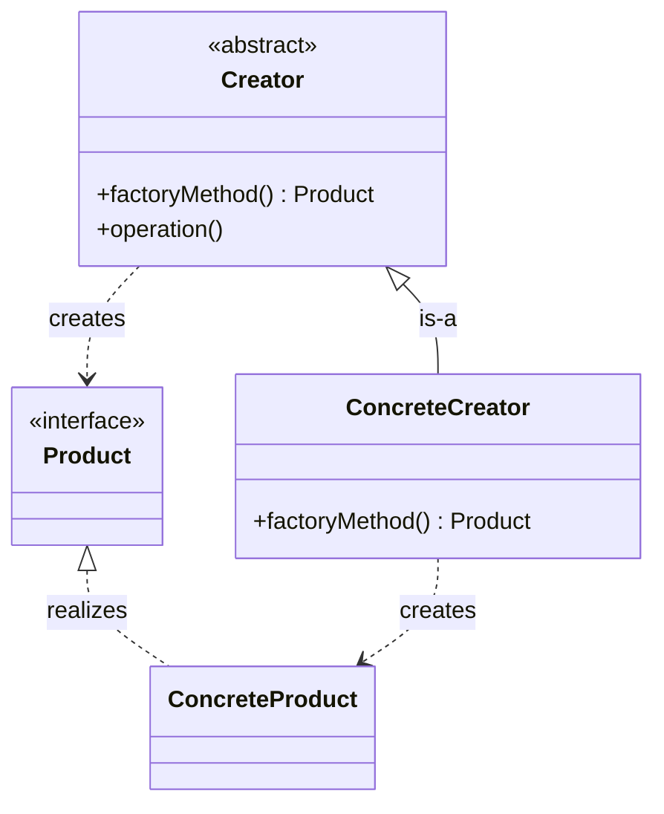
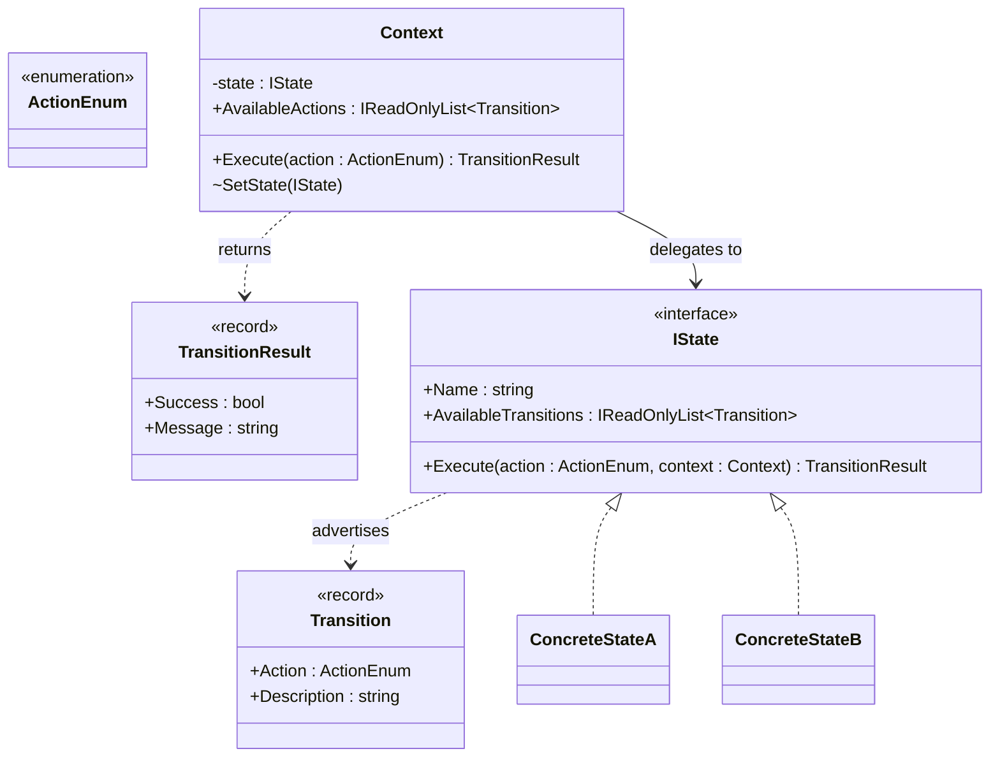
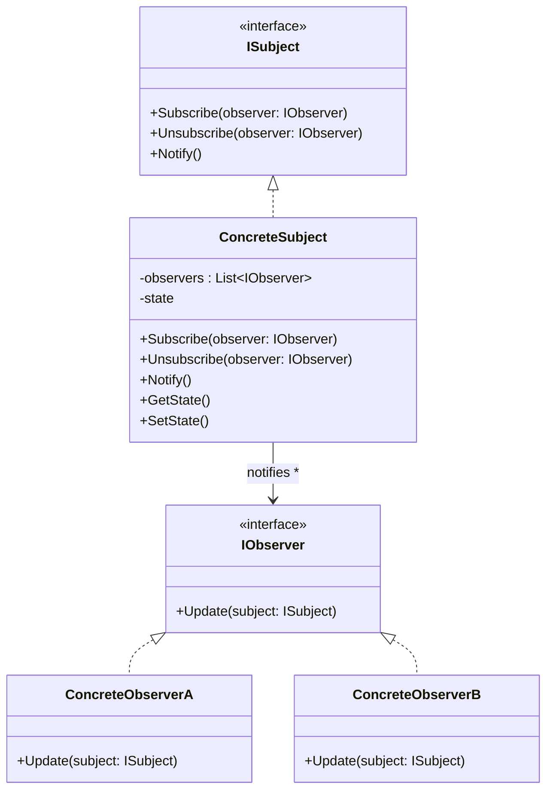

# Exam 2 Study Guide

## Introduction

Exam 2 is **Monday, March 30 at 6:30 PM**. You must be present in the lecture hall.

The exam format is the same as Exam 1: **in-person, written, closed-book, no devices**. Question types include **true/false, multiple choice, and short answer**.

Exam 2 is **cumulative**, but approximately **80% of the exam focuses on the material following Lecture 6 (Liskov Substitution Principle)**. The remaining 20% draws from earlier material covered on Exam 1.

**Study your Exam 1 material.** The graded paper copy was returned to you in class. The electronic version is NOT available. Review your Exam 1 answers and corrections alongside the [Exam 1 Study Guide](exam1-study-guide.md).

If there is any mismatch between this guide and in-class/D2L announcements, follow the instructor's latest announcement.

#### AI Attribution

> Some parts of this document were AI-generated by Claude using the course's lecture material, assignments, and assignment solutions.

## Table of Contents

- [Introduction](#introduction)
- [Concepts: Lectures 7-13](#concepts-lectures-7-13)
- [Philosophy of Software Design: Chapters 9-10](#philosophy-of-software-design-chapters-9-10)
- [Patterns](#patterns)
- [Concept Comparisons](#concept-comparisons)
- [Terminology](#terminology)
- [Example Questions](#example-questions)
- [Example Questions - Answers](#example-questions---answers)

## Concepts: Lectures 7-13

### Lecture 7 - Interface Segregation Principle (ISP)
Focus: clients should not be forced to depend on interfaces they do not use.

Fat interfaces create avoidable operational risks: runtime failures from `NotImplementedException`, fragile dependency graphs, and bloated tests. Cohesive segregation groups methods by client use case, not implementation convenience. Split interfaces along actor/client boundaries. Key heuristics: methods that are mocked, changed, or tested together likely belong together; methods with independent release cadence suggest a split. ISP connects to SRP (split by reason-to-change), OCP (stable abstractions enable extension), and LSP (prevents fat interfaces that subclasses cannot safely fulfill).

Detection signals: `NotImplementedException`, empty method overrides, boolean flags in method signatures like `process(order, includeTaxExport, rebuildIndex)`, and ripple effects from small changes touching unrelated clients.

Source: [07-interface-segregation-principle.md](../presentations/07-interface-segregation-principle.md)

### Lecture 8 - Factory Patterns and Singleton
Focus: object creation as a design tool to reduce coupling and enable runtime behavior selection.

Three factory variants serve different creation problems. **Simple Factory** uses one centralized selector (dictionary or switch) to return the correct implementation for a runtime key — use when single-key selection is sufficient. **Factory Method** moves creation into creator subclasses, providing a protected extension point — use when creation varies by creator subtype. **Abstract Factory** creates compatible families of related objects — use when clients must construct whole sets of related products (e.g., UI themes with Button, Dialog, Input). **Singleton** controls instance count and access; thread safety is critical for production.

Shared evaluation checklist: explicit naming (`*Factory`, `*Creator`), SOLID compliance, and knowing when to stop — if simpler design is clearer and stable, prefer it.

Source: [08-factory-singleton.md](../presentations/08-factory-singleton.md)

### Lecture 9 - Dependency Inversion Principle (DIP)
Focus: high-level policy should not depend directly on low-level technical details.

**Rule 1 (Module Direction):** High-level modules should not depend on low-level modules; both should depend on abstractions. What is actually inverted is compile-time dependency direction, NOT runtime execution order.

**Rule 2 (Abstraction Shape):** Abstractions should not depend on details; details should depend on abstractions. The abstraction's shape is dictated by policy needs, not by technology implementation.

Key distinction: **volatile dependencies** (external boundaries like databases, APIs, file systems) should be abstracted; **stable dependencies** (local pure logic you own completely) should not. Add an abstraction when an external boundary exists, implementation likely changes, or policy tests need a seam.

Five architectural boundaries where DIP applies: inbound interface, asynchronous processing, outbound integration, platform (clock, filesystem, config), and composition/lifecycle.

The **Composition Root** is the single application boundary where concrete implementations are created and wired. One per application boundary (console app, web host, worker service, test harness).

Synonyms in practice: program to interfaces, depend on contracts, dependency rule (Clean Architecture), ports and adapters (Hexagonal).

Source: [09-dependency-inversion-principle.md](../presentations/09-dependency-inversion-principle.md)

### Lecture 10 - Dependency Injection (DI)
Focus: how to operationalize DIP at runtime through automatic object-graph construction and lifetime management.

**Relationship to DIP:** DIP is the principle (high-level depends on abstractions); DI is the mechanism (collaborators provided from outside at runtime). You can apply DIP without a container (manual DI). You can use a container and still violate DIP if abstractions are weak.

Core concepts: **Container** (holds registrations and manages lifetimes), **Registration** (maps abstraction to implementation + lifetime), **Resolution** (container builds object graph from root request), **Lifetime** (Transient/Scoped/Singleton), **Scope** (bounded lifetime context, e.g., one HTTP request), **Constructor Injection** (supplying collaborators through constructor parameters).

**Service Locator** is an anti-pattern: pulling dependencies from a provider at runtime instead of declaring them explicitly in the constructor. Other failure modes: memory leaks from poor lifetime management, hidden dependencies, circular dependencies.

Source: [10-dependency-injection.md](../presentations/10-dependency-injection.md)

### Lecture 11 - MVC in Modern Web Applications
Focus: how to organize a web application so it stays understandable over time.

Two meanings of MVC: the **pattern** (separate interaction, presentation, state — originating in Smalltalk-80) and the **framework** (full app architecture with routing, binding, DI, middleware). In modern frameworks, "Model" expands beyond a single object to include services, domain entities, repositories, strategies, and DTOs.

**Canonical MVC responsibilities:** Controller receives and coordinates; Model holds state and behavior; View renders output. The controller should be short — it maps bound view models into domain-typed queries/commands before calling services. Services never see framework or presentation types.

The **Boundary Rule**: inject abstractions into controllers, keep orchestration in services, keep business rules in domain objects/policies/strategies, keep storage behind repository abstractions, keep concrete wiring in the composition root.

Anti-patterns: god controllers holding business logic, domain rules leaking into views, service layers that are just CRUD wrappers, DI container accessed from business code.

Source: [11-mvc-di-srv-domain.md](../presentations/11-mvc-di-srv-domain.md)

### Assignment 3 - Tea Shop MVC Web Application
Focus: applying SOLID, Factory, Singleton, Strategy, Decorator, and DI in an MVC web application.

The assignment evolves the Assignment 2 Tea Shop from a console application into a server-rendered MVC web application (ASP.NET Core MVC or Spring Boot). It reinforces proper separation of controller, service, domain, and repository layers with dependency injection.

Source: [assignment-3.md](../assignments/assignment-3.md)

### Lecture 12 - State Machine Pattern
Focus: model objects whose behavior changes based on internal state.

The naive approach (if/else chains) suffers from scattered state logic, change amplification, magic strings, SRP violations (one reason-to-change per state, all tangled in one class), OCP violations (adding a state touches every method), and DIP violations (direct coupling to string literals).

**Finite State Machines (FSM):** A finite set of states, a finite set of events, a transition function mapping (state, event) to next state, an initial state, and optionally terminal states. Transitions can be forward, backward (returning to a previously visited state), or self-transitions (staying in the current state with side effects).

**The State Pattern (GoF):** Three roles — Context (holds reference to current state, delegates), State Interface (narrow: `AvailableTransitions` + `Execute`), and Concrete States (implement behavior and transition logic for one state).

**Transition-driven design:** Each state advertises its valid transitions. The caller asks "what can I do?", picks from the list, and passes the choice back. The state is the single authority over both what is valid and how to execute it. The caller never guesses. Actions use an enum (e.g., `OrderAction`) for compile-time safety — no magic strings.

**Key design decisions:** Concrete state classes own transitions (not the context). `SetState` is passive — the current state tells the context what comes next. Terminal states return an empty transition list.

**When to refactor:** You dread adding a new state, bugs trace to missed branches, you duplicate if/else chains for new actions, merge conflicts appear in the same class, or TODO comments mark missing state handling.

**Anti-pattern: Working around the state machine.** Implementing state-dependent logic outside the state machine (in the controller, service layer, or calling code) because it feels easier. This splits authority, breaks audit trails, and erodes the pattern over time.

Source: [12-state-machine-pattern.md](../presentations/12-state-machine-pattern.md)

### Lecture 13 - Observer Pattern (Sections 1-5)
Focus: one-to-many notification with zero knowledge of the many.

The naive approach (subject calls each consumer by name) violates OCP (adding a consumer requires modifying the subject), creates tight coupling, freezes consumers at compile time, and violates SRP (subject both reads sensors and manages audience).

**The Observer Pattern (GoF):** Three roles — Subject (Observable/Publisher: holds state, maintains observer list, sends notifications), Observer (Subscriber/Listener: wants to be informed), and Client (creates subject, registers observers).

**How it works:** Subject maintains an empty observer list. Observers call `Subscribe()` to register. When state changes, subject iterates the list calling `Update()` on each. Each observer responds in its own way. Observer may call `Unsubscribe()` at any time. Subject never inspects or depends on concrete observer types.

**Push vs Pull notification:** Push sends data as arguments (simple for observers but adding fields changes the interface). Pull sends a reference to the subject (observer picks needed data; subject interface stays stable but creates more coupling to subject's API).

**Lapsed listener memory leak:** Observers that are not unsubscribed before going out of scope remain in the subject's list, preventing garbage collection.

**Language-level support:** C# provides `event`/`delegate` keywords. Java uses listener interfaces (hand-rolled) or Spring's `ApplicationEvent`.

**Framework implementations:** Angular uses RxJS `BehaviorSubject` with `.subscribe()` in `ngOnInit()` and `.unsubscribe()` in `ngOnDestroy()`. React uses Context + `useState` where mounting = subscribing and unmounting = unsubscribing.

Sources: [13-observer-pattern.md](../presentations/13-observer-pattern.md), [demo-3-angular](../presentations/13-observer-pattern-demos/demo-3-angular/), [demo-4-react](../presentations/13-observer-pattern-demos/demo-4-react/)

## Philosophy of Software Design: Chapters 9-10

*Textbook Readings: A Philosophy of Software Design, 2nd Edition, Ousterhout*

*Note: Chapters 1-8 were covered on Exam 1. Review the [Exam 1 Study Guide](exam1-study-guide.md) for those chapters.*

### Chapter 9 - Better Together or Better Apart?
- Related functionality should be grouped together when the pieces share information, are always used together, or overlap conceptually. 
*ISP splits interfaces along client boundaries — but methods that change together stay together.*
- Splitting code that is closely related increases complexity by forcing readers to navigate between scattered pieces. 
*The State pattern groups all behavior for one state into a single class rather than scattering it across methods.*
- Splitting is warranted when the pieces are truly independent and have different rates of change. 
*DIP identifies volatile vs stable dependencies to determine where abstraction boundaries belong.*

### Chapter 10 - Define Errors Out of Existence
- The best way to deal with errors is to design them away so they cannot occur. 
*The State pattern's transition-driven design advertises only valid operations — invalid requests cannot happen in normal operation.*
- Exception handling is one of the worst sources of complexity in software. 
*The State pattern uses `TransitionResult` (success/failure) instead of exceptions for invalid transitions — expected outcomes should not be exceptional.*
- Defining errors out of existence simplifies both the implementation and the interface. 
*Observer's `Unsubscribe()` is safe to call even if the observer is not subscribed — no error, no special case.*

## Patterns

### Factory Patterns

**Simple Factory Intent:** One centralized selector returns the correct concrete implementation for a runtime key.

**Factory Method Intent:** Creator subclasses decide which concrete product gets instantiated; provides a protected extension point.

**Abstract Factory Intent:** Create compatible families of related objects without specifying concrete classes.

**Canonical UML (Factory Method):**

**Factory Selection Matrix:**

| Main Question | Prefer | Why |
|---|---|---|
| "Given runtime key, which implementation?" | Simple Factory | One centralized selector keeps branching out of business logic |
| "Which subclass should decide creation?" | Factory Method | Creation varies by creator subtype and extension point |
| "How to create compatible set of related objects?" | Abstract Factory | One concrete factory guarantees consistent product family |

**Relation to SOLID:** Factories localize creation detail (SRP), allow new products without editing existing code (OCP), and pull creation complexity downward (Ousterhout Ch. 8).

### State Pattern

**Intent:** Allow an object to alter its behavior when its internal state changes; the object appears to change its class.

**Canonical UML:**

**Relation to SOLID:**
- **SRP:** Each state class has one reason to change — the behavior of that state.
- **OCP:** Adding a new state means adding a new class, not editing existing ones.
- **LSP:** Every state fulfills the same `IState` contract with `TransitionResult` — no exceptions, no surprises.
- **ISP:** The narrow interface (`AvailableTransitions` + `Execute`) avoids the wide-interface problem where every state must implement `Pay`, `Ship`, `Cancel`, etc.
- **DIP:** The context depends on `IState` (abstraction), not concrete state classes.

### Observer Pattern

**Intent:** Define a one-to-many dependency between objects so that when one object changes state, all its dependents are notified and updated automatically.

**Canonical UML:**

**Relation to SOLID:**
- **SRP:** The subject is responsible for state and notification mechanics; each observer is responsible for its own reaction. Neither knows the other's internals.
- **OCP:** Adding a new observer requires zero changes to the subject — it is pure extension.
- **LSP:** Every observer fulfills the `IObserver` contract. The subject calls `Update()` on each without inspecting or casting to concrete types.
- **DIP:** The subject depends on `IObserver` (abstraction), not on `CurrentConditionsDisplay` or `StatisticsDisplay`.

## Concept Comparisons

### State vs Strategy
- **State:** Behavior changes over the object's lifetime based on internal transitions. The state object knows which state comes next.
- **Strategy:** Behavior is selected at creation or configuration time by an external client. The strategy is unaware of alternatives.
- **Key shape:** State has a context that transitions between states automatically; Strategy has a context with one selected algorithm.

### State vs Conditional Logic
| Aspect | If/Then | State Pattern |
|--------|---------|---------------|
| State logic location | Scattered across every method | Cohesive in each state class |
| Adding new state | Edit every method | Add one new class |
| Caller burden | Must know valid operations | Asks state for valid transitions |
| Compile-time safety | String comparisons | Type-safe enum + state classes |
| Testing | All state logic tangled | Test each state independently |

### Observer vs Direct Coupling
| Aspect | Direct Coupling | Observer Pattern |
|--------|----------------|-----------------|
| Adding a consumer | Edit the source | Register a new observer (no source changes) |
| Runtime flexibility | Fixed at compile time | Subscribe/unsubscribe at any time |
| Source knowledge | Knows every consumer by name | Knows only `IObserver` interface |
| Removal | Edit the source | Call `Unsubscribe()` |

### DIP vs DI
- **DIP** is a principle: high-level modules depend on abstractions, not low-level details.
- **DI** is a mechanism: collaborators provided from outside at runtime (constructor injection, container).
- You can follow DIP without DI (manual wiring). You can use DI and still violate DIP (weak abstractions).

### Push vs Pull (Observer)
| Approach | How | Tradeoff |
|----------|-----|----------|
| Push | Subject sends data as arguments | Simple for observers; adding fields changes interface |
| Pull | Subject sends reference to itself | Observer picks needed data; subject interface stable |

### Factory Method vs Abstract Factory
| | Factory Method | Abstract Factory |
|---|---|---|
| Creates | One product | Family of related products |
| Extension | Subclass the creator | Implement a new factory |
| Guarantees | Correct product per creator | Consistent product family |

## Terminology

*Note: Terms from Exam 1 (abstraction, encapsulation, SRP, OCP, LSP, UML relationships, Strategy, Decorator, etc.) are still fair game. See the [Exam 1 Study Guide](exam1-study-guide.md).*

- **Abstract Factory** - Pattern that creates compatible families of related objects without specifying concrete classes.
- **Architectural seam** - A join point where implementations can be swapped (typically at a DIP boundary).
- **Available transitions** - The list of valid operations a state advertises to the caller.
- **BehaviorSubject (RxJS)** - An Observable that holds a current value and emits it to new subscribers immediately, then emits subsequent changes.
- **Change amplification** - A simple change requires scattered modifications across many files.
- **Composition Root** - The single application boundary where concrete implementations are created and wired to abstractions.
- **Constructor injection** - Supplying required collaborators through constructor parameters.
- **Container (DI)** - Runtime component that holds registrations and manages object construction and lifetimes.
- **Context (State pattern)** - The object whose behavior varies; holds a reference to the current state.
- **Deep module** - A module with a simple interface that hides significant internal complexity (Ousterhout Ch. 4).
- **Dependency Injection (DI)** - Mechanism where collaborators are provided from outside at runtime rather than created internally.
- **Dependency Inversion Principle (DIP)** - High-level modules depend on abstractions, not low-level details; abstractions do not depend on details.
- **Deterministic Finite Automaton (DFA)** - An FSM where every (state, input) pair maps to exactly one next state.
- **Factory Method** - Pattern where creator subclasses decide which concrete product to instantiate.
- **Fat interface** - An interface with too many methods, forcing clients to depend on operations they do not use.
- **Finite State Machine (FSM)** - A formal model with finite states, finite events, a transition function, an initial state, and optional terminal states.
- **Interface Segregation Principle (ISP)** - Clients should not be forced to depend on interfaces they do not use.
- **Lapsed listener** - Memory leak caused by observers that are not unsubscribed before going out of scope.
- **Lifetime (DI)** - Reuse policy for a registered service: Transient (new each time), Scoped (one per scope/request), Singleton (one for application lifetime).
- **MVC (Model-View-Controller)** - Pattern separating interaction (Controller), state and behavior (Model), and presentation (View).
- **Object graph** - The full runtime tree of objects created when the container resolves a root service.
- **Observer (Subscriber/Listener)** - Object that registers with a subject to receive change notifications.
- **Registration (DI)** - Mapping from abstraction/service type to implementation and lifetime in a container.
- **Resolution (DI)** - Asking the container to construct and return a service instance with all its dependencies.
- **Scope (DI)** - A bounded lifetime context (e.g., one HTTP request) within which scoped services are shared.
- **Self-transition** - A state transition where the next state is the same as the current state (with side effects).
- **Service Locator** - Anti-pattern where dependencies are pulled from a provider at runtime instead of declared in the constructor.
- **Shallow interface** - An interface with many irrelevant methods forced on clients (ISP violation signal).
- **Simple Factory** - One centralized selector that returns the correct implementation for a runtime key.
- **Singleton** - Pattern that ensures a class has only one instance and provides a global access point.
- **Subject (Observable/Publisher)** - The object that holds state and sends notifications to registered observers.
- **Terminal state** - A state with no outgoing transitions; the lifecycle ends here.
- **Transition-driven design** - States advertise their available transitions; the caller selects from the advertised list.
- **TransitionResult** - A record carrying success/failure and a message, replacing exceptions for expected invalid-operation outcomes.
- **Volatile dependency** - A dependency that crosses external boundaries, is likely to change by vendor/environment, or prevents unit testing without live resources.

## Example Questions

> These were written by Claude with detailed prompt guidelines from Jeff.
>
> The actual exam will be handmade by Jeff.
>
> These are provided to facilitate discussion, reduce exam anxiety, and give you a glimpse of the type of material you will see.
>
> *Most* questions on the actual exam will be Bloom 3 or 4 (which require problem-solving and analysis using the course material). The remainder will be Bloom 1 or 2 (memorization, basic understanding). Look up Bloom's Taxonomy for more details on Bloom levels.

### True/False
1. (Bloom 3/4) A class that implements an interface but throws `NotImplementedException` for half the methods is a signal of an ISP violation.
2. (Bloom 1/2) In the State pattern, the context object decides which state to transition to next.
3. (Bloom 3/4) A Simple Factory and a Factory Method pattern solve the same design problem and are interchangeable.
4. (Bloom 1/2) The Dependency Inversion Principle says that runtime execution order should be inverted.
5. (Bloom 3/4) In the Observer pattern, adding a new observer requires modifying the subject class.
6. (Bloom 3/4) Using a DI container guarantees that your code follows the Dependency Inversion Principle.
7. (Bloom 3/4) In a transition-driven State pattern, terminal states return an empty list of available transitions.
8. (Bloom 1/2) In MVC, the controller should contain business logic to keep the model simple.

### Multiple Choice
9. (Bloom 3/4) An `OrderService` directly instantiates `SqlOrderRepository` in its constructor. Which principle is most directly violated?
A. Single Responsibility Principle
B. Open/Closed Principle
C. Dependency Inversion Principle
D. Interface Segregation Principle

10. (Bloom 3/4) A state machine for order processing needs a new "Returned" state. In the State pattern, what is the minimum change required?
A. Add a new `ReturnedOrderState` class implementing `IOrderState`
B. Edit every existing state class to handle the "Return" action
C. Add a new branch to every method in the `Order` class
D. Create a new `Order` subclass for returned orders

11. (Bloom 1/2) Which DI lifetime creates a new instance every time the service is requested?
A. Singleton
B. Scoped
C. Transient
D. Static

12. (Bloom 3/4) A `WeatherStation` calls `phoneDisplay.Update()`, `webDashboard.Update()`, and `alertService.Update()` by name whenever temperature changes. A developer wants to add a `HeatIndexDisplay`. What is the primary design problem?
A. The displays are too loosely coupled
B. The subject must be modified every time a new observer is added
C. The observer interface is too narrow
D. The notification happens too frequently

13. (Bloom 3/4) In a DI container, you register `IPaymentStrategy` as Singleton but the implementation holds per-request state. What is the likely consequence?
A. The application fails to compile
B. Requests share mutable state, causing data corruption
C. Each request gets its own instance anyway
D. The container throws an exception at startup

14. (Bloom 3/4) An MVC controller contains 200 lines of inventory filtering logic, tax calculation, and database queries. Which is the strongest design diagnosis?
A. The controller correctly centralizes all concerns
B. The controller violates MVC by holding business and data access logic
C. The model is too decoupled from the controller
D. The view should contain the filtering logic instead

15. (Bloom 3/4) A client needs to create themed UI components (Button, Dialog, Input) that must be visually consistent. Which factory pattern is most appropriate?
A. Simple Factory
B. Factory Method
C. Abstract Factory
D. Singleton

16. (Bloom 3/4) Which symptom most directly indicates that a state machine is being "worked around"?
A. A state class has too many transitions
B. State-dependent logic exists in the controller outside the state machine
C. The state interface has a narrow `Execute` method
D. Terminal states return empty transition lists

17. (Bloom 1/2) In Angular's implementation of the Observer pattern, what RxJS construct acts as the Subject?
A. `Component`
B. `BehaviorSubject`
C. `NgModule`
D. `Subscription`

18. (Bloom 3/4) An `INotificationService` interface has methods `SendEmail`, `SendSms`, `SendPush`, `SendFax`, and `SendSlack`. A microservice that only sends emails must implement all five. Which principle is violated?
A. DIP
B. LSP
C. ISP
D. OCP

### Short Answer
19. (Bloom 1/2) Name the three roles in the Observer pattern.
20. (Bloom 3/4) A developer adds a VIP late-cancellation check in the controller: `if (order.StatusName == "Shipped" && customer.IsVip) { order.SetState(new CancelledOrderState()); }`. Explain why this is problematic and what they should do instead.
21. (Bloom 3/4) Explain the difference between DIP and DI in one or two sentences.
22. (Bloom 3/4) In a transition-driven State pattern, a `DeliveredOrderState` has no available transitions. A caller attempts `order.Execute(OrderAction.Ship)`. What happens and why is this preferable to throwing an exception?
23. (Bloom 1/2) What is a Composition Root and why should there be exactly one per application boundary?
24. (Bloom 3/4) A `WeatherStation` uses the Observer pattern. Explain what happens to memory if an observer subscribes but never unsubscribes, and name this problem.

## Example Questions - Answers

### True/False
1. True — `NotImplementedException` means the class cannot fulfill the interface contract, which is a classic ISP violation (and also LSP).
2. False — the concrete state classes own the transition decision. The context's `SetState` is passive; it stores whatever state the current state gives it.
3. False — Simple Factory uses a centralized selector with a runtime key; Factory Method uses creator subclasses with a protected extension point. They solve different creation problems.
4. False — DIP inverts compile-time dependency direction, not runtime execution order. Runtime call order stays the same.
5. False — adding a new observer means creating a new class that implements `IObserver` and calling `Subscribe()`. The subject class is never modified.
6. False — a container is a mechanism. You can use a container and still violate DIP if your abstractions are detail-shaped or your policy code depends on concrete implementations.
7. True — terminal states (e.g., Delivered, Cancelled) have no outgoing transitions, so they return an empty list.
8. False — the controller should be thin, delegating business logic to the model (services, domain objects). Business logic in the controller violates MVC.

### Multiple Choice
9. C — the service directly depends on a concrete low-level implementation rather than an abstraction.
10. A — in the State pattern, adding a state means adding one new class. Existing states only change if they need a transition to the new state.
11. C — Transient creates a new instance on every request.
12. B — the subject is tightly coupled to concrete observers and must be modified for each new one. This violates OCP and is exactly the problem Observer solves.
13. B — Singleton lifetime means all requests share the same instance. If it holds per-request state, concurrent requests corrupt each other's data.
14. B — controllers should be thin coordinators. Business logic and data access belong in the service and repository layers.
15. C — Abstract Factory ensures a consistent family of related products (Button + Dialog + Input all from the same theme).
16. B — state-dependent logic outside the state machine splits authority, bypasses the state classes, and erodes the pattern over time.
17. B — `BehaviorSubject` holds the current value and notifies all subscribers when `.next()` is called. It maps directly to the Subject role.
18. C — the interface forces the email-only service to depend on SMS, Push, Fax, and Slack methods it does not use.

### Short Answer
19. Subject (Observable/Publisher), Observer (Subscriber/Listener), and Client (creates subject and registers observers).
20. This bypasses the state machine — the developer is forcing a state change from outside rather than going through `order.Execute(OrderAction.Cancel)`. It splits authority (some behavior in state classes, some in the controller), skips logging/validation the state would perform, and creates a precedent for future workarounds. The fix: add the "Cancel" action to `ShippedOrderState`'s available transitions for VIP cases, keeping all state-dependent logic inside the state machine.
21. DIP is a design principle stating that high-level modules should depend on abstractions, not low-level details. DI is a runtime mechanism that provides those abstractions' implementations from outside (typically via constructor injection or a container). You can follow DIP without DI, and you can use DI without following DIP.
22. The `DeliveredOrderState` returns `TransitionResult(false, "Ship is not valid. This order is delivered.")`. No exception is thrown because asking "can I ship this?" when the order is delivered is a normal question with a predictable answer, not an exceptional failure. This is composable (the result can be logged, inspected, returned to a caller) and keeps the caller out of try/catch control flow.
23. The Composition Root is the single place in an application where all concrete implementations are created and wired to their abstractions. There should be one per application boundary (web host, console app, test harness) so that volatile wiring detail is localized in one place rather than scattered throughout business logic.
24. The subject holds a reference to the observer in its internal list. Even if the observer is no longer used elsewhere, the subject's reference prevents garbage collection. Over time this accumulates — the observer continues receiving notifications it no longer processes, consuming memory and CPU. This is called a **lapsed listener** (or lapsed listener memory leak).
