# **Using UML Class Diagrams in OO Design**

**Course:** SWE 4743 – Object-Oriented Design

**Instructor:** Jeff Adkisson

## **Purpose of This Lecture**

UML class diagrams are a **communication tool**, not a programming language. Their purpose is to:

- Express *design intent* clearly  
- Reveal structure, responsibility, and relationships  
- Support reasoning and discussion *before* code exists  
- Document important architectural decisions

In this course, UML class diagrams are used to support the **object-oriented design process** — not to produce a giant diagram with every class in your application.

> A UML diagram can be *useful* even when it is incomplete, approximate, or later changed.

---

## Structural vs Non-Structural Relationships

Before learning UML arrows and symbols, it is essential to understand **what kind of relationships UML class diagrams describe**.

UML relationships differ along two important dimensions:

- Whether they affect an object’s **runtime state**
- Whether they define **type-level structure**

We will explore individual relationship types in detail later in this lecture. 

For now, the goal is to establish the **big picture categories**.

---

### Structural Relationships

Structural relationships describe **how a system is shaped**, either through type structure or object state.

#### Structural (Type-Level)

These relationships affect the **type system**, not object state.

- Define substitutability and contracts  
- Exist at compile time  
- Do not imply object ownership or lifetime  

Examples include:
- **Inheritance**
- **Interface realization**

> **Mental model:** *“Part of what this system *is*.”*

#### Structural (State-Level)

These relationships affect an object’s **runtime structure and lifetime**.

- Represented by fields  
- Exist beyond a single method call  
- Define ownership, sharing, or lifetime semantics  

Examples include:
- **Association**
- **Aggregation**
- **Composition**

---

### Non-Structural (Usage) Relationships

Non-structural relationships describe **temporary usage** between objects during execution.

- Exist only during method execution  
- Live on the call stack  
- Do **not** define an object’s state  
- Do **not** define type structure  

In UML, these are typically represented as **dependencies**.

> **Mental model:** *“Used briefly.”*

---

## **Using UML Class Diagrams to Support The Design Process**

UML class diagrams are most valuable **early**, when ideas are still flexible and design decisions are inexpensive to change.

Rather than simply documenting *what you have already built* (which class diagrams can do), UML helps you reason about **what you should build**.

When used correctly, class diagrams support the design process by helping you think, ask better questions, and communicate your ideas.

---

### **1. Clarifying Responsibilities**

A class diagram forces you to confront responsibility boundaries.

Each class box raises questions such as:

- What does this class *know*?
- What does this class *do*?
- What should it *not* be responsible for?

If a class diagram feels crowded or confusing, that is often a sign that responsibilities are poorly assigned — not that the diagram is wrong.

UML helps expose these issues *before* they turn into tangled code.

---

### **2. Reasoning About Relationships Before Code Exists**

UML makes relationships explicit in a way code often hides:

- **Associations** reveal how objects collaborate
- **Inheritance** prompts questions about substitutability and reuse
- **Composition vs. aggregation** encourages thinking about ownership and lifecycle

These relationships are design decisions, not implementation details.  
They are much easier to discuss and revise in a diagram than after code has been written.

---

### **3. Exploring Design Alternatives**

Class diagrams are **cheap to change**.

They allow you to:
- Sketch multiple approaches
- Compare tradeoffs
- Ask “what if?” questions

For example:
- *What if this method belonged to a different class?*
- *What if we replaced inheritance with composition?*
- *What happens if this dependency is removed?*

UML supports experimentation without the cost of refactoring code.

---

### **4. Communicating Design Intent**

A good class diagram communicates intent, not mechanics.

It should help answer questions like:
- What are the key concepts in this system?
- How are responsibilities divided?
- Where are the important abstractions?

This makes UML especially useful for:
- Team discussions
- Design reviews
- Explaining your reasoning to others
- Making your thinking visible to your future self

The goal is **shared understanding**, not syntactic completeness.

---

### **5. Focusing on What Matters**

In this course, you are **not** expected to model every class, field, or method.

Instead:
- Model the *important* classes
- Show relationships that influence design decisions
- Omit details that do not add insight

A good UML diagram is:
- Selective
- Purpose-driven
- Easy to understand at a glance

If a diagram becomes large or hard to read, it has likely stopped serving its purpose.

---

### **6. Documenting Object-Oriented Design Patterns**

UML class diagrams are also commonly used to document **object-oriented design patterns**, such as **State**, **Strategy**, **Observer**, and **Factory**.

In this context, the goal is not to show every class in your system, but to clearly illustrate:

- The *roles* each class plays in the pattern  
- The *collaboration structure* between those roles  
- How responsibilities are distributed across the pattern  

For example, a UML diagram of the **State pattern** highlights:
- The `Context` class
- The abstract `State` interface
- Concrete state implementations
- How behavior changes through delegation rather than conditionals

These diagrams help communicate *why* a design was chosen, not just *how* it was implemented.

Because design patterns rely on shared vocabulary, UML provides a visual shorthand that makes pattern-based designs easier to explain, review, and maintain.

---

## **Key Takeaways**

UML class diagrams are a **thinking and communication tool**.

They help you:
- Design before you build
- Explore alternatives and tradeoffs
- Assign and refine responsibilities
- Reason about relationships and collaboration
- Communicate design intent clearly
- Document important architectural decisions and design patterns

A UML diagram is successful when it improves the quality of your design and your ability to explain it — not when it perfectly mirrors your code.

## **UML Class Diagram Fundamentals and Best Practices**

- [1. Class Box Layout](#1-class-box-layout)
- [2. Class Annotations](#2-class-annotations)
- [3. Class Inheritance](#3-class-inheritance)
- [4. Interface Realization](#4-interface-realization)
- [5. Dependencies](#5-dependencies)
- [6. Associations](#6-associations)
- [7. Aggregation vs Composition](#7-aggregation-vs-composition)
- [8. Access Modifiers](#8-access-modifiers)
- [9. Abstract vs Concrete Classes](#9-abstract-vs-concrete-classes)
- [10. Method Parameters and Return Types](#10-method-parameters-and-return-types)
- [11. Representing Generic Types](#11-representing-generic-types)
- [12. Representing Multiplicity](#12-representing-multiplicity)
- [13. Adding Titles and Notes](#13-adding-titles-and-notes)
- [14. Comments](#14-comments)
- [15. Hiding Empty Members](#15-hiding-empty-members)
- [16. Diagram Direction](#16-diagram-direction)
- [17. UML Class Diagram Mistakes](#17-uml-class-diagram-mistakes)
- [18. Scope and Realistic Usage of UML](#18-scope-and-realistic-usage-of-uml)
- [19. Will a Developer Implement UML Exactly?](#19-will-a-developer-implement-uml-exactly)
- [20. Why Mermaid for UML?](#20-why-mermaid-for-uml)
- [21. Bad UML vs Good UML (Design Contrast)](#21-bad-uml-vs-good-uml-design-contrast)
- [22. Relationship Summary](#22-relationship-summary)
- [23. Student Exercise: Identify the Relationship](#23-student-exercise-identify-the-relationship)
- [24. UML Class Pattern Demonstration: Strategy](#24-uml-class-pattern-demonstration-strategy)
- [25. UML Class Pattern Demonstration: Strategy Implementation to vary Sort Algorithm Choices by Collection Size](#25-uml-class-pattern-demonstration-strategy-implementation-to-vary-sort-algorithm-choices-by-collection-size)

## **1. Class Box Layout**

A UML class is drawn as a rectangle with **three zones**:

1. **Class name**
2. **Members (fields / properties)**
3. **Methods (operations)**

### **Example**

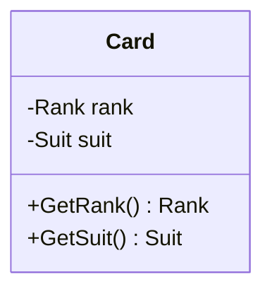

### **Notes**

- Members and methods are optional and may be hidden
- Focus on *what matters for design*, not every implementation detail

## **2. Class Annotations**

### **Interfaces**

Interfaces are marked using <<interface>>.

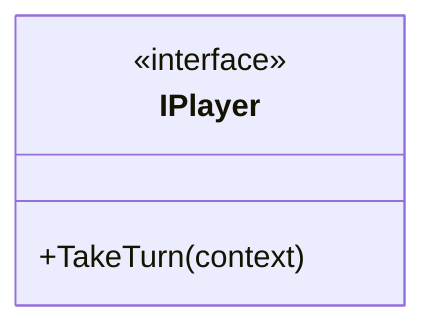

### **Enumerations**

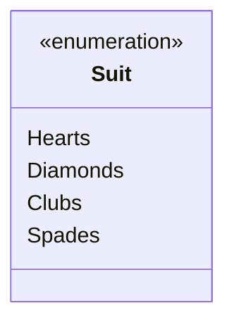

## **3. Class Inheritance**

Inheritance represents an **is-a** relationship. The child class *is substitutable* for the parent.

> **Mental model:** “If I can replace the parent with the child everywhere, inheritance might be appropriate.”

Inheritance represents an **is-a** relationship.

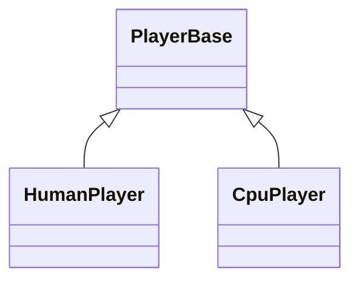

### **C# Example**

```c#
public abstract class PlayerBase
{
    protected readonly List<ICard> _hand = new();
}

public class HumanPlayer : PlayerBase { }
public class CpuPlayer : PlayerBase { }
```

## **4. Interface Realization**

**Realization** is the UML term for *implementing an interface*.

- Solid line + hollow triangle = inheritance (is-a)
- Dashed line + hollow triangle = realization (implements)

> **Mental model:** *Classes inherit behavior; they realize contracts.*

When a class implements an interface, UML uses a **dashed arrow**.

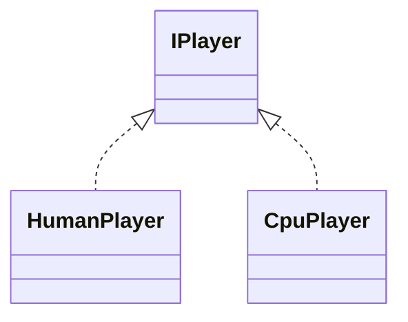

### **C# Example**

```
public interface IPlayer
{
    void TakeTurn(TurnContext context);
}
```

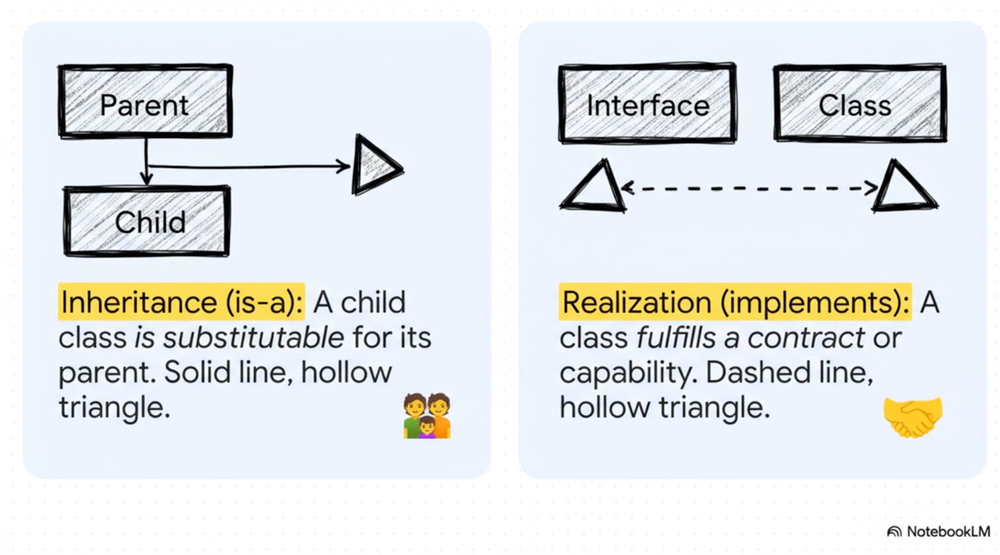

## **5. Dependencies**

> **Important framing:** UML class diagrams describe **object structure**, not execution flow.
>  
> Dependencies exist precisely because no structural relationship exists.

A **dependency** indicates that one class *uses* another temporarily.

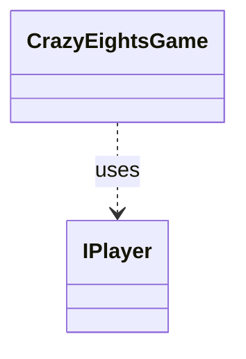

### **Interpretation**

- Dependencies often appear as **method parameters**
- They do *not* imply ownership

### **Code Examples**

Before introducing associations, it is important to distinguish between **usage** and **structure**.

- **Non-structural relationships** exist only during method execution
- **Structural relationships** are part of an object’s state and survive method calls

> **Rule:** If a relationship exists only on the call stack, it is **not structural**.

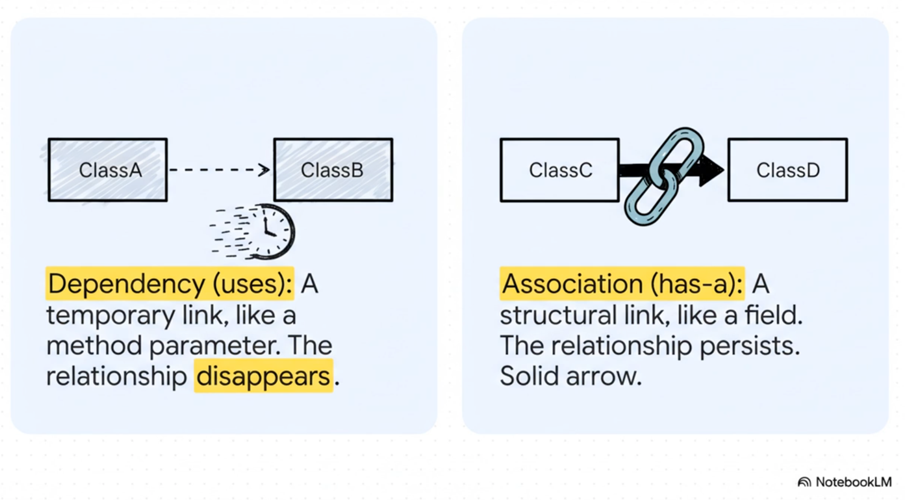

## **Structural vs Non-Structural Relationships**

### **Structural Relationship (Association)**

```csharp
public class CrazyEightsGame
{
    private readonly Deck _deck;

    public CrazyEightsGame(Deck deck)
    {
        _deck = deck;
    }

    public void Run()
    {
        var card = _deck.Draw();
    }
}
```

**Why this is an association:**

- `Deck` is stored as a **field**
- The relationship exists for the lifetime of the game
- The game’s structure depends on the deck
- `Deck`'s lifetime ownership is external

---

### **Non-Structural Relationship (Dependency)**

```csharp
public class CrazyEightsGame
{
    public void Run(Deck deck)
    {
        var card = deck.Draw();
    }
}
```

**Why this is not an association:**

- The deck is not part of the game’s state
- The relationship exists only during method execution
- The relationship disappears when the method returns

---

#### **Key Takeaway**

> **A relationship is structural if it is represented by a field and defines part of the object’s state.**

If the relationship only exists on the call stack, it is a **dependency**, not an association.

## **6. Associations**

### **Association Hierarchy**

In UML, **association** is the general relationship.  
**Aggregation** and **composition** are *specialized forms* of association that add **lifetime and ownership semantics**.

```
Association (least specific structural relationship)
├── Aggregation (weak ownership / shared lifetime)
└── Composition (strong ownership / exclusive lifetime)
```

- Use **association** when you want to show that objects are structurally related.
- Use **aggregation** when you want to emphasize that the related object is *retained but not owned*.
- Use **composition** when you want to emphasize *exclusive ownership and shared lifetime*.

> **Guideline:** All aggregations and compositions are associations, but not all associations need to specify ownership.

> **Design note:** If ownership and lifetime semantics are not important to the discussion, a **plain association** is sufficient.
>  
> UML intentionally allows designers to omit ownership details unless they matter.

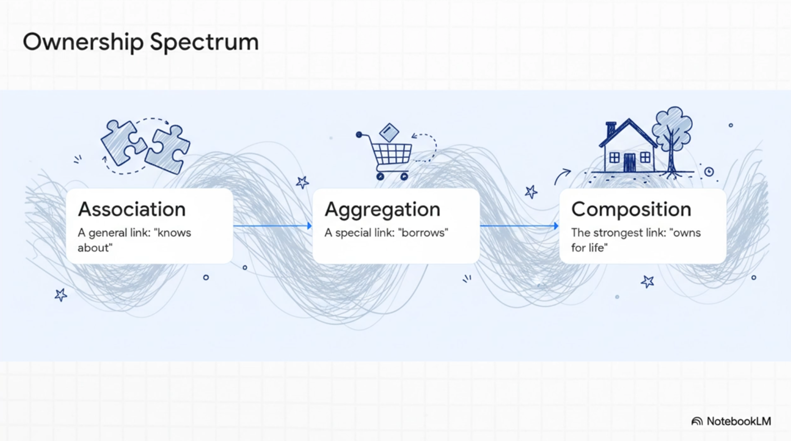

An **association** represents a **structural relationship** between two objects that exist simultaneously.

A relationship is *structural* when:

- One object holds a reference to the other as part of its **state**
- The relationship exists **beyond a single method call**
- Neither object necessarily controls the other’s lifetime

> **Mental model:** “These objects know about each other.”

Associations represent a longer-lived relationship between objects.

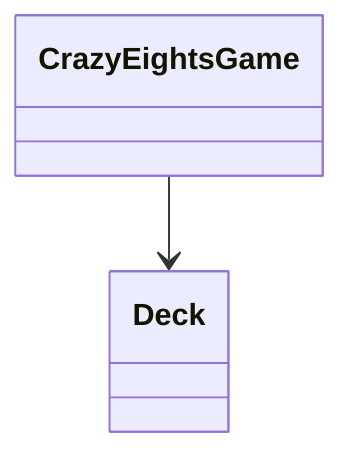

### **Meaning**

- The game *has a* deck
- The deck exists independently
- The relationship is part of the game’s structure

## **7. Aggregation vs Composition**

### **Decision Guide (Relationship Classification)**

Use the following questions to classify the relationship:

```
Is the object only used as a method parameter?
→ Dependency

Is the object stored as a field?
→ Association

Was the object created internally?
→ Composition

Was the object supplied from outside?
→ Aggregation
```

This is one of the **most misunderstood areas** of UML.

Aggregation and composition are **about object lifetime**, *not collections*.

### **Conceptual Meaning**

**Aggregation (shared lifetime)**  
- The object is retained but not owned  
- The part may exist before or after the whole  
- Lifetime is independent

> **Mental model:** “I borrow it.”

**Composition (owned lifetime)**  
- The object is created and owned internally  
- The part does not meaningfully exist on its own  
- Lifetime is bound to the owner

> **Mental model:** “If the owner dies, the parts die too.”

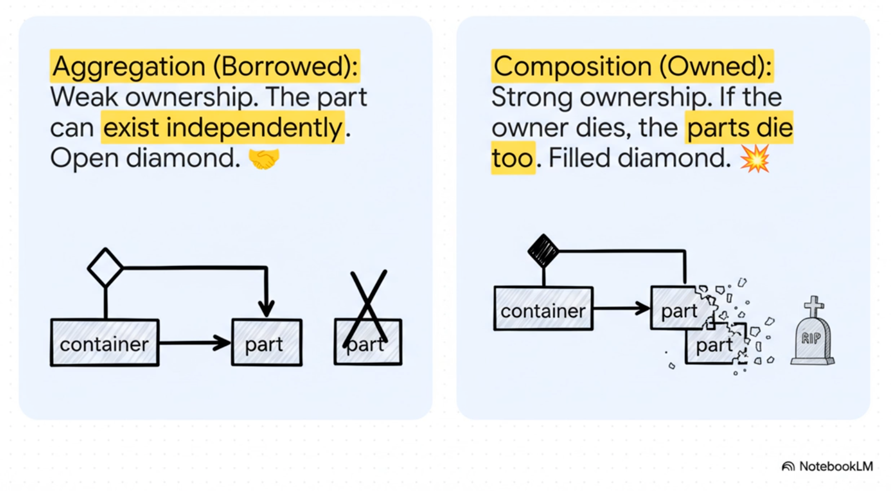

### **UML Notation: Aggregation**

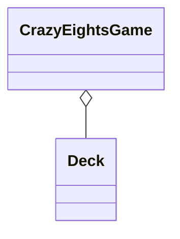

### **UML Notation: Composition**

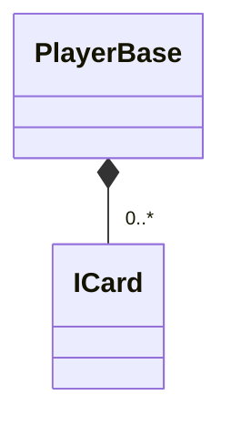

## **Object Lifetime Demonstration (C#)**

### **Composition Example**

```c#
public class PlayerBase
{
    private readonly List<ICard> _hand = new(); // created and destroyed with Player
}
```

### **Aggregation Example**

```c#
public class CrazyEightsGame
{
    private readonly Deck _deck;

    public CrazyEightsGame(Deck deck)
    {
        _deck = deck; // deck supplied from outside
    }
}
```

## **8. Access Modifiers**

UML uses symbols:

| **Symbol** | **Meaning** |
| ---- | ----- |
| +          | public      |
| -          | private     |
| #          | protected   |

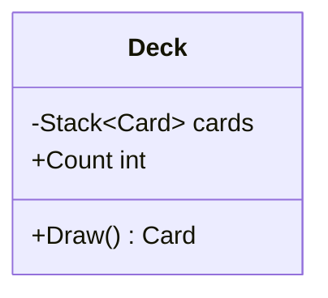

## **9. Abstract vs Concrete Classes**

Abstract elements are *italicized* in UML.

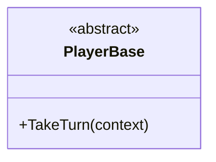

### **C# Example**

```c#
public abstract class PlayerBase
{
    public abstract void TakeTurn(TurnContext context);
}
```


## **10. Method Parameters and Return Types**

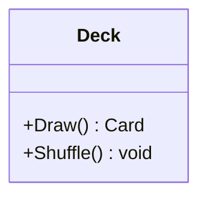

- Show return types *when they matter* (drop if it just makes the diagram more visual complex without adding clarity)
- Parameters clarify responsibilities

## **11. Representing Generic Types**

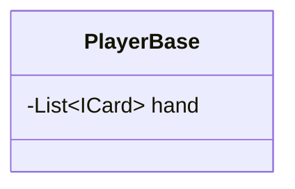

- Use ~ ~ for generics in Mermaid

## **12. Representing Multiplicity**

Multiplicity expresses **design constraints**, not documentation trivia.

> **Important:** UML multiplicity is meaningless unless it is **enforced by code**.

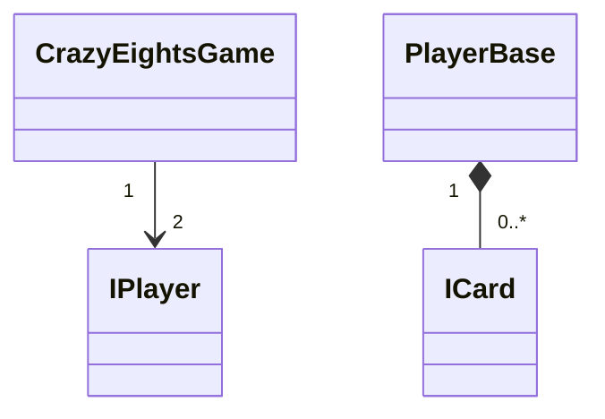

### **Common Misunderstanding**

- UML does *not* enforce multiplicity
- Collections do *not* automatically enforce rules

### **Enforcing Multiplicity in Code (C#)**

```c#
public class CrazyEightsGame
{
    private readonly IPlayer _playerOne;
    private readonly IPlayer _playerTwo;

    public CrazyEightsGame(IPlayer playerOne, IPlayer playerTwo)
    {
        _playerOne = playerOne;
        _playerTwo = playerTwo;
    }
}
```

> **Rule:** If the constructor enforces it, the design enforces it.


### **Enforcing Multiplicity in Code #1**

```c#
public class CrazyEightsGame
{
    private readonly List<IPlayer> _players;

    public CrazyEightsGame(IPlayer p1, IPlayer p2)
    {
        _players = new() { p1, p2 };
    }
}
```

### **Enforcing Bounded Required Multiplicity (1..3)**


#### **Multiplicity: 1..3 (required, capped)**

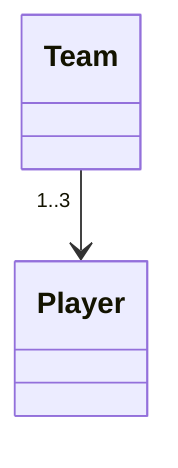

```csharp
public class Team
{
    private readonly List<Player> _players;

    public Team(IEnumerable<Player> players)
    {
        var list = players.ToList();

        if (list.Count < 1 || list.Count > 3)
            throw new ArgumentException("A team must have between 1 and 3 players.");

        _players = list;
    }
}
```

**Explanation:**  
The constructor enforces the lower bound (at least one) and the upper bound (at most three).

## **13. Adding Titles and Notes**

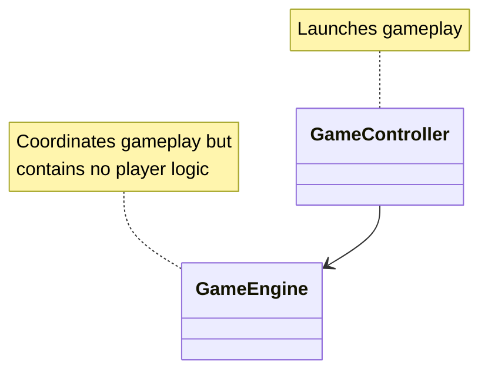

## **14. Comments**


## **15. Hiding Empty Members**

If a class name alone communicates intent, omit details.

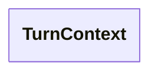

Use this to reduce visual noise.

## **16. Diagram Direction**

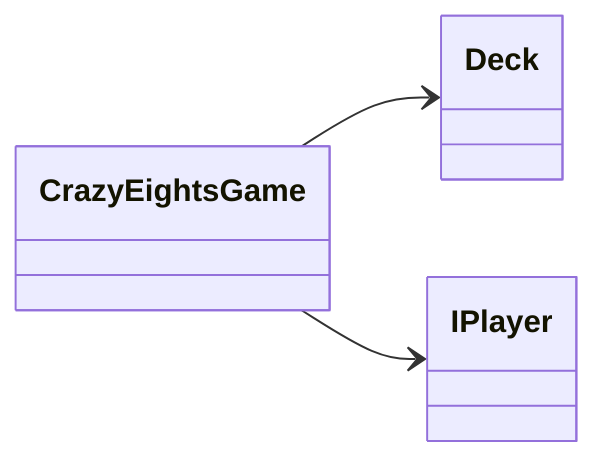

```mermaid
classDiagram
    direction RL
    CrazyEightsGame --> Deck
    CrazyEightsGame --> IPlayer
```

```mermaid
classDiagram
    direction TB
    CrazyEightsGame --> Deck
    CrazyEightsGame --> IPlayer
```

```mermaid
classDiagram
    direction BT
    CrazyEightsGame --> Deck
    CrazyEightsGame --> IPlayer
```


### **Common Directions**

- TB – top to bottom
- LR – left to right

## **17. UML Class Diagram Mistakes**

UML class diagrams are a powerful communication tool, but they are frequently misunderstood or misused.  
The mistakes below are common in both student work and industry diagrams.

### **Mistake 1: Treating UML Arrows as Program Flow**

UML class diagrams do **not** represent execution order or control flow.

- Arrows do *not* mean “this runs first”
- Arrows do *not* represent method calls
- Arrows do *not* show runtime sequencing

> **Correct mental model:** UML class diagrams describe **structure**, not behavior.

If you want to show execution order, use:
- Sequence diagrams
- Activity diagrams
- Flow charts

---

### **Mistake 2: Over-Specifying Relationships**

Students often feel pressure to choose the “most specific” arrow.

Common symptoms:
- Using composition everywhere
- Adding diamonds without lifetime justification
- Treating aggregation as mandatory

> **Better approach:** Use the *least specific* relationship that correctly communicates intent.

Plain association is often sufficient.

---

### **Mistake 3: Modeling Everything in One Diagram**

Large, all-encompassing diagrams reduce clarity.

Common problems:
- Too many classes
- Too many relationships
- Visual noise

> **Guideline:** Diagram **5–10 closely related classes** at a time.

Create multiple diagrams for different concerns.

---

### **Mistake 4: Confusing Collections with Ownership**

Collections do **not** imply composition.

```csharp
List<Card> cards;
```

This alone says nothing about:
- Who created the cards
- Who owns their lifetime
- Whether they are shared

Ownership comes from **creation and lifetime rules**, not containers.

---

### **Mistake 5: Forgetting the Question UML Is Answering**

Every UML relationship answers a question:

- Inheritance → *Is-a?*
- Realization → *Implements a contract?*
- Dependency → *Uses briefly?*
- Association → *Knows about?*
- Aggregation → *Borrowed?*
- Composition → *Owned for life?*

If you cannot state the question being answered, the relationship is probably unnecessary.

## **18. Scope and Realistic Usage of UML**

UML class diagrams are **not meant to model your entire system at once**.

### **Best Practices**

- Diagram **5–10 closely related classes** at a time

- Create multiple diagrams for different concerns... for example:

  - Core domain (game rules)
  - Player behavior
  - Card model
  
- Update diagrams as understanding evolves

> **Mental model:** UML is a *conversation aid*, not a blueprint.

## **19. Will a Developer Implement UML Exactly?**

In most real-world teams, a UML class diagram is treated as a **communication artifact**, not a strict specification.

Most developers can read class diagrams at a basic level (classes, inheritance, interfaces, associations), but **fine-grained distinctions**—especially **aggregation vs composition**—are often interpreted inconsistently or ignored, which can lead to an **implementation–design mismatch**.

### **Why mismatches happen**

- UML is rarely the single source of truth; code evolves faster than diagrams
- Teams vary in UML fluency (especially around ownership and lifetime semantics)
- Some UML concepts are intentionally underspecified (plain association is often “good enough”)
- DI and modern architectures make “ownership” less visually obvious than older OO designs

### **How to reduce mismatch risk**

- Prefer **plain association** unless ownership/lifetime is essential to the discussion
- When ownership matters, add **short labels** on relationships (e.g., `borrowed`, `owned`, `created internally`)
- Reinforce multiplicity/ownership in **code** (constructors, factories, guard clauses)
- Add **notes** where the diagram might be misread (“Game does not own Deck lifetime”)
- Keep diagrams small (5–10 classes) and update them alongside meaningful design changes

> **Practical rule:** If a relationship detail is important enough to be implemented correctly, it should be **enforced in code** or stated explicitly in a note.

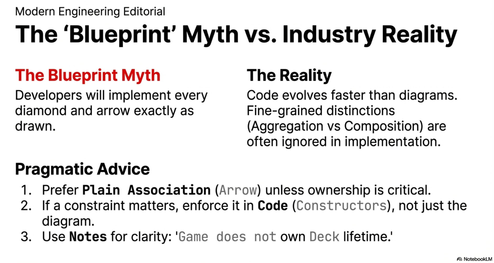

## **20. Why Mermaid for UML?**

Mermaid offers significant advantages over traditional click/drag UML drawing tools:

### **Advantages**

- **Versionable** (plain text, diff-friendly)
- **Human-readable**
- **Embeddable** directly in Markdown
- **Renderable** in GitHub Pages
- **AI-friendly** for reasoning and feedback
- No proprietary formats or tools

### **Strategic Value**

- UML becomes part of the codebase
- Design intent evolves with implementation
- Diagrams benefit from code review workflows

> **Modern reality:** If your design cannot live in Git in close alignment with the codebase, it is unlikely to stay current.

## **21. Bad UML vs Good UML (Design Contrast)**

### **Bad UML (Common Student Mistakes)**

```mermaid
classDiagram
    class Game {
        +Run()
        +DrawCard()
        +PlayCard()
        +CheckWinner()
    }
    class Player
    class Deck
    class Card
    Game --> Player
    Game --> Deck
    Game --> Card
```

**Problems:**

- God class (Game does everything)
- No interfaces or abstractions
- No ownership or lifetime clarity
- No multiplicity
- Behavior-driven procedural design

### **Good UML (Assignment-Aligned)**

```mermaid
classDiagram
    direction TB

    class IPlayer {
        <<interface>>
        +TakeTurn(context)
    }

    class PlayerBase {
        <<abstract>>
        -List~ICard~ hand
        +TakeTurn(context)
    }

    class HumanPlayer
    class CpuPlayer

    class CrazyEightsGame {
        -IPlayer playerOne
        -IPlayer playerTwo
        +Run()
    }

    class Deck {
        -Stack~ICard~ cards
        +Draw() ICard
    }

    IPlayer <|.. HumanPlayer
    IPlayer <|.. CpuPlayer
    PlayerBase <|-- HumanPlayer
    PlayerBase <|-- CpuPlayer

    CrazyEightsGame --> "2" IPlayer
    CrazyEightsGame o-- Deck
    PlayerBase *-- "0..*" ICard
```

**Why this is better:**

- Polymorphism is explicit
- Ownership and lifetime are visible
- Multiplicity communicates constraints
- Responsibilities are separated

## **22. Relationship Summary**

| **Relationship** | **UML Arrow**          | **Lifetime** | **Key Question** | **Code Signal**  |
| ---- | ---- |  | ---- |  |
| Inheritance      | Solid line + triangle  | Same         | *Is-a?*          | : Base class       |
| Realization      | Dashed line + triangle | Same         | *Implements?*    | : Interface       |
| Dependency       | Dashed arrow           | Temporary    | *Uses briefly?*  | Method parameter   |
| Association      | Solid arrow            | Independent  | *Knows about?*   | Field reference    |
| Aggregation      | Open diamond           | Independent  | *Borrowed?*      | Injected object    |
| Composition      | Filled diamond         | Owned        | *Dies together?* | Created internally |

> **Exam tip:** When unsure, ask *“Who controls the lifetime?”*


## **23. Student Exercise: Identify the Relationship**

For each scenario below:

1. Identify the **UML relationship**
2. Decide the **correct arrow**
3. Explain **why** in one sentence

### **Scenario A**

A CrazyEightsGame receives a Deck in its constructor.

- Relationship: __________
- Why: ______________________________________

### **Scenario B**

A PlayerBase creates and owns its List<ICard> internally.

- Relationship: __________
- Why: ______________________________________

### **Scenario C**

A CpuPlayer implements IPlayer.

- Relationship: __________
- Why: ______________________________________

### **Scenario D**

CrazyEightsGame.Run() accepts a TurnContext parameter.

- Relationship: __________
- Why: ______________________________________

### Scenario E

CrazyEightsGame.Run() accepts a TurnContext parameter. Run() stores TurnContext to a field in the CrazyEightsGame instance.

- Relationship: __________
- Why: ______________________________________

> These questions mirror how UML is tested **and** how design discussions happen in industry.

## 24. UML Class Pattern Demonstration: Strategy

This UML diagram shows how the Strategy Pattern uses interfaces and aggregation to decouple a context from multiple interchangeable algorithms, allowing behavior to vary without modifying the context.

```mermaid
classDiagram
direction TB

class Context {
  +ContextInterface()
}

class Strategy {
  <<interface>>
  +AlgorithmInterface()
}

class ConcreteStrategyA {
  +AlgorithmInterface()
}
class ConcreteStrategyB {
  +AlgorithmInterface()
}
class ConcreteStrategyC {
  +AlgorithmInterface()
}

Context o-- Strategy : strategy

ConcreteStrategyA ..|> Strategy
ConcreteStrategyB ..|> Strategy
ConcreteStrategyC ..|> Strategy
```

### 1. What The Generic Strategy Diagram Communicates

#### Encapsulation of Varying Behavior

- The core purpose of the Strategy Pattern is to **encapsulate interchangeable algorithms**.
- The `Context` does **not** implement the algorithm itself.
- Instead, it **delegates behavior** to a `Strategy` object.

#### Programming to an Interface

- `Strategy` is explicitly marked as an `<<interface>>`.
- `Context` depends on the **abstraction**, not on any concrete strategy.
- This allows algorithm changes without modifying `Context`.

#### Interchangeability

- `ConcreteStrategyA`, `ConcreteStrategyB`, and `ConcreteStrategyC` all implement the same interface.
- Any of these strategies can be substituted at runtime.
- From the perspective of `Context`, all strategies are equivalent.

#### Open–Closed Principle

- New strategies can be added without changing existing code.
- The `Context` remains stable while behavior evolves.

---

### 2. Understanding the UML Visual Vocabulary

#### Classes and Interfaces

- Rectangles represent types.
- The `<<interface>>` stereotype explicitly identifies `Strategy` as an interface.
- Methods listed indicate **public contracts**, not implementation details.

---

#### Realization (`..|>`) — “implements”

```
ConcreteStrategyA ..|> Strategy
```

- A dashed line with a hollow triangle indicates **realization**.
- Read as: **ConcreteStrategyA implements Strategy**
- This is a **type-level relationship**, not an object relationship.

---

#### Aggregation (`o--`) — “has-a”

```
Context o-- Strategy : strategy
```

- The open diamond indicates **aggregation**.
- Read as: **Context has a Strategy**
- This implies:
  - The `Strategy` has an independent lifetime
  - The strategy can be replaced at runtime
  - The `Context` does not own the strategy’s lifecycle

Aggregation is used instead of composition to emphasize **replaceability**.

---

#### Association Role Label

```
: strategy
```

- Names the role of the relationship.
- Suggests how the relationship appears in code:

```csharp
private Strategy strategy;
```

---

### 3. What the Diagram Emphasizes vs. Omits

#### Emphasized

- Structural dependencies
- Dependency direction (Context → Strategy)
- Abstraction over implementation
- Interchangeable behavior

#### Intentionally Omitted

- Control flow
- Object creation logic
- Conditional selection logic
- Algorithm details

This reinforces that **class diagrams describe structure and intent, not execution**.

---

### 4. Summary

- The most important dependency is **Context → Strategy**, not to concrete classes.
- Interfaces are the **design anchor**.
- `..|>` means *implements*.
- `o--` means *has-a but does not own*.
- Class diagrams communicate *why a design exists* more clearly than code alone.

## 25. UML Class Pattern Demonstration: Strategy Implementation to vary Sort Algorithm Choices by Collection Size

```mermaid
classDiagram
direction TB

class SortContext {
  -ISortStrategy strategy
  +SortContext(strategy: ISortStrategy)
  +SetStrategy(strategy: ISortStrategy)
  +Sort(data: int[]) void
}

class ISortStrategy {
  <<interface>>
  +Sort(data: int[]) void
}

class InsertionSortStrategy {
  +Sort(data: int[]) void
}

class HeapSortStrategy {
  +Sort(data: int[]) void
}

class QuickSortStrategy {
  +Sort(data: int[]) void
}

class SortStrategySelector {
  +ChooseStrategy(dataCount: int) ISortStrategy
}

%% Relationships
SortContext o-- ISortStrategy : strategy

InsertionSortStrategy ..|> ISortStrategy
HeapSortStrategy ..|> ISortStrategy
QuickSortStrategy ..|> ISortStrategy

SortStrategySelector ..> ISortStrategy : creates/returns
SortStrategySelector ..> InsertionSortStrategy : for small
SortStrategySelector ..> HeapSortStrategy : for large
SortStrategySelector ..> QuickSortStrategy : for large
SortStrategySelector ..> SortContext : configures
```

This diagram shows a **concrete, teaching-oriented example of the Strategy Pattern** applied to sorting algorithms.

- **SortContext** represents the client that performs sorting.

  It does not know *how* sorting is done; it only holds a reference to an **ISortStrategy** and delegates the Sort operation to it. The strategy can be set or changed at runtime.

- **ISortStrategy** is the abstraction that defines the sorting contract.

  All sorting algorithms expose the same Sort(data) method, making them interchangeable from the context’s point of view.

- **InsertionSortStrategy****,** **HeapSortStrategy****, and** **QuickSortStrategy** are concrete implementations of the interface.

  Each encapsulates a different algorithm, but all satisfy the same contract and can be substituted freely.

- **SortStrategySelector** contains the decision logic for choosing an appropriate strategy based on data size. 

  It depends on the abstraction (ISortStrategy) and creates concrete strategies internally, keeping that conditional logic out of SortContext.

  > NOTE: The **SortStrategySelector** is not part of the strategy pattern. It is a simple (naive) factory to encapsulate the logic to demonstrate selecting the "best" concrete sort algorithm based on the size of the inbound data. In practice, this would likely be more sophisticated.

The context is decoupled from specific sorting algorithms, algorithms are interchangeable, and the logic for *choosing* an algorithm is isolated in a separate class—clearly illustrating how the Strategy Pattern promotes flexibility, clarity, and separation of concerns.


## **Final Guidance**

UML class diagramming should help you:

- Think before coding
- Communicate intent clearly
- Identify ownership and lifetime issues early
- Reduce refactoring and rework
- UML is **selective** — show what matters
- Prefer clarity over completeness
- Diagrams should evolve with understanding
- A good diagram makes bad design *obvious*

> If your diagram requires explanation, (attempt to) simplify it.

## **Summary**

UML class diagrams help you:

- Reason about ownership and lifetime
- Visualize polymorphism
- Communicate abstractions clearly
- Avoid premature implementation detail

Used well, UML supports *better code with fewer refactors*.