# **UML Class Diagramming**

**Course:** SWE 4743 – Object-Oriented Design

**Instructor:** Jeff Adkisson

## **Purpose of This Lecture**

UML class diagrams are a **communication tool**, not a programming language. Their purpose is to:

- Express *design intent* clearly
- Reveal structure, responsibility, and relationships
- Support reasoning and discussion *before* code exists
- Document important architectural decisions

In this course, UML diagrams are used to **support OO thinking**, not to generate code.

Examples throughout this lecture are aligned with **Assignment 1: Crazy Eights**.

## **1. Class Box Layout**

A UML class is drawn as a rectangle with **three zones**:

1. **Class name**
2. **Members (fields / properties)**
3. **Methods (operations)**

### **Example**

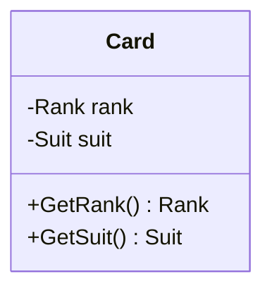

### **Notes**

- Members and methods are optional and may be hidden
- Focus on *what matters for design*, not every implementation detail

## **2. Class Annotations**

### **Interfaces**

Interfaces are marked using <<interface>>.

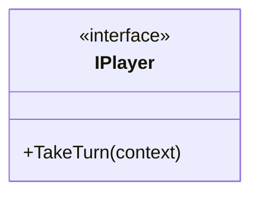

### **Enumerations**

```c#
classDiagram
    class Suit {
        <<enumeration>>
        Hearts
        Diamonds
        Clubs
        Spades
    }
```

## **3. Class Inheritance**

Inheritance represents an **is-a** relationship. The child class *is substitutable* for the parent.

> **Mental model:** “If I can replace the parent with the child everywhere, inheritance might be appropriate.”

Inheritance represents an **is-a** relationship.

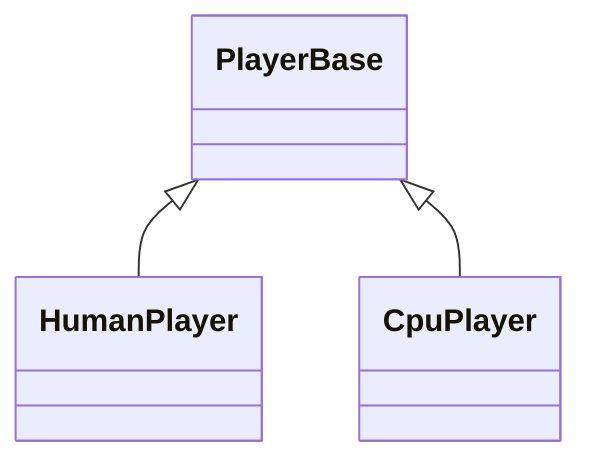

### **C# Example**

```c#
public abstract class PlayerBase
{
    protected readonly List<ICard> _hand = new();
}

public class HumanPlayer : PlayerBase { }
public class CpuPlayer : PlayerBase { }
```

## **4. Interface Realization**

**Realization** is the UML term for *implementing an interface*.

- Solid line + hollow triangle = inheritance (is-a)
- Dashed line + hollow triangle = realization (implements)

> **Mental model:** *Classes inherit behavior; they realize contracts.*

When a class implements an interface, UML uses a **dashed arrow**.

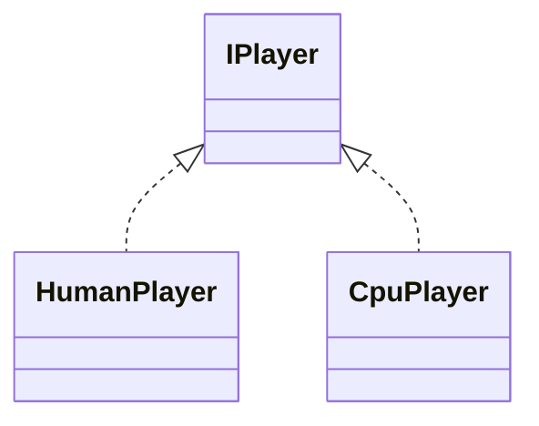

### **C# Example**

```
public interface IPlayer
{
    void TakeTurn(TurnContext context);
}
```

## **5. Dependencies**

A **dependency** indicates that one class *uses* another temporarily.

```
classDiagram
    CrazyEightsGame ..> IPlayer : uses
```

### **Interpretation**

- Dependencies often appear as **method parameters**
- They do *not* imply ownership

## **6. Associations**

An **association** represents a *structural relationship* between two objects that exist at the same time.

- Neither object necessarily owns the other
- Lifetime is independent

> **Mental model:** “These objects know about each other.”

Associations represent a longer-lived relationship between objects.

```
classDiagram
    CrazyEightsGame --> Deck
```

### **Meaning**

- The game *has a* deck
- The deck exists independently

## **7. Aggregation vs Composition**

This is one of the **most misunderstood areas** of UML.

Aggregation and composition are **about object lifetime**, *not collections*.

### **Aggregation (shared lifetime)**

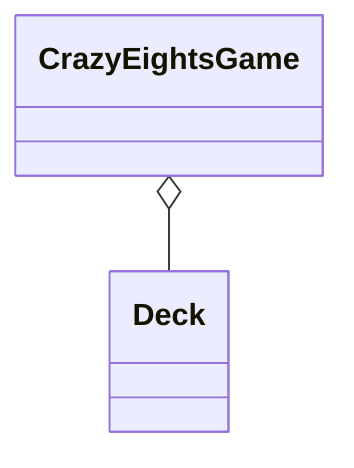

- Open diamond
- The game *uses* a deck
- The deck can exist before or after the game

> **Mental model:** “I borrow it.”

### **Composition (owned lifetime)**

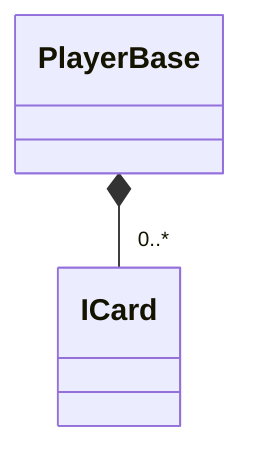

- Filled diamond
- Cards exist *only* as part of a player’s hand

> **Mental model:** “If the owner dies, the parts die too.”

### **Aggregation (shared lifetime)**


- Open diamond
- Game uses a deck
- Deck may exist without the game

### **Composition (owned lifetime)**

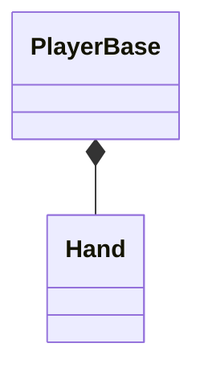

- Filled diamond
- Hand does **not** exist without the player

## **Object Lifetime Demonstration (C#)**

### **Composition Example**

```c#
public class PlayerBase
{
    private readonly List<ICard> _hand = new(); // created and destroyed with Player
}
```

### **Aggregation Example**

```c#
public class CrazyEightsGame
{
    private readonly Deck _deck;

    public CrazyEightsGame(Deck deck)
    {
        _deck = deck; // deck supplied from outside
    }
}
```

## **8. Access Modifiers**

UML uses symbols:

| **Symbol** | **Meaning** |
| ---- | ----- |
| +          | public      |
| -          | private     |
| #          | protected   |

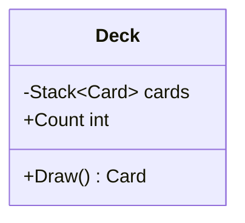

## **9. Abstract vs Concrete Classes**

Abstract elements are *italicized* in UML.

```
classDiagram
    class PlayerBase {
        <<abstract>>
        +TakeTurn(context)
    }
```

### **C# Example**

```c#
public abstract class PlayerBase
{
    public abstract void TakeTurn(TurnContext context);
}
```


## **10. Method Parameters and Return Types**

```
classDiagram
    class Deck {
        +Draw() Card
        +Shuffle() void
    }
```

- Show return types *when they matter* (drop if it just makes the diagram more visual complex without adding clarity)
- Parameters clarify responsibilities

## **11. Representing Generic Types**

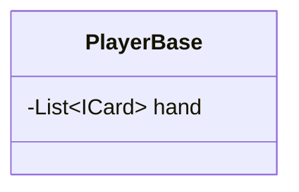

- Use ~ ~ for generics in Mermaid

## **12. Representing Multiplicity**

Multiplicity expresses **design constraints**, not documentation trivia.

> **Important:** UML multiplicity is meaningless unless it is **enforced by code**.

```
classDiagram
    CrazyEightsGame "1" --> "2" IPlayer
    PlayerBase "1" *-- "0..*" ICard
```

### **Common Misunderstanding**

- UML does *not* enforce multiplicity
- Collections do *not* automatically enforce rules

### **Enforcing Multiplicity in Code (C#)**

```c#
public class CrazyEightsGame
{
    private readonly IPlayer _playerOne;
    private readonly IPlayer _playerTwo;

    public CrazyEightsGame(IPlayer playerOne, IPlayer playerTwo)
    {
        _playerOne = playerOne;
        _playerTwo = playerTwo;
    }
}
```

> **Rule:** If the constructor enforces it, the design enforces it.

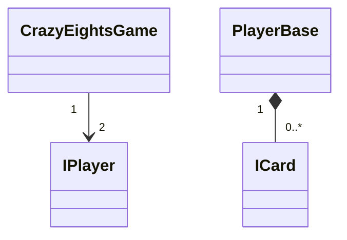

### **Enforcing Multiplicity in Code**

```c#
public class CrazyEightsGame
{
    private readonly List<IPlayer> _players;

    public CrazyEightsGame(IPlayer p1, IPlayer p2)
    {
        _players = new() { p1, p2 };
    }
}
```

## **13. Adding Titles and Notes**

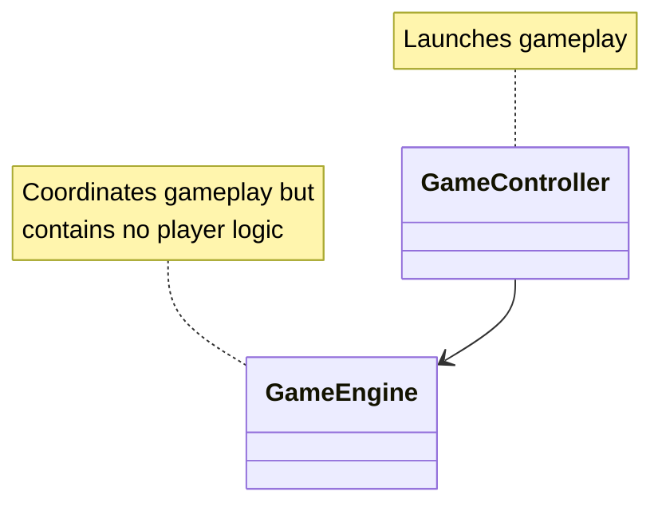

## **14. Comments**

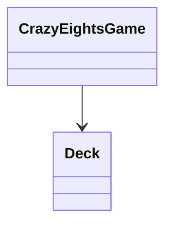

## **15. Hiding Empty Members**

If a class name alone communicates intent, omit details.

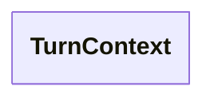

Use this to reduce visual noise.

## **16. Diagram Direction**

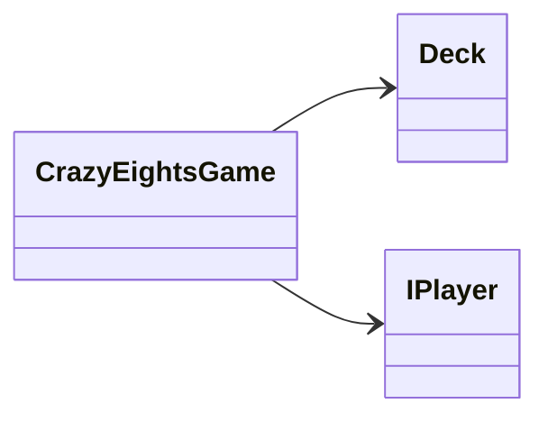

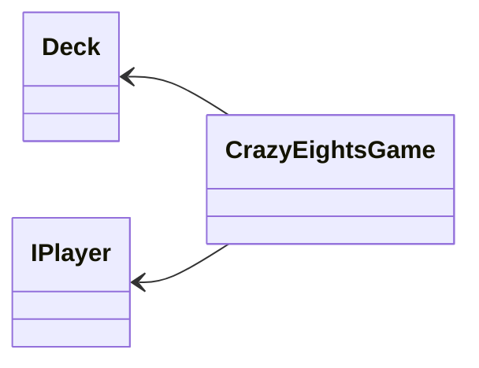

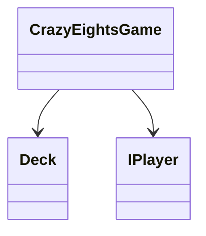

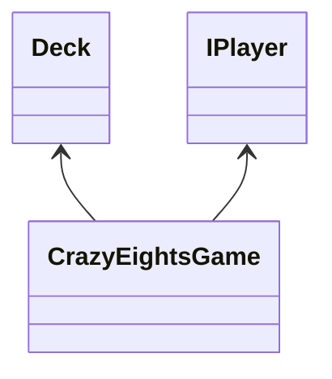


### **Common Directions**

- TB – top to bottom
- LR – left to right

## **17. Scope and Realistic Usage of UML**

UML class diagrams are **not meant to model your entire system at once**.

### **Best Practices**

- Diagram **5–10 closely related classes** at a time

- Create multiple diagrams for different concerns... for example:

  - Core domain (game rules)
  - Player behavior
  - Card model
  
- Update diagrams as understanding evolves

> **Mental model:** UML is a *conversation aid*, not a blueprint.

## **18. Why Mermaid for UML?**

Mermaid offers significant advantages over traditional click/drag UML drawing tools:

### **Advantages**

- **Versionable** (plain text, diff-friendly)
- **Human-readable**
- **Embeddable** directly in Markdown
- **Renderable** in GitHub Pages
- **AI-friendly** for reasoning and feedback
- No proprietary formats or tools

### **Strategic Value**

- UML becomes part of the codebase
- Design intent evolves with implementation
- Diagrams benefit from code review workflows

> **Modern reality:** If your design cannot live in Git in close alignment with the codebase, it is unlikely to stay current.

## **19. Bad UML vs Good UML (Design Contrast)**

### **Bad UML (Common Student Mistakes)**

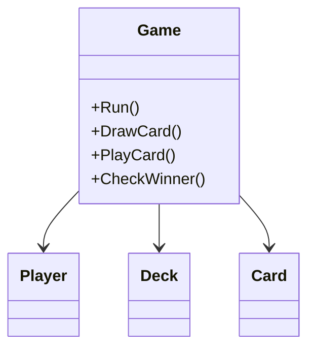

**Problems:**

- God class (Game does everything)
- No interfaces or abstractions
- No ownership or lifetime clarity
- No multiplicity
- Behavior-driven procedural design

### **Good UML (Assignment-Aligned)**

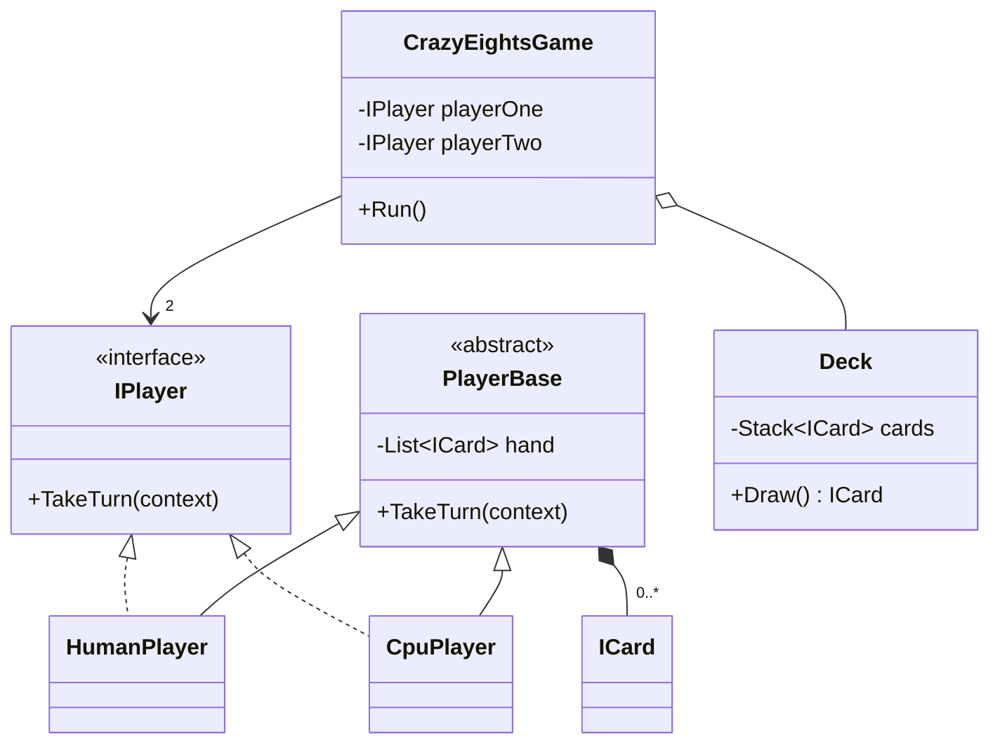

**Why this is better:**

- Polymorphism is explicit
- Ownership and lifetime are visible
- Multiplicity communicates constraints
- Responsibilities are separated

## **20. Exam-Ready Relationship Summary**

| **Relationship** | **UML Arrow**          | **Lifetime** | **Key Question** | **Code Signal**  |
| ---- | ---- |  | ---- |  |
| Inheritance      | Solid line + triangle  | Same         | *Is-a?*          | : Base class       |
| Realization      | Dashed line + triangle | Same         | *Implements?*    | : Interface       |
| Dependency       | Dashed arrow           | Temporary    | *Uses briefly?*  | Method parameter   |
| Association      | Solid arrow            | Independent  | *Knows about?*   | Field reference    |
| Aggregation      | Open diamond           | Independent  | *Borrowed?*      | Injected object    |
| Composition      | Filled diamond         | Owned        | *Dies together?* | Created internally |

> **Exam tip:** When unsure, ask *“Who controls the lifetime?”*

## **21. Student Exercise: Identify the Relationship**

For each scenario below:

1. Identify the **UML relationship**
2. Decide the **correct arrow**
3. Explain **why** in one sentence

### **Scenario A**

A CrazyEightsGame receives a Deck in its constructor.

- Relationship: __________
- Why: ______________________________________

### **Scenario B**

A PlayerBase creates and owns its List<ICard> internally.

- Relationship: __________
- Why: ______________________________________

### **Scenario C**

A CpuPlayer implements IPlayer.

- Relationship: __________
- Why: ______________________________________

### **Scenario D**

CrazyEightsGame.Run() accepts a TurnContext parameter.

- Relationship: __________
- Why: ______________________________________

> These questions mirror how UML is tested **and** how design discussions happen in industry.

## **Final Guidance**

UML should help you:

- Think before coding
- Communicate intent clearly
- Identify ownership and lifetime issues early
- Reduce refactoring and rework
- UML is **selective** — show what matters
- Prefer clarity over completeness
- Diagrams should evolve with understanding
- A good diagram makes bad design *obvious*

> If your diagram requires explanation, (attempt to) simplify it.

## **Summary**

UML class diagrams help you:

- Reason about ownership and lifetime
- Visualize polymorphism
- Communicate abstractions clearly
- Avoid premature implementation detail

Used well, UML supports *better code with fewer refactors*.