# The Single Responsibility Principle  
### A Key Principle to Building Maintainable Software

---

## Table of Contents

- [Introducing SOLID](#introducing-solid)
- [Designing for Change](#designing-for-change)
- [SRP: The Cornerstone of SOLID](#srp-the-cornerstone-of-solid)
  - [How SRP Enables SOLID](#how-srp-enables-solid)
- [The Original Definition of SRP](#the-original-definition-of-srp)
- [The Problem with “One Reason”](#the-problem-with-one-reason)
- [Redefining Responsibility](#redefining-responsibility)
- [Using the Actor Concept to Explore Responsibility](#using-the-actor-concept-to-explore-responsibility)
  - [Actor as an Axis of Change](#actor-as-an-axis-of-change)
  - [Actors Are Concepts — Not Dependencies](#actors-are-concepts--not-dependencies)
  - [Applying SRP Using Actors](#applying-srp-using-actors)
- [Identifying Conceptual Actors to Explore Class Responsibilities](#identifying-conceptual-actors-to-explore-class-responsibilities)
- [Using Actors to Visualize Multiple Responsibilities in a Single Class](#using-actors-to-visualize-multiple-responsibilities-in-a-single-class)
- [Actor Demonstration — Evolving the Reporting Module for Single Responsibility](#actor-demonstration--evolving-the-reporting-module-for-single-responsibility)
  - [Responsibilities Are Split by Actor](#responsibilities-are-split-by-actor)
  - [Coordination Is Isolated, Not Eliminated](#coordination-is-isolated-not-eliminated)
  - [Conceptual Actor Summary](#conceptual-actor-summary)
- [Design Classes Around Reasons to Change](#design-classes-around-reasons-to-change)
- [The Real Risk of SRP Violations](#the-real-risk-of-srp-violations)
  - [Organizational Coupling](#organizational-coupling)
  - [Why Bugs From SRP Violations Are So Dangerous](#why-bugs-from-srp-violations-are-so-dangerous)
  - [Change Amplification](#change-amplification)
  - [How to Recognize Change Amplification](#how-to-recognize-change-amplification)
  - [Change Amplification vs. Healthy Coupling](#change-amplification-vs-healthy-coupling)
  - [A Practical Heuristic](#a-practical-heuristic)
  - [Why This Matters](#why-this-matters)
  - [Using Change Amplification as an SRP Refactoring Signal](#using-change-amplification-as-an-srp-refactoring-signal)
  - [The Strategic Cost of Ignoring SRP](#the-strategic-cost-of-ignoring-srp)
- [SRP vs DRY: A Subtle but Critical Tension](#srp-vs-dry-a-subtle-but-critical-tension)
- [Cohesion and Coupling: The Core Mechanism of SRP](#cohesion-and-coupling-the-core-mechanism-of-srp)
  - [Cohesion](#cohesion)
  - [Coupling](#coupling)
  - [Finding the Right Balance of Cohesion and Coupling](#finding-the-right-balance-of-cohesion-and-coupling)
  - [Cohesion & Coupling Archetypes](#cohesion--coupling-archetypes)
- [Visualizing Cohesion and Coupling Archetypes](#visualizing-cohesion-and-coupling-archetypes)
  - [Visualizing a God Object: High Cohesion, High Coupling](#visualizing-a-god-object-high-cohesion-high-coupling)
  - [Visualizing Destructive Decoupling: Low Cohesion, Low Coupling](#visualizing-destructive-decoupling-low-cohesion-low-coupling)
  - [Visualizing Poor Boundaries: Low Cohesion, High Coupling](#visualizing-poor-boundaries-low-cohesion-high-coupling)
  - [Visualizing an "Ideal" Solution: High Cohesion, Low Coupling](#visualizing-an-ideal-solution-high-cohesion-low-coupling)
- [SRP Across Levels of Code Organization](#srp-across-levels-of-code-organization)
  - [SRP at the Class Level](#srp-at-the-class-level)
  - [SRP at the Namespace Level](#srp-at-the-namespace-level)
  - [SRP at the Package or Module Level](#srp-at-the-package-or-module-level)
  - [SRP at the System Level](#srp-at-the-system-level)
  - [Why “Fractal” Matters](#why-fractal-matters)
- [Screaming Architecture](#screaming-architecture)
  - [What Should “Scream”](#what-should-scream)
  - [ASP.NET MVC: How the Default Template Encourages Package-by-Layer (Horizontal Architecture)](#aspnet-mvc-how-the-default-template-encourages-package-by-layer-horizontal-architecture)
  - [Screaming Architecture: Package-by-Feature (Vertical Slice Architecture)](#screaming-architecture-package-by-feature-vertical-slice-architecture)
- [Feature-First Layered Architecture](#feature-first-layered-architecture)
- [SRP Benefits at Multiple Levels](#srp-benefits-at-multiple-levels)
- [Screaming Architecture Core Insights](#screaming-architecture-core-insights)
- [Why Is SRP So Hard to (Effectively) Apply?](#why-is-srp-so-hard-to-effectively-apply)
  - [Why It’s Difficult](#why-its-difficult)
  - [The Core Challenge](#the-core-challenge)
  - [A Mental Shift Is Required](#a-mental-shift-is-required)
- [SRP Code Smells (Red Flags)](#srp-code-smells-red-flags)
- [Conclusion: SRP is a Strategy for Reducing Complexity and Enabling Change](#conclusion-srp-is-a-strategy-for-reducing-complexity-and-enabling-change)
- [References](#references)
- [Single Responsibility Videos](#single-responsibility-videos)
- [Study Guide: Single Responsibility Principle (SRP)](#study-guide-single-responsibility-principle-srp)

---

## Introducing SOLID

**SOLID** is a set of five foundational design principles  
popularized by **Robert C. Martin (Uncle Bob)** in the early 2000s.

The principles were distilled from decades of object-oriented practice  
and are widely taught, debated, and applied across the software industry.

### Why SOLID Matters

- Provides a **shared design vocabulary**
- Guides decisions in the face of change
- Helps manage complexity in long-lived systems
- Influences modern architectures, frameworks, and tooling

SOLID is not about writing *more* code or *perfect* code.  
It is about writing code that can **survive change over time**.

## Designing for Change

> Building software is like building a house.

- Code can function without architecture  
- But it becomes hard to extend, modify, or adapt over time  
- Architecture provides structure for **intentional change**
- SOLID principles form that structure  
- **The Single Responsibility Principle (SRP) is the cornerstone of SOLID** 

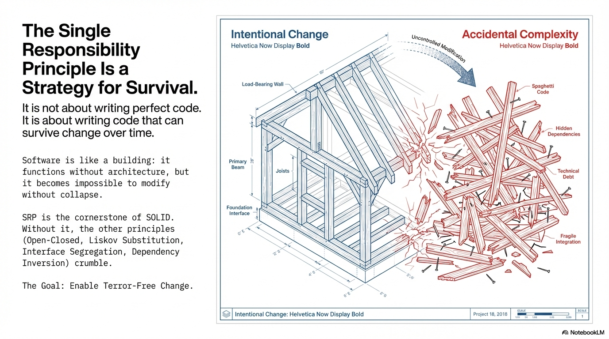

## SRP: The Cornerstone of SOLID

All other SOLID principles **assume SRP is already in place**.

Without single, clear responsibilities:
- Abstractions become unclear
- Changes ripple unexpectedly
- Design principles break down

### How SRP Enables SOLID

- **O - Open–Closed Principle**  
  Safe extension is only possible when a class has one clear reason to change.

- **L - Liskov Substitution Principle**  
  Subtypes are substitutable only when base classes represent a single, well-defined responsibility.

- **I - Interface Segregation Principle**  
  Interfaces remain small and coherent when responsibilities are not mixed.

- **D - Dependency Inversion Principle**  
  Dependencies can point toward stable abstractions only when those abstractions serve one actor.


---

## The Original Definition of SRP

> **“A class should have only one reason to change.”**  
> — Robert C. Martin

Why this mattered:
- Encourages modularity
- Improves maintainability
- Reduces unintended side effects


---

## The Problem with “One Reason”

What counts as a *reason*?

- Technical refactoring?
- Business rule change?
- Performance optimization?
- UI update?
- Framework, library, or OS update?


---

## Redefining Responsibility
Robert C. Martin later reframed SRP with a sharper question:

> "**Who is requesting the change?**"

To understand how to apply this question, we must explore the concept of **actors**.


---

## Using the Actor Concept to Explore Responsibility

> **A module should be responsible to one, and only one, actor.**

An **actor** is a conceptual source of change. It is not necessarily a specific person or system.

**Actor**:
- A person or group
- With a shared business concern
- Who can independently request changes

In this context, actors represent **why code changes**, not **who happens to use it**.

Key clarifications:
- One human can embody **multiple actors** (e.g., accountant, manager, compliance officer)
- Multiple people can belong to **one actor group** if they request the same kinds of changes
- SRP is violated by **multiple reasons to change**, not by multiple users

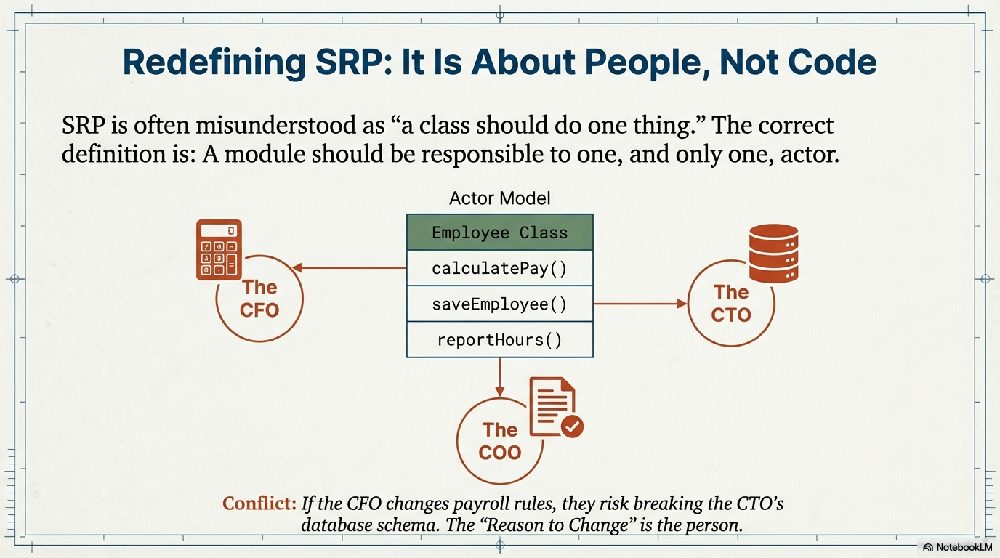

---

### Actor as an Axis of Change

A useful mental model is to think of an actor as an **axis along which change occurs**.

Common axes of change include:
- Business rules
- Regulatory requirements
- Operational concerns (performance, reliability)
- Product or user-experience concerns

If a module changes along more than one independent axis, it has **multiple responsibilities** and violates the Single Responsibility Principle.

---

### Actors Are Concepts — Not Dependencies

Actors are **not** technical components:
- Not databases
- Not frameworks
- Not APIs or UIs

Those are implementation mechanisms.  
Actors are the **organizational or business forces** that drive changes to those mechanisms.

---

### Applying SRP Using Actors

To evaluate SRP compliance, ask:
1. Who can request a change to this module?
2. Would a different concern request a different kind of change?
3. Could these changes occur independently?

If the answers reveal independent change pressure, the module serves **multiple actors**.

---

## Identifying Conceptual Actors to Explore Class Responsibilities

**Example actors:**

- **Accountant**  
  Responsible for the *contents* of accounting reports

- **Database Administrator (DBA)**  
  Responsible for *persistence* of reports

Both actors require that reports are persisted after generation, but **for different reasons**.

Even if the *same person* fills both roles:
- The **reasons for change differ**
- Mixing them in a single class creates fragility

---

## Using Actors to Visualize Multiple Responsibilities in a Single Class

A module that serves multiple actors has **multiple reasons to change**.

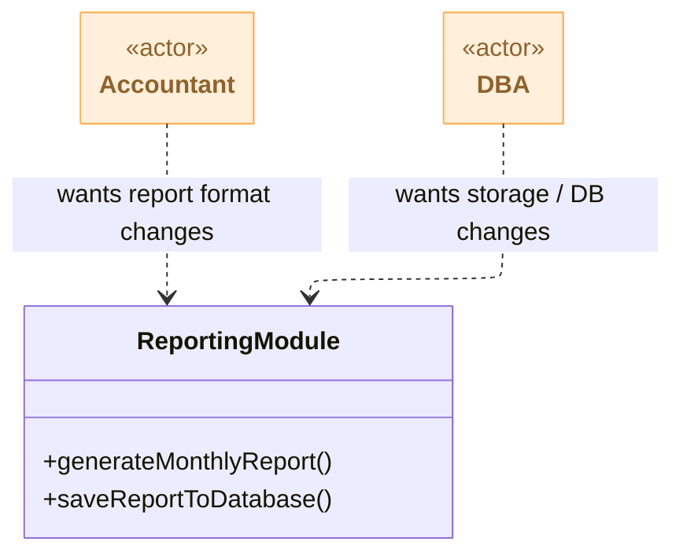
```mermaid
---
config:
  class:
    hideEmptyMembersBox: true
  layout: elk
---
classDiagram
direction TB
    class Accountant
    class DBA

    class ReportingModule {
	    +generateMonthlyReport()
	    +saveReportToDatabase()
    }

	<<actor>> Accountant
	<<actor>> DBA

    Accountant ..> ReportingModule : wants report format changes
    DBA ..> ReportingModule : wants storage / DB changes

	class Accountant:::Peach
	class DBA:::Peach

	classDef Peach :,stroke:#FBB35A,fill:#FFEFDB,color:#8F632D
```

### Example Code (Multiple Responsibilities)

```csharp
public static class Program
{
	public static void Main()
	{
		var reportingModule = new ReportingModule();

		// Output concerns belong to the Accountant actor
		var reportOutput = reportingModule.GenerateMonthlyReport();

		// Persistence concerns belong to the DBA actor
		reportingModule.SaveReportToDatabase(reportOutput);
	}
}

public class ReportingModule
{
	public string GenerateMonthlyReport()
	{
		// Responsibility #1: report generation (accounting concerns)
		var report = "Monthly Financial Report";
		Console.WriteLine("Report generated.");
		return report;
	}

	public void SaveReportToDatabase(string report)
	{
		// Responsibility #2: persistence (database concerns)
		Console.WriteLine($"Report saved to database: {report}");
	}
}
```

---

## Actor Demonstration — Evolving the Reporting Module for Single Responsibility

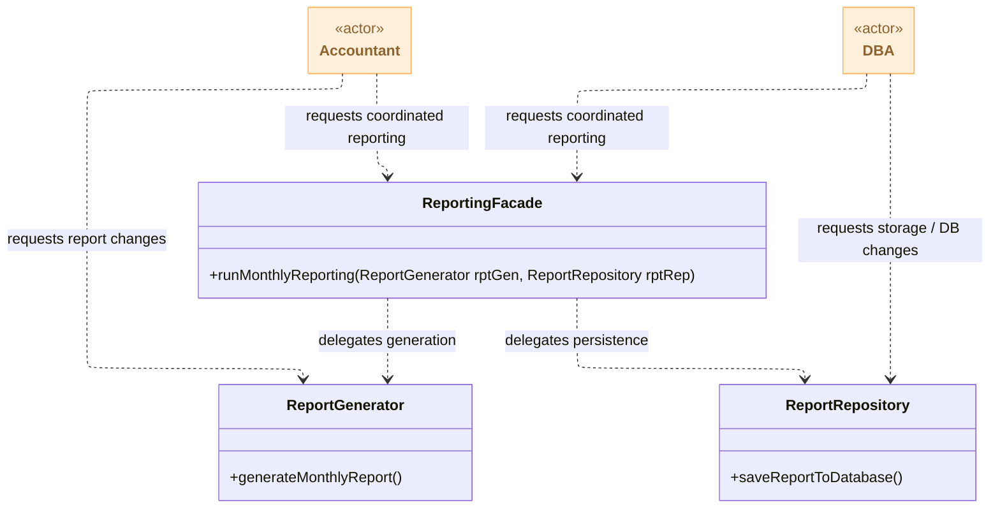
```mermaid
---
config:
  class:
    hideEmptyMembersBox: true
  layout: elk
---
classDiagram
direction TB
    class Accountant
    class DBA

    class ReportGenerator {
	    +generateMonthlyReport()
    }

    class ReportRepository {
	    +saveReportToDatabase()
    }

    class ReportingFacade {
	    +runMonthlyReporting(ReportGenerator rptGen, ReportRepository rptRep)
    }

	<<actor>> Accountant
	<<actor>> DBA

    Accountant ..> ReportGenerator : requests report changes
    DBA ..> ReportRepository : requests storage / DB changes

    ReportingFacade ..> ReportGenerator : delegates generation
    ReportingFacade ..> ReportRepository : delegates persistence

    Accountant ..> ReportingFacade : requests coordinated reporting
    DBA ..> ReportingFacade : requests coordinated reporting

	class Accountant:::Peach
	class DBA:::Peach

	classDef Peach :,stroke:#FBB35A,fill:#FFEFDB,color:#8F632D
```

This refactor separates responsibilities according to **actors**, while still allowing coordinated behavior.

---

### Responsibilities Are Split by Actor

- **`ReportGenerator`**
  - Responsible only for report generation
  - Changes when accounting rules, calculations, or formatting change
  - Serves the **Accountant** actor

- **`ReportRepository`**
  - Responsible only for persistence
  - Changes when database schema, storage strategy, or performance concerns change
  - Serves the **DBA** actor

Each class now has **one clear reason to change**.

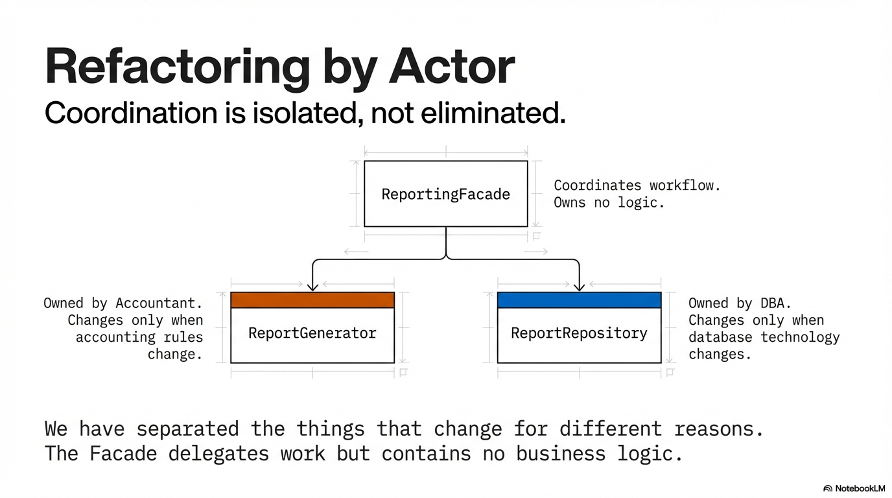

---

### Coordination Is Isolated, Not Eliminated

The `ReportingFacade` exists to **coordinate workflow**, not to own business logic.

- Contains no accounting rules
- Contains no persistence logic
- Changes only when workflow coordination changes

Although both actors interact with the facade, they request **the same kind of change**.  
Conceptually, this is **one actor**.

---

### Conceptual Actor Summary

> **SRP does not remove collaboration — it removes mixed responsibilities.**

By identifying conceptual actors and aligning classes to axes of change, the design becomes:
- More resilient to change
- Easier to reason about
- Better aligned with the organization it serves


## Design Classes Around Reasons to Change

> **“Gather together the things that change for the same reasons.  
> Separate those things that change for different reasons.”**  
> — *Robert C. Martin*, **Agile Software Development** (2002),  
> building on *David L. Parnas*, “On the Criteria to Be Used in Decomposing Systems” (1972)

If a class contains:
- Logic that changes when **accounting rules** change, and
- Logic that changes when **database schema or storage strategy** changes,

then those behaviors should not live in the same class. The behaviors change for **different reasons**, are driven by **different actors**, and therefore represent **different responsibilities**.

This formulation makes SRP concrete by shifting the question from
> “What does this class do?”

to 

> “Why does this class change?”


---

## The Real Risk of SRP Violations

The danger of violating the Single Responsibility Principle is not that classes become “too big” or “ugly.”  
The real risk is that **unrelated sources of change become coupled together**.

When code serves multiple actors:

- A change requested by one actor
- Can unintentionally affect behavior relied on by another
- Failures often appear far from the original change

This makes bugs:
- Difficult to predict
- Difficult to reproduce
- Difficult to assign responsibility for

---

### Organizational Coupling

Most SRP violations are not *technical* problems — they are **organizational problems encoded in code**.

When a single module serves multiple actors:
- Those actors must coordinate their changes
- Release schedules become entangled
- Teams are forced to communicate about unrelated concerns

This creates **organizational coupling**:
> A situation where independent groups must coordinate because the software structure forces coordination. This forced coordination adds overhead, complexity, project management, and risk to executing a change, particularly a non-trivial change.

---

### Why Bugs From SRP Violations Are So Dangerous

SRP violations tend to produce bugs that:
- Pass unit tests
- Compile cleanly
- Appear correct in isolation

But fail when:
- A different actor uses the system
- A different scenario is exercised
- A future change reactivates an old assumption

These failures are often described as:
- “Spooky action at a distance”
- “It broke something unrelated”
- “No one touched that code”

> *Bugs caused by SRP violations are often unintended side-effects of a valid change made for one responsibility that inadvertently impacted behavior belonging to a different responsibility.*

---

### Change Amplification

**Change amplification** occurs when a change that should be local and contained instead ripples through large portions of a system.

Without SRP, a single change request can:
- Touch multiple unrelated behaviors
- Require updates across several classes, namespaces, or modules
- Force coordination between teams that should be independent
- Increase the blast radius of every modification

> **Small, local changes trigger large, system-wide effects.**

SRP exists specifically to minimize this effect by isolating reasons for change.

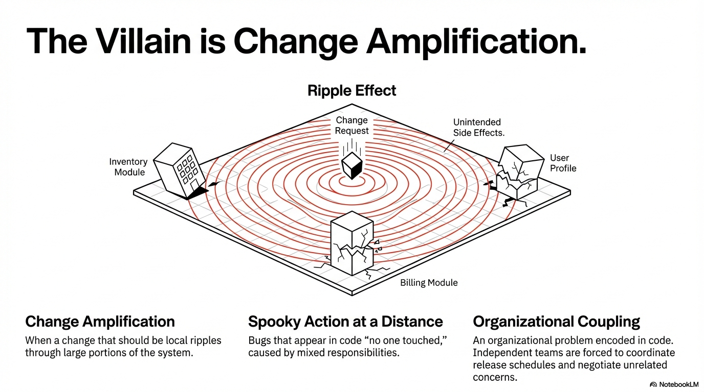

---

### How to Recognize Change Amplification

Change amplification is often visible long before a bug appears. Common warning signs include:

#### 1. One Requirement → Many Files
A single business change requires edits in:
- Multiple classes with different responsibilities
- Several namespaces or packages
- Code that “shouldn’t be related” to the change

If you frequently think:
> “Why do I have to touch *that* file for *this* change?”

You are likely seeing change amplification.

---

#### 2. Cascading Refactors
A small change forces:
- Signature changes that propagate outward
- Renaming or restructuring across layers
- Updates to code written by different teams or roles

These cascades are rarely accidental; they indicate that responsibilities are coupled.

---

#### 3. Cross-Actor Reviews
A change requested by one actor requires:
- Review from stakeholders representing other concerns
- Coordination with teams unrelated to the original change
- Careful negotiation to avoid breaking “someone else’s” behavior

This is organizational coupling made visible.

---

#### 4. Tests Fail Far from the Change
After a small modification:
- Unit tests in unrelated areas fail
- Integration tests surface unexpected behavior
- Fixes require understanding code well outside the original change scope

These failures are symptoms of mixed responsibilities.

---

#### 5. Fear-Driven Development
Engineers hesitate to make changes because:
- “This area is fragile”
- “Everything depends on this”
- “We need to run the full test suite just in case”

When developers are afraid of small changes, change amplification is already present.

---

### Change Amplification vs. Healthy Coupling

Not all ripple effects are bad. The distinction is **semantic relevance**.

- **Healthy coupling**: Changes ripple through code that shares the same responsibility and actor
- **Change amplification**: Changes ripple into code that exists for *different reasons*

SRP does not eliminate dependencies—it ensures they align with the same axis of change.

---

### A Practical Heuristic

> **If a change forces you to modify code owned by different actors, change amplification is likely occurring.**

Another quick test:

> **Would two independent teams need to coordinate to safely make this change?**<br>For example, does the DBA team and the Accounting Team have to coordinate to make a change to a persisted report?

If the answer is yes, SRP boundaries are likely misaligned.

---

### Why This Matters

Change amplification:

- Slows development velocity
- Increases defect rates
- Raises the cost of testing and review
- Encourages brittle workarounds instead of clean design

Over time, the system becomes resistant to change—not because it is large, but because it is **poorly partitioned**.

---

### Using Change Amplification as an SRP Refactoring Signal

Change amplification is a strong indicator that one or more classes have **mixed responsibilities**. When you encounter it, treat it as a signal to refactor toward the Single Responsibility Principle.

Use source control and automated tests to ensure the refactor is **purely structural**—behavior must remain unchanged.

A practical strategy is:

1. **Revert the triggering change**  
   Roll back the change that revealed the amplification. This restores a clean baseline and prevents refactoring from being entangled with new behavior.

2. **Refactor on a clean branch**  
   Starting from the baseline, refactor the identified classes to reduce responsibilities and align them with SRP. Focus only on structure, not functionality.

3. **Lock in the new structure**  
   Verify that the system behaves exactly as before using unit tests, regression tests, and diffs. Commit this refactor as a new, SRP-compliant baseline.

4. **Reapply the original change**  
   Reintroduce the original feature or modification. If SRP boundaries are correct, the change should now be more localized and the amplification reduced or eliminated.

---


### The Strategic Cost of Ignoring SRP

Over time, systems that violate SRP tend to:
- Accumulate fragile workarounds
- Slow down development velocity
- Require increasingly careful and costly testing

The system becomes resistant to change — not because it is complex,  
but because it is **misaligned with the organization that maintains it**.

> **SRP is a tool for isolating change pressure.**

By ensuring that each module responds to one, and only one, actor:
- Changes stay localized
- Failures are easier to reason about
- Teams can work independently without fear of unintended consequences

---

## SRP vs DRY: A Subtle but Critical Tension

The Single Responsibility Principle and the DRY (Don't Repeat Yourself) principle are often taught as complementary. In practice, they can conflict.

- DRY encourages eliminating duplicate/redundant code
- SRP organizes modules around reasons for change

Extracting shared code too early can merge responsibilities that should remain separate.

> **Only eliminate duplication when the duplicated code changes for the same reason.**

Duplication across actors is often safer than reuse across actors.

**Summary**: **Apply SRP first; DRY is a refactoring that must respect responsibility boundaries.**

> The decision to eliminate duplication must be guided first by *reasons for change*, not by surface similarity in code. DRY is most effective when applied *within* a single responsibility—where duplicated code is pulled by the same axis of change and owned by the same conceptual actor. When DRY is applied without regard to SRP boundaries, it can merge unrelated policies, amplify change, and turn a well-intentioned refactor into a long-term maintenance liability.

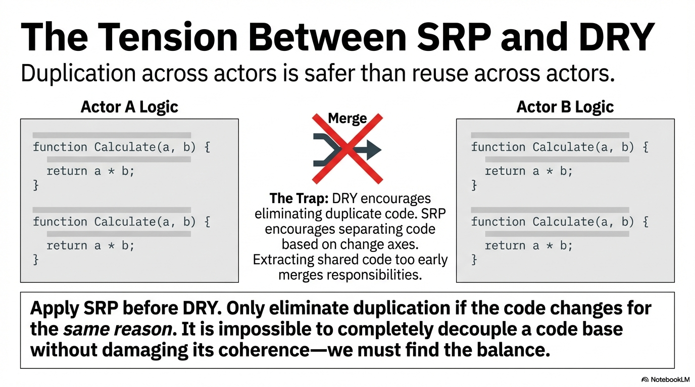

---

## Cohesion and Coupling: The Core Mechanism of SRP  
SRP pushes designs toward:

- **High Cohesion**
- **Low Coupling**


---

## Cohesion

**Cohesion** measures:
- How tightly related the elements of a module are

High cohesion means:
- A single purpose
- Clear intent
- Easier understanding


---

## Coupling

**Coupling** measures:
- How dependent a module is on others

Low coupling means:
- Changes stay localized
- Fewer ripple effects


---

## Finding the Right Balance of Cohesion and Coupling

> “It’s impossible to completely decouple a code base without damaging its coherence.”

Goal:
- Not zero coupling
- But **meaningful boundaries**
- Aligned with the domain

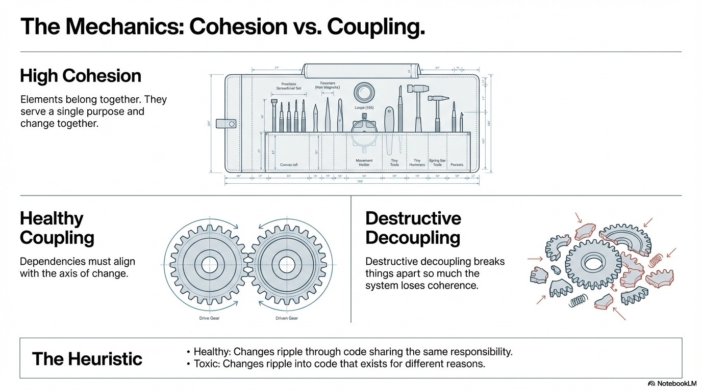


---

## Cohesion & Coupling Archetypes

| Archetype | Characteristics |
|---------|----------------|
| **Ideal**<br> **✅** | **High cohesion, low coupling**<br>- *Each module has a clear purpose and does it completely, while depending on others only through narrow, stable contracts.*<br>*- Responsibilities align with natural boundaries (business, capability, or actor). Dependencies are explicit and intentional.* |
| **God Object**<br> 🕸️ | **High cohesion, high coupling**<br>*- A single class/module that does make sense internally, but is involved in everything.*<br>*- Centralization feels efficient early. DRY and “reuse” overpower SRP. Authority accumulates faster than it can be redistributed.* |
| **Destructive Decoupling**<br>🧩 | **Low cohesion, low coupling**<br>*- Things are technically independent, but conceptually meaningless. Components don’t depend on each other because they don’t cohere around anything real.*<br>*- Decoupling becomes a goal instead of a consequence. SRP is applied mechanically (“one method per class”) without a unifying responsibility.* |
| **Poor Boundaries**<br>🔀 | **Low cohesion, high coupling**<br>*- Responsibilities are smeared across components, and those components are tangled together.*<br>*- Boundaries are drawn by convenience (folders, layers, frameworks) rather than responsibility. Architecture reflects workflow, not intent.* |


---

## Visualizing Cohesion and Coupling Archetypes

The following examples help illustrate cohesion and coupling archetypes.

These are examples and are open to interpretation.

### Visualizing a God Object: High Cohesion, High Coupling

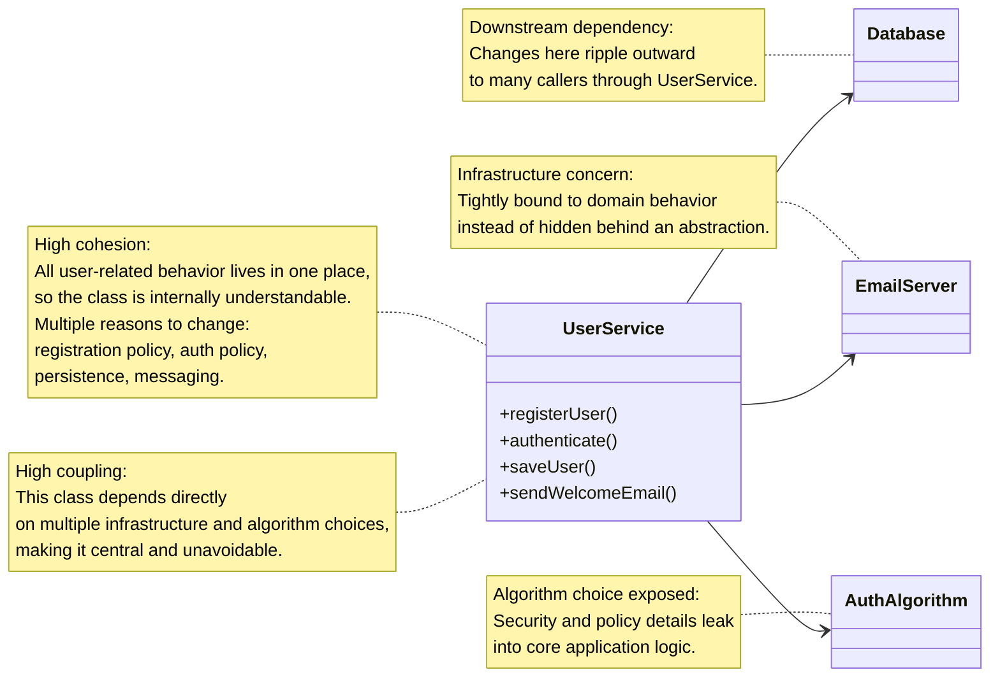
```mermaid
classDiagram
direction LR
class UserService {
  +registerUser()
  +authenticate()
  +saveUser()
  +sendWelcomeEmail()
}

class Database
class EmailServer
class AuthAlgorithm

UserService --> Database
UserService --> EmailServer
UserService --> AuthAlgorithm

note for UserService "High cohesion:<br>All user-related behavior lives in one place,<br>so the class is internally understandable.<br>Multiple reasons to change:<br>registration policy, auth policy,<br>persistence, messaging."
note for UserService "High coupling:<br>This class depends directly<br>on multiple infrastructure and algorithm choices,<br>making it central and unavoidable."
note for Database "Downstream dependency:<br>Changes here ripple outward<br>to many callers through UserService."
note for EmailServer "Infrastructure concern:<br>Tightly bound to domain behavior<br>instead of hidden behind an abstraction."
note for AuthAlgorithm "Algorithm choice exposed:<br>Security and policy details leak<br>into core application logic."
```


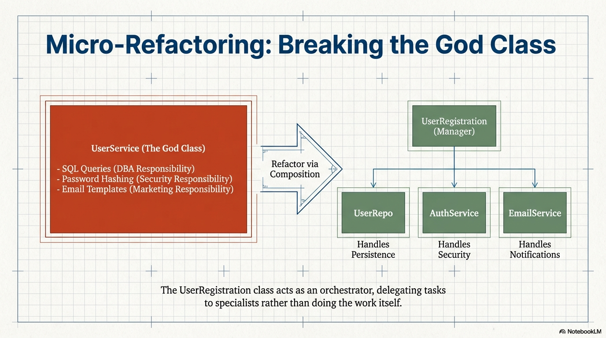

### Visualizing Destructive Decoupling: Low Cohesion, Low Coupling

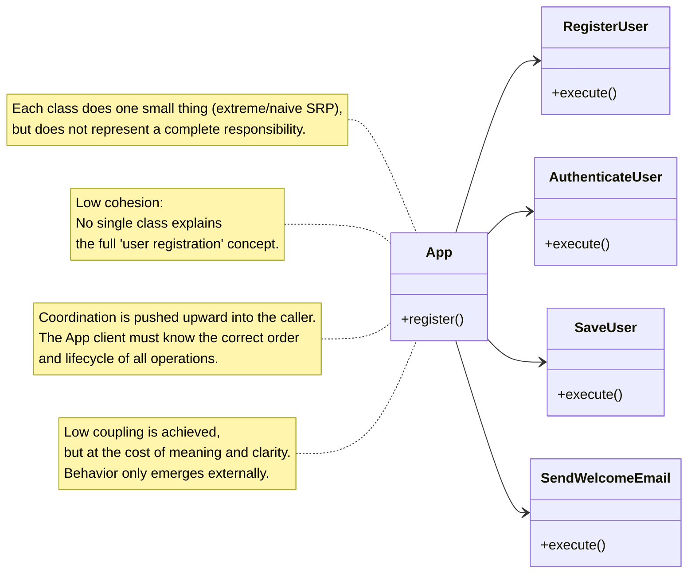
```mermaid
classDiagram
direction LR

class RegisterUser {
  +execute()
}
class AuthenticateUser {
  +execute()
}
class SaveUser {
  +execute()
}
class SendWelcomeEmail {
  +execute()
}

class App {
  +register()
}

App --> RegisterUser
App --> AuthenticateUser
App --> SaveUser
App --> SendWelcomeEmail

note for App "Each class does one small thing (extreme/naive SRP),<br>but does not represent a complete responsibility."
note for App "Low cohesion:<br>No single class explains<br>the full 'user registration' concept."
note for App "Coordination is pushed upward into the caller.<br>The App client must know the correct order<br>and lifecycle of all operations."
note for App "Low coupling is achieved,<br>but at the cost of meaning and clarity.<br>Behavior only emerges externally."
```

### Visualizing Poor Boundaries: Low Cohesion, High Coupling

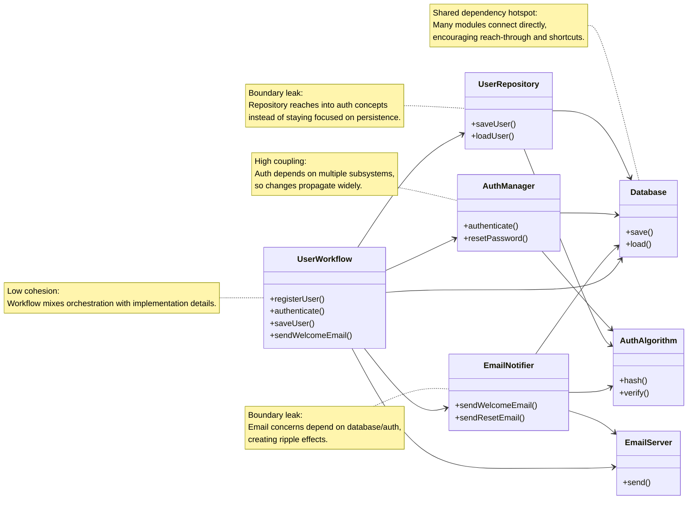
```mermaid
classDiagram
direction LR
class UserWorkflow {
  +registerUser()
  +authenticate()
  +saveUser()
  +sendWelcomeEmail()
}

class Database {
  +save()
  +load()
}
class EmailServer {
  +send()
}
class AuthAlgorithm {
  +hash()
  +verify()
}

class UserRepository {
  +saveUser()
  +loadUser()
}
class AuthManager {
  +authenticate()
  +resetPassword()
}
class EmailNotifier {
  +sendWelcomeEmail()
  +sendResetEmail()
}

%% Tangled, overlapping dependencies (high coupling)
UserWorkflow --> UserRepository
UserWorkflow --> AuthManager
UserWorkflow --> EmailNotifier

UserRepository --> Database
AuthManager --> Database
AuthManager --> AuthAlgorithm
EmailNotifier --> EmailServer
EmailNotifier --> Database

%% Cross-boundary reach-through (poor boundaries)
UserWorkflow --> Database
UserWorkflow --> EmailServer
UserRepository --> AuthAlgorithm
EmailNotifier --> AuthAlgorithm

note for UserWorkflow "Low cohesion:<br>Workflow mixes orchestration with implementation details."
note for UserRepository "Boundary leak:<br>Repository reaches into auth concepts<br>instead of staying focused on persistence."
note for EmailNotifier "Boundary leak:<br>Email concerns depend on database/auth,<br>creating ripple effects."
note for AuthManager "High coupling:<br>Auth depends on multiple subsystems,<br>so changes propagate widely."
note for Database "Shared dependency hotspot:<br>Many modules connect directly,<br>encouraging reach-through and shortcuts."
```

### Visualizing an "Ideal" Solution: High Cohesion, Low Coupling

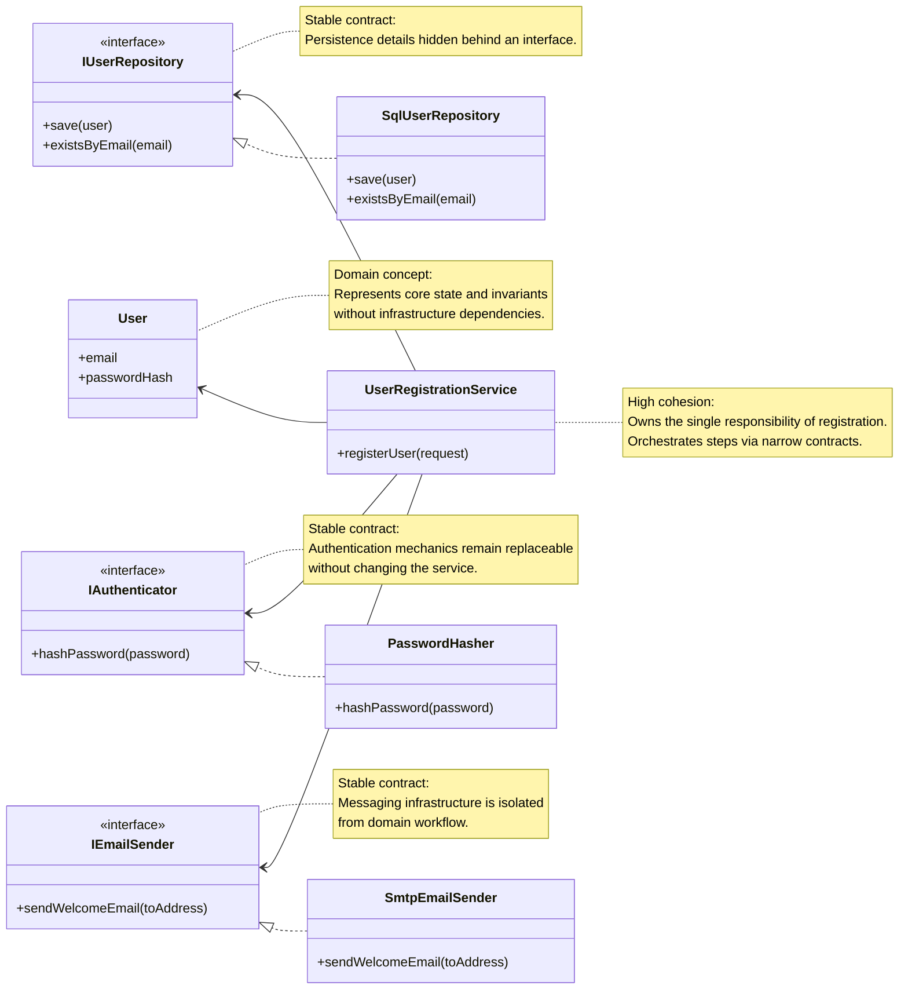
```mermaid
classDiagram
direction RL

class UserRegistrationService {
  +registerUser(request)
}

class IUserRepository {
  <<interface>>
  +save(user)
  +existsByEmail(email)
}

class IAuthenticator {
  <<interface>>
  +hashPassword(password)
}

class IEmailSender {
  <<interface>>
  +sendWelcomeEmail(toAddress)
}

class User {
  +email
  +passwordHash
}

UserRegistrationService --> IUserRepository
UserRegistrationService --> IAuthenticator
UserRegistrationService --> IEmailSender
UserRegistrationService --> User

class SqlUserRepository {
  +save(user)
  +existsByEmail(email)
}
class PasswordHasher {
  +hashPassword(password)
}
class SmtpEmailSender {
  +sendWelcomeEmail(toAddress)
}

SqlUserRepository ..|> IUserRepository
PasswordHasher ..|> IAuthenticator
SmtpEmailSender ..|> IEmailSender

note for UserRegistrationService "High cohesion:<br>Owns the single responsibility of registration.<br>Orchestrates steps via narrow contracts."
note for IUserRepository "Stable contract:<br>Persistence details hidden behind an interface."
note for IAuthenticator "Stable contract:<br>Authentication mechanics remain replaceable<br>without changing the service."
note for IEmailSender "Stable contract:<br>Messaging infrastructure is isolated<br>from domain workflow."
note for User "Domain concept:<br>Represents core state and invariants<br>without infrastructure dependencies."
```


---

## SRP Across Levels of Code Organization

The Single Responsibility Principle is **fractal**:  
the same idea repeats at every level of code organization.

At each level, SRP asks the same question:

> **What is the single reason this thing should change?**

What changes is **what “thing” means** at each level, where levels include:

- Class
- Namespace
- Project/Module
- Application

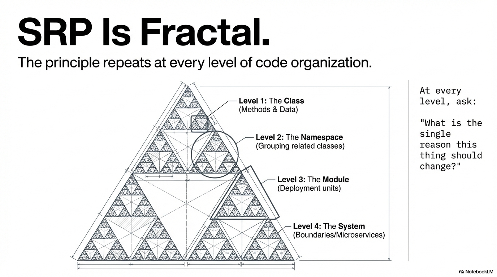

---

### SRP at the Class Level

At the class level, SRP applies to **behavior and data**.

A class should:

- Encapsulate one business concern
- Serve one actor
- Change for one reason

**Example violation**  
A `UserService` that:

- Validates passwords
- Saves users to a database
- Sends welcome emails

This class changes when:

- Security rules change
- Database technology changes
- Messaging rules change

These are different reasons → different responsibilities → SRP violation.

**SRP-compliant refactor**

- `AuthService`
- `UserRepository`
- `EmailService`

Each class now has one axis of change.

---

### SRP at the Namespace Level

At the namespace (or package) level, SRP applies to **grouping of related classes**.

A namespace should:

- Contain classes that change for the same reason
- Represent a coherent feature or domain concept

**Example violation: Package-by-Layer**

```text
Controllers/
Services/
Repositories/
Models/
```

A single feature change (e.g., “user registration”) requires edits across multiple namespaces.  
This is low cohesion at the package level.

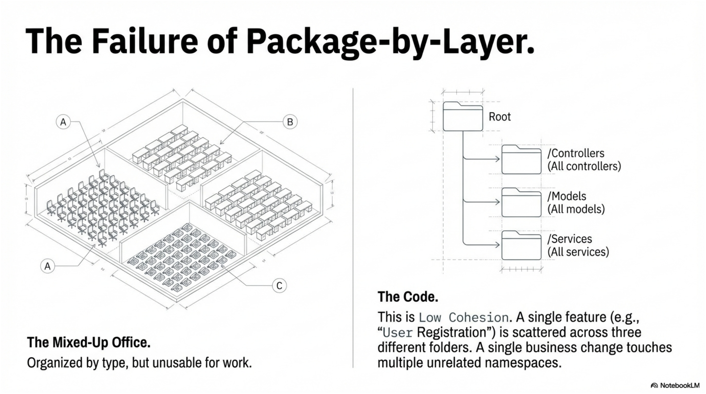

**SRP-compliant approach: Package-by-Feature**

```text
Users/
  UserController
  UserService
  UserRepository
Orders/
Payments/
```

Each namespace now has one reason to change: modification of that feature.

>  Popular frameworks such as **ASP.NET MVC, Spring Boot, Ruby on Rails, Django, and Angular** implicitly encourage **package-by-layer** organization because it is easy to teach, maps cleanly to the mechanics of the MVC pattern, and simplifies early decision-making—an approach often described as an *opinionated framework*.
>
> When using these frameworks for serious, professional-grade applications, it is important to consciously move beyond the default package-by-layer structure promoted by introductory documentation and examples, and reorganize the code around **features and reasons for change** to better support long-term adherence to the Single Responsibility Principle.

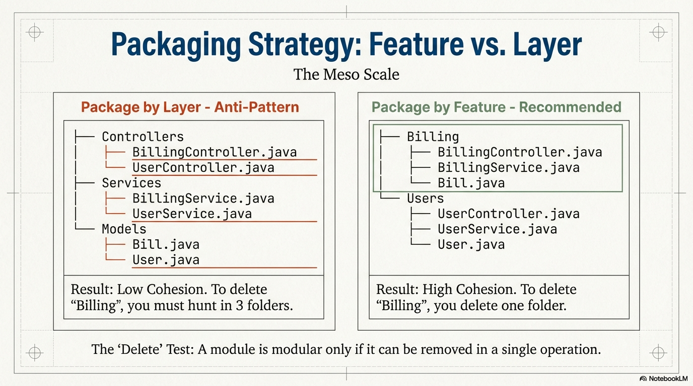

---

### SRP at the Package or Module Level

At the module level, SRP governs **deployment units and ownership**.

A module should:

- Represent one business capability
- Be owned by one primary actor or team
- Change independently of unrelated capabilities

**Example violation**  
A shared “Common” module containing:

- Billing logic
- Logging utilities
- User validation rules

Changes to billing now risk breaking unrelated concerns.

**SRP-compliant design**

- `BillingModule`
- `UserManagementModule`
- `ObservabilityModule`

Each module can evolve independently.

---

### SRP at the System Level

At the system level, SRP drives **architectural boundaries**.

A system should:

- Serve one business capability
- Own its data and rules
- Change for one primary business reason

This is where SRP aligns with:

- **Domain-Driven Design**
- **Bounded Contexts**
- **Microservices**

**Example**

- `OrderService` handles order placement and pricing
- `ShippingService` handles fulfillment and logistics

Even though both deal with “orders,” they serve different actors and evolve for different reasons.

---

### Why “Fractal” Matters

SRP violations at higher levels cause:

- Change amplification
- Organizational coupling
- System-wide fragility

Fixing SRP at the class level helps,  
but ignoring it at higher levels simply moves the problem upward.

Therefore:

> **SRP is not a class rule — it is a design principle that repeats at every level.**

From methods to modules to systems, the goal is the same:

- One responsibility
- One axis of change
- One actor

That consistency is what makes systems maintainable at scale.


---

## Screaming Architecture

“Screaming Architecture” is a term popularized by **Robert C. Martin (Uncle Bob)**. The idea is simple but powerful: 

> When you open a codebase for the first time, its structure should immediately communicate **what the system does**, not **what frameworks it uses**.

In Uncle Bob's words...

> *The architecture should scream the intent of the system.*  
> — Robert C. Martin, *Clean Architecture*

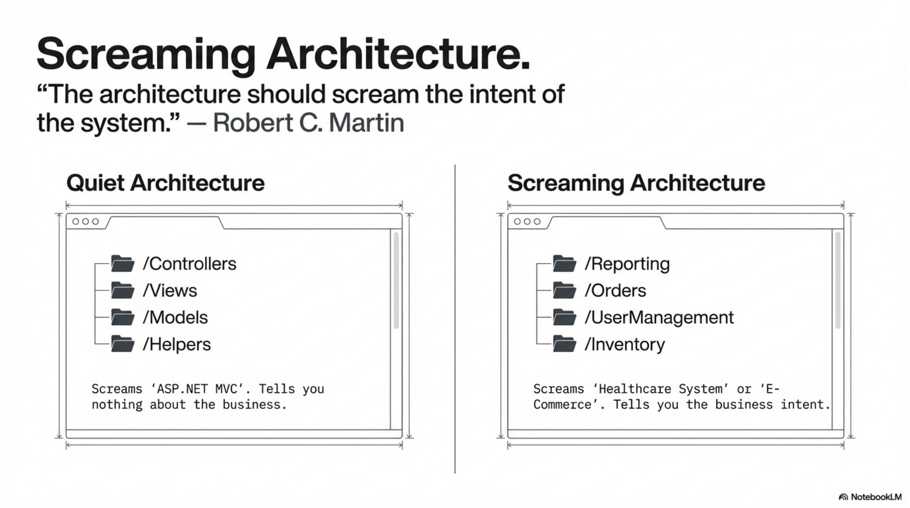

---

### What Should “Scream”

A screaming architecture makes the system’s purpose obvious:

- Core business capabilities
- Major domain concepts
- Features the system exists to support

The following should *not* foreground:

- MVC mechanics
- ORMs or persistence technology
- UI frameworks
- Infrastructure concerns

Frameworks are **details**. Architecture is **intent**.

---

### ASP.NET MVC: How the Default Template Encourages Package-by-Layer (Horizontal Architecture)

The default ASP.NET Core MVC template typically organizes code like this:

```text
/Controllers
/Models
/Views
/wwwroot
```

This structure emphasizes **framework roles** rather than **business capabilities**. While convenient for small demos and trivial projects, it subtly encourages a *package-by-layer* architecture.

#### Why this works against SRP over time

With a layered structure:

- A single feature is spread across multiple folders
- A small business change touches many unrelated files
- Change amplification becomes common

For example, modifying a “User Registration” feature might require changes in:

- `Controllers`
- `Models`
- `Views`
- Validation or service classes elsewhere

The project screams *MVC*, not *User Onboarding*.

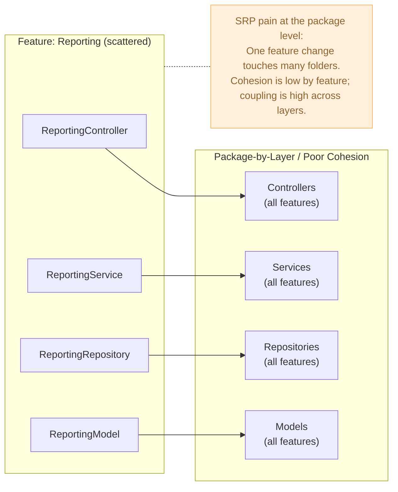
```mermaid
flowchart LR
 subgraph LAYERS["Package-by-Layer / Poor Cohesion"]
    direction TB
        C["Controllers<br>(all features)"]
        S["Services<br>(all features)"]
        R["Repositories<br>(all features)"]
        M["Models<br>(all features)"]
  end
 subgraph FEATURE_A["Feature: Reporting (scattered)"]
    direction TB
        A1["ReportingController"]
        A2["ReportingService"]
        A3["ReportingRepository"]
        A4["ReportingModel"]
  end
    A1 --> C
    A2 --> S
    A3 --> R
    A4 --> M
    FEATURE_A -.- noteA["SRP pain at the package level:<br>One feature change touches many folders.<br>Cohesion is low by feature; coupling is high across layers."]

     noteA:::Peach
    classDef note fill:#fff,stroke:#999,stroke-dasharray: 3 3,color:#333
    classDef Peach stroke-width:1px, stroke-dasharray:none, stroke:#FBB35A, fill:#FFEFDB, color:#8F632D
```


---

### Screaming Architecture: Package-by-Feature (Vertical Slice Architecture)

A **screaming architecture** organizes code around **reasons for change**—business features and capabilities.

```text
/src
  /Web
    /Features
      /Reporting
        ReportingController.cs
        ReportingViewModel.cs
        Views/
  /Application (API)
    /Reporting
  /Domain
    /Reporting
  /Infrastructure
```

Here, the directory structure communicates intent immediately:

- This system does **Reporting**
- Reporting has UI, application logic, and domain concepts
- Changes related to reporting stay mostly within reporting-related code

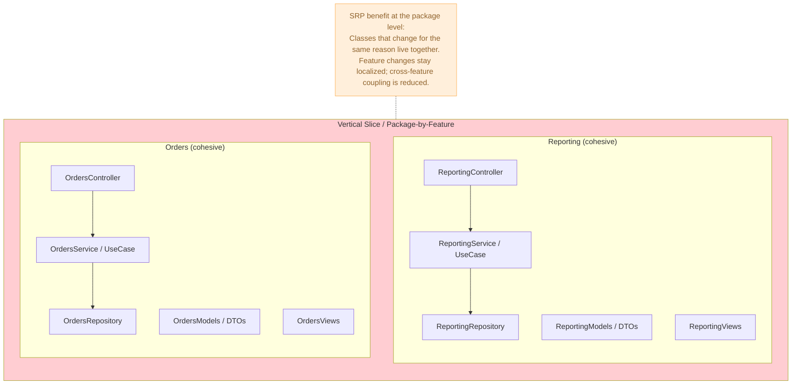
```mermaid
flowchart BT
 subgraph REPORTING["Reporting (cohesive)"]
    direction TB
        RC["ReportingController"]
        RS["ReportingService / UseCase"]
        RR["ReportingRepository"]
        RM["ReportingModels / DTOs"]
        RV["ReportingViews"]
  end
 subgraph ORDERS["Orders (cohesive)"]
    direction TB
        OC["OrdersController"]
        OS["OrdersService / UseCase"]
        OR["OrdersRepository"]
        OM["OrdersModels / DTOs"]
        OV["OrdersViews"]
  end
 subgraph FEATURES["Vertical Slice / Package-by-Feature"]
    direction TB
        REPORTING
        ORDERS
  end
    RC --> RS
    RS --> RR
    OC --> OS
    OS --> OR
    FEATURES -.- noteB["SRP benefit at the package level:<br>Classes that change for the same reason live together.<br>Feature changes stay localized; cross-feature coupling is reduced."]

     noteB:::Peach
    classDef note fill:#fff,stroke:#999,stroke-dasharray: 3 3,color:#333
    classDef Peach stroke-width:1px, stroke-dasharray:none, stroke:#FBB35A, fill:#FFEFDB, color:#8F632D
    style FEATURES fill:#FFCDD2
```

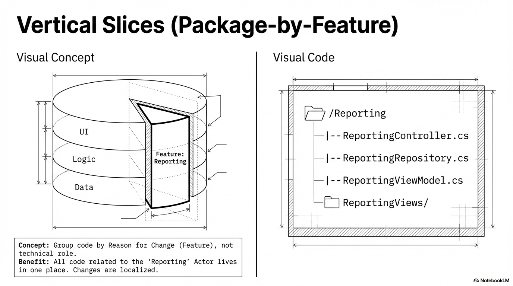

---

## Feature-First Layered Architecture

**Feature-First Layered Architecture** is a hybrid approach where a system is organized by **business features or capabilities first**, and then **layered inside each feature** only where layering improves clarity.

This keeps feature code cohesive (package-by-feature) while still allowing familiar internal structure (controllers, views, models, application logic) *without* forcing those layers to span the entire application.

A key SRP benefit: **each feature folder becomes a unit that changes primarily for one reason—the evolution of that feature.**

```text
/MyApp.Web
  /Areas
    /Reporting
      /Controllers
        ReportsController.cs
        ExportsController.cs
      /Views
        /Reports
          Index.cshtml
          Details.cshtml
        /Exports
          Index.cshtml
      /Models
        ReportRowViewModel.cs
        ReportFilterViewModel.cs
      /Services
        ReportingFacade.cs
        ReportGenerator.cs
        ReportRepository.cs

    /UserManagement
      /Controllers
        UsersController.cs
        RolesController.cs
      /Views
        /Users
          Index.cshtml
          Edit.cshtml
        /Roles
          Index.cshtml
      /Models
        UserListViewModel.cs
        EditUserViewModel.cs
        RoleViewModel.cs
      /Services
        UserManagementFacade.cs
        UserRepository.cs
        RoleRepository.cs
        PasswordPolicyService.cs
```

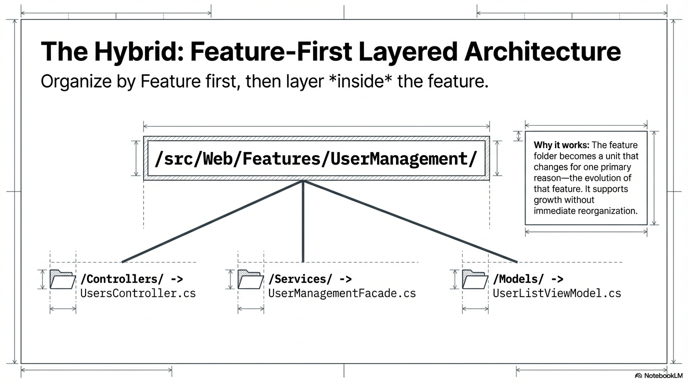

---

## SRP Benefits at Multiple Levels

#### Class Level

- Classes have a single reason to change
- UI, business logic, and persistence concerns are separated

#### Namespace Level

- Namespaces align with features (`Reporting`, `Billing`, `Orders`)
- Feature changes do not ripple across unrelated namespaces

#### Module Level

- Features can evolve into separate modules or projects naturally
- The architecture supports growth without reorganization

#### Application Level (Microservice Architecture)

- Applications align with distinct business capabilities
- System boundaries reflect independent reasons to change
- Microservices emerge naturally *if and when* independent deployment is justified

---

### Screaming Architecture Core Insights

> **Good architecture optimizes for understanding before optimization.**

A screaming architecture aligns with SRP by:

- Grouping code that changes for the same reasons
- Minimizing change amplification
- Making systems easier to evolve over time

---

## Why Is SRP So Hard to (Effectively) Apply?

SRP *sounds simple*, but it is one of the **hardest design principles to truly understand and implement** because it is not about the structure of code—it is about the **shape of change**.

### Why It’s Difficult

- SRP is **not visible in syntax**
- Early examples are too small to expose real consequences
- Frameworks hide responsibility boundaries
- Violations emerge **gradually**, one change at a time
- Failures appear far from the original modification

### The Core Challenge

Developers naturally focus on *what code does*.  
SRP requires focusing on **why code changes** and **who requests those changes**.

This makes SRP difficult for both students and seasoned professionals:  
the forces it addresses are **organizational and temporal**, not immediately technical.

### A Mental Shift Is Required

> Stop asking: *“What does this code do?”*  
> Start asking: **“Why would this code need to change?”**
>
> You (and every designer and developer that follows you) must be very disciplined when designing and coding to avoid mixing responsibilities, both at inception and over time.

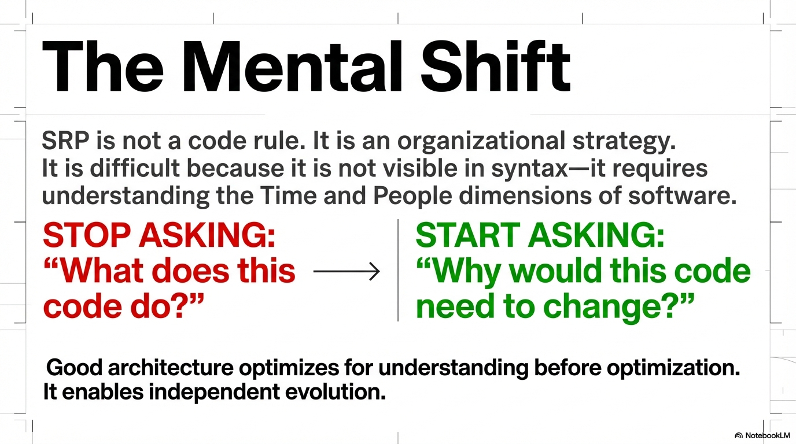

---

## SRP Code Smells (Red Flags)

- One change requires touching many unrelated files
- Classes are reviewed or modified by multiple teams
- “This class is fragile” is common knowledge
- Tests fail far from the change site
- You hesitate before making small modifications
- One module serves multiple actors with independent reasons to change

### Structural Smells That Often Indicate SRP Violations

- Large or growing `Utils` / `Helpers` / `Common` / `Shared` folders
- Generic libraries with unclear ownership or responsibility
- “Convenience” abstractions that accumulate options and flags in the method signature. For example, `SendMail` continues to grow as you add more and more functionality (and therefore, parameters)

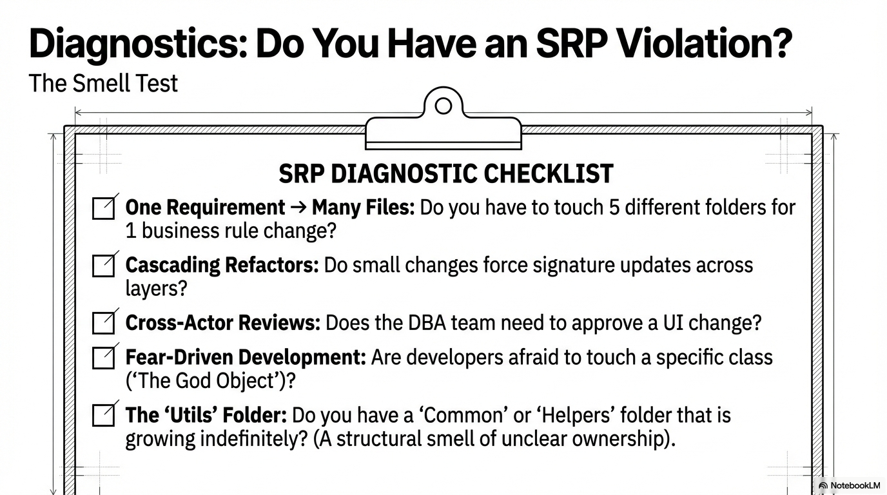

---

## Conclusion: SRP is a Strategy for Reducing Complexity and Enabling Change

The Single Responsibility Principle:

- is *not* a size rule
- is *not* a formatting rule
- is a **strategy for managing change**

Systems change because:
- People request new behavior
- Organizations evolve
- Frameworks, libraries, and operating systems evolve

Good architecture **enables terror-free change**.

It allows additions and extensions while keeping modifications localized, preventing complexity from exploding and avoiding unintended defects across the system.

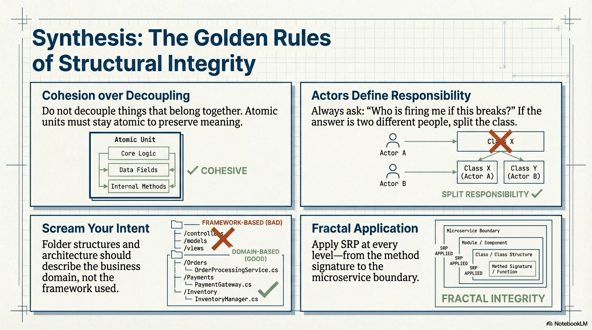


---

## References

- Robert C. Martin — *Clean Architecture*
- Robert C. Martin — *Agile Software Development*
- Eric Evans — *Domain-Driven Design*
- D. L. Parnas — “On the Criteria to Be Used in Decomposing Systems”
- Martin Fowler — *Refactoring*

---

## Single Responsibility Videos

> Produced by Google's NotebookLM to help explain some of the topics in this lecture.

Many large codebases become difficult to work with not because they are poorly written, but because responsibilities are poorly organized. God objects, scattered feature logic, and over-engineered abstractions all stem from low cohesion and unhealthy coupling. This lecture explores how the Single Responsibility Principle (SRP) helps restore clarity by grouping code that changes for the same reason and separating code that changes for different reasons. By examining common architectural anti-patterns and contrasting package-by-layer structures with feature-first designs, the goal is to develop an instinct for recognizing responsibility boundaries and building architectures that clearly communicate their purpose and evolve safely over time.

- [**Watch Video 1 (AI-Generated)**](04-single-responsibility-video1-notebooklm.mp4)

- [**Watch Video 2 (AI-Generated)**](04-single-responsibility-video2-notebooklm.mp4)

## Study Guide: Single Responsibility Principle (SRP)

This study guide summarizes the key ideas, terminology, and mental models introduced in this lecture. It is intended to support review, reflection, and exam preparation.

---

### Core Definition

- **Single Responsibility Principle (SRP)**  
  A module should be responsible to **one, and only one, actor.

- **Actor**  
  A conceptual source of change: a role, responsibility, or business concern that can independently request modifications to the code.

SRP is fundamentally about **managing change**, not limiting size or enforcing formatting rules.

---

### Key Mental Models

- **Reason for Change**  
  SRP asks *why* code changes, not *what* it does.

- **Axis of Change**  
  An independent dimension along which code may evolve (e.g., business rules, persistence, compliance, performance).

- **Fractal SRP**  
  SRP applies at every level of code organization:
  - Classes
  - Namespaces
  - Modules
  - Systems

- **Conceptual Actor**  
  Actors are not necessarily people or systems; they represent change pressure.  
  Multiple stakeholders may represent the *same* actor if they request the same kinds of changes.

---

### Common SRP Violations (Smells)

Be able to recognize these patterns:

- One change requires touching many unrelated files
- Classes or modules are reviewed by multiple teams
- Tests fail far from the change site
- Developers hesitate before making small changes
- “This class is fragile” is common knowledge
- Large or vague `Utils`, `Helpers`, `Common`, or `Shared` folders
- “Convenience” abstractions that accumulate options, flags, or modes
- Reuse driven by **surface similarity**, not shared change pressure

---

### Change Amplification

- **Change Amplification**  
  A small change causes a cascade of modifications across unrelated parts of the system.

SRP exists to **contain change** and prevent amplification.

**Diagnostic questions:**
- Does this change force modifications owned by different actors?
- Does it require coordination between unrelated teams?
- Do failures appear far from the original change?

---

### SRP vs DRY

- **DRY (Don’t Repeat Yourself)** reduces duplication.
- **SRP** isolates reasons for change.

These principles can conflict.

**Key rule:**
> **Apply SRP before DRY.**

Only remove duplication when:
- The duplicated code changes for the same reason
- The abstraction is pulled by a single axis of change

Code can *look* the same while changing for different reasons.

---

### Cohesion and Coupling

- **High Cohesion**  
  Code within a module belongs together conceptually and changes for the same reason.

- **Low Coupling**  
  Modules depend on each other only where necessary and in well-defined ways.

SRP drives systems toward **high cohesion and low coupling**.

---

### Architecture-Level Implications

- **Package-by-Layer**  
  Organizes code by technical role (controllers, services, repositories).  
  Easy to start, but often leads to change amplification.

- **Package-by-Feature / Vertical Slices**  
  Organizes code around business capabilities.  
  Aligns naturally with SRP.

- **Feature-First Layered Architecture**  
  Organize by feature first, then layer internally where helpful.

- **Screaming Architecture**  
  The structure of the codebase should communicate *what the system does*, not *what frameworks it uses*.

---

### Why SRP Is Hard

- SRP is not visible in syntax
- Early examples hide long-term consequences
- Frameworks encourage layered packaging
- Violations emerge gradually
- The forces SRP addresses are organizational and temporal

SRP requires **judgment**, not rule-following.

---

### Key Takeaways to Remember

- SRP is a **strategy for managing change**
- Actors define responsibility boundaries
- Duplication is less dangerous than unrelated change pressure
- Apply SRP before DRY
- Good architecture contains change and enables evolution

---

### Exam and Review Tips

When evaluating a design, always ask:
1. Who can request changes to this code?
2. Are there multiple independent reasons this code might change?
3. Would different teams need to coordinate to modify it safely?

If the answers point to independent change pressure, SRP is likely being violated.

