# The Open-Closed Principle (OCP)

The **O** in S**O**LID...

---

In the previous lecture, we explored the **Single Responsibility Principle (SRP)** and the idea that good design is largely about *containing change*. The **Open–Closed Principle (OCP)** builds directly on that foundation.

OCP is often introduced with the slogan:

> *“Software entities should be open for extension, but closed for modification.”*

While memorable, this phrasing is easy to misinterpret. It does **not** mean that code should never be modified, nor does it mean that every class should have an interface. Taken too literally, OCP often leads to unnecessary abstraction and over-engineering.

Instead, a proper interpretation of OCP answers a more practical question:

> *When requirements change — as they almost always do — where should that change be allowed to land?*

## Table of Contents

- [The Open-Closed Principle (OCP)](#the-open-closed-principle-ocp)
- [Why OCP Is Harder Than It Sounds](#why-ocp-is-harder-than-it-sounds)
- [SRP as the Gatekeeper for OCP](#srp-as-the-gatekeeper-for-ocp)
- [Progressive Code Evolution Toward OCP](#progressive-code-evolution-toward-ocp)
- [Disciplined Abstraction - Abstract When Appropriate](#disciplined-abstraction---abstract-when-appropriate)
- [Introducing the Decorator Pattern](#introducing-the-decorator-pattern)
- [Example - Before Decorator](#example---before-decorator)
- [Example - After Decorator](#example---after-decorator)
- [Practical Summary](#practical-summary)

### **OCP Depends on SRP**

OCP is only achievable when **SRP is already in place**. If a class has multiple reasons to change, there is nothing stable to “close.” SRP identifies a unit of responsibility; OCP governs how that responsibility evolves over time.

### **A Practical View of OCP**

OCP is *not* about predicting the future or avoiding edits. It is about:

- Protecting stable, trusted code
- Localizing the impact of new behavior
- Reducing regression risk as systems evolve

Experienced developers value OCP because it manages **change pressure**, not because it is elegant (though it is indeed an elegant idea when properly understood).

This lecture focuses on the **practical techniques** that make OCP achievable: recognizing variation, refactoring toward abstraction when justified, and using patterns such as **Strategy** and **Decorator** to extend behavior without repeatedly rewriting core logic.

OCP is not a design you start with - it is a discipline you apply *as change reveals itself*.

## Why OCP Is Harder Than It Sounds

Most practitioners meet OCP this way:

> *"Classes should be open for extension, and closed for modification."*

That sentence sounds absolute — and absolutes are usually wrong.

Today's focus: 

- OCP as an **outcome of good structure** 
- OCP as a **refactoring decision**, not a starting position

Experienced developers ask themselves (and others) *"what will change next — and how painful will that be?"* to decide how to apply OCP immediately or in the future.

------------------------------------------------------------------------

## SRP as the Gatekeeper for OCP

**Key Idea:** OCP cannot be achieved or maintained without SRP.

If a class has multiple reasons to change, you cannot "close" it to modification.

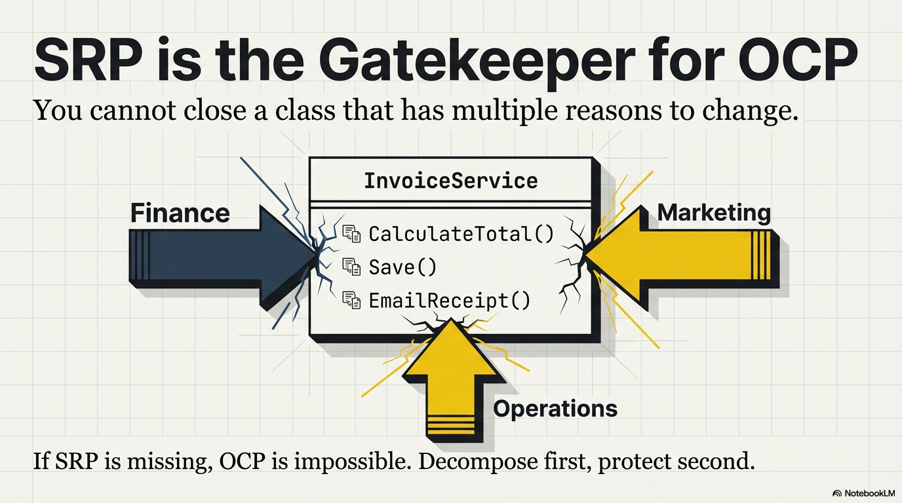

### Multiple Responsibility Example

``` csharp
public class InvoiceService
{
    public decimal CalculateTotal(Order order) { }
    public void Save(Order order) { }
    public void EmailReceipt(Order order) { }
}
```

The following diagram illustrates the change pressure likely to be applied over time on this class:

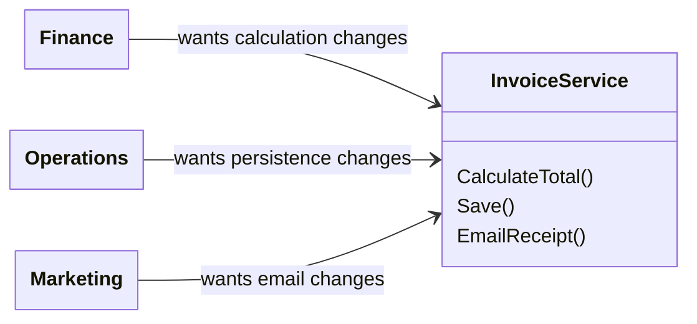

This class has multiple responsibilities... three "actors" can influence the implementation over time. 

To apply OCP to this class, we need to decompose it into its responsibilities, then apply OCP to the class(es) that provide those responsibilities.

------------------------------------------------------------------------

## Progressive Code Evolution Toward OCP

Following is the evolution of a simple `PriceCalculator` that proceeds through a number of incarnations. Initially, the class has no additional abstractions. They simply were not needed at the time.

### Incarnation 1: Simple and Correct

``` csharp
public class PriceCalculator
{
    public decimal Calculate(Order order)
    {
        return order.Subtotal * 0.9m;
    }
}
```

### Incarnation 2: Sales Requests More Discount Methods

Next, the Sales team requests two more discount methods. This is a cue to consider the Strategy pattern to vary the discount implementation and keep the Calculate method simplistic as additional discount methods are eventually required. Change pressure is mounting to refactor for OCP.

``` csharp
public decimal Calculate(Order order)
{
    if (order.IsLoyalCustomer)
        return order.Subtotal * 0.85m;

    if (order.ItemCount > 10)
        return order.Subtotal * 0.8m;

    return order.Subtotal * 0.9m;
}
```

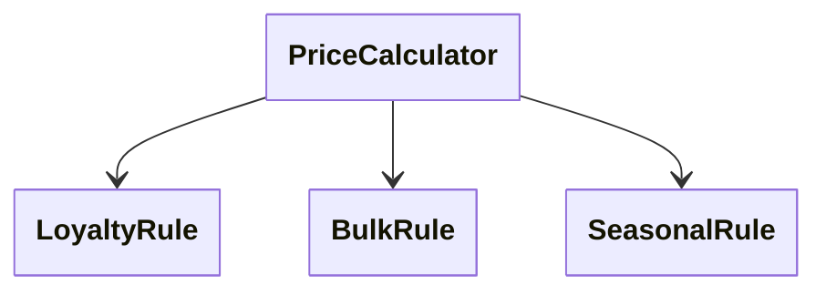

*Note: These ‘rules’ are conceptual — they represent forces acting on the method, not classes that exist yet.*

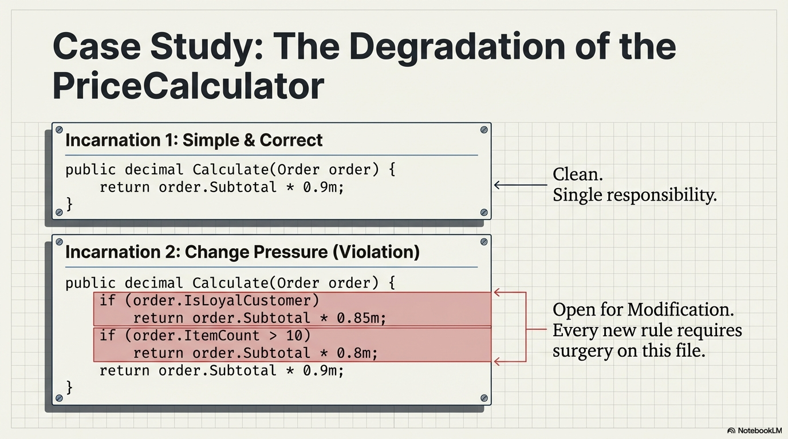

### Incarnation 3: Strategy Refactor

The developer wisely chooses the Strategy pattern to vary the discount implementation, closing PriceCalculator to changes while enabling extensions to the discount mechanism.

``` csharp
public interface IDiscountStrategy
{
    decimal Apply(Order order);
}
```

``` csharp
public class PriceCalculator
{
    private readonly IDiscountStrategy _strategy;

    public PriceCalculator(IDiscountStrategy strategy)
    {
        _strategy = strategy;
    }

    public decimal Calculate(Order order)
    {
        return _strategy.Apply(order);
    }
}
```

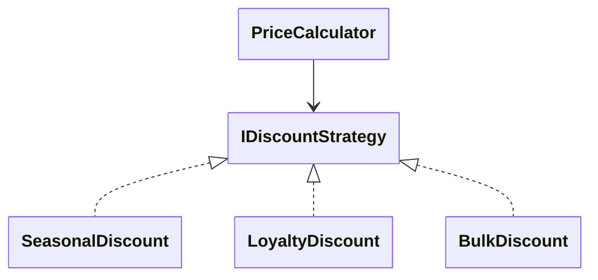

The Price Calculator is now OCP-compliant and ready for further extension without modification to the calculation method.

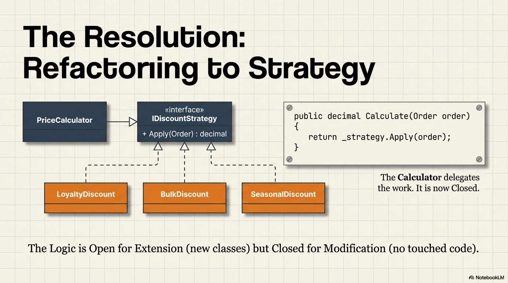

------------------------------------------------------------------------

## Disciplined Abstraction - Abstract When Appropriate

One of the most common reactions to learning the Open-Closed Principle
is **overcorrecting**.

Practitioners hear *"open for extension"* and conclude:

- Every class needs an interface

- Every service needs multiple implementations
- Abstraction is inherently good

This section focuses on learning **when abstraction helps** and **when it actively harms**.

------------------------------------------------------------------------

### The Core Principle

> **Abstraction should respond to variation, not anticipate it
> blindly.**

**OCP is not about guessing the future.** It is about responding *intelligently* when change actually appears.

------------------------------------------------------------------------

### Rule #1: No Interface Without Variation

An interface is justified when there are multiple behaviors and

- Those behaviors vary independently, and
- Switching behavior does not require rewriting trusted code.

An interface is *not* justified when there is exactly one
implementation, and

- There is no evidence that the behavior will vary, and
- The abstraction adds no decision-making power

> An interface only supports OCP if it represents a *decision point* that is expected to vary independently.

#### Example: Premature Abstraction

``` csharp
public interface IEmailService
{
    void Send(string message);
}

public class EmailService : IEmailService
{
    public void Send(string message) { }
}
```

This does not improve OCP. It adds indirection without isolating change.

> ⚠️ An interface without variation does not protect you from change—it just makes the code harder to read.

------------------------------------------------------------------------

### Rule #2: Abstract After Evidence, Not Before

You do not design for OCP on day one because you do not yet know what needs to be protected. You refactor toward OCP *after* the change shows you what is unstable.

Good signals that abstraction is justified: You have modified the same
class more than once for the same reason

- New requirements keep touching the same method
- Business rules compete or conflict inside conditionals

Bad signals: 

- "We might need this someday."

- "Best practice says everything has an interface."
- "Testing might be easier later."

> Experienced teams refactor to OCP when the cost of *not* abstracting
> becomes visible.

------------------------------------------------------------------------

### Rule #3: Watch for `if/else` on Policy

The most reliable indicator that OCP is being violated is **conditional
logic based on policy or type**.

``` csharp
if (customer.IsVip)
{
    ApplyVipDiscount();
}
else if (order.Total > 1000)
{
    ApplyBulkDiscount();
}
```

This code indicates that multiple policies exist.

- They vary independently
- New policies will force modification

This is not a failure—it is a **signal**.

> **Note: A conditional that enforces an invariant or a fixed business rule is often perfectly appropriate and should not be abstracted.**

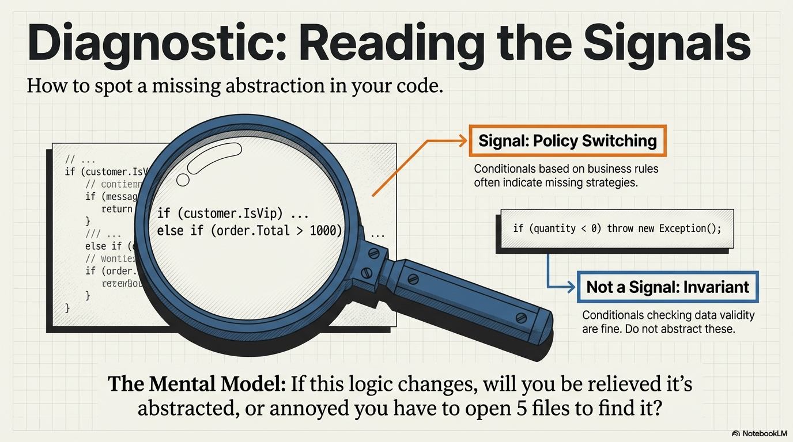

------------------------------------------------------------------------

### Why Over-Abstraction Is Dangerous

Over-abstraction will:

- Hide simple logic behind indirection

- Increase cognitive load
- Make debugging harder
- Create "fake OCP" that does not actually reduce change

Removing unnecessary abstraction is **harder** than adding it later.

------------------------------------------------------------------------

### A Mental Model That Helps

Before abstracting, ask:

> **"If this changes, will I be relieved this is abstracted or
> annoyed that I have to navigate five files to understand it?"**

If the answer is "annoyed," reconsider whether abstraction is necessary.

------------------------------------------------------------------------

### Abstraction Summary

-   OCP is not interface-first design
-   Abstraction should follow demonstrated variation
-   `if/else` on policy logic is a diagnostic tool, not a design failure
-   The goal is reducing future pain, not achieving theoretical purity

> **Good abstractions feel inevitable in hindsight. Bad abstractions feel clever in the moment.**

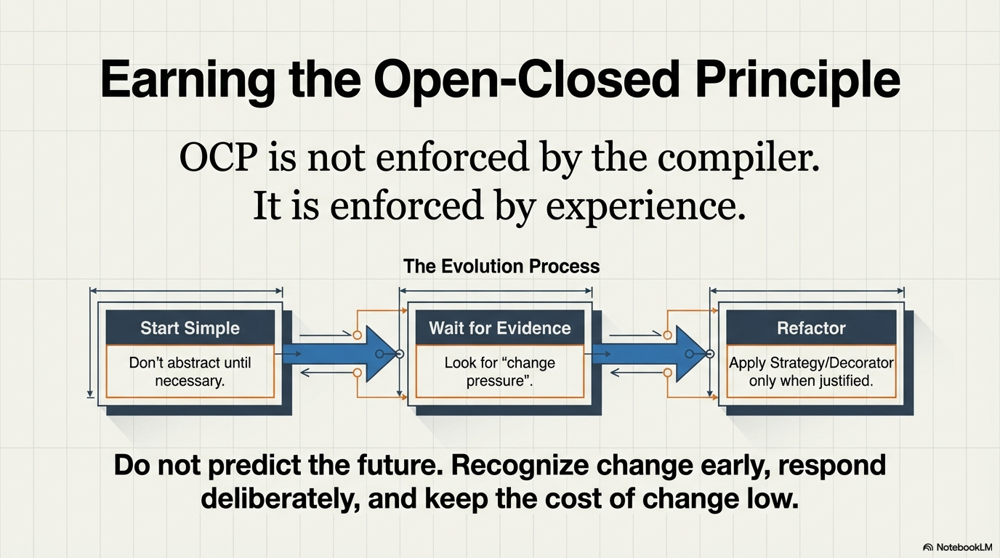

---

## Introducing the Decorator Pattern

The **Decorator** pattern lets you add behavior to an object by **wrapping it**, without changing the object's class and without creating a combinatorial explosion of subclasses.

A decorator: 

- Implements the same interface as the wrapped object,
- Holds a reference to the wrapped object,
- Delegates to the wrapped object, and
- Adds behavior before, after, or around the delegation

TLDR: **same contract, extra behavior, layered at runtime**.

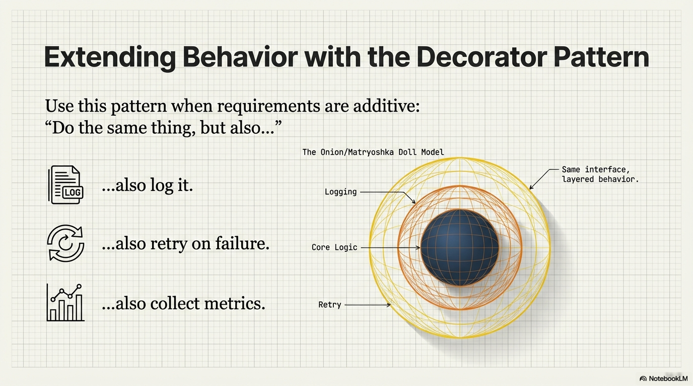

------------------------------------------------------------------------

### Why to Use Decorator

Decorator is useful when requirements repeatedly say:

-   "Do the same thing, but also log it."
-   "Do the same thing, but also retry on failure."
-   "Do the same thing, but also collect metrics."

#### OCP signals

-   Stable classes keep getting modified to add optional behavior
-   Flags or conditionals control behavior variants
-   Subclass counts start to grow combinatorially

Decorator helps OCP by allowing extension through **new wrapper
classes**, not modification of existing ones.

#### SRP signals

-   A class has a clear primary job but also handles logging, metrics,
    retries, validation, etc.
-   Cross-cutting concerns are tangled with core logic

Decorator restores SRP by isolating each concern in its own class.

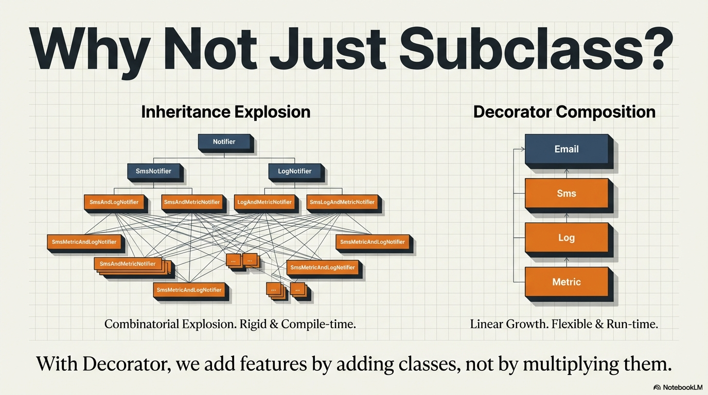

------------------------------------------------------------------------

### Decorator Pattern Canonical UML

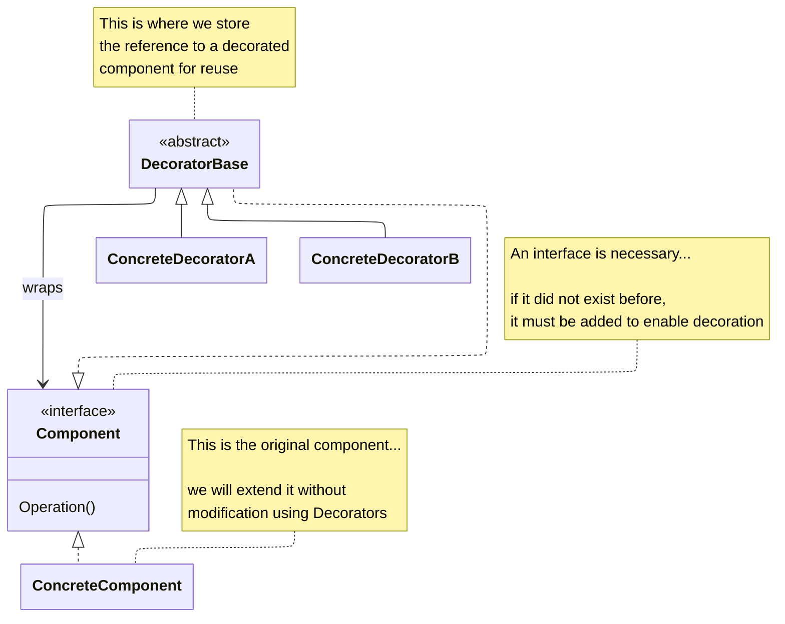

- **ConcreteComponent** -- the core behavior (the original class requiring decoration)
- **Component** -- the interface providing a stable contract for the ConcreteComponent and the decorators
- **Decorator** -- wraps a component and delegates
- **ConcreteDecorators** -- add one responsibility per concrete class

------------------------------------------------------------------------

## Example - Before Decorator

In this example, a `Notifier` class continues to receive new functionality surrounding sending an email. New functionality over time includes logging, metrics, SMS functionality, etc. Change pressure is forcing modifications to Notifier each time new responsibilities are added.

``` csharp
public class Notifier : INotifier
{
    private readonly bool _log;
    private readonly bool _metrics;
    private readonly bool _retry;
    private readonly bool _sms;

    public Notifier(bool log, bool metrics, bool sms)
    {
        _log = log;
        _metrics = metrics;
        _sms = sms;
    }

    public void Send(string message)
    {
        if (_log) Console.WriteLine($"LOG: {message}");

        if (_metrics) Console.WriteLine("METRICS++");

        SendMessage(message);

        if (_sms) Console.WriteLine($"SENDING SMS: {message}");
    }

    private void SendMessage(string message)
    {
        //the original public method before Send grew into a God method
        Console.WriteLine($"SENDING EMAIL: {message}");
    }
}
```

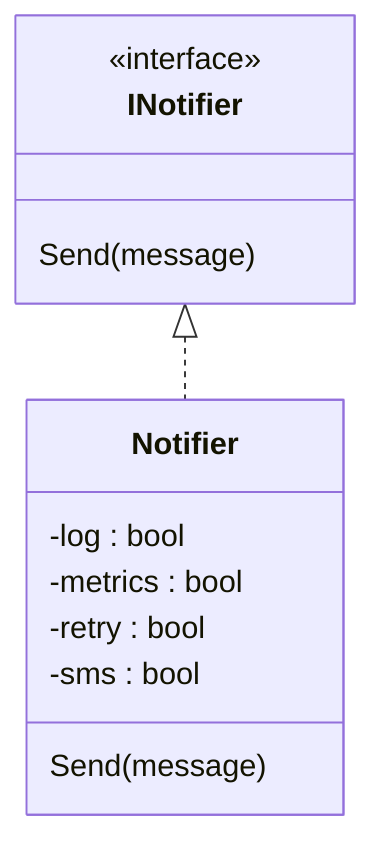

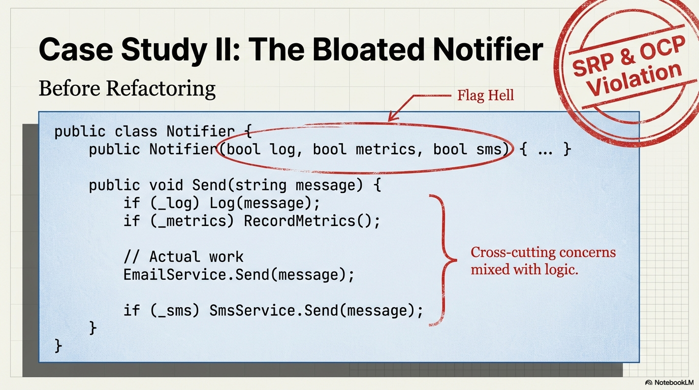

------------------------------------------------------------------------

## Example - After Decorator

### Core Component

``` csharp
public class EmailNotifier : INotifier
{
    public void Send(string message)
    {
        Console.WriteLine($"EMAIL: {message}");
    }
}
```

### Decorator Base

``` csharp
public abstract class NotifierDecorator : INotifier
{
    protected readonly INotifier Inner;

    protected NotifierDecorator(INotifier inner)
    {
        Inner = inner;
    }

    public abstract void Send(string message);
}
```

*Note: The abstract decorator `NotifierDecorator` exists to preserve substitutability while sharing the wrapping mechanism (`Inner`).*

### Concrete Decorators

``` csharp
public class LoggingNotifier : NotifierDecorator
{
    public LoggingNotifier(INotifier inner) : base(inner) {}

    public override void Send(string message)
    {
        Console.WriteLine($"LOG: {message}");
        Inner.Send(message);
    }
}
```

``` csharp
public class MetricsNotifier : NotifierDecorator
{
    public MetricsNotifier(INotifier inner) : base(inner) {}

    public override void Send(string message)
    {
        Console.WriteLine("METRICS++");
        Inner.Send(message);
    }
}
```

``` csharp
public class SmsNotifier : NotifierDecorator
{
    public SmsNotifier(INotifier inner) : base(inner) {}

    public override void Send(string message)
    {
        Inner.Send(message);
        Console.WriteLine($"SMS: {message}");
    }
}
```

### Runtime Composition

``` csharp
//if order of decoration matters, carefully wrap each class in the proper sequence

INotifier email = new EmailNotifier(); //the original class requiring decoration
INotifier sms = new SmsNotifier(email);
INotifier logging = new LoggingNotifier(sms);
INotifier metrics = new MetricsNotifier(logging);

INotifier notifier = metrics; 
//metric operation will run first, then logging, then sms, then email

notifier.Send("Order shipped");
```

------------------------------------------------------------------------

### Refactored Design Class Diagram

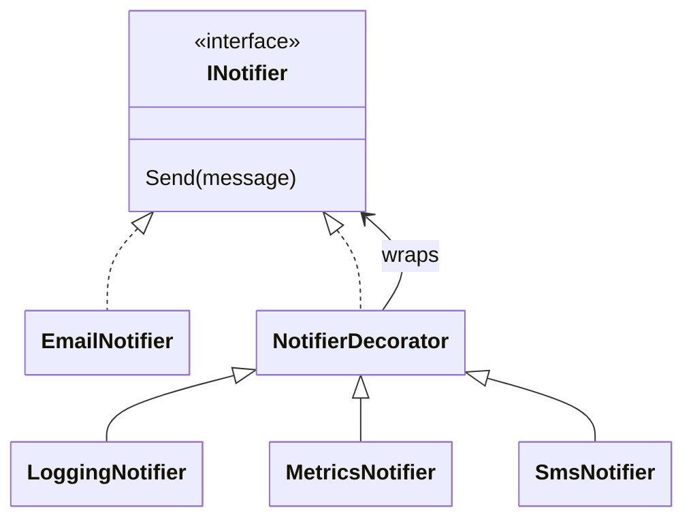

### Refactored Design Sequence Diagram

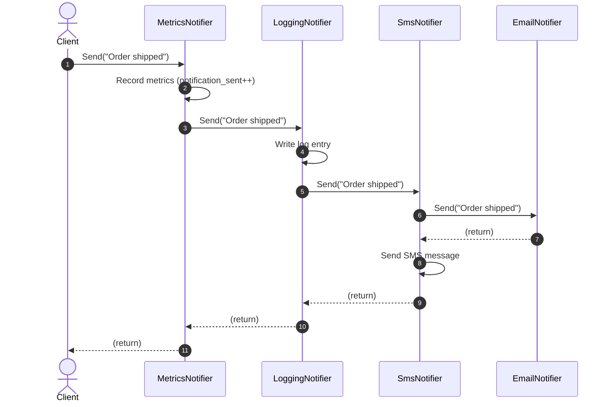

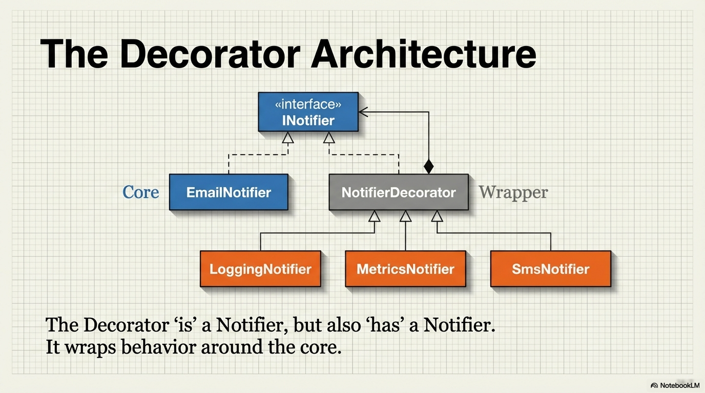

### Refactored Design Improvements

Improvements supporting the Open Closed Principle

-   Extend behavior without modifying stable classes
-   Add features by adding classes, not editing existing ones
-   Reduce regression risk

Improvements supporting the Single Responsibility Principle

-   Each decorator has one reason to change
-   Core logic stays focused
-   Cross-cutting concerns become composable

> If requirements keep saying "do the same thing, but also...", <br>the Decorator pattern is often the right answer.

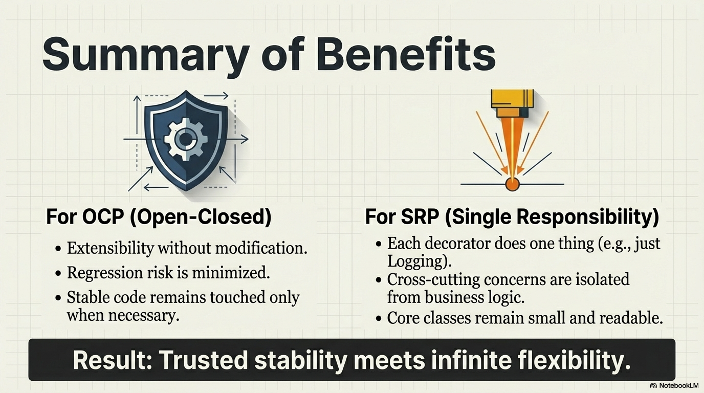

------------------------------------------------------------------------

## Practical Summary

The Open–Closed Principle is not something you “turn on” at the beginning of a project. It is something you **earn over time** as change reveals where your design is under stress.

- **Start simple when change is unlikely**

  If there is one clear rule, one stakeholder, and no history of variation, the simplest working solution is usually the best one. Premature abstraction does not buy flexibility — it creates confusion. You cannot know what should be “closed” until something actually tries to change.

- **Refactor to OCP after repeated edits**

  OCP becomes relevant when the same class or method is modified repeatedly for the *same reason*. That repetition is evidence. It tells you where behavior is volatile and where stable code needs protection. Refactoring toward OCP at this point reduces future risk and keeps trusted logic intact.

- **Use Strategy and Decorator to isolate volatility**

  When *algorithms or rules* vary, Strategy helps you move that variation behind a stable interface. When *additional behavior keeps getting layered on*, Decorator lets you extend behavior without rewriting existing code. These patterns are not goals — they are tools that emerge naturally when OCP pressure appears.

- **OCP is not enforced by the compiler — it is enforced by experience.**

> Good designers do not predict the future.<br>They **recognize change early, respond deliberately, and keep the cost of change low**.

---


