# The Liskov Substitution Principle (LSP)

## Designing Correct Subtypes Without Surprise

> *The **L** in SO**L**ID*

The Liskov Substitution Principle is about **trust**. When a client uses a base type, it should not need to know—or care—which subtype it receives. 

Subtypes must honor the [**semantic promises**](#semantic-promise-example) of their base types, not reinterpret them.

When they do not, inheritance becomes a source of bugs and surprises rather than a means of reuse.

#### What is "Semantic"?

> **Semantic (in OO design)** refers to the *meaning* and *behavioral guarantees* a type communicates to its clients—what the code promises to do, not just how it is shaped or named.

> **Semantic (dictionary definition)** (adj.): relating to meaning in language or logic; concerned with what words, symbols, or expressions *mean*, as opposed to their form or structure. **Semantics** is the branch of linguistics and logic that deals with meaning—specifically, how signs, symbols, or expressions convey meaning and how that meaning is interpreted.

---

## Table of Contents

- [The Liskov Substitution Principle (LSP)](#the-liskov-substitution-principle-lsp)
- [Designing Correct Subtypes Without Surprise](#designing-correct-subtypes-without-surprise)
- [Positioning LSP Within SOLID](#positioning-lsp-within-solid)
- [The Original Definition of LSP](#the-original-definition-of-lsp)
- [What LSP Is Really About](#what-lsp-is-really-about)
- [LSP as a Contract, Not Inheritance](#lsp-as-a-contract-not-inheritance)
- [Classic Bad Example: Rectangle / Square](#classic-bad-example-rectangle--square)
- [Why the Rectangle Example Fails](#why-the-rectangle-example-fails)
- [A Corrected Design](#a-corrected-design)
- [Bait-and-Switch as an LSP Metaphor](#bait-and-switch-as-an-lsp-metaphor)
- [Behavioral Subtyping Rules](#behavioral-subtyping-rules)
- [Preconditions, Postconditions, and Invariants](#preconditions-postconditions-and-invariants)
- [Strengthening Preconditions (Bad)](#strengthening-preconditions-bad)
- [Weakening Postconditions (Bad)](#weakening-postconditions-bad)
- [Exception-Based LSP Violations](#exception-based-lsp-violations)
- [LSP Across Abstraction Levels](#lsp-across-abstraction-levels)
- [LSP and Single Responsibility Principle](#lsp-and-single-responsibility-principle)
- [LSP and Open-Closed Principle](#lsp-and-open-closed-principle)
- [Practical Heuristics for LSP](#practical-heuristics-for-lsp)
- [Code Smells That Signal LSP Violations](#code-smells-that-signal-lsp-violations)
- [Conclusion: Substitutability Is Trust](#conclusion-substitutability-is-trust)
- Appendix 1
  - [LSP Video Overview (NotebookLM)](#lsp-video-overview)
  - [ Semantic Promise Example](#semantic-promise-example)
  - [Prevent LSP-Unsafe Subtypes by Forbidding Inheritance ](#prevent-lsp-unsafe-subtypes-by-forbidding-inheritance)
  - [Liskov Substitution Principle Study Guide](#liskov-substitution-principle-study-guide)

- Appendix 2
  - [Covariance and Contravariance](#covariance-and-contravariance)


---

## Positioning LSP Within SOLID

The **Liskov Substitution Principle (LSP)** is the principle that most clearly explains *why bad inheritance hurts so badly*.

If **SRP** is about *why code changes*<br>and **OCP** is about *where changes should land*<br>
then **LSP** is about *whether abstractions can be trusted at all*.

Without LSP:
- Polymorphism becomes dangerous
- Abstractions can mislead when their guarantees are unclear.
- Subtypes introduce hidden behavior changes
- Bugs appear far from the source

> **LSP is what makes polymorphism safe.**

---

## The Original Definition of LSP

[Barbara Liskov (1987)](https://en.wikipedia.org/wiki/Barbara_Liskov):

> *“What is wanted here is something like the following substitution property:  
> If for each object o1 of type S there is an object o2 of type T such that for all programs P defined in terms of T, the behavior of P is unchanged when o1 is substituted for o2, then S is a subtype of T.”*

In plain language:

> **If a program works with a base type, it must work *correctly* with any subtype.**

---

## What LSP Is Really About

LSP is **not** about:
- Syntax
- Method signatures
- Inheritance trees

LSP *is* about:
- **Behavior**
- **Expectations**
- **Contracts**

A subtype must:
- Accept everything the base type accepts
- Guarantee everything the base type guarantees
- Preserve the meaning of operations

> **Substitutability means *no surprises*.**

---

## LSP as a Contract, Not Inheritance

Inheritance is a *mechanism*.  
LSP is a *promise*.

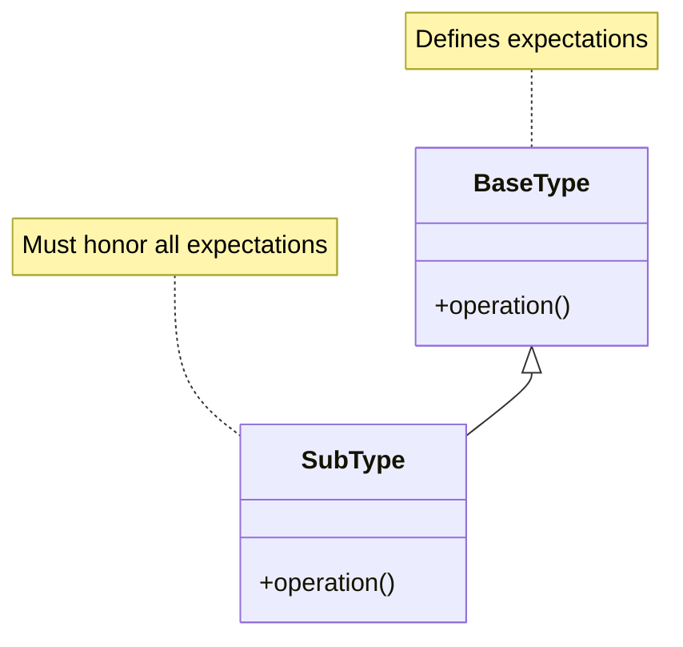

The compiler checks signatures to validate type compatibility. The compiler cannot *not* prevent LSP violations.

**Only design discipline enforces LSP.** 

---

## Classic Bad Example: Rectangle / Square

[Mathematics states that a square is a rectangle](https://en.wikipedia.org/wiki/Square).

That statement is correct mathematically, but software design has an additional constraint:
**behavioral substitutability**.

So the question becomes:

> Is it always correct to say that a `Square` is-a `Rectangle` when `Square` is implemented as a subtype of `Rectangle`?

### Base Class

```csharp
public class Rectangle
{
    public virtual int Width { get; set; }
    public virtual int Height { get; set; }

    public int Area() => Width * Height;
}
```

### Subclass

```csharp
public class Square : Rectangle
{
    public override int Width
    {
        set
        {
            base.Width = value;
            base.Height = value;
        }
    }

    public override int Height
    {
        set
        {
            base.Width = value;
            base.Height = value;
        }
    }
}
```

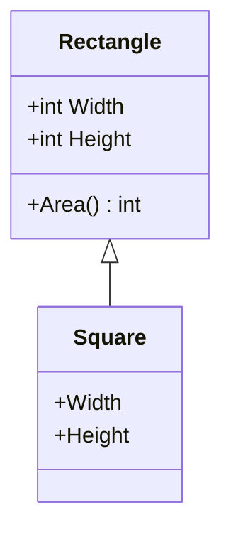

### Client Code

```csharp
void Resize(Rectangle r)
{
    r.Width = 5;
    r.Height = 10;
    Debug.Assert(r.Area() == 50);
}

Rectangle r = new Square(); //Square is-a Rectangle, so we can assign it to Rectangle
Resize(r); //here we are passing a Square instance as a Rectangle to Resize
```

This assertion **fails** for `Square`: `Debug.Assert(r.Area() == 50);` 

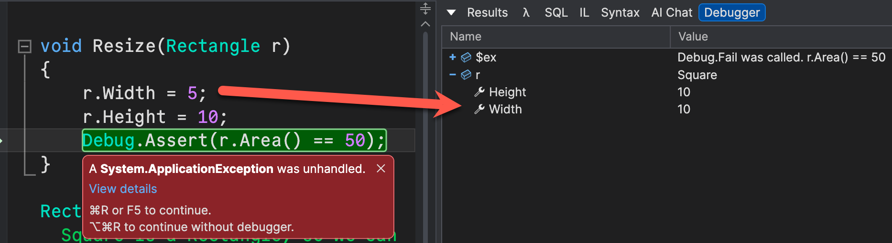

---

## Why the Rectangle Example Fails

The base class contract implies:

- Width and height are independent
- Setting one does not affect the other

**`Square` violates that contract**.

> **The subtype changes the meaning of operations.**

Inheritance was legal.<br>Substitution was not.

---

## A Corrected Design

The fix is **not** clever overriding.

The fix is modeling that **preserves substitutability**.

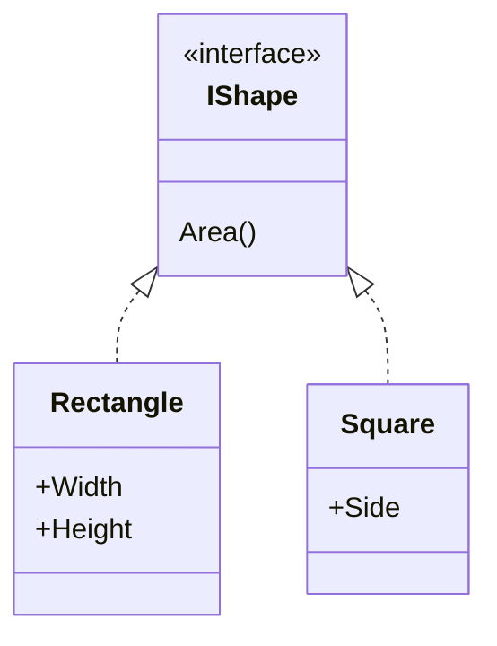

Now:
- No false promises
- No broken assumptions
- Polymorphism is safe again
- All implementations of `IShape` implement their own `Area()` method

> Key idea: Be **very careful** applying DRY in a base class. You must make sure it preserves substitutability across all subtypes. 

> Another approach is [forbidding inheritance](#prevent-lsp-unsafe-subtypes-by-forbidding-inheritance). See the details in Appendix 1 on `sealed \ final` classes.

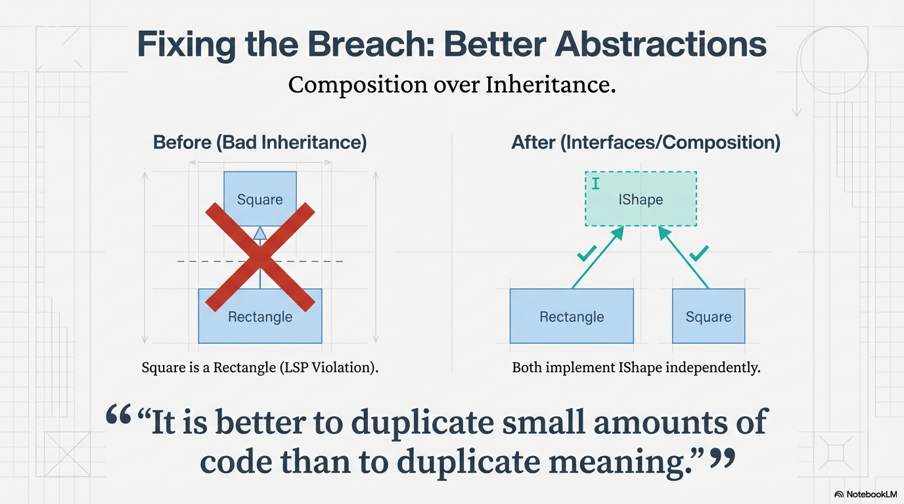

---

## **Bait-and-Switch as an LSP Metaphor**

In a bait-and-switch:

- The seller **advertises** one thing, and

- The buyer **forms plans** based on that promise, and

- The seller **delivers something else**, and

- When challenged, the defense is:

  > “It’s basically the same thing.”

#### The Legal Expert's View of LSP

An attorney would call this **misrepresentation**.

- One party makes a **representation of fact**, and
- The other party **reasonably relies** on it, and
- The reality **does not match the representation**, and
- Harm occurs because of that reliance.

---

## Behavioral Subtyping Rules

A subtype must:

1. **Not strengthen preconditions**
2. **Not weaken postconditions**
3. **Preserve invariants**

These rules define behavioral compatibility.

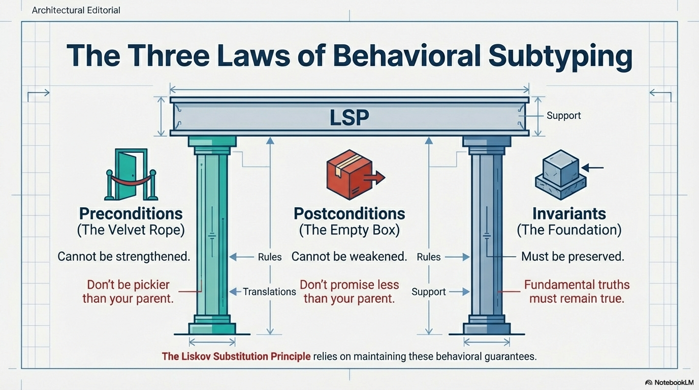

---

## Preconditions, Postconditions, and Invariants

### Preconditions
What must be true *before* a method runs

### Postconditions
What is guaranteed *after* the method completes

### Invariants
What must *always* remain true

### Example

```c#
class BankAccount
{
    // Invariant: Balance >= 0
    public decimal Balance { get; protected set; }

    // Precondition: amount > 0 && amount <= Balance
    // Postcondition: Balance is reduced by amount
    public virtual void Withdraw(decimal amount)
    {
        if (amount <= 0 || amount > Balance)
            throw new InvalidOperationException();

        Balance -= amount;
    }
}
```

- **Precondition**

  A subtype must not require *more* (e.g., “only allow withdrawals on weekdays”).

- **Postcondition**

  A subtype must not guarantee *less* (e.g., “withdraw may or may not change the balance”).

- **Invariant**

  A subtype must preserve Balance >= 0.

---

## Strengthening Preconditions (Bad)

```csharp
public class FileLogger
{
    public virtual void Log(string? message)
    {
        // accepts any string
    }
}

public class SecureFileLogger : FileLogger
{
    public override void Log(string? message)
    {
        if (string.IsNullOrWhiteSpace(message))
            throw new ArgumentException();

        base.Log(message);
    }
}
```

`FileLogger.Log` accepts any value, including nulls.

`SecureFileLogger.Log` strengthens the precondition by throwing when a null string is passed, even though the method signature explicitly permits null values.

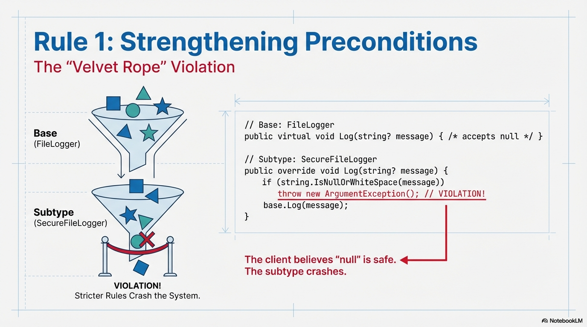

---

## Weakening Postconditions (Bad)

```csharp
public class OrderProcessor
{
    // Contract:
    // - Processes the order
    // - Persists the result
    // - Returns true on success
    public virtual bool Process(Order order)
    {
        Save(order);
        return true;
    }

    protected void Save(Order order)
    {
        // persist order
    }
}

public class TestOrderProcessor : OrderProcessor
{
    public override bool Process(Order order)
    {
        // intentionally skips persistence
        return true;
    }
}
```

The violation is *not* that the subtype behaves differently.

The violation is that the base type trained clients to rely on a guarantee that the subtype does not honor.

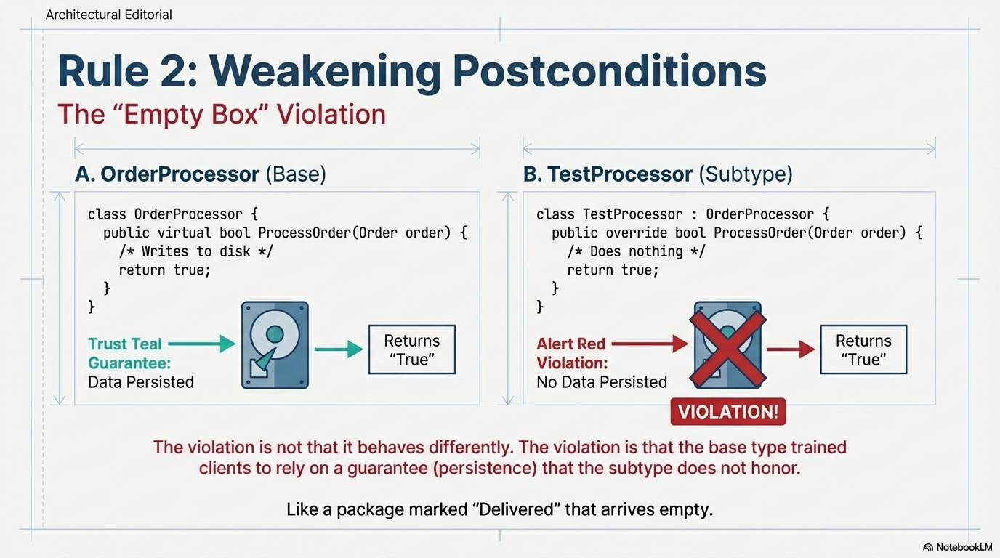

---

## Exception-Based LSP Violations

Throwing **new exceptions** from overrides is often an LSP violation.

> If base code does not expect an exception, neither should the subtype.

#### Base Class

```c#
public class UserRepository
{
    // Contract: returns null if user is not found
    public virtual User? FindById(Guid id)
    {
        return null; //return null on not found
    }
}
```

#### Subclass LSP Violation

```c#
public class SecureUserRepository : UserRepository
{
    // strengthens postconditions by introducing an exception when ID is not found
    public override User? FindById(Guid id)
    {
        throw new InvalidOperationException("User not found");
    }
}
```

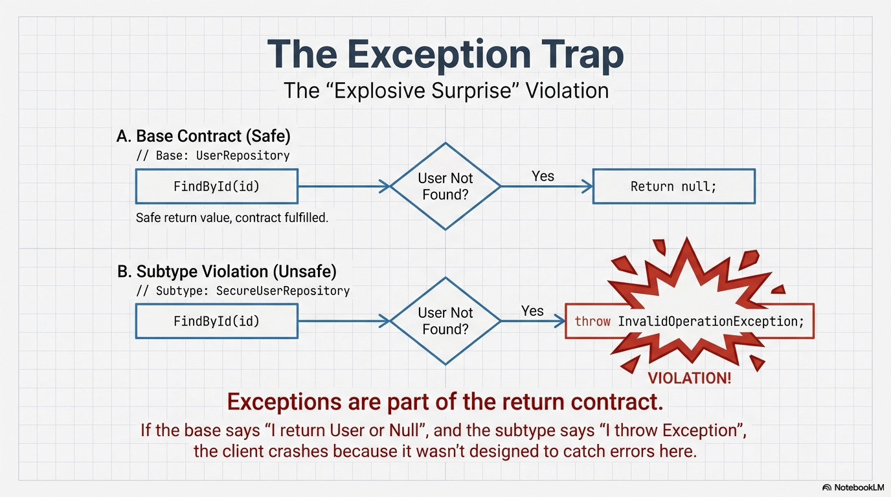

---

## LSP Across Abstraction Levels

LSP applies to:
- Classes
- Interfaces
- APIs
- Services
- Microservices

Any consumer must be able to substitute implementations safely.

> **In practice, preserving substitutability becomes increasingly difficult as the abstraction level rises.**

---

## LSP and Single Responsibility Principle

Single Responsibility makes LSP possible.

If a class has multiple responsibilities:
- Some subtypes satisfy one responsibility
- Others satisfy another
- No subtype satisfies all

Multiple responsibilities almost guarantee LSP violations.

---

## LSP and Open-Closed Principle

The Open-Closed Principle *depends* on LSP.

You cannot safely extend behavior if subtypes cannot be reliably substituted.

> **LSP is the safety guarantee that makes OCP viable.**

---

## Practical Heuristics for LSP

Ask these questions:

- Would I be surprised by this behavior?
- Does this subtype restrict valid inputs?
- Does it remove guarantees?
- Does client code need `if (x is SubType)`?

If yes, then LSP is likely violated.

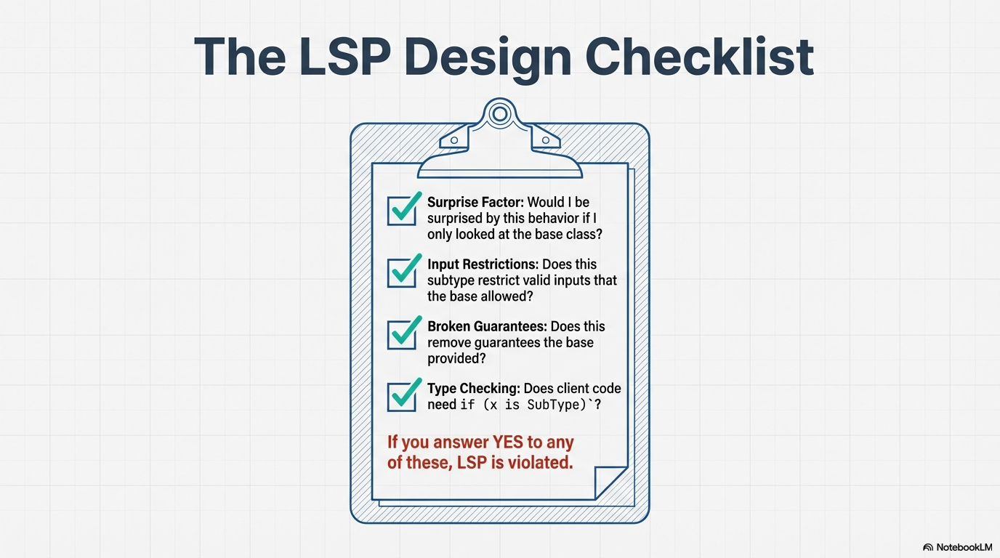

---

## Code Smells That Signal LSP Violations

- Overridden methods that throw

- Subtypes with unused methods

- Boolean flags in subclasses

- Client-side type checks

- “This works except when…”

- `NotImplementedException`

  > *Often* used when a subtype is forced to implement a method it cannot meaningfully support.  
  >
  > This signals that the subtype does not fully honor the semantic contract of the base type.
  >
  > If you see this in a code review, pay very careful attention!
  >
  > ```csharp
  > public interface IBird {
  >   void Walk();
  >   void Fly();
  > }
  > 
  > public interface IBird
  > {
  >     void Walk();
  >     void Fly();   // Contract implies: "all birds can fly"
  > }
  > 
  > public class Penguin : IBird
  > {
  >     public void Walk() { /* waddle */ }
  > 
  >     public void Fly()
  >     {
  >         // Smell: this type cannot honor the semantic contract implied by IBird
  >         throw new NotSupportedException("Penguins cannot fly.");
  >     }
  > }
  > 
  > // Penguin is not safe to substitute for IBird if clients rely on Fly().
  > // How do we properly fix this?
  > // ... The Interface Segregation Principle! 
  > // ... Coming up soon - the I in SOL[I]D.
  > ```

---

## Conclusion: Substitutability Is Trust

LSP is about **trust**.

When you depend on an abstraction:
- You trust its promises
- You assume consistency
- You rely on behavior, not type

Breaking LSP breaks that trust.

> **Good abstractions keep their promises.**


---

# APPENDIX 1

## LSP Video Overview

- [AI generated video overview of LSP by NotebookLM](06-liskov-substitution-principle-video-notebooklm.mp4)

## Semantic Promise Example

```c#
{
    public virtual OperationResult Save(Order order)
    {
        // Persists `order` to the repository’s backing store.
        // Returns Success on persistence; Failed(error) on failure.
    }
    
    public virtual Order? Get(Guid id)
    {
        // Retrieves a previously saved order, or null if not found.
        return null;
    }
}
```

Based on the class name and method contract (name, parameters, and return type), the semantic promise of calling `Save` successfully includes:
- The order is persisted (it “exists” in the repository after the call)
- A subsequent `Get(order.Id)` can retrieve it
- Side effects consistent with persistence (I/O, storage, etc.) occurred

> **Key idea:** These promises come from what clients reasonably infer from the API, not from reading the implementation.

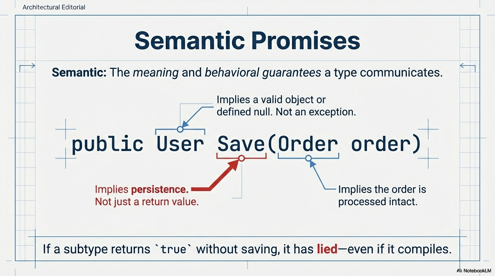

---

### Semantic Promise Violation

```c#
public class TestRepository : Repository
{
    public override OperationResult Save(Order order)
    {
        return OperationResult.Success();
    }
}
```

Why this violates the semantic promise:

- `TestRepository` is-a `Repository`. That means it must be usable anywhere a `Repository` is expected (LSP).
- In the base type, `Save(...)` = Success implies persistence semantics: the state of the repository changes such that a `Get` operation can later retrieve the saved order.
- This override returns `Success` without performing persistence (no state change, no side effects).
- So it keeps the syntax (same signature) but changes the meaning of “success.”

A client written against `Repository` can now break:

```
repo.Save(order);
var saved = repo.Get(order.Id); // may be null even though Save reported Success
```

The downstream effects of an LSP violation can lead to serious defects far from (and long after) their origin.

> This is an example of **temporal coupling**. Temporal coupling exists whenever one operation must precede another—an extremely common and often unavoidable requirement. When semantic promises are preserved, temporal coupling is *reliable*. **LSP violations make temporal coupling fragile**, causing later operations to fail even when earlier calls report success.
>
> **Temporal inconsistency** occurs when later operations contradict the success of earlier ones.

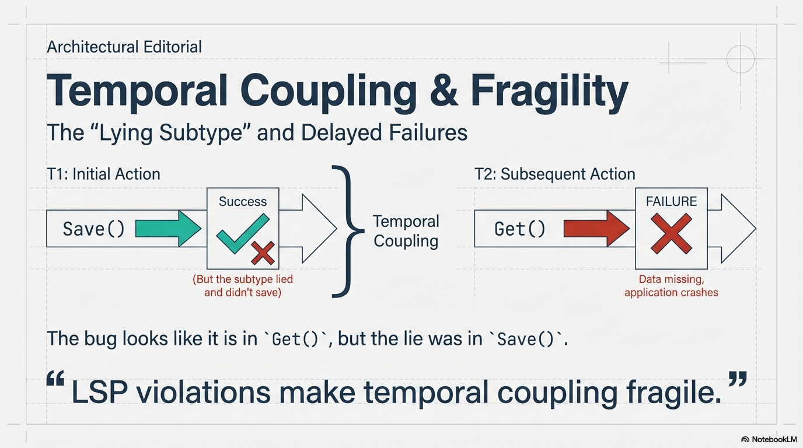

---

### Fixing the Semantic Promise Violation

#### Option A: Use an interface with an intentionally minimal contract

Instead of inheriting from a concrete class that implies persistence semantics, depend on an interface whose promises are explicit and narrow.

```c#
public interface IRepository
{
    OperationResult Save(Order order);
}

public class TestRepository : IRepository
{
    public OperationResult Save(Order order)
    {
        return OperationResult.Success();
    }
}
```

Why this fixes it:

- The test double no longer claims to be a concrete Repository with persistence semantics.

- It only promises what IRepository promises.

- If IRepository does not promise retrieval/persistence, returning Success can be valid in tests that don’t rely on those semantics.

> Important nuance: interfaces can have semantics. The win here is that the interface can define the right semantics for the seam—often narrower than a concrete Repository.

#### Option B: Use a fake that preserves semantics (in-memory persistence)

If your tests do rely on “save then get,” build a fake that honors those promises:

```c#
public class InMemoryRepository : Repository
{
    private readonly Dictionary<Guid, Order> _store = new();

    public override OperationResult Save(Order order)
    {
        _store[order.Id] = order;
        return OperationResult.Success();
    }
    
    public override Order? Get(Guid id)
        => _store.TryGetValue(id, out var order) ? order : null;
}
```

This keeps the base meaning intact, so it’s substitutable.

---

## Prevent LSP-Unsafe Subtypes by Forbidding Inheritance 

Sometimes the safest way to preserve the Liskov Substitution Principle (LSP) is to **forbid inheritance entirely**.

If a class represents a behavioral contract that must not be altered by subtypes, mark it as **non-inheritable**:

- **C#**: `sealed` — the class cannot be derived from  
- **Java**: `final` — the class cannot be extended  

This prevents “looks compatible but behaves differently” subtypes — such as the classic `Square : Rectangle` example.

---

### Why Sealing Helps LSP

LSP requires that **any subtype must be safely substitutable** for its base type.

But when a base class allows overriding, you implicitly permit future code to:

- Change semantics while keeping the same method signatures
- Add hidden invariants or coupling
- Break assumptions that clients reasonably rely on

By sealing the base class, you guarantee:

> The contract and behavior clients depend on cannot be overridden.

Substitution safety is preserved because **no subtypes can exist** that might violate the contract.

---

### C# Example: Seal `Rectangle` to Block `Square : Rectangle`

```csharp
public sealed class Rectangle
{
    public int Width { get; set; }
    public int Height { get; set; }

    public int Area() => Width * Height;
}
```

Now this is impossible:

```csharp
public class Square : Rectangle // Compile-time error
{
}
```

This is an intentional design decision, not a limitation.

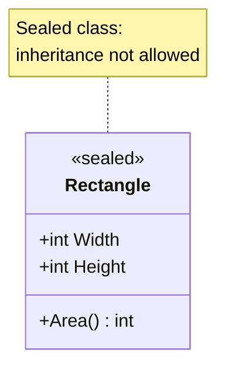

---

### When Sealing Is the Right Choice

Seal a class when:

- The type has **strong behavioral guarantees**
- Clients rely on **specific invariants**
- You cannot define a safe substitution story for all possible subtypes
- Variation should occur via **composition**, not inheritance

A useful rule of thumb:

> **If overriding would require restating the contract, inheritance is the wrong tool.**

---

### Tie-back to Rectangle / Square

[In this API, a `Rectangle` guarantees that `Width` and `Height` can be changed independently.](#classic-bad-example-rectangle--square)

Allowing inheritance would permit subtypes to silently violate that guarantee.

Sealing `Rectangle` is an explicit declaration:

> “Being a rectangle in this system includes behavioral guarantees we refuse to let subtypes weaken.”

### Additional Structural Strategies to Preserve Substitution

These small design choices significantly reduce the risk of LSP violations:

- **Avoid** **protected** **setters**

  protected setters allow subtypes to change state in ways the base class did not intend, often introducing hidden invariants. Prefer private setters or constructor-only initialization so state meaning cannot be reinterpreted by subclasses.

- **Prefer constructor initialization with preconditions**

  Validate invariants once, at construction time. Establishing guarantees early prevents subtypes from weakening them later through overridden behavior or delayed validation.

  ```csharp
  public class Discount
  {
      public decimal Percentage { get; }
  
      public Discount(decimal percentage)
      {
          if (percentage < 0 || percentage > 1)
              throw new ArgumentOutOfRangeException(nameof(percentage));
  
          Percentage = percentage;
      }
  }
  ```
  Validate each invariant at the *earliest* point where that invariant becomes knowable, and do it in the type that owns the invariant.

- **Make methods non-virtual by default**

  Treat virtual as an explicit extension point. Only allow overriding when variation is intentional and safe. Non-virtual methods preserve behavioral guarantees and prevent semantic drift across subtypes.

> **LSP is preserved not by clever overrides, but by limiting what can be overridden.**

## Liskov Substitution Principle Study Guide

### What LSP Is About
- LSP is about **substitutability**.
- If code works with a base type, it must work *correctly* with any subtype.
- LSP is fundamentally about **trust in abstractions**.

> If a subtype surprises client code, LSP is violated.

---

### Key Definition
- **Liskov Substitution Principle:** Subtypes must be usable anywhere their base type is expected *without altering correct program behavior*.

---

### Semantic Promises
- A **semantic promise** is what client code reasonably expects based on:
  - Type name
  - Method names
  - Parameters
  - Return values
- Clients rely on *meaning*, not implementation.

#### Examples of Semantic Promises
- `Save()` implies persistence
- `Withdraw()` implies balance reduction
- `Get()` implies retrievable state

> See Appendix 1 for a detailed [semantic promise example](#semantic-promise-example).

---

### LSP Is Not About
- Method signatures
- Inheritance syntax
- Code reuse
- Avoiding duplication

LSP *is* about:
- Behavior
- Guarantees
- Expectations over time

---

### Behavioral Subtyping Rules
A subtype must:

1. **Not strengthen preconditions**
2. **Not weaken postconditions**
3. **Preserve invariants**

These rules define **behavioral compatibility**.

---

### Preconditions
- What must be true *before* a method runs
- A subtype must not require *more* than the base type

#### Violation Example
- Base allows `null`
- Subtype throws when given `null`

---

### Postconditions
- What is guaranteed *after* a method completes
- A subtype must not guarantee *less* than the base type

#### Violation Example
- Base guarantees persistence
- Subtype returns success without persisting

---

### Invariants
- Conditions that must *always* hold true
- Subtypes must preserve all base type invariants

#### Example
- `Balance >= 0` must always remain true

---

### Classic LSP Violation: Rectangle / Square
- `Rectangle` implies independent width and height
- `Square` enforces equality between dimensions
- Substitution breaks client expectations

> Legal inheritance does not imply legal substitution.

---

### DRY vs LSP
- DRY encourages reuse
- Inheritance reuses **behavior and meaning**
- Reusing code via inheritance can accidentally reuse **invalid semantics**

> It is better to duplicate small amounts of code than to duplicate meaning.

---

### Exception-Based LSP Violations
- Introducing new exceptions in overrides often violates LSP
- Base code did not expect the exception
- Subtypes must not change failure behavior

---

### Temporal Coupling and LSP
- Temporal coupling exists when operations must occur in order
- LSP violations make temporal coupling **fragile**

#### Temporal Inconsistency
- An operation reports success
- Later operations contradict that success

> A broken promise now becomes a failure later.

---

### Interfaces and Test Doubles
- Mocking interfaces is usually LSP-safe
- Inheriting from concrete classes with strong semantics is risky
- Interfaces allow **narrower, explicit contracts**

---

### Practical Heuristics
Ask these questions:
- Would this behavior surprise a caller?
- Does the subtype restrict valid inputs?
- Does it remove guarantees?
- Does client code need type checks?

If yes → likely an LSP violation.

---

### Common Code Smells
- Overridden methods that throw unexpectedly
- `NotImplementedException`
- Subtypes with unused methods
- Client-side `if (x is SubType)` checks
- “This works except when…” comments

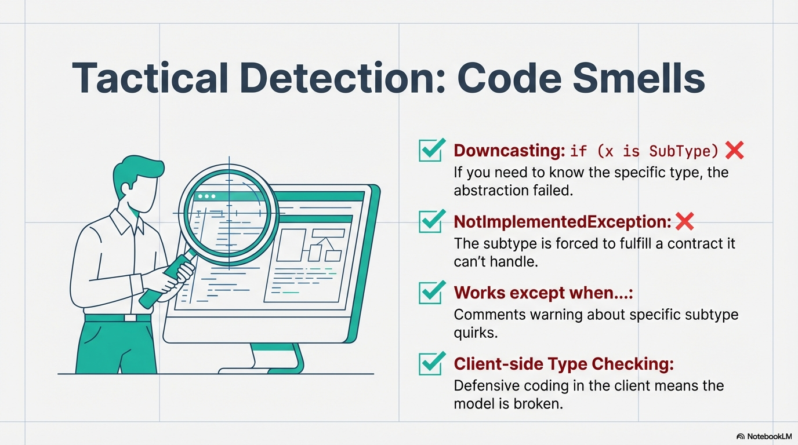

---

### Relationship to Other SOLID Principles
- **SRP** enables LSP
- **LSP** makes **OCP** safe
- Without LSP, polymorphism becomes dangerous

---

### Final Takeaway
- LSP is about **trust**
- Abstractions are contracts
- Substitutability is non-negotiable

> If a subtype cannot keep the promises of its base type, it should not inherit from it.

# Appendix 2

## Covariance and Contravariance

> This material will not appear on the exam. 

Covariance and contravariance are **type-system rules about safe substitution**, primarily involving generics, method parameters, and return types.

They are conceptually related to the Liskov Substitution Principle (LSP) because they exist to **protect client expectations**, but they operate at a different level:

- **LSP** is a *design principle* about **semantic promises and trust**
- **Variance** is a *compiler-enforced rule* about **type compatibility**

This topic is **commonly discussed in interviews**, but it is **out of scope for this course**.  
This appendix is included for awareness and vocabulary only.

---

### How Variance Relates to LSP

At a high level:

- LSP asks: *Can this implementation be substituted without surprising the client?*
- Variance asks: *Can this generic type be substituted without violating type safety?*

You can think of variance as **LSP encoded into the type system**, enforced mechanically rather than by design discipline.

---

### Informal Definitions

- **Covariance**  
  Allows substitution in the **same direction** as inheritance  
  (“a more specific type is acceptable”)

- **Contravariance**  
  Allows substitution in the **opposite direction** of inheritance  
  (“a more general type is acceptable”)

- **Invariance**  
  No substitution allowed (the default for most mutable types)

---

### Simple Type Hierarchy Used in Examples

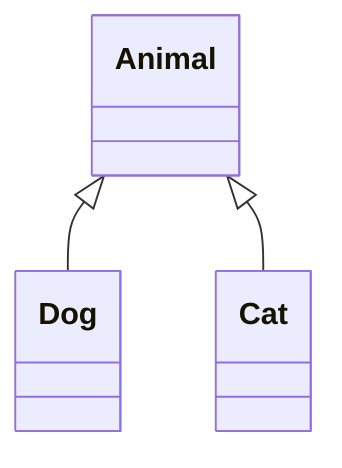

---

### Covariance (Values Returned to the Client)

Covariance is safe when a type is **produced** (returned) but not consumed.

#### Intuition

> If a client expects an `Animal`, returning a `Dog` does not violate the promise.

#### C# Example (Covariant Interface)

```csharp
public interface IReadOnlyBox<out T>
{
    T Get();
}
```

Usage:

```csharp
IReadOnlyBox<Dog> dogs = ...
IReadOnlyBox<Animal> animals = dogs; // Safe
```

Why this is safe:
- The client relies only on receiving an `Animal`
- Receiving a `Dog` preserves that semantic promise

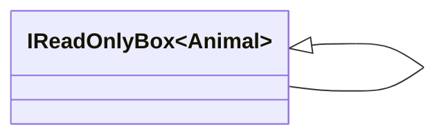

---

### Contravariance (Values Supplied by the Client)

Contravariance is safe when a type is **consumed** (input) but not produced.

#### Intuition

> If you can handle any `Animal`, you can certainly handle a `Dog`.

#### C# Example (Contravariant Interface)

```csharp
public interface IHandler<in T>
{
    void Handle(T item);
}
```

Usage:

```csharp
IHandler<Animal> animalHandler = ...
IHandler<Dog> dogHandler = animalHandler; // Safe
```

Why this is safe:
- The client will only pass `Dog`
- The handler already accepts all `Animal` instances

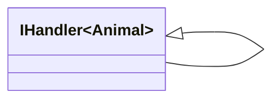

(Note the reversed direction compared to covariance.)

---

### Common Misconceptions (Interview Favorites)

#### “All collections should be covariant”
False. **Mutable collections are invariant**.

Allowing covariance on mutable collections would permit semantic contradictions:

```csharp
List<Dog> dogs = new();
List<Animal> animals = dogs;
animals.Add(new Cat()); // Violates the original promise
```

This would break both **type safety** and **client expectations**, so languages forbid it.

---

#### “Covariance and contravariance are design principles”
They are not.

- LSP is a **design responsibility**
- Variance is a **language feature**

Variance prevents some substitution errors, but it cannot express semantic promises such as:
- persistence
- ordering
- side effects
- invariants over time

---

#### “If it compiles, LSP is satisfied”
False.

Variance only ensures **type correctness**.

Many LSP violations:
- Compile cleanly
- Fail at runtime
- Appear far from their source

The Rectangle / Square example compiles perfectly — and still violates LSP.

---

### Why This Appears in Interviews

Interviewers like variance questions because they:
- Test understanding of type systems
- Have precise rules with sharp edges
- Quickly reveal shallow vs deep knowledge

Common prompts include:
- “Why is `IEnumerable<T>` covariant?”
- “Why are method parameters contravariant?”
- “Why are mutable collections invariant?”

These questions assess **language mechanics**, not OO design judgment.

---

### Why This Course Does Not Go Deeper

This course focuses on:
- Semantic promises
- Behavioral substitutability
- Trustworthy abstractions

Variance is:
- Language-specific
- Compiler-enforced
- Rarely a conscious design decision

Awareness is sufficient for our goals.

---

### Key Takeaway

- **Variance** protects *type safety*
- **LSP** protects *semantic trust*
- Both exist to prevent surprise
- Only LSP is enforced by the designer

> **The compiler can enforce variance. Only design can enforce LSP.**
