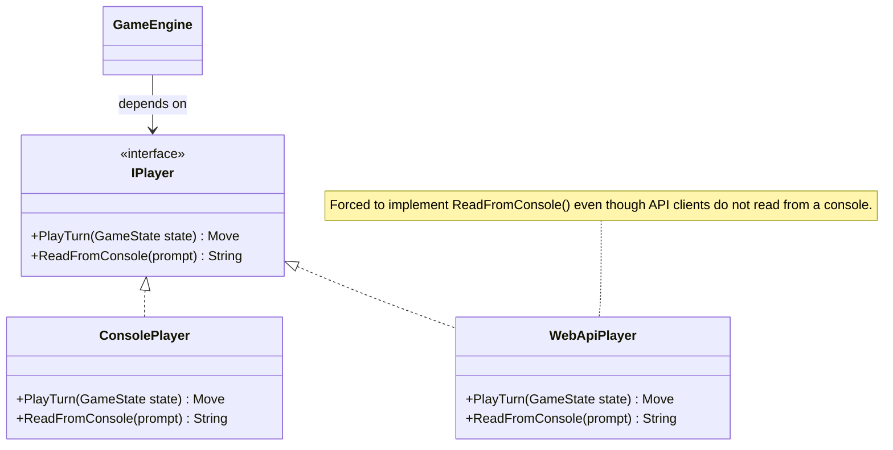
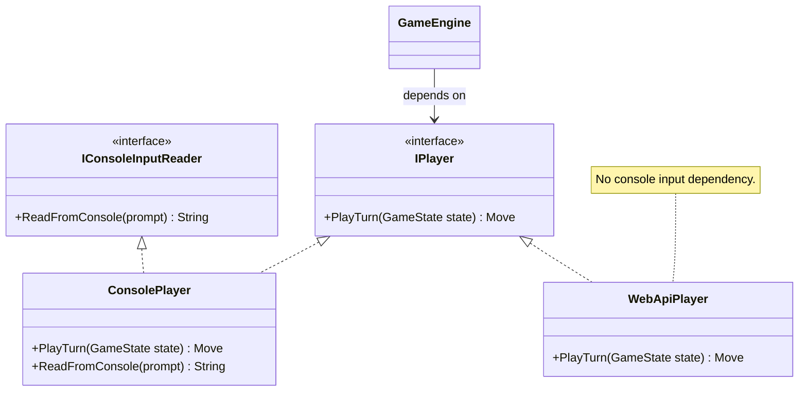
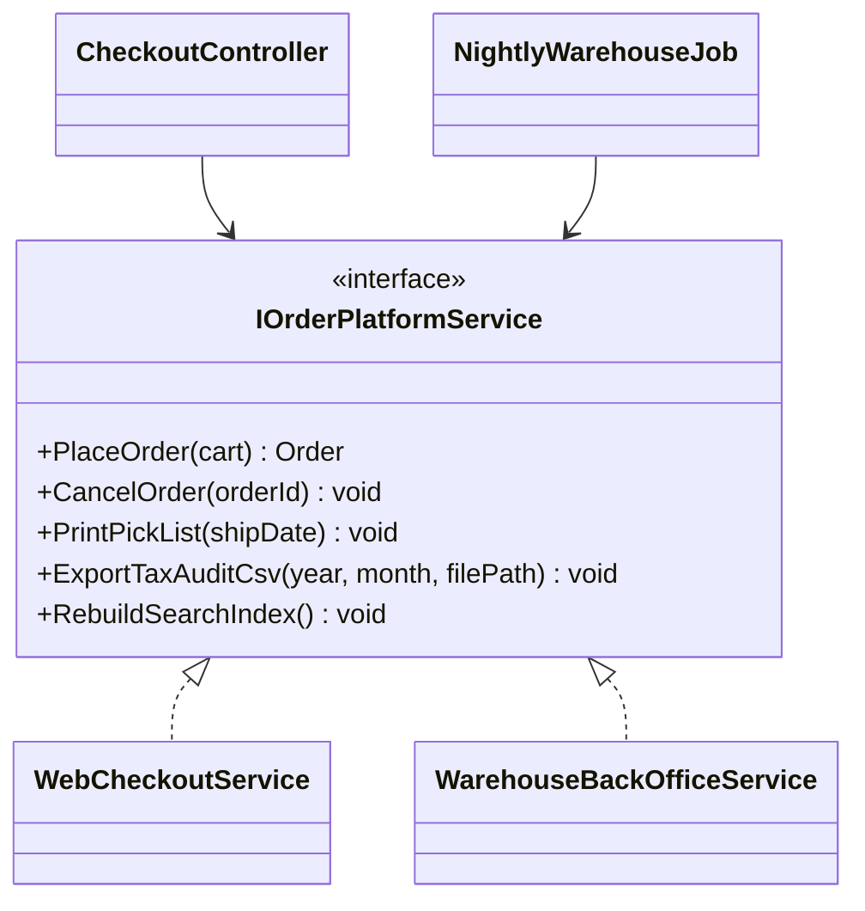
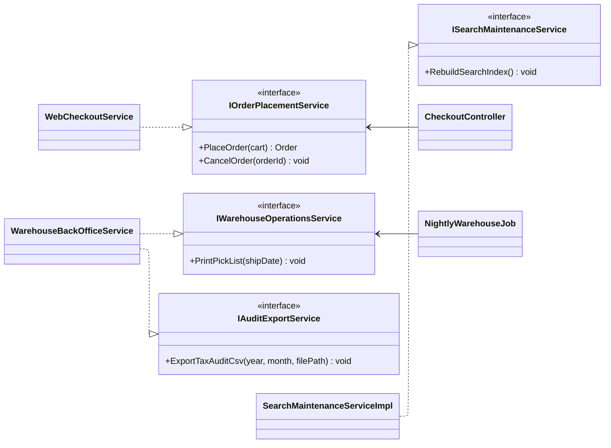
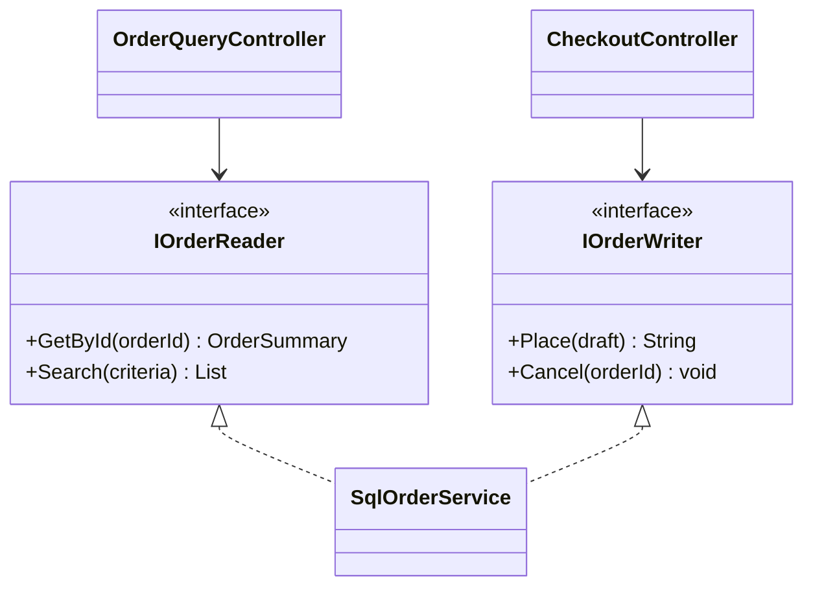
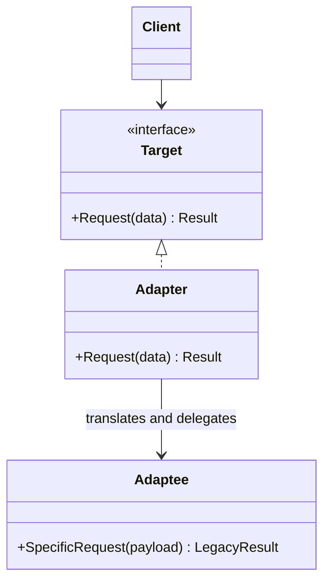
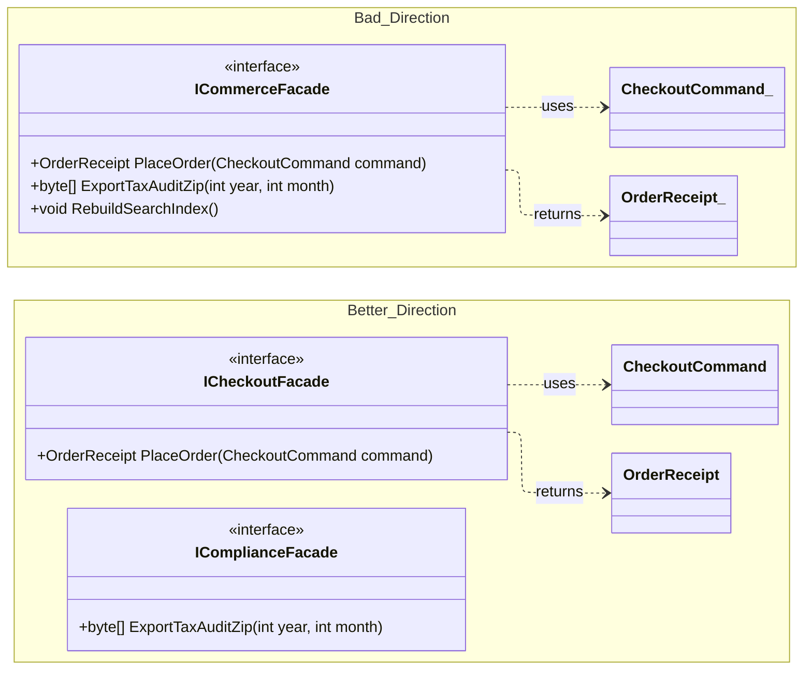
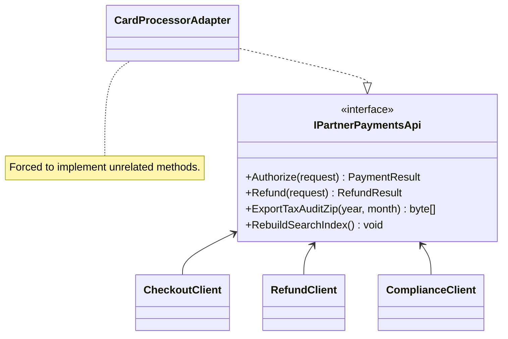
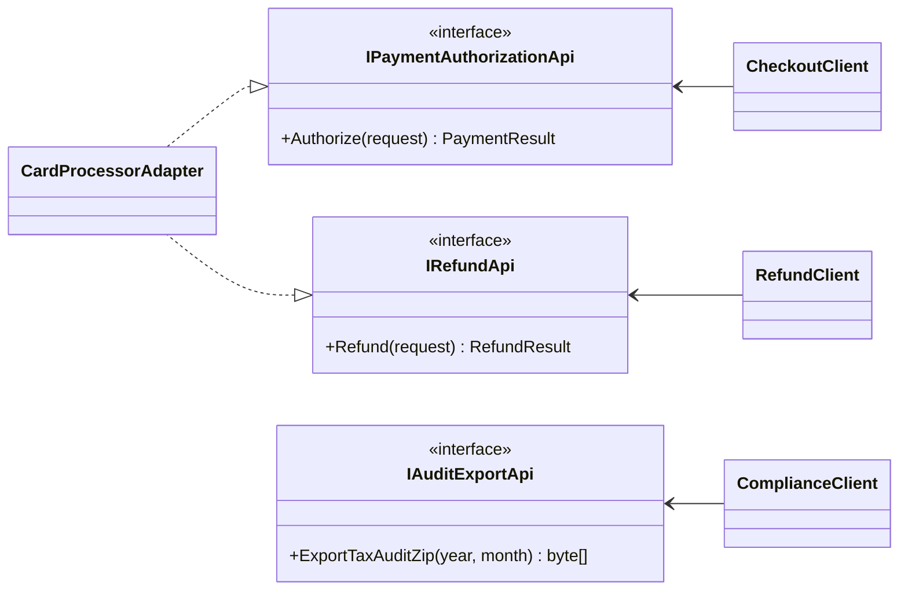
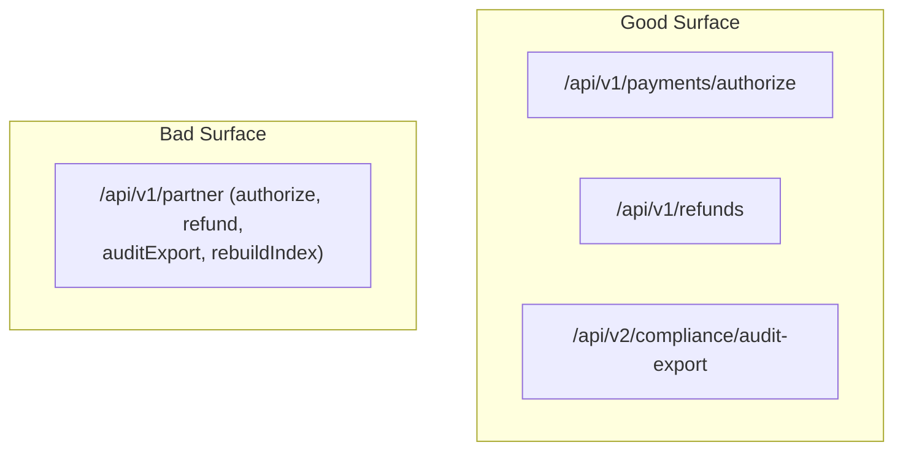

# The Interface Segregation Principle (ISP)

> The **I** in SOL**I**D...

[PowerPoint Presentation](07-interface-segregation-principle.pptx) [[pdf version](07-interface-segregation-principle.pdf)]

## 1. What Is ISP?

### Canonical Definition (Robert C. Martin)

> "Clients should not be forced to depend upon interfaces that they do not use."
> - Robert C. Martin

### An Absurd Example 

> ... that happens regularly in software design, thus the need for ISP.


### Precise Technical Interpretation

In practical OO design terms, ISP means this:

- A client should depend only on operations it actually needs.
- If multiple client groups use disjoint subsets of methods, the abstraction is likely too broad.
- Broad interfaces couple unrelated change axes, increasing recompilation, retesting, and regression risk.
- Interface design should follow usage boundaries, not implementation convenience.



### Friendly Explanation

If one interface tries to represent too many jobs, every class and every client pays the price.
A better design is to expose focused contracts so each client sees a small, relevant surface.

An ISP-compliant version of the same player scenario separates gameplay from console-only input:



```csharp
// C#
public interface IPlayer
{
    Move PlayTurn(GameState state);
}

public interface IConsoleInputReader
{
    string ReadFromConsole(string prompt);
}

public sealed class ConsolePlayer : IPlayer, IConsoleInputReader
{
    public Move PlayTurn(GameState state) => new Move();
    public string ReadFromConsole(string prompt) => Console.ReadLine() ?? string.Empty;
}

public sealed class WebApiPlayer : IPlayer
{
    public Move PlayTurn(GameState state) => new Move();
}
```

### Real-World Analogies: Everyday and Safety-Critical

#### Hotel Remote (Everyday Friction)

Imagine a hotel TV remote with dozens of buttons for features not available in that room: projector mode, multi-zone audio, DVR controls, and paid streaming controls that are disabled.

- Guests still see all buttons.
- Guests press unsupported buttons and get errors or no response.
- Small control changes become risky because the same oversized remote is reused everywhere.

This is the same shape of problem as an interface that forces clients to depend on methods they do not need.

#### Air Inter Flight 148 (Safety-Critical Risk)

Air Inter Flight 148 is often cited in UX safety discussions because mode/representation ambiguity in a high-workload cockpit context increased the chance of operator error. The accident involved multiple contributing factors; the ISP-relevant lesson is about interface clarity under pressure.

- A single control surface mixed semantically different operational modes.
- Under stress, ambiguous mode/value interpretation increases cognitive load and error likelihood.
- In safety-critical contexts, poor interface segregation can materially increase operational risk.

Reference: [Good UX / Bad UX - Air Inter Flight 148 Example](https://www.adgcreative.net/resources/good-ux-bad-ux/)


### Why ISP Matters in Real Systems

In enterprise systems, fat interfaces create avoidable operational risk:

- Runtime failures from `NotImplementedException` and `UnsupportedOperationException`
- Fragile dependency graphs where a change for Team A breaks Team B
- Clients accidentally calling methods outside their concern
- Bloated tests because each mock must satisfy irrelevant methods

ISP reduces these risks by keeping contracts cohesive and client-specific.

### Table of Contents

- [1. What Is ISP?](#1-what-is-isp)
- [2. A Bad Example to a Refactored Good Example](#2-a-bad-example-to-a-refactored-good-example)
- [3. Relationship to Other SOLID Principles](#3-relationship-to-other-solid-principles)
- [4. ISP and Ousterhout](#4-isp-and-ousterhout)
- [5. Practical Application](#5-practical-application)
- [6. Identifying the Need for Refactoring](#6-identifying-the-need-for-refactoring)
- [7. Interface Naming Conventions](#7-interface-naming-conventions)
- [8. Adapter Pattern](#8-adapter-pattern)
- [9. Facade Pattern](#9-facade-pattern)
- [10. Real-World Summary](#10-real-world-summary)
- [11. Interface Segregation Principle Study Guide](#11-interface-segregation-principle-study-guide)
- [Appendix 1: Public API Versioning and ISP](#appendix-1-public-api-versioning-and-isp)

## 2. A Bad Example to a Refactored Good Example

### Scenario: Enterprise Order Platform

A single interface was created for convenience, then reused by checkout, warehouse, compliance, and search operations.

### Before: ISP Violation (Fat Interface)

```csharp
// C#
public interface IOrderPlatformService
{
    Order PlaceOrder(Cart cart);
    void CancelOrder(string orderId);
    void PrintPickList(DateOnly shipDate);
    void ExportTaxAuditCsv(int year, int month, string filePath);
    void RebuildSearchIndex();
}

public sealed class WebCheckoutService : IOrderPlatformService
{
    public Order PlaceOrder(Cart cart)
    {
        // Checkout workflow
        return new Order();
    }

    public void CancelOrder(string orderId)
    {
        // Checkout cancellation
    }

    public void PrintPickList(DateOnly shipDate)
        => throw new NotImplementedException("Checkout does not own warehouse pick lists.");

    public void ExportTaxAuditCsv(int year, int month, string filePath)
        => throw new NotImplementedException("Checkout does not own compliance export.");

    public void RebuildSearchIndex()
        => throw new NotImplementedException("Checkout does not own search indexing.");
}

public sealed class NightlyWarehouseJob
{
    private readonly IOrderPlatformService _service;

    public NightlyWarehouseJob(IOrderPlatformService service)
    {
        _service = service;
    }

    public void Run(DateOnly shipDate)
    {
        // Compiles for any IOrderPlatformService; fails at runtime for WebCheckoutService.
        _service.PrintPickList(shipDate);
    }
}
```



### Why This Violates ISP

- `WebCheckoutService` is forced to implement unrelated methods.
- Clients depend on operations they should never call.
- Dependency injection can accidentally wire a type that compiles but fails at runtime.
- Small interface changes trigger broad ripple effects across unrelated clients.

### After: Segregated Interfaces

```csharp
// C#
public interface IOrderPlacementService
{
    Order PlaceOrder(Cart cart);
    void CancelOrder(string orderId);
}

public interface IWarehouseOperationsService
{
    void PrintPickList(DateOnly shipDate);
}

public interface IAuditExportService
{
    void ExportTaxAuditCsv(int year, int month, string filePath);
}

public interface ISearchMaintenanceService
{
    void RebuildSearchIndex();
}

public sealed class WebCheckoutService : IOrderPlacementService
{
    public Order PlaceOrder(Cart cart) => new Order();
    public void CancelOrder(string orderId) { }
}

public sealed class WarehouseBackOfficeService : IWarehouseOperationsService, IAuditExportService
{
    public void PrintPickList(DateOnly shipDate) { }
    public void ExportTaxAuditCsv(int year, int month, string filePath) { }
}

public sealed class SearchMaintenanceService : ISearchMaintenanceService
{
    public void RebuildSearchIndex() { }
}

public sealed class NightlyWarehouseJob
{
    private readonly IWarehouseOperationsService _warehouse;

    public NightlyWarehouseJob(IWarehouseOperationsService warehouse)
    {
        _warehouse = warehouse;
    }

    public void Run(DateOnly shipDate)
    {
        _warehouse.PrintPickList(shipDate);
    }
}
```



### What Improved

- No forced methods, no placeholder exceptions.
- Each client compiles against a stable, relevant contract.
- Changes are localized to the interface/client pair that actually needs them.
- Test doubles are smaller and clearer.

## 3. Relationship to Other SOLID Principles

### ISP and SRP

SRP is about cohesive responsibilities in modules.
ISP applies the same idea to public contracts.
Boundary clarification: SRP asks what independent reasons-to-change exist inside a module; ISP asks what each client is forced to depend on at the module boundary.

If one interface serves multiple actors, it usually reflects mixed responsibilities.

```csharp
// Mixed actors: Checkout + Compliance, C#
public interface IInvoiceService
{
    Invoice Create(CheckoutRequest request);
    void ExportTaxReport(int year, int month);
}
```

Split by actor pressure:

```csharp
// C#
public interface IInvoiceCreationService
{
    Invoice Create(CheckoutRequest request);
}

public interface ITaxReportExportService
{
    void ExportTaxReport(int year, int month);
}
```

### ISP and OCP

OCP depends on stable abstractions.
Fat interfaces are unstable because unrelated client needs keep changing them.

With ISP, you extend behavior by adding new focused contracts instead of modifying broad ones.

```java
// Java
public interface PaymentAuthorizationService {
    Authorization authorize(PaymentRequest request);
}

public interface PaymentRefundService {
    RefundReceipt refund(String paymentId);
}

// Adding chargeback handling can be an extension:
public interface PaymentChargebackService {
    void openChargeback(String paymentId, String reason);
}
```

Existing clients of `PaymentAuthorizationService` remain untouched.

### ISP and LSP

LSP requires safe substitution.
When a subtype throws on valid interface methods, substitution breaks.

```csharp
public interface IFileExporter
{
    void ExportCsv(string path);
    void ExportPdf(string path);
}

public sealed class CsvOnlyExporter : IFileExporter
{
    public void ExportCsv(string path) { }
    public void ExportPdf(string path) => throw new NotImplementedException();
}
```

This is both an ISP and LSP problem:

- ISP: interface is too broad for some clients.
- LSP: subtype cannot honor full contract semantics.


## 4. ISP and Ousterhout

### Deep Modules

Ousterhout argues for deep modules: simple interface, rich hidden implementation.
ISP helps by preventing broad, shallow "do everything" contracts.

A deep module exposes a focused interface like `IOrderPlacementService` and hides complex inventory checks, fraud rules, and retry logic internally.

### Information Hiding

Fat interfaces often leak internal workflow stages and implementation details.
ISP pushes us to hide internals and expose only what a client must know.

Bad surface (leaky):

- `validateInventoryStep()`
- `reserveInventoryStep()`
- `finalizePaymentStep()`

Better surface (hidden internals):

- `placeOrder(command)`

### Interface Design Quality

For Ousterhout, good interface design reduces complexity at call sites.
ISP is a concrete mechanism for this: remove irrelevant methods from each client-facing contract.

### Cognitive Load

A 20-method interface increases mental overhead for every reader.
A 2-4 method interface aligned to one use case lowers cognitive load, code review effort, and onboarding time.


## 5. Practical Application

### Heuristics for Cohesive Interfaces

- Group methods by client use case, not by data model.
- Prefer verb-focused contracts (`authorize`, `refund`, `capture`) over god-service contracts (`processEverything`).
- If methods are usually mocked together and changed together, they likely belong together.
- If two method groups have independent release cadence, split them.
- Testability heuristic: if mocks or fakes require many irrelevant stubs, the interface is likely too broad.

### When to Split an Interface

Split when you see:

- Different client groups calling disjoint method subsets
- Frequent `NotImplementedException` or empty method bodies
- Independent change requests touching different method clusters
- Repeated client-side type checks before method calls

### When Not to Split

Do not split just to make interfaces tiny.
Keep methods together when:

- The same clients always use them together
- They represent one cohesive capability
- They evolve together under one change actor

### Tradeoffs

- More interfaces can increase navigation and DI wiring complexity.
- Excessive splitting can create shallow abstractions.
- Too little splitting creates unstable broad contracts.

The target is cohesive boundaries, not minimal method counts.

### Practical Examples

```csharp
// C#
// Cohesive split: read and write concerns have different clients and scaling needs.
public interface IOrderReader
{
    OrderSummary GetById(string orderId);
    IReadOnlyList<OrderSummary> Search(OrderSearchCriteria criteria);
}

public interface IOrderWriter
{
    string Place(OrderDraft draft);
    void Cancel(string orderId);
}

public sealed class SqlOrderService : IOrderReader, IOrderWriter
{
    public OrderSummary GetById(string orderId) => new OrderSummary();
    public IReadOnlyList<OrderSummary> Search(OrderSearchCriteria criteria) => new List<OrderSummary>();
    public string Place(OrderDraft draft) => "ORD-1001";
    public void Cancel(string orderId) { }
}
```



## 6. Identifying the Need for Refactoring

### Detection Signals

| Signal | Typical symptom | Why it points to ISP problems |
|---|---|---|
| `NotImplementedException` / `UnsupportedOperationException` | Subtype cannot support part of the interface | Contract is too broad for at least one implementation |
| Empty overrides | Method required by inheritance/interface but does nothing | Client-facing surface includes irrelevant behavior |
| Boolean flags in methods | `process(order, includeTaxExport, rebuildIndex)` | One method is acting like multiple operations |
| Client-side type checks | `if (service is WarehouseService)` | Clients are compensating for bad abstraction boundaries |
| Unused methods | Teams depend on methods they never call | Interface is larger than client needs |
| Ripple effects from small changes | Minor method update forces many unrelated changes | Unrelated clients are coupled to the same contract |
| High-friction mocks/fakes | Test doubles require many irrelevant setups | Interface likely violates client-specific cohesion |

### Client-Method Matrix Diagnostic

A quick ISP diagnostic is to map clients (rows) against interface methods (columns). If the matrix is sparse, the interface is likely too broad and should be segregated.

| Client \\ Method | `Authorize()` | `Refund()` | `ExportTaxAuditZip()` | `RebuildSearchIndex()` |
|---|---:|---:|---:|---:|
| Checkout UI Client | X |  |  |  |
| Customer Support Client |  | X |  |  |
| Compliance Batch Job |  |  | X |  |
| Search Ops Job |  |  |  | X |

Interpretation:

- Most cells are empty, which indicates disjoint usage.
- Different clients depend on different slices of behavior.
- This is strong evidence for ISP-driven interface segregation.

### Common Anti-Pattern Names

In reviews, you will commonly hear these terms:

- `fat interface`: a contract with unrelated operations serving different clients.<br>Design/refactoring goal: `narrow interface` or `focused interface`.
- `god interface`: an extreme fat interface that centralizes many subsystem capabilities.<br>Design/refactoring goal: `capability interface` or `role interface`.
- `interface pollution`: adding methods for one client that all clients must now depend on.<br>Design/refactoring goal: `clean contract` or `bounded contract`.
- `unsupported operation smell`: implementations throwing unsupported exceptions to satisfy broad contracts.<br>Design/refactoring goal: `total contract` or `honest interface`.

### Benefits of Refactoring Toward ISP

- Reduced blast radius for changes
- Stronger substitutability and safer polymorphism
- Smaller, clearer tests and mocks
- Better team autonomy around specific interfaces
- Lower cognitive load per client and per code review

## 7. Interface Naming Conventions

### Why Naming Quality Matters for Interfaces

Interface names are consumed far more often than they are authored.
If names are vague or overloaded, every reader pays the tax repeatedly in design reviews, maintenance, and onboarding.

Good interface naming should optimize for:

- cognitive scan speed (`what is this for?`)
- long-lived intent (`will this still read clearly in two years?`)
- discoverability (`can a new developer find this quickly by role/capability?`)
- change isolation (clear names reduce accidental cross-domain coupling)

### Naming Guidelines for Interface Types

- Name by role or capability, not storage or technology detail.
- Prefer cohesive nouns that match client language (`IPaymentAuthorizer`, `IOrderReader`).
- Avoid generic or inflated names (`IManager`, `IService`, `IProcessor`, `ICommonUtils`).
- Split names when responsibilities diverge (`IShipmentScheduler` and `IShipmentTracker`, not `IShipmentService`).
- Keep prefixes/suffixes consistent with team conventions; inconsistency destroys searchability.

### Method Naming Guidelines

- Use verb + domain object (`AuthorizePayment`, `ScheduleShipment`, `ExportTaxAuditZip`).
- Keep names intention-revealing: business outcome first, implementation detail omitted.
- Avoid ambiguous verbs (`Handle`, `Process`, `DoWork`) unless paired with precise domain context.
- Keep side-effecting commands and pure queries clearly distinguishable.
- Reserve abbreviations for universally recognized domain terms.

### Signature Design: Narrow Parameters, Wide Return Interfaces

For interface ergonomics and long-term flexibility, design method signatures conservatively:

- Narrow parameters: require only the minimum capability needed by the method.
- Wide return interfaces: return stable abstractions that avoid over-committing to concrete implementation details.
- [Generally follow Postel's Law: be liberal in what you accept and conservative in what you return.](https://martinfowler.com/bliki/TolerantReader.html)

```csharp
// Bad: over-specific parameter and over-committed concrete return type.
public interface IOrderSearchService
{
    //Accepts a materialized mutable list (should SearchOrders be able)
    //to mutate the inbound reference type? The method name suggests 
    //it should not...) and returns a mutable list.
    List<OrderSummary> SearchOrders(List<string> orderIds);
}

// Better: narrow required capability in, wide interface out.
public interface IOrderSearchService
{
    //Accepts a narrow interface (IEnumerable is just an iterator contract and
    //may even represent a lazy-loaded collection not yet in memory)
    //and returns an immutable interface.
    IReadOnlyList<OrderSummary> SearchOrders(IEnumerable<string> orderIds);
}
```

### Quick Naming Smell Checklist

- Could another team member infer the interface purpose from its name alone?
- Does each method name describe business intent without reading the implementation?
- Are unrelated capabilities packed behind one broad name?
- Does the signature force clients to depend on concrete types they do not need?
- Would this name still make sense after one major feature expansion?

Naming is architecture. In interface-first design, names define cognitive boundaries as much as method sets do.

## 8. Adapter Pattern

### Canonical UML



### Why It Exists and When to Use It

Use Adapter when a client needs one interface but you must integrate a class with a different, incompatible API.

Common cases:

- Third-party SDKs with awkward method shapes
- Legacy APIs you cannot change
- Vendor migration where old and new APIs must coexist
- Integrating an incompatible implementation into an existing Strategy or Decorator ecosystem without modifying client code

### C# Example

```csharp
public interface IShippingLabelGateway
{
    ShippingLabel CreateLabel(ShipmentRequest request);
}

public sealed class LegacyCarrierApi
{
    public string CreateShipment(string xmlPayload)
    {
        return "TRACK-1001";
    }
}

public sealed class LegacyCarrierAdapter : IShippingLabelGateway
{
    private readonly LegacyCarrierApi _legacy;

    public LegacyCarrierAdapter(LegacyCarrierApi legacy)
    {
        _legacy = legacy;
    }

    public ShippingLabel CreateLabel(ShipmentRequest request)
    {
        string xmlPayload = LegacyXmlSerializer.ToXml(request);
        string trackingNumber = _legacy.CreateShipment(xmlPayload);
        return new ShippingLabel(trackingNumber);
    }
}
```

### Java Example

```java
public interface ShippingLabelGateway {
    ShippingLabel createLabel(ShipmentRequest request);
}

public final class LegacyCarrierApi {
    public String createShipment(String xmlPayload) {
        return "TRACK-1001";
    }
}

public final class LegacyCarrierAdapter implements ShippingLabelGateway {
    private final LegacyCarrierApi legacy;

    public LegacyCarrierAdapter(LegacyCarrierApi legacy) {
        this.legacy = legacy;
    }

    @Override
    public ShippingLabel createLabel(ShipmentRequest request) {
        String xmlPayload = LegacyXmlSerializer.toXml(request);
        String trackingNumber = legacy.createShipment(xmlPayload);
        return new ShippingLabel(trackingNumber);
    }
}
```

### Adapter and ISP

Adapter helps enforce ISP by presenting clients with a narrow, client-specific `Target` interface.
The client avoids depending on the larger or mismatched legacy API.

### Adapter with Strategy and Decorator

Adapter is commonly combined with Strategy and Decorator when you already have interchangeable types behind a stable interface.

- Strategy context continues to depend on the existing strategy interface.
- Decorator chain continues to wrap the same component interface.
- Adapter translates an incompatible implementation into that same interface.
- No client behavior code or adaptee code changes are required; integration changes are isolated to the adapter and wiring.

In short, Adapter allows incompatible behavior to participate in an existing polymorphic set safely and incrementally.

### Adapter and Ousterhout: Thin vs Deep Modules

From Ousterhout's perspective, Adapter is acceptable when it hides meaningful boundary complexity and reduces cognitive load for clients.

- Thin/shallow adapter smell: pure pass-through forwarding with no meaningful translation.
- Deep adapter case: protocol mapping, payload transformation, error normalization, retry/timeouts, auth concerns, or legacy behavior shielding.

The key evaluation is not whether a class is named `Adapter`, but whether it provides real abstraction depth.

Ultimately, deciding whether an Adapter is appropriate is an engineering judgment call. Best-practice guidance should inform decisions, not replace context-specific tradeoff analysis.


## 9. Facade Pattern

### Canonical UML


### Why It Exists and When to Use It

Use Facade when clients need a simple workflow-oriented API over a complex subsystem.

Common cases:

- Checkout orchestration across payment, inventory, shipment, and notification
- One endpoint for mobile clients while internal services remain modular
- Reducing call-site complexity and ordering constraints

### Facade Example

```csharp
// C# Facade Example
public sealed class CheckoutFacade
{
    private readonly IInventoryReservationService _inventory;
    private readonly IPaymentAuthorizationService _payments;
    private readonly IShipmentSchedulingService _shipping;
    private readonly IReceiptNotificationService _notifications;

    public CheckoutFacade(
        IInventoryReservationService inventory,
        IPaymentAuthorizationService payments,
        IShipmentSchedulingService shipping,
        IReceiptNotificationService notifications)
    {
        _inventory = inventory;
        _payments = payments;
        _shipping = shipping;
        _notifications = notifications;
    }

    public OrderReceipt PlaceOrder(CheckoutCommand command)
    {
        _inventory.Reserve(command.Items);
        string paymentId = _payments.Authorize(command.Payment, command.Total);
        string tracking = _shipping.Schedule(command.Address, command.Items);
        _notifications.Send(command.Email, paymentId, tracking);

        return new OrderReceipt(paymentId, tracking);
    }
}
```

```java
// Java Facade Example
public final class CheckoutFacade {
    private final InventoryReservationService inventory;
    private final PaymentAuthorizationService payments;
    private final ShipmentSchedulingService shipping;
    private final ReceiptNotificationService notifications;

    public CheckoutFacade(
            InventoryReservationService inventory,
            PaymentAuthorizationService payments,
            ShipmentSchedulingService shipping,
            ReceiptNotificationService notifications) {
        this.inventory = inventory;
        this.payments = payments;
        this.shipping = shipping;
        this.notifications = notifications;
    }

    public OrderReceipt placeOrder(CheckoutCommand command) {
        inventory.reserve(command.items());
        String paymentId = payments.authorize(command.payment(), command.total());
        String tracking = shipping.schedule(command.address(), command.items());
        notifications.send(command.email(), paymentId, tracking);

        return new OrderReceipt(paymentId, tracking);
    }
}
```

### Facade and ISP

Facade supports ISP by giving a specific client group a focused contract.
It should not become a new god interface. If different clients need different workflows, use multiple facades or additional focused interfaces.

### Practical Guidance: Avoiding SRP Violations in a Focused Facade Contract

When introducing a facade, the common failure mode is turning it into a coordinator for unrelated actors. Use these guardrails:

- One facade, one primary actor/workflow (for example, customer checkout or admin compliance export, not both).
- Keep the facade orchestration-focused; domain policy should stay in underlying services.
- Avoid adding methods just because dependencies are already available through the facade.
- If methods have different release cadence, owners, or clients, split into separate facades.
- Treat boolean switches like `RunWorkflow(includeAuditExport: true)` as SRP warning signs.

Bad direction (mixed responsibilities in one facade):

```csharp
public interface ICommerceFacade
{
    OrderReceipt PlaceOrder(CheckoutCommand command);
    byte[] ExportTaxAuditZip(int year, int month);
    void RebuildSearchIndex();
}
```

Better direction (actor-focused facade contracts):

```csharp
public interface ICheckoutFacade
{
    OrderReceipt PlaceOrder(CheckoutCommand command);
}

public interface IComplianceFacade
{
    byte[] ExportTaxAuditZip(int year, int month);
}
```

This keeps SRP boundaries explicit while preserving the simplicity benefits of Facade for each client group.




### Facade and Ousterhout: Thin vs Deep Modules

From Ousterhout's perspective, a Facade is valuable when it reduces cognitive load by hiding subsystem coordination complexity behind a small, coherent interface.

- Deep facade case: encapsulates sequencing, error handling policy, and cross-service orchestration that clients should not own.
- Thin/shallow facade smell: mostly forwards calls one-to-one to underlying services without reducing client complexity.
- Abstraction-level warning: facade methods should reflect workflow intent (`PlaceOrder`), not expose lower-level subsystem steps (`Reserve`, `Authorize`, `Schedule`) as client responsibilities.

A Facade is good when it meaningfully simplifies the client view; it is harmful when it becomes either a pass-through wrapper or a new god interface.


## 10. Real-World Summary

### Practical Guidance

- Design interfaces around client tasks, not around all available operations.
- Keep contracts cohesive to one reason-to-change cluster.
- Treat `NotImplementedException`, empty methods, and type checks as refactoring signals.
- Prefer composition of small interfaces over one broad "manager" abstraction.

### Common Misconceptions

- "ISP means every interface must be tiny." No. Cohesion is the goal, not minimum method count.
- "ISP means one interface per class." No. One class can implement multiple focused interfaces.
- "If it compiles, substitutability is fine." No. Runtime exceptions from unsupported methods indicate broken contracts.
- "Facade and Adapter replace ISP." No. They are tools that help apply ISP at integration boundaries.


## 11. Interface Segregation Principle Study Guide

### Core Definitions

- ISP definition: Clients should not be forced to depend on methods they do not use.
- Design intent: Keep contracts client-specific and cohesive.
- Failure mode: Broad interfaces that mix unrelated capabilities.
- SRP vs ISP boundary: SRP governs reasons-to-change within modules; ISP governs client-forced dependencies at module boundaries.
- Postel's Law (API design framing): Be liberal in what you accept and conservative in what you return.

### Interface Naming and Signature Summary

- Name interfaces by role/capability, not generic placeholders (`IOrderReader` > `IManager`).
- Keep naming consistent so interfaces are easy to discover and reason about over time.
- Method names should express clear domain intent (`AuthorizePayment`, `ScheduleShipment`) instead of vague verbs.
- Prefer narrow parameters (accept only the minimal required capability).
- Prefer wide/stable return abstractions (return interfaces or read-only abstractions over concrete types).

### Relationship Map

- SRP defines cohesive responsibility boundaries.
- ISP applies those boundaries to interfaces and client dependencies.
- LSP is easier to satisfy when interfaces are segregated and semantically coherent.
- OCP is more stable when client contracts are focused and less volatile.

### Detection Checklist

- Look for `NotImplementedException` or `UnsupportedOperationException`.
- Look for empty overrides required by a broad interface.
- Look for boolean flags that switch unrelated behaviors in one method.
- Look for client-side type checks before invoking interface methods.
- Look for methods on an interface that many clients never call.
- Look for small interface edits causing broad ripple effects.
- Look for tests where mocks/fakes need many irrelevant stubs or setups.

### Refactoring Playbook

1. Identify distinct client groups using the interface.
2. Cluster methods by actual usage and change pressure.
3. Define focused interfaces per cohesive cluster.
4. Update clients to depend only on the interface they use.
5. Keep one implementation class implementing multiple interfaces when appropriate.
6. Remove placeholder methods and simplify tests/mocks.

### Pattern Connections

- Adapter supports ISP by exposing a narrow target contract over incompatible APIs.
- Facade supports ISP by offering client-specific simplified workflows over complex subsystems.
- Neither pattern replaces ISP; both help enforce client-focused dependency boundaries.

### Common Misconceptions

- "ISP means every interface must be tiny." Cohesion is the target, not minimum method count.
- "ISP means one interface per class." A single class can implement multiple focused interfaces.
- "If it compiles, design is fine." Runtime unsupported operations indicate contract failure.
- "Facade or Adapter automatically fixes ISP." They only help when the exposed contract is still cohesive.

### Exam-Focused Recall

- Define ISP exactly.
- Explain why broad interfaces increase coupling and regression risk.
- Identify two concrete ISP smells from code.
- Describe a safe refactoring sequence to segregate an interface.
- Explain how Adapter and Facade can support ISP at boundaries.

## Appendix 1: Public API Versioning and ISP

This appendix is recommended reading. It is a common industry problem, but it is beyond the scope of this course and will not appear on any exam.

### Why This Relates to ISP

In public APIs, your interface is a long-lived contract with external consumers. If one shared contract keeps absorbing unrelated operations, every consumer is forced to depend on a growing surface they do not need.

That is exactly the ISP failure mode, but now with higher cost:

- Breaking SDK upgrades across multiple partner teams
- Forced re-certification or retesting
- Risky rollout coordination across organizations you do not control

### Bad Practice: Expanding a Shared Interface In Place

Version 1 starts focused:

```csharp
public interface IPartnerPaymentsApi
{
    PaymentResult Authorize(PaymentRequest request);
    RefundResult Refund(RefundRequest request);
}
```

Later, unrelated compliance and operations concerns are added to the same interface:

```csharp
public interface IPartnerPaymentsApi
{
    PaymentResult Authorize(PaymentRequest request);
    RefundResult Refund(RefundRequest request);
    byte[] ExportTaxAuditZip(int year, int month); // new, unrelated for most clients
    void RebuildSearchIndex();                     // new, unrelated for most clients
}
```

An existing integration is now forced to implement methods it does not support:

```csharp
public sealed class CardProcessorAdapter : IPartnerPaymentsApi
{
    public PaymentResult Authorize(PaymentRequest request) => new PaymentResult();
    public RefundResult Refund(RefundRequest request) => new RefundResult();

    public byte[] ExportTaxAuditZip(int year, int month)
        => throw new NotImplementedException("Compliance export is not supported by this partner.");

    public void RebuildSearchIndex()
        => throw new NotImplementedException("Search indexing is not supported by this partner.");
}
```

Equivalent Java versioning pain:

```java
public interface PartnerPaymentsApi {
    PaymentResult authorize(PaymentRequest request);
    RefundResult refund(RefundRequest request);
    byte[] exportTaxAuditZip(int year, int month); // new unrelated method
    void rebuildSearchIndex();                      // new unrelated method
}

public final class CardProcessorAdapter implements PartnerPaymentsApi {
    @Override
    public PaymentResult authorize(PaymentRequest request) {
        return new PaymentResult();
    }

    @Override
    public RefundResult refund(RefundRequest request) {
        return new RefundResult();
    }

    @Override
    public byte[] exportTaxAuditZip(int year, int month) {
        throw new UnsupportedOperationException("Compliance export is not supported.");
    }

    @Override
    public void rebuildSearchIndex() {
        throw new UnsupportedOperationException("Search indexing is not supported.");
    }
}
```

Bad API surface visualization:



### Good Practice: Segregated Capability Interfaces and Additive Versioning

Keep stable capabilities stable. Add new capabilities as new interfaces.

```csharp
// C# Example
public interface IPaymentAuthorizationApi
{
    PaymentResult Authorize(PaymentRequest request);
}

public interface IRefundApi
{
    RefundResult Refund(RefundRequest request);
}

// Introduced in a later version for clients that need compliance exports.
public interface IAuditExportApi
{
    byte[] ExportTaxAuditZip(int year, int month);
}
```

```java
// Java Example
public interface PaymentAuthorizationApi {
    PaymentResult authorize(PaymentRequest request);
}

public interface RefundApi {
    RefundResult refund(RefundRequest request);
}

// Additive surface in a later version.
public interface AuditExportApi {
    byte[] exportTaxAuditZip(int year, int month);
}
```

Good API surface visualization:



Public HTTP surface view of the same design decision:



### Practical Versioning Advice for External APIs

- Treat public interfaces as contracts, not implementation convenience points.
- Do not add unrelated operations to heavily shared interfaces.
- Prefer additive capability interfaces or additive endpoints.
- Keep old contracts stable while introducing new capability surfaces.
- Deprecate with clear timelines and migration guides.
- Track which client groups use which methods before changing shared contracts.

Reference: [Zalando RESTful API Guidelines - Principles (Postel/compatibility guidance)](https://opensource.zalando.com/restful-api-guidelines/#principles)

### Explicit ISP Connection

ISP reduces versioning pain because it keeps contract boundaries aligned with client intent.

- Smaller interfaces mean fewer accidental dependencies.
- New capabilities can be added without forcing all clients to update.
- Breaking changes are localized to the clients that actually use the changed capability.
