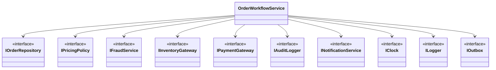

# The Dependency Inversion Principle (DIP) with Dependency Injection (DI)

[PowerPoint Presentation](08-dependency-inversion-principle.pptx)

## 1. Introduction to the Dependency Inversion Principle

The Dependency Inversion Principle (DIP) says high-level policy should depend on abstractions rather than low-level details, and Dependency Injection (DI) is the most common practical way to apply that rule.

### Canonical Definition(s)

> "High-level modules should not depend on low-level modules. Both should depend on abstractions."
> - Robert C. Martin

> "Abstractions should not depend on details. Details should depend on abstractions."
> - Robert C. Martin

> Dependency Injection: an object receives required collaborators from outside itself instead of creating them internally.

DIP is the principle. DI is one implementation technique.

### A Typical Example (That Creates DIP Problems Later)

This is common enterprise practice: a high-level order policy service directly `new`s low-level infrastructure clients inside its method. It works initially, but it tightly couples policy to details.

```csharp
public sealed class OrderApprovalPolicy
{
    public bool Approve(Order order)
    {
        // High-level policy creating low-level details directly.
        var credit = new LegacyCreditApiClient("https://credit.internal");
        var audit = new FileAuditLogger("/var/log/order-approval.log");

        bool approved = credit.Check(order.CustomerId, order.TotalAmount);
        audit.Write($"Order {order.Id} approved={approved}");

        return approved;
    }
}
```


Now compare that to DIP plus a composition root:

```csharp
public interface ICreditCheckGateway
{
    bool Check(string customerId, decimal amount);
}

public interface IAuditLogger
{
    void Write(string message);
}

public sealed class OrderApprovalPolicy
{
    private readonly ICreditCheckGateway _credit;
    private readonly IAuditLogger _audit;

    public OrderApprovalPolicy(ICreditCheckGateway credit, IAuditLogger audit)
    {
        _credit = credit;
        _audit = audit;
    }

    public bool Approve(Order order)
    {
        bool approved = _credit.Check(order.CustomerId, order.TotalAmount);
        _audit.Write($"Order {order.Id} approved={approved}");
        return approved;
    }
}

// Composition root
var policy = new OrderApprovalPolicy(
    new LegacyCreditApiClient("https://credit.internal"),
    new FileAuditLogger("/var/log/order-approval.log"));
```

Notice the abstractions are not added "just because." They are introduced at variance points where change is likely (credit provider and audit destination).

Why DIP matters immediately:

- Policy code can be tested with fakes instead of infrastructure.
- Low-level vendor swaps do not force edits in high-level policy classes.
- Wiring concerns move to composition root where they belong.

### Precise Technical Interpretation

In DIP discussions, precision matters:

- `Dependency`: a collaborator a class needs to do its job (repository, policy engine, clock, logger, gateway).
- `Object graph`: the runtime network of objects and their relationships for one process/request/job.
- `Composition root`: the single place where concrete objects are created and wired (usually `Program.cs`/startup).
- `Inversion`: high-level policy code depends on abstractions (`ICreditCheckGateway`) while low-level details (`LegacyCreditApiClient`) implement them.

Why inversion matters operationally:

- You localize change to implementation modules instead of policy modules.
- You can substitute implementations per environment, tenant, or test.
- You reduce blast radius when infrastructure changes.


### Friendly Explanation

Think of an enterprise cockpit:

- Pilots use stable controls for navigation intent.
- The aircraft internals can vary by model and vendor.
- The cockpit should not be rewired because a sensor vendor changed.

DIP applies the same idea in software: business modules express intent through stable interfaces, and infrastructure details are swapped at the composition root.

### Why It Matters in Real Systems

DIP directly affects delivery speed and production risk:

- Faster test cycles: replace external dependencies with fakes.
- Safer changes: swap infrastructure implementations without rewriting policy logic.
- Better observability design: cross-cutting concerns (logging, tracing, clock) become explicit and replaceable.
- Cleaner incident response: clear dependency boundaries expose where faults originate.

### Common Misconceptions

- DIP means "use a container." (container usage is optional)
- DIP means "everything must be an interface." (false: introduce abstractions where there is variance pressure, not everywhere)
- Constructor injection always means better design. (constructor bloat can indicate SRP issues)
- DI removes architectural decisions. (you still need clear boundaries, lifetimes, and ownership)

### Table of Contents

- [1. Introduction to the Dependency Inversion Principle](#1-introduction-to-the-dependency-inversion-principle)
- [2. DIP vs DI (SOLID Relationship Map)](#2-dip-vs-di-solid-relationship-map)
- [3. The Core Mechanics: Object Graphs and Constructor Injection](#3-the-core-mechanics-object-graphs-and-constructor-injection)
- [4. Manual Dependency Injection (No Container)](#4-manual-dependency-injection-no-container)
- [5. DI Containers Conceptually (How Framework DI Works)](#5-di-containers-conceptually-how-framework-di-works)
- [6. C# Demo: Microsoft.Extensions.DependencyInjection in a Console App](#6-c-demo-microsoftextensionsdependencyinjection-in-a-console-app)
- [7. Anti-Patterns and Failure Modes](#7-anti-patterns-and-failure-modes)
- [8. Factory Pattern (As a Tool With and Without DI)](#8-factory-pattern-as-a-tool-with-and-without-di)
- [9. Abstract Factory Pattern (Families of Related Dependencies)](#9-abstract-factory-pattern-families-of-related-dependencies)
- [10. Real-World Summary](#10-real-world-summary)
- [11. Dependency Inversion Principle Study Guide](#11-dependency-inversion-principle-study-guide)

## 2. DIP vs DI (SOLID Relationship Map)

### DIP vs DI: Principle and Technique

- `DIP` is a design principle: policy and high-level modules should depend on abstractions.
- `DI` is one implementation technique: pass collaborators in from outside.
- You can follow DIP without a container (manual DI).
- You can use a container and still violate DIP if abstractions are poor or hidden.


### SOLID Relationship Map

- `SRP`: DIP exposes responsibility boundaries; constructor bloat often reveals SRP drift.
- `OCP`: DIP stabilizes high-level policy modules while low-level implementations can vary.
- `LSP`: DIP relies on safe substitution; broken contracts undermine the inversion boundary.
- `ISP`: DIP works best with focused abstractions; fat interfaces still over-couple clients.

What DIP does not magically fix:

- Bad domain boundaries.
- Poorly named or unstable abstractions.
- Transaction and consistency design mistakes.

## 3. The Core Mechanics: Object Graphs and Constructor Injection

### Object Graphs: DIP Requires Deliberate Composition

An object graph is the runtime dependency network for a use case. In practice, DI composes this graph so DIP holds at runtime.

In an order-processing service, a root object often needs multiple collaborators:

- persistence (`IOrderRepository`)
- policy (`IPricingPolicy`)
- time source (`IClock`)
- telemetry (`ILogger`)

### Constructor Injection: Dependencies Become Explicit

Constructor injection means a class cannot exist without its required collaborators.

Technical effects:

- Explicit contract: constructor signature declares required dependencies.
- Fail fast: missing registrations are detected during composition/resolution.
- Testable seams: tests pass fake dependencies directly.


## 4. Manual Dependency Injection (No Container)

### Scenario: Order Ingestion Pipeline

A batch pipeline ingests external marketplace orders, enriches them with pricing rules, and stores normalized orders for downstream fulfillment.

### 1) BAD Version: Tight Coupling and Direct Instantiation

```csharp
public sealed class OrderIngestionService
{
    public void Ingest(OrderMessage message)
    {
        var repository = new SqlOrderRepository("Server=prod;Database=Orders;");
        var pricing = new DynamicPricingPolicy(new TaxRulesHttpClient("https://tax-rules.internal"));
        var clock = new SystemClock();
        var logger = new ConsoleLogger();

        decimal total = pricing.CalculateTotal(message);
        var order = Order.Create(message.OrderId, message.CustomerId, total, clock.UtcNow);

        repository.Save(order);
        logger.Info($"Ingested order {order.Id}");
    }
}
```


### 2) REFACTORED Version: Constructor Injection with Interfaces

```csharp
public interface IOrderRepository
{
    void Save(Order order);
}

public interface IPricingPolicy
{
    decimal CalculateTotal(OrderMessage message);
}

public interface IClock
{
    DateTime UtcNow { get; }
}

public interface ILogger
{
    void Info(string message);
}

public sealed class OrderIngestionService
{
    private readonly IOrderRepository _repository;
    private readonly IPricingPolicy _pricing;
    private readonly IClock _clock;
    private readonly ILogger _logger;

    public OrderIngestionService(
        IOrderRepository repository,
        IPricingPolicy pricing,
        IClock clock,
        ILogger logger)
    {
        _repository = repository;
        _pricing = pricing;
        _clock = clock;
        _logger = logger;
    }

    public void Ingest(OrderMessage message)
    {
        decimal total = _pricing.CalculateTotal(message);
        var order = Order.Create(message.OrderId, message.CustomerId, total, _clock.UtcNow);

        _repository.Save(order);
        _logger.Info($"Ingested order {order.Id}");
    }
}
```


### 3) Composition Root in `Main()`

```csharp
public static class Program
{
    public static void Main()
    {
        IOrderRepository repository = new SqlOrderRepository("Server=prod;Database=Orders;");
        var taxClient = new TaxRulesHttpClient("https://tax-rules.internal");
        IPricingPolicy pricing = new DynamicPricingPolicy(taxClient);
        IClock clock = new SystemClock();
        ILogger logger = new ConsoleLogger();

        var ingestion = new OrderIngestionService(repository, pricing, clock, logger);

        var message = new OrderMessage("ORD-10291", "C-8841", 149.99m, "US");
        ingestion.Ingest(message);
    }
}
```


### Why This Is Better

Manual DI improves production quality by:

- `Testability`: business logic can be tested with in-memory fakes.
- `Change isolation`: infrastructure swaps do not require policy class edits.
- `Explicit dependencies`: constructor signatures document operational requirements.

### Testing Without a Mocking Framework

```csharp
public sealed class FakeOrderRepository : IOrderRepository
{
    public readonly List<Order> Saved = new();

    public void Save(Order order) => Saved.Add(order);
}

public sealed class FixedClock : IClock
{
    public DateTime UtcNow { get; } = new DateTime(2026, 2, 1, 0, 0, 0, DateTimeKind.Utc);
}

public sealed class FlatPricingPolicy : IPricingPolicy
{
    public decimal CalculateTotal(OrderMessage message) => 100m;
}

public sealed class CollectingLogger : ILogger
{
    public readonly List<string> Messages = new();

    public void Info(string message) => Messages.Add(message);
}

// Test sketch
var repo = new FakeOrderRepository();
var pricing = new FlatPricingPolicy();
var clock = new FixedClock();
var logger = new CollectingLogger();

var sut = new OrderIngestionService(repo, pricing, clock, logger);
sut.Ingest(new OrderMessage("ORD-1", "C-1", 10m, "US"));

Console.WriteLine(repo.Saved.Count == 1 ? "PASS" : "FAIL");
```

## 5. DI Containers Conceptually (How Framework DI Works)

A DI container is one tool for applying DIP at scale. Conceptually, it does five things:

- `Registration`: map service type to implementation/factory.
- `Lifetime`: define reuse rules (transient/scoped/singleton).
- `Resolution`: build requested object and dependencies.
- `Constructor selection`: choose a usable constructor and resolve parameters.
- `Cycle detection`: fail when dependency graphs loop.

### Lifetime and Scope in Practice

- `Transient`: new instance every resolution.
- `Scoped`: one instance per scope (in ASP.NET Core, usually one per request).
- `Singleton`: one instance for application lifetime.

Common failure pattern: singleton captures scoped dependency and holds stale/request-specific state.

Registration happens first:


Then resolution uses those registrations:


### Warnings and Tradeoffs

- Containers reduce boilerplate, but can hide wiring complexity.
- Runtime resolution errors can move failures later if startup validation is weak.
- Lifetime bugs are subtle and often show up only under concurrent load.
- Overusing container APIs (`IServiceProvider` everywhere) drifts toward service locator.

## 6. C# Demo: Microsoft.Extensions.DependencyInjection in a Console App

Goal: show constructor resolution visually using the same DI abstractions used by ASP.NET Core.

### Complete `Program.cs`

```csharp
using System;
using Microsoft.Extensions.DependencyInjection;

public interface IAuditClock
{
    DateTime UtcNow { get; }
}

public sealed class SystemAuditClock : IAuditClock
{
    public SystemAuditClock()
    {
        Console.WriteLine("Constructed: SystemAuditClock (Singleton)");
    }

    public DateTime UtcNow => DateTime.UtcNow;
}

public interface IAuditLogger
{
    void Write(string message);
}

public sealed class ConsoleAuditLogger : IAuditLogger
{
    private readonly IAuditClock _clock;

    public ConsoleAuditLogger(IAuditClock clock)
    {
        _clock = clock;
        Console.WriteLine("Constructed: ConsoleAuditLogger (depends on IAuditClock)");
    }

    public void Write(string message)
    {
        Console.WriteLine($"[{_clock.UtcNow:O}] AUDIT {message}");
    }
}

public interface IComplianceReportGenerator
{
    string Generate(string orderId);
}

public sealed class ComplianceReportGenerator : IComplianceReportGenerator
{
    private readonly IAuditLogger _auditLogger;

    public ComplianceReportGenerator(IAuditLogger auditLogger)
    {
        _auditLogger = auditLogger;
        Console.WriteLine("Constructed: ComplianceReportGenerator (depends on IAuditLogger)");
    }

    public string Generate(string orderId)
    {
        string reportId = $"RPT-{orderId}";
        _auditLogger.Write($"Generated compliance report {reportId}");
        return reportId;
    }
}

public sealed class NightlyComplianceJob
{
    private readonly IComplianceReportGenerator _generator;

    public NightlyComplianceJob(IComplianceReportGenerator generator)
    {
        _generator = generator;
        Console.WriteLine("Constructed: NightlyComplianceJob (depends on IComplianceReportGenerator)");
    }

    public void Run(string orderId)
    {
        string reportId = _generator.Generate(orderId);
        Console.WriteLine($"Job completed with {reportId}");
    }
}

public static class Program
{
    public static void Main()
    {
        var services = new ServiceCollection();

        services.AddSingleton<IAuditClock, SystemAuditClock>();
        services.AddTransient<IAuditLogger, ConsoleAuditLogger>();
        services.AddTransient<IComplianceReportGenerator, ComplianceReportGenerator>();
        services.AddTransient<NightlyComplianceJob>();

        using ServiceProvider provider = services.BuildServiceProvider();

        Console.WriteLine("Resolving NightlyComplianceJob...");
        NightlyComplianceJob job = provider.GetRequiredService<NightlyComplianceJob>();

        Console.WriteLine("Running job...");
        job.Run("ORD-2026-00042");
    }
}
```

Sample output shape:

```text
Resolving NightlyComplianceJob...
Constructed: SystemAuditClock (Singleton)
Constructed: ConsoleAuditLogger (depends on IAuditClock)
Constructed: ComplianceReportGenerator (depends on IAuditLogger)
Constructed: NightlyComplianceJob (depends on IComplianceReportGenerator)
Running job...
[2026-02-20T...] AUDIT Generated compliance report RPT-ORD-2026-00042
Job completed with RPT-ORD-2026-00042
```


Registration flow for this demo (happens before `GetRequiredService(...)`):


Resolution flow:


### ASP.NET Core Mapping (Concept)

The same registrations move directly into ASP.NET Core:

```csharp
var builder = WebApplication.CreateBuilder(args);
builder.Services.AddSingleton<IAuditClock, SystemAuditClock>();
builder.Services.AddTransient<IAuditLogger, ConsoleAuditLogger>();
builder.Services.AddTransient<IComplianceReportGenerator, ComplianceReportGenerator>();
```

Controller, endpoint, or hosted service constructors then receive those dependencies via DI automatically.

## 7. Anti-Patterns and Failure Modes

### 1) Service Locator

Service Locator is a pattern where a class asks a global provider/container for dependencies at runtime instead of declaring those dependencies in its constructor.

Why teams use it:

- it feels convenient when wiring is complex
- it avoids changing constructor signatures during rapid feature work
- it can simplify plugin and runtime-discovery boundaries

Why it is considered an anti-pattern in most business/domain code:

- Hidden dependencies: class APIs look small, but true dependency count is invisible.
- Late failure mode: missing registrations fail at runtime, not at compile time.
- Weaker testability: tests must configure a locator/container even for focused unit tests.
- Dependency creep: adding "just one more lookup" is easy, so services accumulate responsibilities.
- Architectural drift: domain logic starts depending on container mechanics rather than stable abstractions.

Constructor injection does the opposite: required collaborators are explicit, compile-time visible, and easier to substitute in tests.

```csharp
public sealed class ShipmentService
{
    private readonly IServiceProvider _provider;

    public ShipmentService(IServiceProvider provider)
    {
        _provider = provider;
    }

    public void Ship(string orderId)
    {
        var repo = _provider.GetRequiredService<IOrderRepository>();
        var notifier = _provider.GetRequiredService<ICustomerNotifier>();
        var logger = _provider.GetRequiredService<ILogger>();

        var order = repo.Load(orderId);
        notifier.Notify(order.CustomerId, $"Order {orderId} shipped");
        logger.Info($"Order {orderId} shipped");
    }
}
```


When it can be acceptable (bounded usage):

- boundary integration constraints (framework callback APIs you do not control)
- legacy code where full refactor is not yet feasible
- plugin architectures and runtime discovery where types are unknown at compile time
- transitional refactoring while moving toward explicit constructors

Guidance:

- Keep locator use in composition root or boundary adapters.
- Keep it out of core domain/business logic.

### 2) Over-injection / Constructor Bloat

If a class constructor takes 9-12 dependencies, it is often an SRP smell.

```csharp
public sealed class OrderWorkflowService
{
    public OrderWorkflowService(
        IOrderRepository orders,
        IPricingPolicy pricing,
        IFraudService fraud,
        IInventoryGateway inventory,
        IPaymentGateway payments,
        IAuditLogger audit,
        INotificationService notifications,
        IClock clock,
        ILogger logger,
        IOutbox outbox)
    {
        // Constructor bloat indicates mixed responsibilities.
    }
}
```



Refactoring options:

- extract an orchestration facade for one use case
- split responsibilities into cohesive services
- introduce a parameter object for correlated primitives
- introduce an aggregate service only when the grouped dependencies are truly cohesive

```csharp
public sealed class CheckoutPipeline
{
    private readonly IOrderValidator _validator;
    private readonly IPaymentAuthorizer _payments;
    private readonly IFulfillmentScheduler _fulfillment;

    public CheckoutPipeline(
        IOrderValidator validator,
        IPaymentAuthorizer payments,
        IFulfillmentScheduler fulfillment)
    {
        _validator = validator;
        _payments = payments;
        _fulfillment = fulfillment;
    }
}
```

### 3) Captive Dependency / Lifetime Mismatch

A singleton should not capture request-scoped state.

```csharp
// Registration
services.AddScoped<IRequestContext, HttpRequestContext>();
services.AddSingleton<ComplianceCache>(); // BAD with scoped dependency below

public sealed class ComplianceCache
{
    private readonly IRequestContext _requestContext;

    public ComplianceCache(IRequestContext requestContext)
    {
        _requestContext = requestContext; // Captured too long
    }
}
```


Fix options:

- align lifetimes (`ComplianceCache` becomes scoped)
- or redesign API to pass request data as method parameters
- or create scope per operation using `IServiceScopeFactory` only at boundaries

### 4) Cyclic Dependencies

Cycles usually mean responsibilities are tangled.

```csharp
public sealed class PaymentService
{
    public PaymentService(InvoiceService invoices) { }
}

public sealed class InvoiceService
{
    public InvoiceService(PaymentService payments) { }
}
```


Break the cycle with events, mediator, or responsibility split:

```csharp
public sealed class PaymentService
{
    private readonly IDomainEventPublisher _events;

    public PaymentService(IDomainEventPublisher events)
    {
        _events = events;
    }

    public void Capture(string invoiceId)
    {
        _events.Publish(new PaymentCaptured(invoiceId));
    }
}

public sealed class InvoicePaymentProjectionHandler : IDomainEventHandler<PaymentCaptured>
{
    private readonly IInvoiceRepository _invoices;

    public InvoicePaymentProjectionHandler(IInvoiceRepository invoices)
    {
        _invoices = invoices;
    }

    public void Handle(PaymentCaptured evt)
    {
        _invoices.MarkPaid(evt.InvoiceId);
    }
}
```

## 8. Factory Pattern (As a Tool With and Without DI)

### Canonical Intent

Factory encapsulates object creation so client code depends on an abstraction of creation rather than construction details.

Use Factory when:

- runtime choice of implementation is needed (region, tenant, feature flag)
- creation has nontrivial setup or validation
- clients should not know concrete class names

Relationship to DIP:

- A DI container behaves like a generalized factory for whole object graphs.
- Domain-specific factories still add value when business rules decide which abstraction implementation to use.


### C# Example (Simple Factory)

This is a `Simple Factory` example, not Factory Method.

```csharp
public interface IPaymentGateway
{
    Authorization Authorize(PaymentRequest request);
}

public sealed class StripeGateway : IPaymentGateway
{
    public Authorization Authorize(PaymentRequest request) => Authorization.Approved("stripe");
}

public sealed class AdyenGateway : IPaymentGateway
{
    public Authorization Authorize(PaymentRequest request) => Authorization.Approved("adyen");
}

public sealed class PaymentGatewayFactory : IPaymentGatewayFactory
{
    private readonly StripeGateway _stripe;
    private readonly AdyenGateway _adyen;

    public PaymentGatewayFactory(StripeGateway stripe, AdyenGateway adyen)
    {
        _stripe = stripe;
        _adyen = adyen;
    }

    public IPaymentGateway Create(string regionCode)
    {
        return regionCode switch
        {
            "EU" => _adyen,
            _ => _stripe
        };
    }
}
```

### Common Misconceptions

- Factory is not the same thing as DI.
- DI does not remove the need for domain-level creation policies.
- A factory can be injected and still follow DIP.
- A factory that returns concretes to clients weakens abstraction boundaries.

## 9. Abstract Factory Pattern (Families of Related Dependencies)

Scenario: multi-region compliance. Each region requires a compatible pair of services: tax calculation + invoice rendering.

Canonical GoF structure (shape only):


Enterprise mapping of that same structure:

```mermaid
classDiagram
direction TB

class IComplianceSuiteFactory {
  <<AbstractFactory>>
  +CreateTaxCalculator() ITaxCalculator
  +CreateInvoiceRenderer() IInvoiceRenderer
}

class UsComplianceSuiteFactory {
  <<ConcreteFactoryA>>
}

class EuComplianceSuiteFactory {
  <<ConcreteFactoryB>>
}

class ITaxCalculator {
  <<AbstractProductA>>
  +Calculate(order) decimal
}

class IInvoiceRenderer {
  <<AbstractProductB>>
  +Render(order) string
}

class UsTaxCalculator {
  <<ConcreteProductA1>>
}
class EuTaxCalculator {
  <<ConcreteProductA2>>
}
class UsInvoiceRenderer {
  <<ConcreteProductB1>>
}
class EuInvoiceRenderer {
  <<ConcreteProductB2>>
}

class ComplianceBillingService {
  +Bill(order) Invoice
}

IComplianceSuiteFactory <|.. UsComplianceSuiteFactory
IComplianceSuiteFactory <|.. EuComplianceSuiteFactory
ITaxCalculator <|.. UsTaxCalculator
ITaxCalculator <|.. EuTaxCalculator
IInvoiceRenderer <|.. UsInvoiceRenderer
IInvoiceRenderer <|.. EuInvoiceRenderer

UsComplianceSuiteFactory --> UsTaxCalculator
UsComplianceSuiteFactory --> UsInvoiceRenderer
EuComplianceSuiteFactory --> EuTaxCalculator
EuComplianceSuiteFactory --> EuInvoiceRenderer

ComplianceBillingService --> IComplianceSuiteFactory
ComplianceBillingService --> ITaxCalculator
ComplianceBillingService --> IInvoiceRenderer
```

```csharp
public interface IComplianceSuiteFactory
{
    ITaxCalculator CreateTaxCalculator();
    IInvoiceRenderer CreateInvoiceRenderer();
}

public interface ITaxCalculator
{
    decimal Calculate(Order order);
}

public interface IInvoiceRenderer
{
    string Render(Order order);
}

public sealed class UsComplianceSuiteFactory : IComplianceSuiteFactory
{
    public ITaxCalculator CreateTaxCalculator() => new UsTaxCalculator();
    public IInvoiceRenderer CreateInvoiceRenderer() => new UsInvoiceRenderer();
}

public sealed class EuComplianceSuiteFactory : IComplianceSuiteFactory
{
    public ITaxCalculator CreateTaxCalculator() => new EuTaxCalculator();
    public IInvoiceRenderer CreateInvoiceRenderer() => new EuInvoiceRenderer();
}

public sealed class ComplianceBillingService
{
    private readonly IComplianceSuiteFactory _factory;

    public ComplianceBillingService(IComplianceSuiteFactory factory)
    {
        _factory = factory;
    }

    public string Bill(Order order)
    {
        ITaxCalculator taxes = _factory.CreateTaxCalculator();
        IInvoiceRenderer renderer = _factory.CreateInvoiceRenderer();

        decimal tax = taxes.Calculate(order);
        return renderer.Render(order with { Tax = tax });
    }
}
```

### Relationship to DIP (Using DI)

DI can select the concrete abstract factory per tenant/environment while keeping high-level billing logic dependent on `IComplianceSuiteFactory`:

```csharp
services.AddScoped<UsComplianceSuiteFactory>();
services.AddScoped<EuComplianceSuiteFactory>();

services.AddScoped<IComplianceSuiteFactory>(sp =>
{
    var tenant = sp.GetRequiredService<ITenantContext>();
    return tenant.RegionCode == "EU"
        ? sp.GetRequiredService<EuComplianceSuiteFactory>()
        : sp.GetRequiredService<UsComplianceSuiteFactory>();
});
```

This keeps region selection in composition and keeps billing logic stable.

## 10. Real-World Summary

### Practical Guidance

- Decide how to apply DIP: `manual DI vs container`.
  - manual DI is excellent for small services, jobs, and explicit composition roots.
  - a container is useful when graphs are large, lifetimes vary, and environment-specific wiring grows.
- Keep the `composition root clean`.
  - one place wires concrete implementations.
  - do not scatter `new` for infrastructure across domain services.
- Avoid `service locator creep`.
  - constructors should show dependencies explicitly.
  - keep `IServiceProvider` usage in boundaries only.
- Reason about `lifetimes` deliberately.
  - singleton: stateless/shared caches/configuration.
  - scoped: request/operation context.
  - transient: cheap, stateless, per-use components.

### Common Misconceptions

- "DIP requires a framework container." (false: manual DI is often enough)
- "Using DI means we automatically satisfy DIP." (false: poor abstractions still violate DIP)
- "More injected services always means better decoupling." (false: it can indicate SRP failure)
- "Service locator is equivalent to constructor injection." (false: locator hides dependencies)
- "Singleton is faster so it is always better." (false: lifetime mismatches can create correctness bugs)

## 11. Dependency Inversion Principle Study Guide

### Core Definitions

- `Dependency Injection (DI)`: supplying required collaborators from outside a class.
- `Dependency Inversion Principle (DIP)`: high-level and low-level modules depend on abstractions.
- `Abstraction`: interface or contract that expresses behavior independent of implementation.
- `Composition root`: centralized wiring point for concrete implementations.
- `Object graph`: runtime network of resolved objects.
- `Lifetime/scope`: reuse boundary for instances (transient/scoped/singleton).
- `Service locator`: runtime dependency lookup pattern that hides required collaborators.

### Relationship Map to Other SOLID Principles

- `SRP`: constructor bloat often signals mixed responsibilities.
- `OCP`: add new implementations via registration instead of rewriting policy modules.
- `LSP`: DIP depends on safe substitution; invalid substitutes break behavior quickly.
- `ISP`: focused interfaces make DI graphs stable and easier to reason about.

### Detection Checklist (Smells and Symptoms)

- Does a service `new` infrastructure dependencies inside business methods?
- Does a class require environment resources (DB/network/fs) just to unit test logic?
- Do constructors exceed a reasonable cohesive dependency count?
- Are `IServiceProvider` or global locators used inside domain logic?
- Are singleton services capturing scoped or request-bound dependencies?
- Do resolution failures report circular dependencies?

### Refactoring Playbook (Step-by-Step)

1. Identify one concrete dependency created inside business logic.
2. Extract an interface at the usage boundary.
3. Inject that abstraction through the constructor.
4. Move concrete object creation to the composition root.
5. Replace one infrastructure dependency in tests with a fake.
6. Repeat dependency-by-dependency until orchestration code has explicit seams.
7. Introduce a container only when manual wiring cost becomes meaningful.

### Exam-Focused Recall Prompts (Short Answer)

1. Explain, in one sentence each, the difference between DIP and DI.
2. Define composition root and explain why scattering wiring is risky.
3. Given a class that directly creates `SqlConnection`, identify the DIP violation and first refactoring step.
4. Compare transient, scoped, and singleton lifetimes with one production risk for each misuse.
5. Why is service locator usually harder to test than constructor injection?
6. Describe two ways to break a cyclic dependency in an OO service design.
7. In what situations is manual DI preferable to using a container?
