# Factory Pattern, Abstract Factory Pattern, and Singleton Pattern


[PowerPoint Presentation](08-factory-singleton.pptx) [[pdf version](08-factory-singleton.pdf)]

## Introduction

Object creation is one of the most common places where coupling quietly enters a design. This lecture addresses two creation concerns:

- **Factories** (Simple Factory, Factory Method Pattern, and Abstract Factory) control *how and where object creation decisions are made*.
- **Singleton Pattern** controls *how many instances* of a type exist and how that instance is accessed.

The goal is not to apply patterns everywhere. The goal is to apply them where they reduce change impact, improve clarity, and make behavior easier to reason about.

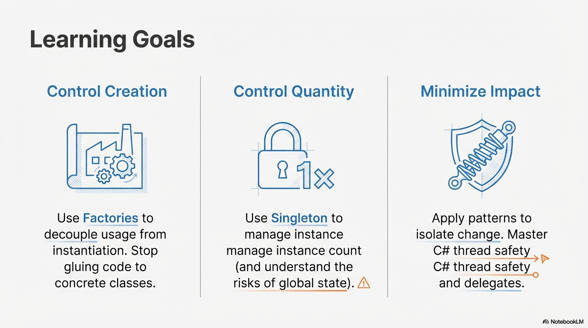


## Table of Contents

- [Factories](#factories)
- [Simple Factory](#simple-factory)
- [Factory Method Pattern](#factory-method-pattern)
- [Abstract Factory](#abstract-factory)
- [Singleton Pattern](#singleton-pattern)
- [Study Guide](#study-guide)
- [Appendix 1: Non-Thread-Safe Singleton Demo](#appendix-1-non-thread-safe-singleton-demo)
- [Appendix 2: Using Reflection for Registration](#appendix-2-using-reflection-for-registration)

## Factories

### What Factories Solve

Factories centralize object creation so client code depends on abstractions instead of concrete classes. In practice, this reduces constructor coupling and supports runtime behavior selection.

In this lecture, factory usage is tied directly to **Strategy** creation: factory logic chooses the correct `ShippingStrategy` implementation for the current context.

There are three common factory approaches:

- **Simple Factory**: one central creator selects a concrete type from runtime input.
- **Factory Method Pattern**: creator subclasses decide which concrete product gets instantiated.
- **Abstract Factory**: one factory creates a compatible family of related products.

### Factory Choice Matrix

| If your main question is... | Prefer | Why |
|---|---|---|
| "Given a runtime key, which concrete implementation should I create?" | Simple Factory | One centralized selector keeps branching out of business logic. |
| "Which subclass should decide what gets created?" | Factory Method Pattern | Creation varies by creator subtype and extension point. |
| "How do I create a compatible set of related objects?" | Abstract Factory | One concrete factory guarantees a consistent product family. |

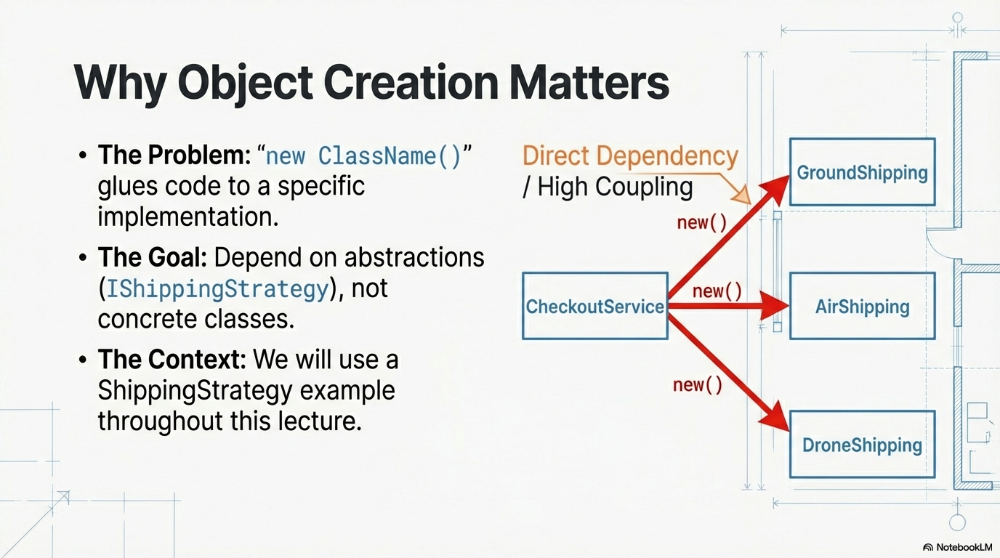

## Simple Factory

### Introduction

Simple Factory places creation logic in one method/class that returns the correct concrete strategy for a runtime key (for example `"ground"` or `"air"`).

Note: keys like `"ground"` in this demo are intentionally concise for teaching. In production code, these are **magic strings** (hard-coded string literals with semantic/control meaning) and are a code smell because they bypass compile-time checks and often duplicate across files. Over time, magic strings and magic numbers tend to violate DRY through casing differences, character-set/encoding differences, or numeric precision/unit drift. Prefer strongly typed selectors such as enums, value objects, or named constants, and convert external text input to those types at system boundaries.

### Canonical UML Class Diagram (Simple Factory)

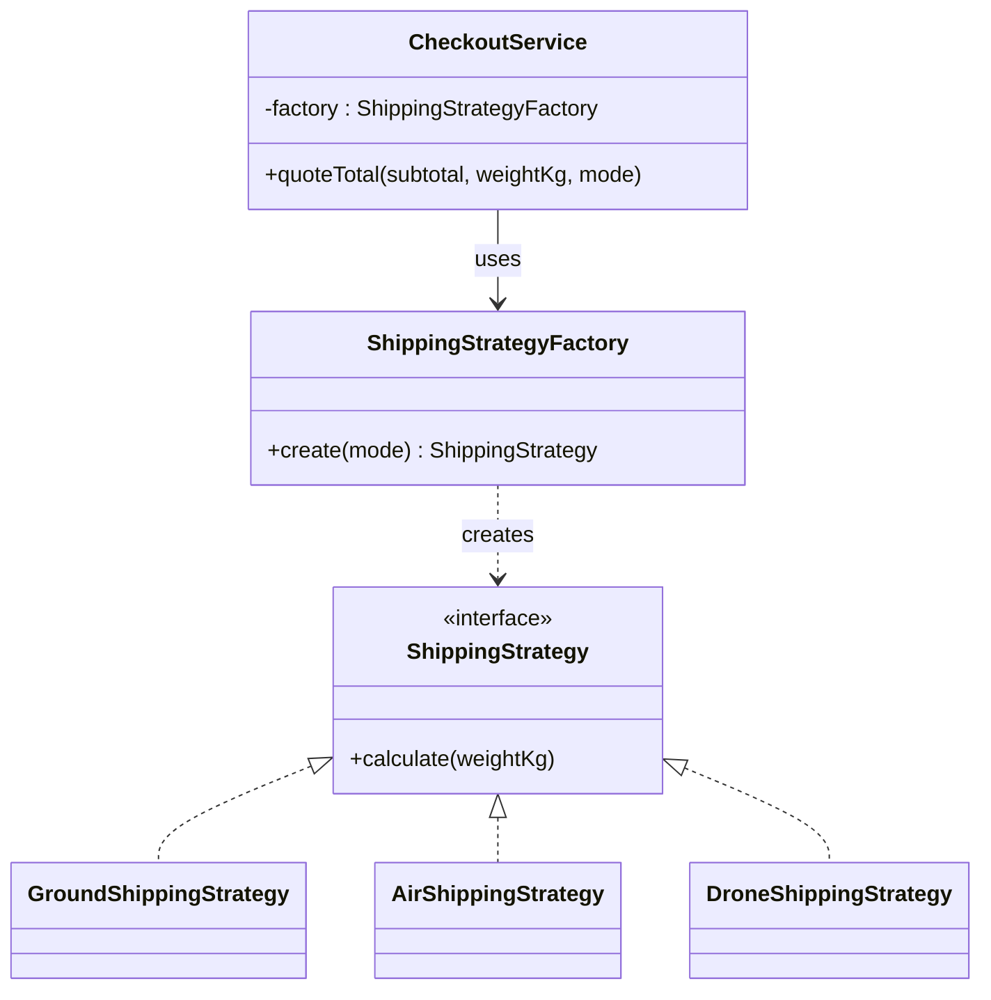
```mermaid
classDiagram
    class ShippingStrategy {
        <<interface>>
        +calculate(weightKg)
    }
    class GroundShippingStrategy
    class AirShippingStrategy
    class DroneShippingStrategy
    ShippingStrategy <|.. GroundShippingStrategy
    ShippingStrategy <|.. AirShippingStrategy
    ShippingStrategy <|.. DroneShippingStrategy

    class ShippingStrategyFactory {
        +create(mode) ShippingStrategy
    }

    class CheckoutService {
        -factory : ShippingStrategyFactory
        +quoteTotal(subtotal, weightKg, mode)
    }

    ShippingStrategyFactory ..> ShippingStrategy : creates
    CheckoutService --> ShippingStrategyFactory : uses
```

### Implementation Walkthrough (Strategy Selection)

#### C# Demo

```csharp
using System;
using System.Collections.Generic;

public interface ShippingStrategy
{
    decimal Calculate(decimal weightKg);
}

public sealed class GroundShippingStrategy : ShippingStrategy
{
    public decimal Calculate(decimal weightKg) => 4.00m + (1.10m * weightKg);
}

public sealed class AirShippingStrategy : ShippingStrategy
{
    public decimal Calculate(decimal weightKg) => 10.00m + (2.75m * weightKg);
}

public sealed class DroneShippingStrategy : ShippingStrategy
{
    public decimal Calculate(decimal weightKg) => 15.00m + (4.00m * weightKg);
}

public sealed class ShippingStrategyFactory
{
    private readonly Dictionary<string, Func<ShippingStrategy>> _registry =
        new(StringComparer.OrdinalIgnoreCase)
        {
            ["ground"] = () => new GroundShippingStrategy(),
            ["air"] = () => new AirShippingStrategy(),
            ["drone"] = () => new DroneShippingStrategy()
        };

    public ShippingStrategy Create(string mode)
    {
        if (string.IsNullOrWhiteSpace(mode))
            throw new ArgumentException("Shipping mode is required.", nameof(mode));

        if (!_registry.TryGetValue(mode, out var creator))
            throw new NotSupportedException($"Unsupported shipping mode '{mode}'.");

        return creator();
    }
}

public sealed class CheckoutService
{
    private readonly ShippingStrategyFactory _factory;

    public CheckoutService(ShippingStrategyFactory factory) => _factory = factory;

    public decimal QuoteTotal(decimal subtotal, decimal weightKg, string mode)
    {
        ShippingStrategy strategy = _factory.Create(mode);
        return subtotal + strategy.Calculate(weightKg);
    }
}

public static class Program
{
    public static void Main(string[] args)
    {
        // Runtime source: CLI, env var, or configuration provider.
        string mode = args.Length > 0
            ? args[0]
            : Environment.GetEnvironmentVariable("SHIPPING_MODE") ?? "ground";

        var service = new CheckoutService(new ShippingStrategyFactory());
        decimal total = service.QuoteTotal(subtotal: 120m, weightKg: 3.5m, mode: mode);

        Console.WriteLine($"Mode={mode}, Total={total:C}");
    }
}
```

Java note: the Java implementation is structurally identical to the C# version here, so this section uses C# as the primary teaching version.

### Refactoring Case Study: Replace `if/switch` Construction Logic

Before (policy + construction mixed):

```csharp
public decimal QuoteTotal(decimal subtotal, decimal weightKg, string mode)
{
    ShippingStrategy strategy = mode.ToLowerInvariant() switch
    {
        "ground" => new GroundShippingStrategy(),
        "air" => new AirShippingStrategy(),
        "drone" => new DroneShippingStrategy(),
        _ => throw new NotSupportedException()
    };

    return subtotal + strategy.Calculate(weightKg);
}
```

After (construction delegated):

```csharp
public decimal QuoteTotal(decimal subtotal, decimal weightKg, string mode)
{
    ShippingStrategy strategy = _factory.Create(mode);
    return subtotal + strategy.Calculate(weightKg);
}
```

### Runtime Selection, Error Handling, and Configuration Ownership

- Runtime selector sources: command line, environment variable, config file, or user preference.
- Invalid keys should fail fast with clear exceptions/logging.
- The **composition root** owns configuration loading and decides which factory object to wire in.
- Business services should not parse environment/config and construct concrete strategies directly.

### Industry Example: Payment Provider Selection

A checkout system can map runtime provider keys (`stripe`, `adyen`, `mock`) to `PaymentStrategy` implementations using a simple factory.  
This keeps payment selection logic centralized while allowing safe non-production overrides (`mock`) in test/staging environments.

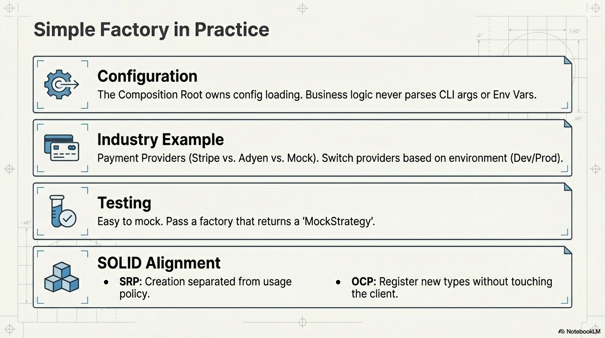

### Synonyms

- **Simple Factory** is also called **Static Factory** in some teams (non-GoF terminology).

### Anti-Pattern / Misuse

- **Switch Explosion Factory** with long unstructured conditionals.
- **God Factory** that creates unrelated product categories.
- Creating factories where no variant behavior exists.

### Good Naming Conventions

- `ShippingStrategyFactory`, `PaymentMethodFactory`, `Create`, `CreateFor`.
- Strategy interfaces should describe behavior, e.g., `ShippingStrategy`.
- Avoid names like `HelperFactory` or `ObjectManager`.

### SOLID Support (Excluding DIP)

- **SRP**: creation is separated from business policy.
- **OCP**: new strategy types can be registered with minimal client edits.
- **LSP**: clients work with `ShippingStrategy` abstraction.
- **ISP**: strategy interfaces can stay narrow and use-case focused.

### Performance and Memory Notes

- One extra call layer is usually negligible.
- Registry lookups are cheap; object churn may matter only in hot paths.
- Profile before optimizing.

### Code Smell Checklist (Overengineering/Misuse)

- Factory always returns one concrete strategy forever.
- Clients still branch on concrete types after factory creation.
- Factory API names hide intent (`GetObject()`).

### When to Use / When Not to Use

**Use when:**
- runtime keys select among concrete implementations,
- you want to centralize construction rules,
- strategy options are likely to grow.

**Do not use when:**
- there is one stable implementation,
- creation logic is trivial and static,
- additional indirection harms readability more than it helps.

Transition: when creation variation belongs to subtype-specific extension points (instead of one selector), move to Factory Method Pattern.

## Factory Method Pattern

### Introduction

Factory Method Pattern defines an abstract creator operation and delegates concrete creation to subclasses. It is useful when different creator types should decide which strategy to instantiate.

Canonical Gang-of-Four (GoF) terminology is **Factory Method**. This lecture uses **Factory Method Pattern** as a label to avoid confusion with ordinary class methods.

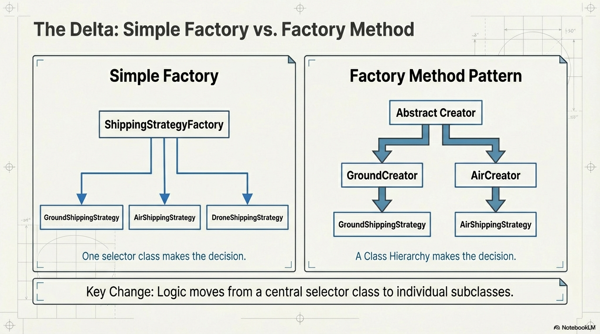

### Canonical UML Class Diagram (Factory Method Pattern)

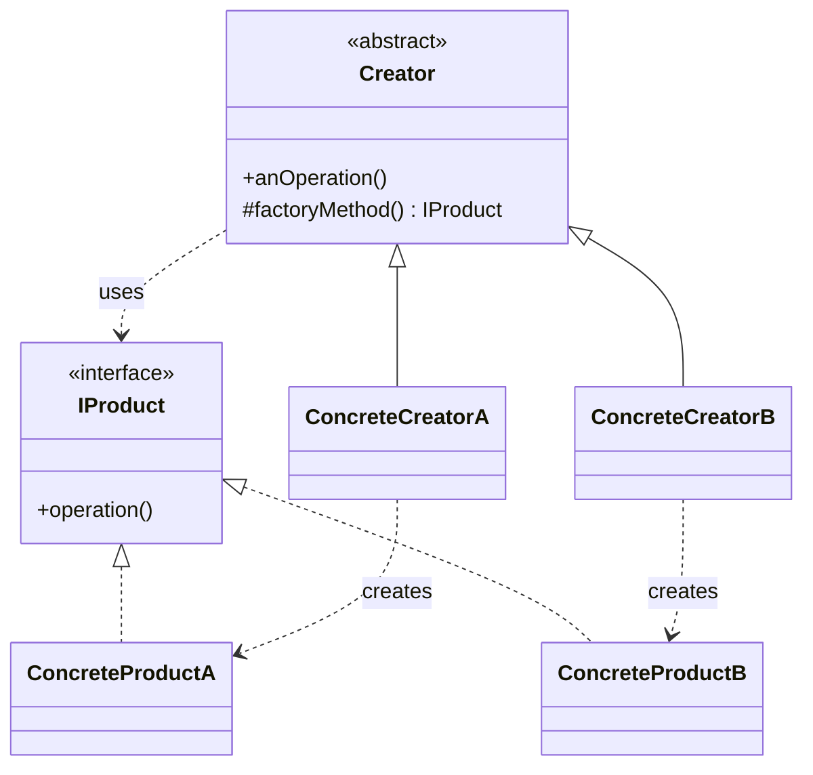
```mermaid
classDiagram
    class IProduct {
        <<interface>>
        +operation()
    }
    class ConcreteProductA
    class ConcreteProductB
    IProduct <|.. ConcreteProductA
    IProduct <|.. ConcreteProductB

    class Creator {
        <<abstract>>
        +anOperation()
        #factoryMethod() IProduct
    }
    class ConcreteCreatorA
    class ConcreteCreatorB
    Creator <|-- ConcreteCreatorA
    Creator <|-- ConcreteCreatorB

    Creator ..> IProduct : uses
    ConcreteCreatorA ..> ConcreteProductA : creates
    ConcreteCreatorB ..> ConcreteProductB : creates
```

### Delta from Simple Factory

Compared with Simple Factory, the key structural changes are:

- Creation moves from one selector class (`ShippingStrategyFactory`) to a creator hierarchy (`ShippingStrategyCreator` and subclasses).
- A factory method (`CreateStrategy`) becomes the extension point for each concrete creator.
- `CheckoutService` now depends on an abstract creator, not a concrete selector class.
- Selection still happens at composition time; the change is *where* variation lives.

### Implementation Walkthrough (Strategy Selection via Subclass Creators)

#### C# Demo

```csharp
using System;

public interface IShippingStrategy
{
    decimal Calculate(decimal weightKg);
}

public sealed class GroundShippingStrategy : IShippingStrategy
{
    public decimal Calculate(decimal weightKg) => 4.00m + (1.10m * weightKg);
}

public sealed class AirShippingStrategy : IShippingStrategy
{
    public decimal Calculate(decimal weightKg) => 10.00m + (2.75m * weightKg);
}

public sealed class DroneShippingStrategy : IShippingStrategy
{
    public decimal Calculate(decimal weightKg) => 15.00m + (4.00m * weightKg);
}

public abstract class ShippingStrategyCreator
{
    public decimal QuoteShipping(decimal weightKg)
    {
        IShippingStrategy strategy = CreateStrategy();
        return strategy.Calculate(weightKg);
    }

    protected abstract IShippingStrategy CreateStrategy();
}

public sealed class GroundShippingCreator : ShippingStrategyCreator
{
    protected override IShippingStrategy CreateStrategy() => new GroundShippingStrategy();
}

public sealed class AirShippingCreator : ShippingStrategyCreator
{
    protected override IShippingStrategy CreateStrategy() => new AirShippingStrategy();
}

public sealed class DroneShippingCreator : ShippingStrategyCreator
{
    protected override IShippingStrategy CreateStrategy() => new DroneShippingStrategy();
}

public sealed class CheckoutService
{
    private readonly ShippingStrategyCreator _creator;

    public CheckoutService(ShippingStrategyCreator creator) => _creator = creator;

    public decimal QuoteTotal(decimal subtotal, decimal weightKg)
        => subtotal + _creator.QuoteShipping(weightKg);
}

public static class Program
{
    public static void Main(string[] args)
    {
        args = args ?? [];
        string mode = args.Length > 0
            ? args[0]
            : Environment.GetEnvironmentVariable("SHIPPING_MODE") ?? "ground";

        ShippingStrategyCreator creator = mode.ToLowerInvariant() switch
        {
            "ground" => new GroundShippingCreator(),
            "air" => new AirShippingCreator(),
            "drone" => new DroneShippingCreator(),
            _ => throw new NotSupportedException($"Unsupported shipping mode '{mode}'.")
        };

        var service = new CheckoutService(creator);
        Console.WriteLine(service.QuoteTotal(120m, 3.5m));
    }
}
```

#### Class Diagram of C# Demo Factory Method Pattern

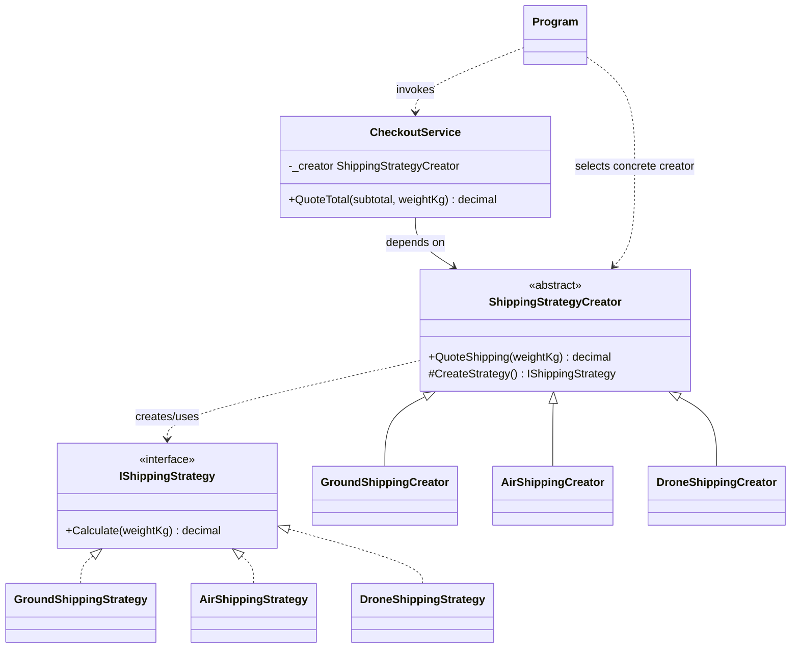
```mermaid
classDiagram
    class IShippingStrategy {
        <<interface>>
        +Calculate(weightKg) decimal
    }
    class GroundShippingStrategy
    class AirShippingStrategy
    class DroneShippingStrategy
    IShippingStrategy <|.. GroundShippingStrategy
    IShippingStrategy <|.. AirShippingStrategy
    IShippingStrategy <|.. DroneShippingStrategy

    class ShippingStrategyCreator {
        <<abstract>>
        +QuoteShipping(weightKg) decimal
        #CreateStrategy() IShippingStrategy
    }
    class GroundShippingCreator
    class AirShippingCreator
    class DroneShippingCreator
    ShippingStrategyCreator <|-- GroundShippingCreator
    ShippingStrategyCreator <|-- AirShippingCreator
    ShippingStrategyCreator <|-- DroneShippingCreator
    ShippingStrategyCreator ..> IShippingStrategy : creates/uses

    class CheckoutService {
        -_creator ShippingStrategyCreator
        +QuoteTotal(subtotal, weightKg) decimal
    }
    CheckoutService --> ShippingStrategyCreator : depends on

    class Program
    Program ..> ShippingStrategyCreator : selects concrete creator
    Program ..> CheckoutService : invokes
```

#### Sequence Diagram of C# Demo Factory Method Pattern

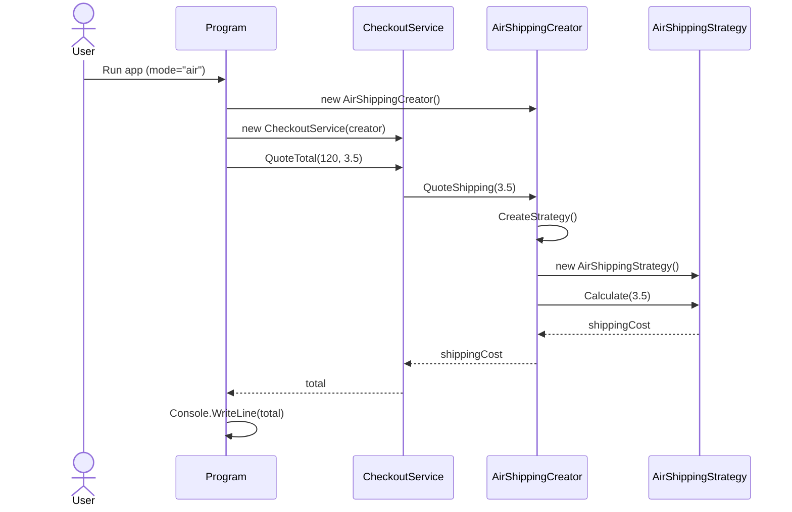
```mermaid
sequenceDiagram
    actor User
    participant Program
    participant CheckoutService
    participant AirShippingCreator
    participant AirShippingStrategy

    User->>Program: Run app (mode="air")
    Program->>AirShippingCreator: new AirShippingCreator()
    Program->>CheckoutService: new CheckoutService(creator)
    Program->>CheckoutService: QuoteTotal(120, 3.5)
    CheckoutService->>AirShippingCreator: QuoteShipping(3.5)
    AirShippingCreator->>AirShippingCreator: CreateStrategy()
    AirShippingCreator->>AirShippingStrategy: new AirShippingStrategy()
    AirShippingCreator->>AirShippingStrategy: Calculate(3.5)
    AirShippingStrategy-->>AirShippingCreator: shippingCost
    AirShippingCreator-->>CheckoutService: shippingCost
    CheckoutService-->>Program: total
    Program->>Program: Console.WriteLine(total)
```

Java note: this Factory Method Pattern example is structurally very close to the C# version, so this section uses C# as the primary version.

### Selection Is Moved, Not Eliminated

Factory Method Pattern removes selection logic from `CheckoutService`, but the system still has to choose a concrete creator somewhere (usually the composition root).  
You can replace explicit `switch` selection with a simple registration map.

### Is This Just a Thin Pass-Through Mechanism?

Sometimes yes. If each creator only wraps `new ConcreteStrategy()` and nothing else, Factory Method Pattern can be an unnecessary abstraction layer.

Factory Method Pattern becomes meaningful when creation carries real policy or extension value, for example:

- **Framework extension seam**: a base workflow calls `CreateStrategy()`, and external modules customize creation by subclassing.
- **Lifecycle policy**: creators control initialization, validation, retries/fallbacks, pooling, or instrumentation around created objects.
- **Invariant protection**: creators ensure that every created strategy is configured in a valid, consistent way.
- **Local change containment**: new creation variants are added as new creator subclasses instead of editing existing creator logic.

When **not** to use Factory Method Pattern:

- A single registry/map-based selector already solves the problem clearly.
- Creation logic is stable and trivial (plain constructor calls, no policy).
- Subclass count is growing faster than behavior differences.
- Team onboarding/readability costs are higher than extensibility benefits.


### Synonyms

- **Factory Method Pattern** is sometimes called a **Virtual Constructor**.

### Anti-Pattern / Misuse

- Subclass proliferation for minor variations.
- Creator hierarchies with no real variation in product creation.
- Forcing Factory Method Pattern when a small Simple Factory is enough.

### Good Naming Conventions

- Abstract creator names: `ShippingStrategyCreator`, `DocumentCreator`.
- Concrete creators: `GroundShippingCreator`, `AirShippingCreator`.
- Factory method names should be explicit: `CreateStrategy`, `CreateDocument`.

### SOLID Support (Excluding DIP)

- **SRP**: creator hierarchy isolates construction variation.
- **OCP**: new creator subclasses extend behavior without editing existing creators.
- **LSP**: clients use abstract creator and product contracts.
- **ISP**: creation-related APIs can remain small and focused.

### Performance and Memory Notes

- Virtual dispatch overhead is generally trivial.
- More classes can increase conceptual cost more than runtime cost.
- Use when extensibility value exceeds hierarchy complexity.

### Code Smell Checklist (Overengineering/Misuse)

- Many concrete creators differ by one line and never evolve.
- Clients select creators and then branch again on concrete strategy type.
- Creator classes include unrelated business logic.

### When to Use / When Not to Use

**Use when:**
- creation logic should vary by subclass,
- frameworks need extension points for object creation,
- you want to move creation variation out of central branching logic.

**Do not use when:**
- one central map-based selector is simpler and sufficient,
- no subclass-specific creation behavior exists,
- hierarchy depth harms readability and onboarding.

Transition: when clients must construct whole sets of related objects that must stay compatible, use Abstract Factory.

## Abstract Factory Pattern

### What It Is and What It Accomplishes

Abstract Factory provides an interface for creating **families of related objects** without specifying concrete classes. It guarantees that products created together are compatible (for example, a dark-themed button with a dark-themed dialog).

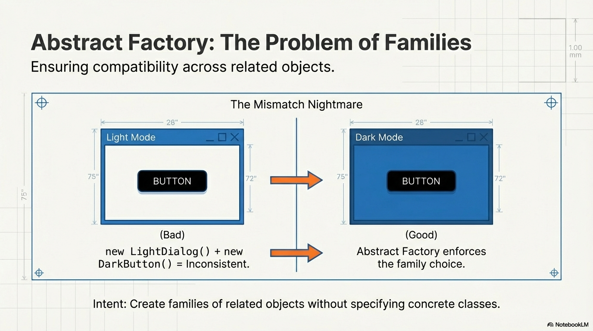

### Detailed Example: Admin Console Theming

Assume your application has an admin console that must render a consistent UI theme across multiple widgets:

- `Button` (save/cancel actions)
- `Dialog` (confirm delete, warnings)
- `Input` (text fields, checkbox inputs)

The user selects a theme (`light` or `dark`) at startup.  
If the client code directly instantiates concrete classes, mismatches are easy to introduce:

- `DarkButton` + `LightDialog` + `LightInput`

That mismatch creates inconsistent visuals and can break behavior assumptions (spacing, color contrast rules, keyboard-focus behavior).

With Abstract Factory, the app selects **one factory for one family** at composition time:

- `LightWidgetFactory` creates `LightButton`, `LightDialog`, `LightInput`
- `DarkWidgetFactory` creates `DarkButton`, `DarkDialog`, `DarkInput`

Client code then depends only on `WidgetFactory` and product interfaces, not concrete classes:

```text
theme -> choose concrete WidgetFactory once
WidgetFactory -> createButton(), createDialog(), createInput()
Screen renderer -> uses Button/Dialog/Input interfaces only
```

This gives a clear compatibility guarantee: every widget on the screen belongs to the same family.

### Canonical UML Class Diagram

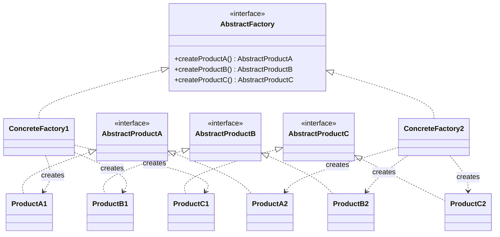
```mermaid
classDiagram
    class AbstractFactory {
        <<interface>>
        +createProductA() AbstractProductA
        +createProductB() AbstractProductB
        +createProductC() AbstractProductC
    }
    class ConcreteFactory1
    class ConcreteFactory2
    AbstractFactory <|.. ConcreteFactory1
    AbstractFactory <|.. ConcreteFactory2

    class AbstractProductA {
        <<interface>>
    }
    class ProductA1
    class ProductA2
    AbstractProductA <|.. ProductA1
    AbstractProductA <|.. ProductA2

    class AbstractProductB {
        <<interface>>
    }
    class ProductB1
    class ProductB2
    AbstractProductB <|.. ProductB1
    AbstractProductB <|.. ProductB2

    class AbstractProductC {
        <<interface>>
    }
    class ProductC1
    class ProductC2
    AbstractProductC <|.. ProductC1
    AbstractProductC <|.. ProductC2

    ConcreteFactory1 ..> ProductA1 : creates
    ConcreteFactory1 ..> ProductB1 : creates
    ConcreteFactory1 ..> ProductC1 : creates
    ConcreteFactory2 ..> ProductA2 : creates
    ConcreteFactory2 ..> ProductB2 : creates
    ConcreteFactory2 ..> ProductC2 : creates
```

### Implementation Walkthrough (UI Theming Family)

Design goal: create matching UI components (`Button`, `Dialog`, `Input`) for a selected theme family.

#### C# Demo

```csharp
using System;

public interface Button
{
    string Render();
}

public interface Dialog
{
    string Render();
}

public interface Input
{
    string Render();
}

public interface WidgetFactory
{
    Button CreateButton();
    Dialog CreateDialog();
    Input CreateInput();
}

public sealed class LightButton : Button
{
    public string Render() => "[Light Button]";
}

public sealed class LightDialog : Dialog
{
    public string Render() => "[Light Dialog]";
}

public sealed class DarkButton : Button
{
    public string Render() => "[Dark Button]";
}

public sealed class DarkDialog : Dialog
{
    public string Render() => "[Dark Dialog]";
}

public sealed class LightInput : Input
{
    public string Render() => "[Light Input]";
}

public sealed class DarkInput : Input
{
    public string Render() => "[Dark Input]";
}

public sealed class LightWidgetFactory : WidgetFactory
{
    public Button CreateButton() => new LightButton();   // Factory method
    public Dialog CreateDialog() => new LightDialog();   // Factory method
    public Input CreateInput() => new LightInput();      // Factory method
}

public sealed class DarkWidgetFactory : WidgetFactory
{
    public Button CreateButton() => new DarkButton();    // Factory method
    public Dialog CreateDialog() => new DarkDialog();    // Factory method
    public Input CreateInput() => new DarkInput();       // Factory method
}

public sealed class SettingsScreen
{
    private readonly WidgetFactory _factory;

    public SettingsScreen(WidgetFactory factory) => _factory = factory;

    public string Render()
    {
        Button button = _factory.CreateButton();
        Dialog dialog = _factory.CreateDialog();
        Input input = _factory.CreateInput();
        return $"{button.Render()} {dialog.Render()} {input.Render()}";
    }
}

// Test helper: controlled product family for deterministic tests.
public sealed class FakeWidgetFactory : WidgetFactory
{
    public Button CreateButton() => new FakeButton();
    public Dialog CreateDialog() => new FakeDialog();
    public Input CreateInput() => new FakeInput();

    private sealed class FakeButton : Button
    {
        public string Render() => "[Fake Button]";
    }

    private sealed class FakeDialog : Dialog
    {
        public string Render() => "[Fake Dialog]";
    }

    private sealed class FakeInput : Input
    {
        public string Render() => "[Fake Input]";
    }
}

public static class Program
{
    public static void Main(string[] args)
    {
        string theme = args.Length > 0 ? args[0] : "light";

        WidgetFactory factory = theme.Equals("dark", StringComparison.OrdinalIgnoreCase)
            ? new DarkWidgetFactory()
            : new LightWidgetFactory();

        var screen = new SettingsScreen(factory);
        Console.WriteLine(screen.Render());
    }
}
```

#### Java Demo

```java
interface Button {
    String render();
}

interface Dialog {
    String render();
}

interface Input {
    String render();
}

interface WidgetFactory {
    Button createButton();
    Dialog createDialog();
    Input createInput();
}

final class LightButton implements Button {
    public String render() { return "[Light Button]"; }
}

final class LightDialog implements Dialog {
    public String render() { return "[Light Dialog]"; }
}

final class DarkButton implements Button {
    public String render() { return "[Dark Button]"; }
}

final class DarkDialog implements Dialog {
    public String render() { return "[Dark Dialog]"; }
}

final class LightInput implements Input {
    public String render() { return "[Light Input]"; }
}

final class DarkInput implements Input {
    public String render() { return "[Dark Input]"; }
}

final class LightWidgetFactory implements WidgetFactory {
    public Button createButton() { return new LightButton(); } // Factory method
    public Dialog createDialog() { return new LightDialog(); } // Factory method
    public Input createInput() { return new LightInput(); }    // Factory method
}

final class DarkWidgetFactory implements WidgetFactory {
    public Button createButton() { return new DarkButton(); }  // Factory method
    public Dialog createDialog() { return new DarkDialog(); }  // Factory method
    public Input createInput() { return new DarkInput(); }     // Factory method
}

final class SettingsScreen {
    private final WidgetFactory factory;

    SettingsScreen(WidgetFactory factory) {
        this.factory = factory;
    }

    String render() {
        Button button = factory.createButton();
        Dialog dialog = factory.createDialog();
        Input input = factory.createInput();
        return button.render() + " " + dialog.render() + " " + input.render();
    }
}

// Test helper: controlled product family for deterministic tests.
final class FakeWidgetFactory implements WidgetFactory {
    public Button createButton() { return new FakeButton(); }
    public Dialog createDialog() { return new FakeDialog(); }
    public Input createInput() { return new FakeInput(); }

    private static final class FakeButton implements Button {
        public String render() { return "[Fake Button]"; }
    }

    private static final class FakeDialog implements Dialog {
        public String render() { return "[Fake Dialog]"; }
    }

    private static final class FakeInput implements Input {
        public String render() { return "[Fake Input]"; }
    }
}

public final class Main {
    public static void main(String[] args) {
        String theme = args.length > 0 ? args[0] : "light";

        WidgetFactory factory = "dark".equalsIgnoreCase(theme)
            ? new DarkWidgetFactory()
            : new LightWidgetFactory();

        SettingsScreen screen = new SettingsScreen(factory);
        System.out.println(screen.render());
    }
}
```

### Industry Example: Cloud Provider Families

Infrastructure platforms often need provider-compatible clients as a family:

- `AwsClientFactory` -> `AwsStorageClient`, `AwsQueueClient`, `AwsIdentityClient`
- `AzureClientFactory` -> `AzureStorageClient`, `AzureQueueClient`, `AzureIdentityClient`

In this example, two factories provide the same interfaces to various equivalent services in two different cloud providers. Imagine that you developed a popular tool to help manage a complex cloud provider such as AWS. By implementing abstract factory, you can extend your platform to additional cloud providers such as Azure and Google Cloud and switch them dynamically, making your platform available to entirely new customers (or customers who use multiple cloud providers). Here abstract factory is not only good software engineering practice, but helps you reach new customers.


### Product Families and Consistency Guarantees

- A concrete factory defines a **cohesive family** of products.
- Client code receives products that are designed to work together.
- This avoids cross-family mismatches (for example, `DarkButton` with `LightDialog`).

### Tradeoff Analysis: Adding Families vs Adding Product Types

- **Easy change:** add a new family (`CorporateWidgetFactory`) by adding concrete products + one factory.
- **Expensive change:** add a new product type (`Tooltip`) because every factory interface and concrete factory must expand.
- This is the core Abstract Factory tradeoff and a common exam question.
- 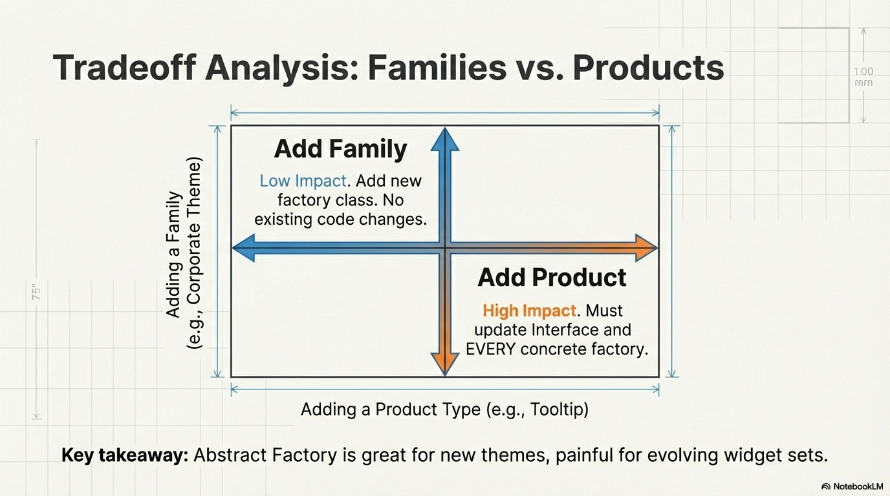

### Relationship to Factory Method Pattern

- Abstract Factory is often implemented with multiple **factory methods** (one per product type).
- In the demo above, each `Create*` method is a factory method inside a broader family factory.

### Synonyms

- GoF references **Kit** as an alternative name for Abstract Factory.

### Anti-Pattern / Misuse

- Introducing Abstract Factory when there is only one product family.
- Splitting one simple factory into many interfaces without real variability.
- Allowing family mixing by leaking concrete types into clients.

### Good Naming Conventions

- Abstract factory names: `WidgetFactory`, `PaymentProviderFactory`.
- Concrete family names: `DarkWidgetFactory`, `StripeFactory`, `AwsFactory`.
- Product interfaces: `Button`, `Dialog`, `Input`, `CacheClient`.
- Family products should share clear prefixes/suffixes (`DarkButton`, `DarkDialog`).

### SOLID Support (Excluding DIP)

- **SRP**: creation of families is separated from client behavior.
- **OCP**: new families can be introduced with minimal client modification.
- **LSP**: clients can swap concrete factories and still receive valid product abstractions.
- **ISP**: each product abstraction can remain small and focused by client usage.

### Performance and Memory Notes

- Overhead is mostly extra object creation calls and indirection, typically minor.
- Memory impact grows with family count if factories pre-create/caches products.
- Choose laziness vs caching based on measured usage patterns.

### Code Smell Checklist (Overengineering/Misuse)

- Factory interface has one creation method and no family concept.
- Clients downcast products to concrete family types.
- Product naming does not reveal family boundaries.
- New product types require edits across many factories too frequently for team velocity.

### When to Use / When Not to Use

**Use when:**
- you must create related product sets that must be used consistently,
- you need runtime family switching (theme/platform/vendor),
- you want client code fully decoupled from concrete family classes.

**Do not use when:**
- product families are not real and are unlikely to emerge,
- you only need a single product type with occasional variants,
- team complexity budget is low and a simpler factory is enough.

---

## Singleton Pattern

### What It Is and What It Accomplishes

Singleton ensures a class has *one and only one* accessible instance and provides a global access point to that instance. It is useful for genuinely single logical resources (for example, process-wide configuration snapshot).

The risk singleton introduces is **hidden global state**: any code can reach the same shared object from anywhere, often without that dependency appearing in constructors or method parameters. This hides coupling and makes behavior harder to reason about, because one part of the system can mutate singleton state and unexpectedly affect unrelated parts. It is especially problematic in tests, where state can leak between test cases, create order-dependent failures, and break parallel test isolation.

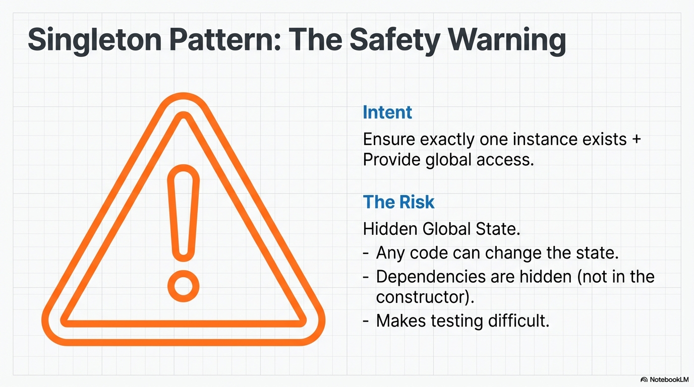

### Canonical UML Class Diagram

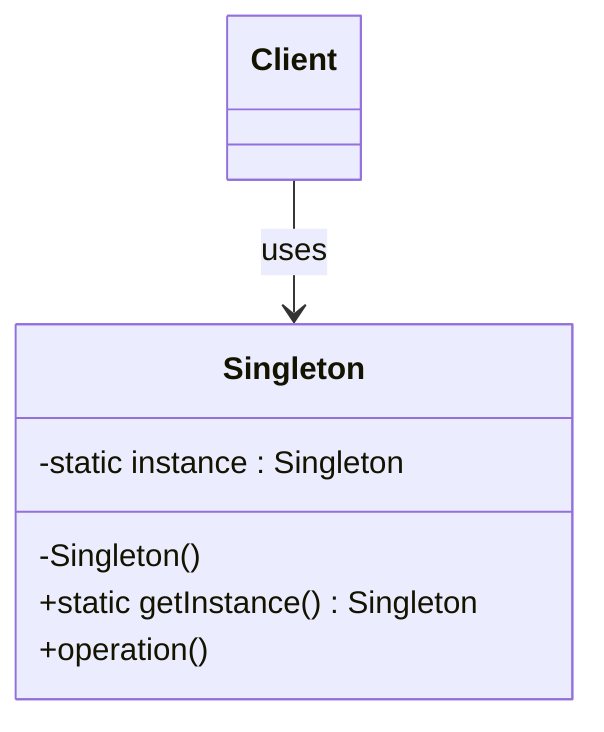
```mermaid
classDiagram
    class Singleton {
        -Singleton()
        -static instance : Singleton
        +static getInstance() Singleton
        +operation()
    }
    class Client
    Client --> Singleton : uses
```

### Implementation Walkthrough

Below are two equivalent implementations per language: a simple version and a thread-safe double-checked locking version.

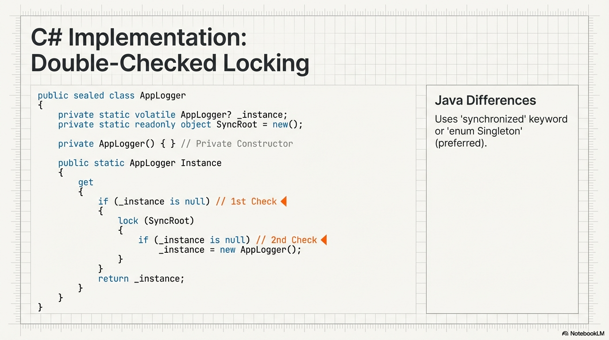

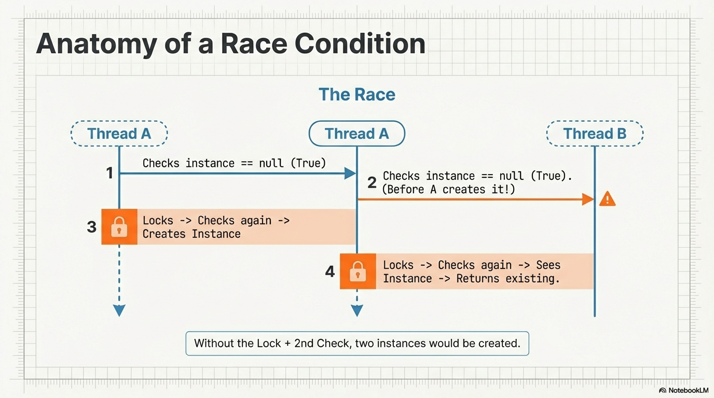

#### C# Demo

```csharp
using System;

// Simple lazy singleton (NOT thread-safe).
public sealed class SimpleAppConfig
{
    private static SimpleAppConfig? _instance;

    private SimpleAppConfig()
    {
        Theme = "light";
    }

    public string Theme { get; set; }

    public static SimpleAppConfig GetInstance()
    {
        _instance ??= new SimpleAppConfig();
        return _instance;
    }
}

// Thread-safe double-checked locking singleton.
public sealed class AppLogger
{
    private static volatile AppLogger? _instance;
    private static readonly object SyncRoot = new();

    private AppLogger() { }

    public static AppLogger Instance
    {
        get
        {
            if (_instance is null)
            {
                lock (SyncRoot)
                {
                    if (_instance is null)
                        _instance = new AppLogger();
                }
            }
            return _instance;
        }
    }

    public void Info(string message) => Console.WriteLine($"[INFO] {message}");
}

public static class Program
{
    public static void Main()
    {
        SimpleAppConfig.GetInstance().Theme = "dark";
        Console.WriteLine(SimpleAppConfig.GetInstance().Theme);

        AppLogger.Instance.Info("Application started.");
    }
}
```

#### Java Demo

```java
// Simple lazy singleton (NOT thread-safe).
final class SimpleAppConfig {
    private static SimpleAppConfig instance;
    private String theme = "light";

    private SimpleAppConfig() { }

    static SimpleAppConfig getInstance() {
        if (instance == null) {
            instance = new SimpleAppConfig();
        }
        return instance;
    }

    String getTheme() { return theme; }
    void setTheme(String theme) { this.theme = theme; }
}

// Thread-safe double-checked locking singleton.
final class AppLogger {
    private static volatile AppLogger instance;

    private AppLogger() { }

    static AppLogger getInstance() {
        if (instance == null) {
            synchronized (AppLogger.class) {
                if (instance == null) {
                    instance = new AppLogger();
                }
            }
        }
        return instance;
    }

    void info(String message) {
        System.out.println("[INFO] " + message);
    }
}

public final class Main {
    public static void main(String[] args) {
        SimpleAppConfig.getInstance().setTheme("dark");
        System.out.println(SimpleAppConfig.getInstance().getTheme());

        AppLogger.getInstance().info("Application started.");
    }
}
```

### Initialization Sequence (Why Double-Checked Locking Matters)

The lock and second `null` check prevent duplicate initialization when two threads race on first access.
For a concrete race-condition demonstration of what happens without thread safety, review [Appendix 1: Non-Thread-Safe Singleton Demo](#appendix-1-non-thread-safe-singleton-demo).

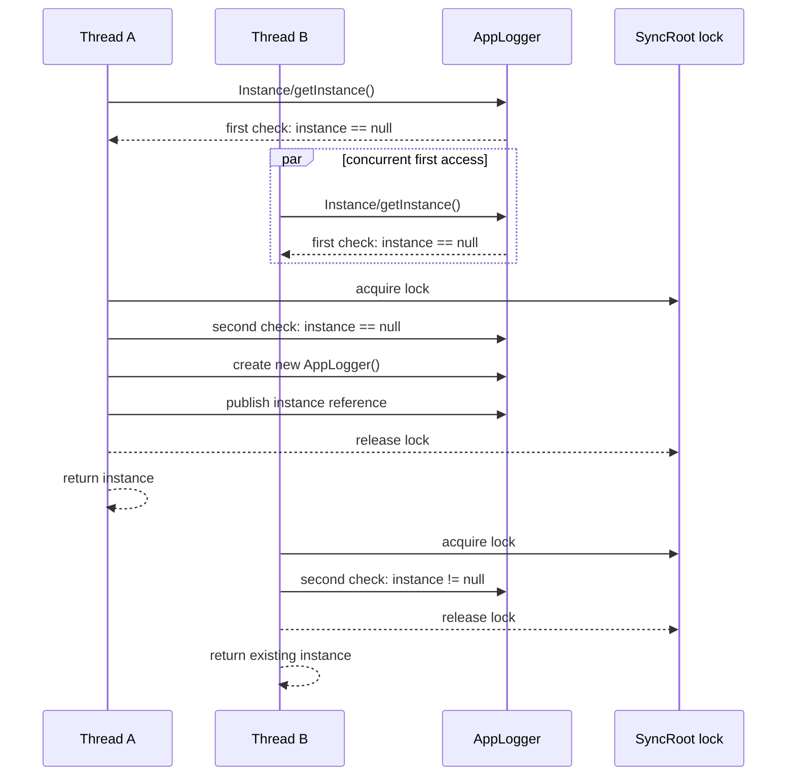
```mermaid
sequenceDiagram
    participant T1 as Thread A
    participant T2 as Thread B
    participant S as AppLogger
    participant L as SyncRoot lock

    T1->>S: Instance/getInstance()
    S-->>T1: first check: instance == null

    par concurrent first access
        T2->>S: Instance/getInstance()
        S-->>T2: first check: instance == null
    end

    T1->>L: acquire lock
    T1->>S: second check: instance == null
    T1->>S: create new AppLogger()
    T1->>S: publish instance reference
    T1-->>L: release lock
    T1-->>T1: return instance

    T2->>L: acquire lock
    T2->>S: second check: instance != null
    T2-->>L: release lock
    T2-->>T2: return existing instance
```

### Initialization Variants

- **Eager initialization**: instance created at class load time.
- **Lazy initialization**: instance created on first use.
- **Holder-based lazy initialization**: uses nested static holder class (commonly in Java).
- **`enum` singleton (Java)**: concise, serialization-safe singleton approach.

### Testing Difficulty: Why Singleton Can Hurt Tests

- Hidden global state leaks between tests and breaks isolation.
- Test order can affect outcomes if singleton state is mutable.
- Direct singleton access is hard to replace with mocks/stubs.
- Parallel test runs can produce flaky behavior if singleton mutates shared state.

Typical mitigation:
- expose behavior via interfaces and inject collaborators,
- keep singleton immutable where possible,
- provide explicit reset hooks only in test builds (with caution).

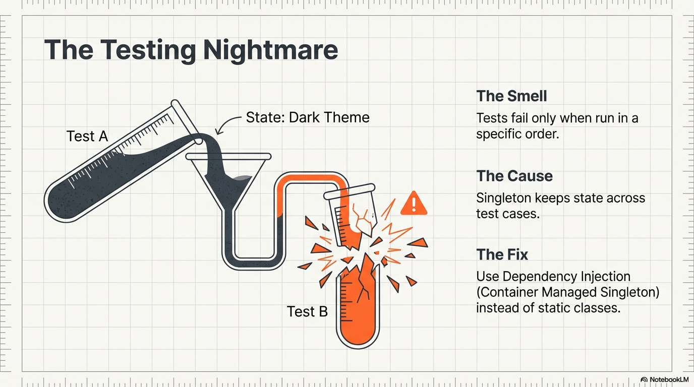

### Unit Test Example (State Leakage Smell)

```csharp
// Test A mutates global singleton state.
SimpleAppConfig.GetInstance().Theme = "dark";

// Test B expects default theme but will fail if run after Test A.
if (SimpleAppConfig.GetInstance().Theme != "light")
    throw new Exception("Singleton state leaked between tests.");
```

### Industry Example: Process-Wide Configuration Snapshot

A service may load immutable startup configuration once and expose it process-wide through a singleton-like accessor. 

This can be valid when values never mutate after startup and all consumers only read from the shared instance.

### Anti-Pattern / Misuse

- Using Singleton as a global variable bucket.
- Storing mutable business state in singletons.
- Turning services into singletons by default without proving single-instance semantics are required.

### Good Naming Conventions

- Name for domain role, not pattern: `AppLogger`, `ConfigurationStore`, `ClockProvider`.
- Avoid names that over-advertise pattern mechanics (`TheSingletonManager`).
- If accessed through a property/method, use clear names: `Instance`, `GetInstance`.

### SOLID Support (Excluding DIP)

- **SRP (conditional)**: can centralize one truly global concern (for example, immutable app metadata), but often drifts into multi-responsibility global state.
- **OCP (conditional)**: singleton alone does not provide OCP; OCP benefits appear only when clients depend on stable abstractions and singleton state is tightly controlled.
- **LSP (orthogonal)**: substitutability depends on behavioral contracts of exposed abstractions, not on whether the implementation is a singleton.
- **ISP**: singleton-exposed interfaces should stay narrow; broad singleton APIs quickly violate ISP and increase coupling.

### Concurrency Visibility Notes

- Without proper synchronization/visibility rules, one thread can observe a partially initialized instance.
- Java double-checked locking requires `volatile`.
- C# uses `volatile`/`lock` patterns or `Lazy<T>` to ensure safe publication.
- For a concrete race demonstration of unsynchronized lazy initialization, see [Appendix 1: Non-Thread-Safe Singleton Demo](#appendix-1-non-thread-safe-singleton-demo).

### Serialization and Reflection Pitfalls

- Serialization/deserialization can create new instances unless explicitly guarded.
- Reflection can bypass private constructors in some environments.
- Java `enum` singletons are a common defense against both issues.

### Safer Alternatives to Consider First

- Dependency injection with scoped lifetimes (`singleton`, `scoped`, `transient` in DI containers).
- Composition root ownership of long-lived services.
- Module-level stateless functions where state does not need to be global.

### Performance and Memory Notes

- A single instance can reduce repeated construction cost.
- Synchronization in hot paths may add overhead; initialize safely and keep access lightweight.
- The bigger risk is architectural coupling, not raw CPU cost.

### Code Smell Checklist (Overengineering/Misuse)

- **Singleton stores request/user/session state.**  
  This mixes short-lived, user-specific data into a process-wide object. The result is accidental data bleed across requests, race conditions under concurrency, and severe debugging complexity when one user’s workflow affects another. Request/session state should be scoped to the request/session boundary, not stored globally.
- **Multiple subsystems write mutable fields on the singleton.**  
  If many modules can call setters on a shared instance, no single place owns invariants. Behavior becomes "last writer wins," and failures are hard to reproduce because outcomes depend on execution timing and call order. A singleton should be immutable where possible, or mutations should be tightly controlled behind a narrow API.
- **Tests need order-dependent cleanup because singleton state persists.**  
  If test B only passes when test A runs first (or when a manual reset runs), the singleton is leaking state across tests. This indicates broken test isolation and makes parallel CI runs flaky. Each test should be independently runnable without relying on global cleanup choreography.
- **Singleton is used where constructor injection would be clearer.**  
  When an object could be passed explicitly in the constructor but is fetched globally instead, dependencies become hidden. Hidden dependencies reduce readability, make mocking harder, and couple unrelated classes to global access points. Prefer constructor injection unless strict single-instance semantics are truly required.

### When to Use / When Not to Use

**Use when:**
- the system truly requires one logical instance,
- the instance encapsulates infrastructure-level coordination,
- state is immutable or tightly controlled.

**Do not use when:**
- singleton is chosen only for convenience,
- business logic depends on mutable shared singleton state,
- testability and parallel execution are priorities.

## Study Guide

### Key Takeaways

- Choose **Simple Factory** when one central selector should create strategies/products from runtime keys.
- Choose **Factory Method Pattern** when creator subclasses should control which strategy/product gets created.
- Choose **Abstract Factory** when the key question is: "Which compatible family of implementations should I create together?"
- Choose **Singleton** only when the key question is: "Should there be exactly one process-wide instance?"
- Prefer design clarity over pattern density; patterns are tools, not goals.


### New Terminology

| Term | Meaning |
|---|---|
| Simple Factory | Centralized creation method/class; common idiom, not one of the 23 GoF patterns |
| Factory Method Pattern | Overridable method that creates product objects |
| Product Family | Set of related objects intended to be used together |
| Compatibility Guarantee | Property that family products are mutually consistent |
| Double-Checked Locking | Concurrency pattern that reduces lock overhead while safely initializing once |
| Safe Publication | Guarantee that other threads observe a fully initialized object |
| Composition Root | Application startup boundary where object graph is assembled |
| Global State | Data accessible broadly across the system, often difficult to isolate in tests |
| Magic String | Hard-coded string literal with domain/control meaning; code smell due to typo risk, weak compile-time safety, and DRY drift across casing/encoding variants |
| Magic Number | Hard-coded numeric literal with hidden meaning; code smell due to readability loss and DRY drift from duplicated values with unit/precision differences |

### Comparison Table

| Pattern | Primary Intent | Typical Structure | Strengths | Main Risks | Best Fit |
|---|---|---|---|---|---|
| Simple Factory | Select and create one implementation from a runtime selector | One factory class/method + product interface + concrete products | Centralized construction logic, easy runtime selection | Can become switch-heavy and monolithic | Strategy/provider selection from config/env/input |
| Factory Method Pattern | Defer creation to subclasses of a creator type | Abstract creator + factory method + concrete creators + products | Extension via subclassing, framework-friendly creation hooks | Too many creator subclasses for minor differences | Plugin points and subtype-specific creation rules |
| Abstract Factory | Create compatible families of related objects | Abstract factory + multiple product interfaces + concrete family factories | Enforces family consistency; easy family substitution | Interface explosion when product types keep growing | Theming, cross-platform UI, vendor-specific client stacks |
| Singleton | Ensure exactly one shared instance | Private constructor + static instance accessor | Centralized access to truly unique resource | Hidden global mutable state, testing difficulty, lifecycle coupling | Immutable app config snapshot, process-wide coordination components |

### Example Questions

1. Why is adding a new product type usually more disruptive in Abstract Factory than adding a new family?
2. When would you choose Simple Factory over Factory Method Pattern for Strategy creation?
3. Why can singleton state cause order-dependent tests?
4. How are safe publication and lazy initialization different, and how can they be combined?
5. In which cases does a simple factory beat an abstract factory on design clarity?

### Example Questions: Answers

1. Adding a product type is usually more disruptive because it requires changing the abstract factory contract (for example, adding `CreateNewType`) and updating all existing concrete factories. Adding a new family is usually additive: add new concrete products plus one new concrete factory, with little or no change to existing factory contracts.
2. Choose Simple Factory when one centralized runtime selector (config/env/user input) is enough; choose Factory Method Pattern when creation behavior should vary by creator subtype/extension point.
3. Singleton state is shared process-wide, so mutations from one test can persist into later tests, creating hidden coupling and order-dependent pass/fail outcomes.
4. They are different concerns: lazy initialization means "create only when first needed," while safe publication means "all threads observe a fully initialized instance correctly." You can combine both (for example, double-checked locking with correct memory semantics, `Lazy<T>` in C#, or Java holder-based idiom).
5. Simple Factory is clearer when you only need one product axis with straightforward runtime selection and do not need family coordination or subclass-based creator hierarchies.

## Appendix 1: Non-Thread-Safe Singleton Demo

This appendix intentionally demonstrates how a simple lazy singleton can create multiple instances under concurrent access.
This topic is related to core singleton concurrency material and is exam-relevant.

### C# Demonstration

```csharp
using System;
using System.Collections.Concurrent;
using System.Collections.Generic;
using System.Linq;
using System.Threading;
using System.Threading.Tasks;

// Simple lazy singleton (NOT thread-safe).
public sealed class SimpleAppConfig
{
    private static SimpleAppConfig? _instance;
    private static int _nextId;

    private SimpleAppConfig()
    {
        // Simulate non-trivial construction to widen race windows for demo.
        Thread.Sleep(1);
        InstanceId = Interlocked.Increment(ref _nextId);
        Theme = "light";
    }

    public int InstanceId { get; }
    public string Theme { get; set; }

    public static SimpleAppConfig GetInstance()
    {
        // Two threads can both observe _instance == null and both construct.
        if (_instance == null)
        {
            Thread.Sleep(1); // Increase overlap between competing threads.
            _instance = new SimpleAppConfig();
        }

        return _instance;
    }

    // Demo-only helper so each batch can re-run the race.
    public static void ResetForDemo() => _instance = null;
}

public static class Program
{
    public static void Main()
    {
        var observedInstanceIds = new HashSet<int>();
        int attempt = 0;

        // Keep running batches until we have observed at least 3 unique instances.
        while (observedInstanceIds.Count < 3)
        {
            attempt++;
            SimpleAppConfig.ResetForDemo();

            var gate = new ManualResetEventSlim(false);
            var idsThisAttempt = new ConcurrentBag<int>();
            var tasks = new List<Task>();

            for (int i = 0; i < 32; i++)
            {
                tasks.Add(Task.Run(() =>
                {
                    gate.Wait();
                    SimpleAppConfig cfg = SimpleAppConfig.GetInstance();
                    idsThisAttempt.Add(cfg.InstanceId);
                }));
            }

            gate.Set();
            Task.WaitAll(tasks.ToArray());

            int[] uniqueIdsThisAttempt = idsThisAttempt
                .Distinct()
                .OrderBy(id => id)
                .ToArray();

            foreach (int id in uniqueIdsThisAttempt)
                observedInstanceIds.Add(id);

            Console.WriteLine(
                $"Attempt {attempt}: unique instance IDs this run = {string.Join(", ", uniqueIdsThisAttempt)}");
        }

        int[] firstThree = observedInstanceIds.OrderBy(id => id).Take(3).ToArray();
        Console.WriteLine($"Reached 3+ unique instances overall: {string.Join(", ", firstThree)}");
    }
}
```

### Sample Output

```text
Attempt 1: unique instance IDs this run = 1, 2, 3, 4, 5, 6, 7, 8, 9, 10, 11, 12, 13, 14, 15, 16
Reached 3+ unique instances overall: 1, 2, 3
```

### Demo Explanation

- `GetInstance()` performs a non-atomic check-then-act (`if (_instance == null)` then construct/assign).
- Under concurrent access, multiple threads can pass the null check before any one assignment becomes visible.
- Each winning thread constructs a different object, so callers can receive different singleton instances.
- `ResetForDemo()` is only for demonstration so each batch can reproduce the race; production singletons should not expose reset APIs like this.

## Appendix 2: Using Reflection for Registration

This appendix is enrichment material. It is beyond the scope of this course and will not appear on an exam.

### Why This Is Useful (IDE Command Scenario)

Imagine an IDE with a large and constantly growing set of commands:

- `open-file`
- `find-references`
- `rename-symbol`
- `format-document`
- `run-tests`

If every new command requires manually editing one central registration switch/map, maintenance cost grows quickly.  
Reflection-based registration can discover factory classes automatically at startup and register them with minimal manual wiring.

### What Reflection Is

Reflection is runtime inspection of program metadata. It lets you:

- inspect types/classes loaded in an assembly or classpath,
- check whether a type implements a specific interface,
- construct objects dynamically (for example, via default constructors),
- invoke members without compile-time concrete type references.

In this appendix, reflection is used to find all classes implementing a command-factory interface and register them automatically.

### Common Reflection Uses in Real Systems

Reflection is often used in frameworks and tooling for tasks such as:

- **Controller/route discovery**: automatically finding controller classes and action methods.
- **Security via attributes/annotations**: detecting metadata like `[Authorize]` or role requirements.
- **Dependency injection scanning**: finding service implementations and registering them by convention.
- **Serialization and mapping**: reading fields/properties dynamically for JSON/object mappers.
- **Plugin/module loading**: discovering extension points without hard-coded type lists.

### Target Interface

Both demos use the same idea: factory classes implement a shared interface (`IdeCommandFactory`) and expose a command key.

### C# Demonstration

```csharp
using System;
using System.Collections.Generic;
using System.Linq;
using System.Reflection;

public interface IdeCommand
{
    void Execute();
}

public interface IdeCommandFactory
{
    string CommandName { get; }
    IdeCommand Create();
}

public sealed class OpenFileCommand : IdeCommand
{
    public void Execute() => Console.WriteLine("Open file...");
}

public sealed class OpenFileCommandFactory : IdeCommandFactory
{
    public string CommandName => "open-file";
    public IdeCommand Create() => new OpenFileCommand();
}

public sealed class RunTestsCommand : IdeCommand
{
    public void Execute() => Console.WriteLine("Run tests...");
}

public sealed class RunTestsCommandFactory : IdeCommandFactory
{
    public string CommandName => "run-tests";
    public IdeCommand Create() => new RunTestsCommand();
}

public sealed class ReflectionCommandRegistry
{
    private readonly Dictionary<string, IdeCommandFactory> _registry =
        new(StringComparer.OrdinalIgnoreCase);

    public void RegisterFactoriesFromAssembly(Assembly assembly)
    {
        IEnumerable<Type> factoryTypes = assembly.GetTypes()
            .Where(t => !t.IsAbstract && !t.IsInterface)
            .Where(t => typeof(IdeCommandFactory).IsAssignableFrom(t));

        foreach (Type type in factoryTypes)
        {
            // Convention: each factory has a parameterless constructor.
            IdeCommandFactory factory = (IdeCommandFactory)Activator.CreateInstance(type)!;
            _registry[factory.CommandName] = factory;
        }
    }

    public IdeCommand CreateCommand(string commandName)
    {
        if (!_registry.TryGetValue(commandName, out IdeCommandFactory? factory))
            throw new NotSupportedException($"Unknown command '{commandName}'.");

        return factory.Create();
    }
}

public static class Program
{
    public static void Main()
    {
        var registry = new ReflectionCommandRegistry();
        registry.RegisterFactoriesFromAssembly(Assembly.GetExecutingAssembly());

        IdeCommand command = registry.CreateCommand("run-tests");
        command.Execute();
    }
}
```

### Java Demonstration

```java
import java.lang.reflect.Constructor;
import java.lang.reflect.Modifier;
import java.util.HashMap;
import java.util.List;
import java.util.Locale;
import java.util.Map;

interface IdeCommand {
    void execute();
}

interface IdeCommandFactory {
    String commandName();
    IdeCommand create();
}

final class OpenFileCommand implements IdeCommand {
    public void execute() { System.out.println("Open file..."); }
}

final class OpenFileCommandFactory implements IdeCommandFactory {
    public String commandName() { return "open-file"; }
    public IdeCommand create() { return new OpenFileCommand(); }
}

final class RunTestsCommand implements IdeCommand {
    public void execute() { System.out.println("Run tests..."); }
}

final class RunTestsCommandFactory implements IdeCommandFactory {
    public String commandName() { return "run-tests"; }
    public IdeCommand create() { return new RunTestsCommand(); }
}

final class ReflectionCommandRegistry {
    private final Map<String, IdeCommandFactory> registry = new HashMap<>();

    void registerFactories(List<Class<?>> discoveredTypes) throws Exception {
        for (Class<?> type : discoveredTypes) {
            if (Modifier.isAbstract(type.getModifiers()) || type.isInterface()) continue;
            if (!IdeCommandFactory.class.isAssignableFrom(type)) continue;

            Constructor<?> ctor = type.getDeclaredConstructor();
            ctor.setAccessible(true);
            IdeCommandFactory factory = (IdeCommandFactory) ctor.newInstance();
            registry.put(factory.commandName().toLowerCase(Locale.ROOT), factory);
        }
    }

    IdeCommand createCommand(String commandName) {
        IdeCommandFactory factory = registry.get(commandName.toLowerCase(Locale.ROOT));
        if (factory == null)
            throw new UnsupportedOperationException("Unknown command '" + commandName + "'.");
        return factory.create();
    }
}

public final class Main {
    public static void main(String[] args) throws Exception {
        // In production, discoveredTypes usually comes from package scanning or plugin metadata.
        List<Class<?>> discoveredTypes = List.of(
            OpenFileCommandFactory.class,
            RunTestsCommandFactory.class
        );

        ReflectionCommandRegistry registry = new ReflectionCommandRegistry();
        registry.registerFactories(discoveredTypes);

        IdeCommand command = registry.createCommand("run-tests");
        command.execute();
    }
}
```

### Practical Notes

- Reflection reduces manual registration work when command counts are large and growing.
- You should still enforce conventions (for example, parameterless constructors, unique command names).
- Startup time may increase due to scanning/inspection, so cache results where appropriate.
- For this course, treat this as advanced extension material rather than required implementation technique.

### Reflection Support Comparison

Reflection support varies by language. For this course, think of the landscape this way:

| Language | Reflection / Similar Capability | Practical Meaning for Auto-Registration |
|---|---|---|
| C# | Strong runtime reflection (`System.Reflection`) | Straightforward to scan assemblies, find types by interface, instantiate, and register. |
| Java | Strong runtime reflection (`java.lang.reflect`) | Similar to C#: scan/discover classes, inspect interfaces, construct dynamically. |
| Python | Strong runtime introspection (`inspect`, `getattr`, dynamic imports) | Very flexible runtime discovery/registration patterns are common. |
| JavaScript | Runtime introspection exists (`Reflect`, prototypes, dynamic imports) | You can inspect objects/modules at runtime, but class metadata conventions are app-defined. |
| TypeScript | Type system is erased at runtime | Registration usually relies on JavaScript runtime values, decorators/metadata libraries, or build-time tooling; not TS static types directly. |
| C++ | No broad built-in runtime reflection (RTTI is limited) | Typically use explicit registration, macros, code generation, or plugin manifests instead of full runtime type scanning. |
| C | No standard reflection | Registration is usually manual tables/function pointers or generated metadata. |
