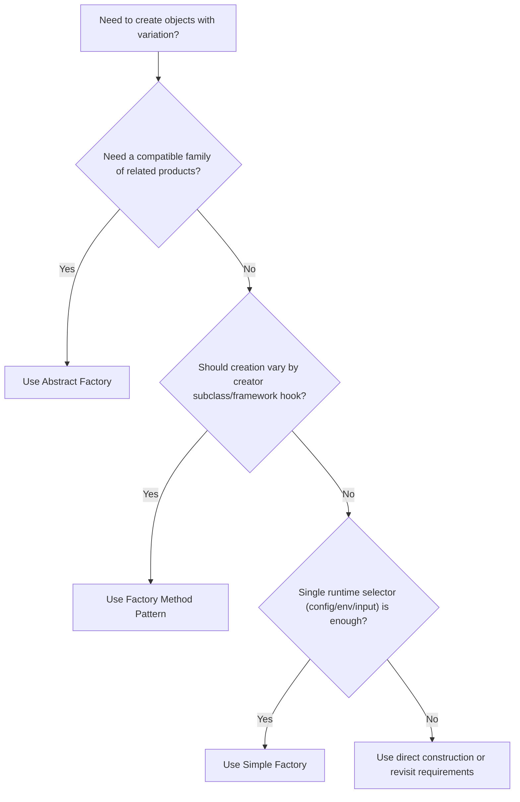
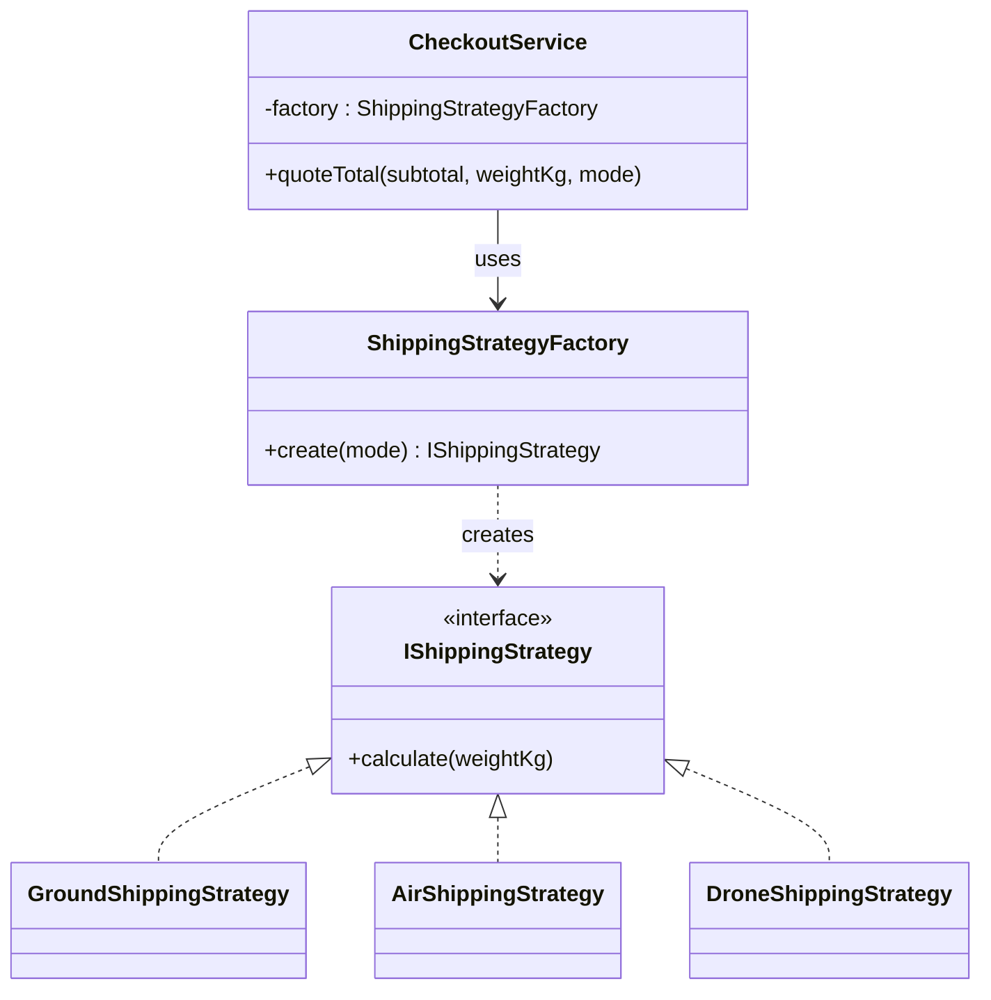
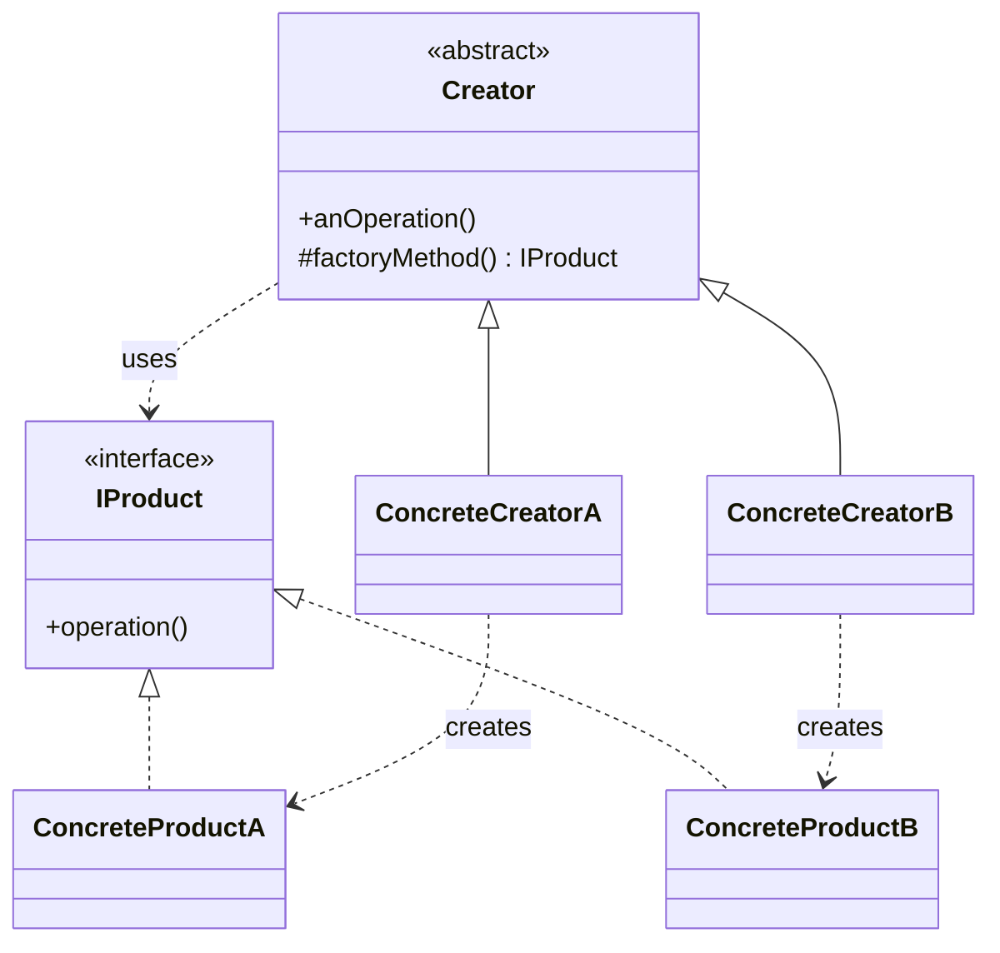
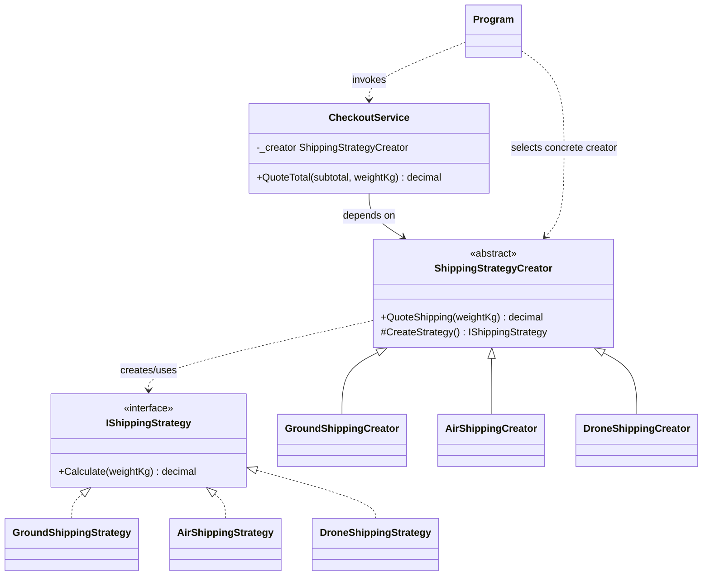
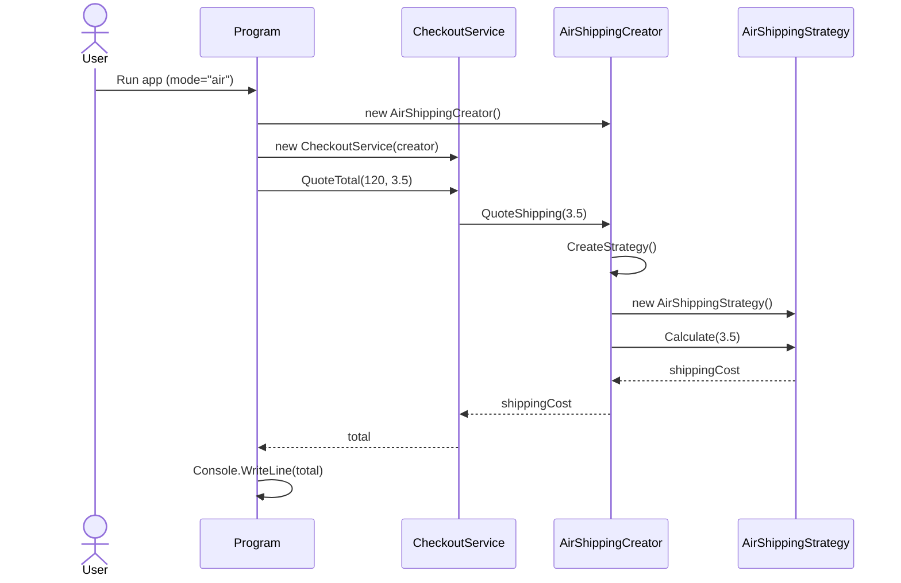
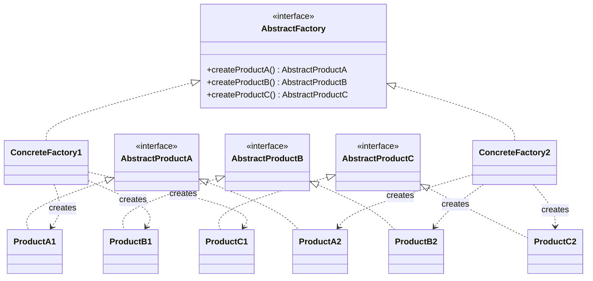
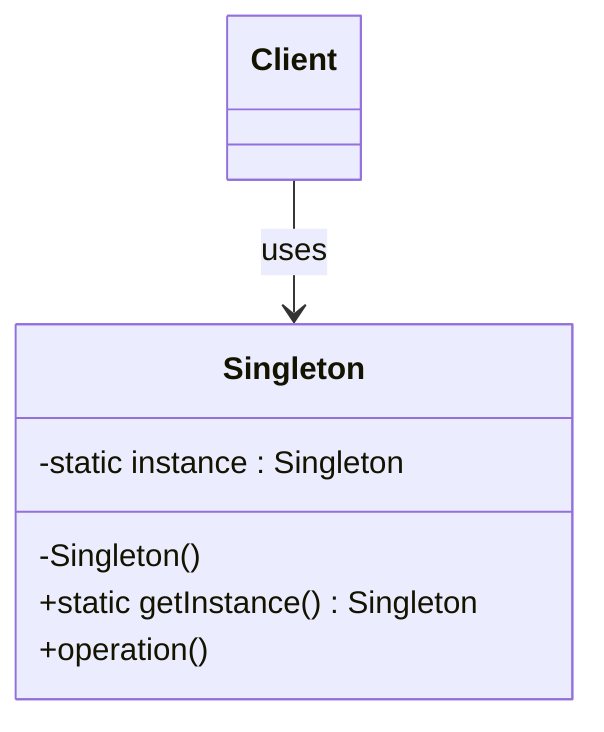
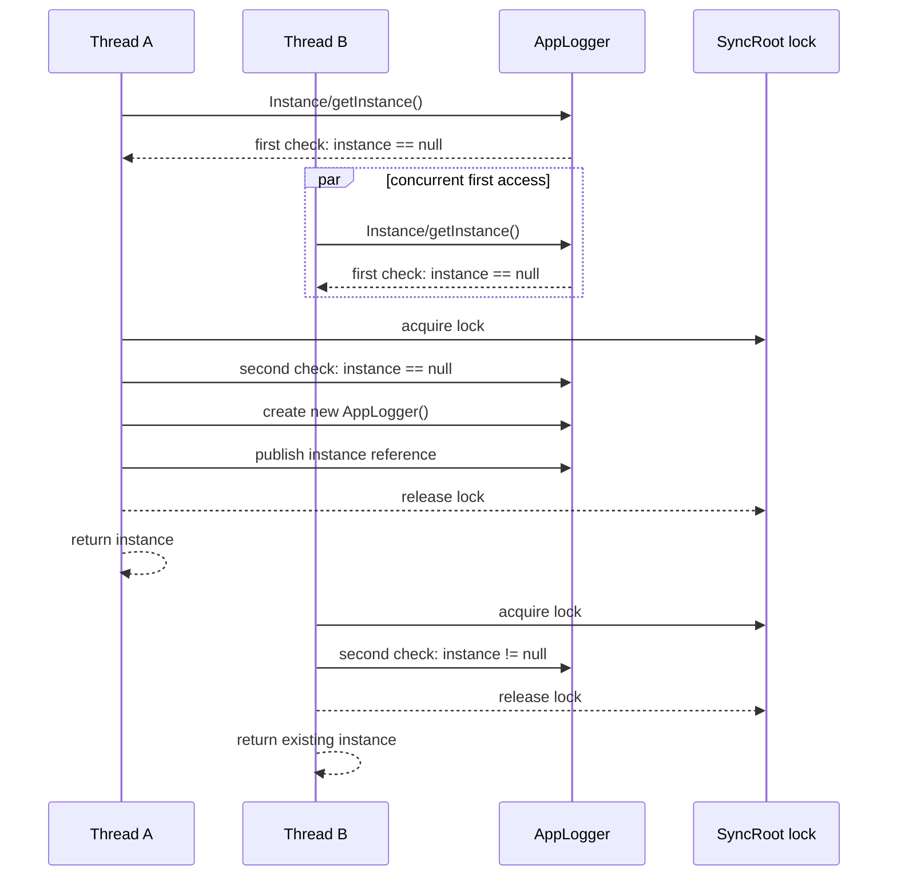

# Factory Pattern, Abstract Factory Pattern, and Singleton Pattern


[PowerPoint Presentation](08-factory-singleton.pptx) [[pdf version](08-factory-singleton.pdf)]

## Introduction

Object creation is one of the most common places where coupling quietly enters a design. This lecture addresses two creation concerns:

- **Factories** (Simple Factory, Factory Method Pattern, and Abstract Factory) control *how and where object creation decisions are made*.
- **Singleton Pattern** controls *how many instances* of a type exist and how that instance is accessed.

The goal is not to apply patterns everywhere. The goal is to apply them where they reduce change impact, improve clarity, and make behavior easier to reason about.


## Table of Contents

- [Factories](#factories)
- [Simple Factory](#simple-factory)
- [Factory Method Pattern](#factory-method-pattern)
- [Abstract Factory](#abstract-factory-pattern)
- [Singleton Pattern](#singleton-pattern)
- [Study Guide](#study-guide)
- [Appendix 1: Non-Thread-Safe Singleton Demo](#appendix-1-non-thread-safe-singleton-demo)
- [Appendix 2: Using Reflection for Registration](#appendix-2-using-reflection-for-registration)

## Factories

### What Factories Solve

Factories centralize object creation so client code depends on abstractions instead of concrete classes. In practice, this reduces constructor coupling and supports runtime behavior selection.

In this lecture, factory usage is tied directly to **Strategy** creation: factory logic chooses the correct `ShippingStrategy` implementation for the current context.

There are three common factory approaches:

- **Simple Factory**: one central creator selects a concrete type from runtime input.
- **Factory Method Pattern**: creator subclasses decide which concrete product gets instantiated.
- **Abstract Factory**: one factory creates a compatible family of related products.

### Factory Choice Matrix

| If your main question is... | Prefer | Why |
|---|---|---|
| "Given a runtime key, which concrete implementation should I create?" | Simple Factory | One centralized selector keeps branching out of business logic. |
| "Which subclass should decide what gets created?" | Factory Method Pattern | Creation varies by creator subtype and extension point. |
| "How do I create a compatible set of related objects?" | Abstract Factory | One concrete factory guarantees a consistent product family. |

### Factory Pattern Decision Flow



### Shared Evaluation Checklist (Use for All Four Patterns)

- **Naming:** make roles explicit (`*Factory`, `*Creator`, behavior-oriented interfaces).
- **SRP/OCP/LSP/ISP:** keep creation concerns isolated, extend by adding types, preserve substitutability, and keep interfaces small.
- **Misuse signals:** no real variation, too many wrappers, or hidden global mutable state.
- **When to stop:** if a simpler design is clearer and stable, prefer the simpler design.

## Simple Factory

### Introduction

Simple Factory places creation logic in one method/class that returns the correct concrete strategy for a runtime key (for example `"ground"` or `"air"`).

>  Note: keys like `"ground"` in this demo are intentionally concise for teaching. In production code, these are **magic strings** (hard-coded string literals with semantic/control meaning) and are a code smell because they bypass compile-time checks and often duplicate across files. Over time, magic strings and magic numbers tend to violate DRY through casing differences, character-set/encoding differences, or numeric precision/unit drift. Prefer strongly typed selectors such as enums, value objects, or named constants, and convert external text input to those types at system boundaries.

### Canonical UML Class Diagram (Simple Factory)



### Implementation Walkthrough (Strategy Selection)

#### C# Demo

```csharp
using System;
using System.Collections.Generic;

public interface IShippingStrategy
{
    decimal Calculate(decimal weightKg);
}

public sealed class GroundShippingStrategy : IShippingStrategy
{
    public decimal Calculate(decimal weightKg) => 4.00m + (1.10m * weightKg);
}

public sealed class AirShippingStrategy : IShippingStrategy
{
    public decimal Calculate(decimal weightKg) => 10.00m + (2.75m * weightKg);
}

public sealed class DroneShippingStrategy : IShippingStrategy
{
    public decimal Calculate(decimal weightKg) => 15.00m + (4.00m * weightKg);
}

public sealed class ShippingStrategyFactory
{
    private readonly Dictionary<string, Func<IShippingStrategy>> _registry =
        new(StringComparer.OrdinalIgnoreCase)
        {
            ["ground"] = () => new GroundShippingStrategy(),
            ["air"] = () => new AirShippingStrategy(),
            ["drone"] = () => new DroneShippingStrategy()
        };

    public IShippingStrategy Create(string mode)
    {
        if (string.IsNullOrWhiteSpace(mode))
            throw new ArgumentException("Shipping mode is required.", nameof(mode));

        if (!_registry.TryGetValue(mode, out var creator))
            throw new NotSupportedException($"Unsupported shipping mode '{mode}'.");

        return creator();
    }
}

public sealed class CheckoutService
{
    private readonly ShippingStrategyFactory _factory;

    public CheckoutService(ShippingStrategyFactory factory) => _factory = factory;

    public decimal QuoteTotal(decimal subtotal, decimal weightKg, string mode)
    {
        IShippingStrategy strategy = _factory.Create(mode);
        return subtotal + strategy.Calculate(weightKg);
    }
}

public static class Program
{
    public static void Main(string[] args)
    {
        // Runtime source: CLI, env var, or configuration provider.
        string mode = args.Length > 0
            ? args[0]
            : Environment.GetEnvironmentVariable("SHIPPING_MODE") ?? "ground";

        var service = new CheckoutService(new ShippingStrategyFactory());
        decimal total = service.QuoteTotal(subtotal: 120m, weightKg: 3.5m, mode: mode);

        Console.WriteLine($"Mode={mode}, Total={total:C}");
    }
}
```

#### Quick Compile/Run (C#)

```bash
# Assuming the snippet is Program.cs in a console project
dotnet run -- ground
```

Expected output (sample; currency symbol/format is locale-dependent):

```text
Mode=ground, Total=$127.85
```

Java note: the Java implementation is structurally identical to the C# version here, so this section uses C# as the primary teaching version.

### Refactoring Case Study: Replace `if/switch` Construction Logic

Before (policy + construction mixed):

```csharp
public decimal QuoteTotal(decimal subtotal, decimal weightKg, string mode)
{
    IShippingStrategy strategy = mode.ToLowerInvariant() switch
    {
        "ground" => new GroundShippingStrategy(),
        "air" => new AirShippingStrategy(),
        "drone" => new DroneShippingStrategy(),
        _ => throw new NotSupportedException()
    };

    return subtotal + strategy.Calculate(weightKg);
}
```

After (construction delegated):

```csharp
public decimal QuoteTotal(decimal subtotal, decimal weightKg, string mode)
{
    IShippingStrategy strategy = _factory.Create(mode);
    return subtotal + strategy.Calculate(weightKg);
}
```

### Runtime Selection, Error Handling, and Configuration Ownership

- Runtime selector sources: command line, environment variable, config file, or user preference.
- Invalid keys should fail fast with clear exceptions/logging.
- The **composition root** owns configuration loading and decides which factory object to wire in.
- Business services should not parse environment/config and construct concrete strategies directly.

### Industry Example: Payment Provider Selection

A checkout system can map runtime provider keys (`stripe`, `adyen`, `mock`) to `PaymentStrategy` implementations using a simple factory.  
This keeps payment selection logic centralized while allowing safe non-production overrides (`mock`) in test/staging environments.

### Simple Factory: Pattern-Specific Notes

- Synonym used in some teams: **Static Factory** (non-GoF).
- Most common failure mode: a large switch that keeps growing into a God Factory.
- Good fit: runtime key selection from config/env/user input with one product axis.
- Poor fit: one stable implementation or no realistic variant growth.
- SOLID connection: strongest on SRP/OCP when creation policy is kept out of business services.

Transition: when creation variation belongs to subtype-specific extension points (instead of one selector), move to Factory Method Pattern.

## Factory Method Pattern

### Introduction

Factory Method Pattern defines an abstract creator operation and delegates concrete creation to subclasses. It is useful when different creator types should decide which strategy to instantiate.

Canonical Gang-of-Four (GoF) terminology is **Factory Method**. This lecture uses **Factory Method Pattern** as a label to avoid confusion with ordinary class methods.

### Canonical UML Class Diagram (Factory Method Pattern)



### Delta from Simple Factory

Compared with Simple Factory, the key structural changes are:

- Creation moves from one selector class (`ShippingStrategyFactory`) to a creator hierarchy (`ShippingStrategyCreator` and subclasses).
- A factory method (`CreateStrategy`) becomes the extension point for each concrete creator.
- `CheckoutService` now depends on an abstract creator, not a concrete selector class.
- Selection still happens at composition time; the change is *where* variation lives.

### Implementation Walkthrough (Strategy Selection via Subclass Creators)

#### C# Demo

```csharp
using System;

public interface IShippingStrategy
{
    decimal Calculate(decimal weightKg);
}

public sealed class GroundShippingStrategy : IShippingStrategy
{
    public decimal Calculate(decimal weightKg) => 4.00m + (1.10m * weightKg);
}

public sealed class AirShippingStrategy : IShippingStrategy
{
    public decimal Calculate(decimal weightKg) => 10.00m + (2.75m * weightKg);
}

public sealed class DroneShippingStrategy : IShippingStrategy
{
    public decimal Calculate(decimal weightKg) => 15.00m + (4.00m * weightKg);
}

public abstract class ShippingStrategyCreator
{
    public decimal QuoteShipping(decimal weightKg)
    {
        IShippingStrategy strategy = CreateStrategy();
        return strategy.Calculate(weightKg);
    }

    protected abstract IShippingStrategy CreateStrategy();
}

public sealed class GroundShippingCreator : ShippingStrategyCreator
{
    protected override IShippingStrategy CreateStrategy() => new GroundShippingStrategy();
}

public sealed class AirShippingCreator : ShippingStrategyCreator
{
    protected override IShippingStrategy CreateStrategy() => new AirShippingStrategy();
}

public sealed class DroneShippingCreator : ShippingStrategyCreator
{
    protected override IShippingStrategy CreateStrategy() => new DroneShippingStrategy();
}

public sealed class CheckoutService
{
    private readonly ShippingStrategyCreator _creator;

    public CheckoutService(ShippingStrategyCreator creator) => _creator = creator;

    public decimal QuoteTotal(decimal subtotal, decimal weightKg)
        => subtotal + _creator.QuoteShipping(weightKg);
}

public static class Program
{
    public static void Main(string[] args)
    {
        args = args ?? [];
        string mode = args.Length > 0
            ? args[0]
            : Environment.GetEnvironmentVariable("SHIPPING_MODE") ?? "ground";

        ShippingStrategyCreator creator = mode.ToLowerInvariant() switch
        {
            "ground" => new GroundShippingCreator(),
            "air" => new AirShippingCreator(),
            "drone" => new DroneShippingCreator(),
            _ => throw new NotSupportedException($"Unsupported shipping mode '{mode}'.")
        };

        var service = new CheckoutService(creator);
        Console.WriteLine(service.QuoteTotal(120m, 3.5m));
    }
}
```

#### Quick Compile/Run (C#)

```bash
# Assuming the snippet is Program.cs in a console project
dotnet run -- air
```

Expected output:

```text
139.625
```

#### Class Diagram of C# Demo Factory Method Pattern



#### Sequence Diagram of C# Demo Factory Method Pattern



Java note: this Factory Method Pattern example is structurally very close to the C# version, so this section uses C# as the primary version.

### Selection Is Moved, Not Eliminated (Thin-Pass-Through Check)

Factory Method Pattern removes selection logic from `CheckoutService`, but the system still chooses a concrete creator at composition time.

Example with registration (selection remains, but is centralized and extensible):

```csharp
using System;
using System.Collections.Generic;

var creatorRegistry = new Dictionary<string, Func<ShippingStrategyCreator>>(StringComparer.OrdinalIgnoreCase)
{
    ["ground"] = () => new GroundShippingCreator(),
    ["air"] = () => new AirShippingCreator(),
    ["drone"] = () => new DroneShippingCreator()
};

if (!creatorRegistry.TryGetValue(mode, out var creatorFactory))
    throw new NotSupportedException($"Unsupported shipping mode '{mode}'.");

ShippingStrategyCreator creator = creatorFactory();
```

If each creator only wraps `new ConcreteStrategy()` forever, this pattern is probably too thin.  
It becomes worthwhile when creation includes meaningful policy (validation, retries/fallbacks, instrumentation), framework extension seams, or invariant enforcement.

Factory Method Pattern is also known as a **Virtual Constructor**.

Transition: when clients must construct whole sets of related objects that must stay compatible, use Abstract Factory.

## Abstract Factory Pattern

### What It Is and What It Accomplishes

Abstract Factory provides an interface for creating **families of related objects** without specifying concrete classes. It guarantees that products created together are compatible (for example, a dark-themed button with a dark-themed dialog).

### Detailed Example: Admin Console Theming

Assume your application has an admin console that must render a consistent UI theme across multiple widgets:

- `Button` (save/cancel actions)
- `Dialog` (confirm delete, warnings)
- `Input` (text fields, checkbox inputs)

The user selects a theme (`light` or `dark`) at startup.  
If the client code directly instantiates concrete classes, mismatches are easy to introduce:

- `DarkButton` + `LightDialog` + `LightInput`

That mismatch creates inconsistent visuals and can break behavior assumptions (spacing, color contrast rules, keyboard-focus behavior).

With Abstract Factory, the app selects **one factory for one family** at composition time:

- `LightWidgetFactory` creates `LightButton`, `LightDialog`, `LightInput`
- `DarkWidgetFactory` creates `DarkButton`, `DarkDialog`, `DarkInput`

Client code then depends only on `WidgetFactory` and product interfaces, not concrete classes:

```text
theme -> choose concrete WidgetFactory once
WidgetFactory -> createButton(), createDialog(), createInput()
Screen renderer -> uses Button/Dialog/Input interfaces only
```

This gives a clear compatibility guarantee: every widget on the screen belongs to the same family.

### Canonical UML Class Diagram



### Implementation Walkthrough (UI Theming Family)

Design goal: create matching UI components (`IButton`, `IDialog`, `IInput`) for a selected theme family.

#### C# Demo

```csharp
using System;

public interface IButton
{
    string Render();
}

public interface IDialog
{
    string Render();
}

public interface IInput
{
    string Render();
}

public interface IWidgetFactory
{
    IButton CreateButton();
    IDialog CreateDialog();
    IInput CreateInput();
}

public sealed class LightButton : IButton
{
    public string Render() => "[Light Button]";
}

public sealed class LightDialog : IDialog
{
    public string Render() => "[Light Dialog]";
}

public sealed class DarkButton : IButton
{
    public string Render() => "[Dark Button]";
}

public sealed class DarkDialog : IDialog
{
    public string Render() => "[Dark Dialog]";
}

public sealed class LightInput : IInput
{
    public string Render() => "[Light Input]";
}

public sealed class DarkInput : IInput
{
    public string Render() => "[Dark Input]";
}

public sealed class LightWidgetFactory : IWidgetFactory
{
    public IButton CreateButton() => new LightButton();   // Factory method
    public IDialog CreateDialog() => new LightDialog();   // Factory method
    public IInput CreateInput() => new LightInput();      // Factory method
}

public sealed class DarkWidgetFactory : IWidgetFactory
{
    public IButton CreateButton() => new DarkButton();    // Factory method
    public IDialog CreateDialog() => new DarkDialog();    // Factory method
    public IInput CreateInput() => new DarkInput();       // Factory method
}

public sealed class SettingsScreen
{
    private readonly IWidgetFactory _factory;

    public SettingsScreen(IWidgetFactory factory) => _factory = factory;

    public string Render()
    {
        IButton button = _factory.CreateButton();
        IDialog dialog = _factory.CreateDialog();
        IInput input = _factory.CreateInput();
        return $"{button.Render()} {dialog.Render()} {input.Render()}";
    }
}

// Test helper: controlled product family for deterministic tests.
public sealed class FakeWidgetFactory : IWidgetFactory
{
    public IButton CreateButton() => new FakeButton();
    public IDialog CreateDialog() => new FakeDialog();
    public IInput CreateInput() => new FakeInput();

    private sealed class FakeButton : IButton
    {
        public string Render() => "[Fake Button]";
    }

    private sealed class FakeDialog : IDialog
    {
        public string Render() => "[Fake Dialog]";
    }

    private sealed class FakeInput : IInput
    {
        public string Render() => "[Fake Input]";
    }
}

public static class Program
{
    public static void Main(string[] args)
    {
        string theme = args.Length > 0 ? args[0] : "light";

        IWidgetFactory factory = theme.Equals("dark", StringComparison.OrdinalIgnoreCase)
            ? new DarkWidgetFactory()
            : new LightWidgetFactory();

        var screen = new SettingsScreen(factory);
        Console.WriteLine(screen.Render());
    }
}
```

#### Quick Compile/Run (C#)

```bash
# Assuming the snippet is Program.cs in a console project
dotnet run -- dark
```

Expected output:

```text
[Dark Button] [Dark Dialog] [Dark Input]
```

#### Java Demo

```java
interface Button {
    String render();
}

interface Dialog {
    String render();
}

interface Input {
    String render();
}

interface WidgetFactory {
    Button createButton();
    Dialog createDialog();
    Input createInput();
}

final class LightButton implements Button {
    public String render() { return "[Light Button]"; }
}

final class LightDialog implements Dialog {
    public String render() { return "[Light Dialog]"; }
}

final class DarkButton implements Button {
    public String render() { return "[Dark Button]"; }
}

final class DarkDialog implements Dialog {
    public String render() { return "[Dark Dialog]"; }
}

final class LightInput implements Input {
    public String render() { return "[Light Input]"; }
}

final class DarkInput implements Input {
    public String render() { return "[Dark Input]"; }
}

final class LightWidgetFactory implements WidgetFactory {
    public Button createButton() { return new LightButton(); } // Factory method
    public Dialog createDialog() { return new LightDialog(); } // Factory method
    public Input createInput() { return new LightInput(); }    // Factory method
}

final class DarkWidgetFactory implements WidgetFactory {
    public Button createButton() { return new DarkButton(); }  // Factory method
    public Dialog createDialog() { return new DarkDialog(); }  // Factory method
    public Input createInput() { return new DarkInput(); }     // Factory method
}

final class SettingsScreen {
    private final WidgetFactory factory;

    SettingsScreen(WidgetFactory factory) {
        this.factory = factory;
    }

    String render() {
        Button button = factory.createButton();
        Dialog dialog = factory.createDialog();
        Input input = factory.createInput();
        return button.render() + " " + dialog.render() + " " + input.render();
    }
}

// Test helper: controlled product family for deterministic tests.
final class FakeWidgetFactory implements WidgetFactory {
    public Button createButton() { return new FakeButton(); }
    public Dialog createDialog() { return new FakeDialog(); }
    public Input createInput() { return new FakeInput(); }

    private static final class FakeButton implements Button {
        public String render() { return "[Fake Button]"; }
    }

    private static final class FakeDialog implements Dialog {
        public String render() { return "[Fake Dialog]"; }
    }

    private static final class FakeInput implements Input {
        public String render() { return "[Fake Input]"; }
    }
}

public final class Main {
    public static void main(String[] args) {
        String theme = args.length > 0 ? args[0] : "light";

        WidgetFactory factory = "dark".equalsIgnoreCase(theme)
            ? new DarkWidgetFactory()
            : new LightWidgetFactory();

        SettingsScreen screen = new SettingsScreen(factory);
        System.out.println(screen.render());
    }
}
```

#### Quick Compile/Run (Java)

```bash
# Assuming the snippet is saved as Main.java
javac Main.java && java Main dark
```

Expected output:

```text
[Dark Button] [Dark Dialog] [Dark Input]
```

### Industry Example: Cloud Provider Families

Infrastructure platforms often need provider-compatible clients as a family:

- `AwsClientFactory` -> `AwsStorageClient`, `AwsQueueClient`, `AwsIdentityClient`
- `AzureClientFactory` -> `AzureStorageClient`, `AzureQueueClient`, `AzureIdentityClient`

This lets one codebase switch provider families cleanly while preserving compatibility guarantees inside each family.

### Product Family Guarantees and Tradeoff

- A concrete factory defines one cohesive product family, preventing mix-and-match incompatibilities.
- Adding a **new family** is usually additive (new concrete products + one new factory).
- Adding a **new product type** is disruptive (abstract factory contract and every concrete factory must change).

### Relationship to Factory Method Pattern

Abstract Factory is often implemented with multiple factory methods, one per product type.

### Abstract Factory: Pattern-Specific Notes

- GoF synonym: **Kit**.
- Misuse pattern: introducing family abstractions when no true family variability exists.
- Good fit: themed/platform/vendor families that must stay internally consistent.
- Poor fit: one product axis with occasional variants where Simple Factory is clearer.

---

## Singleton Pattern

### What It Is and What It Accomplishes

Singleton ensures a class has *one and only one* accessible instance and provides a global access point to that instance. It is useful for genuinely single logical resources (for example, process-wide configuration snapshot).

The risk singleton introduces is **hidden global state**: any code can reach the same shared object from anywhere, often without that dependency appearing in constructors or method parameters. This hides coupling and makes behavior harder to reason about, because one part of the system can mutate singleton state and unexpectedly affect unrelated parts. It is especially problematic in tests, where state can leak between test cases, create order-dependent failures, and break parallel test isolation.

### Canonical UML Class Diagram



### Implementation Walkthrough

Below are two equivalent implementations per language: a simple version and a thread-safe double-checked locking version.

#### C# Demo

```csharp
using System;

// Simple lazy singleton (NOT thread-safe).
public sealed class SimpleAppConfig
{
    private static SimpleAppConfig? _instance;

    private SimpleAppConfig()
    {
        Theme = "light";
    }

    public string Theme { get; set; }

    public static SimpleAppConfig GetInstance()
    {
        _instance ??= new SimpleAppConfig();
        return _instance;
    }
}

// Thread-safe double-checked locking singleton.
public sealed class AppLogger
{
    private static volatile AppLogger? _instance;
    private static readonly object SyncRoot = new();

    private AppLogger() { }

    public static AppLogger Instance
    {
        get
        {
            if (_instance is null)
            {
                lock (SyncRoot)
                {
                    if (_instance is null)
                        _instance = new AppLogger();
                }
            }
            return _instance;
        }
    }

    public void Info(string message) => Console.WriteLine($"[INFO] {message}");
}

public static class Program
{
    public static void Main()
    {
        SimpleAppConfig.GetInstance().Theme = "dark";
        Console.WriteLine(SimpleAppConfig.GetInstance().Theme);

        AppLogger.Instance.Info("Application started.");
    }
}
```

#### Quick Compile/Run (C#)

```bash
# Assuming the snippet is Program.cs in a console project
dotnet run
```

Expected output:

```text
dark
[INFO] Application started.
```

#### Java Demo

```java
// Simple lazy singleton (NOT thread-safe).
final class SimpleAppConfig {
    private static SimpleAppConfig instance;
    private String theme = "light";

    private SimpleAppConfig() { }

    static SimpleAppConfig getInstance() {
        if (instance == null) {
            instance = new SimpleAppConfig();
        }
        return instance;
    }

    String getTheme() { return theme; }
    void setTheme(String theme) { this.theme = theme; }
}

// Thread-safe double-checked locking singleton.
final class AppLogger {
    private static volatile AppLogger instance;

    private AppLogger() { }

    static AppLogger getInstance() {
        if (instance == null) {
            synchronized (AppLogger.class) {
                if (instance == null) {
                    instance = new AppLogger();
                }
            }
        }
        return instance;
    }

    void info(String message) {
        System.out.println("[INFO] " + message);
    }
}

public final class Main {
    public static void main(String[] args) {
        SimpleAppConfig.getInstance().setTheme("dark");
        System.out.println(SimpleAppConfig.getInstance().getTheme());

        AppLogger.getInstance().info("Application started.");
    }
}
```

#### Quick Compile/Run (Java)

```bash
# Assuming the snippet is saved as Main.java
javac Main.java && java Main
```

Expected output:

```text
dark
[INFO] Application started.
```

### Initialization Sequence (Why Double-Checked Locking Matters)

The lock and second `null` check prevent duplicate initialization when two threads race on first access.
For a concrete race-condition demonstration of what happens without thread safety, review [Appendix 1: Non-Thread-Safe Singleton Demo](#appendix-1-non-thread-safe-singleton-demo).



### Initialization Variants

- **Eager initialization**: instance created at class load time.
- **Lazy initialization**: instance created on first use.
- **Holder-based lazy initialization**: uses nested static holder class (commonly in Java).
- **`enum` singleton (Java)**: concise, serialization-safe singleton approach.

### Testing Difficulty: Why Singleton Can Hurt Tests

- Hidden global state leaks between tests and breaks isolation.
- Test order can affect outcomes if singleton state is mutable.
- Direct singleton access is hard to replace with mocks/stubs.
- Parallel test runs can produce flaky behavior if singleton mutates shared state.

Typical mitigation:
- expose behavior via interfaces and inject collaborators,
- keep singleton immutable where possible,
- provide explicit reset hooks only in test builds (with caution).

### Unit Test Example (State Leakage Smell)

```csharp
// Test A mutates global singleton state.
SimpleAppConfig.GetInstance().Theme = "dark";

// Test B expects default theme but will fail if run after Test A.
if (SimpleAppConfig.GetInstance().Theme != "light")
    throw new Exception("Singleton state leaked between tests.");
```

### Industry Example: Process-Wide Configuration Snapshot

A service may load immutable startup configuration once and expose it process-wide through a singleton-like accessor. 

This can be valid when values never mutate after startup and all consumers only read from the shared instance.

### Concurrency Visibility Notes

- Without proper synchronization/visibility rules, one thread can observe a partially initialized instance.
- Java double-checked locking requires `volatile`.
- C# uses `volatile`/`lock` patterns or `Lazy<T>` to ensure safe publication.

### Singleton: Pattern-Specific Notes

- Use only when the system truly needs one process-wide instance with tightly controlled or immutable state.
- Avoid when constructor injection or scoped lifetimes would make dependencies explicit and testable.
- Serialization/deserialization and reflection can break singleton guarantees unless explicitly guarded (`enum` singleton is a common Java defense).
- Naming should describe role (`AppLogger`, `ConfigurationStore`) rather than pattern mechanics.
- SOLID reminder: singleton can support SRP in narrow cases, but usually increases coupling pressure and test fragility.

### Singleton Code Smell Checklist

- **Request/user/session state is stored in the singleton.** This leaks short-lived data into global scope and creates race-prone cross-request behavior.
- **Many subsystems mutate singleton fields.** "Last writer wins" behavior appears and invariants become unclear.
- **Tests require order-dependent cleanup.** This is a direct signal that singleton state is leaking across tests.
- **Global access is used where constructor injection is viable.** Hidden dependencies reduce readability and make mocking harder.

## Study Guide

### Application Anchors

- If variation is one runtime key on one product axis, start with **Simple Factory**.
- If creation must vary by creator subtype/framework hook, use **Factory Method Pattern**.
- If compatibility across multiple related products matters, use **Abstract Factory**.
- Use **Singleton** only for truly single, infrastructure-level concerns.

### Comparison Table

| Pattern | Primary Intent | Best Fit | Main Risk |
|---|---|---|---|
| Simple Factory | Select one concrete implementation from a runtime selector | Strategy/provider selection from config/env/input | Grows into a switch-heavy God Factory |
| Factory Method Pattern | Defer creation to creator subtypes | Framework hooks, plugin creator hierarchies | Many near-empty creator subclasses |
| Abstract Factory | Create compatible families of related objects | Theming, cross-platform UI, vendor client families | Adding product types forces broad contract changes |
| Singleton | Ensure one shared instance | Immutable app config snapshot, process-wide coordination | Hidden global mutable state and test coupling |

### Scenario Drills

1. You receive `shippingMode` from configuration and need one `ShippingStrategy` implementation per request. Which pattern is the best starting point?
2. A framework base class owns workflow, and plugins must override only creation behavior. Which pattern fits?
3. You must prevent mismatched UI components (`DarkButton` with `LightDialog`) at compile-time boundaries. Which pattern fits?
4. A logger must be process-wide, thread-safe, and cheap to access under load. Which singleton concerns are mandatory to address?
5. Your team added five creator subclasses that differ only by `new ConcreteX()`. What refactor should you consider?

### Edge-Case Checks

- Simple Factory: are selectors strongly typed, or still magic strings scattered in business code?
- Factory Method Pattern: is there meaningful creation policy, or just pass-through constructors?
- Abstract Factory: are product families real, or was the family abstraction invented prematurely?
- Abstract Factory: how often are new product types added, and can the team absorb broad factory-interface changes?
- Singleton: can test runs be parallel and order-independent with current global state?
- Singleton: do you need safe publication, lazy initialization, or both?
- Singleton: would DI lifetimes (`singleton`/`scoped`/`transient`) express the intent more clearly?

### Example Questions: Answers

1. **Simple Factory**. One runtime selector and one product axis is its strongest use case.
2. **Factory Method Pattern**. Subtypes provide creation behavior while the base class keeps workflow.
3. **Abstract Factory**. One concrete family factory guarantees compatible products created together.
4. Ensure safe publication and thread-safe initialization (`volatile` + locking semantics or equivalent). If lazy, ensure it is still safely published.
5. Collapse to **Simple Factory** or a registration map unless those creators are about to carry meaningful policy.

## Appendix 1: Non-Thread-Safe Singleton Demo

This appendix intentionally demonstrates how a simple lazy singleton can create multiple instances under concurrent access.
This topic is related to core singleton concurrency material and is exam-relevant.

### C# Demonstration

```csharp
using System;
using System.Collections.Concurrent;
using System.Collections.Generic;
using System.Linq;
using System.Threading;
using System.Threading.Tasks;

// Simple lazy singleton (NOT thread-safe).
public sealed class SimpleAppConfig
{
    private static SimpleAppConfig? _instance;
    private static int _nextId;

    private SimpleAppConfig()
    {
        // Simulate non-trivial construction to widen race windows for demo.
        Thread.Sleep(1);
        InstanceId = Interlocked.Increment(ref _nextId);
        Theme = "light";
    }

    public int InstanceId { get; }
    public string Theme { get; set; }

    public static SimpleAppConfig GetInstance()
    {
        // Two threads can both observe _instance == null and both construct.
        if (_instance == null)
        {
            Thread.Sleep(1); // Increase overlap between competing threads.
            _instance = new SimpleAppConfig();
        }

        return _instance;
    }

    // Demo-only helper so each batch can re-run the race.
    public static void ResetForDemo() => _instance = null;
}

public static class Program
{
    public static void Main()
    {
        var observedInstanceIds = new HashSet<int>();
        int attempt = 0;

        // Keep running batches until we have observed at least 3 unique instances.
        while (observedInstanceIds.Count < 3)
        {
            attempt++;
            SimpleAppConfig.ResetForDemo();

            var gate = new ManualResetEventSlim(false);
            var idsThisAttempt = new ConcurrentBag<int>();
            var tasks = new List<Task>();

            for (int i = 0; i < 32; i++)
            {
                tasks.Add(Task.Run(() =>
                {
                    gate.Wait();
                    SimpleAppConfig cfg = SimpleAppConfig.GetInstance();
                    idsThisAttempt.Add(cfg.InstanceId);
                }));
            }

            gate.Set();
            Task.WaitAll(tasks.ToArray());

            int[] uniqueIdsThisAttempt = idsThisAttempt
                .Distinct()
                .OrderBy(id => id)
                .ToArray();

            foreach (int id in uniqueIdsThisAttempt)
                observedInstanceIds.Add(id);

            Console.WriteLine(
                $"Attempt {attempt}: unique instance IDs this run = {string.Join(", ", uniqueIdsThisAttempt)}");
        }

        int[] firstThree = observedInstanceIds.OrderBy(id => id).Take(3).ToArray();
        Console.WriteLine($"Reached 3+ unique instances overall: {string.Join(", ", firstThree)}");
    }
}
```

### Sample Output

```text
Attempt 1: unique instance IDs this run = 1, 2, 3, 4, 5, 6, 7, 8, 9, 10, 11, 12, 13, 14, 15, 16
Reached 3+ unique instances overall: 1, 2, 3
```

### Demo Explanation

- `GetInstance()` performs a non-atomic check-then-act (`if (_instance == null)` then construct/assign).
- Under concurrent access, multiple threads can pass the null check before any one assignment becomes visible.
- Each winning thread constructs a different object, so callers can receive different singleton instances.
- `ResetForDemo()` is only for demonstration so each batch can reproduce the race; production singletons should not expose reset APIs like this.

## Appendix 2: Using Reflection for Registration

This appendix is enrichment material. It is beyond the scope of this course and will not appear on an exam.

### Why This Is Useful (IDE Command Scenario)

Imagine an IDE with a large and constantly growing set of commands:

- `open-file`
- `find-references`
- `rename-symbol`
- `format-document`
- `run-tests`

If every new command requires manually editing one central registration switch/map, maintenance cost grows quickly.  
Reflection-based registration can discover factory classes automatically at startup and register them with minimal manual wiring.

### What Reflection Is

Reflection is runtime inspection of program metadata. It lets you:

- inspect types/classes loaded in an assembly or classpath,
- check whether a type implements a specific interface,
- construct objects dynamically (for example, via default constructors),
- invoke members without compile-time concrete type references.

In this appendix, reflection is used to find all classes implementing a command-factory interface and register them automatically.

### Common Reflection Uses in Real Systems

Reflection is often used in frameworks and tooling for tasks such as:

- **Controller/route discovery**: automatically finding controller classes and action methods.
- **Security via attributes/annotations**: detecting metadata like `[Authorize]` or role requirements.
- **Dependency injection scanning**: finding service implementations and registering them by convention.
- **Serialization and mapping**: reading fields/properties dynamically for JSON/object mappers.
- **Plugin/module loading**: discovering extension points without hard-coded type lists.

### Target Interface

Both demos use the same idea: factory classes implement a shared interface (`IIdeCommandFactory`) and expose a command key.

### C# Demonstration

```csharp
using System;
using System.Collections.Generic;
using System.Linq;
using System.Reflection;

public interface IIdeCommand
{
    void Execute();
}

public interface IIdeCommandFactory
{
    string CommandName { get; }
    IIdeCommand Create();
}

public sealed class OpenFileCommand : IIdeCommand
{
    public void Execute() => Console.WriteLine("Open file...");
}

public sealed class OpenFileCommandFactory : IIdeCommandFactory
{
    public string CommandName => "open-file";
    public IIdeCommand Create() => new OpenFileCommand();
}

public sealed class RunTestsCommand : IIdeCommand
{
    public void Execute() => Console.WriteLine("Run tests...");
}

public sealed class RunTestsCommandFactory : IIdeCommandFactory
{
    public string CommandName => "run-tests";
    public IIdeCommand Create() => new RunTestsCommand();
}

public sealed class ReflectionCommandRegistry
{
    private readonly Dictionary<string, IIdeCommandFactory> _registry =
        new(StringComparer.OrdinalIgnoreCase);

    public void RegisterFactoriesFromAssembly(Assembly assembly)
    {
        IEnumerable<Type> factoryTypes = assembly.GetTypes()
            .Where(t => !t.IsAbstract && !t.IsInterface)
            .Where(t => typeof(IIdeCommandFactory).IsAssignableFrom(t));

        foreach (Type type in factoryTypes)
        {
            // Convention: each factory has a parameterless constructor.
            IIdeCommandFactory factory = (IIdeCommandFactory)Activator.CreateInstance(type)!;
            _registry[factory.CommandName] = factory;
        }
    }

    public IIdeCommand CreateCommand(string commandName)
    {
        if (!_registry.TryGetValue(commandName, out IIdeCommandFactory? factory))
            throw new NotSupportedException($"Unknown command '{commandName}'.");

        return factory.Create();
    }
}

public static class Program
{
    public static void Main()
    {
        var registry = new ReflectionCommandRegistry();
        registry.RegisterFactoriesFromAssembly(Assembly.GetExecutingAssembly());

        IIdeCommand command = registry.CreateCommand("run-tests");
        command.Execute();
    }
}
```

### Java Demonstration

```java
import java.lang.reflect.Constructor;
import java.lang.reflect.Modifier;
import java.util.HashMap;
import java.util.List;
import java.util.Locale;
import java.util.Map;

interface IdeCommand {
    void execute();
}

interface IdeCommandFactory {
    String commandName();
    IdeCommand create();
}

final class OpenFileCommand implements IdeCommand {
    public void execute() { System.out.println("Open file..."); }
}

final class OpenFileCommandFactory implements IdeCommandFactory {
    public String commandName() { return "open-file"; }
    public IdeCommand create() { return new OpenFileCommand(); }
}

final class RunTestsCommand implements IdeCommand {
    public void execute() { System.out.println("Run tests..."); }
}

final class RunTestsCommandFactory implements IdeCommandFactory {
    public String commandName() { return "run-tests"; }
    public IdeCommand create() { return new RunTestsCommand(); }
}

final class ReflectionCommandRegistry {
    private final Map<String, IdeCommandFactory> registry = new HashMap<>();

    void registerFactories(List<Class<?>> discoveredTypes) throws Exception {
        for (Class<?> type : discoveredTypes) {
            if (Modifier.isAbstract(type.getModifiers()) || type.isInterface()) continue;
            if (!IdeCommandFactory.class.isAssignableFrom(type)) continue;

            Constructor<?> ctor = type.getDeclaredConstructor();
            ctor.setAccessible(true);
            IdeCommandFactory factory = (IdeCommandFactory) ctor.newInstance();
            registry.put(factory.commandName().toLowerCase(Locale.ROOT), factory);
        }
    }

    IdeCommand createCommand(String commandName) {
        IdeCommandFactory factory = registry.get(commandName.toLowerCase(Locale.ROOT));
        if (factory == null)
            throw new UnsupportedOperationException("Unknown command '" + commandName + "'.");
        return factory.create();
    }
}

public final class Main {
    public static void main(String[] args) throws Exception {
        // In production, discoveredTypes usually comes from package scanning or plugin metadata.
        List<Class<?>> discoveredTypes = List.of(
            OpenFileCommandFactory.class,
            RunTestsCommandFactory.class
        );

        ReflectionCommandRegistry registry = new ReflectionCommandRegistry();
        registry.registerFactories(discoveredTypes);

        IdeCommand command = registry.createCommand("run-tests");
        command.execute();
    }
}
```

### Practical Notes

- Reflection reduces manual registration work when command counts are large and growing.
- You should still enforce conventions (for example, parameterless constructors, unique command names).
- Startup time may increase due to scanning/inspection, so cache results where appropriate.
- For this course, treat this as advanced extension material rather than required implementation technique.

### Reflection Support Comparison

Reflection support varies by language. For this course, think of the landscape this way:

| Language | Reflection / Similar Capability | Practical Meaning for Auto-Registration |
|---|---|---|
| C# | Strong runtime reflection (`System.Reflection`) | Straightforward to scan assemblies, find types by interface, instantiate, and register. |
| Java | Strong runtime reflection (`java.lang.reflect`) | Similar to C#: scan/discover classes, inspect interfaces, construct dynamically. |
| Python | Strong runtime introspection (`inspect`, `getattr`, dynamic imports) | Very flexible runtime discovery/registration patterns are common. |
| JavaScript | Runtime introspection exists (`Reflect`, prototypes, dynamic imports) | You can inspect objects/modules at runtime, but class metadata conventions are app-defined. |
| TypeScript | Type system is erased at runtime | Registration usually relies on JavaScript runtime values, decorators/metadata libraries, or build-time tooling; not TS static types directly. |
| C++ | No broad built-in runtime reflection (RTTI is limited) | Typically use explicit registration, macros, code generation, or plugin manifests instead of full runtime type scanning. |
| C | No standard reflection | Registration is usually manual tables/function pointers or generated metadata. |
