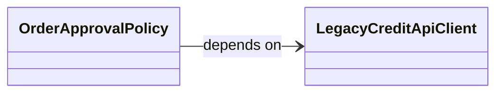
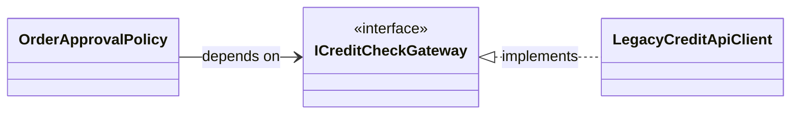
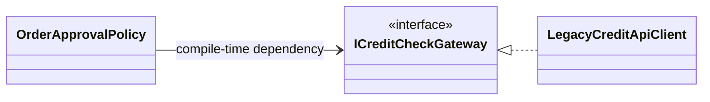
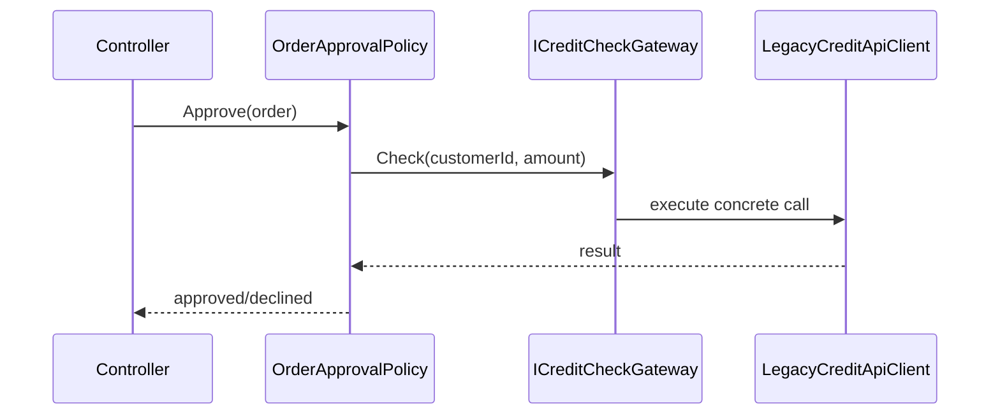
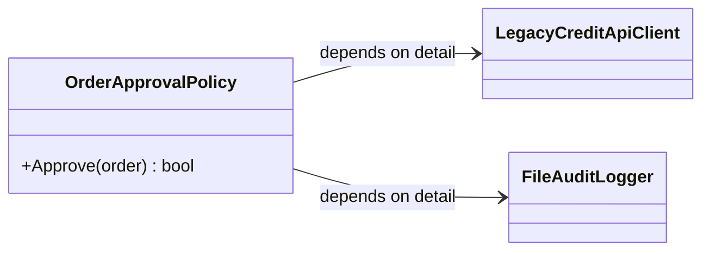
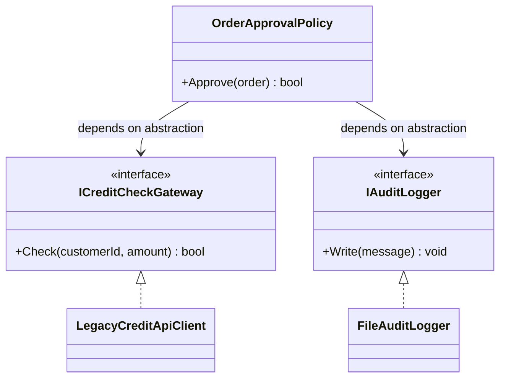
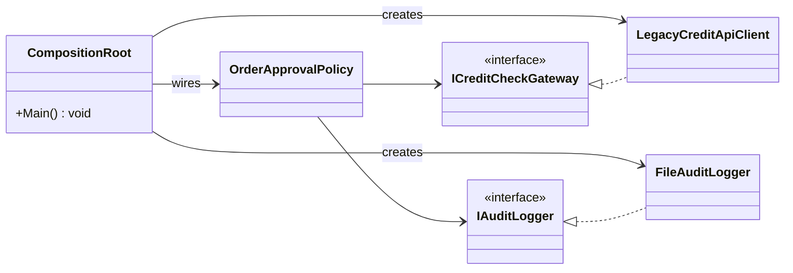

# The Dependency Inversion Principle (DIP)

The **D** in SOLI**D**

## 1. Introduction to the Dependency Inversion Principle

The Dependency Inversion Principle (DIP) is about architecture: **high-level business policy should not depend directly on low-level technical details.**

Many students start by creating dependencies directly inside consumer classes (`new` inside methods/constructors). DIP is the shift away from that habit.

We previously introduced the Composition Root (the single location where concrete dependencies are constructed and wired) mainly as a way to keep `Main` slim. Here we expand that idea: Composition Root is an architectural boundary that protects dependency direction.

We will refactor a concrete `BillingService` example from direct construction to DIP-compliant design in [Section 11](#11-refactoring-from-new-everywhere-to-dip).

Dependency Injection (DI) is the implementation mechanism and is covered in the [dependency-injection](10-dependency-injection.md) lecture.

### Common Synonyms in Practice

- "Program to interfaces"
- "Depend on contracts"
- "Dependency rule" (Clean Architecture)
- "Ports and adapters" / "Hexagonal architecture" (same directional idea at system boundaries)

## 2. Table of Contents

- [1. Introduction to the Dependency Inversion Principle](#1-introduction-to-the-dependency-inversion-principle)
- [2. Table of Contents](#2-table-of-contents)
- [3. The Two Rules of DIP](#3-the-two-rules-of-dip)
- [4. Rule #1: What Is Actually Inverted](#4-rule-1-what-is-actually-inverted)
- [5. High-Level Policy vs Low-Level Detail (Violation)](#5-high-level-policy-vs-low-level-detail-violation)
- [6. Inverting the Dependency Direction](#6-inverting-the-dependency-direction)
- [7. Composition Root in DIP (Conceptual)](#7-composition-root-in-dip-conceptual)
- [8. Rule #2: Use Stable Abstractions](#8-rule-2-use-stable-abstractions)
- [9. DIP Across SOLID](#9-dip-across-solid)
- [10. Failure Modes and Detection Matrix](#10-failure-modes-and-detection-matrix)
- [11. Refactoring from "New Everywhere" to DIP](#11-refactoring-from-new-everywhere-to-dip)
- [12. Real-World Usage and Compromises](#12-real-world-usage-and-compromises)
- [13. From DIP to Dependency Injection](#13-from-dip-to-dependency-injection)
- [14. Dependency Inversion Principle Study Guide](#14-dependency-inversion-principle-study-guide)
- [15. Out-of-Scope Appendix (Advanced)](#15-out-of-scope-appendix-advanced)

## 3. The Two Rules of DIP

DIP has two distinct rules that work together:

**Rule #1** — Module dependency direction:
> "High-level modules should not depend on low-level modules. Both should depend on abstractions."
> — Robert C. Martin

Rule #1 governs which modules depend on which. Covered in depth in [Section 4](#4-rule-1-what-is-actually-inverted).

**Rule #2** — Abstraction shape:
> "Abstractions should not depend on details. Details should depend on abstractions."
> — Robert C. Martin

Rule #2 governs whether abstractions are truly independent of implementation details. Covered in depth in [Section 8](#8-rule-2-use-stable-abstractions).

### DIP Applies to Volatile Dependencies, Not All Dependencies

A common misreading of Rule #2 — "details should depend on abstractions" — is that every concrete class needs an interface. That is not what the rule means.

DIP applies to **volatile dependencies**: those that are likely to change, cross an external boundary, or require a test seam. It does not apply to **stable dependencies**: those that are unlikely to change and that you own completely.

|  | Volatile / Apply DIP | Stable / Do not apply DIP |
| --- | :-: | :-: |
| **Likely to vary** | Provider, environment, or test | Behavior is fixed<br>e.g. standard library |
| **Crosses a boundary** | Network, file system, database, broker | Pure logic, in-process |
| **You own both sides** | External system or third-party SDK | Internal class you control |

**Example from this lecture:**
- `LegacyCreditApiClient` — volatile. It crosses an HTTP boundary, could be swapped for a different credit provider, and tests cannot call it without a live network. → Add `ICreditCheckGateway`.
- `Order` (the record) — stable. It is a plain data structure you own entirely, with no external dependency and no realistic variation. → No interface needed.

**How to judge a class you are not sure about**:

1. Does it touch anything outside the process (network, disk, clock, random)?
2. Could a different implementation plausibly exist in production (different vendor, different tenant, different environment)?
3. Would a unit test of the calling class be painful or impossible without replacing it?

*If the answer to any of these is yes, treat it as volatile.*

Rule #2 is violated when an abstraction *that exists* leaks implementation details into its shape — not when an abstraction is absent where none is needed. [Section 8](#8-rule-2-use-stable-abstractions) covers abstraction shape; the Quick Rubric there operationalizes the volatile/stable distinction.

### Dependency Direction at a Glance

Before any code, here is the core architectural shift DIP produces:

**Before DIP** — policy depends directly on infrastructure:



**After DIP** — policy depends on a policy-owned abstraction; infrastructure implements it:



Source dependencies point inward toward policy and stable abstractions — never outward toward infrastructure. In Clean Architecture this is called the **dependency rule**.

## 4. Rule #1: What Is Actually Inverted

DIP does not invert runtime execution order. It inverts **compile-time dependency direction**.

- `Compile-time dependency direction`: which source module references/imports which.
- `Runtime call flow`: who calls whom while handling a request/use case.

With DIP, runtime still reaches concrete implementations, but policy code depends only on abstractions.





Brief C# example:

```csharp
public static class Program
{
    public static void Main()
    {
        // Manual composition (no DI container/framework).
        ICreditCheckGateway creditGateway = new LegacyCreditApiClient();
        var policy = new OrderApprovalPolicy(creditGateway);
        var controller = new OrderApprovalController(policy);

        bool approved = controller.Post(new Order("ORD-1", "C-7", 200m));
        Console.WriteLine($"Approved={approved}");
    }
}

public sealed record Order(string Id, string CustomerId, decimal TotalAmount);

public sealed class OrderApprovalController
{
    // Note: depends on concrete OrderApprovalPolicy — acceptable at this thin
    // controller layer, or inject IOrderApprovalPolicy for full DIP compliance.
    private readonly OrderApprovalPolicy _policy;

    public OrderApprovalController(OrderApprovalPolicy policy)
    {
        _policy = policy;
    }

    public bool Post(Order order)
    {
        return _policy.Approve(order);
    }
}

public sealed class OrderApprovalPolicy
{
    private readonly ICreditCheckGateway _creditGateway;

    public OrderApprovalPolicy(ICreditCheckGateway creditGateway)
    {
        _creditGateway = creditGateway;
    }

    public bool Approve(Order order)
    {
        return _creditGateway.Check(order.CustomerId, order.TotalAmount);
    }
}

public interface ICreditCheckGateway
{
    bool Check(string customerId, decimal amount);
}

public sealed class LegacyCreditApiClient : ICreditCheckGateway
{
    public bool Check(string customerId, decimal amount)
    {
        return amount <= 500m;
    }
}
```

## 5. High-Level Policy vs Low-Level Detail (Violation)

- `High-level policy`: business rules and use-case orchestration.
- `Low-level detail`: infrastructure adapters, SDKs, databases, file systems, HTTP clients.

A DIP violation happens when policy code creates and binds to details directly.

```csharp
public sealed class OrderApprovalPolicy
{
    public bool Approve(Order order)
    {
        var creditClient = new LegacyCreditApiClient("https://credit.internal");
        var auditLogger = new FileAuditLogger("/var/log/order-approval.log");

        bool approved = creditClient.Check(order.CustomerId, order.TotalAmount);
        auditLogger.Write($"Order {order.Id} approved={approved}");
        return approved;
    }
}
```



Why this hurts:

- policy changes when infrastructure changes
- unit tests pull in infrastructure
- provider/vendor swaps become expensive

## 6. Inverting the Dependency Direction

Policy depends on abstractions; details implement those abstractions.

```csharp
public interface ICreditCheckGateway
{
    bool Check(string customerId, decimal amount);
}

public interface IAuditLogger
{
    void Write(string message);
}

public sealed class OrderApprovalPolicy
{
    private readonly ICreditCheckGateway _creditGateway;
    private readonly IAuditLogger _auditLogger;

    public OrderApprovalPolicy(ICreditCheckGateway creditGateway, IAuditLogger auditLogger)
    {
        _creditGateway = creditGateway;
        _auditLogger = auditLogger;
    }

    public bool Approve(Order order)
    {
        bool approved = _creditGateway.Check(order.CustomerId, order.TotalAmount);
        _auditLogger.Write($"Order {order.Id} approved={approved}");
        return approved;
    }
}

public sealed class LegacyCreditApiClient : ICreditCheckGateway
{
    public bool Check(string customerId, decimal amount)
    {
        return true;
    }
}

public sealed class FileAuditLogger : IAuditLogger
{
    public void Write(string message)
    {
    }
}
```



## 7. Composition Root in DIP (Conceptual)

Composition Root is the single application boundary where concrete implementations are created and wired to abstraction-based policy modules.

This is not just about short `Main` methods. It is where detail knowledge is intentionally localized.

```csharp
public static class Program
{
    public static void Main()
    {
        ICreditCheckGateway creditGateway = new LegacyCreditApiClient("https://credit.internal");
        IAuditLogger auditLogger = new FileAuditLogger("/var/log/order-approval.log");

        var policy = new OrderApprovalPolicy(creditGateway, auditLogger);
        bool approved = policy.Approve(new Order("ORD-42", "C-10", 120.00m));

        Console.WriteLine($"Approved={approved}");
    }
}
```



Implementation depth (containers, lifetimes, startup validation) is in [10-dependency-injection.md](10-dependency-injection.md).

## 8. Rule #2: Use Stable Abstractions

Rule #2 states:

> "Abstractions should not depend on details. Details should depend on abstractions."
> — Robert C. Martin

Rule #2 is often missed: even with interfaces, you can still violate DIP if abstractions are shaped by details.

A **stable abstraction** is one unlikely to change as implementations evolve — its shape is dictated by what the policy needs, not by how any particular technology delivers it. An unstable abstraction leaks implementation details (a technology type, a vendor concept, a framework construct) into the contract.

### Bad (Detail-Shaped Contract)

```csharp
public interface IOrderReportGateway
{
    // Raw rows and columns — leaks the relational storage mechanism into the contract
    List<Dictionary<string, object>> GetReport(string orderId);
}
```

### Better (Policy-Shaped Contract)

```csharp
public sealed record OrderReport(string OrderId, decimal Total, DateTime ApprovedAtUtc);

public interface IOrderReportGateway
{
    OrderReport Load(string orderId);
}
```

### Quick Rubric: When to Add an Abstraction

This rubric operationalizes the volatile/stable distinction introduced in [Section 3](#3-the-two-rules-of-dip).

Add one when at least one is true:

- external boundary exists (database, broker, external API)
- implementation likely changes by vendor/tenant/environment
- policy tests need seam without infrastructure

Do not add one when all are true:

- behavior is local and stable
- no realistic variation expected
- indirection adds noise without reducing risk

## 9. DIP Across SOLID

DIP is the capstone that makes the other SOLID principles composable in larger systems:

- **SRP** — When a class has one responsibility, its abstraction boundary becomes natural. An `IPaymentGateway` that handles only payment authorization does not accidentally absorb logging or auditing concerns.
- **OCP** — DIP is what enables OCP in practice: because `OrderApprovalPolicy` depends on `ICreditCheckGateway` rather than a concrete client, a new credit provider can be added without touching policy code at all.
- **LSP** — Every concrete implementation injected through a DIP abstraction must satisfy LSP. Swapping `LegacyCreditApiClient` for `StripeCreditApiClient` must not break `OrderApprovalPolicy`'s expectations about what `ICreditCheckGateway.Check` returns.
- **ISP** — Narrow, policy-shaped interfaces (ISP) are exactly the stable abstractions DIP requires. A fat interface forces policy to depend on methods it does not use, violating both ISP and DIP simultaneously.

## 10. Failure Modes and Detection Matrix

| Symptom | Likely DIP Cause | Refactoring Action |
| --- | --- | --- |
| Policy class constructs infrastructure objects | policy depends on details | extract abstraction and move creation to composition root |
| Interface changes every vendor/tool change | abstraction is detail-shaped | redesign contract using business language |
| Unit tests require DB/network | no test seam at boundary | inject abstraction and use fake implementation |
| Business layer imports framework/container APIs | boundary leakage | keep framework usage at composition/boundary layer |
| Vendor swap touches many policy files | dependency direction is still outward | re-point policy dependencies to policy-owned contracts |

## 11. Refactoring from "New Everywhere" to DIP

### Step 1: Before (Direct Construction)

```csharp
public sealed class BillingService
{
    public decimal Calculate(string customerId)
    {
        var repo = new SqlCustomerRepository("Server=prod;Database=Billing;");
        Customer customer = repo.Load(customerId);
        return customer.Balance * 1.08m;
    }
}
```

### Step 2: Transition (Introduce Contract)

```csharp
public interface ICustomerRepository
{
    Customer Load(string customerId);
}

public sealed class BillingService
{
    private readonly ICustomerRepository _customers;

    public BillingService(ICustomerRepository customers)
    {
        _customers = customers;
    }

    public decimal Calculate(string customerId)
    {
        Customer customer = _customers.Load(customerId);
        return customer.Balance * 1.08m;
    }
}
```

### Step 3: Target (Wire at Composition Root)

```csharp
ICustomerRepository customers = new SqlCustomerRepository("Server=prod;Database=Billing;");
var billing = new BillingService(customers);
```

### Tiny Test Proof

```csharp
public sealed class FakeCustomerRepository : ICustomerRepository
{
    public Customer Load(string customerId)
    {
        return new Customer(customerId, 100m);
    }
}

var billing = new BillingService(new FakeCustomerRepository());
decimal total = billing.Calculate("C-1");
Console.WriteLine(total == 108m ? "PASS" : "FAIL");
```

## 12. Real-World Usage and Compromises

These are the production boundaries where volatile dependencies most commonly appear and where applying DIP pays off most clearly — the implementation is likely to change for business reasons independent of your policy code:

- Payment gateways, tax engines, and fraud detection providers
- Storage provider migration (e.g., SQL database to a managed cloud service)
- Messaging broker replacement (e.g., swapping queue providers)
- Feature-flagged implementations per tenant or region

Practical compromises teams make:

| Compromise | Why Teams Do It | Risk | Mitigation |
| --- | --- | --- | --- |
| Retaining inline `new` construction in code being incrementally migrated to DIP | Ship incremental change quickly | Policy/detail leakage spreads before the migration completes | Isolate in an adapter or short-lived boundary class |
| Skipping abstractions on stable internal modules | Reduce abstraction overhead where variation is unlikely | Future change may be expensive if the module turns volatile | Add a seam only at proven change boundaries |
| Service-locator pattern at framework callback edges | Framework constraints prevent constructor injection | Hidden dependencies bleed into core code | Keep service-locator usage out of domain and service classes |
| Coarse-grained contracts shared across teams | Simplify API governance across team boundaries | Interface bloat and weak ISP compliance | Split contracts by use case over time |

## 13. From DIP to Dependency Injection

DIP defines the *principle*: high-level modules depend on abstractions, not details. What it does not specify is *how* concrete implementations get constructed and connected at runtime. In this lecture that responsibility has lived in a hand-written Composition Root — a few lines in `Main` that call `new` and pass dependencies through constructors.

That approach works well for small programs. As a codebase grows, manual wiring becomes verbose and hard to maintain: constructor chains lengthen, lifetime management must be tracked by hand, and swapping an implementation requires hunting through `Main` to update every construction site.

**Dependency Injection (DI)** is the mechanism that automates this wiring. A DI container:

- Reads the constructor signatures of your classes and resolves the full object graph automatically
- Manages object lifetimes (transient, scoped, singleton) according to configuration
- Validates that every registered dependency can be satisfied at startup, catching missing registrations before the first request

DIP makes DI possible: because policy classes depend only on interfaces, a container can substitute any registered implementation without the policy class knowing. DI makes DIP practical at scale: you configure the bindings once and the container handles construction everywhere.

The next lecture covers containers, lifetime management, and startup validation in depth: [Dependency Injection](10-dependency-injection.md).

## 14. Dependency Inversion Principle Study Guide

### Key Terms

**Principle and rules**

- `DIP (Dependency Inversion Principle)`: the **D** in SOLID; two rules governing module dependency direction and abstraction shape.
- `Rule #1`: "High-level modules should not depend on low-level modules. Both should depend on abstractions." Governs which modules depend on which.
- `Rule #2`: "Abstractions should not depend on details. Details should depend on abstractions." Governs whether an abstraction's shape is independent of implementation technology.
- `Inversion`: DIP does not invert runtime execution order — it inverts compile-time dependency direction. Policy no longer points at a detail; both point at a shared abstraction.

**Dependencies**

- `High-level policy`: business rule and use-case orchestration code (e.g., `OrderApprovalPolicy`).
- `Low-level detail`: infrastructure adapter — database, HTTP client, file system, message broker, third-party SDK (e.g., `LegacyCreditApiClient`).
- `Compile-time dependency direction`: which source module imports or references which at build time. DIP controls this direction.
- `Runtime call flow`: which objects call which methods at execution time. DIP does not change this — concrete implementations are still reached at runtime via the abstraction.
- `Volatile dependency`: a dependency that crosses an external boundary, is likely to vary across environments/vendors/tests, or requires a test seam. DIP applies here.
- `Stable dependency`: a dependency with fixed behavior, entirely in-process, and fully owned. No abstraction needed (e.g., standard-library collections, pure-logic helpers like `Order`).

**Abstractions**

- `Abstraction`: a contract (interface or abstract class) whose shape is independent of any implementation mechanism.
- `Policy-owned abstraction`: an interface owned and defined by the policy layer — its name and method signatures use business language, not technology terms (e.g., `ICreditCheckGateway`, not `ISqlCreditTable`).
- `Stable abstraction`: an abstraction unlikely to change as implementations evolve — its shape is dictated by what the policy needs, not by how any technology delivers it.
- `Detail-shaped contract`: an abstraction that leaks implementation technology into its shape, violating Rule #2 (e.g., `List<Dictionary<string, object>> GetReport(...)` exposes the relational storage model).

**Architecture**

- `Composition Root`: the single application boundary where concrete implementations are created and wired to abstraction-based consumers. All knowledge of concrete detail classes is intentionally localized here.
- `Dependency rule`: Robert C. Martin's Clean Architecture term for the same directional constraint — source-code dependencies point inward toward policy, never outward toward infrastructure.
- `Test seam`: the injection point created by a DIP abstraction that allows a test double to replace real infrastructure in unit tests without changing policy code.
- `Test double / fake`: a lightweight, in-process implementation of a DIP abstraction used in tests in place of the production infrastructure class (e.g., `FakeCustomerRepository`).

**Dependency Injection (preview — covered in §13 and the next lecture)**

- `DI container`: a framework that reads constructor signatures and resolves the full object graph automatically, replacing hand-written Composition Root wiring.
- `Lifetime management`: the container's responsibility to control how long each registered instance lives — transient, scoped, or singleton.
- `Startup validation`: the container's ability to verify that every registered dependency can be satisfied before handling the first request, catching missing registrations early.

---

### Concepts to Distinguish

| Concept A | Concept B | How to distinguish |
| --- | --- | --- |
| Compile-time dependency direction | Runtime call flow | Source imports vs. who calls whom at execution time — DIP inverts the first, not the second |
| Rule #1 violation | Rule #2 violation | Rule #1: policy module imports a detail. Rule #2: the abstraction itself leaks implementation details into its shape |
| Volatile dependency | Stable dependency | Three questions: external boundary? production variation? test pain? — yes to any → volatile; apply DIP |
| Stable abstraction | Stable dependency | A stable *abstraction* is a well-shaped interface; a stable *dependency* is a concrete class that needs no interface at all |
| Composition Root (pattern) | DI container (mechanism) | Composition Root is the architectural pattern (where wiring lives); a DI container is a framework that automates it |
| DIP (principle) | DI (mechanism) | DIP states the dependency direction rule; DI is the implementation technique that satisfies it at scale |

---

### Recall Prompts

1. State Rule #1 and Rule #2 verbatim. Explain in one sentence what each governs.
2. DIP is described as inverting dependencies. What exactly is inverted — and what is *not*?
3. Walk through the three-step `BillingService` refactoring pattern. Name the action taken at each step and what responsibility moves where.
4. Your team writes `ISqlRepository` with a method signature `ExecuteQuery(string sql)`. Which DIP rule does this violate and why?
5. A colleague says "every class needs an interface because Rule #2 says details should depend on abstractions." How do you respond using the volatile/stable distinction?
6. Name the three judgment questions for classifying a dependency as volatile. Give one concrete example that answers yes to each.
7. A unit test for `OrderApprovalPolicy` spins up a real HTTP credit-check server. Which failure mode from the detection matrix does this represent? What is the corrective action?
8. Explain how DIP enables OCP in practice using the `OrderApprovalPolicy` / `ICreditCheckGateway` example.
9. Why must every concrete implementation injected through a DIP abstraction satisfy LSP?
10. Describe the relationship between ISP and DIP. What happens to both principles when a single interface is too broad?
11. Identify the DIP failure mode and its corrective action for each symptom: (a) policy class calls `new SqlOrderRepo()` in a method body; (b) `IPaymentGateway` has a method `ExecuteStripeCharge(StripeRequest)`; (c) business layer references `Microsoft.Extensions.DependencyInjection`; (d) replacing a vendor requires changes across ten policy files.
12. What is a DI container, and why does DIP make DI possible?
13. What is startup validation, and what class of defect does it catch before production traffic reaches the application?

---

### Quick Checklist

**I understand the principle**
- [ ] I can state both DIP rules verbatim and explain what each one governs.
- [ ] I can distinguish compile-time dependency direction from runtime call flow.
- [ ] I can explain what is "inverted" in Dependency Inversion — and what is not.

**I can classify dependencies**
- [ ] I can apply the three volatility questions to an unfamiliar class and classify it as volatile or stable.
- [ ] I can identify a detail-shaped abstraction (Rule #2 violation) even when an interface is present.
- [ ] I can explain why `Order` (a plain data record) needs no interface while `LegacyCreditApiClient` does.

**I can apply the principle**
- [ ] I can distinguish policy code from detail code in a given class.
- [ ] I can name the three steps of the DIP refactoring pattern and explain what moves at each step.
- [ ] I can place all construction and wiring at the Composition Root and explain why detail knowledge belongs there.
- [ ] I can write a test fake (e.g., `FakeCustomerRepository`) and explain why it works only because of DIP.

**I can detect violations**
- [ ] I can recognize each of the five failure modes from the detection matrix given only a symptom.
- [ ] I can propose a corrective refactoring action for each failure mode.

**I can connect to other concepts**
- [ ] I can explain how DIP enables OCP, requires LSP, and reinforces ISP — with a concrete example for each.
- [ ] I can explain the distinction between DIP (the principle) and DI (the mechanism).
- [ ] I can describe what a DI container adds beyond a hand-written Composition Root.

## 15. Out-of-Scope Appendix (Advanced)

These topics are intentionally beyond core lecture scope but useful for advanced students:

- Architecture rule enforcement in CI (e.g., layer/dependency tests).
- Contract tests for abstraction boundaries (to protect substitutability).
- Anti-corruption layers for legacy/vendor integration.
- Plugin/module systems where implementations are discovered at runtime.
- Large-scale ports/adapters organization in multi-team codebases.
