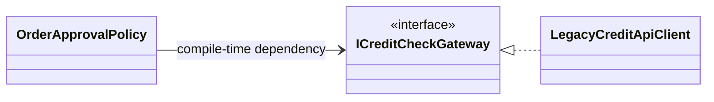
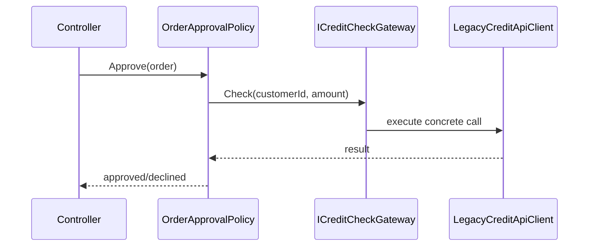
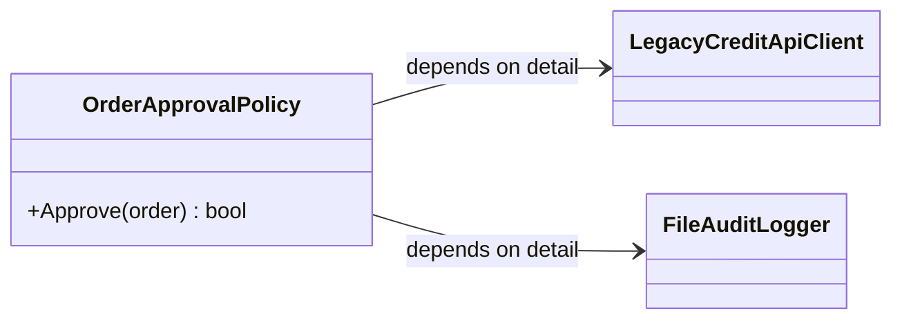
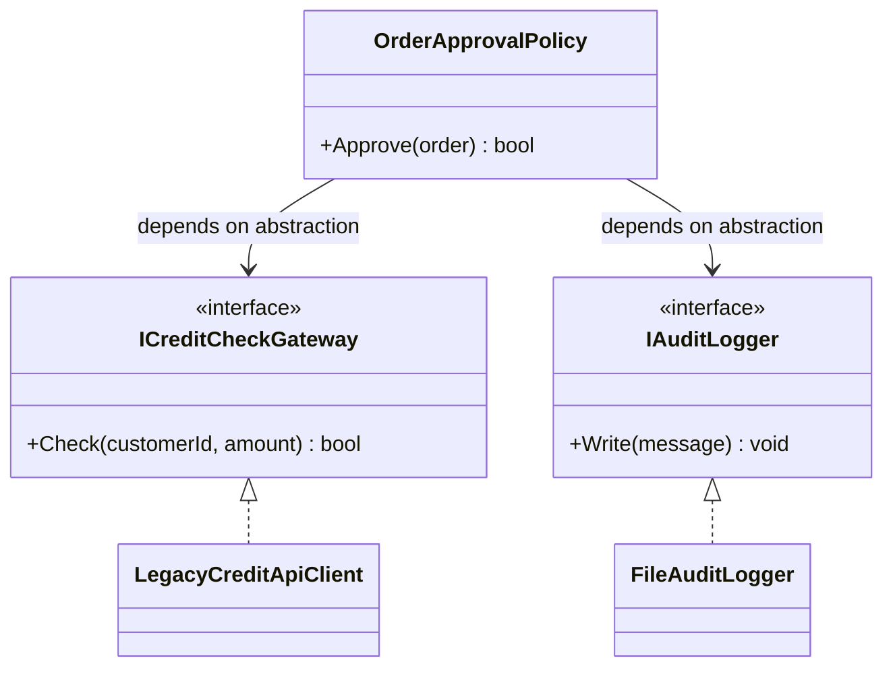
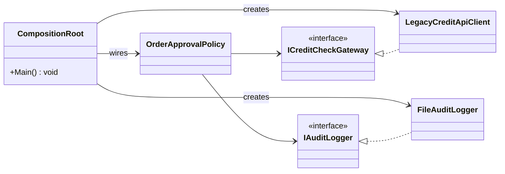
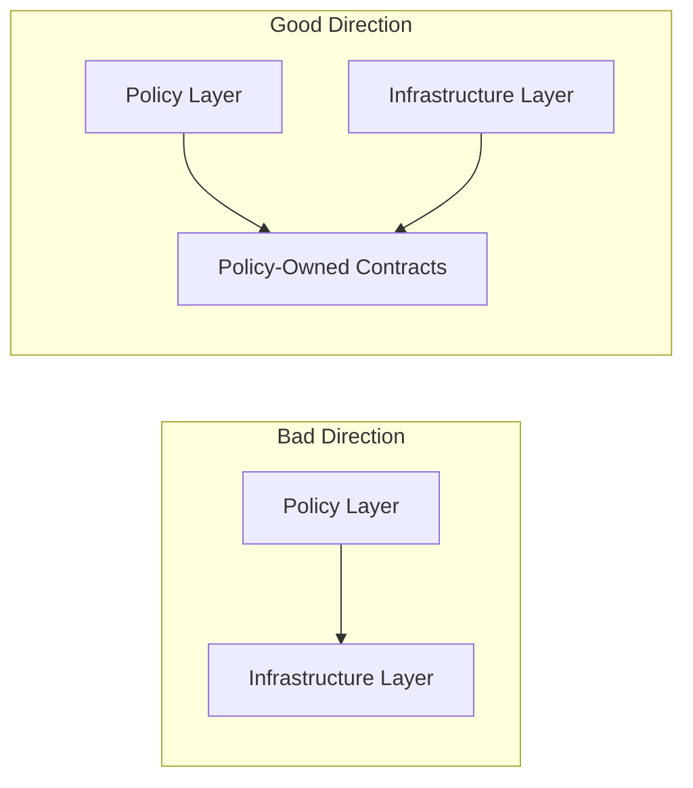

# The Dependency Inversion Principle (DIP)

The **D** in SOLI**D**

## 1. Introduction to the Dependency Inversion Principle

The Dependency Inversion Principle (DIP) is about architecture: high-level business policy should not depend directly on low-level technical details.

Many students start by creating dependencies directly inside consumer classes (`new` inside methods/constructors). DIP is the shift away from that habit.

We previously introduced Composition Root mainly as a way to keep `Main` slim. Here we expand that idea: Composition Root is an architectural boundary that protects dependency direction.

Dependency Injection (DI) is the implementation mechanism and is covered in the [dependency-injection](10-dependency-injection.md) lecture.

### Canonical Definitions

> "High-level modules should not depend on low-level modules. Both should depend on abstractions."
> - Robert C. Martin

> "Abstractions should not depend on details. Details should depend on abstractions."
> - Robert C. Martin

### Common Synonyms in Practice

- "Program to interfaces"
- "Depend on contracts"
- "Dependency rule" (Clean Architecture)
- "Ports and adapters" / "Hexagonal architecture" (same directional idea at system boundaries)

## 2. Table of Contents

- [1. Introduction to the Dependency Inversion Principle](#1-introduction-to-the-dependency-inversion-principle)
- [2. Table of Contents](#2-table-of-contents)
- [3. What Is Actually Inverted](#3-what-is-actually-inverted)
- [4. High-Level Policy vs Low-Level Detail (Violation)](#4-high-level-policy-vs-low-level-detail-violation)
- [5. Inverting the Dependency Direction](#5-inverting-the-dependency-direction)
- [6. Composition Root in DIP (Conceptual)](#6-composition-root-in-dip-conceptual)
- [7. Rule #2 and Stable Abstractions](#7-rule-2-and-stable-abstractions)
- [8. Layer-Level Dependency Direction](#8-layer-level-dependency-direction)
- [9. DIP Across SOLID](#9-dip-across-solid)
- [10. Failure Modes and Detection Matrix](#10-failure-modes-and-detection-matrix)
- [11. Refactoring from "New Everywhere" to DIP](#11-refactoring-from-new-everywhere-to-dip)
- [12. Real-World Usage and Compromises](#12-real-world-usage-and-compromises)
- [13. Dependency Inversion Principle Study Guide](#13-dependency-inversion-principle-study-guide)
- [14. Out-of-Scope Appendix (Advanced)](#14-out-of-scope-appendix-advanced)

## 3. What Is Actually Inverted

DIP does not invert runtime execution order. It inverts **compile-time dependency direction**.

- `Compile-time dependency direction`: which source module references/imports which.
- `Runtime call flow`: who calls whom while handling a request/use case.

With DIP, runtime still reaches concrete implementations, but policy code depends only on abstractions.





## 4. High-Level Policy vs Low-Level Detail (Violation)

- `High-level policy`: business rules and use-case orchestration.
- `Low-level detail`: infrastructure adapters, SDKs, databases, file systems, HTTP clients.

A DIP violation happens when policy code creates and binds to details directly.

```csharp
public sealed class OrderApprovalPolicy
{
    public bool Approve(Order order)
    {
        var creditClient = new LegacyCreditApiClient("https://credit.internal");
        var auditLogger = new FileAuditLogger("/var/log/order-approval.log");

        bool approved = creditClient.Check(order.CustomerId, order.TotalAmount);
        auditLogger.Write($"Order {order.Id} approved={approved}");
        return approved;
    }
}
```



Why this hurts:

- policy changes when infrastructure changes
- unit tests pull in infrastructure
- provider/vendor swaps become expensive

## 5. Inverting the Dependency Direction

Policy depends on abstractions; details implement those abstractions.

```csharp
public interface ICreditCheckGateway
{
    bool Check(string customerId, decimal amount);
}

public interface IAuditLogger
{
    void Write(string message);
}

public sealed class OrderApprovalPolicy
{
    private readonly ICreditCheckGateway _creditGateway;
    private readonly IAuditLogger _auditLogger;

    public OrderApprovalPolicy(ICreditCheckGateway creditGateway, IAuditLogger auditLogger)
    {
        _creditGateway = creditGateway;
        _auditLogger = auditLogger;
    }

    public bool Approve(Order order)
    {
        bool approved = _creditGateway.Check(order.CustomerId, order.TotalAmount);
        _auditLogger.Write($"Order {order.Id} approved={approved}");
        return approved;
    }
}

public sealed class LegacyCreditApiClient : ICreditCheckGateway
{
    public bool Check(string customerId, decimal amount)
    {
        return true;
    }
}

public sealed class FileAuditLogger : IAuditLogger
{
    public void Write(string message)
    {
    }
}
```



## 6. Composition Root in DIP (Conceptual)

Composition Root is the single application boundary where concrete implementations are created and wired to abstraction-based policy modules.

This is not just about short `Main` methods. It is where detail knowledge is intentionally localized.

```csharp
public static class Program
{
    public static void Main()
    {
        ICreditCheckGateway creditGateway = new LegacyCreditApiClient("https://credit.internal");
        IAuditLogger auditLogger = new FileAuditLogger("/var/log/order-approval.log");

        var policy = new OrderApprovalPolicy(creditGateway, auditLogger);
        bool approved = policy.Approve(new Order("ORD-42", "C-10", 120.00m));

        Console.WriteLine($"Approved={approved}");
    }
}
```



Implementation depth (containers, lifetimes, startup validation) is in [10-dependency-injection.md](10-dependency-injection.md).

## 7. Rule #2 and Stable Abstractions

Rule #2 is often missed: even with interfaces, you can still violate DIP if abstractions are shaped by details.

### Bad (Detail-Shaped Contract)

```csharp
using System.Data;

public interface IOrderReportGateway
{
    DataTable GetReport(string orderId);
}
```

### Better (Policy-Shaped Contract)

```csharp
public sealed record OrderReport(string OrderId, decimal Total, DateTime ApprovedAtUtc);

public interface IOrderReportGateway
{
    OrderReport Load(string orderId);
}
```

### Quick Rubric: When to Add an Abstraction

Add one when at least one is true:

- external boundary exists (database, broker, external API)
- implementation likely changes by vendor/tenant/environment
- policy tests need seam without infrastructure

Do not add one when all are true:

- behavior is local and stable
- no realistic variation expected
- indirection adds noise without reducing risk

## 8. Layer-Level Dependency Direction

The most teachable architecture view is arrows between layers.



In Clean Architecture terms, this is the dependency rule: source dependencies point inward toward policy/stable abstractions.

## 9. DIP Across SOLID

- `SRP`: overgrown services often show unstable or mixed abstraction boundaries.
- `OCP`: new implementations can be added without rewriting policy classes.
- `LSP`: substitutes must honor abstraction contracts.
- `ISP`: narrower contracts reduce accidental coupling.

## 10. Failure Modes and Detection Matrix

| Symptom | Likely DIP Cause | Refactoring Action |
| --- | --- | --- |
| Policy class constructs infrastructure objects | policy depends on details | extract abstraction and move creation to composition root |
| Interface changes every vendor/tool change | abstraction is detail-shaped | redesign contract using business language |
| Unit tests require DB/network | no test seam at boundary | inject abstraction and use fake implementation |
| Business layer imports framework/container APIs | boundary leakage | keep framework usage at composition/boundary layer |
| Vendor swap touches many policy files | dependency direction is still outward | re-point policy dependencies to policy-owned contracts |

## 11. Refactoring from "New Everywhere" to DIP

### Step 1: Before (Direct Construction)

```csharp
public sealed class BillingService
{
    public decimal Calculate(string customerId)
    {
        var repo = new SqlCustomerRepository("Server=prod;Database=Billing;");
        Customer customer = repo.Load(customerId);
        return customer.Balance * 1.08m;
    }
}
```

### Step 2: Transition (Introduce Contract)

```csharp
public interface ICustomerRepository
{
    Customer Load(string customerId);
}

public sealed class BillingService
{
    private readonly ICustomerRepository _customers;

    public BillingService(ICustomerRepository customers)
    {
        _customers = customers;
    }

    public decimal Calculate(string customerId)
    {
        Customer customer = _customers.Load(customerId);
        return customer.Balance * 1.08m;
    }
}
```

### Step 3: Target (Wire at Composition Root)

```csharp
ICustomerRepository customers = new SqlCustomerRepository("Server=prod;Database=Billing;");
var billing = new BillingService(customers);
```

### Tiny Test Proof

```csharp
public sealed class FakeCustomerRepository : ICustomerRepository
{
    public Customer Load(string customerId)
    {
        return new Customer(customerId, 100m);
    }
}

var billing = new BillingService(new FakeCustomerRepository());
decimal total = billing.Calculate("C-1");
Console.WriteLine(total == 108m ? "PASS" : "FAIL");
```

## 12. Real-World Usage and Compromises

Common industry use cases:

- payment gateways, tax engines, and fraud providers
- storage provider migration (SQL to managed service)
- messaging broker replacement
- feature-flagged implementations per tenant or region

Practical compromises teams make:

| Compromise | Why Teams Do It | Risk | Mitigation |
| --- | --- | --- | --- |
| temporary direct `new` in migration code | ship incremental change quickly | policy/detail leakage spreads | isolate in adapter or short-lived boundary class |
| limited interface use in stable modules | reduce abstraction overhead | future change may be expensive | add seam only at proven change boundaries |
| service-locator style at framework callback edge | framework constraints | hidden dependencies in core code | keep locator usage out of domain/services |
| coarse-grained contracts across teams | simplify API governance | interface bloat and weak ISP | split contracts by use case over time |

## 13. Dependency Inversion Principle Study Guide

### Core Definitions

- `DIP`: high-level and low-level modules depend on abstractions.
- `Abstraction`: contract independent of implementation mechanism.
- `High-level policy`: business rule/use-case logic.
- `Low-level detail`: technical implementation mechanism.
- `Composition Root`: boundary that wires concrete implementations.

### Exam-Focused Recall Prompts

1. Explain DIP in one sentence and define what is inverted.
2. Distinguish compile-time dependency direction from runtime call flow.
3. Give one Rule #2 violation where an interface still leaks details.
4. Explain why Composition Root supports DIP.
5. Describe one realistic migration from direct `new` to DIP-compliant design.

### Quick Checklist

- I can identify policy code vs detail code.
- I can spot detail leakage in interfaces.
- I can place construction/wiring at composition root.
- I can propose a staged DIP refactor from existing code.

## 14. Out-of-Scope Appendix (Advanced)

These topics are intentionally beyond core lecture scope but useful for advanced students:

- Architecture rule enforcement in CI (e.g., layer/dependency tests).
- Contract tests for abstraction boundaries (to protect substitutability).
- Anti-corruption layers for legacy/vendor integration.
- Plugin/module systems where implementations are discovered at runtime.
- Large-scale ports/adapters organization in multi-team codebases.
