# Dependency Injection (DI): Applying DIP in Practice

## 1. Introduction to Dependency Injection

Dependency Injection (DI) is the technique of supplying a class with the collaborators it needs instead of creating those collaborators inside the class.

- `DIP` defines the architectural rule (depend on abstractions).
- `DI` operationalizes that rule at runtime by building and wiring object graphs.

In other words, DI is not the principle itself; DI is how teams automate and scale DIP in real systems.

Earlier in the course, Composition Root was introduced mostly as a way to keep `Main` short. In this lecture, we expand that understanding: Composition Root is the operational control point where DI policies are enforced for the full object graph.

### Canonical Definition

> Dependency Injection: an object receives required collaborators from outside itself instead of creating them internally.

### Quick Before-and-After

```csharp
public sealed class OrderApprovalPolicy
{
    public bool Approve(Order order)
    {
        var credit = new LegacyCreditApiClient("https://credit.internal");
        var audit = new FileAuditLogger("/var/log/order-approval.log");

        bool approved = credit.Check(order.CustomerId, order.TotalAmount);
        audit.Write($"Order {order.Id} approved={approved}");
        return approved;
    }
}
```

```csharp
public interface ICreditCheckGateway
{
    bool Check(string customerId, decimal amount);
}

public interface IAuditLogger
{
    void Write(string message);
}

public sealed class OrderApprovalPolicy
{
    private readonly ICreditCheckGateway _credit;
    private readonly IAuditLogger _audit;

    public OrderApprovalPolicy(ICreditCheckGateway credit, IAuditLogger audit)
    {
        _credit = credit;
        _audit = audit;
    }

    public bool Approve(Order order)
    {
        bool approved = _credit.Check(order.CustomerId, order.TotalAmount);
        _audit.Write($"Order {order.Id} approved={approved}");
        return approved;
    }
}

// Composition root
var policy = new OrderApprovalPolicy(
    new LegacyCreditApiClient("https://credit.internal"),
    new FileAuditLogger("/var/log/order-approval.log"));
```

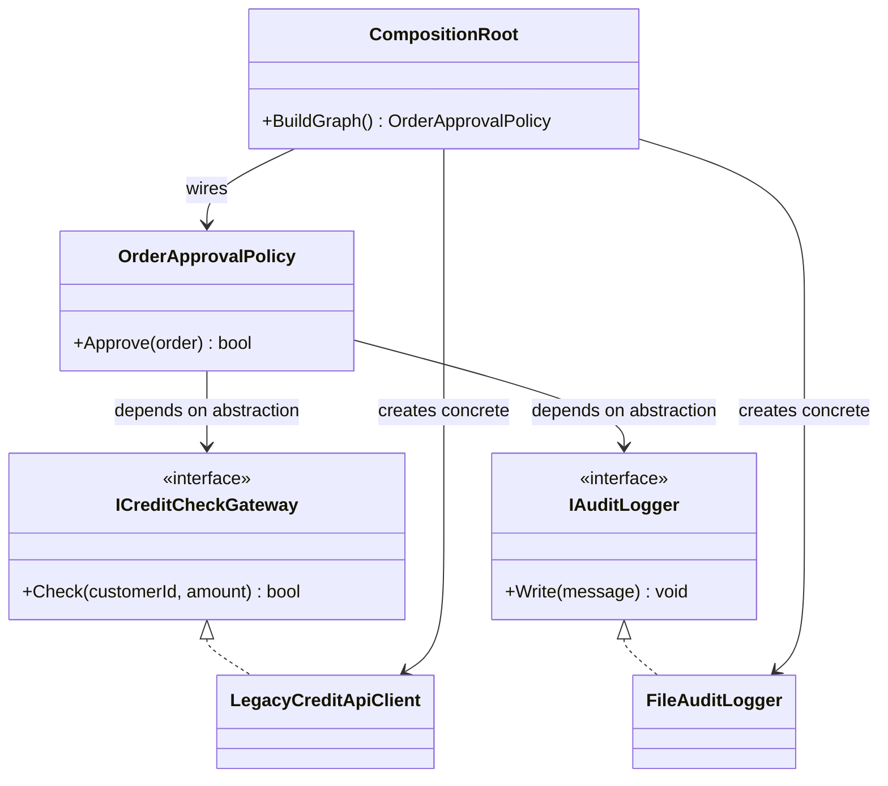

## 2. Table of Contents

- [1. Introduction to Dependency Injection](#1-introduction-to-dependency-injection)
- [2. Table of Contents](#2-table-of-contents)
- [3. DI and DIP (Relationship Map)](#3-di-and-dip-relationship-map)
- [4. Core Mechanics: Object Graphs and Constructor Injection](#4-core-mechanics-object-graphs-and-constructor-injection)
- [5. Composition Root Deep Dive](#5-composition-root-deep-dive)
- [6. Manual Dependency Injection (No Container)](#6-manual-dependency-injection-no-container)
- [7. DI Containers Conceptually (How Framework DI Works)](#7-di-containers-conceptually-how-framework-di-works)
- [8. C# Demo: Microsoft.Extensions.DependencyInjection in a Console App](#8-c-demo-microsoftextensionsdependencyinjection-in-a-console-app)
- [9. Anti-Patterns and Failure Modes](#9-anti-patterns-and-failure-modes)
- [10. Factory and Abstract Factory with DI](#10-factory-and-abstract-factory-with-di)
- [11. Real-World Summary](#11-real-world-summary)
- [12. Dependency Injection Study Guide](#12-dependency-injection-study-guide)

## 3. DI and DIP (Relationship Map)

### DI vs DIP: Technique and Principle

- `DIP` is the architectural principle: high-level policy depends on abstractions.
- `DI` is the delivery mechanism: collaborators are provided from outside.
- You can apply DIP without a container (manual DI).
- You can use a container and still violate DIP if abstractions are weak.

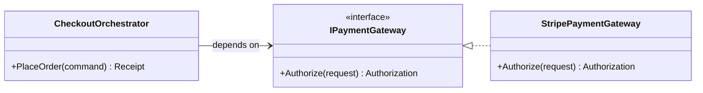

### SOLID Relationship Map

- `SRP`: constructor bloat often reveals mixed responsibilities.
- `OCP`: DI enables implementation swaps while policy remains stable.
- `LSP`: replacement implementations must honor contract behavior.
- `ISP`: narrow interfaces produce cleaner DI graphs and less coupling.

What DI does not automatically fix:

- poor domain boundaries
- unstable abstractions
- transactional consistency design mistakes

## 4. Core Mechanics: Object Graphs and Constructor Injection

### Object Graphs: DI at Runtime

An object graph is the runtime network of objects and their dependencies for one process/request/job.

In an order-processing service, a root object often needs:

- persistence (`IOrderRepository`)
- policy (`IPricingPolicy`)
- time source (`IClock`)
- telemetry (`ILogger`)

### Constructor Injection: Dependencies Become Explicit

Constructor injection means a class cannot be created without required collaborators.

Technical effects:

- explicit contract in the constructor signature
- fail-fast behavior during composition/resolution
- easier testing by passing fakes directly

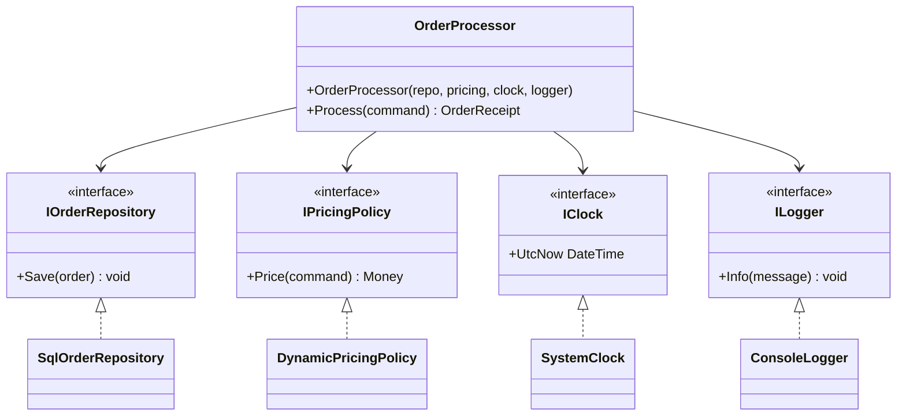

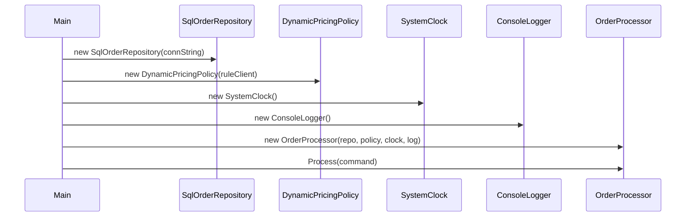

## 5. Composition Root Deep Dive

Composition Root is where an application decides how abstractions map to concrete implementations. It is the boundary where object-graph construction is centralized and controlled.

### Why This Is More Than a "Slim Main"

Keeping `Main` short is a formatting concern. Composition Root is an architectural concern:

- it controls dependency direction at runtime
- it enforces lifetime and ownership rules
- it keeps framework/infrastructure mechanics out of domain code
- it provides one auditable place for wiring decisions

### Responsibilities of the Composition Root

- register or create concrete implementations
- compose root services and transitive dependencies
- validate startup wiring where possible
- keep business decisions out of composition logic

### What Should Not Be in Composition Root

- business rules and orchestration logic
- ad hoc per-feature service lookup in domain classes
- scattered "mini roots" throughout feature code

### C# Manual Composition Example

```csharp
public static class Program
{
    public static void Main()
    {
        ICreditCheckGateway creditGateway = new LegacyCreditApiClient("https://credit.internal");
        IAuditLogger auditLogger = new FileAuditLogger("/var/log/order-approval.log");

        var approvalPolicy = new OrderApprovalPolicy(creditGateway, auditLogger);

        bool approved = approvalPolicy.Approve(new Order("ORD-1001", "C-9", 120.00m));
        Console.WriteLine($"Approved={approved}");
    }
}
```

### Java Manual Composition Example

```java
import java.math.BigDecimal;

public final class Main {
    public static void main(String[] args) {
        CreditCheckGateway creditGateway = new LegacyCreditApiClient("https://credit.internal");
        AuditLogger auditLogger = new FileAuditLogger("/var/log/order-approval.log");

        OrderApprovalPolicy approvalPolicy = new OrderApprovalPolicy(creditGateway, auditLogger);

        boolean approved = approvalPolicy.approve(new Order("ORD-1001", "C-9", new BigDecimal("120.00")));
        System.out.println("Approved=" + approved);
    }
}
```

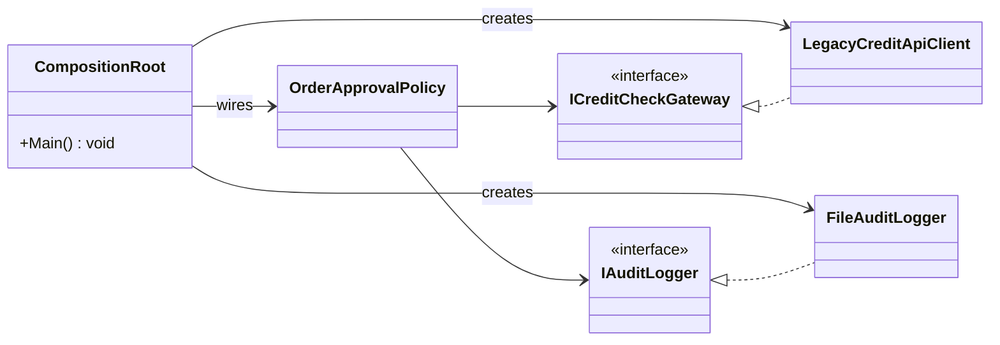

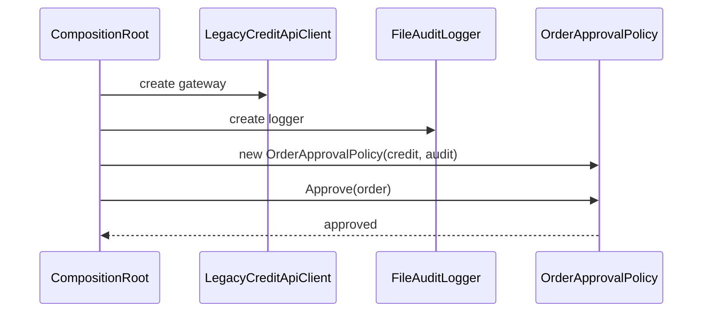

### Boundary Rule

Use one composition root per application boundary:

- console app entry point
- web host startup
- worker service startup
- test harness bootstrap

This gives predictable wiring, easier diagnostics, and clean dependency boundaries.

## 6. Manual Dependency Injection (No Container)

### Scenario: Order Ingestion Pipeline

A batch pipeline ingests marketplace orders, enriches with pricing rules, and stores normalized orders.

### 1) BAD Version: Tight Coupling and Direct Instantiation

```csharp
public sealed class OrderIngestionService
{
    public void Ingest(OrderMessage message)
    {
        var repository = new SqlOrderRepository("Server=prod;Database=Orders;");
        var pricing = new DynamicPricingPolicy(new TaxRulesHttpClient("https://tax-rules.internal"));
        var clock = new SystemClock();
        var logger = new ConsoleLogger();

        decimal total = pricing.CalculateTotal(message);
        var order = Order.Create(message.OrderId, message.CustomerId, total, clock.UtcNow);

        repository.Save(order);
        logger.Info($"Ingested order {order.Id}");
    }
}
```

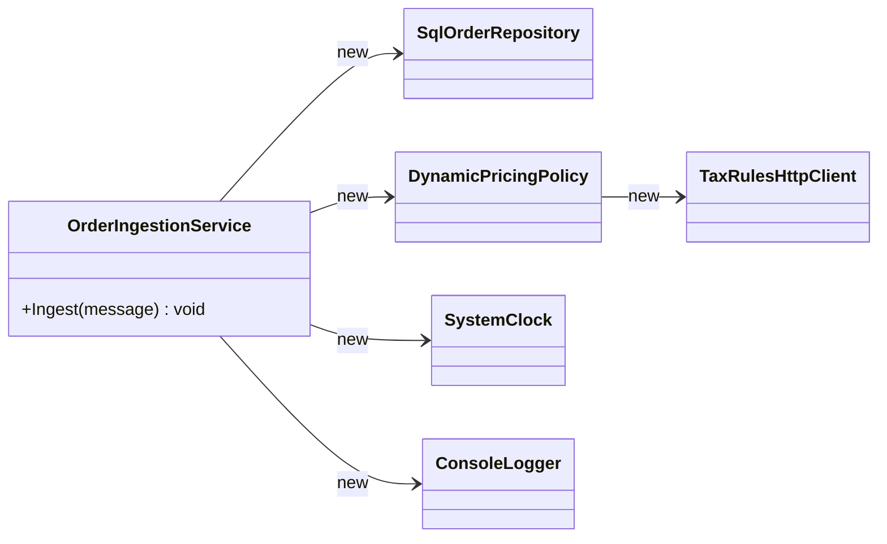

### 2) REFACTORED Version: Constructor Injection with Interfaces

```csharp
public interface IOrderRepository
{
    void Save(Order order);
}

public interface IPricingPolicy
{
    decimal CalculateTotal(OrderMessage message);
}

public interface IClock
{
    DateTime UtcNow { get; }
}

public interface ILogger
{
    void Info(string message);
}

public sealed class OrderIngestionService
{
    private readonly IOrderRepository _repository;
    private readonly IPricingPolicy _pricing;
    private readonly IClock _clock;
    private readonly ILogger _logger;

    public OrderIngestionService(
        IOrderRepository repository,
        IPricingPolicy pricing,
        IClock clock,
        ILogger logger)
    {
        _repository = repository;
        _pricing = pricing;
        _clock = clock;
        _logger = logger;
    }

    public void Ingest(OrderMessage message)
    {
        decimal total = _pricing.CalculateTotal(message);
        var order = Order.Create(message.OrderId, message.CustomerId, total, _clock.UtcNow);

        _repository.Save(order);
        _logger.Info($"Ingested order {order.Id}");
    }
}
```

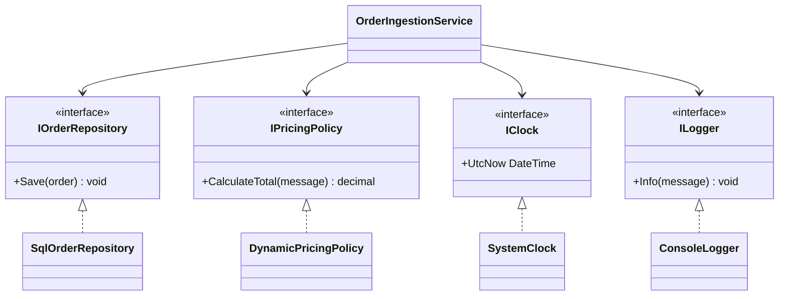

### 3) Composition Root in `Main()`

```csharp
public static class Program
{
    public static void Main()
    {
        IOrderRepository repository = new SqlOrderRepository("Server=prod;Database=Orders;");
        var taxClient = new TaxRulesHttpClient("https://tax-rules.internal");
        IPricingPolicy pricing = new DynamicPricingPolicy(taxClient);
        IClock clock = new SystemClock();
        ILogger logger = new ConsoleLogger();

        var ingestion = new OrderIngestionService(repository, pricing, clock, logger);

        var message = new OrderMessage("ORD-10291", "C-8841", 149.99m, "US");
        ingestion.Ingest(message);
    }
}
```

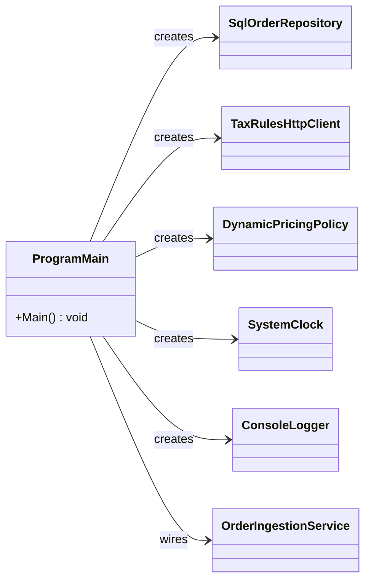

### Why This Is Better

Manual DI improves production quality by:

- `Testability`: business logic can be tested with in-memory fakes.
- `Change isolation`: infrastructure swaps do not require policy class edits.
- `Explicit dependencies`: constructor signatures document operational requirements.

### Testing Without a Mocking Framework

```csharp
public sealed class FakeOrderRepository : IOrderRepository
{
    public readonly List<Order> Saved = new();

    public void Save(Order order) => Saved.Add(order);
}

public sealed class FixedClock : IClock
{
    public DateTime UtcNow { get; } = new DateTime(2026, 2, 1, 0, 0, 0, DateTimeKind.Utc);
}

public sealed class FlatPricingPolicy : IPricingPolicy
{
    public decimal CalculateTotal(OrderMessage message) => 100m;
}

public sealed class CollectingLogger : ILogger
{
    public readonly List<string> Messages = new();

    public void Info(string message) => Messages.Add(message);
}

// Test sketch
var repo = new FakeOrderRepository();
var pricing = new FlatPricingPolicy();
var clock = new FixedClock();
var logger = new CollectingLogger();

var sut = new OrderIngestionService(repo, pricing, clock, logger);
sut.Ingest(new OrderMessage("ORD-1", "C-1", 10m, "US"));

Console.WriteLine(repo.Saved.Count == 1 ? "PASS" : "FAIL");
```

## 7. DI Containers Conceptually (How Framework DI Works)

A DI container is one tool for scaling DI. Conceptually, it does five things:

- `Registration`: map service type to implementation/factory.
- `Lifetime`: define reuse rules (transient/scoped/singleton).
- `Resolution`: build requested object and its dependencies.
- `Constructor selection`: choose a usable constructor and resolve parameters.
- `Cycle detection`: fail when dependency graphs loop.

### Lifetime and Scope in Practice

- `Transient`: new instance every resolution.
- `Scoped`: one instance per scope (in ASP.NET Core, typically one per request).
- `Singleton`: one instance for application lifetime.

Common failure pattern: singleton captures scoped dependency and holds stale/request-specific state.

Registration happens first:

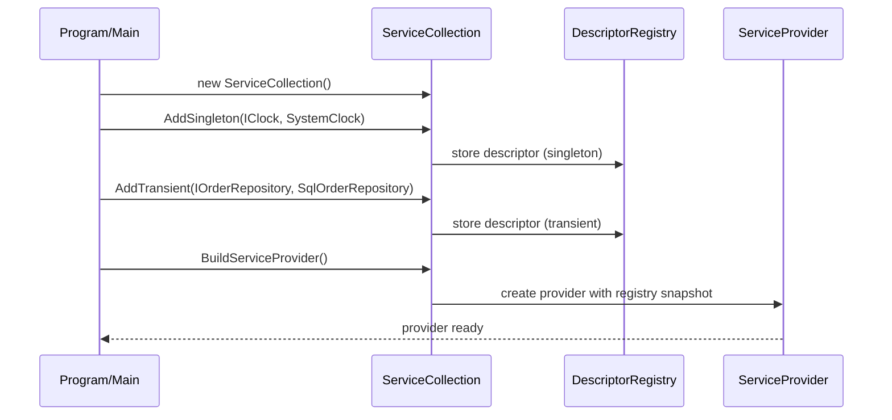

Then resolution uses those registrations:

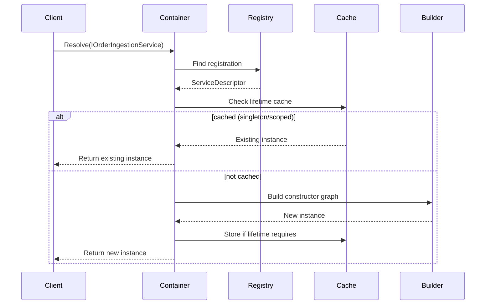

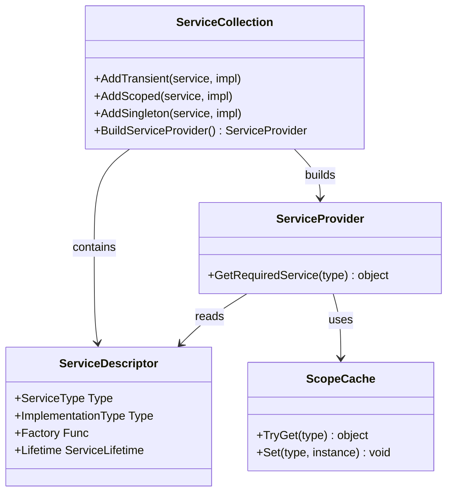

### Warnings and Tradeoffs

- Containers reduce boilerplate but can hide wiring complexity.
- Runtime resolution errors can surface late if startup validation is weak.
- Lifetime bugs are subtle and appear under concurrency.
- Overusing container APIs (`IServiceProvider` everywhere) drifts toward service locator.

## 8. C# Demo: Microsoft.Extensions.DependencyInjection in a Console App

Goal: show constructor resolution using the same abstractions used by ASP.NET Core.

### Complete `Program.cs`

```csharp
using System;
using Microsoft.Extensions.DependencyInjection;

public interface IAuditClock
{
    DateTime UtcNow { get; }
}

public sealed class SystemAuditClock : IAuditClock
{
    public SystemAuditClock()
    {
        Console.WriteLine("Constructed: SystemAuditClock (Singleton)");
    }

    public DateTime UtcNow => DateTime.UtcNow;
}

public interface IAuditLogger
{
    void Write(string message);
}

public sealed class ConsoleAuditLogger : IAuditLogger
{
    private readonly IAuditClock _clock;

    public ConsoleAuditLogger(IAuditClock clock)
    {
        _clock = clock;
        Console.WriteLine("Constructed: ConsoleAuditLogger (depends on IAuditClock)");
    }

    public void Write(string message)
    {
        Console.WriteLine($"[{_clock.UtcNow:O}] AUDIT {message}");
    }
}

public interface IComplianceReportGenerator
{
    string Generate(string orderId);
}

public sealed class ComplianceReportGenerator : IComplianceReportGenerator
{
    private readonly IAuditLogger _auditLogger;

    public ComplianceReportGenerator(IAuditLogger auditLogger)
    {
        _auditLogger = auditLogger;
        Console.WriteLine("Constructed: ComplianceReportGenerator (depends on IAuditLogger)");
    }

    public string Generate(string orderId)
    {
        string reportId = $"RPT-{orderId}";
        _auditLogger.Write($"Generated compliance report {reportId}");
        return reportId;
    }
}

public sealed class NightlyComplianceJob
{
    private readonly IComplianceReportGenerator _generator;

    public NightlyComplianceJob(IComplianceReportGenerator generator)
    {
        _generator = generator;
        Console.WriteLine("Constructed: NightlyComplianceJob (depends on IComplianceReportGenerator)");
    }

    public void Run(string orderId)
    {
        string reportId = _generator.Generate(orderId);
        Console.WriteLine($"Job completed with {reportId}");
    }
}

public static class Program
{
    public static void Main()
    {
        var services = new ServiceCollection();

        services.AddSingleton<IAuditClock, SystemAuditClock>();
        services.AddTransient<IAuditLogger, ConsoleAuditLogger>();
        services.AddTransient<IComplianceReportGenerator, ComplianceReportGenerator>();
        services.AddTransient<NightlyComplianceJob>();

        using ServiceProvider provider = services.BuildServiceProvider();

        Console.WriteLine("Resolving NightlyComplianceJob...");
        NightlyComplianceJob job = provider.GetRequiredService<NightlyComplianceJob>();

        Console.WriteLine("Running job...");
        job.Run("ORD-2026-00042");
    }
}
```

Sample output shape:

```text
Resolving NightlyComplianceJob...
Constructed: SystemAuditClock (Singleton)
Constructed: ConsoleAuditLogger (depends on IAuditClock)
Constructed: ComplianceReportGenerator (depends on IAuditLogger)
Constructed: NightlyComplianceJob (depends on IComplianceReportGenerator)
Running job...
[2026-02-20T...] AUDIT Generated compliance report RPT-ORD-2026-00042
Job completed with RPT-ORD-2026-00042
```

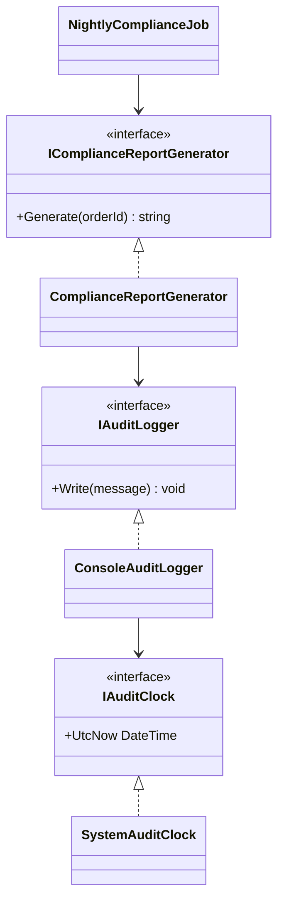

Registration flow (before `GetRequiredService(...)`):

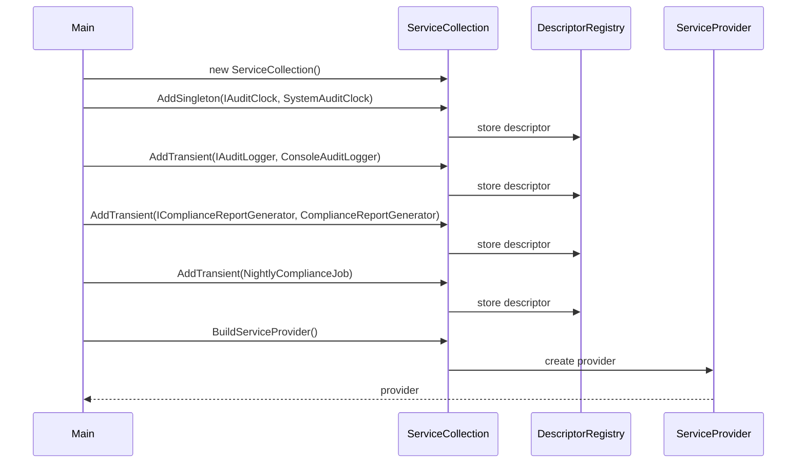

Resolution flow:

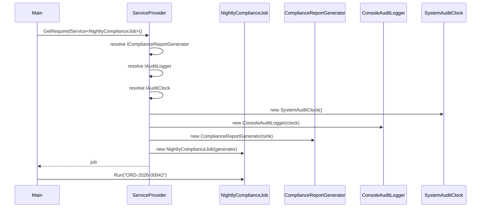

### ASP.NET Core Mapping (Concept)

The same registrations map directly into ASP.NET Core startup:

```csharp
var builder = WebApplication.CreateBuilder(args);
builder.Services.AddSingleton<IAuditClock, SystemAuditClock>();
builder.Services.AddTransient<IAuditLogger, ConsoleAuditLogger>();
builder.Services.AddTransient<IComplianceReportGenerator, ComplianceReportGenerator>();
```

Controllers, endpoints, and hosted services receive these dependencies through constructor injection.

## 9. Anti-Patterns and Failure Modes

### 1) Service Locator

Service Locator means a class requests dependencies from a global provider/container at runtime instead of declaring them in the constructor.

Why teams drift toward it:

- fast short-term wiring convenience
- avoiding constructor changes
- dynamic plugin/runtime discovery boundaries

Why it is an anti-pattern in domain/business code:

- hidden dependencies
- late runtime failures
- harder focused unit tests
- easy dependency creep
- architecture tied to container mechanics

```csharp
public sealed class ShipmentService
{
    private readonly IServiceProvider _provider;

    public ShipmentService(IServiceProvider provider)
    {
        _provider = provider;
    }

    public void Ship(string orderId)
    {
        var repo = _provider.GetRequiredService<IOrderRepository>();
        var notifier = _provider.GetRequiredService<ICustomerNotifier>();
        var logger = _provider.GetRequiredService<ILogger>();

        var order = repo.Load(orderId);
        notifier.Notify(order.CustomerId, $"Order {orderId} shipped");
        logger.Info($"Order {orderId} shipped");
    }
}
```

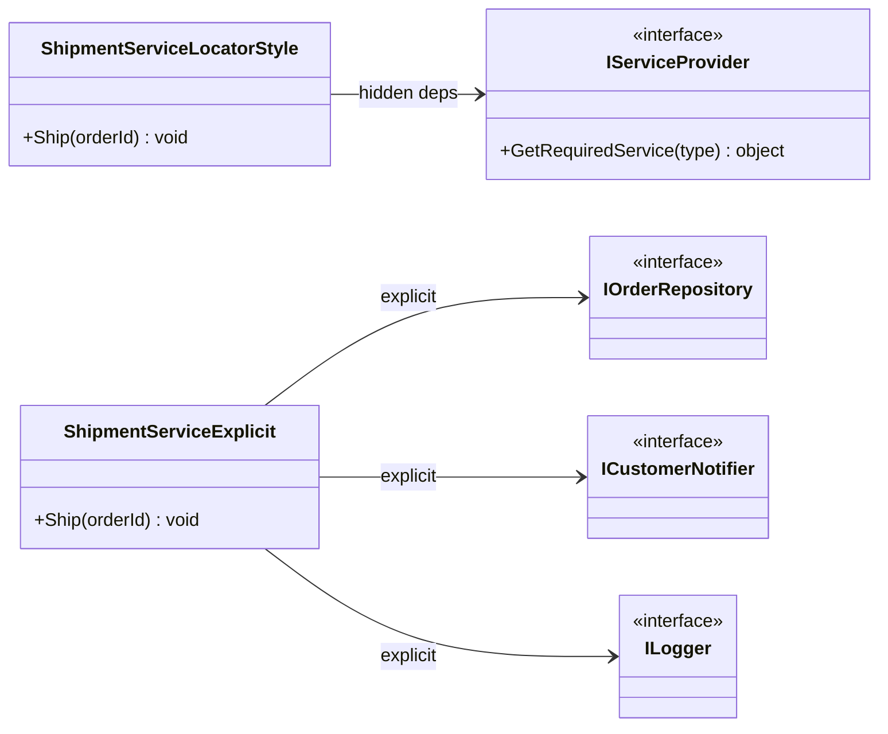

When bounded use is acceptable:

- framework callbacks you do not control
- legacy transitions
- plugin discovery where types are unknown at compile time

Guidance: keep locator use in boundaries/composition only, not in core domain logic.

### 2) Over-injection / Constructor Bloat

If a constructor takes 9-12 dependencies, SRP is usually drifting.

```csharp
public sealed class OrderWorkflowService
{
    public OrderWorkflowService(
        IOrderRepository orders,
        IPricingPolicy pricing,
        IFraudService fraud,
        IInventoryGateway inventory,
        IPaymentGateway payments,
        IAuditLogger audit,
        INotificationService notifications,
        IClock clock,
        ILogger logger,
        IOutbox outbox)
    {
        // Constructor bloat indicates mixed responsibilities.
    }
}
```

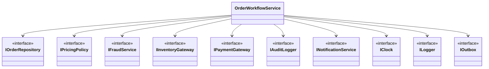

Refactoring options:

- extract per-use-case orchestrators
- split responsibilities
- group correlated primitives into parameter objects
- introduce aggregate services only when cohesion is real

```csharp
public sealed class CheckoutPipeline
{
    private readonly IOrderValidator _validator;
    private readonly IPaymentAuthorizer _payments;
    private readonly IFulfillmentScheduler _fulfillment;

    public CheckoutPipeline(
        IOrderValidator validator,
        IPaymentAuthorizer payments,
        IFulfillmentScheduler fulfillment)
    {
        _validator = validator;
        _payments = payments;
        _fulfillment = fulfillment;
    }
}
```

### 3) Captive Dependency / Lifetime Mismatch

A singleton should not capture request-scoped state.

```csharp
// Registration
services.AddScoped<IRequestContext, HttpRequestContext>();
services.AddSingleton<ComplianceCache>(); // BAD with scoped dependency below

public sealed class ComplianceCache
{
    private readonly IRequestContext _requestContext;

    public ComplianceCache(IRequestContext requestContext)
    {
        _requestContext = requestContext; // Captured too long
    }
}
```

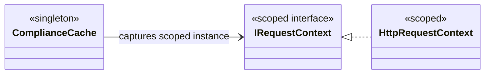

Fix options:

- align lifetimes (make cache scoped)
- pass request-specific data as method arguments
- create operation scopes only at boundaries

### 4) Cyclic Dependencies

Cycles indicate tangled responsibilities.

```csharp
public sealed class PaymentService
{
    public PaymentService(InvoiceService invoices) { }
}

public sealed class InvoiceService
{
    public InvoiceService(PaymentService payments) { }
}
```

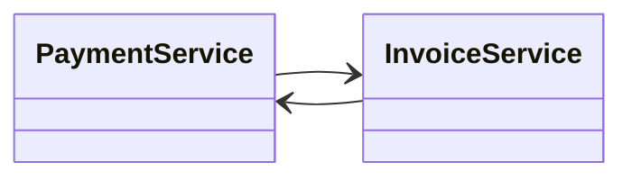

Break cycles with events, mediator, or explicit responsibility split:

```csharp
public sealed class PaymentService
{
    private readonly IDomainEventPublisher _events;

    public PaymentService(IDomainEventPublisher events)
    {
        _events = events;
    }

    public void Capture(string invoiceId)
    {
        _events.Publish(new PaymentCaptured(invoiceId));
    }
}

public sealed class InvoicePaymentProjectionHandler : IDomainEventHandler<PaymentCaptured>
{
    private readonly IInvoiceRepository _invoices;

    public InvoicePaymentProjectionHandler(IInvoiceRepository invoices)
    {
        _invoices = invoices;
    }

    public void Handle(PaymentCaptured evt)
    {
        _invoices.MarkPaid(evt.InvoiceId);
    }
}
```

## 10. Factory and Abstract Factory with DI

### Factory Pattern with DI

Factory encapsulates creation so clients depend on creation abstractions rather than construction details.

Use Factory when:

- implementation choice is runtime-dependent (region, tenant, feature flag)
- creation has non-trivial setup
- clients should not know concrete types

Relationship to DI:

- a DI container behaves like a generalized factory for object graphs
- domain-specific factories remain useful for business-driven selection rules

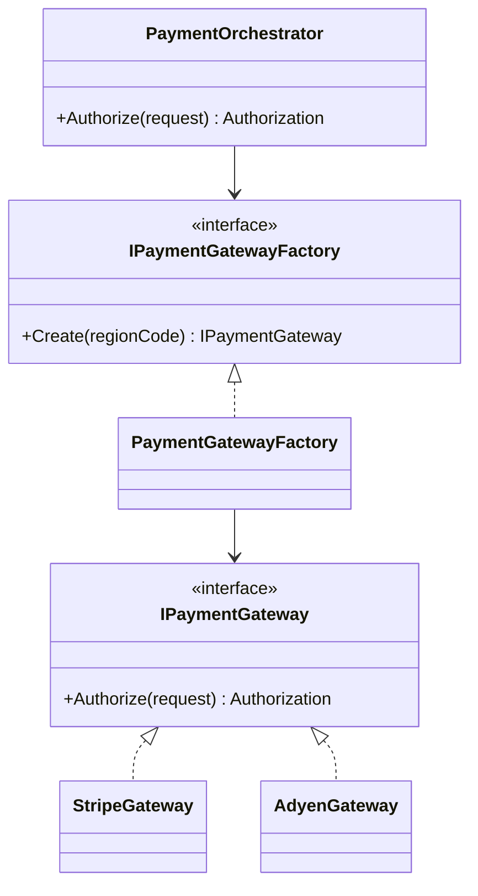

```csharp
public interface IPaymentGateway
{
    Authorization Authorize(PaymentRequest request);
}

public sealed class StripeGateway : IPaymentGateway
{
    public Authorization Authorize(PaymentRequest request) => Authorization.Approved("stripe");
}

public sealed class AdyenGateway : IPaymentGateway
{
    public Authorization Authorize(PaymentRequest request) => Authorization.Approved("adyen");
}

public interface IPaymentGatewayFactory
{
    IPaymentGateway Create(string regionCode);
}

public sealed class PaymentGatewayFactory : IPaymentGatewayFactory
{
    private readonly StripeGateway _stripe;
    private readonly AdyenGateway _adyen;

    public PaymentGatewayFactory(StripeGateway stripe, AdyenGateway adyen)
    {
        _stripe = stripe;
        _adyen = adyen;
    }

    public IPaymentGateway Create(string regionCode)
    {
        return regionCode switch
        {
            "EU" => _adyen,
            _ => _stripe
        };
    }
}
```

### Abstract Factory with DI

Scenario: multi-region compliance where each region needs a compatible pair of services (`tax + invoice`).

Canonical GoF structure:

```mermaid
classDiagram
direction LR

class AbstractFactory {
  <<interface>>
  +CreateProductA() AbstractProductA
  +CreateProductB() AbstractProductB
}

class ConcreteFactoryA
class ConcreteFactoryB
class AbstractProductA {
  <<interface>>
}
class AbstractProductB {
  <<interface>>
}
class ProductA1
class ProductA2
class ProductB1
class ProductB2
class Client

AbstractFactory <|.. ConcreteFactoryA
AbstractFactory <|.. ConcreteFactoryB
AbstractProductA <|.. ProductA1
AbstractProductA <|.. ProductA2
AbstractProductB <|.. ProductB1
AbstractProductB <|.. ProductB2
ConcreteFactoryA --> ProductA1
ConcreteFactoryA --> ProductB1
ConcreteFactoryB --> ProductA2
ConcreteFactoryB --> ProductB2
Client --> AbstractFactory
```

Enterprise mapping:

```mermaid
classDiagram
direction TB

class IComplianceSuiteFactory {
  <<AbstractFactory>>
  +CreateTaxCalculator() ITaxCalculator
  +CreateInvoiceRenderer() IInvoiceRenderer
}

class UsComplianceSuiteFactory {
  <<ConcreteFactoryA>>
}

class EuComplianceSuiteFactory {
  <<ConcreteFactoryB>>
}

class ITaxCalculator {
  <<AbstractProductA>>
  +Calculate(order) decimal
}

class IInvoiceRenderer {
  <<AbstractProductB>>
  +Render(order) string
}

class UsTaxCalculator {
  <<ConcreteProductA1>>
}
class EuTaxCalculator {
  <<ConcreteProductA2>>
}
class UsInvoiceRenderer {
  <<ConcreteProductB1>>
}
class EuInvoiceRenderer {
  <<ConcreteProductB2>>
}

class ComplianceBillingService {
  +Bill(order) Invoice
}

IComplianceSuiteFactory <|.. UsComplianceSuiteFactory
IComplianceSuiteFactory <|.. EuComplianceSuiteFactory
ITaxCalculator <|.. UsTaxCalculator
ITaxCalculator <|.. EuTaxCalculator
IInvoiceRenderer <|.. UsInvoiceRenderer
IInvoiceRenderer <|.. EuInvoiceRenderer

UsComplianceSuiteFactory --> UsTaxCalculator
UsComplianceSuiteFactory --> UsInvoiceRenderer
EuComplianceSuiteFactory --> EuTaxCalculator
EuComplianceSuiteFactory --> EuInvoiceRenderer

ComplianceBillingService --> IComplianceSuiteFactory
ComplianceBillingService --> ITaxCalculator
ComplianceBillingService --> IInvoiceRenderer
```

```csharp
public interface IComplianceSuiteFactory
{
    ITaxCalculator CreateTaxCalculator();
    IInvoiceRenderer CreateInvoiceRenderer();
}

public interface ITaxCalculator
{
    decimal Calculate(Order order);
}

public interface IInvoiceRenderer
{
    string Render(Order order);
}

public sealed class UsComplianceSuiteFactory : IComplianceSuiteFactory
{
    public ITaxCalculator CreateTaxCalculator() => new UsTaxCalculator();
    public IInvoiceRenderer CreateInvoiceRenderer() => new UsInvoiceRenderer();
}

public sealed class EuComplianceSuiteFactory : IComplianceSuiteFactory
{
    public ITaxCalculator CreateTaxCalculator() => new EuTaxCalculator();
    public IInvoiceRenderer CreateInvoiceRenderer() => new EuInvoiceRenderer();
}

public sealed class ComplianceBillingService
{
    private readonly IComplianceSuiteFactory _factory;

    public ComplianceBillingService(IComplianceSuiteFactory factory)
    {
        _factory = factory;
    }

    public string Bill(Order order)
    {
        ITaxCalculator taxes = _factory.CreateTaxCalculator();
        IInvoiceRenderer renderer = _factory.CreateInvoiceRenderer();

        decimal tax = taxes.Calculate(order);
        return renderer.Render(order with { Tax = tax });
    }
}
```

DI can select the concrete abstract factory per tenant/environment while keeping billing logic stable:

```csharp
services.AddScoped<UsComplianceSuiteFactory>();
services.AddScoped<EuComplianceSuiteFactory>();

services.AddScoped<IComplianceSuiteFactory>(sp =>
{
    var tenant = sp.GetRequiredService<ITenantContext>();
    return tenant.RegionCode == "EU"
        ? sp.GetRequiredService<EuComplianceSuiteFactory>()
        : sp.GetRequiredService<UsComplianceSuiteFactory>();
});
```

## 11. Real-World Summary

### Practical Guidance

- Start with `manual DI` for smaller jobs/services and explicit composition roots.
- Use a `container` when object graphs become large and lifetime rules matter.
- Keep one `composition root` per app boundary (startup/bootstrap).
- Keep `IServiceProvider` out of domain code.
- Treat `lifetimes` as correctness constraints, not performance knobs.
- Use DI to automate DIP consistently across environments and deployments.

### Common Misconceptions

- "DI requires a framework container." (false: manual DI is valid)
- "Container usage guarantees good architecture." (false: abstractions can still be poor)
- "More injected services always means more decoupling." (false: often SRP drift)
- "Service locator is equivalent to constructor injection." (false: dependencies become hidden)
- "Singleton is always better for performance." (false: captive dependency bugs are costly)

## 12. Dependency Injection Study Guide

### Core Definitions

- `Dependency Injection (DI)`: supplying required collaborators from outside a class.
- `Constructor Injection`: requiring collaborators through constructor parameters.
- `Composition Root`: the boundary where concrete object graphs are wired.
- `Object Graph`: runtime network of resolved instances.
- `Container`: tooling that registers, resolves, and manages lifetimes.
- `Lifetime`: reuse boundary (`transient`, `scoped`, `singleton`).
- `Service Locator`: runtime lookup pattern that hides dependencies.

### Detection Checklist

- Do classes create infrastructure dependencies directly inside business methods?
- Are constructor dependencies explicit and cohesive?
- Are lifetime rules compatible across dependency chains?
- Is `IServiceProvider` limited to boundaries/composition?
- Are circular dependencies blocked early?

### Refactoring Playbook

1. Identify one class with hidden or directly created dependencies.
2. Move required collaborators into constructor parameters.
3. Introduce focused abstractions where variation exists.
4. Create a composition root and centralize wiring.
5. Add tests using fakes/stubs for injected dependencies.
6. Introduce container registrations only when manual wiring cost is meaningful.
7. Validate registrations/lifetimes at startup.

### Exam-Focused Recall Prompts

1. Explain the difference between DIP and DI in two sentences.
2. Draw the resolution flow from `GetRequiredService<T>()` to object graph creation.
3. Compare manual DI and container DI with one tradeoff each.
4. Give one example of service locator and explain why it is risky.
5. Explain captive dependency and one practical fix.
6. Describe when a factory still adds value even when using DI.
