# Dependency Injection (DI): Applying DIP in Practice

How to realistically make the **D** in SOLI**D** achievable in non-trivial applications

[Powerpoint Presentation](10-dependency-injection.pptx) | [PDF](10-dependency-injection.pdf)

----

This lecture continues directly from [Lecture 9: The Dependency Inversion Principle](09-dependency-inversion-principle.md), especially [Section 13 ("From DIP to Dependency Injection")](09-dependency-inversion-principle.md#13-from-dip-to-dependency-injection).

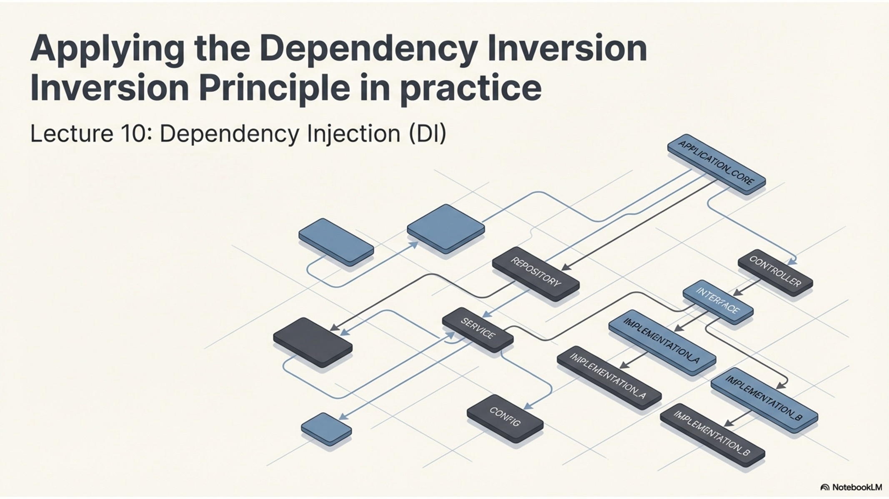

---
## 1. Introduction to Dependency Injection

### Continuity From Lecture 9

Lecture 9 ended with a DIP-compliant `BillingService` and a manual composition root:

```csharp
public sealed class BillingService
{
    private readonly ICustomerRepository _customers;

    public BillingService(ICustomerRepository customers)
    {
        _customers = customers;
    }
}

ICustomerRepository customers = new SqlCustomerRepository("Server=prod;Database=Billing;");
var billing = new BillingService(customers);
```

That was the architectural target for DIP. This lecture now answers the operational questions left open at the end of Lecture 9:

- how to scale wiring beyond a small `Main` method
- how containers resolve object graphs from constructor signatures
- how lifetime rules and startup validation prevent production defects

Dependency Injection (DI) is the technique of supplying a class with the collaborators it needs instead of creating those collaborators inside the class.

- `DIP` defines the architectural rule (depend on abstractions).
- `DI` operationalizes that rule at runtime by building and wiring object graphs.

In other words, DI is not the principle itself; DI is how teams automate and scale DIP in real systems.

In Lecture 9, Composition Root was reframed as an architectural boundary, not just a way to keep `Main` short. In this lecture, we operationalize that boundary: Composition Root is the control point where DI policies are enforced for the full object graph.

> Ousterhout reference (Ch. 2-3): DI is a complexity-management tactic, not just a syntax preference. The strategic value is lowering long-term change cost in policy code.

### Canonical Definition

> Dependency Injection: an object receives required collaborators from outside itself instead of creating them internally.

### Quick Refresh (from Lecture 9)

Lecture 9 already walked through the full before/after refactor for `OrderApprovalPolicy`, including the DIP rationale and diagrams. Here is the minimum DI shape we carry forward:

```csharp
public sealed class OrderApprovalPolicy
{
    private readonly ICreditCheckGateway _credit;
    private readonly IAuditLogger _audit;

    public OrderApprovalPolicy(ICreditCheckGateway credit, IAuditLogger audit)
    {
        _credit = credit;
        _audit = audit;
    }
}

// Composition root (manual DI)
var policy = new OrderApprovalPolicy(
    new LegacyCreditApiClient("https://credit.internal"),
    new FileAuditLogger("/var/log/order-approval.log"));
```

For the full DIP refactoring context, revisit Lecture 9:

- [Rule #1: What Is Actually Inverted](09-dependency-inversion-principle.md#4-rule-1-what-is-actually-inverted)
- [Refactoring from "New Everywhere" to DIP](09-dependency-inversion-principle.md#11-refactoring-from-new-everywhere-to-dip)

---
## 2. Table of Contents

- [1. Introduction to Dependency Injection](#1-introduction-to-dependency-injection)
- [2. Table of Contents](#2-table-of-contents)
- [3. DI and DIP (Relationship Map)](#3-di-and-dip-relationship-map)
- [4. DI Terminology Quick Primer](#4-di-terminology-quick-primer)
- [5. Core Mechanics: Object Graphs and Constructor Injection](#5-core-mechanics-object-graphs-and-constructor-injection)
- [6. Composition Root Deep Dive](#6-composition-root-deep-dive)
- [7. Manual Dependency Injection (No Container)](#7-manual-dependency-injection-no-container)
- [8. DI Containers Conceptually (How Framework DI Works)](#8-di-containers-conceptually-how-framework-di-works)
- [9. Anti-Patterns and Failure Modes](#9-anti-patterns-and-failure-modes)
- [10. Demo #1: dotnet DI Container in a Minimal Web App](#10-demo-1-dotnet-di-container-in-a-minimal-web-app)
- [11. Demo #2: How does a DI container work?](#11-demo-2-how-does-a-di-container-work)
- [12. Real-World Summary](#12-real-world-summary)
- [Study Guide](#study-guide)
- [Appendix 1: Keyed Dependency Injection](#appendix-1-keyed-dependency-injection)

---
## 3. DI and DIP (Relationship Map)

### DI vs DIP: Technique and Principle

- `DIP` is the architectural principle: high-level policy depends on abstractions.
- `DI` is the delivery mechanism: collaborators are provided from outside.
- You can apply DIP without a container (manual DI).
- You can use a container and still violate DIP if abstractions are weak.

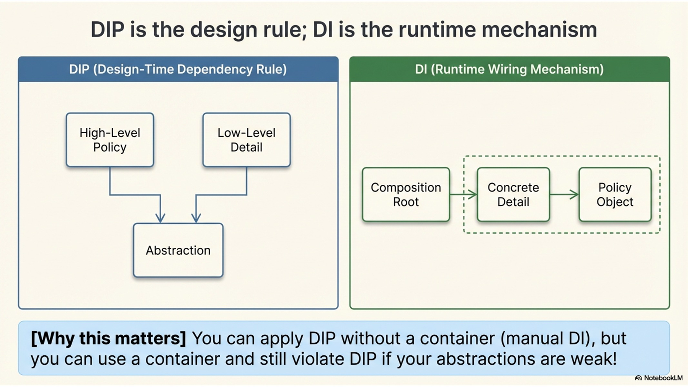

This lecture does not re-teach DIP rules in depth. For the full analysis (Rule #1, Rule #2, volatility criteria, and failure matrix), revisit Lecture 9:

- [The Two Rules of DIP](09-dependency-inversion-principle.md#3-the-two-rules-of-dip)
- [Rule #2: Use Stable Abstractions](09-dependency-inversion-principle.md#8-rule-2-use-stable-abstractions)
- [Failure Modes and Detection Matrix](09-dependency-inversion-principle.md#10-failure-modes-and-detection-matrix)

What Lecture 10 adds on top of Lecture 9:

- runtime object-graph construction
- service lifetimes and scopes
- container validation and common DI failure patterns

Use the following diagram to keep the distinction clear: DIP is a dependency-direction rule, while DI is the runtime wiring mechanism.

- Top (`DIP`) answers: "Who is allowed to depend on what in source code?"
- Bottom (`DI`) answers: "Who creates and wires objects at runtime?"
- The shared abstraction exists in both views: DIP constrains dependency direction; DI supplies the concrete implementation behind that abstraction.

> Ousterhout reference (Ch. 7-8): DIP keeps abstraction layers clean; DI helps pull wiring complexity downward so policy layers remain simpler.

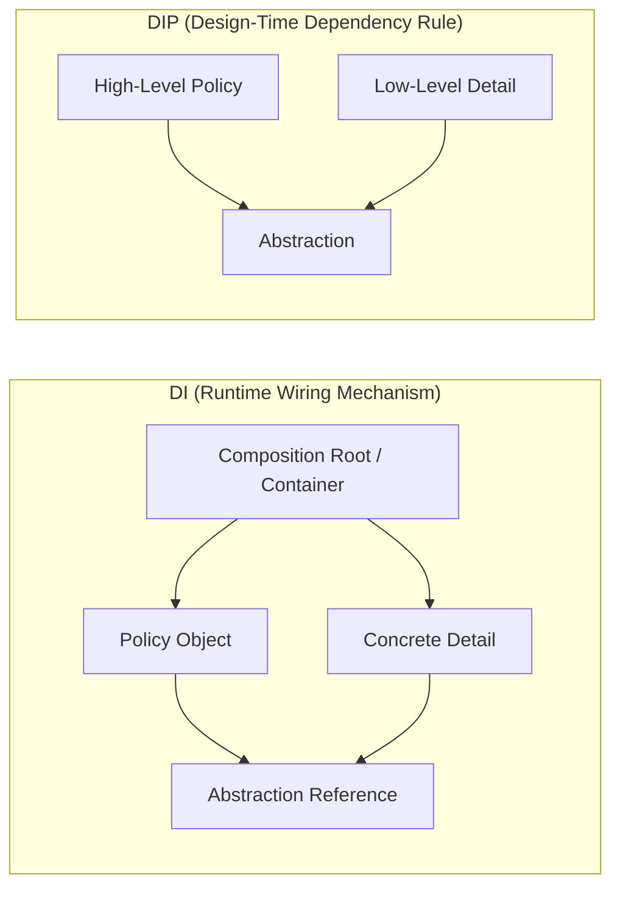
```mermaid
flowchart LR
    subgraph DI["DI (Runtime Wiring Mechanism)"]
        R[Composition Root / Container] --> POL[Policy Object]
        R --> DET[Concrete Detail]
        POL --> ABR[Abstraction Reference]
        DET --> ABR
    end

    subgraph DIP["DIP (Design-Time Dependency Rule)"]
        P[High-Level Policy] --> A[Abstraction]
        D[Low-Level Detail] --> A
    end


```

---
## 4. DI Terminology Quick Primer

With the DI/DIP relationship established, here is the core vocabulary used throughout this lecture:

| Term | Brief definition |
| --- | --- |
| `Dependency` | A collaborator a class needs to do its job (`IOrderRepository`, `IAppLogger`). |
| `Container` | The runtime component that *contains* dependency configuration and state: registrations, construction rules, and lifetime/scope caches used to build and reuse object graphs. |
| `Registration` | The mapping from abstraction/service type to implementation and lifetime. |
| `Resolution` | Asking the container to construct and return a service instance. |
| `Object Graph` | The full runtime tree/network of objects created to satisfy a root service. |
| `Lifetime` | Reuse policy for an instance (`transient`, `scoped`, `singleton`). |
| `Scope` | A bounded lifetime context (for example, one HTTP request or one background job run) where scoped services share one instance within that boundary, then are disposed when the boundary ends. |
| `Composition Root` | The application boundary where registrations and wiring decisions are centralized. |
| `Constructor Injection` | Supplying required collaborators through constructor parameters. |
| `Service Locator` | Pulling dependencies from a provider at runtime instead of declaring them explicitly. |

> Ousterhout reference (Ch. 4-5): this vocabulary supports deep modules by keeping interfaces focused and implementation mechanics hidden.

### dotnet and Spring Boot Terminology Crosswalk

Use this table as a translation layer while reading the rest of the lecture:

| Concept | dotnet terminology | Spring Boot terminology |
| --- | --- | --- |
| Container | `IServiceCollection` + built `IServiceProvider` | `ApplicationContext` (or `BeanFactory`) |
| Registration | `services.AddTransient/AddScoped/AddSingleton` | `@Component` / `@Service` / `@Repository` or `@Bean` methods |
| Resolution | constructor injection, or `GetRequiredService<T>()` | constructor injection, or `ApplicationContext.getBean(...)` |
| Scoped boundary | one `IServiceScope` per request/job boundary | one configured scope boundary (for example, `@RequestScope` in web apps, or a custom scope) |
| Lifetime names | `Transient`, `Scoped`, `Singleton` | `prototype`, `request` (web), `singleton` (default) |
| Composition root | `Program.cs` / `builder.Services` startup wiring | `@SpringBootApplication` bootstrap + `@Configuration` wiring |
| Background DI entry point | `IHostedService` / `BackgroundService` | `@Scheduled`, `ApplicationRunner`, `CommandLineRunner` |

### dotnet and Spring DI Container Functional Equivalence

At the architectural level, the two DI systems are functionally equivalent: both maintain dependency registrations, construct object graphs through constructor injection, enforce lifetimes/scopes, and fail when required dependencies cannot be resolved. The differences are mostly in API style, defaults, and framework conventions.

| Behavior/Detail | dotnet capabilities | Spring capabilities |
| --- | --- | --- |
| Core container role | `IServiceCollection` describes registrations; built `IServiceProvider` resolves graphs | `ApplicationContext`/`BeanFactory` stores bean definitions and resolves graphs |
| Registration style | imperative code (`AddTransient/AddScoped/AddSingleton`, extension methods) | annotation/config style (`@Component` scanning, `@Bean` methods) |
| Primary injection style | constructor injection (preferred), optional runtime lookup | constructor injection (preferred), optional runtime lookup |
| Runtime lookup API | `GetRequiredService<T>()`, `GetRequiredKeyedService<T>(key)` | `getBean(...)`, `ObjectProvider`, and named-bean selection via injected `Map<String, T>` |
| Lifetime model | per-registration lifetimes (`Transient`, `Scoped`, `Singleton`) | scopes (`prototype`, `request`, `singleton` default) |
| Request boundary behavior | web request creates scope; `Scoped` reused within request | web request creates request context; `@RequestScope` reused within request |
| Multi-implementation selection | keyed services (`AddKeyed...`, `[FromKeyedServices]`) | qualifiers/named beans (`@Qualifier`, bean names, `@Primary`) |
| Startup failure behavior | unresolved graphs/lifetime violations can fail at startup with validation options | unresolved bean dependencies fail context startup by default |
| Circular dependency handling | constructor cycles are detected and fail resolution | constructor cycles are detected and fail context creation |

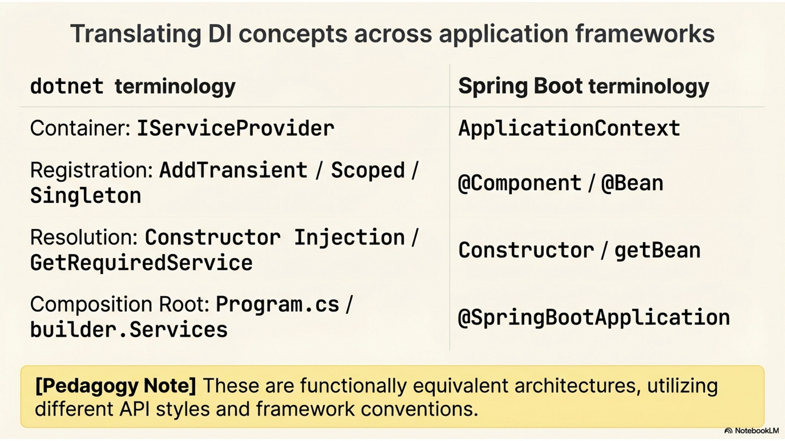

#### Typical DI flow

1. Register services and lifetimes at startup.
2. Create a scope (for example, per request/job).
3. Resolve one root service.
4. Let the container build the full object graph.
5. Dispose the scope and scoped/transient disposables.

The concept map below shows how the core terms connect during runtime composition:

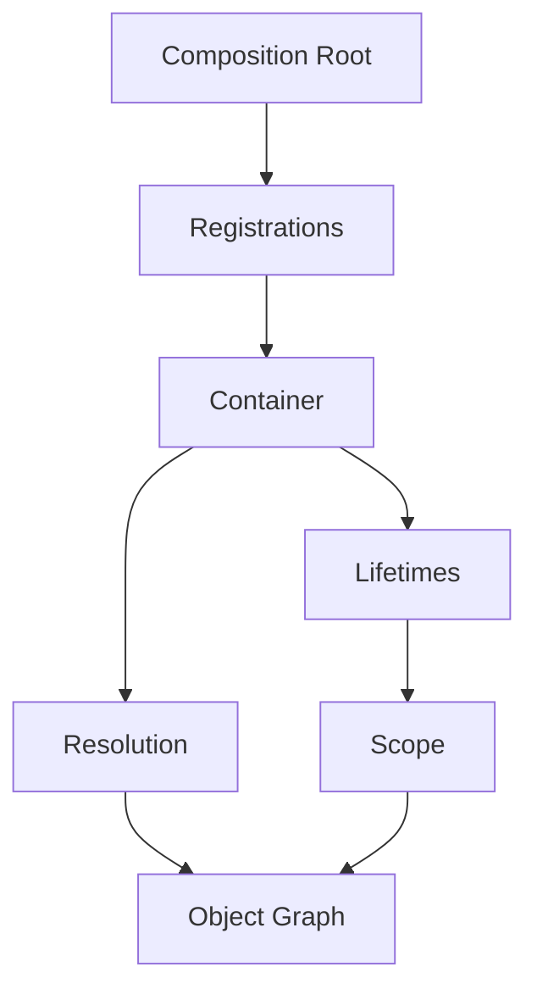
```mermaid
flowchart TB
    CR[Composition Root] --> REG[Registrations]
    REG --> C[Container]
    C --> RES[Resolution]
    RES --> OG[Object Graph]
    C --> LIFE[Lifetimes]
    LIFE --> SCOPE[Scope]
    SCOPE --> OG
```

---
## 5. Core Mechanics: Object Graphs and Constructor Injection

### Object Graphs: DI at Runtime

An object graph is the runtime network of objects and their dependencies for one process/request/job.

In an order-processing service, a root object often needs:

- persistence (`IOrderRepository`)
- policy (`IPricingPolicy`)
- time source (`IClock`)
- telemetry (`IAppLogger`)

### Constructor Injection: Dependencies Become Explicit

Constructor injection means a class cannot be created without required collaborators.

Technical effects:

- explicit contract in the constructor signature
- fail-fast behavior during composition/resolution
- easier testing by passing fakes directly

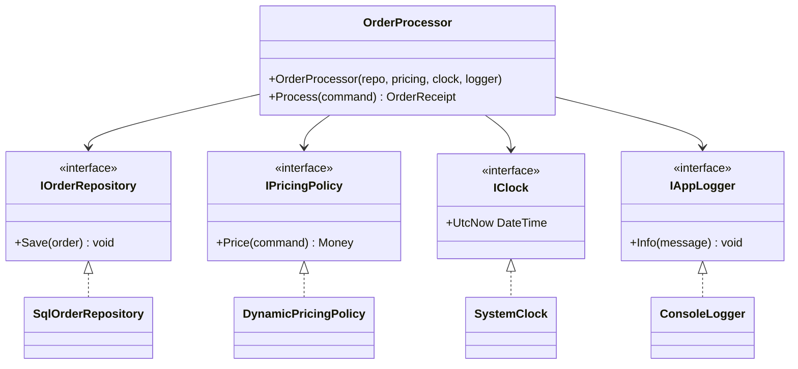
```mermaid
classDiagram
direction TB

class OrderProcessor {
  +OrderProcessor(repo, pricing, clock, logger)
  +Process(command) OrderReceipt
}

class IOrderRepository {
  <<interface>>
  +Save(order) void
}

class IPricingPolicy {
  <<interface>>
  +Price(command) Money
}

class IClock {
  <<interface>>
  +UtcNow DateTime
}

class IAppLogger {
  <<interface>>
  +Info(message) void
}

class SqlOrderRepository
class DynamicPricingPolicy
class SystemClock
class ConsoleLogger

OrderProcessor --> IOrderRepository
OrderProcessor --> IPricingPolicy
OrderProcessor --> IClock
OrderProcessor --> IAppLogger

IOrderRepository <|.. SqlOrderRepository
IPricingPolicy <|.. DynamicPricingPolicy
IClock <|.. SystemClock
IAppLogger <|.. ConsoleLogger
```

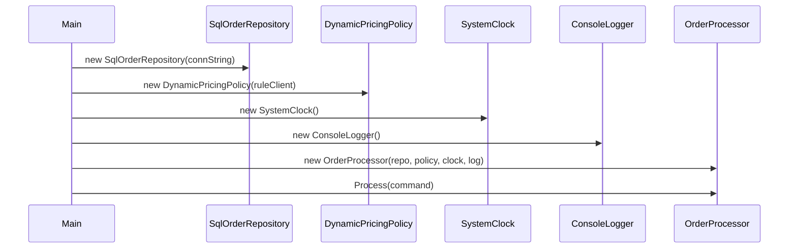
```mermaid
sequenceDiagram
participant Main
participant Repo as SqlOrderRepository
participant Policy as DynamicPricingPolicy
participant Clock as SystemClock
participant Log as ConsoleLogger
participant Processor as OrderProcessor

Main->>Repo: new SqlOrderRepository(connString)
Main->>Policy: new DynamicPricingPolicy(ruleClient)
Main->>Clock: new SystemClock()
Main->>Log: new ConsoleLogger()
Main->>Processor: new OrderProcessor(repo, policy, clock, log)
Main->>Processor: Process(command)
```

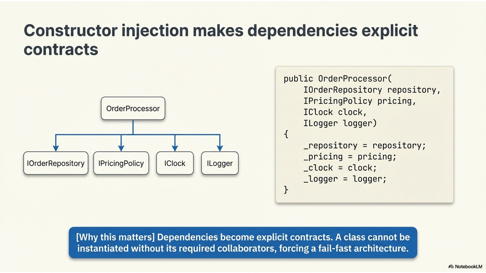

---
## 6. Composition Root Deep Dive

Lecture 9 established Composition Root as the architectural boundary for wiring. Here we narrow to DI-specific operational concerns.

For the full conceptual treatment and manual composition examples, see [Lecture 9, "Composition Root in DIP (Conceptual)"](09-dependency-inversion-principle.md#7-composition-root-in-dip-conceptual).

### DI-Specific Responsibilities

- define registrations (abstraction to implementation mappings)
- choose lifetimes (`transient`, `scoped`, `singleton`) intentionally
- build/validate the provider at startup
- create/dispose scopes at boundary edges

> Ousterhout reference (Ch. 7-8): Composition Root keeps volatile wiring detail in lower layers instead of leaking it into business policy code.

This boundary diagram clarifies what belongs in the Composition Root versus what belongs in runtime business code:

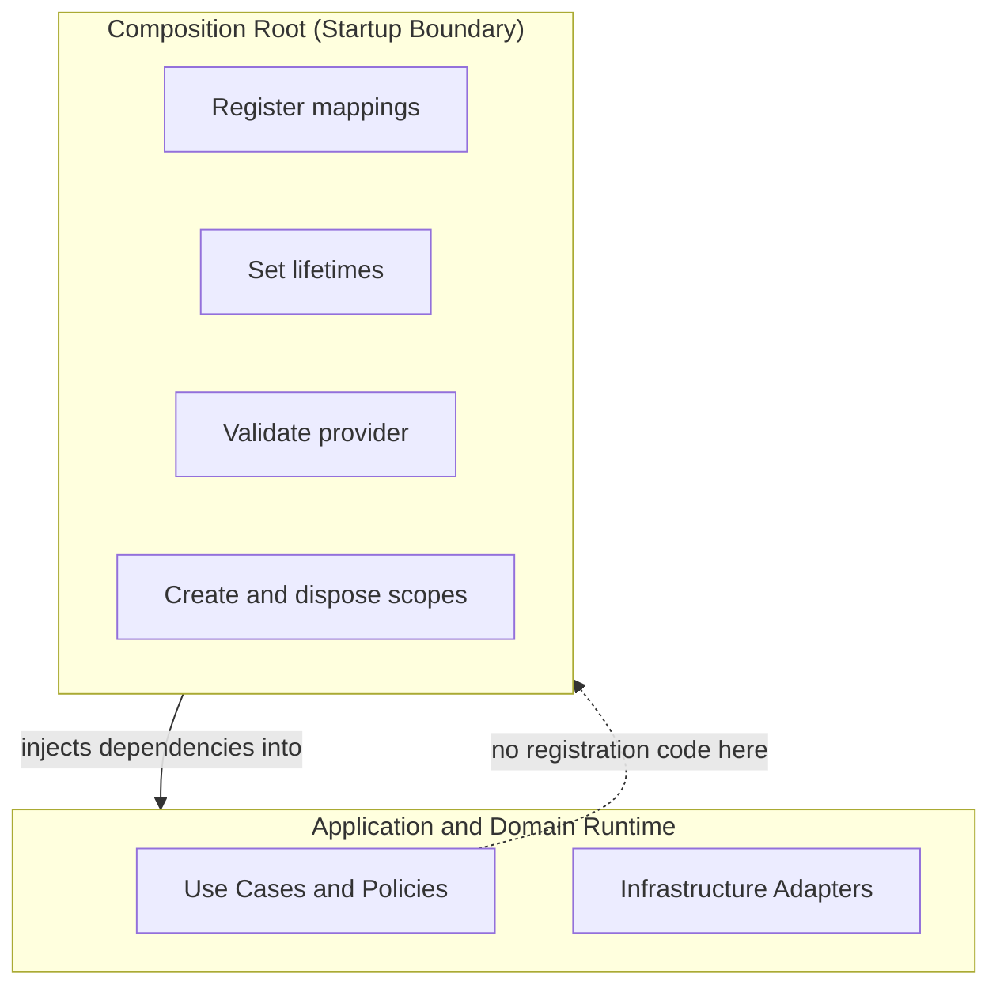
```mermaid
flowchart TB
    subgraph ROOT["Composition Root (Startup Boundary)"]
        R1[Register mappings]
        R2[Set lifetimes]
        R3[Validate provider]
        R4[Create and dispose scopes]
    end

    subgraph APP["Application and Domain Runtime"]
        A1[Use Cases and Policies]
        A2[Infrastructure Adapters]
    end

    ROOT -->|injects dependencies into| APP
    A1 -. "no registration code here" .-> ROOT
```

### What Should Not Be in Composition Root

- business rules and orchestration logic
- ad hoc per-feature service lookup in domain classes
- scattered "mini roots" throughout feature code

### Container-Oriented Sketch

This minimal startup sketch shows the Composition Root expressed with a DI container: register abstractions, assign lifetimes, then build a validated provider once at application startup.

```csharp
var services = new ServiceCollection();
services.AddScoped<IOrderRepository, SqlOrderRepository>();
services.AddScoped<IPricingPolicy, DynamicPricingPolicy>();
services.AddSingleton<IClock, SystemClock>();

using ServiceProvider provider = services.BuildServiceProvider(
    new ServiceProviderOptions
    {
        ValidateOnBuild = true,
        ValidateScopes = true
    });
```

### Boundary Rule

Use one composition root per application boundary:

- console app entry point
- web host startup
- worker service startup
- test harness bootstrap

This gives predictable wiring, easier diagnostics, and clean dependency boundaries.

---
## 7. Manual Dependency Injection (No Container)

### Scenario: Order Ingestion Pipeline

We will use one concrete scenario and evolve it through three stages. This keeps the DI mechanics anchored to the same business flow.

A batch pipeline ingests marketplace orders, enriches with pricing rules, and stores normalized orders.

### 1) BAD Version: Tight Coupling and Direct Instantiation

Start with the anti-pattern baseline. The business service constructs its own infrastructure dependencies, which hides requirements and prevents isolated testing.

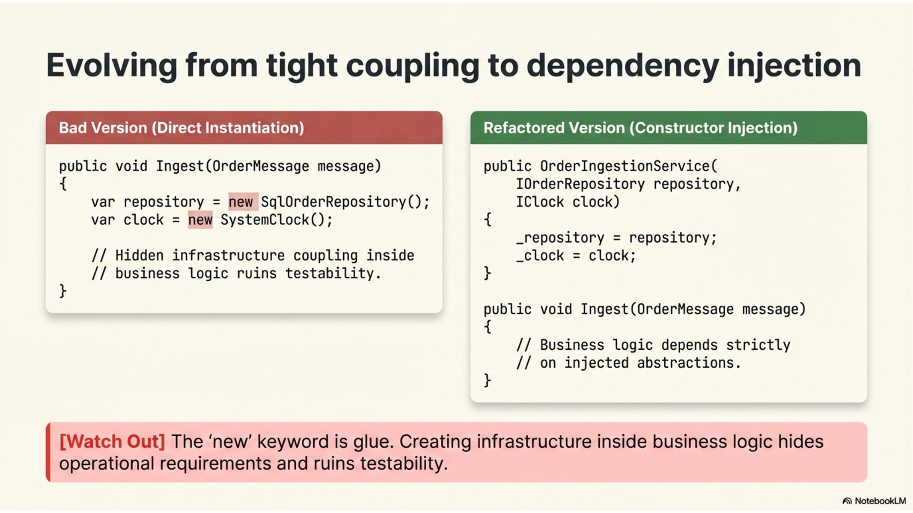

```csharp
public sealed class OrderIngestionService
{
    public void Ingest(OrderMessage message)
    {
        var repository = new SqlOrderRepository("Server=prod;Database=Orders;");
        var pricing = new DynamicPricingPolicy(new TaxRulesHttpClient("https://tax-rules.internal"));
        var clock = new SystemClock();
        var logger = new ConsoleLogger();

        decimal total = pricing.CalculateTotal(message);
        var order = Order.Create(message.OrderId, message.CustomerId, total, clock.UtcNow);

        repository.Save(order);
        logger.Info($"Ingested order {order.Id}");
    }
}
```

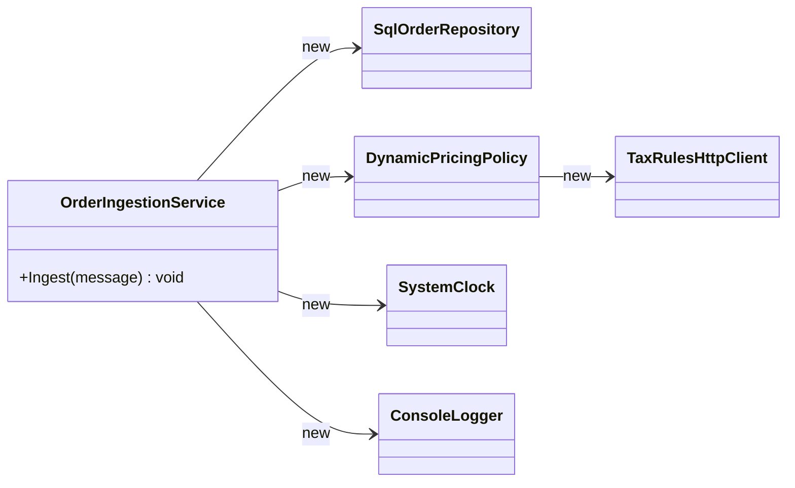
```mermaid
classDiagram
direction LR

class OrderIngestionService {
  +Ingest(message) void
}
class SqlOrderRepository
class DynamicPricingPolicy
class TaxRulesHttpClient
class SystemClock
class ConsoleLogger

OrderIngestionService --> SqlOrderRepository : new
OrderIngestionService --> DynamicPricingPolicy : new
OrderIngestionService --> SystemClock : new
OrderIngestionService --> ConsoleLogger : new
DynamicPricingPolicy --> TaxRulesHttpClient : new
```

### 2) REFACTORED Version: Constructor Injection with Interfaces

Now move dependency creation out of the business class and into constructor parameters. The service depends on abstractions, making required collaborators explicit.

```csharp
public interface IOrderRepository
{
    void Save(Order order);
}

public interface IPricingPolicy
{
    decimal CalculateTotal(OrderMessage message);
}

public interface IClock
{
    DateTime UtcNow { get; }
}

public interface IAppLogger
{
    void Info(string message);
}

public sealed class OrderIngestionService
{
    private readonly IOrderRepository _repository;
    private readonly IPricingPolicy _pricing;
    private readonly IClock _clock;
    private readonly IAppLogger _logger;

    public OrderIngestionService(
        IOrderRepository repository,
        IPricingPolicy pricing,
        IClock clock,
        IAppLogger logger)
    {
        _repository = repository;
        _pricing = pricing;
        _clock = clock;
        _logger = logger;
    }

    public void Ingest(OrderMessage message)
    {
        decimal total = _pricing.CalculateTotal(message);
        var order = Order.Create(message.OrderId, message.CustomerId, total, _clock.UtcNow);

        _repository.Save(order);
        _logger.Info($"Ingested order {order.Id}");
    }
}
```

> **Naming note**: These examples use `IAppLogger` instead of `ILogger` to avoid ambiguity with `Microsoft.Extensions.Logging.ILogger`, which ships with the dotnet framework and is the standard logging abstraction in ASP.NET Core. In production codebases you would typically inject `ILogger<T>` from the framework rather than defining a custom logging interface.

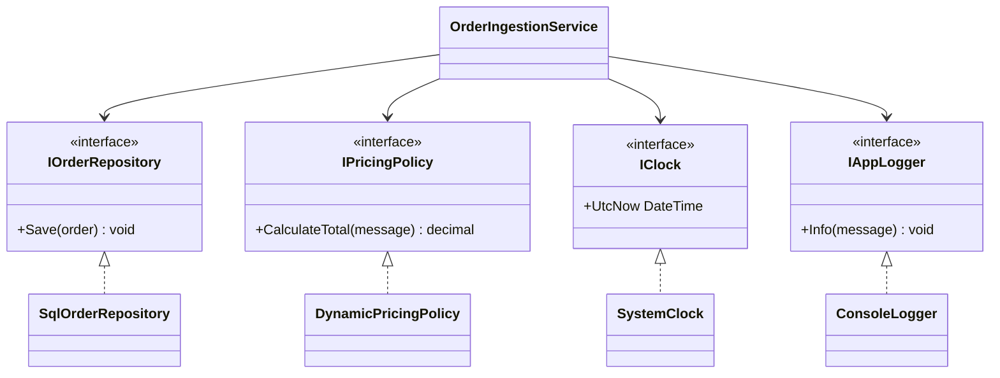
```mermaid
classDiagram
direction TB

class OrderIngestionService
class IOrderRepository {
  <<interface>>
  +Save(order) void
}
class IPricingPolicy {
  <<interface>>
  +CalculateTotal(message) decimal
}
class IClock {
  <<interface>>
  +UtcNow DateTime
}
class IAppLogger {
  <<interface>>
  +Info(message) void
}
class SqlOrderRepository
class DynamicPricingPolicy
class SystemClock
class ConsoleLogger

OrderIngestionService --> IOrderRepository
OrderIngestionService --> IPricingPolicy
OrderIngestionService --> IClock
OrderIngestionService --> IAppLogger

IOrderRepository <|.. SqlOrderRepository
IPricingPolicy <|.. DynamicPricingPolicy
IClock <|.. SystemClock
IAppLogger <|.. ConsoleLogger
```

### 3) Composition Root in `Main()`

With constructor injection in place, object wiring moves to the composition boundary. This is where concrete implementations are selected and assembled.

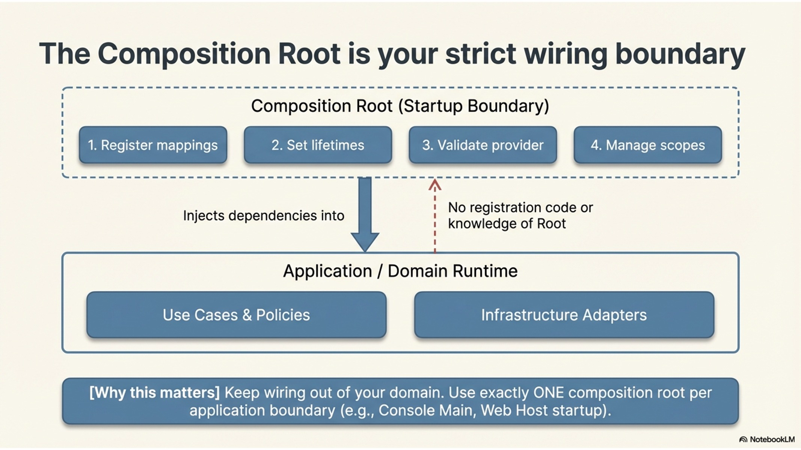

```csharp
public static class Program
{
    public static void Main()
    {
        IOrderRepository repository = new SqlOrderRepository("Server=prod;Database=Orders;");
        var taxClient = new TaxRulesHttpClient("https://tax-rules.internal");
        IPricingPolicy pricing = new DynamicPricingPolicy(taxClient);
        IClock clock = new SystemClock();
        IAppLogger logger = new ConsoleLogger();

        var ingestion = new OrderIngestionService(repository, pricing, clock, logger);

        var message = new OrderMessage("ORD-10291", "C-8841", 149.99m, "US");
        ingestion.Ingest(message);
    }
}
```

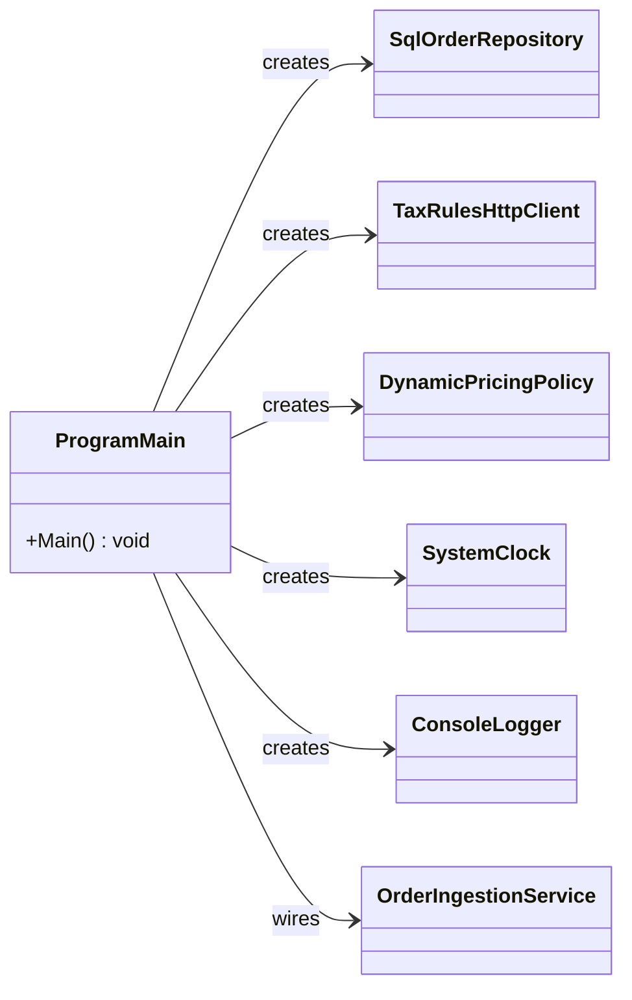
```mermaid
classDiagram
direction LR

class ProgramMain {
  +Main() void
}
class OrderIngestionService
class SqlOrderRepository
class DynamicPricingPolicy
class TaxRulesHttpClient
class SystemClock
class ConsoleLogger

ProgramMain --> SqlOrderRepository : creates
ProgramMain --> TaxRulesHttpClient : creates
ProgramMain --> DynamicPricingPolicy : creates
ProgramMain --> SystemClock : creates
ProgramMain --> ConsoleLogger : creates
ProgramMain --> OrderIngestionService : wires
```

### Why This Is Better

The improvement is not only stylistic; it changes maintainability and testability characteristics of the codebase.

Manual DI improves production quality by:

- `Testability`: business logic can be tested with in-memory fakes.
- `Change isolation`: infrastructure swaps do not require policy class edits.
- `Explicit dependencies`: constructor signatures document operational requirements.

### Testing Without a Mocking Framework

This final step closes the loop by proving the refactor with a small deterministic test. The example shows that constructor injection enables simple hand-written test doubles without a mocking library or container setup in the test.

> A **mock** is a test double used to stand in for a real collaborator and verify expected interactions or behavior in a test. A **mocking framework** is a library that generates and configures these test doubles dynamically instead of writing them by hand.

```csharp
public sealed class FakeOrderRepository : IOrderRepository
{
    public readonly List<Order> Saved = new();

    public void Save(Order order) => Saved.Add(order);
}

public sealed class FixedClock : IClock
{
    public DateTime UtcNow { get; } = new DateTime(2026, 2, 1, 0, 0, 0, DateTimeKind.Utc);
}

public sealed class FlatPricingPolicy : IPricingPolicy
{
    public decimal CalculateTotal(OrderMessage message) => 100m;
}

public sealed class CollectingLogger : IAppLogger
{
    public readonly List<string> Messages = new();

    public void Info(string message) => Messages.Add(message);
}

// Test sketch
var repo = new FakeOrderRepository();
var pricing = new FlatPricingPolicy();
var clock = new FixedClock();
var logger = new CollectingLogger();

var sut = new OrderIngestionService(repo, pricing, clock, logger);
sut.Ingest(new OrderMessage("ORD-1", "C-1", 10m, "US"));

Console.WriteLine(repo.Saved.Count == 1 ? "PASS" : "FAIL");
```

---
## 8. DI Containers Conceptually (How Framework DI Works)

A DI container is one tool for scaling DI. Conceptually, it does five things:

- `Registration`: map service type to implementation/factory.
- `Lifetime`: define reuse rules.
- `Resolution`: build requested object and its dependencies.
- `Constructor selection`: choose a usable constructor and resolve parameters.
- `Cycle detection`: fail when dependency graphs loop.

Generic container role: runtime DI composition and resolution (dotnet: `IServiceCollection` + `IServiceProvider` / Spring: `ApplicationContext` with stereotypes and/or `@Bean` definitions).

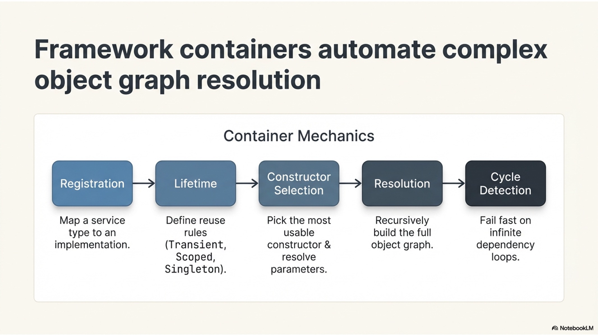

### Lifetime and Scope in Practice

- `Per-resolution lifetime` (dotnet: `Transient` / Spring: `prototype`): new instance every resolution.
- `Per-scope lifetime` (dotnet: `Scoped` / Spring: scope-bound bean such as `@RequestScope` in web apps): one instance per scope boundary.
- `Application lifetime` (dotnet: `Singleton` / Spring: `singleton` default): one instance for application lifetime.

> **Disposal difference (`Transient` vs `prototype`)**: These two lifetimes behave similarly at creation time but differ at cleanup time. Dotnet `Transient` services that implement `IDisposable` are tracked by the enclosing `IServiceScope` and disposed automatically when the scope ends. Spring `prototype` beans are **not** tracked after creation — the container releases them immediately and never calls their `destroy()` methods. Resources held by a Spring prototype bean (connections, file handles, etc.) must be cleaned up manually by the caller. Assuming parity here is a common source of resource leaks when porting patterns between the two ecosystems.

Common failure pattern: singleton captures scoped dependency and holds stale/request-specific state.

The timeline below shows how each lifetime behaves across two different scopes:

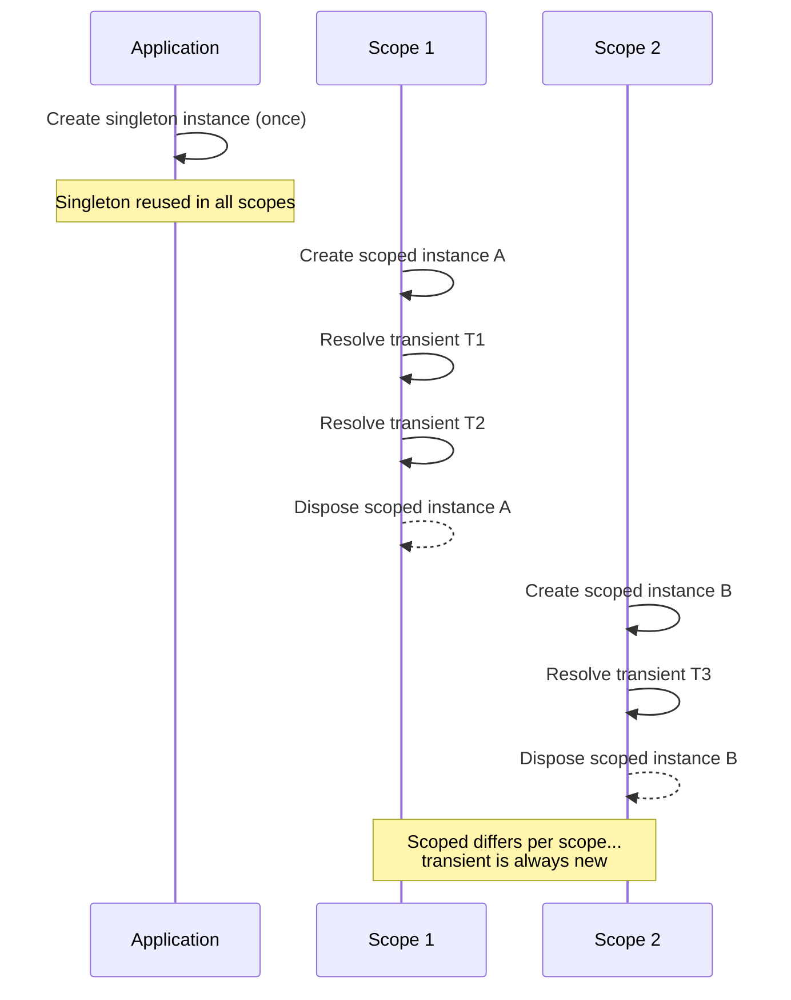
```mermaid
sequenceDiagram
participant App as Application
participant Scope1 as Scope 1
participant Scope2 as Scope 2

App->>App: Create singleton instance (once)
Note over App: Singleton reused in all scopes
Scope1->>Scope1: Create scoped instance A
Scope1->>Scope1: Resolve transient T1
Scope1->>Scope1: Resolve transient T2
Scope1-->>Scope1: Dispose scoped instance A
Scope2->>Scope2: Create scoped instance B
Scope2->>Scope2: Resolve transient T3
Scope2-->>Scope2: Dispose scoped instance B
Note over Scope1,Scope2: Scoped differs per scope...<br>transient is always new
```

Registration happens first:

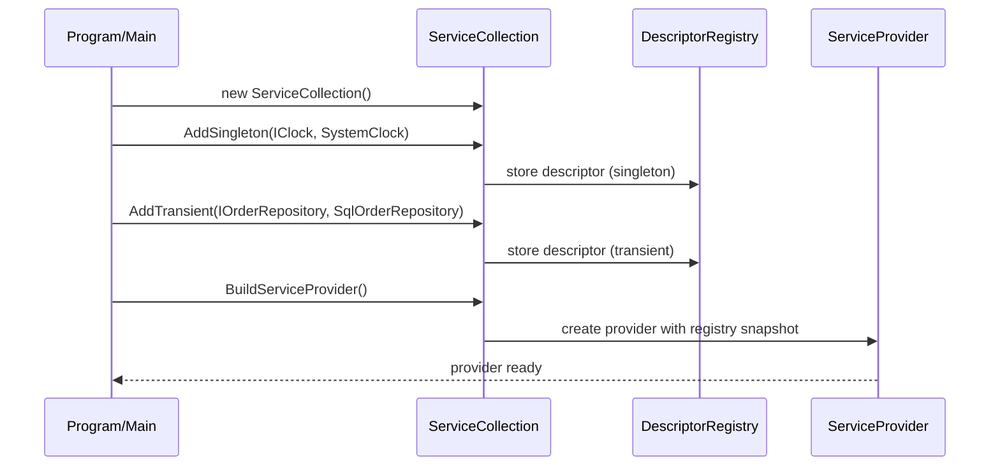
```mermaid
sequenceDiagram
participant Bootstrap as Program/Main
participant Services as ServiceCollection
participant Registry as DescriptorRegistry
participant Provider as ServiceProvider

Bootstrap->>Services: new ServiceCollection()
Bootstrap->>Services: AddSingleton(IClock, SystemClock)
Services->>Registry: store descriptor (singleton)
Bootstrap->>Services: AddTransient(IOrderRepository, SqlOrderRepository)
Services->>Registry: store descriptor (transient)
Bootstrap->>Services: BuildServiceProvider()
Services->>Provider: create provider with registry snapshot
Provider-->>Bootstrap: provider ready
```

Then resolution uses those registrations:

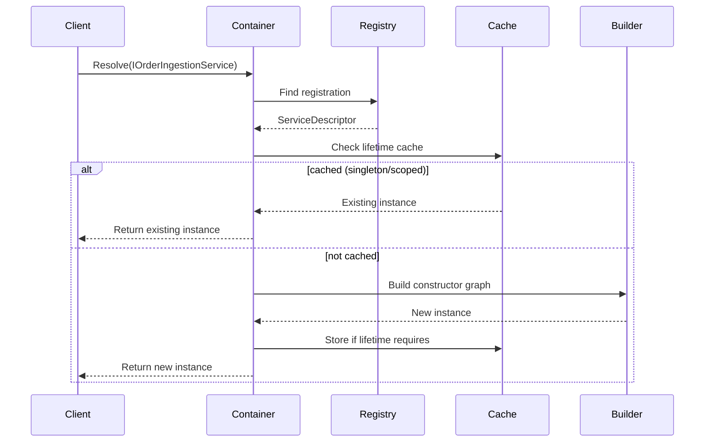
```mermaid
sequenceDiagram
participant Client
participant Container
participant Registry
participant Cache
participant Builder

Client->>Container: Resolve(IOrderIngestionService)
Container->>Registry: Find registration
Registry-->>Container: ServiceDescriptor
Container->>Cache: Check lifetime cache
alt cached (singleton/scoped)
  Cache-->>Container: Existing instance
  Container-->>Client: Return existing instance
else not cached
  Container->>Builder: Build constructor graph
  Builder-->>Container: New instance
  Container->>Cache: Store if lifetime requires
  Container-->>Client: Return new instance
end
```

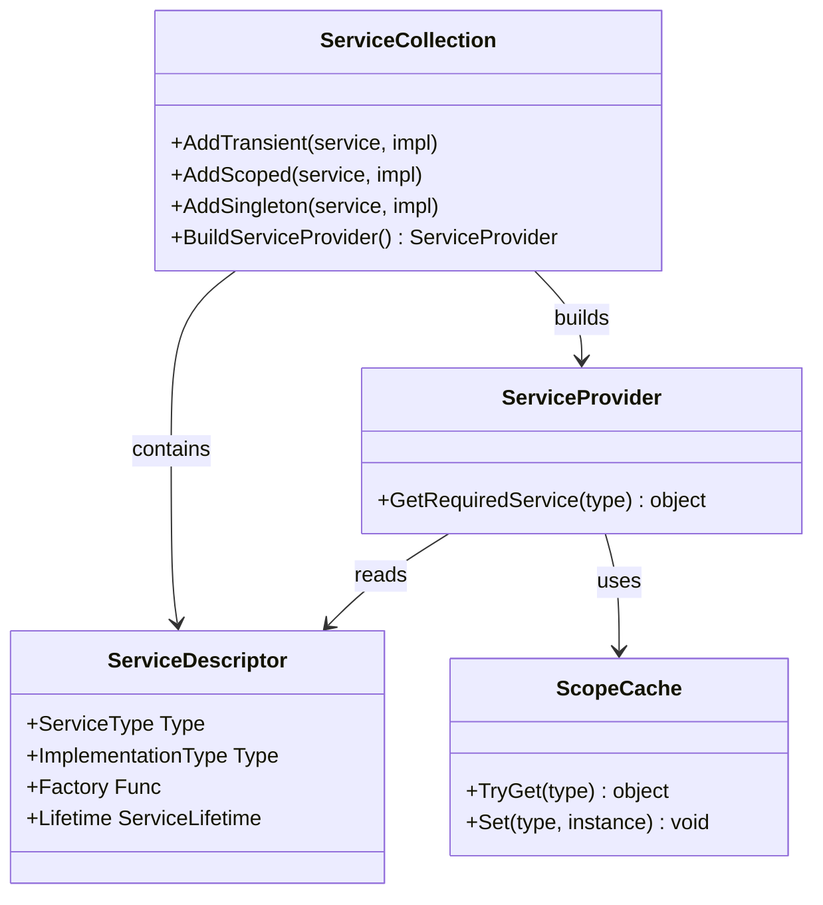
```mermaid
classDiagram
direction TB

class ServiceCollection {
  +AddTransient(service, impl)
  +AddScoped(service, impl)
  +AddSingleton(service, impl)
  +BuildServiceProvider() ServiceProvider
}

class ServiceProvider {
  +GetRequiredService(type) object
}

class ServiceDescriptor {
  +ServiceType Type
  +ImplementationType Type
  +Factory Func
  +Lifetime ServiceLifetime
}

class ScopeCache {
  +TryGet(type) object
  +Set(type, instance) void
}

ServiceCollection --> ServiceDescriptor : contains
ServiceCollection --> ServiceProvider : builds
ServiceProvider --> ServiceDescriptor : reads
ServiceProvider --> ScopeCache : uses
```

### Warnings and Tradeoffs

- Containers reduce boilerplate but can hide wiring complexity.
- Runtime resolution errors can surface late if startup validation is weak.
- Lifetime bugs are subtle and appear under concurrency.
- Overusing container APIs (`IServiceProvider` everywhere) drifts toward service locator.

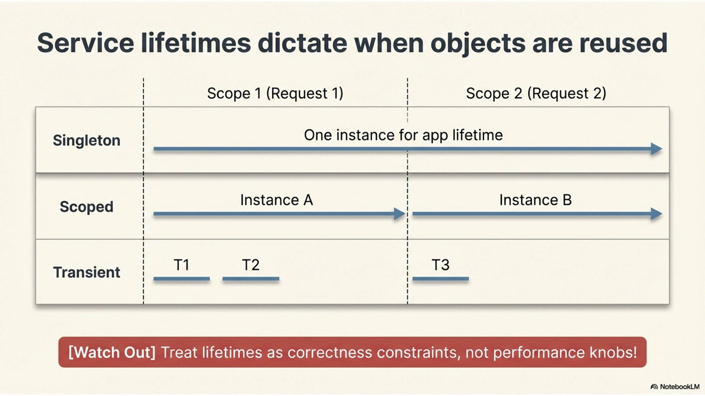

---
## 9. Anti-Patterns and Failure Modes

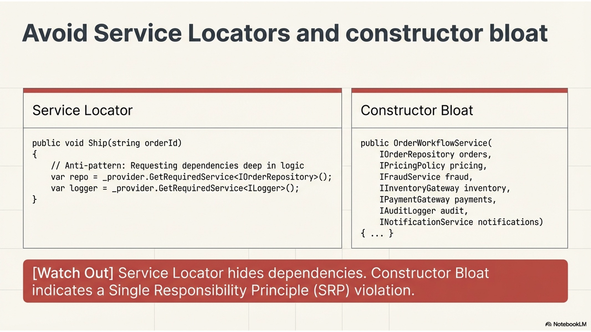

### 1) Service Locator

Service Locator means a class requests dependencies from a global provider/container at runtime instead of declaring them in the constructor.

> Ousterhout reference (Ch. 5): service locator erodes information hiding by exposing construction/lookup mechanics to business code.

Equivalent service-locator calls in business/domain code create the same hidden-dependency problem (dotnet: `IServiceProvider.GetRequiredService(...)` / Spring: `ApplicationContext.getBean(...)` or `ObjectProvider.getObject()`).

Why teams drift toward it:

- fast short-term wiring convenience
- avoiding constructor changes
- dynamic plugin/runtime discovery boundaries

Why it is an anti-pattern in domain/business code:

- hidden dependencies
- late runtime failures
- harder focused unit tests
- easy dependency creep
- architecture tied to container mechanics

```csharp
public sealed class ShipmentService
{
    private readonly IServiceProvider _provider;

    public ShipmentService(IServiceProvider provider)
    {
        _provider = provider;
    }

    public void Ship(string orderId)
    {
        var repo = _provider.GetRequiredService<IOrderRepository>();
        var notifier = _provider.GetRequiredService<ICustomerNotifier>();
        var logger = _provider.GetRequiredService<IAppLogger>();

        var order = repo.Load(orderId);
        notifier.Notify(order.CustomerId, $"Order {orderId} shipped");
        logger.Info($"Order {orderId} shipped");
    }
}
```

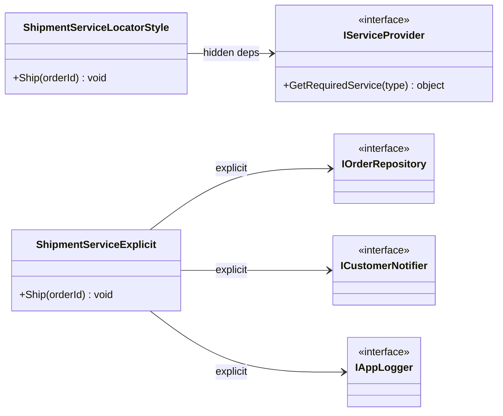
```mermaid
classDiagram
direction LR

class ShipmentServiceLocatorStyle {
  +Ship(orderId) void
}
class IServiceProvider {
  <<interface>>
  +GetRequiredService(type) object
}
class ShipmentServiceExplicit {
  +Ship(orderId) void
}
class IOrderRepository {
  <<interface>>
}
class ICustomerNotifier {
  <<interface>>
}
class IAppLogger {
  <<interface>>
}

ShipmentServiceLocatorStyle --> IServiceProvider : hidden deps
ShipmentServiceExplicit --> IOrderRepository : explicit
ShipmentServiceExplicit --> ICustomerNotifier : explicit
ShipmentServiceExplicit --> IAppLogger : explicit
```

When bounded use is acceptable:

- framework callbacks you do not control
- legacy transitions
- plugin discovery where types are unknown at compile time

Guidance: keep locator use in boundaries/composition only, not in core domain logic.

### 2) Over-injection / Constructor Bloat

If a constructor takes 9-12 dependencies, SRP is usually drifting.

> Ousterhout reference (Ch. 2): overly broad constructor surfaces increase cognitive complexity and reduce maintainability.

```csharp
public sealed class OrderWorkflowService
{
    public OrderWorkflowService(
        IOrderRepository orders,
        IPricingPolicy pricing,
        IFraudService fraud,
        IInventoryGateway inventory,
        IPaymentGateway payments,
        IAuditLogger audit,
        INotificationService notifications,
        IClock clock,
        IAppLogger logger,
        IOutbox outbox)
    {
        // Constructor bloat indicates mixed responsibilities.
    }
}
```

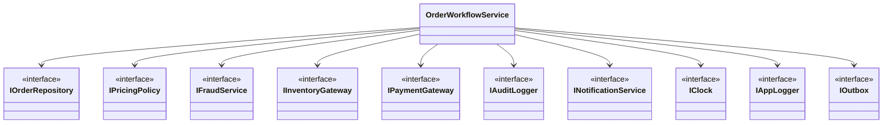
```mermaid
classDiagram
direction TB

class OrderWorkflowService
class IOrderRepository { <<interface>> }
class IPricingPolicy { <<interface>> }
class IFraudService { <<interface>> }
class IInventoryGateway { <<interface>> }
class IPaymentGateway { <<interface>> }
class IAuditLogger { <<interface>> }
class INotificationService { <<interface>> }
class IClock { <<interface>> }
class IAppLogger { <<interface>> }
class IOutbox { <<interface>> }

OrderWorkflowService --> IOrderRepository
OrderWorkflowService --> IPricingPolicy
OrderWorkflowService --> IFraudService
OrderWorkflowService --> IInventoryGateway
OrderWorkflowService --> IPaymentGateway
OrderWorkflowService --> IAuditLogger
OrderWorkflowService --> INotificationService
OrderWorkflowService --> IClock
OrderWorkflowService --> IAppLogger
OrderWorkflowService --> IOutbox
```

Refactoring options:

- extract per-use-case orchestrators
- split responsibilities
- group correlated primitives into parameter objects
- introduce aggregate services only when cohesion is real

```csharp
public sealed class CheckoutPipeline
{
    private readonly IOrderValidator _validator;
    private readonly IPaymentAuthorizer _payments;
    private readonly IFulfillmentScheduler _fulfillment;

    public CheckoutPipeline(
        IOrderValidator validator,
        IPaymentAuthorizer payments,
        IFulfillmentScheduler fulfillment)
    {
        _validator = validator;
        _payments = payments;
        _fulfillment = fulfillment;
    }
}
```

### 3) Captive Dependency / Lifetime Mismatch

An application-lifetime dependency should not capture request-lifetime state (dotnet: `Singleton` depending on `Scoped` / Spring: `singleton` depending on `@RequestScope`).

```csharp
// Registration
services.AddScoped<IRequestContext, HttpRequestContext>();
services.AddSingleton<ComplianceCache>(); // BAD with scoped dependency below

public sealed class ComplianceCache
{
    private readonly IRequestContext _requestContext;

    public ComplianceCache(IRequestContext requestContext)
    {
        _requestContext = requestContext; // Captured too long
    }
}
```

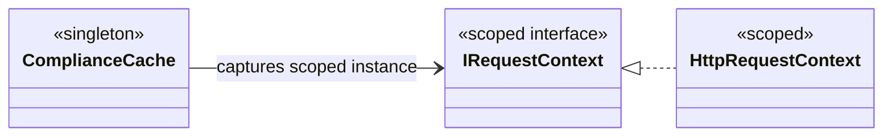
```mermaid
classDiagram
direction LR

class ComplianceCache {
  <<singleton>>
}
class IRequestContext {
  <<scoped interface>>
}
class HttpRequestContext {
  <<scoped>>
}

ComplianceCache --> IRequestContext : captures scoped instance
IRequestContext <|.. HttpRequestContext
```

Fix options:

- align lifetimes (make cache scoped)
- pass request-specific data as method arguments
- create operation scopes only at boundaries

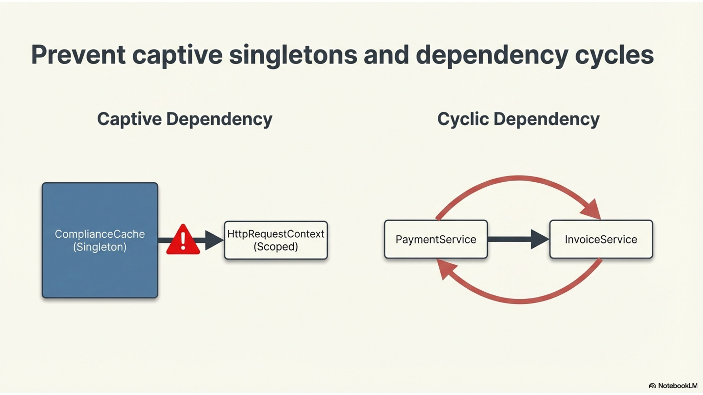

### 4) Cyclic Dependencies

Cycles indicate tangled responsibilities.

```csharp
public sealed class PaymentService
{
    public PaymentService(InvoiceService invoices) { }
}

public sealed class InvoiceService
{
    public InvoiceService(PaymentService payments) { }
}
```

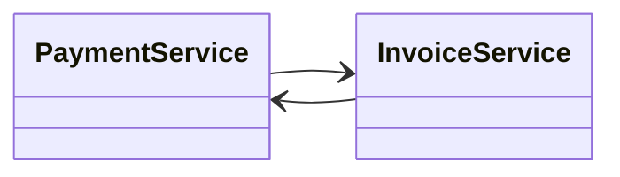
```mermaid
classDiagram
direction LR

class PaymentService
class InvoiceService

PaymentService --> InvoiceService
InvoiceService --> PaymentService
```

Break cycles with events, mediator, or explicit responsibility split:

```csharp
public sealed class PaymentService
{
    private readonly IDomainEventPublisher _events;

    public PaymentService(IDomainEventPublisher events)
    {
        _events = events;
    }

    public void Capture(string invoiceId)
    {
        _events.Publish(new PaymentCaptured(invoiceId));
    }
}

public sealed class InvoicePaymentProjectionHandler : IDomainEventHandler<PaymentCaptured>
{
    private readonly IInvoiceRepository _invoices;

    public InvoicePaymentProjectionHandler(IInvoiceRepository invoices)
    {
        _invoices = invoices;
    }

    public void Handle(PaymentCaptured evt)
    {
        _invoices.MarkPaid(evt.InvoiceId);
    }
}
```

---
## 10. Demo #1: dotnet DI Container in a Minimal Web App

This demo establishes the baseline behavior using the standard dotnet hosting model and built-in DI container. Section 11 then decomposes the same behavior into a toy app so students can inspect the mechanics directly.

- script: `demos/10-dependency-injection/di-container-and-web-server-demo.cs`
- runtime model: ASP.NET Core minimal API + Microsoft DI container
- routes:
  - `GET /users/create`
  - `GET /users/hello`
  - `GET /users/hello?name=Jeff`

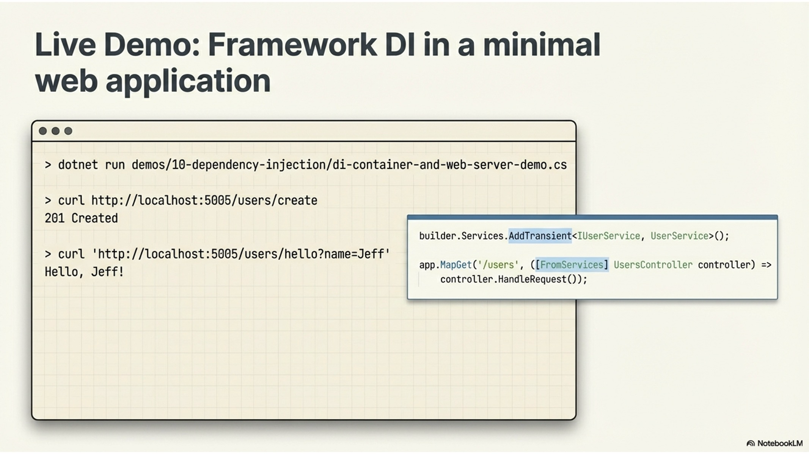

### How to Run

> Prerequisites:
> - Use an SDK that supports file-based apps (`dotnet run <file.cs>`) and `#:sdk` directives.
> - Run from the repository root so relative paths work as written.

Start the demo:

```bash
dotnet run demos/10-dependency-injection/di-container-and-web-server-demo.cs
```

Call the endpoints:

```bash
curl http://localhost:5005/users/create
curl http://localhost:5005/users/hello
curl "http://localhost:5005/users/hello?name=Jeff"
```

Expected behavior:

- `/users/create` returns `200 OK` with body `201 Created (onboarded user@example.com)` and logs a simulated email line.
- `/users/hello` returns `Hello!` and writes `Hello!` to console.
- `/users/hello?name=Jeff` returns `Hello, Jeff!` and writes `Hello, Jeff!` to console.
- If `5005` is already in use, change `UseUrls("http://localhost:5005")` in the script.

### Key Points to Inspect in the Script

1. Composition root registration happens in `builder.Services` (abstractions mapped to implementations).
2. `UsersController` depends on abstractions (`OnboardingService`, `WelcomeService`), not concrete collaborators.
3. Endpoint handlers request `UsersController` via `[FromServices]`, which resolves from the request service provider (`HttpContext.RequestServices`).
4. Query string value `name` is bound by minimal API parameter binding and forwarded to `UsersController.Hello(name)`.
5. `WelcomeService` encapsulates greeting behavior and writes to both response and console.

### Registration and Activation Flow

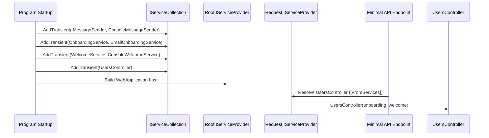
```mermaid
sequenceDiagram
participant Startup as Program Startup
participant Services as IServiceCollection
participant Root as Root IServiceProvider
participant Scope as Request IServiceProvider
participant Endpoint as Minimal API Endpoint
participant Ctrl as UsersController

Startup->>Services: AddTransient(IMessageSender, ConsoleMessageSender)
Startup->>Services: AddTransient(OnboardingService, EmailOnboardingService)
Startup->>Services: AddTransient(WelcomeService, ConsoleWelcomeService)
Startup->>Services: AddTransient(UsersController)
Startup->>Root: Build WebApplication host
Endpoint->>Scope: Resolve UsersController ([FromServices])
Scope-->>Ctrl: UsersController(onboarding, welcome)
```

### Request Flow Example: `GET /users/hello?name=Jeff`

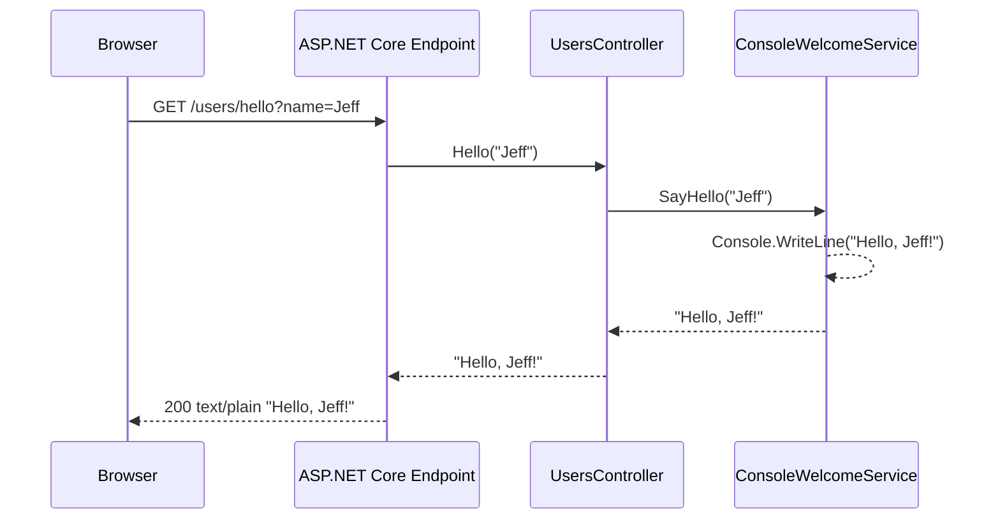
```mermaid
sequenceDiagram
participant Browser
participant Web as ASP.NET Core Endpoint
participant Ctrl as UsersController
participant Wel as ConsoleWelcomeService

Browser->>Web: GET /users/hello?name=Jeff
Web->>Ctrl: Hello("Jeff")
Ctrl->>Wel: SayHello("Jeff")
Wel-->>Wel: Console.WriteLine("Hello, Jeff!")
Wel-->>Ctrl: "Hello, Jeff!"
Ctrl-->>Web: "Hello, Jeff!"
Web-->>Browser: 200 text/plain "Hello, Jeff!"
```

### Mapping Back to Lecture Concepts

- `Composition Root`: `builder.Services` registrations and endpoint wiring at startup.
- `Resolution`: request scope resolves `UsersController` when endpoint asks for `[FromServices]`.
- `Object Graph`: `UsersController -> OnboardingService/WelcomeService -> IMessageSender`.
- `DIP`: abstractions are stable contracts; concrete implementations are selected in startup.

---
## 11. Demo #2: How does a DI container work?

Section 10 showed the same feature set running on the standard Microsoft DI container and minimal web host. This section decomposes that functionality into a tiny toy container + toy web app so students can inspect each DI step directly and remove the "black box" feeling.

- script: `demos/10-dependency-injection/di-toy-container-and-web-server-demo.cs`
- goal: make constructor-based recursive resolution and controller activation visible line by line

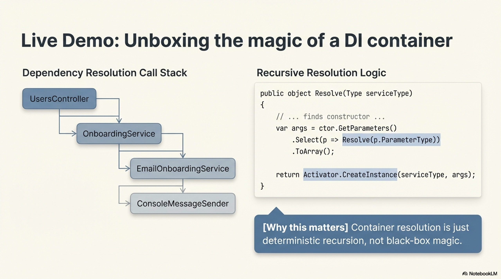

### What the Demo Contains

| Component | Responsibility | Key behavior |
| --- | --- | --- |
| `MiniContainer` | minimal DI container | stores registrations and recursively resolves constructor graphs |
| `ToyWebApp` | tiny router + controller activator | maps route to controller action and activates controller via DI |
| `TinyServer` | HTTP listener loop | converts HTTP requests into `Request` objects and writes text responses |
| `UsersController` + services | app layer example | demonstrates transitive dependency graph: controller -> abstract service -> concrete implementation |
| `Program` | composition root | registers abstractions to implementations and starts app/server |

### How the Recursive Resolution Works

The core method is `Resolve(Type serviceType)` in `MiniContainer`:

1. Look up the requested type in registrations (for example, `OnboardingService -> EmailOnboardingService`).
   If no registration exists and the type is concrete (for example, `UsersController`), use that type directly.
2. Choose a constructor (this demo picks the public constructor with most parameters).
3. For each constructor parameter, call `Resolve(...)` again.
4. After dependencies are resolved, construct the current object with `Activator.CreateInstance(...)`.
5. Return to the previous stack frame (recursive unwind).

This means one top-level resolve can create an entire object graph.

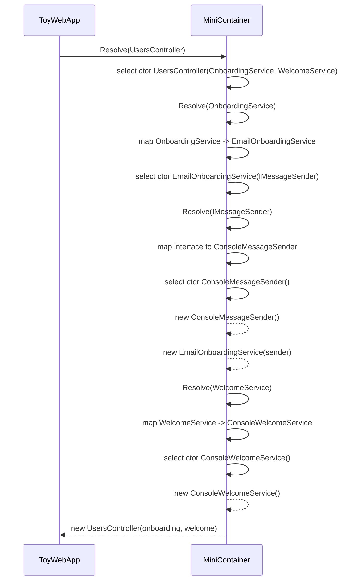
```mermaid
sequenceDiagram
participant App as ToyWebApp
participant C as MiniContainer

App->>C: Resolve(UsersController)
C->>C: select ctor UsersController(OnboardingService, WelcomeService)
C->>C: Resolve(OnboardingService)
C->>C: map OnboardingService -> EmailOnboardingService
C->>C: select ctor EmailOnboardingService(IMessageSender)
C->>C: Resolve(IMessageSender)
C->>C: map interface to ConsoleMessageSender
C->>C: select ctor ConsoleMessageSender()
C-->>C: new ConsoleMessageSender()
C-->>C: new EmailOnboardingService(sender)
C->>C: Resolve(WelcomeService)
C->>C: map WelcomeService -> ConsoleWelcomeService
C->>C: select ctor ConsoleWelcomeService()
C-->>C: new ConsoleWelcomeService()
C-->>App: new UsersController(onboarding, welcome)
```

### Request to Response Flow (Including DI Activation)

The recursion above happens inside the request pipeline when a route matches.

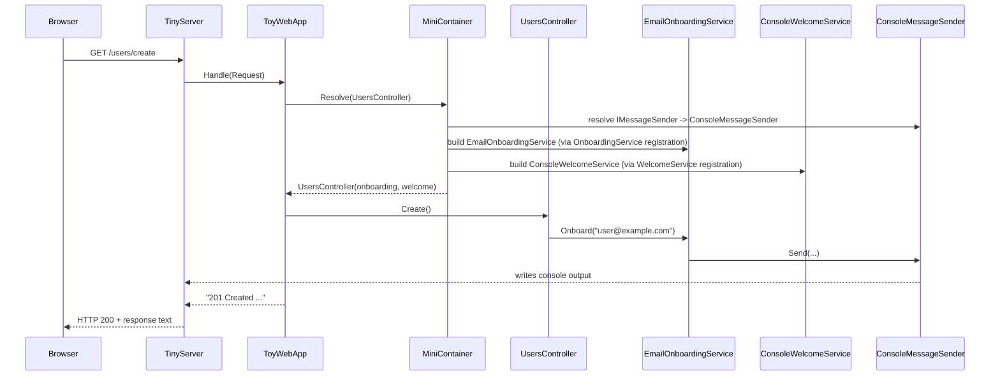
```mermaid
sequenceDiagram
participant Browser
participant Server as TinyServer
participant App as ToyWebApp
participant C as MiniContainer
participant Ctrl as UsersController
participant Onb as EmailOnboardingService
participant Wel as ConsoleWelcomeService
participant Msg as ConsoleMessageSender

Browser->>Server: GET /users/create
Server->>App: Handle(Request)
App->>C: Resolve(UsersController)
C->>Msg: resolve IMessageSender -> ConsoleMessageSender
C->>Onb: build EmailOnboardingService (via OnboardingService registration)
C->>Wel: build ConsoleWelcomeService (via WelcomeService registration)
C-->>App: UsersController(onboarding, welcome)
App->>Ctrl: Create()
Ctrl->>Onb: Onboard("user@example.com")
Onb->>Msg: Send(...)
Msg-->>Server: writes console output
App-->>Server: "201 Created ..."
Server-->>Browser: HTTP 200 + response text
```

### Why This Removes the Mystery

- students can see that container resolution is deterministic recursion, not magic
- controller activation is just object construction at request time
- transitive dependencies are discovered from constructor signatures

### Demo Prerequisites

> - Run from the repository root so relative demo paths work as written.
> - Ensure port `5005` is available, or change the `prefix` value in the script.
> - On some systems, `HttpListener` may require extra URL binding permissions.

### How to Run the Demo

File-based run (recommended):

```bash
dotnet run demos/10-dependency-injection/di-toy-container-and-web-server-demo.cs
```

Then call the endpoints:

```bash
curl http://localhost:5005/users/create
curl http://localhost:5005/users/hello
curl "http://localhost:5005/users/hello?name=Jeff"
```

Expected behavior:

- terminal prints route instructions and `Listening...`
- `/users/create` prints a simulated email line to console and returns `200 OK` with body `201 Created ...`
- `/users/hello` writes `Hello!` to console and returns that same text
- `/users/hello?name=Jeff` writes `Hello, Jeff!` to console and returns that same text

If port `5005` is already in use, change the `prefix` constant near the bottom of the script and rerun.

### Step-Through Debugging Plan

Set breakpoints in this order:

1. `ToyWebApp.Handle(...)`
2. `MiniContainer.Resolve(Type serviceType)` (first line)
3. `UsersController.Create()`

Then hit `/users/create` and watch:

- recursive calls build `UsersController -> OnboardingService -> EmailOnboardingService -> ConsoleMessageSender`
- the same resolve also builds `WelcomeService -> ConsoleWelcomeService` for the same controller constructor
- stack frames unwind as each dependency instance is created
- action invocation happens only after full controller construction

---
## 12. Real-World Summary

### Practical Guidance

- Start with `manual DI` for smaller jobs/services and explicit composition roots.
- Use a `container` when object graphs become large and lifetime rules matter.
- Keep one `composition root` per app boundary (startup/bootstrap).
- Keep service-locator APIs out of domain code (dotnet: `IServiceProvider` / Spring: `ApplicationContext` or `ObjectProvider`).
- Treat `lifetimes` as correctness constraints, not performance knobs.
- Use DI to automate DIP consistently across environments and deployments.

### Ousterhout Reference Map (Chapters 1-8)

- Ch. 1 (`Introduction`): design quality is about sustaining change, not just making code run today.
- Ch. 2 (`The Nature of Complexity`): DI reduces dependency-related cognitive load and change risk.
- Ch. 3 (`Working Code Isn't Enough`): composition-root discipline is a strategic investment.
- Ch. 4 (`Modules Should Be Deep`): stable abstractions + hidden wiring details produce deeper modules.
- Ch. 5 (`Information Hiding`): constructor injection exposes requirements while hiding construction mechanics.
- Ch. 6 (`General-Purpose Modules Are Deeper`): DI containers provide reusable composition infrastructure.
- Ch. 7 (`Different Layer, Different Abstraction`): policy, composition, and infrastructure should stay at distinct abstraction levels.
- Ch. 8 (`Pull Complexity Downwards`): DI and composition root move volatility away from policy code.


### Common Misconceptions

- "DI requires a framework container." (false: manual DI is valid)
- "Container usage guarantees good architecture." (false: abstractions can still be poor)
- "More injected services always means more decoupling." (false: often SRP drift)
- "Service locator is equivalent to constructor injection." (false: dependencies become hidden)
- "Singleton is always better for performance." (false: captive dependency bugs are costly)

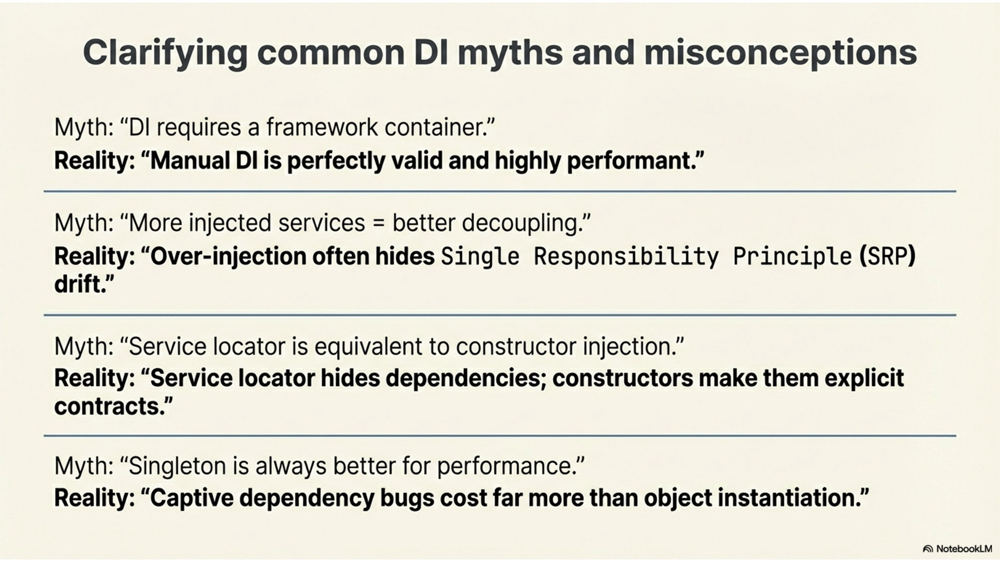

---
## Study Guide

### Core Definitions

- `Dependency Injection (DI)`: supplying required collaborators from outside a class.
- `Constructor Injection`: requiring collaborators through constructor parameters.
- `Composition Root`: the boundary where concrete object graphs are wired.
- `Object Graph`: runtime network of resolved instances.
- `Container`: tooling that registers, resolves, and manages lifetimes (dotnet: `IServiceCollection` + `IServiceProvider` / Spring: `ApplicationContext`).
- `Lifetime`: reuse boundary (dotnet: `Transient`, `Scoped`, `Singleton` / Spring: `prototype`, `request`, `singleton`).
- `Service Locator`: runtime lookup pattern that hides dependencies.

This visual recap organizes the study guide into the four ideas students most often need to recall quickly:

```mermaid
flowchart LR
    DI[Dependency Injection]
    DI --> MECH[Mechanics]
    DI --> BOUND[Boundaries]
    DI --> RISKS[Failure Modes]
    DI --> APPLY[Application]

    MECH --> CI[Constructor Injection]
    MECH --> OG2[Object Graph]
    MECH --> LIF[Lifetime and Scope]

    BOUND --> CR2[Composition Root]
    BOUND --> START[Startup Validation]

    RISKS --> SL[Service Locator]
    RISKS --> CAP[Captive Dependency]
    RISKS --> CYCLE[Cyclic Dependencies]

    APPLY --> MAN[Manual DI]
    APPLY --> CONT[Container DI]
```

### Detection Checklist

- Do classes create infrastructure dependencies directly inside business methods?
- Are constructor dependencies explicit and cohesive?
- Are lifetime rules compatible across dependency chains?
- Are service-locator APIs (dotnet: `IServiceProvider` / Spring: `ApplicationContext`) limited to boundaries/composition?
- Are circular dependencies blocked early?

### Refactoring Playbook

1. Identify one class with hidden or directly created dependencies.
2. Move required collaborators into constructor parameters.
3. Introduce focused abstractions where variation exists.
4. Create a composition root and centralize wiring.
5. Add tests using fakes/stubs for injected dependencies.
6. Introduce container registrations only when manual wiring cost is meaningful.
7. Validate registrations/lifetimes at startup.

### Exam-Focused Recall Prompts

1. Explain the difference between DIP and DI in two sentences.
2. Draw the resolution flow from a service lookup call (dotnet: `GetRequiredService<T>()` / Spring: `ApplicationContext.getBean(...)`) to object graph creation.
3. Compare manual DI and container DI with one tradeoff each.
4. Give one example of service locator and explain why it is risky.
5. Explain captive dependency and one practical fix.
6. Describe one sign of over-injection and one refactoring option.

---
## Appendix 1: Keyed Dependency Injection

This appendix is enrichment material and is **out of scope for the exam**.

Because you already learned Strategy Pattern, read keyed dependency injection as a **runtime strategy-selection mechanism provided by the DI container**.

Keyed dependency injection is a DI pattern where multiple implementations of the same abstraction are registered, and one implementation is selected using a key (for example: `"email"`, `"sms"`, `"EU"`).

Strategy mapping in this appendix:

- strategy interface: `INotificationSender` / `NotificationSender`
- concrete strategies: `EmailSender`, `SmsSender`
- strategy selector: key (`"email"`, `"sms"`)
- context/boundary resolver: endpoint, router, or boundary factory that resolves by key

Use keyed DI when:

- the abstraction is the same, but behavior varies by channel/tenant/region
- selection is configuration-driven or request-driven
- you want to avoid large `switch` statements that manually construct concrete types

Avoid keyed DI when:

- there are only one or two stable implementations and selection never changes
- a simple constructor-injected strategy/factory already expresses the variation cleanly
- string keys would spread through domain logic

### Strategy Pattern View of Keyed DI

The model is the same across frameworks:

1. Register multiple concrete strategies under different keys.
2. Select the strategy key at a boundary (controller/handler/factory), not inside core policy code.
3. Resolve the strategy by key through the container.
4. Keep keys centralized and typed where possible.

```mermaid
flowchart TB
    R[Registration] --> K1[Key: email]
    R --> K2[Key: sms]
    K1 --> I1[EmailSender]
    K2 --> I2[SmsSender]
    B[Boundary: controller/factory] --> SEL[Select key]
    SEL --> RES[Resolve by key]
    RES --> I1
    RES --> I2
    I1 --> CORE[Core policy uses abstraction]
    I2 --> CORE
```

### Terminology Mapping

| Generic concept | dotnet | Spring |
| --- | --- | --- |
| Keyed registration | `AddKeyedTransient/AddKeyedScoped/AddKeyedSingleton` | named beans (`@Component("email")`, `@Bean("email")`) and qualifiers |
| Keyed lookup API | `GetRequiredKeyedService<T>(key)` | `@Qualifier("email")` for static selection, or `Map<String, T>` / `ApplicationContext.getBean(name, type)` for runtime selection |
| Route-level key injection | `[FromKeyedServices("email")]` (ASP.NET Core endpoints/controllers) | `@Qualifier("email")` in constructor parameters |
| Default implementation | non-keyed registration or explicit key convention | `@Primary` (default bean) |

### dotnet Example

```csharp
using Microsoft.Extensions.DependencyInjection;

public interface INotificationSender
{
    Task SendAsync(string recipient, string body);
}

public sealed class EmailSender : INotificationSender
{
    public Task SendAsync(string recipient, string body) => Task.CompletedTask;
}

public sealed class SmsSender : INotificationSender
{
    public Task SendAsync(string recipient, string body) => Task.CompletedTask;
}

var services = new ServiceCollection();
services.AddKeyedScoped<INotificationSender, EmailSender>("email");
services.AddKeyedScoped<INotificationSender, SmsSender>("sms");
```

Static key at endpoint boundary:

```csharp
app.MapPost(
    "/notify/email",
    async ([FromKeyedServices("email")] INotificationSender sender, NotifyRequest req) =>
    {
        await sender.SendAsync(req.Recipient, req.Body);
    });
```

Runtime key selection via boundary factory:

```csharp
public interface INotificationSenderSelector
{
    INotificationSender For(string channelKey);
}

public sealed class NotificationSenderSelector : INotificationSenderSelector
{
    private readonly IServiceProvider _services;

    public NotificationSenderSelector(IServiceProvider services)
    {
        _services = services;
    }

    public INotificationSender For(string channelKey)
    {
        return _services.GetRequiredKeyedService<INotificationSender>(channelKey);
    }
}
```

### Spring Example

```java
public interface NotificationSender {
    void send(String recipient, String body);
}

@Component("email")
public final class EmailSender implements NotificationSender {
    public void send(String recipient, String body) { }
}

@Component("sms")
public final class SmsSender implements NotificationSender {
    public void send(String recipient, String body) { }
}
```

Static key with qualifier:

```java
@Service
public final class BillingNotifier {
    private final NotificationSender sender;

    public BillingNotifier(@Qualifier("email") NotificationSender sender) {
        this.sender = sender;
    }
}
```

Runtime key selection with bean map:

```java
@Service
public final class NotificationRouter {
    private final Map<String, NotificationSender> senders;

    public NotificationRouter(Map<String, NotificationSender> senders) {
        this.senders = senders;
    }

    public void send(String channelKey, String recipient, String body) {
        NotificationSender sender = Optional.ofNullable(senders.get(channelKey))
            .orElseThrow(() -> new IllegalArgumentException("Unsupported channel: " + channelKey));

        sender.send(recipient, body);
    }
}
```

### Design Guidance

- treat keyed DI as a strategy resolver at boundaries, not as a replacement for good strategy interfaces
- keep key selection at composition and boundary layers
- keep domain/policy services constructor-injected with explicit abstractions
- centralize key names as constants/enums/value objects to avoid string drift
- validate key-to-implementation mapping at startup when possible
- treat keyed lookup APIs as boundary tools, not domain defaults
