# MVC in Modern Web Applications:<br>DI, Services, and Domain Logic

How to understand canonical MVC, why it still matters, and how to apply it cleanly in modern server-rendered applications

[Powerpoint Presentation](11-mvc-di-srv-domain.pptx) | [PDF](11-mvc-di-srv-domain.pdf) | [Video](11-mvc-di-srv-domain.mp4)

----

This lecture continues directly from [Lecture 10: Dependency Injection](10-dependency-injection.md) and [Assignment 3: Tea Shop MVC Web Application Using SOLID Architecture](../assignments/assignment-3.md).

Lecture 10 answered:

- how objects get wired
- why composition root matters
- why high-level code should depend on abstractions

Lecture 11 answers a different question:

> once the graph is wired, *how* should a web application be organized so it stays understandable over time?

We start with canonical `MVC`, then move to modern server-rendered practice in ASP.NET Core MVC and Spring Boot MVC, where the "model" is usually more than a single data object for binding.

By the end of this lecture, students should be able to:

- explain canonical MVC and its motivation
- describe the historical path from Smalltalk to Ruby on Rails to current web frameworks
- distinguish controllers, views, services, domain logic, and infrastructure
- apply DI without letting container concerns leak into business code
- organize a project so it screams the domain rather than the framework

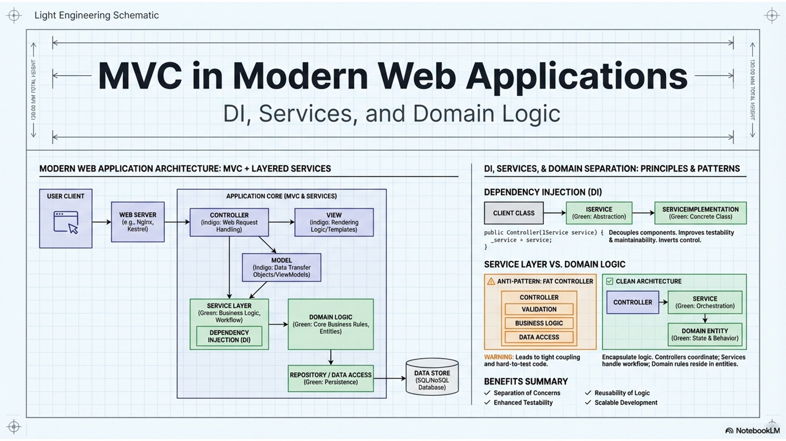

---
## Table of Contents

- [1. Introduction to MVC](#1-introduction-to-mvc)
- [2. MVC as a Pattern and Motivation](#2-mvc-as-a-pattern-and-motivation)
- [3. Historical Arc: Smalltalk to Rails to Modern MVC](#3-historical-arc-smalltalk-to-rails-to-modern-mvc)
- [4. Canonical MVC Responsibilities](#4-canonical-mvc-responsibilities)
- [5. Modern Web MVC: Why the Model Expands](#5-modern-web-mvc-why-the-model-expands)
- [6. Applying MVC with DI, Services, and Domain Logic](#6-applying-mvc-with-di-services-and-domain-logic)
- [7. Tea Shop Walkthrough](#7-tea-shop-walkthrough)
- [8. Responsibilities of Each MVC Element](#8-responsibilities-of-each-mvc-element)
- [9. Dependency Injection and Composition Root in MVC](#9-dependency-injection-and-composition-root-in-mvc)
- [10. Anti-Patterns and Failure Modes](#10-anti-patterns-and-failure-modes)
- [11. Screaming Architecture and Project Organization](#11-screaming-architecture-and-project-organization)
- [12. Real-World Summary](#12-real-world-summary)
- [Study Guide](#study-guide)
- [Appendix 1: ASP.NET Core MVC and Spring MVC Crosswalk](#appendix-1-aspnet-core-mvc-and-spring-mvc-crosswalk)
- [Appendix 2: HTTP Verbs in ASP.NET Core MVC and Spring Boot MVC](#appendix-2-http-verbs-in-aspnet-core-mvc-and-spring-boot-mvc)
- [Appendix 3: How Model Binding Works](#appendix-3-how-model-binding-works)
- [Appendix 4: Never Trust Inbound Data](#appendix-4-never-trust-inbound-data)

---
## 1. Introduction to MVC

### Two Meanings of "MVC"

When someone says "MVC," they might mean two different things. This lecture treats both, and the distinction matters.

| | MVC the **Pattern** | MVC the **Framework** |
|---|---|---|
| **Origin** | Smalltalk-80 (1979) | Rails, ASP.NET Core MVC, Spring MVC |
| **Core idea** | Separate interaction, presentation, and state into three roles | A full application architecture that ships conventions for routing, binding, DI, middleware, and project layout |
| **"Model" means** | A single object (or small cluster) holding application state and behavior | An entire **model side**: services, domain entities, repositories, strategies, DTOs, and more |
| **Primary benefit** | Cohesion and coupling — each role changes independently | All of the pattern benefits **plus** a scalable internal structure for the model side |
| **Risk if misunderstood** | Treating the controller as a coordinator that does too much | Treating "model" as a single flat bucket and wondering where business logic belongs |

This lecture starts with the pattern, then shows why modern frameworks force us to think bigger.

### MVC as a Pattern

MVC is a response to a recurring design problem:

- user interaction logic becomes tangled with rendering
- rendering becomes tangled with business state
- one object starts handling "everything"

The original promise of the pattern is simple:

> Separate responsibilities so UI code can change without dragging all business logic with it.

At its most basic:

- `Model` holds meaningful application state and behavior
- `View` transforms prepared data into the desired output representation
- `Controller` interprets user actions and coordinates the next step

This first picture is intentionally simple. We will refine it as the lecture progresses.

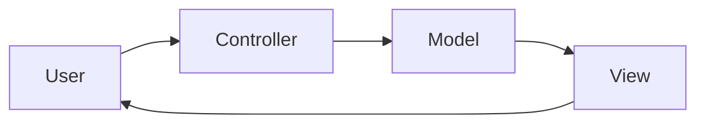
```mermaid
flowchart LR
    U[User] --> C[Controller]
    C --> M[Model]
    M --> V[View]
    V --> U
```

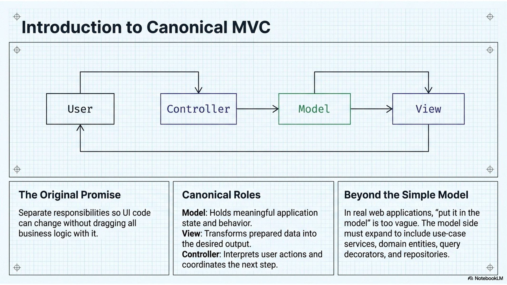

At the pattern level, the benefits are the classic separation-of-concerns wins: better cohesion, looser coupling, and clearer responsibility boundaries. That is valuable — but it is not the whole story.

### MVC as a Modern Framework

When we move from the pattern to a modern web framework (ASP.NET Core MVC, Spring Boot MVC, Rails), three things change:

1. **The model side explodes in scope.** A real application's "model" is not one object. It includes use-case services, domain entities and rules, query decorators, payment strategies, repository abstractions, and more. "Put it in the model" stops being useful guidance.
2. **The framework adds machinery the pattern never discussed.** Routing, model binding, middleware pipelines, dependency injection containers, and convention-based project layout are all framework concerns layered on top of the original triad.
3. **New architectural questions appear.** Where does orchestration live? How do domain rules stay independent of the web layer? How does the DI container wire everything without leaking into business code?

The pattern gives you the *why* — separate concerns. The framework forces you to answer the *how* — with explicit layers inside the model side.

For [Assignment 3](../assignments/assignment-3.md), the model side of the system includes:

- use-case services
- domain entities and rules
- query decorators
- payment strategies
- repository abstractions

That does **not** mean the MVC pattern is wrong. It means the pattern's single "Model" box must be expanded into a disciplined internal architecture — and that expansion is the subject of this lecture.

---
## 2. MVC as a Pattern and Motivation

Section 1 introduced the *why* — tangled code where every change touches too many places. This section makes the contrast visual.

### The Design Goal

MVC separates three kinds of change:

- changes to presentation
- changes to interaction flow
- changes to business state and behavior

Use this diagram to frame the contrast:

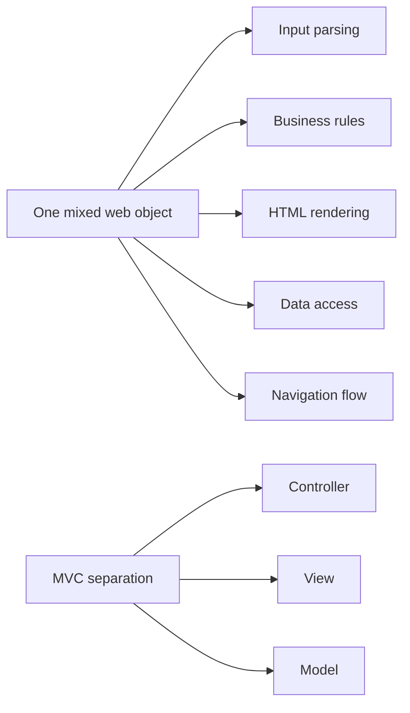
```mermaid
flowchart LR
    BAD["One mixed web object"] --> A[Input parsing]
    BAD --> B[Business rules]
    BAD --> C[HTML rendering]
    BAD --> D[Data access]
    BAD --> E[Navigation flow]

    GOOD["MVC separation"] --> C2[Controller]
    GOOD --> V2[View]
    GOOD --> M2[Model]
```

### What MVC Gives You

- better change isolation
- clearer test boundaries
- more maintainable UI-driven code
- a shared architectural vocabulary across teams and frameworks

That is why MVC lasted. It addresses a real, repeated engineering problem.

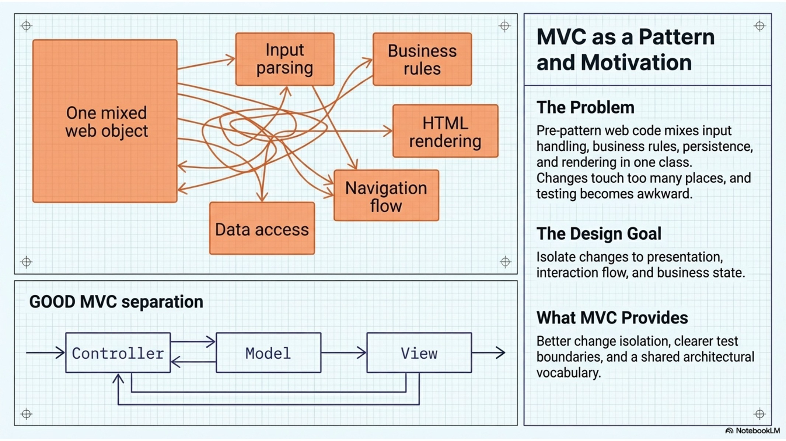

---
## 3. Historical Arc: Smalltalk to Rails to Modern MVC

### [Smalltalk](https://en.wikipedia.org/wiki/Smalltalk) Origin

MVC is commonly traced to Trygve Reenskaug's work in the late 1970s in the [Smalltalk](https://en.wikipedia.org/wiki/Smalltalk) ecosystem at Xerox PARC.

The key historical idea:

- interactive systems need separation between state, presentation, and user action handling

That is the original architectural motivation.

### [Ruby on Rails](https://rubyonrails.org/) and the Return to Popularity

MVC became highly visible again when server-rendered web frameworks made it the default mental model. [Ruby on Rails](https://rubyonrails.org/) was especially influential because it made MVC feel productive and concrete:

- routes mapped to controllers
- templates mapped to views
- application objects mapped to models

Rails did not invent MVC, but it brought MVC back into everyday web-development vocabulary.

### Modern Frameworks

Today, MVC remains central in mainstream server-rendered frameworks:

- [`ASP.NET Core MVC`](https://learn.microsoft.com/en-us/aspnet/core/mvc/overview?view=aspnetcore-10.0)
- [`Spring Boot MVC`](https://spring.io/guides/gs/serving-web-content/)
- also [Django](https://www.djangoproject.com/), [Laravel](https://laravel.com/), and others

These frameworks differ in syntax and conventions, but they preserve the same broad boundary:

- request enters controller
- business work happens outside the view
- output is rendered back to the user

### Timeline Diagram

This timeline is intentionally compact so students can keep the progression clear:

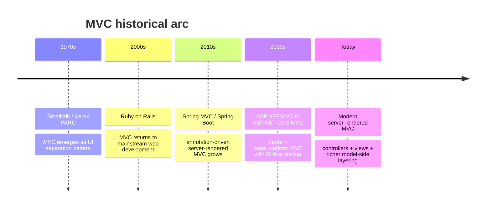
```mermaid
timeline
    title MVC historical arc
    1970s : Smalltalk / Xerox PARC
          : MVC emerges as UI separation pattern
    2000s : Ruby on Rails
          : MVC returns to mainstream web development
    2010s : Spring MVC / Spring Boot
          : annotation-driven server-rendered MVC grows
    2010s : ASP.NET MVC to ASP.NET Core MVC
          : modern cross-platform MVC with DI-first startup
    Today : Modern server-rendered MVC
          : controllers + views + richer model-side layering
```

### Historical Caution

Modern web MVC is an adaptation of the original pattern, not a literal reproduction.

In a modern web application:

- controllers are short-lived request handlers
- views render templates, not live desktop widgets
- model-side behavior often spans domain rules, orchestration services, and persistence abstractions

That is the bridge to the next section.

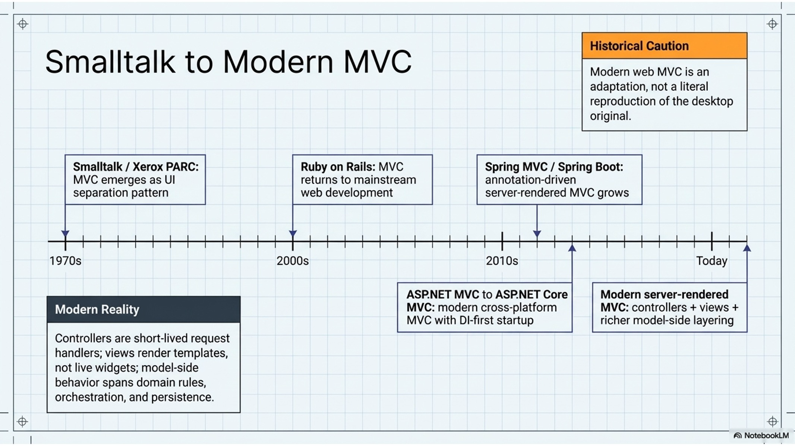

---
## 4. Canonical MVC Responsibilities

### The Canonical Roles

Use the classic interpretation first:

- `Controller`: receives the request/action and coordinates the response
- `Model`: holds meaningful state and behavior
- `View`: renders what should be shown

This remains the core teaching model.

This structural view shows the three roles before we start expanding the model side:

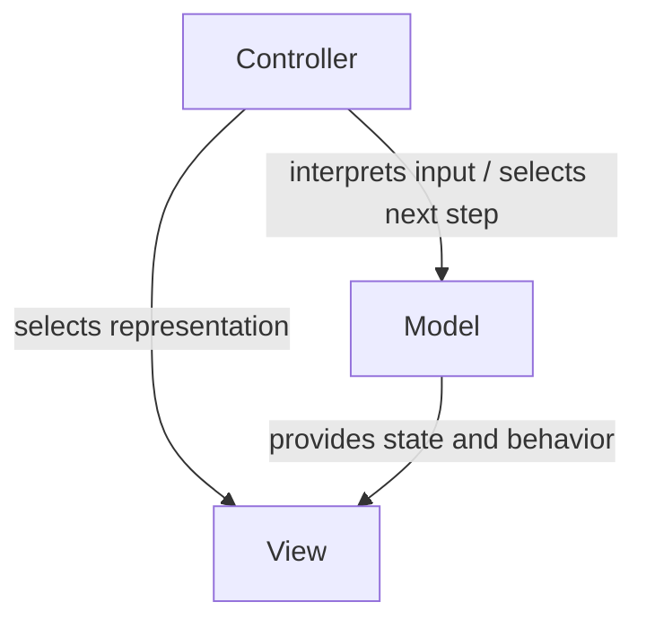
```mermaid
flowchart TB
    Controller[Controller]
    Model[Model]
    View[View]

    Controller -->|interprets input / selects next step| Model
    Controller -->|selects representation| View
    Model -->|provides state and behavior| View
```

### A Simple Request Cycle

The basic web request cycle looks like this:

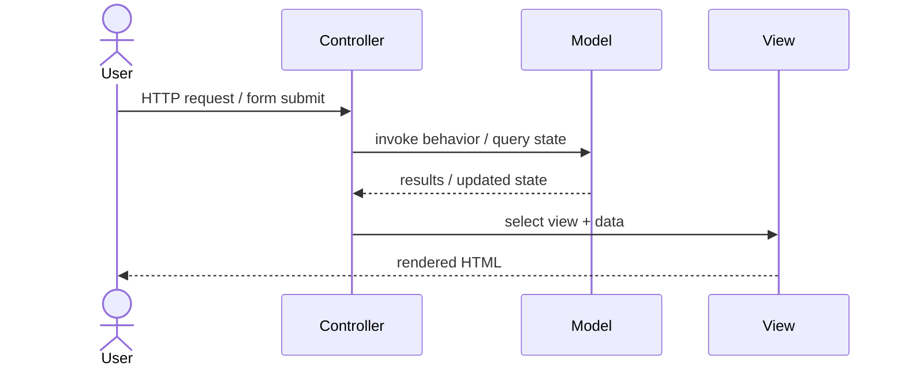
```mermaid
sequenceDiagram
    actor User
    participant Controller
    participant Model
    participant View

    User->>Controller: HTTP request / form submit
    Controller->>Model: invoke behavior / query state
    Model-->>Controller: results / updated state
    Controller->>View: select view + data
    View-->>User: rendered HTML
```

### Why This Is Worth Remembering

- views should not become business engines
- controllers should not become god objects
- the model side should carry application meaning

That is canonical MVC.

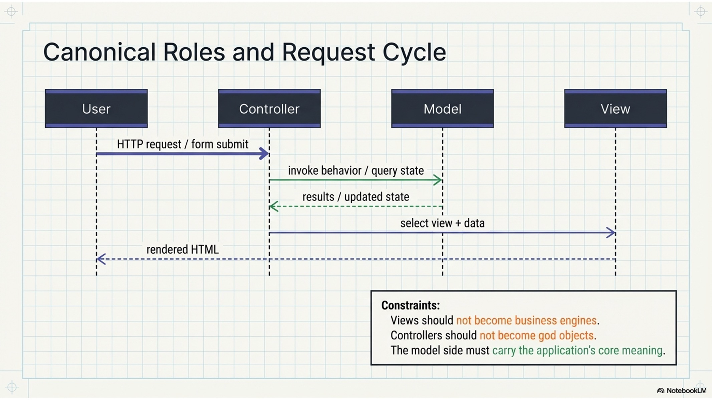

---
## 5. Modern Web MVC: Why the Model Expands

### The Problem with "Put It in the Model"

In a real application, "model" can become an overloaded bucket that hides too many responsibilities:

- domain entities
- use-case orchestration
- validation rules
- repository access
- query composition
- strategy selection
- form-binding objects

Once that happens, the word stops helping.

### Binding Model vs Domain Model vs Service Layer

Students often hear "model" and think only of a plain object used for form binding. That is too narrow.

> For a deeper explanation of how form/request objects are populated, see [Appendix 3: How Model Binding Works](#appendix-3-how-model-binding-works).

A modern MVC application typically has **multiple model-side concepts**:

- `View model` or request model: shaped for the web form
- `DTO` or command object: shaped for a service/use-case call when the controller-bound shape should not flow inward directly
- `Domain model`: business concepts and rules
- `Service layer`: orchestrates use cases
- `Repository abstraction`: hides persistence/storage detail

This decomposition diagram makes the broadened model side more explicit:

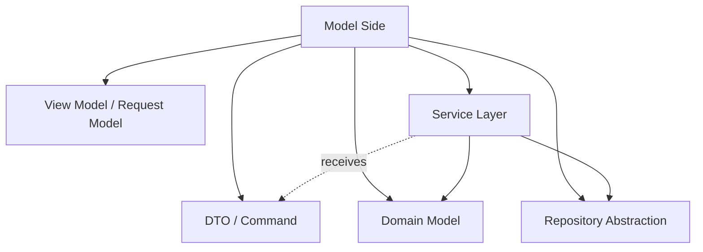
```mermaid
flowchart TB
    MODEL[Model Side]
    MODEL --> VM[View Model / Request Model]
    MODEL --> DTO[DTO / Command]
    MODEL --> SVC[Service Layer]
    MODEL --> DOM[Domain Model]
    MODEL --> REPO[Repository Abstraction]

    SVC --> DOM
    SVC --> REPO
    SVC -.->|receives| DTO
```

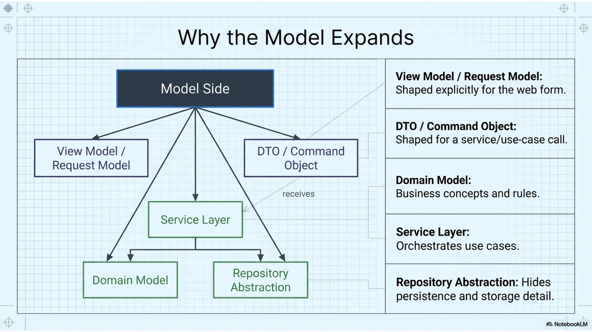

### Expanded Model Diagram

This is the key shift for the lecture: canonical MVC remains true, but the model side gets clearer internal structure.

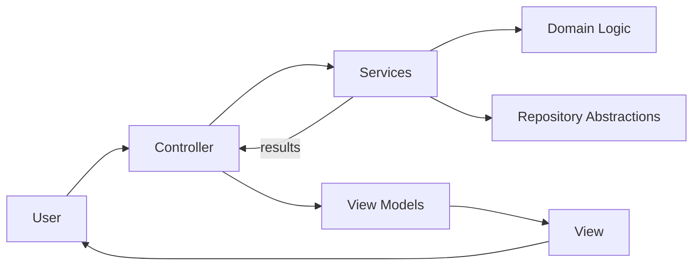
```mermaid
flowchart LR
    U[User] --> C[Controller]
    C --> S[Services]
    S --> D[Domain Logic]
    S --> R[Repository Abstractions]
    S -->|results| C
    C --> VM[View Models]
    VM --> V[View]
    V --> U
```

### Modern Interpretation

For this course, the practical interpretation is:

- controller owns HTTP concerns
- services own use-case orchestration
- domain owns business meaning and behavior
- infrastructure implements volatile runtime details

That is not a rejection of MVC. It is a disciplined application of MVC in modern systems.

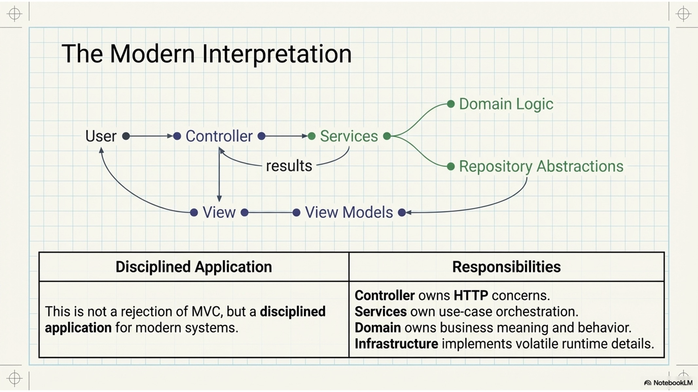

---
## 6. Applying MVC with DI, Services, and Domain Logic

### Boundary Rule

To apply MVC effectively in a modern codebase:

- inject abstractions into controllers
- keep orchestration in services
- keep business rules in domain objects/policies/strategies
- keep storage detail behind repository abstractions
- keep concrete wiring in startup/composition root

### Canonical Interfaces for the Lecture

To make dependency direction explicit, the examples below use C# interface naming:

- `IInventoryQueryService`
- `ICheckoutService`
- `IInventoryRepository`
- `IInventoryQuery`
- `IPaymentStrategyFactory`
- `IPaymentStrategy`

### Boundary Map

This diagram shows the modern MVC shape we want students to internalize:

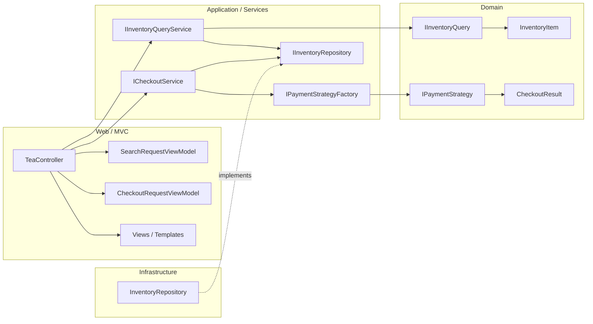
```mermaid
flowchart LR
    subgraph WEB["Web / MVC"]
        CTRL[TeaController]
        SREQ[SearchRequestViewModel]
        CREQ[CheckoutRequestViewModel]
        VIEW[Views / Templates]
    end

    subgraph APP["Application / Services"]
        IQS[IInventoryQueryService]
        ICS[ICheckoutService]
        FACT[IPaymentStrategyFactory]
        REPO[IInventoryRepository]
    end

    subgraph DOMAIN["Domain"]
        QUERY[IInventoryQuery]
        PAY[IPaymentStrategy]
        ITEM[InventoryItem]
        RES[CheckoutResult]
    end

    subgraph INFRA["Infrastructure"]
        IREP[InventoryRepository]
    end

    CTRL --> SREQ
    CTRL --> CREQ
    CTRL --> IQS
    CTRL --> ICS
    CTRL --> VIEW

    IQS --> QUERY
    IQS --> REPO
    ICS --> FACT
    ICS --> REPO
    FACT --> PAY

    QUERY --> ITEM
    PAY --> RES
    IREP -.->|implements| REPO
```

### Why This Scales Better

- controller code stays short
- domain rules do not leak into templates
- DI stays at the boundary instead of becoming a runtime crutch
- testing becomes easier because each boundary is explicit

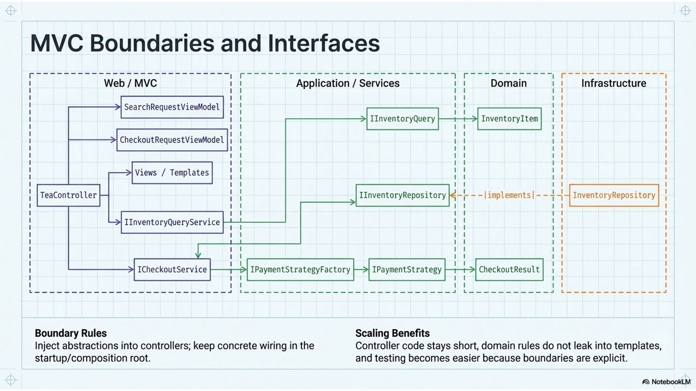

### Short Refactored Sketch

The controller below is intentionally small. That is the point.

This class diagram shows the static relationships behind that small controller:

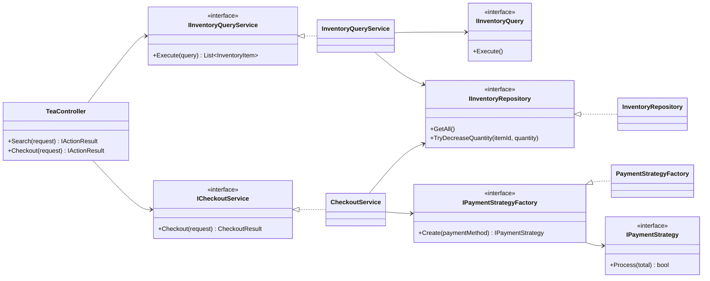
```mermaid
classDiagram
direction LR

class TeaController {
  +Search(request) IActionResult
  +Checkout(request) IActionResult
}

class IInventoryQueryService {
  <<interface>>
  +Execute(query) List~InventoryItem~
}

class ICheckoutService {
  <<interface>>
  +Checkout(request) CheckoutResult
}

class IInventoryRepository {
  <<interface>>
  +GetAll()
  +TryDecreaseQuantity(itemId, quantity)
}

class IInventoryQuery {
  <<interface>>
  +Execute()
}

class IPaymentStrategyFactory {
  <<interface>>
  +Create(paymentMethod) IPaymentStrategy
}

class IPaymentStrategy {
  <<interface>>
  +Process(total) bool
}

class InventoryQueryService
class CheckoutService
class InventoryRepository
class PaymentStrategyFactory

TeaController --> IInventoryQueryService
TeaController --> ICheckoutService
IInventoryQueryService <|.. InventoryQueryService
ICheckoutService <|.. CheckoutService
InventoryQueryService --> IInventoryQuery
InventoryQueryService --> IInventoryRepository
CheckoutService --> IInventoryRepository
CheckoutService --> IPaymentStrategyFactory
IPaymentStrategyFactory <|.. PaymentStrategyFactory
IInventoryRepository <|.. InventoryRepository
IPaymentStrategyFactory --> IPaymentStrategy
```

```csharp
public interface IInventoryQueryService
{
    List<InventoryItem> Execute(InventoryQuery query);
}

public interface ICheckoutService
{
    CheckoutResult Checkout(CheckoutCommand command);
}

public sealed class TeaController : Controller
{
    private readonly IInventoryQueryService _queryService;
    private readonly ICheckoutService _checkoutService;

    public TeaController(
        IInventoryQueryService queryService,
        ICheckoutService checkoutService)
    {
        _queryService = queryService;
        _checkoutService = checkoutService;
    }

    [HttpGet]
    public IActionResult Search(SearchRequestViewModel request)
    {
        var query = new InventoryQuery(request.Name, request.MinRating);
        List<InventoryItem> items = _queryService.Execute(query);
        return View(new SearchResultsViewModel(items));
    }

    [HttpPost]
    public IActionResult Checkout(CheckoutRequestViewModel request)
    {
        var command = new CheckoutCommand(request.ItemId, request.Quantity, request.PaymentMethod);
        CheckoutResult result = _checkoutService.Checkout(command);
        if (!result.Success) return View("Search", result.ToSearchPageModel());
        return RedirectToAction("Confirmation", new { result.OrderId });
    }
}
```

Notice the controller maps the bound view model into a domain-typed query or command before calling the service. This keeps HTTP-shaped data (view models) separate from use-case-shaped data (queries and commands). Services never see framework or presentation types.

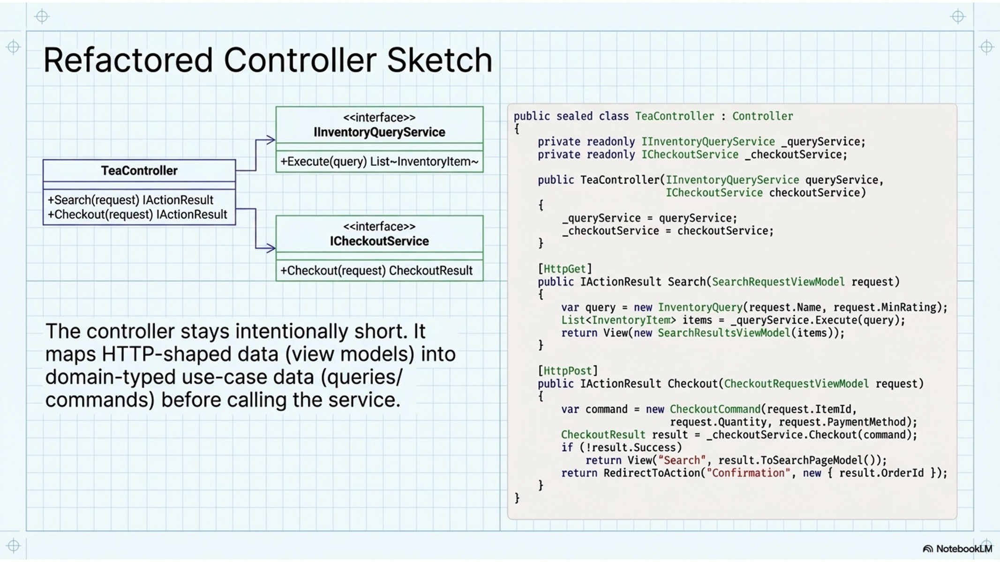

---
## 7. Tea Shop Walkthrough

### Search and Checkout Are Different Use Cases

Students should hear this clearly:

- searching inventory is one use case
- checkout is another use case
- both happen through MVC, but neither should force all logic into the controller

### Search Flow

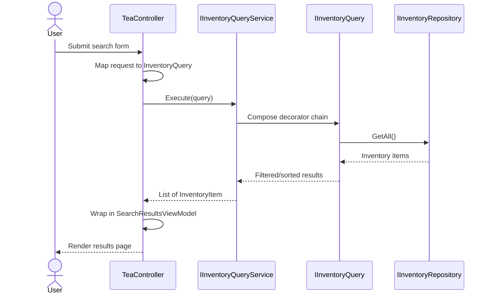
```mermaid
sequenceDiagram
    actor User
    participant Controller as TeaController
    participant QuerySvc as IInventoryQueryService
    participant Query as IInventoryQuery
    participant Repo as IInventoryRepository

    User->>Controller: Submit search form
    Controller->>Controller: Map request to InventoryQuery
    Controller->>QuerySvc: Execute(query)
    QuerySvc->>Query: Compose decorator chain
    Query->>Repo: GetAll()
    Repo-->>Query: Inventory items
    Query-->>QuerySvc: Filtered/sorted results
    QuerySvc-->>Controller: List of InventoryItem
    Controller->>Controller: Wrap in SearchResultsViewModel
    Controller-->>User: Render results page
```

Short read:

- controller maps the bound view model into a domain query and wraps the result in a view model
- service orchestrates using domain types only
- query/domain behavior does the actual filtering/sorting
- repository supplies data

### Checkout Flow

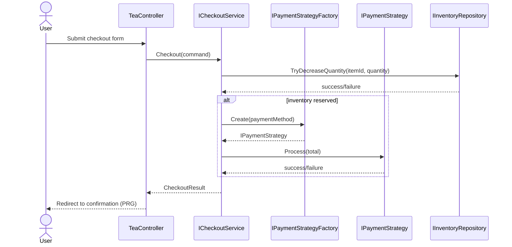
```mermaid
sequenceDiagram
    actor User
    participant Controller as TeaController
    participant Checkout as ICheckoutService
    participant Factory as IPaymentStrategyFactory
    participant Strategy as IPaymentStrategy
    participant Repo as IInventoryRepository

    User->>Controller: Submit checkout form
    Controller->>Checkout: Checkout(command)
    Checkout->>Repo: TryDecreaseQuantity(itemId, quantity)
    Repo-->>Checkout: success/failure
    alt inventory reserved
        Checkout->>Factory: Create(paymentMethod)
        Factory-->>Checkout: IPaymentStrategy
        Checkout->>Strategy: Process(total)
        Strategy-->>Checkout: success/failure
    end
    Checkout-->>Controller: CheckoutResult
    Controller-->>User: Redirect to confirmation (PRG)
```

Short read:

- inventory is reserved before payment is attempted, so a failed charge never leaves orphaned state
- controller does not choose the strategy with `switch`
- service coordinates the use case
- strategy holds the payment variation
- repository owns the shared inventory mutation boundary

### Bad Example: Overgrown Controller Drift

This bad example exists to make the contrast concrete.

```csharp
public IActionResult Checkout(CheckoutRequestViewModel request)
{
    var repository = new InventoryRepository();
    var item = repository.GetAll().Single(x => x.Id == request.ItemId);

    if (request.Quantity < 1 || request.Quantity > item.Quantity)
        return View("Error");

    IPaymentStrategy payment = request.PaymentMethod switch
    {
        "credit" => new CreditCardPaymentStrategy(),
        "applepay" => new ApplePayPaymentStrategy(),
        _ => throw new ArgumentException($"Unknown payment method: {request.PaymentMethod}")
    };

    if (!payment.Process(item.Price * request.Quantity))
        return View("Error");

    item.Quantity -= request.Quantity;
    repository.Save(item);
    return RedirectToAction("Confirmation");
}
```

Why this is bad:

- direct construction of concrete dependencies
- business logic mixed with HTTP logic
- no clean service boundary
- no clean domain extension point

---
## 8. Responsibilities of Each MVC Element

### The Short Rule Set

- **Controller:** route, bind, validate, authorize, and choose the response path.
- **Model:** represent business meaning, orchestrate use cases, and enforce rules.
- **View:** render output and collect input without becoming the business layer.

The rest of this section explains *why* each rule exists.

### Why This Section Matters

Students often understand MVC only as three boxes. That is not enough for implementation.

This section answers the more practical question:

> what is each part of MVC actually responsible for in a modern server-rendered application?

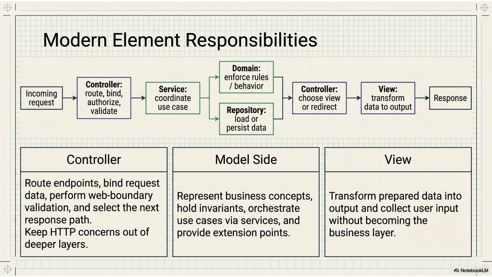

Use this diagram as the high-level map:

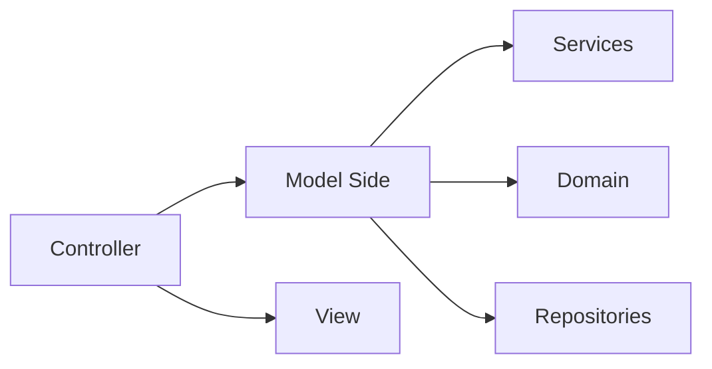
```mermaid
flowchart LR
    C[Controller] --> M[Model Side]
    M --> S[Services]
    M --> D[Domain]
    M --> R[Repositories]
    C --> V[View]
```

This request-responsibility map shows the same idea in a more procedural way:

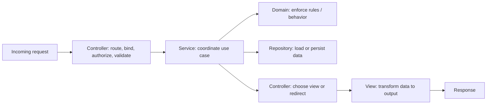
```mermaid
flowchart LR
    REQ[Incoming request]
    REQ --> C1[Controller: route, bind, authorize, validate]
    C1 --> S1[Service: coordinate use case]
    S1 --> D1[Domain: enforce rules / behavior]
    S1 --> R1[Repository: load or persist data]
    S1 --> C2[Controller: choose view or redirect]
    C2 --> V1[View: transform data to output]
    V1 --> RESP[Response]
```

### Controller Responsibilities

- `Routing and endpoint selection`
  - The controller is part of the boundary that receives requests matched by route configuration.
  - Example: `/tea/search` maps to `TeaController.Search(...)`.
- `Binding request data`
  - Controllers receive route values, query values, form posts, or JSON bodies through model binding.
  - Example: `Search(SearchRequestViewModel request)` receives query/form data already bound into the request model.
- `Security boundary participation`
  - Controllers often participate in authorization rules, but most real security enforcement is delegated to framework security features, middleware, policies, filters, sessions, or token systems such as JWT.
  - Example: an action may require an authenticated user, while the actual JWT validation happens in framework security middleware before the action runs.
  - Further reading: [Appendix 4: Never Trust Inbound Data](#appendix-4-never-trust-inbound-data).
- `Validation at the web boundary`
  - Controllers should ensure incoming requests are valid enough to enter the use-case flow.
  - Example: reject a checkout request if the posted model is missing required fields before calling `ICheckoutService`.
  - Further reading: [Appendix 4: Never Trust Inbound Data](#appendix-4-never-trust-inbound-data).
- `Selecting the next response path`
  - Controllers decide whether to render a view, redirect, return an error result, or hand back a status code.
  - Example: on successful checkout, return `RedirectToAction("Confirmation", ...)`.
- `Keeping HTTP concerns out of deeper layers`
  - Controllers should translate request/response mechanics into application calls, not drag MVC types into domain code.
  - Example: convert posted form data into a service call instead of passing `HttpRequest` into the domain.

### Model Responsibilities

In modern MVC, the model side is broader than "one plain object."

- `Representing business concepts`
  - Domain types express the real concepts of the system.
  - Example: `InventoryItem`, `CheckoutResult`, and shipping/payment concepts belong on the model side.
- `Holding business rules and invariants`
  - The model side should contain the rules that keep the system correct.
  - Example: quantity rules and payment strategy behavior should not live in the view.
- `Orchestrating use cases through services`
  - A service layer coordinates the steps of a use case without turning the controller into a god object.
  - Example: `ICheckoutService` coordinates payment processing and quantity reduction.
- `Providing extension points`
  - Modern model-side design often uses abstractions for variation and growth.
  - Example: `IPaymentStrategy` and `IInventoryQuery` allow new behaviors without rewriting the controller.

#### Model Sub-Elements

- `View models / request models`
  - Responsibility: shape data for a specific request or page.
  - Example: `SearchRequestViewModel` captures form input for the search page.
- `DTOs / command objects`
  - Responsibility: carry data from the controller boundary into a service in a shape designed for the use case rather than for HTTP binding.
  - Example: a controller may bind `CheckoutRequestViewModel`, then map it to `CreateOrderCommand` before calling a service.
- `Service layer`
  - Responsibility: orchestrate one use case across collaborators.
  - Example: `IInventoryQueryService` builds and executes the query pipeline.
- `Domain model`
  - Responsibility: hold business meaning, rules, and behavior.
  - Example: a payment strategy decides how a simulated payment is processed.
- `Repository abstractions`
  - Responsibility: hide data-access detail behind a stable interface.
  - Example: `IInventoryRepository` exposes inventory read/update behavior without exposing storage implementation details.

### View Responsibilities

- `Transforming prepared data into output`
  - Views are responsible for turning prepared data into the representation the client needs.
  - Example: render a list of teas as HTML, JSON, CSV, or another output format.
- `Displaying prepared data`
  - Views should present or serialize data given to them, not invent new business behavior.
  - Example: render `OUT OF STOCK` if that display value is already part of the prepared model.
- `Collecting user input`
  - For interactive applications, views define forms and fields that let the user submit the next action.
  - Example: search form inputs for name, rating, and price range.
- `Keeping presentation concerns local`
  - Conditional display, formatting, and output-shaping belong here when they are purely presentation concerns.
  - Example: show a success message banner after redirecting to the confirmation page.

Security reminder: [Appendix 4: Never Trust Inbound Data](#appendix-4-never-trust-inbound-data).

---
## 9. Dependency Injection and Composition Root in MVC

### DI Supports MVC, It Does Not Replace It

DI answers the question:

- who creates controllers, services, repositories, and factories?

MVC answers the question:

- where should responsibilities live once those objects exist?

That distinction matters.

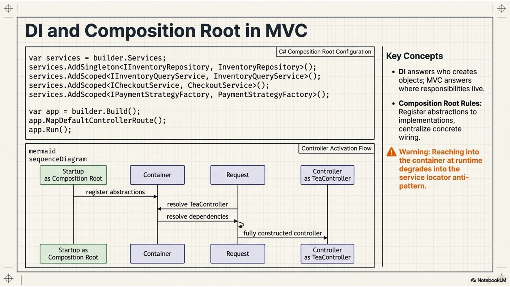

### Minimal Composition Root Sketch

This sketch is intentionally short because startup should stay short.

```csharp
var services = builder.Services;

services.AddSingleton<IInventoryRepository, InventoryRepository>();
services.AddScoped<IInventoryQueryService, InventoryQueryService>();
services.AddScoped<ICheckoutService, CheckoutService>();
services.AddScoped<IPaymentStrategyFactory, PaymentStrategyFactory>();

var app = builder.Build();
app.MapDefaultControllerRoute();
app.Run();
```

This request-activation sequence connects Lecture 10's DI ideas back to MVC:

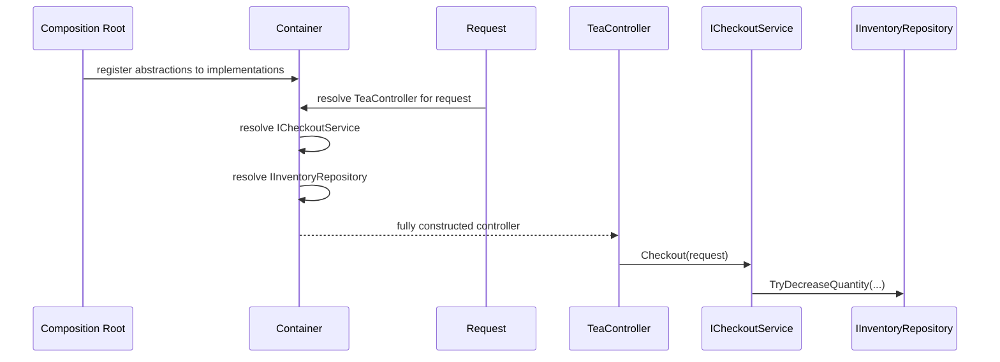
```mermaid
sequenceDiagram
    participant Startup as Composition Root
    participant Container
    participant Request
    participant Controller as TeaController
    participant Service as ICheckoutService
    participant Repo as IInventoryRepository

    Startup->>Container: register abstractions to implementations
    Request->>Container: resolve TeaController for request
    Container->>Container: resolve ICheckoutService
    Container->>Container: resolve IInventoryRepository
    Container-->>Controller: fully constructed controller
    Controller->>Service: Checkout(request)
    Service->>Repo: TryDecreaseQuantity(...)
```

### Composition Root Responsibilities

- register abstractions to implementations
- choose lifetimes intentionally
- keep concrete wiring centralized
- avoid service locator in business code

### One More Diagram

This diagram shows where DI sits relative to MVC:

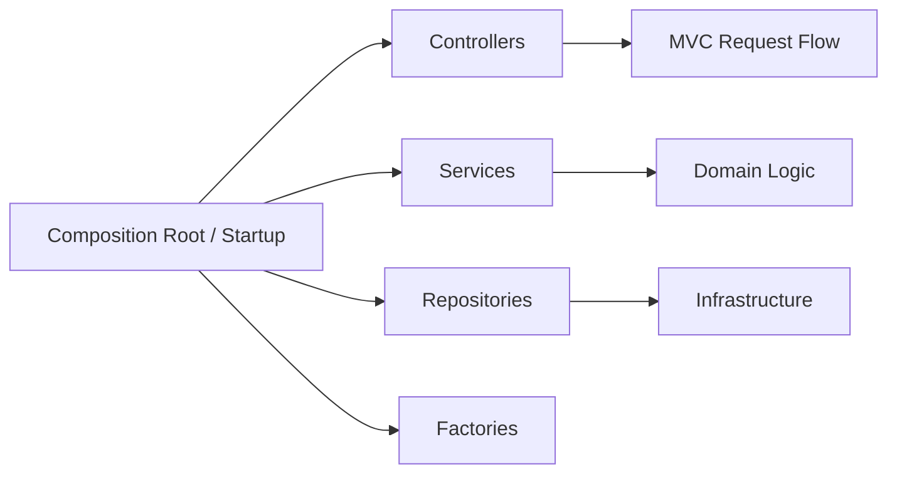
```mermaid
flowchart LR
    ROOT[Composition Root / Startup]
    ROOT --> CTRL[Controllers]
    ROOT --> SVC[Services]
    ROOT --> REP[Repositories]
    ROOT --> FAC[Factories]

    CTRL --> MVC[MVC Request Flow]
    SVC --> DOM[Domain Logic]
    REP --> INF[Infrastructure]
```

### The Rule Students Should Remember

If a controller or service reaches into `IServiceProvider` or `ApplicationContext` to fetch collaborators at runtime, the design is sliding toward service locator.

---
## 10. Anti-Patterns and Failure Modes

### Fast Scan

The following problems show up repeatedly in student and industry code:

| Smell | Typical location | Why it is risky |
| --- | --- | --- |
| overgrown controller | web layer | mixes HTTP, business rules, and data access |
| domain logic in views | templates | hides business rules in presentation code |
| service locator | business code | hides dependencies and weakens testing |
| web types in domain | domain layer | couples stable business code to framework details |
| giant service | application layer | just moves the god object out of the controller |

### Concrete Warnings

- `Controller` should not become the application
- `View` should not become the rules engine
- `Service` should not become one giant bucket for everything
- `Domain` should not know about MVC framework types
- `DI` should not become runtime lookup inside business code

---
## 11. Screaming Architecture and Project Organization

### The Main Idea

Screaming architecture asks:

> when someone opens the project, what does the project scream first: the framework, or the domain?

This extends the organizational direction from [Lecture 4: Single Responsibility Principle](04-single-responsibility-principle.md), especially the discussion of package-by-layer versus more cohesive feature-oriented structure.

Bad answer:

- `Controllers`
- `Services`
- `Repositories`
- `Models`

That structure screams the tool.

Better answer:

- `TeaCatalog`
- `Checkout`
- `Inventory`
- `Payment`

That structure screams the domain.

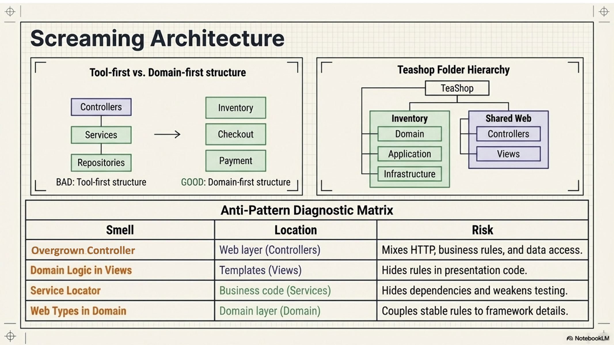

### MVC Does Not Require Tool-First Organization

A project can use MVC and still organize by domain/use case instead of by technical layer.

This is the architectural message students need for long-term success:

- MVC is a pattern for web interaction boundaries
- it does **not** require the whole repository to be organized as one giant horizontal layer cake

### Diagram: Tool-First vs Domain-First

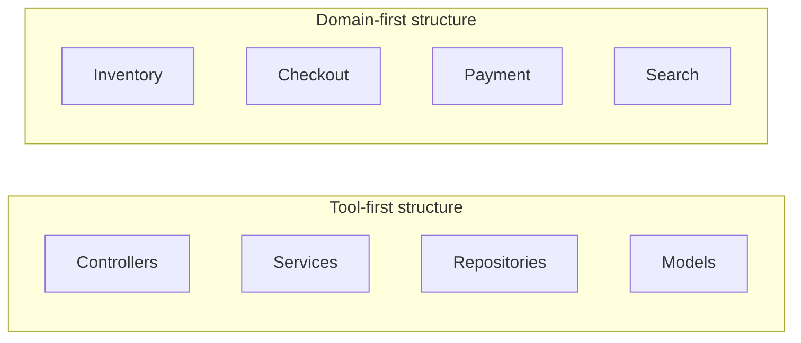
```mermaid
flowchart LR
    subgraph BAD["Tool-first structure"]
        C1[Controllers]
        S1[Services]
        R1[Repositories]
        M1[Models]
    end

    subgraph GOOD["Domain-first structure"]
        F1[Inventory]
        F2[Checkout]
        F3[Payment]
        F4[Search]
    end
```

### Tea Shop Interpretation

For [Assignment 3](../assignments/assignment-3.md), a healthy project should make the domain obvious:

- inventory
- search/query
- checkout
- payment

Inside each area, you can still use MVC/web classes, services, domain objects, and infrastructure classes.

### Concrete Folder Sketch

This is one possible direction:

```text
TeaShop/
|
|-- Inventory/
|   |-- Domain/
|   |-- Application/
|   `-- Infrastructure/
|
|-- Checkout/
|   |-- Domain/
|   |-- Application/
|   `-- Web/
|
|-- Payment/
|   |-- Domain/
|   `-- Application/
|
`-- Web/
    |-- Controllers/
    `-- Views/
```

This package-style diagram shows the same idea more visually:

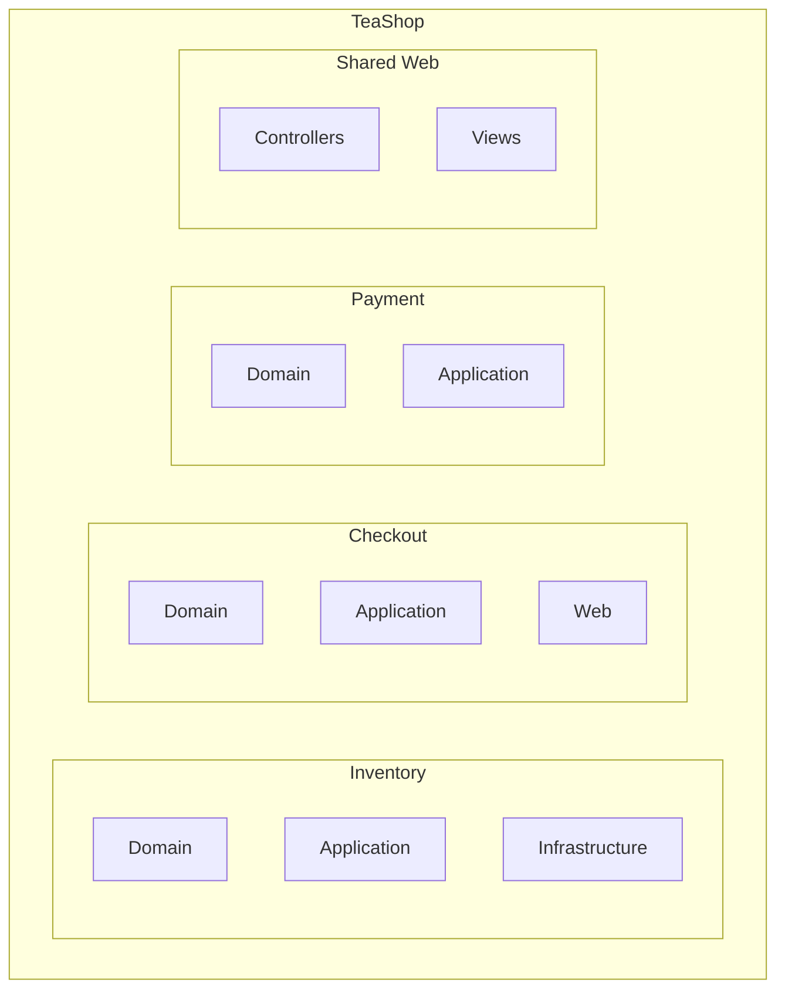
```mermaid
flowchart TB
    subgraph Teashop["TeaShop"]
        subgraph Inventory["Inventory"]
            InvDom[Domain]
            InvApp[Application]
            InvInf[Infrastructure]
        end

        subgraph Checkout["Checkout"]
            ChkDom[Domain]
            ChkApp[Application]
            ChkWeb[Web]
        end

        subgraph Payment["Payment"]
            PayDom[Domain]
            PayApp[Application]
        end

        subgraph Web["Shared Web"]
            WebCtrl[Controllers]
            WebViews[Views]
        end
    end
```

The exact shape can vary. The key idea is that the project should communicate the business problem first.

---
## 12. Real-World Summary

### Practical Guidance

- learn canonical MVC first
- do not confuse "model" with "plain binding object"
- keep controllers focused on HTTP flow
- keep services focused on use cases
- keep domain logic free from framework types
- use DI for composition, not for hidden runtime lookup
- organize the project so the domain is visible immediately

### Common MVC Misconceptions

| Claim | Reality |
|---|---|
| "The controller should do most of the work." | Controllers coordinate HTTP flow. Business logic belongs on the model side. |
| "The model is just a DTO used for binding." | The model side includes services, domain entities, repositories, and strategies — not just a binding object. |
| "Using DI automatically gives good architecture." | DI wires objects. Where responsibilities live is a separate design decision. |
| "Thin controller means one giant service." | Services should be use-case-scoped. Moving the god object from the controller to a service is not an improvement. |
| "MVC requires organizing by framework folders." | MVC is a responsibility pattern. The project can — and should — organize by domain. |

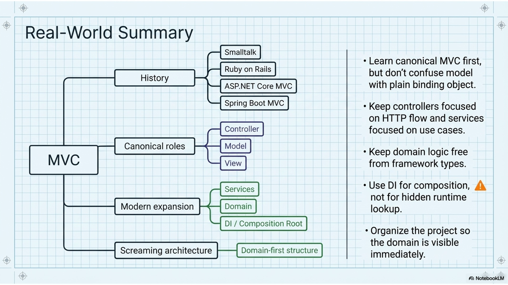

---
## Study Guide

### Core Definitions

- `MVC`: separates interaction flow, presentation, and model-side behavior/state.
- `Controller`: web boundary object that receives requests and chooses the next response step.
- `View`: rendering layer for templates/HTML.
- `Model`: the application-side state and behavior the system works with.
- `Service layer`: use-case orchestration between the web boundary and domain behavior.
- `Domain`: business concepts, rules, and variation points.
- `Composition Root`: startup boundary where abstractions are wired to concrete implementations.
- `Screaming Architecture`: organize the project so the domain is visible before the framework.

### Fast Recall Diagram

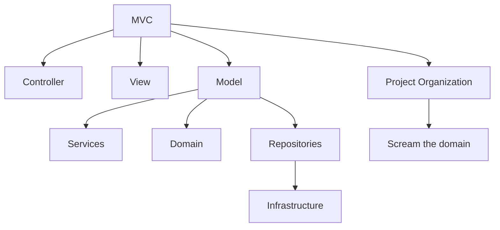
```mermaid
flowchart TB
    A[MVC]
    A --> B[Controller]
    A --> C[View]
    A --> D[Model]
    D --> E[Services]
    D --> F[Domain]
    D --> G[Repositories]
    G --> H[Infrastructure]
    A --> I[Project Organization]
    I --> J[Scream the domain]
```

### Boundary Checklist

- Does the controller stay focused on request/response flow?
- Are services use-case oriented?
- Does the domain avoid framework-specific web types?
- Are views rendering prepared data rather than enforcing business rules?
- Are abstractions injected rather than looked up at runtime?
- Does the project structure reveal the domain clearly?

### Sample Exam Questions

1. What problem was MVC originally trying to solve?
2. Why did Ruby on Rails make MVC newly visible to web developers?
3. In a modern web app, why is "put it in the model" often too vague?
4. What is the difference between a view model and a domain model?
5. How do services and DI support MVC without replacing it?
6. What does screaming architecture mean in practice?

### Terminology and Framework Examples

| MVC Element                    | Responsibility                                               | Examples/Artifacts                                           | ASP.NET Core Equivalent             | Spring Boot Equivalent                           | Constraint or Boundary Rule                                  |
| ------------------------------ | ------------------------------------------------------------ | ------------------------------------------------------------ | ----------------------------------- | ------------------------------------------------ | ------------------------------------------------------------ |
| **Controller**                 | Receives requests, coordinates response, interprets user input, and selects representation/next step. | TeaController, /tea/search endpoint, route configuration, HttpGet/HttpPost actions. | Controller / action class           | @Controller / @RestController                    | Keep controllers focused on HTTP flow; do not allow them to become 'god objects' or contain business logic. |
| **Model (Model Side)**         | Holds meaningful application state, behavior, business rules, and orchestrates use cases. | InventoryItem, CheckoutResult, Service layer, Repository abstractions, Domain entities. | Injected interface + implementation | Injected service interface/bean + implementation | Domain logic should not know about MVC framework types; services should use domain types only. |
| **View**                       | Transforms prepared data into desired output representation and collects user input. | HTML, Razor templates, Thymeleaf, Search form inputs, JSON/CSV output. | Razor (.cshtml)                     | Thymeleaf                                        | Views should not become business engines or rules engines; they should only present data. |
| **Service Layer**              | Orchestrates use-case steps across collaborators and domain objects. | IInventoryQueryService, ICheckoutService.                    | Injected Service Interface          | @Service / Injected Bean                         | Should not become one giant bucket for everything (Giant Service anti-pattern). |
| **Repository**                 | Hides data-access/persistence detail behind a stable interface. | IInventoryRepository, InventoryRepository implementation.    | Interface + implementation          | Interface + Bean                                 | Keep storage detail behind abstractions; avoid direct persistence calls in controllers. |
| **View Model / Request Model** | Shapes data specifically for a web form or request binding.  | SearchRequestViewModel, CheckoutRequestViewModel.            | Action parameter / View model       | Request DTO / Form-backing object                | Do not bind directly into deep domain entities; keep the bindable surface area small to avoid over-posting. |


---
## Appendix 1: ASP.NET Core MVC and Spring MVC Crosswalk

This appendix is comparison material. The main lecture stays framework-neutral.

### Terminology Crosswalk

| Concept | ASP.NET Core MVC | Spring Boot MVC |
| --- | --- | --- |
| Controller | `Controller` / action class | `@Controller` |
| View/template | Razor | Thymeleaf (or similar) |
| Request/form model | action parameter / view model | request DTO / form-backing object |
| Service layer | injected interface + implementation | injected service interface/bean + implementation |
| Repository abstraction | interface + implementation | interface + bean |
| Composition root | `Program.cs` | application bootstrap + configuration |
| Redirect after POST | `RedirectToAction(...)` | `"redirect:/..."` |

### Minimal Startup Sketch

ASP.NET Core MVC:

```csharp
services.AddSingleton<IInventoryRepository, InventoryRepository>();
services.AddScoped<IInventoryQueryService, InventoryQueryService>();
services.AddScoped<ICheckoutService, CheckoutService>();
services.AddScoped<IPaymentStrategyFactory, PaymentStrategyFactory>();
```

Spring Boot MVC:

```java
@Configuration
public class TeaShopConfiguration {
    @Bean
    public IInventoryRepository inventoryRepository() {
        return new InventoryRepository();
    }
}
```

The syntax differs, but the architectural message is the same:

- controllers depend on abstractions
- services orchestrate use cases
- domain logic stays out of templates
- concrete wiring belongs at startup

---
## Appendix 2: HTTP Verbs in ASP.NET Core MVC and Spring Boot MVC

This appendix is a practical HTTP review for controller design.

### Why Verbs Matter

Choosing the verb is not framework trivia. The verb communicates intent:

- `GET` means read
- `POST` means create or submit a command
- `PUT` means replace
- `PATCH` means partially change
- `DELETE` means remove

If the verb is wrong, the endpoint becomes harder to reason about for:

- humans
- caches
- proxies
- clients
- tests

### A Simple Decision Diagram

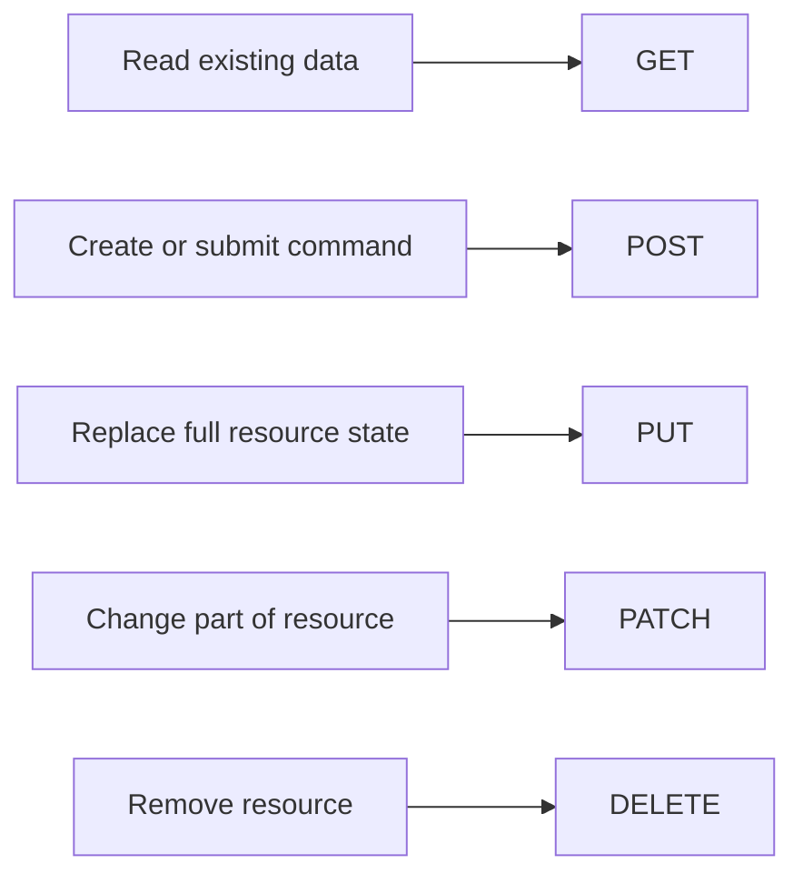
```mermaid
flowchart LR
    READ[Read existing data] --> GET[GET]
    CREATE[Create or submit command] --> POST[POST]
    REPLACE[Replace full resource state] --> PUT[PUT]
    PARTIAL[Change part of resource] --> PATCH[PATCH]
    REMOVE[Remove resource] --> DELETE[DELETE]
```

### Typical Verbs

| Verb | Typical use | Safety / idempotency | ASP.NET Core MVC | Spring MVC |
| --- | --- | --- | --- | --- |
| `GET` | Read data or render a search/details page | safe, idempotent | `[HttpGet]` | `@GetMapping` |
| `POST` | Submit a form, create a resource, invoke a non-idempotent command | not idempotent | `[HttpPost]` | `@PostMapping` |
| `PUT` | Replace the full state of a resource | idempotent | `[HttpPut]` | `@PutMapping` |
| `PATCH` | Partially update a resource | not idempotent by specification, but can be designed to be idempotent | `[HttpPatch]` | `@PatchMapping` |
| `DELETE` | Remove a resource | intended to be idempotent | `[HttpDelete]` | `@DeleteMapping` |

### Typical Usage

- Typing a URL into the browser address bar and pressing Enter issues a `GET` request.
- In normal browser use, the other verbs are not triggered by simply entering a URL; they usually require HTML form submission, JavaScript, or another HTTP client.
- Use `GET` for search pages, filter pages, and detail views.

  > `GET` is more exposed to client-side and intermediary caching behavior than most other verbs, so use extra care when the returned data is highly volatile or freshness-sensitive.
  >
  > `GET` also exposes request data directly in the URL, which makes it easier for a user to inspect and manipulate values by hand. A query string such as `?isAdmin=true` should immediately raise suspicion; security-sensitive state should not depend on user-editable URL values.
  >
  > See [Appendix 4: Never Trust Inbound Data](#appendix-4-never-trust-inbound-data).
- Use `POST` for HTML form submissions that create state changes.
- Use `PUT` only when the client is replacing the whole resource representation.
- Use `PATCH` when only part of the resource is changing.
- Use `DELETE` when the intent is removal.

For [Assignment 3](../assignments/assignment-3.md):

- search page or search results -> `GET`
- checkout submission -> `POST`

### Lesser-Known Verbs

These do exist, but students see them less often in day-to-day CRUD examples.

| Verb | Purpose | ASP.NET Core MVC | Spring MVC |
| --- | --- | --- | --- |
| `HEAD` | Same semantics as `GET`, but return headers only and no body | `[HttpHead]` | usually handled transparently with `@GetMapping`; explicit `@RequestMapping(method = RequestMethod.HEAD)` when needed |
| `OPTIONS` | Discover allowed methods and support scenarios such as CORS preflight | commonly handled at the endpoint/middleware layer; use `[AcceptVerbs("OPTIONS")]` when you truly need an explicit action | often handled automatically with the `Allow` header; explicit `@RequestMapping(method = RequestMethod.OPTIONS)` when needed |
| `TRACE` | Diagnostic loop-back verb; rarely exposed in application controllers | rare; prefer not to expose in normal app code | available through `RequestMethod.TRACE`, but rarely used in normal controllers |
| `CONNECT` | Tunnel-oriented verb, usually for proxies | not typical application-controller behavior | not typical application-controller behavior |

### Rule of Thumb

If you are writing normal MVC controllers for a web application:

- spend most of your time on `GET` and `POST`
- understand `PUT`, `PATCH`, and `DELETE`
- know what `HEAD` and `OPTIONS` are
- avoid unusual verbs unless you have a very specific protocol need

---
## Appendix 3: How Model Binding Works

This appendix exists to remove the feeling that model binding is "magic."

### What Model Binding Actually Does

Model binding automates a mechanical task:

- inspect the action parameter or target object
- find matching values in the request
- convert those values to the target types
- populate the object or parameter list
- record binding/validation errors

Without model binding, developers would manually:

- read route values
- read query string values
- read form fields
- parse strings into typed values
- assign values one property at a time

### The High-Level Pipeline

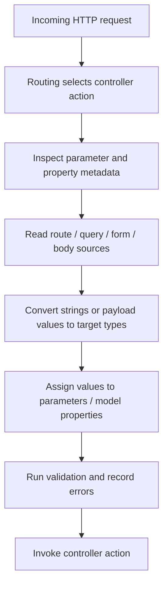
```mermaid
flowchart TB
    REQ[Incoming HTTP request] --> ROUTE[Routing selects controller action]
    ROUTE --> META[Inspect parameter and property metadata]
    META --> SRC[Read route / query / form / body sources]
    SRC --> CONVERT[Convert strings or payload values to target types]
    CONVERT --> ASSIGN[Assign values to parameters / model properties]
    ASSIGN --> VALIDATE[Run validation and record errors]
    VALIDATE --> ACTION[Invoke controller action]
```

### Where the "Magic" Really Comes From

The framework still has to do very ordinary work under the hood:

- inspect action parameter names and types
- inspect public bindable properties
- inspect metadata attributes/annotations
- match incoming names to target names
- run converters / formatters / input formatters

Reflection is necessary to achieve this because the framework must inspect runtime type information before it can know:

- what parameters exist
- what properties are bindable
- what target types need conversion
- what attributes/annotations change the binding behavior

So model binding is not magic. It is runtime metadata inspection plus conversion rules plus validation.

### Source-to-Target View

| Request source | Common ASP.NET Core MVC examples | Common Spring MVC examples |
| --- | --- | --- |
| route values | `id` from `/products/5` | `@PathVariable Long id` |
| query string | `?sort=price` | `@RequestParam String sort` |
| form fields | HTML form post to a view model | `@ModelAttribute` form object |
| request body | `[FromBody]` JSON payload | `@RequestBody` JSON payload |

### A Concrete Walkthrough

Suppose the action looks like this:

```csharp
public IActionResult Search(SearchRequestViewModel request)
```

And the request URL is:

```text
/tea/search?name=green&minRating=4
```

The binder roughly does this:

1. Routing selects the `Search(...)` action.
2. The framework sees that the target type is `SearchRequestViewModel`.
3. It inspects the bindable properties on that type.
4. It looks for matching names such as `name` and `minRating` in the request.
5. It converts incoming text values to the property types.
6. It records errors if conversion or validation fails.
7. It invokes the action with the populated object.

### A Concrete POST JSON Example

The same mechanics apply to JSON request bodies, except the framework uses body readers and input formatters instead of route/query/form value lookup.

This flow shows the nested body being turned into a bound object graph:

```mermaid
flowchart TB
    BODY[POST /orders JSON body] --> ACTION["CreateOrder([FromBody]<br>CreateOrderRequest request)"]
    ACTION --> ROOT[CreateOrderRequest]
    ROOT --> CID[CustomerId]
    ROOT --> ADDR[ShippingAddressRequest]
    ROOT --> ITEMS[List of CartItemRequest]
    ADDR --> ST1[Street1]
    ADDR --> CITY[City]
    ADDR --> STATE[State]
    ADDR --> ZIP[PostalCode]
    ITEMS --> ITEM1[CartItemRequest]
    ITEMS --> ITEMN[CartItemRequest]
```

Suppose a client sends this `POST /orders` request body:

```json
{
  "customerId": "CUST-1042",
  "shippingAddress": {
    "street1": "123 Peach Tree Ln",
    "city": "Marietta",
    "state": "GA",
    "postalCode": "30060"
  },
  "items": [
    {
      "id": "TEA-101",
      "name": "Jasmine Green Tea",
      "quantity": 2
    },
    {
      "id": "TEA-205",
      "name": "Earl Grey Supreme",
      "quantity": 1
    }
  ]
}
```

If the controller action looks like this:

```csharp
[HttpPost]
public IActionResult CreateOrder([FromBody] CreateOrderRequest request)
```

then the JSON can bind into POCOs like these:

```csharp
public sealed class CreateOrderRequest
{
    public string CustomerId { get; set; } = "";
    public ShippingAddressRequest ShippingAddress { get; set; } = new();
    public List<CartItemRequest> Items { get; set; } = new();
}

public sealed class ShippingAddressRequest
{
    public string Street1 { get; set; } = "";
    public string City { get; set; } = "";
    public string State { get; set; } = "";
    public string PostalCode { get; set; } = "";
}

public sealed class CartItemRequest
{
    public string Id { get; set; } = "";
    public string Name { get; set; } = "";
    public int Quantity { get; set; }
}
```

This object-shape view makes the nested POCO structure easier to see:

```mermaid
classDiagram
direction TB

class CreateOrderRequest {
  +string CustomerId
  +ShippingAddressRequest ShippingAddress
  +List~CartItemRequest~ Items
}

class ShippingAddressRequest {
  +string Street1
  +string City
  +string State
  +string PostalCode
}

class CartItemRequest {
  +string Id
  +string Name
  +int Quantity
}

CreateOrderRequest --> ShippingAddressRequest
CreateOrderRequest --> CartItemRequest
```

What the framework is doing here is still not magic:

1. it sees `[FromBody] CreateOrderRequest`
2. it reads the JSON body
3. it inspects the target type and nested property types
4. it matches JSON property names like `shippingAddress` and `items`
5. it creates the nested `ShippingAddressRequest` object
6. it creates each `CartItemRequest` in the array
7. it assigns the converted values and records any binding/format errors

### ASP.NET Core MVC and Spring MVC Mechanically

The mechanics are similar even though the APIs differ:

| Step | ASP.NET Core MVC | Spring MVC |
| --- | --- | --- |
| action selected | routing picks controller action | handler mapping picks controller method |
| target discovered | action parameters / bindable properties | method parameters / model attribute target |
| source values read | route, query, form, body, etc. | request params, path vars, form data, body, etc. |
| conversion performed | model binder + converters/input formatters | `WebDataBinder` + converters/formatters |
| errors recorded | `ModelState` | binding/validation result objects |

### Good Practice for Maintainable Models

The biggest maintainability mistake is treating one large bindable object as the universal model for everything.

Prefer this instead:

- make a dedicated request model per use case or form
- keep the bindable surface area small
- do not bind directly into deep domain entities
- keep nested graphs shallow unless you truly need them
- map from web model to domain model explicitly
- add custom converters/formatters for real value objects instead of stringly typed hacks
- validate at the boundary, then hand clean data to the application/domain layer

### Good Practice Table

| Practice | Why it helps |
| --- | --- |
| one form model per use case | avoids giant all-purpose bindable objects |
| do not bind directly to entities | protects domain invariants and reduces accidental coupling |
| prefer small, explicit property sets | reduces accidental over-posting / mass assignment risk |
| use converters for rich value types | keeps parsing logic out of controllers |
| keep names stable and intentional | makes binding predictable over time |
| version models when workflows change significantly | prevents one model from accreting unrelated fields forever |

### The Security and Design Warning

Binding everything that is publicly settable is convenient, but convenience can become risk.

Students should remember:

- the easier it is to bind every public property, the easier it is to bind something you did not intend
- a dedicated form/request model is safer than exposing a large domain object to the web boundary

Further reading: [Appendix 4: Never Trust Inbound Data](#appendix-4-never-trust-inbound-data).

Tiny example:

```json
{
  "customerId": "CUST-1042",
  "isAdmin": true
}
```

```csharp
public sealed class Customer
{
    public string CustomerId { get; set; } = "";
    public bool IsAdmin { get; set; }
}
```

If that domain object is exposed directly to the web boundary, a client may be able to bind fields such as `IsAdmin` that were never meant to come from the request. A dedicated request model avoids exposing sensitive or irrelevant properties for binding.

### Final Mental Model

Use this sentence:

> model binding is automated request parsing plus conversion plus validation, driven by runtime metadata.

That sentence removes most of the mystery.

---
## Appendix 4: Never Trust Inbound Data

This appendix is a security mindset reminder for every controller and service boundary.

### The Top Rule

> **Never** trust anything coming from the client.

That includes:

- route values
- query string values
- form fields
- JSON request bodies
- cookies
- headers
- hidden form fields
- JavaScript-generated requests

If it came from the client, it can be manipulated.

This trust-boundary view is the security mindset in one picture:

```mermaid
flowchart LR
    subgraph Outside["Outside the trust boundary"]
        Browser[Browser]
        Script[Script / API client]
        Proxy[Burp / intercepting proxy]
    end

    subgraph Inside["Server-side trust boundary"]
        Controller[Controller]
        Validation[Validation]
        Auth[Authorization]
        Rules[Business Rules]
    end

    Browser --> Controller
    Script --> Controller
    Proxy --> Controller
    Controller --> Validation
    Validation --> Auth
    Auth --> Rules
```

### What Is the Attack Surface?

The `attack surface` of an MVC application is the total set of places where an external caller can interact with the system and try to influence its behavior.

In practical terms, the attack surface includes:

- routes and controller actions
- query string parameters
- route parameters
- form fields
- JSON request bodies
- headers
- cookies
- uploaded files
- authentication endpoints
- administrative endpoints
- any client-visible identifier or token

If a client can reach it, submit it, replay it, mutate it, or observe it, it is part of the attack surface.

For MVC applications, this means the attack surface is not just "the controller method." It includes the whole inbound path:

- browser-visible URLs
- forms and hidden fields
- JavaScript-generated requests
- model binding targets
- authorization boundaries
- server-side workflows triggered by the request

That is why controller design, model binding, validation, authorization, and narrow request models all matter together.

### Why This Rule Exists

Students sometimes assume that browser-submitted data is trustworthy because:

- the form looked correct
- the UI did not expose a certain field
- the JavaScript only sent allowed values

That assumption is dangerous.

Inbound data can be altered easily:

- directly in the browser URL bar
- through browser developer tools
- by modifying JavaScript requests in the console
- with intercepting proxy tools such as `Burp Suite`
- with API clients such as `curl` or Postman

### Tampering Diagram

```mermaid
flowchart TB
    U[User / attacker] --> B[Browser or script]
    B --> T[Modify route, query, form, JSON, headers]
    T --> P[Intercept / replay / alter request]
    P --> C[Controller]
    C --> V[Validate, authorize, constrain, reject when needed]
```

### What Must Always Be Checked

- `Validation`
  - Ensure required fields exist and are well-formed.
  - Example: quantity must be an integer greater than zero.
- `Authorization`
  - Ensure the caller is allowed to perform the requested action.
  - Example: a user may submit `customerId=someone-else`, but that does not mean they are allowed to act on that customer.
- `Business rule enforcement`
  - Ensure the request is valid in the business context.
  - Example: a posted order quantity may be syntactically valid but still exceed available stock.
- `Data ownership checks`
  - Ensure the current user is allowed to access the referenced resource.
  - Example: an order ID in the route must still be checked against the authenticated user's scope.
- `Server-side recomputation`
  - Do not trust client-submitted totals, prices, discount amounts, or privilege flags.
  - Example: always recompute order total on the server instead of trusting a posted `total`.

### Role Escalation Example

Suppose user `Alice` is allowed to edit another user's profile, but only within ordinary staff-level permissions.

The page might send down a request shape like this:

```json
{
  "editedUserId": "USR-204",
  "roleId": 2
}
```

If the server naively trusts the posted `roleId`, Alice can intercept the request and change it to:

```json
{
  "editedUserId": "USR-204",
  "roleId": 99
}
```

where `99` happens to mean `Root Administrator`.

That is a classic privilege-escalation bug.

This flow makes the attack path explicit:

```mermaid
flowchart TB
    FORM[Edit user form] --> POST1["POST roleId=2<br>'User' access"]
    POST1 --> ATTACKER["User (or attacker)<br>intercepts<br>or edits request"]
    ATTACKER --> POST2["POST roleId=99<br>'System Root' access"]
    POST2 --> CTRL[Controller]
    CTRL --> CHECK[Server validates active user's allowed role transitions]
    CHECK -->|reject| DENY[403 / validation failure]
    CHECK -->|allow only if truly authorized| SAVE[Persist permitted change]
```

The important lesson is:

- the role IDs you send down are not necessarily the role IDs that come back
- the client can change identifiers, flags, and hidden fields before submission
- you should not send data to the client that it does not actually need

Server-side rules must still verify:

- whether the active user is allowed to edit the target user at all
- which roles the active user is allowed to assign
- whether assigning `Root Administrator` violates the invariant security rules for the caller's own privilege level

In other words:

- never trust the posted role ID
- derive allowed role transitions from the active user's server-side permissions
- reject any request that violates those privilege invariants even if the incoming data is well-formed

### Tiny Examples of Dangerous Assumptions

Bad assumptions:

- "the hidden field was not visible to the user"
- "the dropdown only allowed valid choices"
- "the UI never sends `isAdmin=true`"
- "the JavaScript disables the button for invalid cases"

All of those can be bypassed.

### Good Security Practice

| Rule | Why it matters |
| --- | --- |
| `NEVER trust inbound client data` | every other rule depends on this mindset |
| validate all inbound values | catches malformed or out-of-range data early |
| authorize every protected action | a valid request is not automatically an allowed request |
| enforce privilege invariants on the server | prevents role escalation and other "valid but unauthorized" state changes |
| recompute sensitive values on the server | prevents client tampering with totals, prices, roles, or flags |
| bind into narrow request models | reduces accidental exposure of sensitive properties |
| do not send unnecessary sensitive identifiers or options to the client | reduces what an attacker can trivially enumerate or modify |
| avoid exposing raw internal identifiers when possible | makes simple enumeration and tampering harder |
| prefer opaque or encrypted/encoded external identifiers where appropriate | raises the difficulty of guessing or altering identifiers |
| log suspicious input and rejected access attempts | helps detect abuse patterns |
| fail safely | reject or ignore unexpected data rather than guessing what it meant |

### About IDs

If a client can easily see and modify identifiers, they will often try.

This is especially easy when the ID appears directly in the URL, because users can edit route values by hand just as easily as query string values.

For sensitive workflows, consider:

- opaque IDs
- encrypted or signed IDs
- server-generated tokens with narrow purpose
- ownership checks even when the ID format looks valid

Encrypted or obfuscated external IDs are often a good idea because they make casual tampering and enumeration harder.

The important point is not that ID obfuscation replaces authorization. It does not.

The point is:

- do not expose more than necessary
- make casual tampering harder
- always validate the ID on the server
- always authorize on the server anyway

### Final Security Reminder

> [!IMPORTANT]
> **The browser is part of the attack surface**, not part of the trust boundary. Nothing is safe until your application receives the data and carefully verifies that the data is safe.

This mindset will prevent many controller-level security mistakes.
