# State Machine Pattern

How to model objects whose behavior changes based on internal state, using the State pattern and finite state machines

[Powerpoint Presentation](12-state-machine-pattern.pptx) | [PDF](12-state-machine-pattern.pdf)

----

State machines are one of the oldest ideas in computer science — and one of the most invisible. The regex engine that validates your input is a state machine. The network protocol that delivered this page is a state machine. The `async/await` syntax in most modern languages compiles down to a state machine. The checkout flow on every e-commerce site is a state machine. You interact with dozens of them every day without recognizing the pattern.

Despite being everywhere, state machines are rarely taught as a *design* skill. Theory of Computation covers them as math; this lecture covers them as a practical tool you reach for when an object's behavior depends on its history and your if/else chains are starting to rot. The State pattern is one of the few design patterns where an object appears to *change its class* at runtime — calling the same method on the same object produces completely different behavior depending on what has happened to it before.

---
## Table of Contents

- [1. The Problem: Behavior That Changes with State](#1-the-problem-behavior-that-changes-with-state)
- [2. Finite State Machines](#2-finite-state-machines)
- [3. The State Pattern](#3-the-state-pattern)
- [4. Implementation Walkthrough: Order Processing](#4-implementation-walkthrough-order-processing)
- [5. Industry Examples](#5-industry-examples)
- [6. State Pattern vs Conditional Logic](#6-state-pattern-vs-conditional-logic)
- [7. Anti-Patterns and Failure Modes](#7-anti-patterns-and-failure-modes)
- [8. Relationship to Other Patterns](#8-relationship-to-other-patterns)
- [9. Real-World Summary](#9-real-world-summary)
- [Study Guide](#study-guide)
- [Appendix 1: MVC Email Finder - State Pattern in a Web Application](#appendix-1-mvc-email-finder---state-pattern-in-a-web-application)
- [Appendix 2: DFA for Pattern Matching - Finding "men" or "women"](#appendix-2-dfa-for-pattern-matching---finding-men-or-women)
- [Appendix 3: Persistence and Rehydration - Surviving a Restart](#appendix-3-persistence-and-rehydration---surviving-a-restart)
- [Appendix 4: async/await - The Compiler's State Machine](#appendix-4-asyncawait---the-compilers-state-machine)

---
## 1. The Problem: Behavior That Changes with State

### Motivating Scenario

Some objects behave differently depending on what has happened to them. Consider an order in an e-commerce system:

- a new order can be paid for but cannot be shipped
- a paid order can be shipped but cannot be paid again
- a shipped order can be delivered but cannot be cancelled
- a delivered order cannot be shipped again

Each action is valid only in certain states, and each action may move the order to a different state.

### The Naive Approach

The most obvious implementation uses conditional logic everywhere:

```csharp
public void Ship()
{
    if (_status == "Paid")
    {
        _status = "Shipped";
        Console.WriteLine("Order shipped.");
    }
    else if (_status == "New")
    {
        throw new InvalidOperationException("Cannot ship unpaid order.");
    }
    else if (_status == "Shipped")
    {
        throw new InvalidOperationException("Already shipped.");
    }
    else if (_status == "Delivered")
    {
        throw new InvalidOperationException("Already delivered.");
    }
}
```

This has a familiar design problem:

- every method repeats a branching structure over the same state variable
- adding a new state means editing every method
- the logic for one state is scattered across many methods instead of being cohesive

> **Ousterhout:** "Complexity is caused by two things: **dependencies** and **obscurity**." (*A Philosophy of Software Design*, Ch. 2). This code has both — every method depends on the same state variable, and the behavior for any single state is obscured across multiple methods. You cannot understand what a "Paid" order does without reading every method in the class.

This is the same kind of problem that the Strategy pattern solves for algorithm variation. The difference is that here, the variation axis is **internal state**, and the object transitions between behaviors over its lifetime rather than having one behavior selected at creation time.

### The Design Goal

Separate state-dependent behavior so that:

- each state is a cohesive unit
- adding a new state does not require editing every existing method
- transitions between states are explicit and traceable

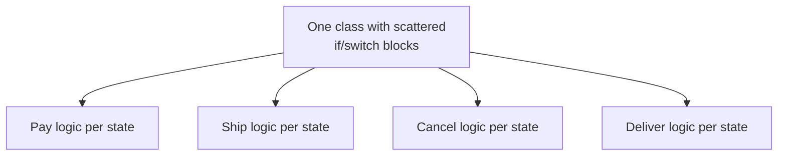
```mermaid
flowchart TB
    BAD["One class with scattered<br>if/switch blocks"] --> A[Pay logic per state]
    BAD --> B[Ship logic per state]
    BAD --> C[Cancel logic per state]
    BAD --> D[Deliver logic per state]
```

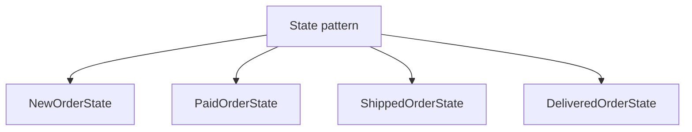
```mermaid
flowchart TB

    GOOD["State pattern"] --> S1[NewOrderState]
    GOOD --> S2[PaidOrderState]
    GOOD --> S3[ShippedOrderState]
    GOOD --> S4[DeliveredOrderState]
```

---
## 2. Finite State Machines

### What a Finite State Machine Is

A finite state machine (FSM) is a formal model with:

- a finite set of **states** — e.g., `New`, `Paid`, `Shipped`, `Delivered`, `Cancelled`. "Finite" means the set is fixed and known at design time; the machine cannot invent a state at runtime.
- a finite set of **events** (also called inputs or triggers)

  `Pay`, `Ship`, `Deliver`, `Cancel`. These are the actions that can cause the machine to change state.
- a **transition function** that maps (current state, event) to a next state

  (Paid, Ship) -> Shipped, but also (Paid, PaymentDeclined) -> New. Transitions do not have to move forward — they can loop back to earlier states. This function is total: for every (state, event) pair, the outcome is defined — either a valid transition or an explicit rejection.
- an **initial state**

  Every new order starts in `New`. The machine must have exactly one starting point.
- optionally, a set of **accepting/final states** 
  `Delivered` and `Cancelled` are terminal states where the order's lifecycle ends. Not all FSMs need accepting states; the order example uses them, while a thermostat FSM cycles indefinitely.

FSMs are used across computer science and engineering: parsers, protocol handlers, UI workflows, game AI, hardware design, and business process modeling.

### State Transition Table

A transition table makes the FSM concrete. For the order example:

| Current State | Event | Next State | Action |
|---|---|---|---|
| New | Pay | Paid | Record payment |
| New | Cancel | Cancelled | Log cancellation |
| Paid | Ship | Shipped | Start shipment |
| Paid | PaymentDeclined | New | Reverse payment; return to New |
| Paid | Cancel | Cancelled | Refund payment |
| Shipped | Deliver | Delivered | Confirm delivery |
| Shipped | Cancel | *(invalid)* | Reject: already shipped |
| Delivered | *(any)* | *(invalid)* | Reject: terminal state |
| Cancelled | *(any)* | *(invalid)* | Reject: terminal state |

### State Transition Diagram

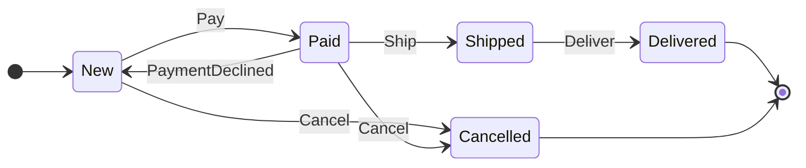
```mermaid
stateDiagram-v2
		direction lr
    [*] --> New
    New --> Paid : Pay
    New --> Cancelled : Cancel
    Paid --> Shipped : Ship
    Paid --> New : PaymentDeclined
    Paid --> Cancelled : Cancel
    Shipped --> Delivered : Deliver
    Delivered --> [*]
    Cancelled --> [*]
```

### Backward Transitions and Self-Transitions

Not all state machines move strictly forward. Two important transition types are easy to overlook when you first encounter the pattern:

**Backward transitions** move the machine to a state it has already been in. The order example demonstrates this: when a payment is declined, the order transitions from `Paid` back to `New`. The customer can then try again, creating a cycle: `New -> Paid -> New -> Paid -> Shipped -> ...`. This is common in real systems — document review workflows loop between `Draft` and `UnderReview` on each rejection, and network protocols cycle between `Connected` and `Reconnecting` on each dropped connection.

**Self-transitions** keep the machine in its current state while still performing an action. For example, a vending machine in the `AcceptingCoins` state stays in `AcceptingCoins` each time a coin is inserted — the state does not change, but the machine updates its running total. In a state diagram, a self-transition appears as an arrow that loops back to the same node:

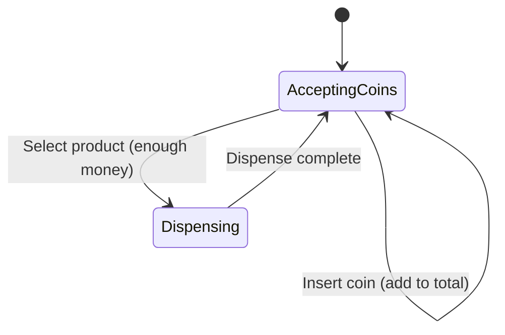
```mermaid
stateDiagram-v2
    [*] --> AcceptingCoins
    AcceptingCoins --> AcceptingCoins : Insert coin (add to total)
    AcceptingCoins --> Dispensing : Select product (enough money)
    Dispensing --> AcceptingCoins : Dispense complete
```

Both types are important because they mean a state machine's lifecycle is not necessarily a straight line from start to finish. When designing a state machine, always ask: "can this state be reached more than once?" and "does anything happen that leaves the object in the same state?"

### Why This Matters for Design

The FSM gives you a precise specification before you write code. If you cannot draw the state diagram, you probably do not understand the behavior well enough to implement it.

The State pattern is one way to implement an FSM in object-oriented code so that each state's behavior lives in its own class.

FSMs have a deeper formal foundation in theoretical computer science through the [Deterministic Finite Automaton (DFA)](https://en.wikipedia.org/wiki/Deterministic_finite_automaton) — a constrained FSM where every (state, input) pair maps to exactly one next state with no ambiguity. DFAs are the basis for regular expressions, lexical analyzers, and protocol validators. Understanding DFAs is valuable because it sharpens the same thinking that makes the State pattern work: defining states precisely, making every transition explicit, and accounting for every possible input. If you can model a problem as a DFA, the State pattern implementation almost writes itself. [Appendix 2](#appendix-2-dfa-for-pattern-matching---finding-men-or-women) explores this connection with a working example.

---
## 3. The State Pattern

### What It Is

The State pattern (GoF) allows an object to alter its behavior when its internal state changes. The object appears to change its class.

Three roles:

- **Context**: the object whose behavior varies. It holds a reference to the current state object and delegates state-dependent work to it.
- **State interface**: defines the operations that vary by state.
- **Concrete states**: each implements the state interface for one specific state, including the transition logic.

### Canonical UML Class Diagram

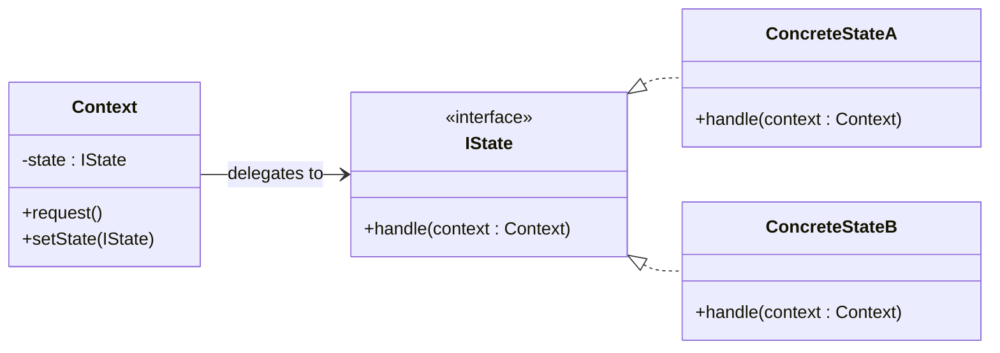
```mermaid
classDiagram
 		direction LR
    class Context {
        -state : IState
        +request()
        +setState(IState)
    }

    class IState {
        <<interface>>
        +handle(context : Context)
    }

    class ConcreteStateA {
        +handle(context : Context)
    }

    class ConcreteStateB {
        +handle(context : Context)
    }

    Context --> IState : delegates to
    IState <|.. ConcreteStateA
    IState <|.. ConcreteStateB
```

### How It Works

1. The context holds a reference to the current state object.
2. When a client calls a method on the context, the context delegates to the current state.
3. The state object performs the action and may transition the context to a new state by calling `context.SetState(new NextState())`. The next state can be a forward transition, a backward transition to a previous state, or even the same state (a self-transition).
4. The next call to the same method on the context will be handled by the new state object.

### Canonical Sequence Diagram

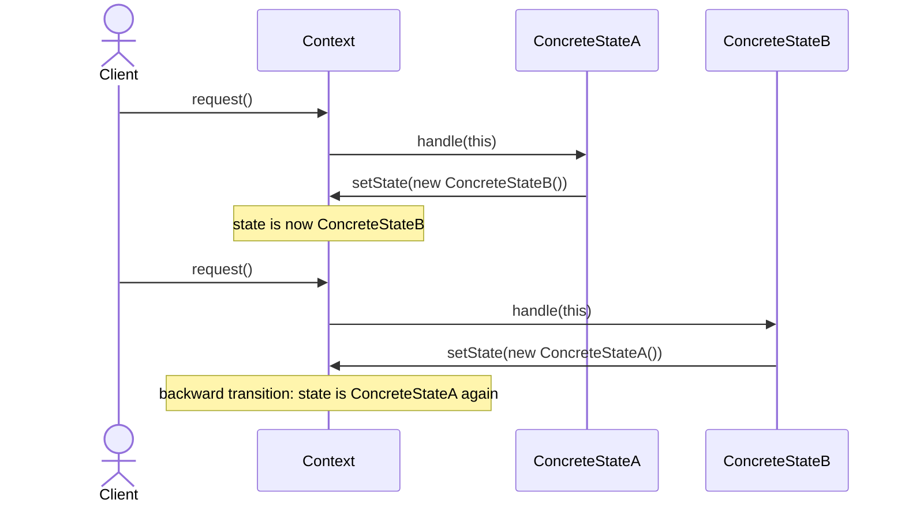
```mermaid
sequenceDiagram
    actor Client
    participant Context
    participant StateA as ConcreteStateA
    participant StateB as ConcreteStateB

    Client->>Context: request()
    Context->>StateA: handle(this)
    StateA->>Context: setState(new ConcreteStateB())
    Note over Context: state is now ConcreteStateB

    Client->>Context: request()
    Context->>StateB: handle(this)
    StateB->>Context: setState(new ConcreteStateA())
    Note over Context: backward transition: state is ConcreteStateA again
```

### Key Design Decisions

- **Who owns transitions?** Usually the concrete state classes, because they know which transitions are valid from their own state. Alternatively, the context can own transitions if transition logic needs to be centralized.
- **How is state created?** States can be created fresh on each transition or reused if they carry no per-instance data.
- **What does the state interface look like?** It should contain exactly the operations whose behavior varies by state. Operations that do not vary should stay on the context.

> **Ousterhout:** Each concrete state class is a **deep module** — it has a simple interface (`Process` or `Pay`/`Ship`/etc.) but encapsulates significant internal behavior (*A Philosophy of Software Design*, Ch. 4). The caller does not need to know *how* a shipped order handles a cancellation request; it only needs to call `Cancel()` and inspect the result. This is also an example of **defining errors out of existence** (Ch. 10) — rather than forcing callers to know which operations are valid in which state, the state object handles every operation and returns a meaningful result. The caller never has to ask "is this allowed?" because the answer is built into the contract.

---
## 4. Implementation Walkthrough: Order Processing

Design goal: model an order that moves through `New -> Paid -> Shipped -> Delivered` with a `Cancel` option from `New` and `Paid`, and a `PaymentDeclined` event that returns the order from `Paid` back to `New`.

### The If/Then Approach (What We Are Replacing)

Before examining the State pattern implementation, here is the same order-processing logic written with conditional branching. Every method must check the current status and handle every possible state:

```csharp
using System;

public sealed class Order
{
    private string _status = "New";

    public string StatusName => _status;

    public void Pay()
    {
        if (_status == "New")
        {
            Console.WriteLine("Payment recorded.");
            _status = "Paid";
        }
        else if (_status == "Paid")
            throw new InvalidOperationException("Order is already paid.");
        else if (_status == "Shipped")
            throw new InvalidOperationException("Order is already paid.");
        else if (_status == "Delivered")
            throw new InvalidOperationException("Order is already delivered.");
        else if (_status == "Cancelled")
            throw new InvalidOperationException("Order is cancelled.");
    }

    public void Ship()
    {
        if (_status == "Paid")
        {
            Console.WriteLine("Order shipped.");
            _status = "Shipped";
        }
        else if (_status == "New")
            throw new InvalidOperationException("Cannot ship an unpaid order.");
        else if (_status == "Shipped")
            throw new InvalidOperationException("Order is already shipped.");
        else if (_status == "Delivered")
            throw new InvalidOperationException("Order is already delivered.");
        else if (_status == "Cancelled")
            throw new InvalidOperationException("Order is cancelled.");
    }

    public void Deliver()
    {
        if (_status == "Shipped")
        {
            Console.WriteLine("Order delivered.");
            _status = "Delivered";
        }
        else if (_status == "New")
            throw new InvalidOperationException("Cannot deliver an unpaid order.");
        else if (_status == "Paid")
            throw new InvalidOperationException("Cannot deliver before shipping.");
        else if (_status == "Delivered")
            throw new InvalidOperationException("Order is already delivered.");
        else if (_status == "Cancelled")
            throw new InvalidOperationException("Order is cancelled.");
    }

    public void PaymentDeclined()
    {
        if (_status == "Paid")
        {
            Console.WriteLine("Payment declined. Returning to New.");
            _status = "New";
        }
        else if (_status == "New")
            throw new InvalidOperationException("No payment to decline.");
        else if (_status == "Shipped")
            throw new InvalidOperationException("Cannot decline payment after shipping.");
        else if (_status == "Delivered")
            throw new InvalidOperationException("Cannot decline payment after delivery.");
        else if (_status == "Cancelled")
            throw new InvalidOperationException("Order is cancelled.");
    }

    public void Cancel()
    {
        if (_status == "New")
        {
            Console.WriteLine("Order cancelled.");
            _status = "Cancelled";
        }
        else if (_status == "Paid")
        {
            Console.WriteLine("Order cancelled. Payment refunded.");
            _status = "Cancelled";
        }
        else if (_status == "Shipped")
            throw new InvalidOperationException("Cannot cancel a shipped order.");
        else if (_status == "Delivered")
            throw new InvalidOperationException("Cannot cancel a delivered order.");
        else if (_status == "Cancelled")
            throw new InvalidOperationException("Order is already cancelled.");
    }
}
```

Notice the problems:

- **Single Responsibility violation.** The `Order` class has a separate reason to change for every state: if the rules for paid orders change, you edit `Order`; if the rules for shipped orders change, you edit the same class. Each state's behavior is a distinct axis of change, but they are all packed into one class.
- **Scattered state logic.** The behavior for "Paid" is spread across `Pay()`, `Ship()`, `Deliver()`, and `Cancel()`. To understand what a paid order can do, you must read every method.
- **Repetitive branching.** Every method repeats the same if/else chain over the same string variable. Five methods times five states is twenty-five branches — and that number grows multiplicatively with each new state or action.
- **Magic strings.** The state values `"New"`, `"Paid"`, `"Shipped"`, etc. are raw string literals duplicated across every method. There is no single source of truth for valid states — nothing prevents a developer from introducing `"paid"` (lowercase) in one branch and `"Paid"` in another. The compiler offers no help; the only way to find every reference to a state is a text search.
- **Fragile string comparisons.** A typo like `"Shiped"` compiles without error and silently breaks the logic.
- **Dependency Inversion violation.** The high-level order lifecycle policy is directly coupled to low-level string literals (`"Paid"`, `"Shipped"`). There is no abstraction between the order and its state — the class depends on raw values rather than a contract that each state fulfills.
- **Open/Closed violation.** Adding a sixth state (e.g., `"Returned"`) requires editing every method in the class.
- **Change amplification.** Consider what happens when a stakeholder asks for that `"Returned"` state. You must add a new branch to `Pay()`, `Ship()`, `Deliver()`, and `Cancel()` — and add a new `Return()` method with branches for all six states. That is ten new branches spread across five methods. Miss one and the system silently does nothing for that (state, action) pair. Now imagine a seventh state. The change count grows as *states x actions*, and every change is a potential bug hiding in a method that otherwise looked finished. In a team setting, these scattered edits create merge conflicts, make code review harder, and turn debugging into a hunt across every method in the class.

> **Ousterhout:** "**Change amplification**: a seemingly simple change requires code modifications in many different places" (*A Philosophy of Software Design*, Ch. 2). This is one of Ousterhout's three symptoms of complexity, and the if/then approach exhibits it directly. The State pattern reduces a new state to one new class — not ten scattered edits.

The State pattern implementation below solves all of these problems by giving each state its own class.

Notice that the if/then code also uses exceptions (`throw new InvalidOperationException(...)`) to handle invalid transitions. The State pattern implementation replaces these with a `TransitionResult` record that returns a success/failure flag and a message. This is a deliberate design choice:

- **Invalid transitions are expected, not exceptional.** Asking "can I ship this order?" when the order is already delivered is a normal question with a normal answer ("no"). Exceptions are for truly unexpected failures — a database crash, a null reference — not for a predictable business rule outcome.
- **Liskov Substitution.** If the interface promises `TransitionResult Pay(Order order)`, every implementation can fulfill that contract — returning success or failure is always valid. An interface that promises `void Pay(Order order)` but whose implementations throw on most calls does not genuinely fulfill the contract; callers cannot substitute one state for another without wrapping every call in try/catch.
- **Composability.** A `TransitionResult` can be inspected, logged, returned to a caller, or aggregated. An exception forces the caller into try/catch control flow, which is harder to compose and obscures the intended logic.
- **Testability.** Asserting `result.Success.Should().BeFalse()` is clearer and more expressive than asserting that a method throws a specific exception type with a specific message.

### UML Class Diagram for the Order State Machine

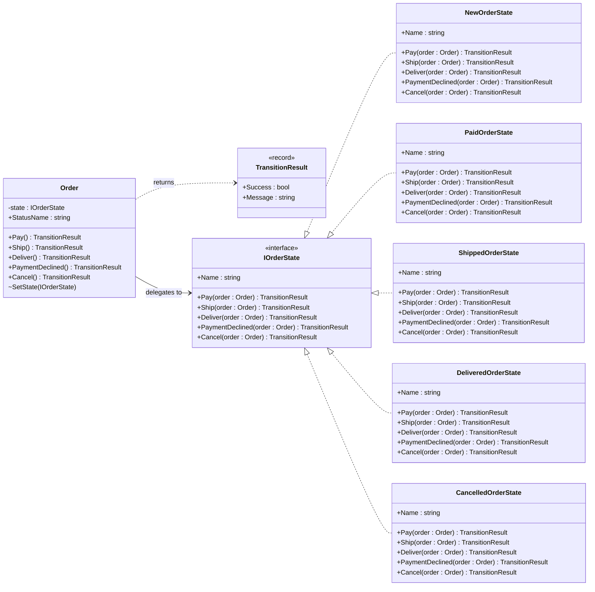
```mermaid
classDiagram
		direction LR
    class TransitionResult {
        <<record>>
        +Success : bool
        +Message : string
    }

    class Order {
        -state : IOrderState
        +Pay() TransitionResult
        +Ship() TransitionResult
        +Deliver() TransitionResult
        +PaymentDeclined() TransitionResult
        +Cancel() TransitionResult
        ~SetState(IOrderState)
        +StatusName : string
    }

    class IOrderState {
        <<interface>>
        +Pay(order : Order) TransitionResult
        +Ship(order : Order) TransitionResult
        +Deliver(order : Order) TransitionResult
        +PaymentDeclined(order : Order) TransitionResult
        +Cancel(order : Order) TransitionResult
        +Name : string
    }

    class NewOrderState {
        +Pay(order : Order) TransitionResult
        +Ship(order : Order) TransitionResult
        +Deliver(order : Order) TransitionResult
        +PaymentDeclined(order : Order) TransitionResult
        +Cancel(order : Order) TransitionResult
        +Name : string
    }

    class PaidOrderState {
        +Pay(order : Order) TransitionResult
        +Ship(order : Order) TransitionResult
        +Deliver(order : Order) TransitionResult
        +PaymentDeclined(order : Order) TransitionResult
        +Cancel(order : Order) TransitionResult
        +Name : string
    }

    class ShippedOrderState {
        +Pay(order : Order) TransitionResult
        +Ship(order : Order) TransitionResult
        +Deliver(order : Order) TransitionResult
        +PaymentDeclined(order : Order) TransitionResult
        +Cancel(order : Order) TransitionResult
        +Name : string
    }

    class DeliveredOrderState {
        +Pay(order : Order) TransitionResult
        +Ship(order : Order) TransitionResult
        +Deliver(order : Order) TransitionResult
        +PaymentDeclined(order : Order) TransitionResult
        +Cancel(order : Order) TransitionResult
        +Name : string
    }

    class CancelledOrderState {
        +Pay(order : Order) TransitionResult
        +Ship(order : Order) TransitionResult
        +Deliver(order : Order) TransitionResult
        +PaymentDeclined(order : Order) TransitionResult
        +Cancel(order : Order) TransitionResult
        +Name : string
    }

    Order --> IOrderState : delegates to
    Order ..> TransitionResult : returns
    IOrderState <|.. NewOrderState
    IOrderState <|.. PaidOrderState
    IOrderState <|.. ShippedOrderState
    IOrderState <|.. DeliveredOrderState
    IOrderState <|.. CancelledOrderState
```

### C# Demo

```csharp
using System;

public record TransitionResult(bool Success, string Message);

public interface IOrderState
{
    string Name { get; }
    TransitionResult Pay(Order order);
    TransitionResult Ship(Order order);
    TransitionResult Deliver(Order order);
    TransitionResult PaymentDeclined(Order order);
    TransitionResult Cancel(Order order);
}

public sealed class Order
{
    private IOrderState _state;

    // Demo simplification: in production, inject the initial state or use a factory
    // to avoid coupling the constructor to a concrete state class.
    public Order()
    {
        _state = new NewOrderState();
    }

    public string StatusName => _state.Name;

    // internal: state classes in this assembly can call SetState, but outside
    // consumers cannot bypass the state machine by forcing a state directly.
    // Demo simplification: the Console.WriteLine couples domain logic to console
    // output. In production, use an event or callback to separate concerns.
    internal void SetState(IOrderState state)
    {
        Console.WriteLine($"  [{_state.Name}] -> [{state.Name}]");
        _state = state;
    }

    public TransitionResult Pay() => _state.Pay(this);
    public TransitionResult Ship() => _state.Ship(this);
    public TransitionResult Deliver() => _state.Deliver(this);
    public TransitionResult PaymentDeclined() => _state.PaymentDeclined(this);
    public TransitionResult Cancel() => _state.Cancel(this);
}

public sealed class NewOrderState : IOrderState
{
    public string Name => "New";

    public TransitionResult Pay(Order order)
    {
        order.SetState(new PaidOrderState());
        return new(true, "Payment recorded.");
    }

    public TransitionResult Ship(Order order)
        => new(false, "Cannot ship an unpaid order.");

    public TransitionResult Deliver(Order order)
        => new(false, "Cannot deliver an unpaid order.");

    public TransitionResult PaymentDeclined(Order order)
        => new(false, "No payment to decline.");

    public TransitionResult Cancel(Order order)
    {
        order.SetState(new CancelledOrderState());
        return new(true, "Order cancelled.");
    }
}

public sealed class PaidOrderState : IOrderState
{
    public string Name => "Paid";

    public TransitionResult Pay(Order order)
        => new(false, "Order is already paid.");

    public TransitionResult Ship(Order order)
    {
        order.SetState(new ShippedOrderState());
        return new(true, "Order shipped.");
    }

    public TransitionResult Deliver(Order order)
        => new(false, "Cannot deliver before shipping.");

    public TransitionResult PaymentDeclined(Order order)
    {
        order.SetState(new NewOrderState());
        return new(true, "Payment declined. Returning to New.");
    }

    public TransitionResult Cancel(Order order)
    {
        order.SetState(new CancelledOrderState());
        return new(true, "Order cancelled. Payment refunded.");
    }
}

public sealed class ShippedOrderState : IOrderState
{
    public string Name => "Shipped";

    public TransitionResult Pay(Order order)
        => new(false, "Order is already paid.");

    public TransitionResult Ship(Order order)
        => new(false, "Order is already shipped.");

    public TransitionResult Deliver(Order order)
    {
        order.SetState(new DeliveredOrderState());
        return new(true, "Order delivered.");
    }

    public TransitionResult PaymentDeclined(Order order)
        => new(false, "Cannot decline payment after shipping.");

    public TransitionResult Cancel(Order order)
        => new(false, "Cannot cancel a shipped order.");
}

public sealed class DeliveredOrderState : IOrderState
{
    public string Name => "Delivered";

    public TransitionResult Pay(Order order)
        => new(false, "Order is already delivered.");

    public TransitionResult Ship(Order order)
        => new(false, "Order is already delivered.");

    public TransitionResult Deliver(Order order)
        => new(false, "Order is already delivered.");

    public TransitionResult PaymentDeclined(Order order)
        => new(false, "Cannot decline payment after delivery.");

    public TransitionResult Cancel(Order order)
        => new(false, "Cannot cancel a delivered order.");
}

public sealed class CancelledOrderState : IOrderState
{
    public string Name => "Cancelled";

    public TransitionResult Pay(Order order)
        => new(false, "Order is cancelled.");

    public TransitionResult Ship(Order order)
        => new(false, "Order is cancelled.");

    public TransitionResult Deliver(Order order)
        => new(false, "Order is cancelled.");

    public TransitionResult PaymentDeclined(Order order)
        => new(false, "Order is cancelled.");

    public TransitionResult Cancel(Order order)
        => new(false, "Order is already cancelled.");
}

public static class Program
{
    public static void Main()
    {
        var order = new Order();
        Console.WriteLine($"Status: {order.StatusName}");

        Console.WriteLine(order.Pay().Message);
        Console.WriteLine($"Status: {order.StatusName}");

        // Backward transition: payment declined, returns to New
        Console.WriteLine(order.PaymentDeclined().Message);
        Console.WriteLine($"Status: {order.StatusName}");

        // Pay again successfully
        Console.WriteLine(order.Pay().Message);
        Console.WriteLine($"Status: {order.StatusName}");

        Console.WriteLine(order.Ship().Message);
        Console.WriteLine($"Status: {order.StatusName}");

        Console.WriteLine(order.Deliver().Message);
        Console.WriteLine($"Status: {order.StatusName}");

        // Attempting an invalid transition:
        var result = order.Ship();
        Console.WriteLine($"{(result.Success ? "OK" : "Rejected")}: {result.Message}");
    }
}
```

### Output

```text
Status: New
  [New] -> [Paid]
Payment recorded.
Status: Paid
  [Paid] -> [New]
Payment declined. Returning to New.
Status: New
  [New] -> [Paid]
Payment recorded.
Status: Paid
  [Paid] -> [Shipped]
Order shipped.
Status: Shipped
  [Shipped] -> [Delivered]
Order delivered.
Status: Delivered
Rejected: Order is already delivered.
```

### Sequence Diagram: Full Order Lifecycle

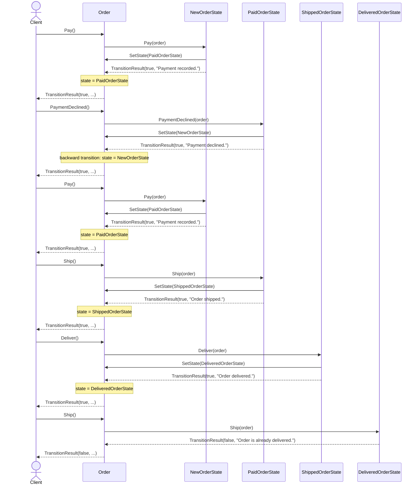
```mermaid
sequenceDiagram
    actor Client
    participant Order
    participant NewState as NewOrderState
    participant PaidState as PaidOrderState
    participant ShippedState as ShippedOrderState
    participant DeliveredState as DeliveredOrderState

    Client->>Order: Pay()
    Order->>NewState: Pay(order)
    NewState->>Order: SetState(PaidOrderState)
    NewState-->>Order: TransitionResult(true, "Payment recorded.")
    Note over Order: state = PaidOrderState
    Order-->>Client: TransitionResult(true, ...)

    Client->>Order: PaymentDeclined()
    Order->>PaidState: PaymentDeclined(order)
    PaidState->>Order: SetState(NewOrderState)
    PaidState-->>Order: TransitionResult(true, "Payment declined.")
    Note over Order: backward transition: state = NewOrderState
    Order-->>Client: TransitionResult(true, ...)

    Client->>Order: Pay()
    Order->>NewState: Pay(order)
    NewState->>Order: SetState(PaidOrderState)
    NewState-->>Order: TransitionResult(true, "Payment recorded.")
    Note over Order: state = PaidOrderState
    Order-->>Client: TransitionResult(true, ...)

    Client->>Order: Ship()
    Order->>PaidState: Ship(order)
    PaidState->>Order: SetState(ShippedOrderState)
    PaidState-->>Order: TransitionResult(true, "Order shipped.")
    Note over Order: state = ShippedOrderState
    Order-->>Client: TransitionResult(true, ...)

    Client->>Order: Deliver()
    Order->>ShippedState: Deliver(order)
    ShippedState->>Order: SetState(DeliveredOrderState)
    ShippedState-->>Order: TransitionResult(true, "Order delivered.")
    Note over Order: state = DeliveredOrderState
    Order-->>Client: TransitionResult(true, ...)

    Client->>Order: Ship()
    Order->>DeliveredState: Ship(order)
    DeliveredState-->>Order: TransitionResult(false, "Order is already delivered.")
    Order-->>Client: TransitionResult(false, ...)
```

---
## 5. Industry Examples

### Document Workflow

A document management system models documents that move through a review lifecycle:

- `Draft` -> `UnderReview` -> `Approved` -> `Published`
- At each stage, different operations are valid (edit, submit for review, approve, publish, reject).
- Rejection may return the document to `Draft`.

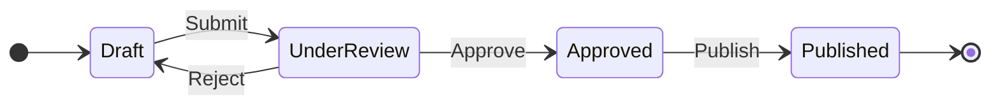
```mermaid
stateDiagram-v2
		direction LR
    [*] --> Draft
    Draft --> UnderReview : Submit
    UnderReview --> Approved : Approve
    UnderReview --> Draft : Reject
    Approved --> Published : Publish
    Published --> [*]
```

### Network Connection (TCP-Inspired)

Network protocol implementations model connection lifecycle as state machines. Each state determines which protocol messages are valid, and real connections involve retries, timeouts, and half-open recovery — not just a straight line from closed to established.

- A connection attempt can fail and return to `Closed` for retry.
- An established connection can be reset by the remote peer, forcing an immediate return to `Closed` rather than a graceful shutdown.
- The `Closing` state waits for acknowledgment; if it times out, it returns to `Closing` (a self-transition) to retry the close handshake.

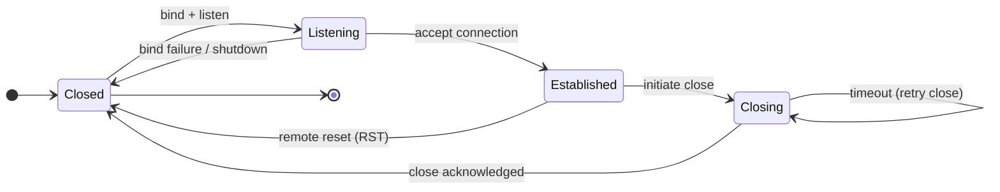
```mermaid
stateDiagram-v2
		direction LR
    [*] --> Closed
    Closed --> Listening : bind + listen
    Listening --> Established : accept connection
    Listening --> Closed : bind failure / shutdown
    Established --> Closing : initiate close
    Established --> Closed : remote reset (RST)
    Closing --> Closing : timeout (retry close)
    Closing --> Closed : close acknowledged
    Closed --> [*]
```

### Vending Machine

A vending machine is a classic FSM teaching example. The interesting complexity comes from the self-transition when inserting additional coins and the branching when the customer changes their mind.

- Inserting a coin in `HasMoney` is a self-transition: the state does not change, but the running total increases.
- The customer can request a refund from `HasMoney`, returning to `Idle`.
- If the machine is out of stock after dispensing, it transitions to `OutOfOrder` instead of `Idle`.

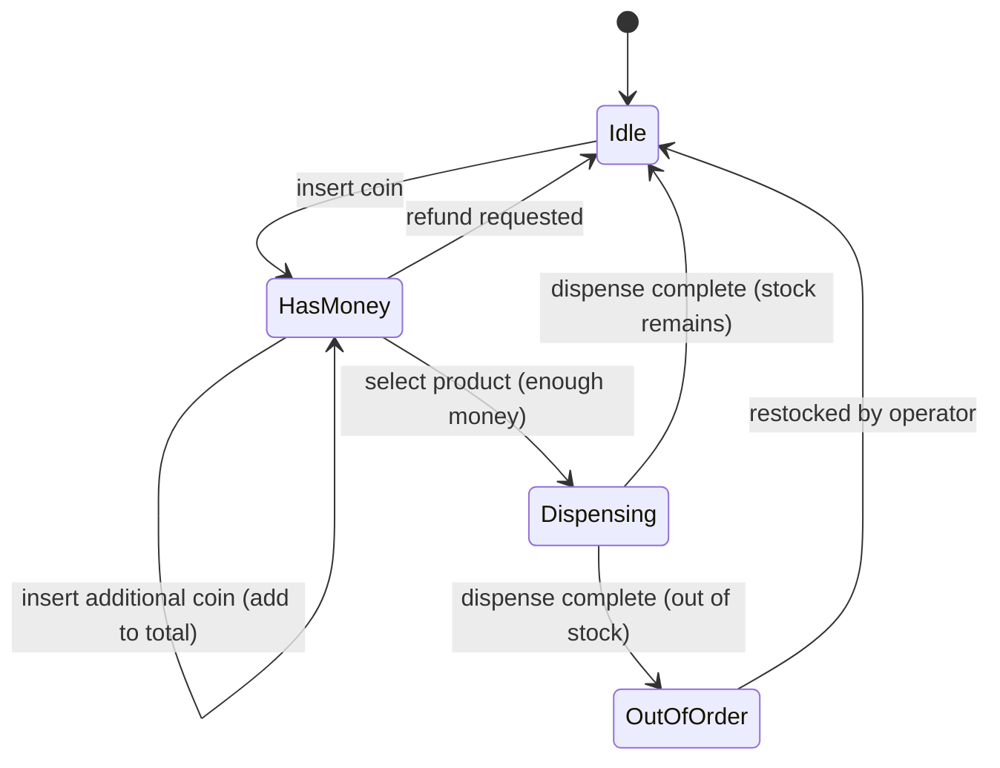
```mermaid
stateDiagram-v2
    [*] --> Idle
    Idle --> HasMoney : insert coin
    HasMoney --> HasMoney : insert additional coin (add to total)
    HasMoney --> Idle : refund requested
    HasMoney --> Dispensing : select product (enough money)
    Dispensing --> Idle : dispense complete (stock remains)
    Dispensing --> OutOfOrder : dispense complete (out of stock)
    OutOfOrder --> Idle : restocked by operator
```

### CI/CD Pipeline

Build pipelines model jobs with state-dependent behavior. Real pipelines include retry loops, manual approval gates, and rollback paths — not just a linear march from queued to complete.

- A build failure can be retried, looping `Building` back to itself.
- Test failures return the pipeline to `Building` for a rebuild with fixes.
- Deployment requires manual approval; rejection sends the pipeline back to `Testing` for re-verification.
- A deployment failure triggers a `RollingBack` state that returns to `Failed` if rollback succeeds (so the team can investigate) or escalates if it does not.

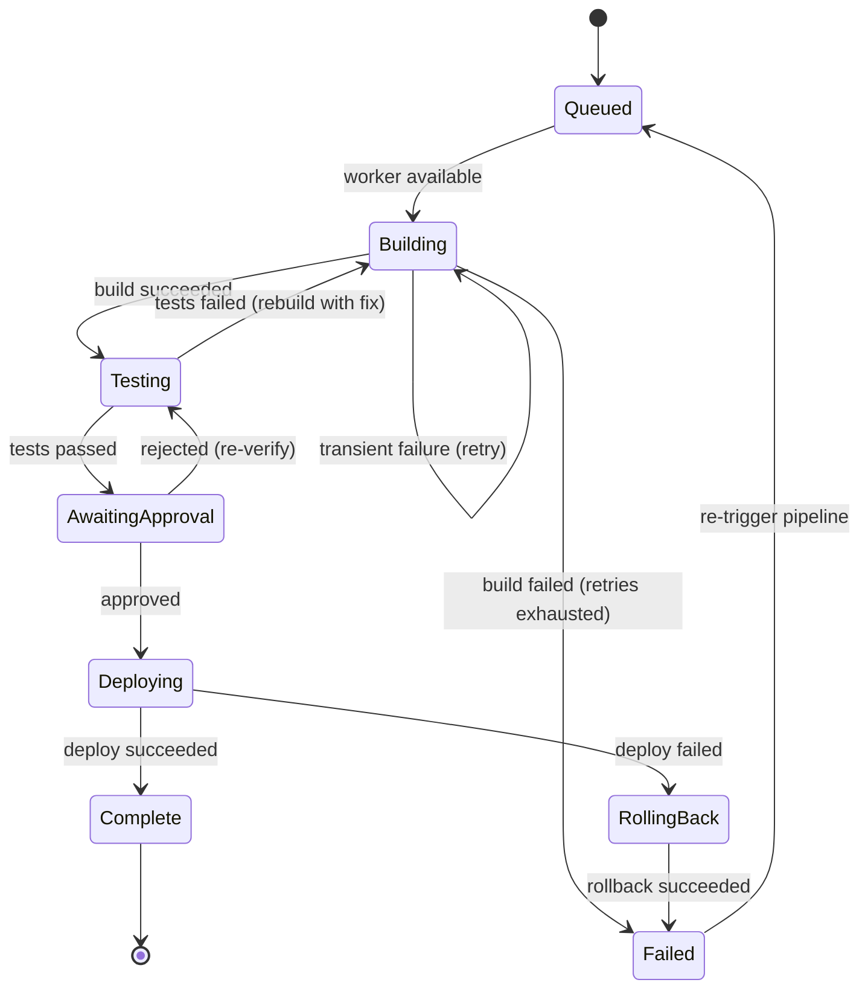
```mermaid
stateDiagram-v2
    [*] --> Queued
    Queued --> Building : worker available
    Building --> Building : transient failure (retry)
    Building --> Testing : build succeeded
    Building --> Failed : build failed (retries exhausted)
    Testing --> AwaitingApproval : tests passed
    Testing --> Building : tests failed (rebuild with fix)
    AwaitingApproval --> Deploying : approved
    AwaitingApproval --> Testing : rejected (re-verify)
    Deploying --> Complete : deploy succeeded
    Deploying --> RollingBack : deploy failed
    RollingBack --> Failed : rollback succeeded
    Complete --> [*]
    Failed --> Queued : re-trigger pipeline
```

### Industry Use: When State Machines Appear

State machines tend to appear in systems where:

- an entity has a clear lifecycle with defined phases
- rules about what can happen depend on what has already happened
- invalid transitions must be explicitly prevented
- audit trails or compliance requirements demand traceable state changes

#### State Machine Demo in an MVC Application

For a complete, runnable example of the State pattern applied to text scanning rather than lifecycle management, see [Appendix 1](#appendix-1-mvc-email-finder---state-pattern-in-a-web-application). It uses the same pattern structure as the Order example — interface, concrete state classes, context — but applies it to character-by-character email extraction in an ASP.NET Core MVC application. Studying both examples side by side reinforces that the pattern's value is in the structure, not the domain.

---
## 6. State Pattern vs Conditional Logic

### When to Use the State Pattern

Use the State pattern when:

- the object has many states and the behavior differs significantly across them
- conditional logic for state-dependent behavior is duplicated across multiple methods
- new states are expected to be added over time
- each state's behavior is cohesive enough to justify its own class

### When Conditional Logic Is Fine

Keep simple `if/switch` logic when:

- there are only two or three states with minimal behavior variation
- the state-dependent logic is confined to one or two methods
- no new states are expected
- the overhead of additional classes outweighs the benefit

### Decision Flow

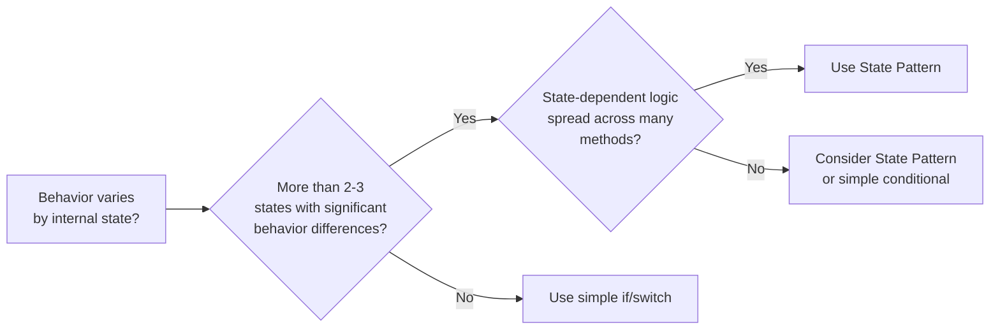
```mermaid
flowchart LR
    A["Behavior varies<br>by internal state?"] --> B{"More than 2-3<br>states with significant<br>behavior differences?"}
    B -- Yes --> C{"State-dependent logic<br>spread across many<br>methods?"}
    C -- Yes --> D["Use State Pattern"]
    C -- No --> E["Consider State Pattern<br>or simple conditional"]
    B -- No --> F["Use simple if/switch"]
```

### When to Refactor: Recognizing the Tipping Point

Most state-dependent code does not start as a State pattern — it starts as a simple `if` or `switch` and grows. The question is not "should I have used the State pattern from the beginning?" but "has this code crossed the line where conditional logic is now hurting me?"

> **Ousterhout:** This is the tension between **tactical** and **strategic programming** (*A Philosophy of Software Design*, Ch. 3). The tactical programmer adds one more `else if` because it is the fastest way to ship the feature. The strategic programmer recognizes that the accumulating conditionals are increasing complexity and invests in the State pattern to reduce it. The signals below help you recognize when tactical additions have created enough complexity to justify the strategic investment.

Watch for these signals that it is time to refactor:

- **A new state arrives and you dread adding it.** You know you will have to touch every method in the class, and you are not confident you will find every branch that needs updating.
- **Bug reports trace back to a missed branch.** A state/action combination was silently unhandled or had a copy-paste error in one of many similar if/else chains.
- **You duplicate an entire if/else chain when adding a new action.** If adding a `Return()` method means copying the branching structure from `Cancel()` and editing each arm, the conditional approach is no longer paying for itself.
- **Code reviews keep flagging the same class.** Multiple developers are editing the same method for unrelated state changes, producing merge conflicts and review fatigue.
- **You add a comment like `// TODO: handle new state here`.** This is an admission that the compiler cannot enforce completeness — a state class would make the missing behavior a compile error (unimplemented interface method).

The refactoring path is incremental:

1. Introduce the `IState` interface and a single concrete state class for the most complex state.
2. Move that state's branches out of every method and into the new class.
3. Leave the remaining states as a default/fallback in the context until you extract them one at a time.
4. Once all states are extracted, delete the conditional logic.

You do not have to convert everything at once. Each extracted state immediately reduces the branching in the original class and makes the next extraction easier.

### Comparison Table

| Concern | Conditional Logic | State Pattern |
|---|---|---|
| Adding a new state | Edit every method with state checks | Add one new state class |
| Cohesion | State logic scattered across methods | State logic grouped in one class |
| Readability with few states | Clear and simple | Over-engineered |
| Readability with many states | Tangled and fragile | Clear per-state behavior |
| OCP compliance | Violates (modify existing methods) | Supports (add new state classes) |
| Testing | Test every branch in every method | Test each state class independently |

---
## 7. Anti-Patterns and Failure Modes

### Common Mistakes

| Smell | Description | Why it is risky |
|---|---|---|
| God context | Context class contains business logic instead of delegating to state objects | Defeats the purpose of the pattern; logic is not separated by state |
| Transition spaghetti | Transitions are spread between context and state classes inconsistently | Hard to trace which transitions are valid; bugs from conflicting transition logic |
| State explosion | Every minor variation gets its own state class | Too many classes with trivial differences; maintenance cost exceeds benefit |
| Leaking state internals | State objects expose implementation details to the context or to each other | Couples states together and makes independent changes difficult |
| Missing invalid-transition handling | Invalid transitions silently succeed or are ignored | System enters inconsistent states; bugs are hidden instead of caught early |

### Working Around the State Machine

One of the most insidious anti-patterns is implementing state-dependent logic *outside* the state machine — in the controller, the service layer, or the calling code — because it feels easier than modifying the state machine itself.

For example, imagine the order system needs a rule: "if the order is shipped and the customer is a VIP, allow a late cancellation." Instead of adding this behavior to `ShippedOrderState.Cancel()`, a developer writes a check in the controller:

```csharp
// Don't do this — this bypasses the state machine
if (order.StatusName == "Shipped" && customer.IsVip)
{
    order.SetState(new CancelledOrderState());  // forced state change
}
else
{
    order.Cancel();
}
```

This is a return to the if/then approach in disguise. The state machine still exists, but it is no longer the single source of truth for state-dependent behavior. Over time, these workarounds accumulate:

- **Split authority.** Some behavior lives in the state classes, some in the calling code. To understand what a shipped order can do, you have to read both — and hope you found every caller.
- **Invisible transitions.** The forced `SetState` call skips whatever logging, validation, or side effects the state class would have performed. Audit trails break silently.
- **Testing gaps.** The state classes pass their unit tests because the workaround never goes through them. The bug only surfaces in integration or production.
- **Erosion.** Once one workaround exists, the next developer follows the precedent. The state machine gradually becomes decorative — still present in the code, but no longer governing behavior.

The fix is straightforward: if new behavior is state-dependent, it belongs in a state class. If the existing state interface does not support the new behavior, extend it. The whole point of the pattern is to keep state-dependent logic cohesive — working around it trades a small short-term convenience for a long-term maintenance problem.

> **Ousterhout:** This is **tactical programming** at its most damaging (*A Philosophy of Software Design*, Ch. 3). The workaround is fast to write, but it creates "a steady stream of complexity" because "each one of these shortcuts introduces a small amount of complexity that doesn't seem to matter." Over time, the workarounds compound until the state machine is no longer trustworthy and developers default to checking state in the calling code — exactly the scattered conditional logic the pattern was designed to eliminate.

### Concrete Warnings

- State classes should not know about each other's internal details.
- The context should not bypass state delegation for "special cases."
- Terminal states (like `Delivered` or `Cancelled`) should explicitly reject all transitions rather than silently doing nothing.
- If your state classes share most of their code, the pattern may be premature. Consider whether a simpler approach is sufficient.

---
## 8. Relationship to Other Patterns

### State vs Strategy

State and Strategy are structurally identical: both use composition and delegation to an interface. The difference is intent:

| | Strategy | State |
|---|---|---|
| **Intent** | Select an algorithm at creation or configuration time | Change behavior as internal state changes over the object's lifetime |
| **Who triggers the change?** | External client or composition root | The object itself, through transitions |
| **Awareness of alternatives** | Strategy objects are typically unaware of each other | State objects often know which state to transition to next |
| **Lifetime of the delegate** | Usually fixed for the lifetime of the context | Changes as the context moves through its lifecycle |

### State and Factory

A factory can be used to create state objects, especially when state creation involves complex initialization or when states are reused. This keeps the `new ConcreteState()` calls out of the state classes themselves.

### State and Observer

In some systems, state transitions trigger notifications to observers. The context can fire events when `SetState` is called, allowing external components to react to lifecycle changes without polling.

---
## 9. Real-World Summary

### Practical Guidance

- start by drawing the state transition diagram before writing any code
- use a transition table to verify completeness: every (state, event) pair should have an explicit outcome
- each state class should be cohesive: it handles all events for one state
- terminal states should explicitly reject all events
- keep the context thin: it delegates, it does not decide
- test each state class independently against valid and invalid events

### Common State Pattern Misconceptions

| Claim | Reality |
|---|---|
| "The State pattern replaces all conditionals." | It replaces state-dependent conditionals. Non-state branching (null checks, input validation) remains ordinary code. |
| "Every enum-based status field needs the State pattern." | Many status fields work fine as enums with a small switch. The pattern pays off when behavior varies significantly across many states and methods. |
| "State objects should be singletons." | Stateless state objects *can* be shared, but making them singletons adds complexity. Fresh instances are simpler and safer as a default. |
| "The context should control all transitions." | Usually state objects own transitions because they know best which transitions are valid from their state. Centralizing transitions in the context can work but often recreates the conditional logic the pattern was meant to eliminate. |

---
## Study Guide

### Core Definitions

- `Finite State Machine (FSM)`: a formal model with a finite set of states, events, and transitions.
- `State Pattern`: a GoF behavioral pattern where an object delegates state-dependent behavior to interchangeable state objects.
- `Context`: the object whose behavior varies; holds and delegates to the current state.
- `State interface`: defines the operations that change meaning depending on state.
- `Concrete state`: implements the state interface for one specific state.
- `Transition`: a change from one state to another, triggered by an event.
- `Terminal state`: a state from which no further transitions are possible.

### Fast Recall Diagram

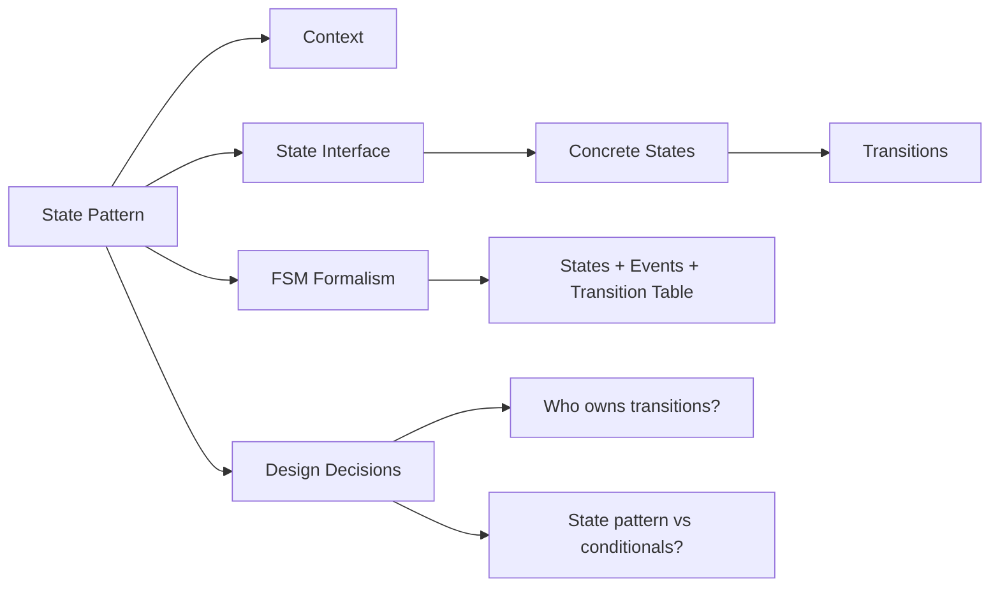
```mermaid
flowchart LR
    A[State Pattern]
    A --> B[Context]
    A --> C[State Interface]
    C --> D[Concrete States]
    D --> E[Transitions]
    A --> F[FSM Formalism]
    F --> G[States + Events + Transition Table]
    A --> H[Design Decisions]
    H --> I[Who owns transitions?]
    H --> J[State pattern vs conditionals?]
```

### Boundary Checklist

- Does the context delegate all state-dependent behavior to state objects?
- Does each state class handle all events for its state?
- Are invalid transitions handled explicitly (exception or defined rejection)?
- Is the transition diagram complete: does every (state, event) pair have an explicit outcome?
- Are state classes independently testable?
- Is the state interface limited to operations that actually vary by state?

### Sample Exam Questions

1. What problem does the State pattern solve that simple conditional logic does not?
2. Draw a UML class diagram for a State pattern with three states.
3. In the State pattern, who typically owns transition logic, and why?
4. How is the State pattern structurally related to the Strategy pattern? What distinguishes them?
5. Given a state transition table, identify which transitions are missing or inconsistent.
6. When is the State pattern overkill?

### Scenario Drills

1. A shopping cart can be `Empty`, `HasItems`, or `CheckedOut`. In the `CheckedOut` state, adding items should be rejected. Which pattern fits?
2. A traffic light cycles through `Red`, `Green`, and `Yellow` on a timer. Should you use the State pattern or a simple enum with a switch? Why?
3. A support ticket moves through `Open`, `InProgress`, `AwaitingCustomer`, `Resolved`, and `Closed`. Each state determines which actions are valid. You expect to add new states (e.g., `Escalated`) in the future. Which approach is better?
4. A document has exactly two states: `Draft` and `Final`. Behavior barely differs. Is the State pattern justified?

### Scenario Drill Answers

1. **State pattern.** Three states with meaningfully different behavior and explicit rejection of invalid operations.
2. **Simple enum with switch.** Three states, one method (advance), predictable cycle, no expected growth. The pattern adds classes without proportional benefit.
3. **State pattern.** Many states, different valid actions per state, expected growth. The pattern isolates each state's behavior and supports OCP for new states.
4. **Probably not.** Two states with minimal variation is well served by a simple boolean or enum. The pattern would add classes without meaningful payoff.

---
## Appendix 1: MVC Email Finder - State Pattern in a Web Application

This appendix presents a complete ASP.NET Core MVC application that uses the State pattern to extract email addresses from a block of text. The full source is available in the [12-state-machine-mvc-demo](12-state-machine-mvc-demo/) folder alongside this lecture.

Where the main lecture's Order example (Section 4) uses the State pattern to model lifecycle transitions with explicit valid/invalid actions, this application uses the State pattern for a different purpose: **text scanning**. The state machine reads input character by character, transitioning between states as it recognizes the parts of a simple email address format: `[alphanumericPlusDotAndDash]@[alphanumeric].[2-10 alphanumeric]`.

This is a meaningful contrast because the scanning use case sits between the two extremes covered earlier in the lecture:

- It is richer than a table-driven DFA (Appendix 2) because each state performs distinct work — setting start indexes, accumulating characters, recording matches, and skipping non-word content.
- It is simpler than the Order example because transitions are driven by character classification rather than business rules, and there is no need to reject invalid operations with exceptions.

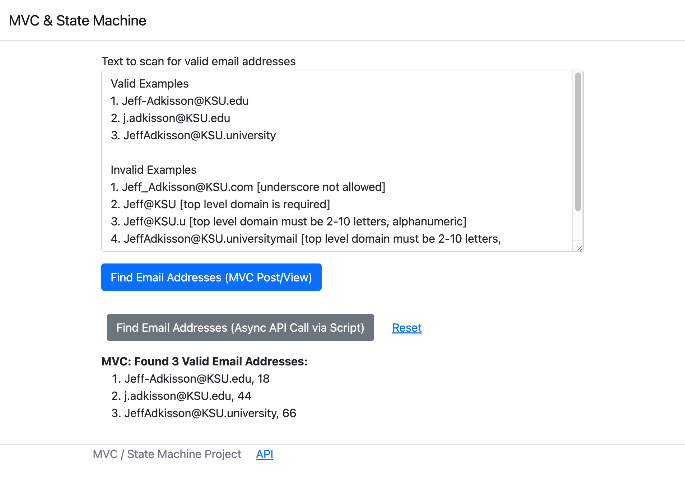

### Architecture

The application follows the MVC structure described in [Lecture 11](11-mvc-di-srv-domain.md):

- **Web layer** — an MVC controller accepts a text block from a form post and an API controller accepts JSON. Controllers handle HTTP concerns only and delegate to an injected service.
- **Service layer** — `IEmailFinderService` defines the use-case contract. `EmailFinderService` implements it by calling the domain's `Finder.Find()` entry point. Controllers depend on the interface, not the implementation.
- **Domain logic** — the `Email/` folder contains the state machine. Seven state classes implement `IState`, each handling one phase of email detection. A `Context` object carries the scanning position, the input text, and the accumulated matches. This layer has no knowledge of HTTP, MVC, or the service layer.
- **Composition root** — `Program.cs` wires the service: `builder.Services.AddScoped<IEmailFinderService, EmailFinderService>();`
- **Tests** — xUnit tests verify the state machine against known inputs, using a regex as the oracle to confirm each match is valid. Controller tests inject a mock `IEmailFinderService` to isolate HTTP behavior from domain logic.

### State Machine Design

Controllers inject `IEmailFinderService`, whose implementation delegates to the domain's `Finder` class:

```csharp
public interface IEmailFinderService
{
    Match[] Find(string? text);
}

public class EmailFinderService : IEmailFinderService
{
    public Match[] Find(string? text) => Finder.Find(text);
}
```

The `Finder` class is the domain entry point. It creates a `Context` from the input text, obtains the starting state from a `NextState` registry, and loops until the terminal `StateComplete` is reached:

```csharp
public static Match[] Find(string? text, bool normalizeLineEndings = true)
{
    var context = new Context(text, normalizeLineEndings);

    var currentState = NextState.Start();

    while (!currentState.IsComplete()) {
        currentState = currentState.Process(context);
    }

    return context.Matches.ToArray();
}
```

Each state class implements a single `Process` method that reads from the context, advances the position, and returns the next state. States do not know about each other's internals — they only know which state to transition to via the `NextState.GetNextState<T>()` extension method.

### State Transition Diagram

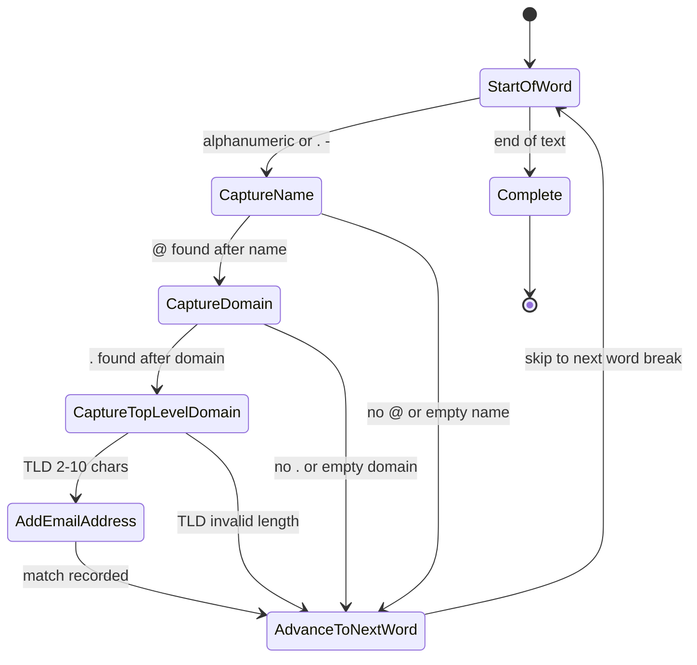
```mermaid
stateDiagram-v2
    [*] --> StartOfWord
    StartOfWord --> CaptureName : alphanumeric or . -
    StartOfWord --> Complete : end of text

    CaptureName --> CaptureDomain : @ found after name
    CaptureName --> AdvanceToNextWord : no @ or empty name

    CaptureDomain --> CaptureTopLevelDomain : . found after domain
    CaptureDomain --> AdvanceToNextWord : no . or empty domain

    CaptureTopLevelDomain --> AddEmailAddress : TLD 2-10 chars
    CaptureTopLevelDomain --> AdvanceToNextWord : TLD invalid length

    AddEmailAddress --> AdvanceToNextWord : match recorded

    AdvanceToNextWord --> StartOfWord : skip to next word break

    Complete --> [*]
```

### Class Diagram

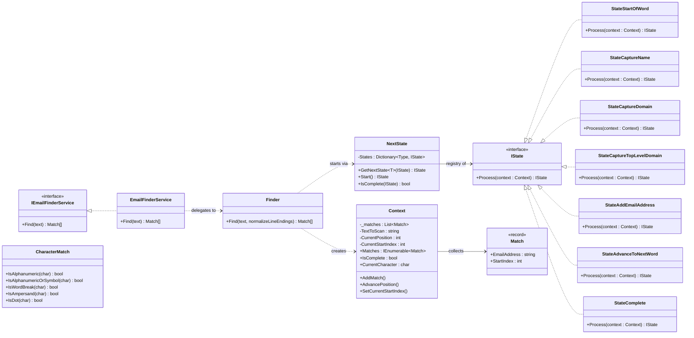
```mermaid
classDiagram
		direction LR
    class IEmailFinderService {
        <<interface>>
        +Find(text) Match[]
    }

    class EmailFinderService {
        +Find(text) Match[]
    }

    class Finder {
        +Find(text, normalizeLineEndings) Match[]
    }

    class Context {
        -_matches : List~Match~
        -TextToScan : string
        -CurrentPosition : int
        -CurrentStartIndex : int
        +Matches : IEnumerable~Match~
        +IsComplete : bool
        +CurrentCharacter : char
        +AddMatch()
        +AdvancePosition()
        +SetCurrentStartIndex()
    }

    class IState {
        <<interface>>
        +Process(context : Context) IState
    }

    class StateStartOfWord {
        +Process(context : Context) IState
    }

    class StateCaptureName {
        +Process(context : Context) IState
    }

    class StateCaptureDomain {
        +Process(context : Context) IState
    }

    class StateCaptureTopLevelDomain {
        +Process(context : Context) IState
    }

    class StateAddEmailAddress {
        +Process(context : Context) IState
    }

    class StateAdvanceToNextWord {
        +Process(context : Context) IState
    }

    class StateComplete {
        +Process(context : Context) IState
    }

    class NextState {
        -States : Dictionary~Type, IState~
        +GetNextState~T~(IState) IState
        +Start() IState
        +IsComplete(IState) bool
    }

    class CharacterMatch {
        +IsAlphanumeric(char) bool
        +IsAlphanumericOrSymbol(char) bool
        +IsWordBreak(char) bool
        +IsAmpersand(char) bool
        +IsDot(char) bool
    }

    class Match {
        <<record>>
        +EmailAddress : string
        +StartIndex : int
    }

    IEmailFinderService <|.. EmailFinderService
    EmailFinderService ..> Finder : delegates to
    Finder ..> Context : creates
    Finder ..> NextState : starts via
    IState <|.. StateStartOfWord
    IState <|.. StateCaptureName
    IState <|.. StateCaptureDomain
    IState <|.. StateCaptureTopLevelDomain
    IState <|.. StateAddEmailAddress
    IState <|.. StateAdvanceToNextWord
    IState <|.. StateComplete
    NextState --> IState : registry of
    Context --> Match : collects
```

### What Each State Does

| State | Responsibility | Transitions to |
|---|---|---|
| **StartOfWord** | Skips whitespace and non-word characters until an alphanumeric/symbol character is found | CaptureName (found valid start char) or Complete (end of text) |
| **CaptureName** | Records the start index and advances through valid local-part characters (`a-z`, `0-9`, `.`, `-`) | CaptureDomain (if `@` follows) or AdvanceToNextWord (no `@`) |
| **CaptureDomain** | Advances through alphanumeric domain characters | CaptureTopLevelDomain (if `.` follows) or AdvanceToNextWord (no `.`) |
| **CaptureTopLevelDomain** | Advances through alphanumeric TLD characters and checks length is 2–10 | AddEmailAddress (valid length) or AdvanceToNextWord (invalid) |
| **AddEmailAddress** | Extracts the substring from start index to current position and records the match | AdvanceToNextWord |
| **AdvanceToNextWord** | Skips remaining non-whitespace characters to reach the next word boundary | StartOfWord |
| **Complete** | Terminal state — returns itself on every call | *(none)* |

### Design Decisions Worth Noting

- **Service layer as the MVC boundary.** Controllers inject `IEmailFinderService` and delegate to it — they never reference the `Finder` class or any domain type directly. This follows the guidance from [Lecture 11](11-mvc-di-srv-domain.md): controllers handle HTTP concerns, services orchestrate use cases, and domain logic stays isolated. The composition root in `Program.cs` wires the abstraction to the implementation.
- **State reuse via registry.** The `NextState` class pre-creates one instance of each state and returns them by type. Since state objects hold no per-invocation data (all scanning state lives in `Context`), this avoids repeated allocation without introducing singleton complexity.
- **Context as the shared accumulator.** The `Context` class owns position tracking, character access, and match collection. State objects read from and write to the context but do not hold scanning state themselves. This keeps state classes stateless and independently testable.
- **Character classification as a separate concern.** The `CharacterMatch` utility class centralizes character rules (`IsAlphanumeric`, `IsAmpersand`, `IsDot`, etc.) so that state classes express intent rather than character-set details.

### Running the Demo

```bash
cd 12-state-machine-mvc-demo/src/StateMachine.Mvc
dotnet run
```

Navigate to `https://localhost:<port>` in a browser. Paste a block of text containing email addresses and submit the form.

To run the tests:

```bash
cd 12-state-machine-mvc-demo
dotnet test
```

---
## Appendix 2: DFA for Pattern Matching - Finding "men" or "women"

### What Is a DFA?

A [Deterministic Finite Automaton (DFA)](https://en.wikipedia.org/wiki/Deterministic_finite_automaton) is a specific kind of finite state machine with one additional constraint: for every (state, input) pair, there is exactly one next state. There is no ambiguity, no backtracking, and no choice — the machine reads one input symbol, follows exactly one transition, and arrives at exactly one next state. "Deterministic" is the key word: given the same input, the machine always follows the same path.

DFAs are a foundational concept in theoretical computer science. They define the class of **regular languages** — the set of patterns that can be recognized without memory beyond the current state. Every regular expression can be converted into an equivalent DFA, and every DFA can be converted into an equivalent regular expression. This equivalence is why regex engines, lexical analyzers, and protocol validators are often built on DFAs internally.

### Relationship to the State Pattern

The State pattern (Section 3 of this lecture) and DFAs are both implementations of the finite state machine concept, but they sit at different points on a design spectrum:

| | State Pattern | DFA |
|---|---|---|
| **Representation** | Each state is a class with behavior methods | States and transitions live in a table or data structure |
| **Per-state behavior** | Rich and unique — each class can do anything | Uniform — the engine applies the same logic to every state |
| **Transition ownership** | State objects decide transitions and perform side effects | A transition function or lookup table decides; side effects are separate |
| **Best fit** | Business objects with a few states and meaningful per-state behavior (orders, documents, connections) | Pattern matching, parsing, protocol validation — many states with uniform transition logic |
| **Adding a state** | Add a new class | Add a row to the table |

The State pattern is the right choice when the value is in what each state *does*. A DFA is the right choice when the value is in the *transitions* — which input leads where — and per-state behavior is minimal or uniform.

This appendix uses a DFA to scan a string for the substrings "men" or "women" (case-insensitive). An [interactive visual version](12-state-machine-pattern-dfa/index.html) of this DFA is available alongside this lecture.

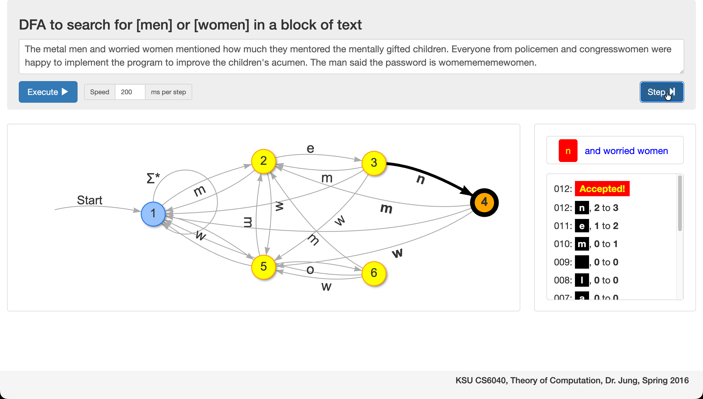

### How the DFA Works

The key insight is that "women" ends with "men". The DFA tracks progress toward matching "men" directly, while also tracking the `w-o` prefix of "women". After reading `w-o`, it transitions into the same `m-e-n` path, so both words arrive at the same accepting state.

### State Transition Table

| State | Description | `m` | `e` | `n` | `w` | `o` | other |
|-------|-------------|-----|-----|-----|-----|-----|-------|
| **S1** (start) | No progress | S2 | S1 | S1 | S5 | S1 | S1 |
| **S2** | Read `m` | S2 | S3 | S1 | S5 | S1 | S1 |
| **S3** | Read `me` | S2 | S1 | **S4** | S5 | S1 | S1 |
| **S4** (accept) | Read `men` | S2 | S1 | S1 | S5 | S1 | S1 |
| **S5** | Read `w` | S2 | S1 | S1 | S5 | S6 | S1 |
| **S6** | Read `wo` | S2 | S1 | S1 | S5 | S1 | S1 |

Every undefined input returns to S1 (the start state). The only accepting state is S4.

### State Transition Diagram

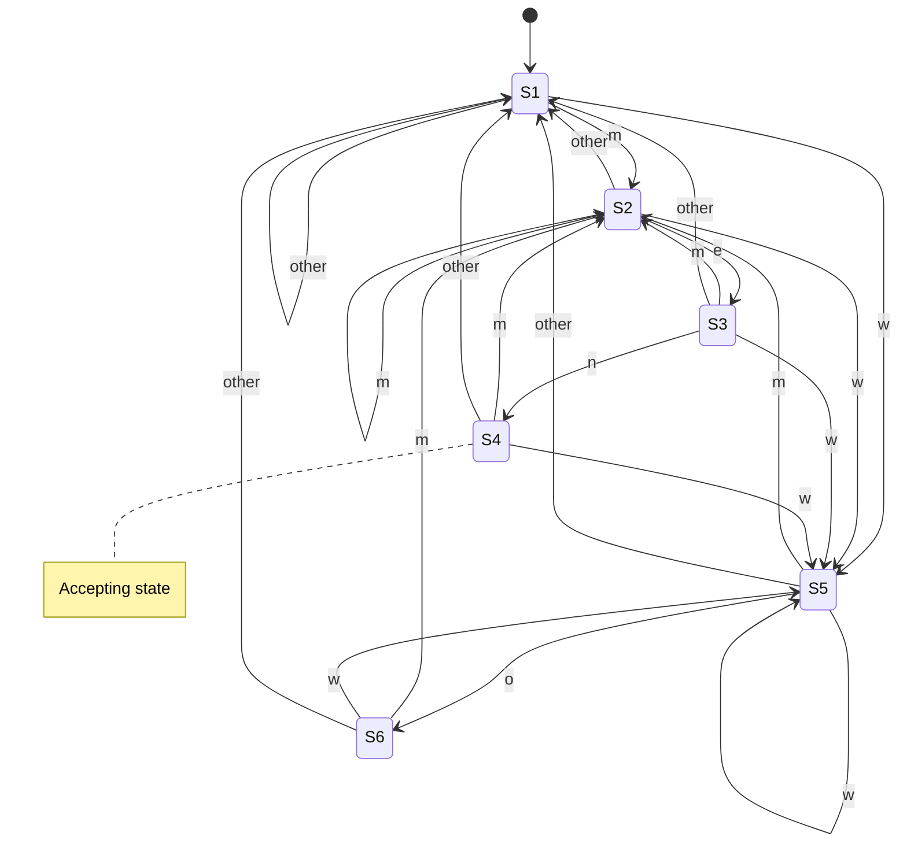
```mermaid
stateDiagram-v2
    [*] --> S1
    S1 --> S2 : m
    S1 --> S5 : w
    S1 --> S1 : other

    S2 --> S3 : e
    S2 --> S5 : w
    S2 --> S2 : m
    S2 --> S1 : other

    S3 --> S4 : n
    S3 --> S2 : m
    S3 --> S5 : w
    S3 --> S1 : other

    S4 --> S2 : m
    S4 --> S5 : w
    S4 --> S1 : other

    S5 --> S6 : o
    S5 --> S2 : m
    S5 --> S5 : w
    S5 --> S1 : other

    S6 --> S2 : m
    S6 --> S5 : w
    S6 --> S1 : other

    note right of S4 : Accepting state
```

### C# Demo

```csharp
using System;
using System.Collections.Generic;

public sealed class MenWomenDfa
{
    // States
    private const int S1 = 0; // start
    private const int S2 = 1; // read 'm'
    private const int S3 = 2; // read 'me'
    private const int S4 = 3; // read 'men' (accept)
    private const int S5 = 4; // read 'w'
    private const int S6 = 5; // read 'wo'

    private static readonly bool[] Accepting = { false, false, false, true, false, false };

    // Transition table: transitionTable[state][character] -> next state.
    // Characters not in the dictionary fall through to S1.
    private static readonly Dictionary<char, int>[] TransitionTable =
    {
        // S1: start
        new() { ['m'] = S2, ['w'] = S5 },
        // S2: read 'm'
        new() { ['m'] = S2, ['e'] = S3, ['w'] = S5 },
        // S3: read 'me'
        new() { ['m'] = S2, ['n'] = S4, ['w'] = S5 },
        // S4: read 'men' (accept)
        new() { ['m'] = S2, ['w'] = S5 },
        // S5: read 'w'
        new() { ['m'] = S2, ['o'] = S6, ['w'] = S5 },
        // S6: read 'wo'
        new() { ['m'] = S2, ['w'] = S5 }
    };

    private static int NextState(int current, char c)
    {
        return TransitionTable[current].TryGetValue(c, out int next) ? next : S1;
    }

    public static List<int> FindMatches(string text)
    {
        var acceptPositions = new List<int>();
        int state = S1;

        for (int i = 0; i < text.Length; i++)
        {
            char c = char.ToLowerInvariant(text[i]);
            int prior = state;
            state = NextState(state, c);

            Console.WriteLine($"  [{i:D3}] '{text[i]}'  S{prior + 1} -> S{state + 1}");

            if (Accepting[state])
            {
                Console.WriteLine($"  [{i:D3}] Accepted!");
                acceptPositions.Add(i);
            }
        }

        return acceptPositions;
    }
}

public static class Program
{
    public static void Main()
    {
        string text = "The policemen met the congresswomen at the mental health summit.";
        Console.WriteLine($"Input: \"{text}\"\n");

        List<int> matches = MenWomenDfa.FindMatches(text);

        Console.WriteLine($"\nTotal matches: {matches.Count}");
        foreach (int pos in matches)
        {
            // Show the matched substring ending at pos.
            int start = Math.Max(0, pos - 4);
            Console.WriteLine($"  Match ending at index {pos}: \"...{text[start..(pos + 1)]}...\"");
        }
    }
}
```

### Quick Compile/Run (C#)

```bash
# Assuming the snippet is Program.cs in a console project
dotnet run
```

Expected output:

```text
Input: "The policemen met the congresswomen at the mental health summit."

  [000] 'T'  S1 -> S1
  [001] 'h'  S1 -> S1
  [002] 'e'  S1 -> S1
  [003] ' '  S1 -> S1
  [004] 'p'  S1 -> S1
  [005] 'o'  S1 -> S1
  [006] 'l'  S1 -> S1
  [007] 'i'  S1 -> S1
  [008] 'c'  S1 -> S1
  [009] 'e'  S1 -> S1
  [010] 'm'  S1 -> S2
  [011] 'e'  S2 -> S3
  [012] 'n'  S3 -> S4
  [012] Accepted!
  [013] ' '  S4 -> S1
  [014] 'm'  S1 -> S2
  [015] 'e'  S2 -> S3
  [016] 't'  S3 -> S1
  [017] ' '  S1 -> S1
  [018] 't'  S1 -> S1
  [019] 'h'  S1 -> S1
  [020] 'e'  S1 -> S1
  [021] ' '  S1 -> S1
  [022] 'c'  S1 -> S1
  [023] 'o'  S1 -> S1
  [024] 'n'  S1 -> S1
  [025] 'g'  S1 -> S1
  [026] 'r'  S1 -> S1
  [027] 'e'  S1 -> S1
  [028] 's'  S1 -> S1
  [029] 's'  S1 -> S1
  [030] 'w'  S1 -> S5
  [031] 'o'  S5 -> S6
  [032] 'm'  S6 -> S2
  [033] 'e'  S2 -> S3
  [034] 'n'  S3 -> S4
  [034] Accepted!
  [035] ' '  S4 -> S1
  [036] 'a'  S1 -> S1
  [037] 't'  S1 -> S1
  [038] ' '  S1 -> S1
  [039] 't'  S1 -> S1
  [040] 'h'  S1 -> S1
  [041] 'e'  S1 -> S1
  [042] ' '  S1 -> S1
  [043] 'm'  S1 -> S2
  [044] 'e'  S2 -> S3
  [045] 'n'  S3 -> S4
  [045] Accepted!
  [046] 't'  S4 -> S1
  [047] 'a'  S1 -> S1
  [048] 'l'  S1 -> S1
  [049] ' '  S1 -> S1
  [050] 'h'  S1 -> S1
  [051] 'e'  S1 -> S1
  [052] 'a'  S1 -> S1
  [053] 'l'  S1 -> S1
  [054] 't'  S1 -> S1
  [055] 'h'  S1 -> S1
  [056] ' '  S1 -> S1
  [057] 's'  S1 -> S1
  [058] 'u'  S1 -> S1
  [059] 'm'  S1 -> S2
  [060] 'm'  S2 -> S2
  [061] 'i'  S2 -> S1
  [062] 't'  S1 -> S1
  [063] '.'  S1 -> S1

Total matches: 3
  Match ending at index 12: "...cemen..."
  Match ending at index 34: "...women..."
  Match ending at index 45: "...ment..."
```

Note that the DFA finds "men" inside "policemen", "women" inside "congresswomen", and "men" inside "mental" — it matches the substring, not whole words. This is the expected behavior for a substring-matching DFA.

### Table-Driven vs One-Class-Per-State

This appendix uses a table-driven DFA: all transitions live in a data structure, and one method interprets them. The main lecture uses the State pattern: each state is its own class with behavior methods.

| Concern | Table-Driven DFA | State Pattern (One-Class-Per-State) |
|---|---|---|
| **Best fit** | Many states, uniform transition logic, parsers and matchers | Fewer states with rich, distinct behavior per state |
| **Adding a state** | Add a row to the table | Add a new class |
| **Per-state behavior** | Limited to what the engine supports | Unlimited — each class can have unique logic |
| **Readability at scale** | Compact for large state counts | Unwieldy beyond ~10 states |
| **Tooling** | Can be generated from grammars or regex | Usually hand-written |

Both are valid implementations of the same FSM concept. Choose based on whether the value is in the transitions (table-driven) or in the per-state behavior (State pattern).

---
## Appendix 3: Persistence and Rehydration - Surviving a Restart

### The Problem

The State pattern examples in this lecture keep state in memory. When the process stops — a server restart, a deployment, a crash — the current state is lost. A real order system must persist its state so that the correct state object can be reconstructed when the entity is loaded again. This is the **rehydration** problem: given a stored representation of "this order is in the Shipped state," how do you turn that back into a live `ShippedOrderState` object?

### Why This Is Harder Than It Looks

The naive approach is to store the state as a string (`"Shipped"`) and use a switch statement to reconstruct the object:

```csharp
IOrderState state = savedState switch
{
    "New" => new NewOrderState(),
    "Paid" => new PaidOrderState(),
    "Shipped" => new ShippedOrderState(),
    // ...
};
```

This works, but it reintroduces the exact problem the State pattern was designed to eliminate — a branching structure that must be updated every time a new state is added. It also scatters state knowledge across two locations: the state classes themselves and the deserialization switch.

### A Better Approach: Registry-Based Rehydration

The same `NextState` registry concept used in Appendix 1's email finder can solve this cleanly. A state registry maps state names to state instances. Serialization stores the name; deserialization looks it up in the registry. Adding a new state means adding one entry to the registry — no switch statement to maintain.

### C# Demo

This example extends the Order state machine from Section 4 with JSON serialization and rehydration.

```csharp
using System;
using System.Collections.Generic;
using System.Text.Json;
using System.Text.Json.Serialization;

// -- State registry: maps names to instances and back --

public static class OrderStateRegistry
{
    private static readonly Dictionary<string, IOrderState> StatesByName = new()
    {
        ["New"] = new NewOrderState(),
        ["Paid"] = new PaidOrderState(),
        ["Shipped"] = new ShippedOrderState(),
        ["Delivered"] = new DeliveredOrderState(),
        ["Cancelled"] = new CancelledOrderState()
    };

    public static IOrderState FromName(string name) =>
        StatesByName.TryGetValue(name, out var state)
            ? state
            : throw new ArgumentException($"Unknown state: {name}");
}

// -- Serializable DTO for persistence --

public record OrderSnapshot(string Status, string OrderId);

// -- Custom JSON converter for Order --

public sealed class OrderJsonConverter : JsonConverter<Order>
{
    public override Order Read(
        ref Utf8JsonReader reader, Type typeToConvert, JsonSerializerOptions options)
    {
        var snapshot = JsonSerializer.Deserialize<OrderSnapshot>(ref reader, options)
            ?? throw new JsonException("Failed to deserialize order snapshot.");

        var state = OrderStateRegistry.FromName(snapshot.Status);
        return new Order(snapshot.OrderId, state);
    }

    public override void Write(
        Utf8JsonWriter writer, Order value, JsonSerializerOptions options)
    {
        var snapshot = new OrderSnapshot(value.StatusName, value.OrderId);
        JsonSerializer.Serialize(writer, snapshot, options);
    }
}

// -- Order class with persistence support --

public record TransitionResult(bool Success, string Message);

public interface IOrderState
{
    string Name { get; }
    TransitionResult Pay(Order order);
    TransitionResult Ship(Order order);
    TransitionResult Deliver(Order order);
    TransitionResult PaymentDeclined(Order order);
    TransitionResult Cancel(Order order);
}

public sealed class Order
{
    private IOrderState _state;

    public string OrderId { get; }

    public Order(string orderId)
    {
        OrderId = orderId;
        _state = new NewOrderState();
    }

    // Rehydration constructor: restores a previously persisted state
    public Order(string orderId, IOrderState state)
    {
        OrderId = orderId;
        _state = state;
    }

    public string StatusName => _state.Name;

    internal void SetState(IOrderState state)
    {
        Console.WriteLine($"  [{_state.Name}] -> [{state.Name}]");
        _state = state;
    }

    public TransitionResult Pay() => _state.Pay(this);
    public TransitionResult Ship() => _state.Ship(this);
    public TransitionResult Deliver() => _state.Deliver(this);
    public TransitionResult PaymentDeclined() => _state.PaymentDeclined(this);
    public TransitionResult Cancel() => _state.Cancel(this);
}

// -- State classes (same as Section 4, abbreviated for focus) --

public sealed class NewOrderState : IOrderState
{
    public string Name => "New";
    public TransitionResult Pay(Order order)
    { order.SetState(new PaidOrderState()); return new(true, "Payment recorded."); }
    public TransitionResult Ship(Order order) => new(false, "Cannot ship an unpaid order.");
    public TransitionResult Deliver(Order order) => new(false, "Cannot deliver an unpaid order.");
    public TransitionResult PaymentDeclined(Order order) => new(false, "No payment to decline.");
    public TransitionResult Cancel(Order order)
    { order.SetState(new CancelledOrderState()); return new(true, "Order cancelled."); }
}

public sealed class PaidOrderState : IOrderState
{
    public string Name => "Paid";
    public TransitionResult Pay(Order order) => new(false, "Order is already paid.");
    public TransitionResult Ship(Order order)
    { order.SetState(new ShippedOrderState()); return new(true, "Order shipped."); }
    public TransitionResult Deliver(Order order) => new(false, "Cannot deliver before shipping.");
    public TransitionResult PaymentDeclined(Order order)
    { order.SetState(new NewOrderState()); return new(true, "Payment declined. Returning to New."); }
    public TransitionResult Cancel(Order order)
    { order.SetState(new CancelledOrderState()); return new(true, "Order cancelled. Payment refunded."); }
}

public sealed class ShippedOrderState : IOrderState
{
    public string Name => "Shipped";
    public TransitionResult Pay(Order order) => new(false, "Order is already paid.");
    public TransitionResult Ship(Order order) => new(false, "Order is already shipped.");
    public TransitionResult Deliver(Order order)
    { order.SetState(new DeliveredOrderState()); return new(true, "Order delivered."); }
    public TransitionResult PaymentDeclined(Order order) => new(false, "Cannot decline payment after shipping.");
    public TransitionResult Cancel(Order order) => new(false, "Cannot cancel a shipped order.");
}

public sealed class DeliveredOrderState : IOrderState
{
    public string Name => "Delivered";
    public TransitionResult Pay(Order order) => new(false, "Order is already delivered.");
    public TransitionResult Ship(Order order) => new(false, "Order is already delivered.");
    public TransitionResult Deliver(Order order) => new(false, "Order is already delivered.");
    public TransitionResult PaymentDeclined(Order order) => new(false, "Cannot decline payment after delivery.");
    public TransitionResult Cancel(Order order) => new(false, "Cannot cancel a delivered order.");
}

public sealed class CancelledOrderState : IOrderState
{
    public string Name => "Cancelled";
    public TransitionResult Pay(Order order) => new(false, "Order is cancelled.");
    public TransitionResult Ship(Order order) => new(false, "Order is cancelled.");
    public TransitionResult Deliver(Order order) => new(false, "Order is cancelled.");
    public TransitionResult PaymentDeclined(Order order) => new(false, "Order is cancelled.");
    public TransitionResult Cancel(Order order) => new(false, "Order is already cancelled.");
}

// -- Demo: serialize, "restart", rehydrate, continue --

public static class Program
{
    private static readonly JsonSerializerOptions JsonOptions = new()
    {
        WriteIndented = true,
        Converters = { new OrderJsonConverter() }
    };

    public static void Main()
    {
        // 1. Create an order and advance it to Shipped
        var order = new Order("ORD-42");
        Console.WriteLine($"Status: {order.StatusName}");
        Console.WriteLine(order.Pay().Message);
        Console.WriteLine(order.Ship().Message);
        Console.WriteLine($"Status: {order.StatusName}");

        // 2. Serialize to JSON (simulates saving to a database or file)
        string json = JsonSerializer.Serialize(order, JsonOptions);
        Console.WriteLine($"\nSerialized:\n{json}");

        // 3. Simulate a restart — the original object is gone
        Console.WriteLine("\n--- server restart ---\n");

        // 4. Rehydrate from JSON
        var rehydrated = JsonSerializer.Deserialize<Order>(json, JsonOptions)!;
        Console.WriteLine($"Rehydrated status: {rehydrated.StatusName}");
        Console.WriteLine($"Rehydrated order ID: {rehydrated.OrderId}");

        // 5. Continue the lifecycle from where it left off
        Console.WriteLine(rehydrated.Deliver().Message);
        Console.WriteLine($"Final status: {rehydrated.StatusName}");

        // 6. Prove that invalid transitions still work after rehydration
        var result = rehydrated.Ship();
        Console.WriteLine($"{(result.Success ? "OK" : "Rejected")}: {result.Message}");
    }
}
```

### Output

```text
Status: New
  [New] -> [Paid]
Payment recorded.
  [Paid] -> [Shipped]
Order shipped.
Status: Shipped

Serialized:
{
  "Status": "Shipped",
  "OrderId": "ORD-42"
}

--- server restart ---

Rehydrated status: Shipped
Rehydrated order ID: ORD-42
  [Shipped] -> [Delivered]
Order delivered.
Final status: Delivered
Rejected: Order is already delivered.
```

### How It Works

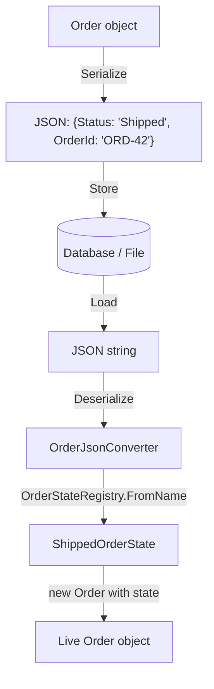
```mermaid
flowchart TB
    A[Order object] -->|Serialize| B["JSON: {Status: 'Shipped', OrderId: 'ORD-42'}"]
    B -->|Store| C[(Database / File)]
    C -->|Load| D["JSON string"]
    D -->|Deserialize| E[OrderJsonConverter]
    E -->|OrderStateRegistry.FromName| F[ShippedOrderState]
    F -->|new Order with state| G[Live Order object]
```

### Design Decisions

- **Snapshot DTO separates persistence from domain.** The `OrderSnapshot` record is a flat, serializable representation. The `Order` class itself does not need `[JsonSerializable]` attributes or public setters — the converter handles translation.
- **Registry centralizes state lookup.** `OrderStateRegistry` is the single place that maps names to state objects. Adding a new state means adding one dictionary entry — no switch statements, no if/else chains.
- **Rehydration constructor is explicit.** The `Order(string orderId, IOrderState state)` constructor makes it clear that this path is for restoring a persisted entity, not creating a new one. The default constructor always starts in `New`.
- **State objects are reusable after rehydration.** Since state classes hold no per-instance data (all mutable state lives in `Order`), the registry can return shared instances. This is the same stateless-state design used in Appendix 1's `NextState` registry.

### What This Pattern Enables

Once state can be persisted and rehydrated, several production concerns become straightforward:

- **Database storage.** Store the state name as a column. On load, pass it through the registry to get a live state object. The rest of the application works with the State pattern as usual — no conditional logic at the data access layer.
- **Event sourcing.** Store each transition as an event (`OrderPaid`, `OrderShipped`). Replay events to reconstruct the current state. The registry resolves the final state name to a live object.
- **Distributed systems.** Serialize the order to JSON, put it on a message queue, and deserialize it on the other side. The state machine resumes exactly where it left off.
- **Audit trails.** Since the state name is a simple string, it can be logged, indexed, and queried. The registry ensures that the string always maps back to a live, behaviorally correct state object.

---
## Appendix 4: async/await - The Compiler's State Machine

### State Machines You Already Use

Every time you write `async/await` in C#, the compiler rewrites your method into a state machine. This is not a metaphor — the Roslyn compiler literally generates a struct that implements `IAsyncStateMachine`, with an integer field tracking the current state and a `MoveNext()` method containing a switch over that state. The simple, readable code you write is syntactic sugar for a sophisticated state machine that the compiler builds for you.

This appendix shows what that transformation looks like and why it matters for understanding the State pattern at a deeper level.

### The Code You Write

```csharp
using System;
using System.Net.Http;
using System.Threading.Tasks;

public static class WeatherService
{
    private static readonly HttpClient Client = new();

    public static async Task<string> GetForecastAsync(string city)
    {
        Console.WriteLine($"Requesting forecast for {city}...");

        var response = await Client.GetAsync($"https://api.weather.example/forecast?city={city}");
        response.EnsureSuccessStatusCode();

        var body = await response.Content.ReadAsStringAsync();

        Console.WriteLine($"Received {body.Length} characters.");
        return body;
    }
}
```

This looks like straight-line code: call an API, check the status, read the body, return it. Three statements, two `await` points. Simple.

### What the Compiler Generates

The compiler transforms `GetForecastAsync` into something *conceptually* equivalent to the following. The real generated code is more optimized and uses `AsyncTaskMethodBuilder`, but this captures the essential structure:

```csharp
// Compiler-generated state machine (simplified for clarity)
public struct GetForecastAsyncStateMachine : IAsyncStateMachine
{
    public int State;   // <-- the state field, just like an FSM
    public AsyncTaskMethodBuilder<string> Builder;
    public string City;

    // Local variables that must survive across await points
    private HttpResponseMessage _response;
    private TaskAwaiter<HttpResponseMessage> _awaiter1;
    private TaskAwaiter<string> _awaiter2;

    private static readonly HttpClient Client = new();

    public void MoveNext()
    {
        try
        {
            switch (State)
            {
                case 0:  // Initial state: start of method
                    Console.WriteLine($"Requesting forecast for {City}...");

                    _awaiter1 = Client
                        .GetAsync($"https://api.weather.example/forecast?city={City}")
                        .GetAwaiter();

                    if (!_awaiter1.IsCompleted)
                    {
                        State = 1;  // Transition: suspend until HTTP call completes
                        Builder.AwaitUnsafeOnCompleted(ref _awaiter1, ref this);
                        return;     // Yield control — the thread is free
                    }
                    goto case 1;

                case 1:  // Resumed after first await
                    _response = _awaiter1.GetResult();
                    _response.EnsureSuccessStatusCode();

                    _awaiter2 = _response.Content.ReadAsStringAsync().GetAwaiter();

                    if (!_awaiter2.IsCompleted)
                    {
                        State = 2;  // Transition: suspend until body read completes
                        Builder.AwaitUnsafeOnCompleted(ref _awaiter2, ref this);
                        return;
                    }
                    goto case 2;

                case 2:  // Resumed after second await
                    string body = _awaiter2.GetResult();
                    Console.WriteLine($"Received {body.Length} characters.");
                    Builder.SetResult(body);
                    return;
            }
        }
        catch (Exception ex)
        {
            Builder.SetException(ex);
        }
    }

    public void SetStateMachine(IAsyncStateMachine stateMachine) =>
        Builder.SetStateMachine(stateMachine);
}
```

### The State Transition Diagram

Each `await` is a potential suspension point. The state field tracks where to resume.

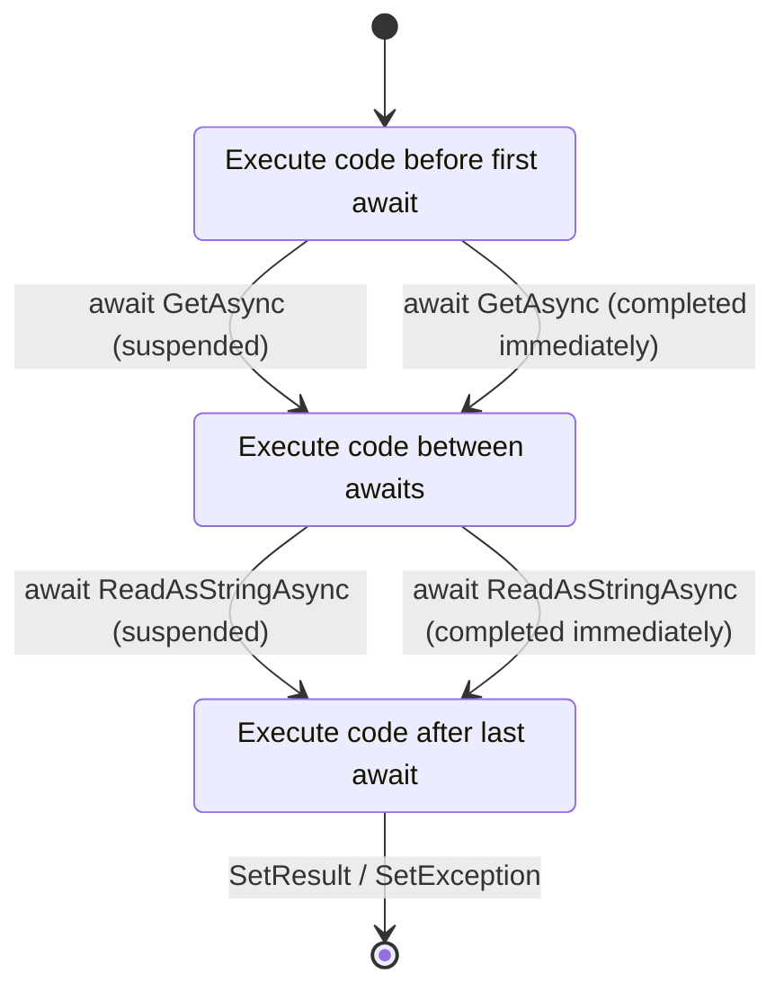
```mermaid
stateDiagram-v2
    [*] --> State0
    State0 : Execute code before first await
    State0 --> State1 : await GetAsync (suspended)
    State0 --> State1 : await GetAsync (completed immediately)

    State1 : Execute code between awaits
    State1 --> State2 : await ReadAsStringAsync (suspended)
    State1 --> State2 : await ReadAsStringAsync (completed immediately)

    State2 : Execute code after last await
    State2 --> [*] : SetResult / SetException
```

### Mapping to FSM Concepts

The compiler-generated state machine maps directly to the FSM concepts from Section 2:

| FSM Concept | async/await Equivalent |
|---|---|
| **States** | The integer values 0, 1, 2 — one per segment of code between `await` points |
| **Events/Inputs** | The completion of an awaited `Task` (callback from the runtime) |
| **Transition function** | The `switch` inside `MoveNext()` — given the current state and a completion event, execute the next segment and set the next state |
| **Initial state** | State 0 — the beginning of the method |
| **Terminal state** | `SetResult()` or `SetException()` — the method is complete |
| **Context** | The struct itself — its fields hold all local variables that must survive across suspension points |

### Why This Matters

Understanding that `async/await` is a state machine is valuable for several reasons:

- **It demystifies the runtime behavior.** When a method hits `await`, it does not block a thread — it records its state and returns. When the awaited task completes, the runtime calls `MoveNext()` again, the switch jumps to the saved state, and execution resumes. This is exactly how the State pattern works: delegate to the current state, let it do its work, transition to the next state.
- **It explains why local variables survive.** Variables declared before an `await` are still available after it because the compiler lifts them into fields on the state machine struct. They are not on the call stack — they are part of the state machine's context, just like the `Context` object in the email finder (Appendix 1).
- **It explains debugging behavior.** When you step through async code and the debugger seems to jump around, you are watching `MoveNext()` being called repeatedly with different state values. The "straight-line" code you wrote is being executed as discrete state transitions.
- **It connects syntactic sugar to design patterns.** The C# compiler uses the same concepts you learned in this lecture — states, transitions, context, and a transition function — to solve a real infrastructure problem. The only difference is that you write the readable version and the compiler generates the state machine.

### The Broader Pattern

C# is not alone. The same state machine compilation strategy is used by:

- **JavaScript/TypeScript** — `async/await` compiles to a generator-based state machine (visible in Babel or TypeScript output targeting ES5)
- **Python** — `async def` functions are coroutines built on a state machine protocol (`__await__`, `send`, `throw`)
- **Rust** — `async fn` compiles to an anonymous type implementing the `Future` trait, with a `poll` method containing a state machine
- **Kotlin** — `suspend` functions are compiled into a `Continuation`-based state machine with a `label` field tracking the current state

In every case, the developer writes clean, sequential-looking code, and the compiler transforms it into a state machine that can suspend and resume. The pattern you learned in this lecture is the foundation that makes this possible.
