# Observer Pattern

### Reacting to Change Without Creating Dependency Chains

[Powerpoint Presentation](13-observer-pattern.pptx) | [PDF](13-observer-pattern.pdf) | [Video](13-observer-pattern.mp4) 

---

Every interesting system changes over time. A stock price ticks upward. A sensor reads a new temperature. A user types into a search box and a list of suggestions appears. The question is not *whether* objects need to react to change, but *how they find out about it*.

The naive answer is direct coupling: the object that changes simply calls every object that cares. But this wires the source of truth to every consumer, and the design collapses the moment you add a new listener, swap a UI framework, or push notifications across a network boundary.

The **Observer pattern** inverts this relationship. Instead of the source *knowing* its audience, the audience *registers itself* with the source. When something changes, the source broadcasts a notification and every registered observer responds in its own way. The source never knows — or needs to know — what the observers do with the information.

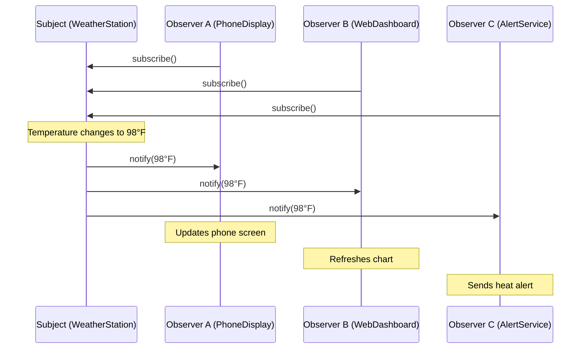
```mermaid
sequenceDiagram
    participant S as Subject (WeatherStation)
    participant A as Observer A (PhoneDisplay)
    participant B as Observer B (WebDashboard)
    participant C as Observer C (AlertService)

    A->>S: subscribe()
    B->>S: subscribe()
    C->>S: subscribe()

    Note over S: Temperature changes to 98°F

    S->>A: notify(98°F)
    S->>B: notify(98°F)
    S->>C: notify(98°F)

    Note over A: Updates phone screen
    Note over B: Refreshes chart
    Note over C: Sends heat alert
```

Three consumers, three completely different reactions, and the `WeatherStation` didn't import a single one of them. That is the core promise of Observer: **one-to-many notification with zero knowledge of the many**.

This lecture builds from the simple two-object case to multi-observer dispatch, and then crosses the process boundary by introducing a message queue between the subject and its observers — the architecture behind every modern event-driven system.

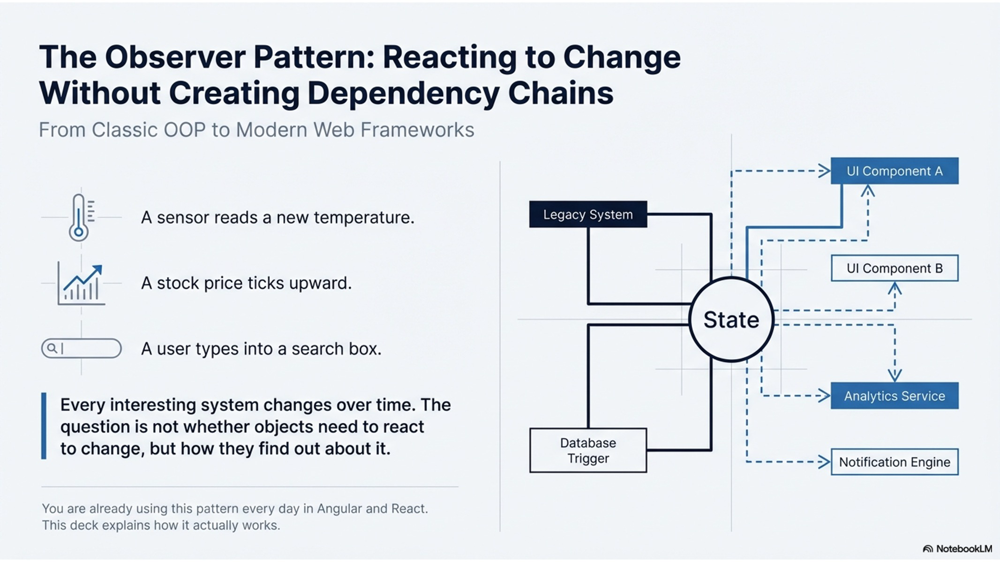

---

## Table of Contents

- [1. The Problem: Hardwired Reactions to Change](#1-the-problem-hardwired-reactions-to-change)
- [2. The Observer Pattern](#2-the-observer-pattern)
- [3. Implementation Walkthrough: Weather Station in C#](#3-implementation-walkthrough-weather-station-in-c)
- [4. Multiple Dispatch: One Subject, Many Observers](#4-multiple-dispatch-one-subject-many-observers)
- [5. Observer in Client-Side Web Frameworks](#5-observer-in-client-side-web-frameworks)
- [6. Observer Pattern vs Direct Coupling](#6-observer-pattern-vs-direct-coupling)
- [7. Decoupling with a Message Queue](#7-decoupling-with-a-message-queue)
- [8. Message Queue Observer Demo: Wacky Chat](#8-message-queue-observer-demo-wacky-chat)
- [9. Anti-Patterns and Failure Modes](#9-anti-patterns-and-failure-modes)
- [10. Relationship to Other Patterns](#10-relationship-to-other-patterns)
- [11. Real-World Summary](#11-real-world-summary)
- [Study Guide](#study-guide)
- [Appendix 1: Idiomatic C# `event`/`delegate` and Java Listeners](#appendix-1-idiomatic-c-eventdelegate-and-java-listeners)

---

## 1. The Problem: Hardwired Reactions to Change

### Motivating Scenario

You are building a weather monitoring system. A `WeatherStation` reads temperature, humidity, and pressure from its sensors. Three displays need to update when the readings change: a current-conditions panel, a statistics panel, and a forecast panel.

### The Naive Approach

```csharp
public class WeatherStation
{
    private CurrentConditionsDisplay _currentDisplay;
    private StatisticsDisplay _statsDisplay;
    private ForecastDisplay _forecastDisplay;

    public WeatherStation(
        CurrentConditionsDisplay currentDisplay,
        StatisticsDisplay statsDisplay,
        ForecastDisplay forecastDisplay)
    {
        _currentDisplay = currentDisplay;
        _statsDisplay = statsDisplay;
        _forecastDisplay = forecastDisplay;
    }

    public void SetMeasurements(float temp, float humidity, float pressure)
    {
        // Every new display means changing this class
        _currentDisplay.Update(temp, humidity, pressure);
        _statsDisplay.Update(temp, humidity, pressure);
        _forecastDisplay.Update(temp, humidity, pressure);
    }
}
```

This compiles and runs. It also has serious design problems:

- **Open/Closed violation**: adding a fourth display (a heat-index panel, a mobile push notification) forces you to modify `WeatherStation`. The class that *produces* data should not change every time a new *consumer* appears.
- **Tight coupling**: `WeatherStation` depends on three concrete classes. It cannot be tested in isolation, and it cannot be reused in a system that has different displays.
- **No runtime flexibility**: you cannot add or remove a display while the system is running. The set of consumers is frozen at compile time.
- **Single Responsibility violation**: `WeatherStation` is responsible for reading sensors *and* for knowing the full roster of interested parties.

> **Ousterhout:** "Modules are deep when they provide powerful functionality behind a simple interface. A module that must be changed every time a new client appears has a shallow, leaky abstraction." (*A Philosophy of Software Design*, Ch. 4).

### The Design Goal

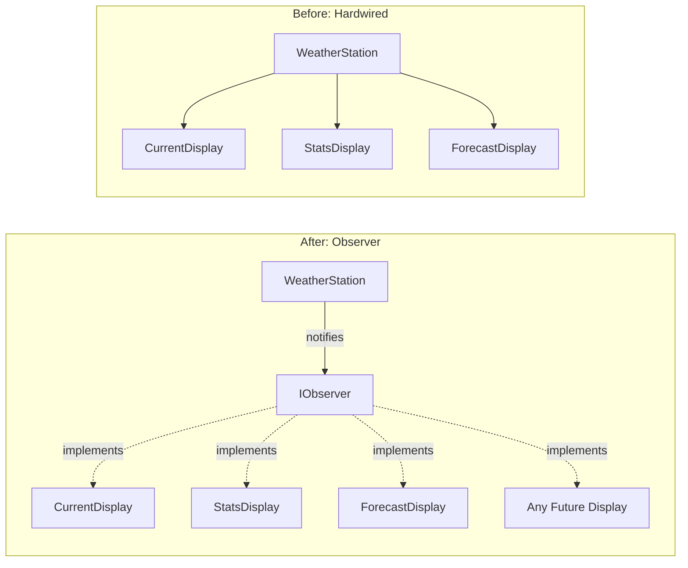
```mermaid
flowchart LR
    subgraph After ["After: Observer"]
        direction TB
        WS2[WeatherStation] -->|notifies| I[IObserver]
        I -.->|implements| D4[CurrentDisplay]
        I -.->|implements| D5[StatsDisplay]
        I -.->|implements| D6[ForecastDisplay]
        I -.->|implements| D7[Any Future Display]
    end
    subgraph Before ["Before: Hardwired"]
        direction TB
        WS1[WeatherStation] --> D1[CurrentDisplay]
        WS1 --> D2[StatsDisplay]
        WS1 --> D3[ForecastDisplay]
    end


```

On the left, the station knows every consumer by name. On the right, it knows only an interface. New consumers appear without touching the station's code.

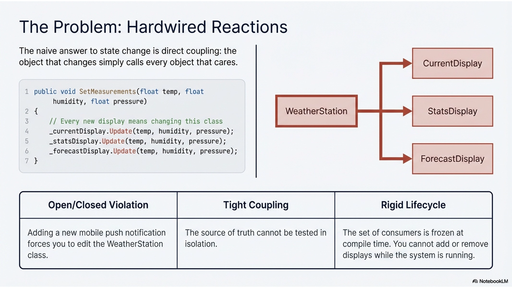

---

## 2. The Observer Pattern

### What It Is

Observer is a **behavioral design pattern** (GoF, 1994) that defines a one-to-many dependency between objects so that when one object changes state, all its dependents are notified and updated automatically.

The pattern has three roles:

1. **Subject** (also called *Observable* or *Publisher*): the object that holds state and sends notifications.
2. **Observer** (also called *Subscriber* or *Listener*): an object that wants to be informed when the subject changes.
3. **Client**: the code that creates the subject and registers observers with it.

### Canonical UML Class Diagram

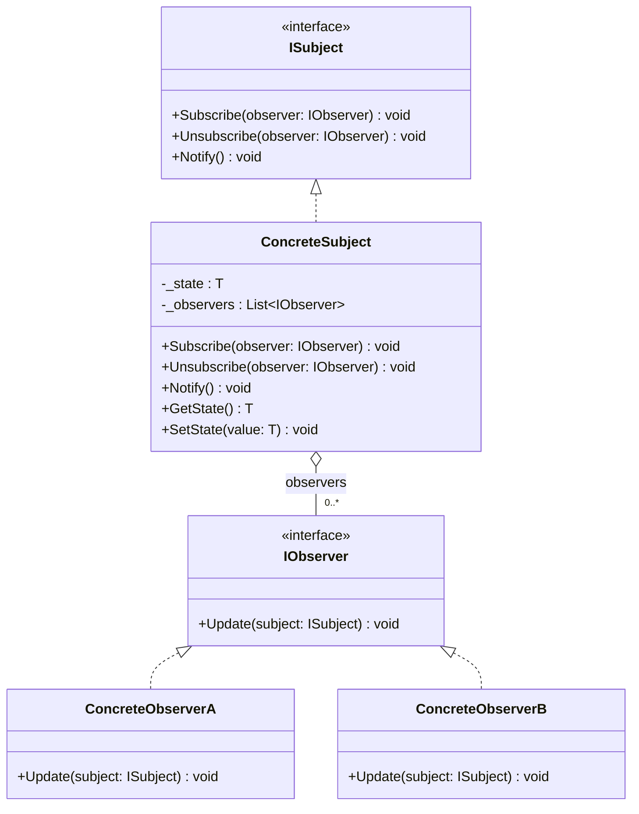
```mermaid
classDiagram
    class ISubject {
        <<interface>>
        +Subscribe(observer: IObserver) void
        +Unsubscribe(observer: IObserver) void
        +Notify() void
    }

    class IObserver {
        <<interface>>
        +Update(subject: ISubject) void
    }

    class ConcreteSubject {
        -_state : T
        -_observers : List~IObserver~
        +Subscribe(observer: IObserver) void
        +Unsubscribe(observer: IObserver) void
        +Notify() void
        +GetState() T
        +SetState(value: T) void
    }

    class ConcreteObserverA {
        +Update(subject: ISubject) void
    }

    class ConcreteObserverB {
        +Update(subject: ISubject) void
    }

    ISubject <|.. ConcreteSubject
    IObserver <|.. ConcreteObserverA
    IObserver <|.. ConcreteObserverB
    ConcreteSubject o-- "0..*" IObserver : observers
```

### How It Works

1. The **subject** maintains a list of observers (initially empty).
2. An **observer** calls `Subscribe()` on the subject to register itself.
3. When the subject's state changes, it iterates through its observer list and calls `Update()` on each one.
4. Each observer responds to the notification in its own way — update a display, write a log, send an alert.
5. An observer may call `Unsubscribe()` at any time to stop receiving notifications.
6. The subject never casts, inspects, or depends on the concrete type of any observer.

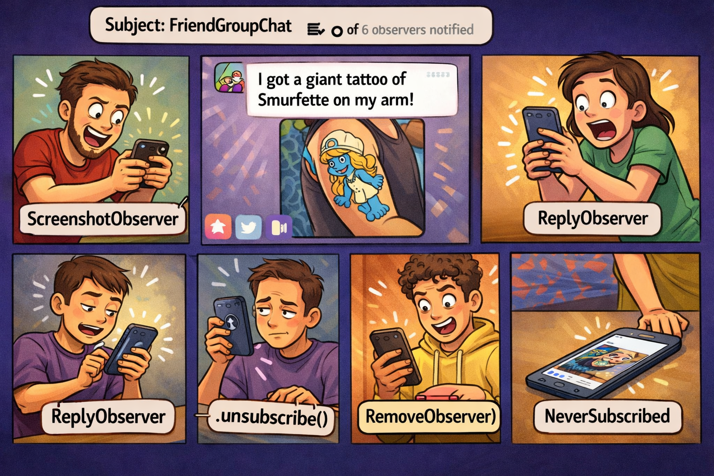

**SOLID connections:** Observer touches every SOLID principle:

| Principle | How Observer Applies |
|-----------|---------------------|
| **SRP** | The subject is responsible for state and notification mechanics. Each observer is responsible for its own reaction. Neither knows the other's internals. |
| **OCP** | Adding a new observer requires zero changes to the subject — it is pure extension. |
| **LSP** | Every observer fulfills the `IObserver` contract. The subject calls `Update()` on each without inspecting or casting to concrete types. |
| **ISP** | The `IObserver` interface has a single method (`Update`), keeping it focused. Observers are not forced to implement methods they do not use. |
| **DIP** | The subject depends on `IObserver` (abstraction), not on `CurrentConditionsDisplay` or `StatisticsDisplay`. |

### Push vs Pull Notification

There are two schools for how the observer gets the data it needs:

| Approach | How It Works | Tradeoff |
|----------|-------------|----------|
| **Push** | Subject sends the changed data as arguments to `Update(temp, humidity, pressure)` | Simple for observers, but the subject decides what data to send. Adding new data fields changes the interface. |
| **Pull** | Subject sends a reference to itself: `Update(this)`. Observer calls getters to pull what it needs. | Observer picks only the data it cares about. Subject interface is stable. Slightly more coupling to the subject's public API. |

Most modern implementations favor **pull** or a hybrid where the notification carries an event args object.

### Canonical Sequence Diagram

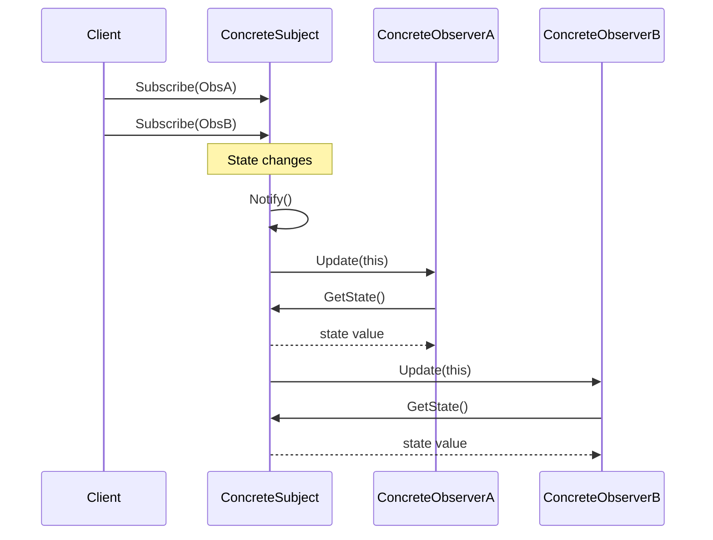
```mermaid
sequenceDiagram
    participant Client
    participant Subject as ConcreteSubject
    participant ObsA as ConcreteObserverA
    participant ObsB as ConcreteObserverB

    Client->>Subject: Subscribe(ObsA)
    Client->>Subject: Subscribe(ObsB)

    Note over Subject: State changes

    Subject->>Subject: Notify()
    Subject->>ObsA: Update(this)
    ObsA->>Subject: GetState()
    Subject-->>ObsA: state value
    Subject->>ObsB: Update(this)
    ObsB->>Subject: GetState()
    Subject-->>ObsB: state value
```

### Key Design Decisions

- **Who triggers the notification?** The subject can call `Notify()` automatically after every state change, or the client can call it explicitly after a batch of changes. Automatic is simpler; explicit avoids redundant notifications when multiple properties change together.
- **Ordering guarantees**: the basic pattern does not guarantee notification order. If order matters, you need a priority mechanism or a different pattern (Chain of Responsibility).
- **Observer lifecycle**: if observers are not unsubscribed before they are garbage-collected, you get a **lapsed listener** memory leak. This is the single most common Observer bug.
- **Thread safety**: in concurrent systems, the observer list must be protected. Iterating while another thread subscribes or unsubscribes causes `InvalidOperationException` in C# or `ConcurrentModificationException` in Java.

> **Ousterhout:** "Complexity is caused by two things: dependencies and obscurity. The Observer pattern trades one form of dependency (concrete references) for another (registration-based), but the new form is far easier to manage." (*A Philosophy of Software Design*, Ch. 2).

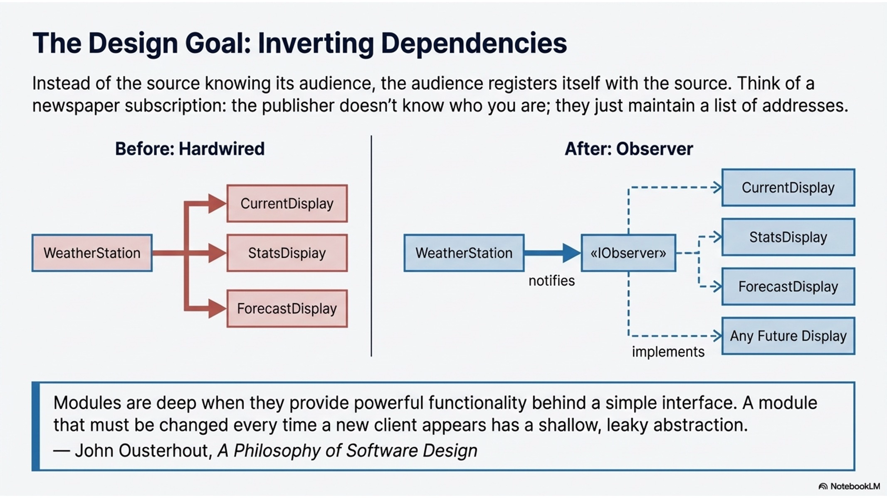

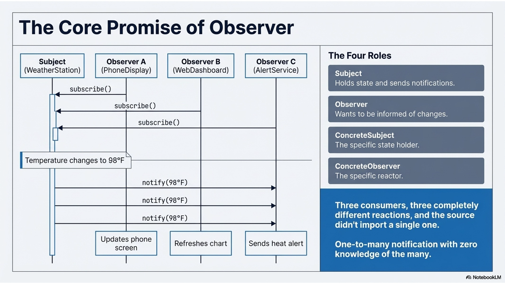

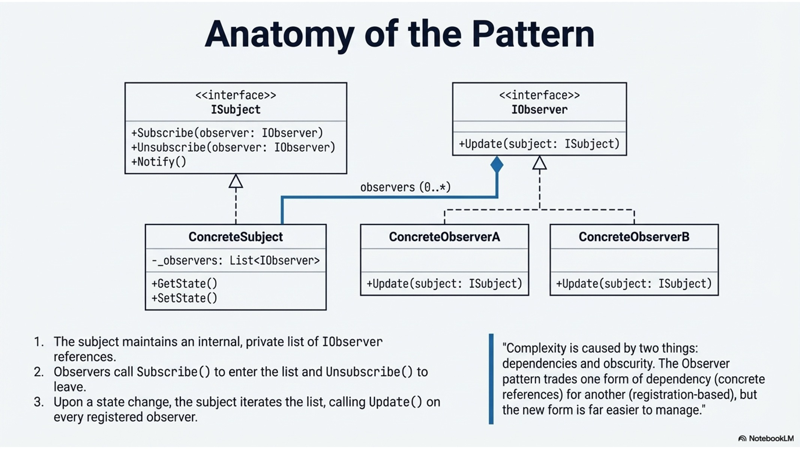

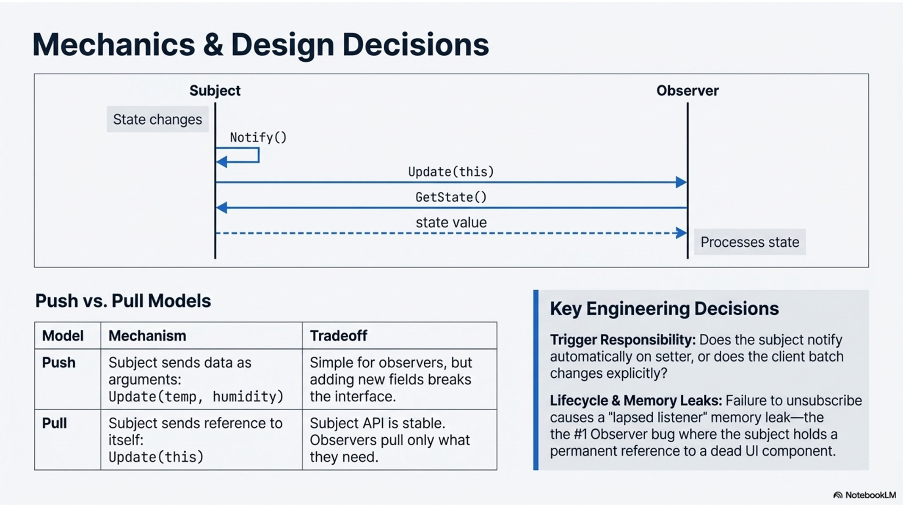

---

## 3. Implementation Walkthrough: Weather Station in C#

A runnable single-file demo of this section is available at [`13-observer-pattern-demos/13-observer-pattern-weather-station-demo-1.cs`](13-observer-pattern-demos/13-observer-pattern-weather-station-demo-1.cs). Run it with:

```bash
dotnet run 13-observer-pattern-demos/13-observer-pattern-weather-station-demo-1.cs
```

### The Interface Definitions

```csharp
// IObserver.cs
public interface IObserver
{
    void Update(ISubject subject);
}

// ISubject.cs
public interface ISubject
{
    void Subscribe(IObserver observer);
    void Unsubscribe(IObserver observer);
    void Notify();
}
```

### The Subject: WeatherStation

```csharp
// WeatherStation.cs
public class WeatherStation : ISubject
{
    private readonly List<IObserver> _observers = new();

    public float Temperature { get; private set; }
    public float Humidity { get; private set; }
    public float Pressure { get; private set; }

    public void Subscribe(IObserver observer)
    {
        if (!_observers.Contains(observer))
            _observers.Add(observer);
    }

    public void Unsubscribe(IObserver observer)
    {
        _observers.Remove(observer);
    }

    public void Notify()
    {
        foreach (var observer in _observers)
            observer.Update(this);
    }

    public void SetMeasurements(float temperature, float humidity, float pressure)
    {
        Console.WriteLine($"Setting measurements: {temperature}°F, {humidity}% humidity, {pressure} hPa");
        Temperature = temperature;
        Humidity = humidity;
        Pressure = pressure;
        Console.WriteLine("Measurements updated, notifying observers (if any)...");
        Notify();
    }
}
```

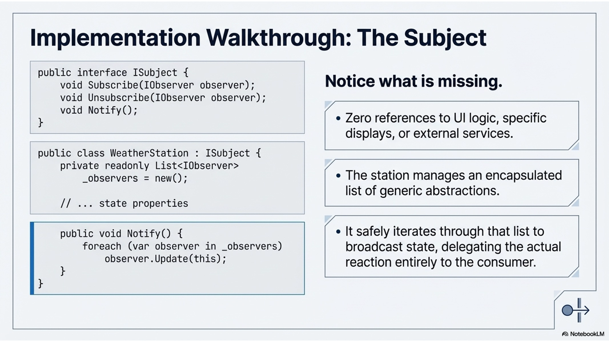

### A Simple Observer: CurrentConditionsDisplay

```csharp
// CurrentConditionsDisplay.cs
public class CurrentConditionsDisplay : IObserver
{
    public void Update(ISubject subject)
    {
        if (subject is WeatherStation ws)
        {
            Console.WriteLine("*** CurrentConditionsDisplay received update ***");
            Console.WriteLine(
                $"[Current Conditions] {ws.Temperature}°F, " +
                $"{ws.Humidity}% humidity, {ws.Pressure} hPa");
            Console.WriteLine("*** End of update ***");
            Console.WriteLine();
        }
    }
}
```


### Putting It Together

```csharp
// Program.cs
var station = new WeatherStation();

var currentDisplay = new CurrentConditionsDisplay();
station.Subscribe(currentDisplay);
station.SetMeasurements(80, 65, 1013.1f);
station.SetMeasurements(82, 70, 1012.5f);

// Unsubscribe and verify no more notifications
station.Unsubscribe(currentDisplay);
station.SetMeasurements(78, 90, 1011.0f);
Console.WriteLine("(No output above — currentDisplay was unsubscribed before the third reading)");
```

### Output

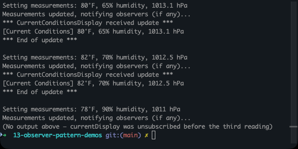

The third measurement produces no output because `currentDisplay` has been unsubscribed. The subject doesn't know or care — it simply iterates over whoever is currently in the list.

#### Language-Level Support: C# `event` and Java Listeners

The hand-rolled `ISubject`/`IObserver` implementation above is the *universal* version of the pattern — it works in any object-oriented language. However, C# provides built-in language support for Observer through the `event` keyword and delegates, which eliminates most of the boilerplate. Java does not have an equivalent keyword; Java developers use listener interfaces (exactly the hand-rolled approach shown above) or framework-level tools like Spring's `ApplicationEvent`.

See [Appendix 1: Idiomatic C# `event`/`delegate` and Java Listeners](#appendix-1-idiomatic-c-eventdelegate-and-java-listeners) for a full walkthrough of both approaches applied to the same Weather Station example.

---

## 4. Multiple Dispatch: One Subject, Many Observers

The real power of Observer appears when multiple observers with *different responsibilities* react to the same event.

A runnable single-file demo of this section is available at [`13-observer-pattern-demos/13-observer-pattern-weather-station-demo-2.cs`](13-observer-pattern-demos/13-observer-pattern-weather-station-demo-2.cs). Run it with:

```bash
dotnet run 13-observer-pattern-demos/13-observer-pattern-weather-station-demo-2.cs
```

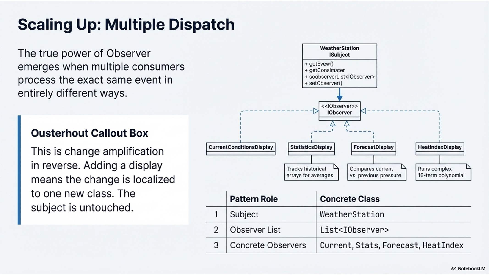

### Adding More Observers

```csharp
// StatisticsDisplay.cs
public class StatisticsDisplay : IObserver
{
    private readonly List<float> _temperatures = new();

    public void Update(ISubject subject)
    {
        if (subject is WeatherStation ws)
        {
            _temperatures.Add(ws.Temperature);
            float avg = _temperatures.Average();
            float min = _temperatures.Min();
            float max = _temperatures.Max();
            Console.WriteLine("*** StatisticsDisplay received update ***");
            Console.WriteLine(
                $"[Statistics] Avg: {avg:F1}°F, Min: {min}°F, Max: {max}°F");
            Console.WriteLine("*** End of update ***");
            Console.WriteLine();
        }
    }
}

// ForecastDisplay.cs
public class ForecastDisplay : IObserver
{
    private float _lastPressure;
    private float _currentPressure;

    public void Update(ISubject subject)
    {
        if (subject is WeatherStation ws)
        {
            _lastPressure = _currentPressure;
            _currentPressure = ws.Pressure;

            string forecast = _currentPressure > _lastPressure
                ? "Improving weather on the way!"
                : _currentPressure < _lastPressure
                    ? "Watch out for cooler, rainy weather."
                    : "More of the same.";

            Console.WriteLine("*** ForecastDisplay received update ***");
            Console.WriteLine($"[Forecast] {forecast}");
            Console.WriteLine("*** End of update ***");
            Console.WriteLine();
        }
    }
}

// HeatIndexDisplay.cs
public class HeatIndexDisplay : IObserver
{
    public void Update(ISubject subject)
    {
        if (subject is WeatherStation ws)
        {
            double hi = ComputeHeatIndex(ws.Temperature, ws.Humidity);
            Console.WriteLine("*** HeatIndexDisplay received update ***");
            Console.WriteLine($"[Heat Index] {hi:F2}°F");
            Console.WriteLine("*** End of update ***");
            Console.WriteLine();
        }
    }

    private static double ComputeHeatIndex(float t, float rh)
    {
        return 16.923 + 1.85212e-1 * t + 5.37941 * rh
             - 1.00254e-1 * t * rh + 9.41695e-3 * t * t
             + 7.28898e-3 * rh * rh + 3.45372e-4 * t * t * rh
             - 8.14971e-4 * t * rh * rh + 1.02102e-5 * t * t * rh * rh
             - 3.8646e-5 * t * t * t + 2.91583e-5 * rh * rh * rh
             + 1.42721e-6 * t * t * t * rh + 1.97483e-7 * t * rh * rh * rh
             - 2.18429e-8 * t * t * t * rh * rh
             + 8.43296e-10 * t * t * rh * rh * rh
             - 4.81975e-11 * t * t * t * rh * rh * rh;
    }
}
```

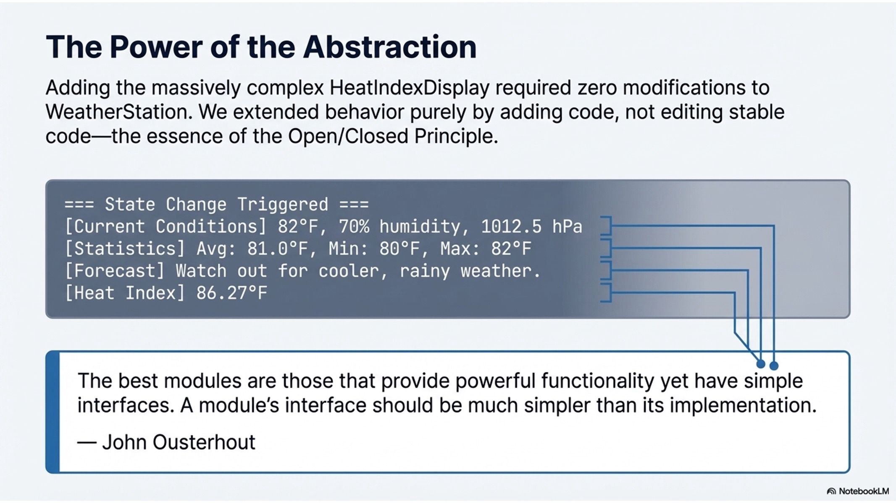

### Multi-Observer Program

```csharp
// Program.cs
var station = new WeatherStation();

var currentDisplay = new CurrentConditionsDisplay();
var statsDisplay = new StatisticsDisplay();
var forecastDisplay = new ForecastDisplay();
var heatIndexDisplay = new HeatIndexDisplay();

station.Subscribe(currentDisplay);
station.Subscribe(statsDisplay);
station.Subscribe(forecastDisplay);
station.Subscribe(heatIndexDisplay);

Console.WriteLine("=== First Reading ===");
station.SetMeasurements(80, 65, 1013.1f);

Console.WriteLine("\n=== Second Reading ===");
station.SetMeasurements(82, 70, 1012.5f);

Console.WriteLine("\n=== Third Reading (forecast unsubscribed) ===");
station.Unsubscribe(forecastDisplay);
station.SetMeasurements(78, 90, 1011.0f);
```

### Output

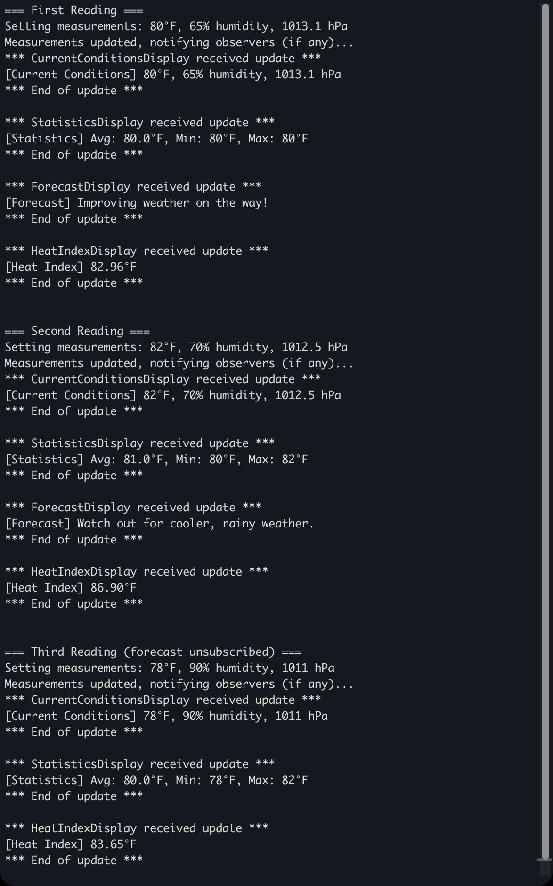

Notice: four observers, four completely different reactions, and `WeatherStation` didn't change at all between the single-observer and multi-observer version. Adding `HeatIndexDisplay` required *zero* modifications to the subject. The forecast display disappears mid-session — no error, no special case, no `if` statement.

> **Ousterhout:** This is **change amplification in reverse** (*A Philosophy of Software Design*, Ch. 2). In the naive approach (Section 1), adding a display means editing `WeatherStation` — the change amplifies into the source of truth. With Observer, the new display subscribes itself and the subject is untouched. The change is localized to one new class. This is the same principle behind OCP: extend behavior by adding code, not by editing stable code.

### Class Diagram: Full Weather Station

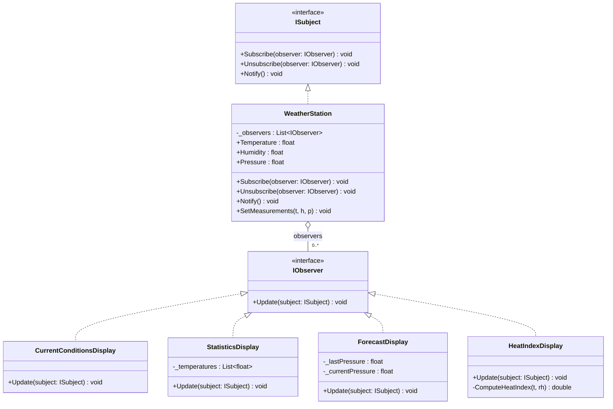
```mermaid
classDiagram
    class ISubject {
        <<interface>>
        +Subscribe(observer: IObserver) void
        +Unsubscribe(observer: IObserver) void
        +Notify() void
    }

    class IObserver {
        <<interface>>
        +Update(subject: ISubject) void
    }

    class WeatherStation {
        -_observers : List~IObserver~
        +Temperature : float
        +Humidity : float
        +Pressure : float
        +Subscribe(observer: IObserver) void
        +Unsubscribe(observer: IObserver) void
        +Notify() void
        +SetMeasurements(t, h, p) void
    }

    class CurrentConditionsDisplay {
        +Update(subject: ISubject) void
    }

    class StatisticsDisplay {
        -_temperatures : List~float~
        +Update(subject: ISubject) void
    }

    class ForecastDisplay {
        -_lastPressure : float
        -_currentPressure : float
        +Update(subject: ISubject) void
    }

    class HeatIndexDisplay {
        +Update(subject: ISubject) void
        -ComputeHeatIndex(t, rh) double
    }

    ISubject <|.. WeatherStation
    IObserver <|.. CurrentConditionsDisplay
    IObserver <|.. StatisticsDisplay
    IObserver <|.. ForecastDisplay
    IObserver <|.. HeatIndexDisplay
    WeatherStation o-- "0..*" IObserver : observers
```

> **Ousterhout:** "The best modules are those that provide powerful functionality yet have simple interfaces. A module's interface should be much simpler than its implementation." (*A Philosophy of Software Design*, Ch. 4). Each observer encapsulates a complex reaction behind a single `Update` method — the subject's interface stays trivially simple regardless of how many observers exist.

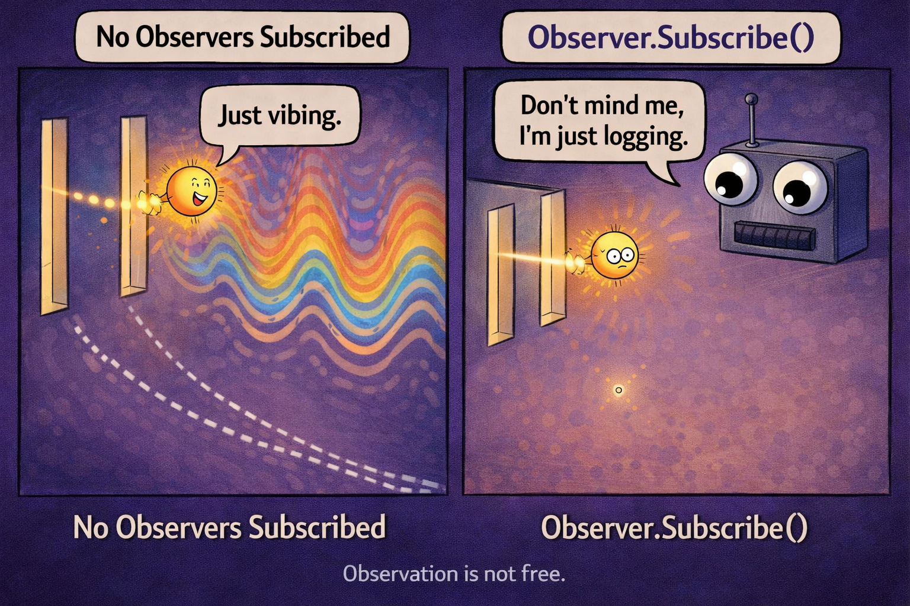

---

## 5. Observer in Client-Side Web Frameworks

The Observer pattern is not just a back-end concern. It is the *foundational mechanism* behind reactive UI in modern web frameworks. Every time a component re-renders because data changed, Observer is at work.

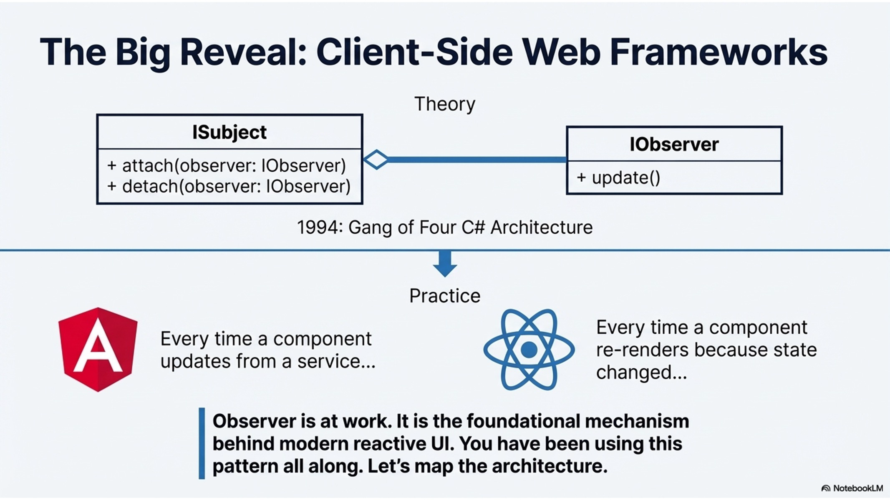

### Example Angular and React Weather Station Demo

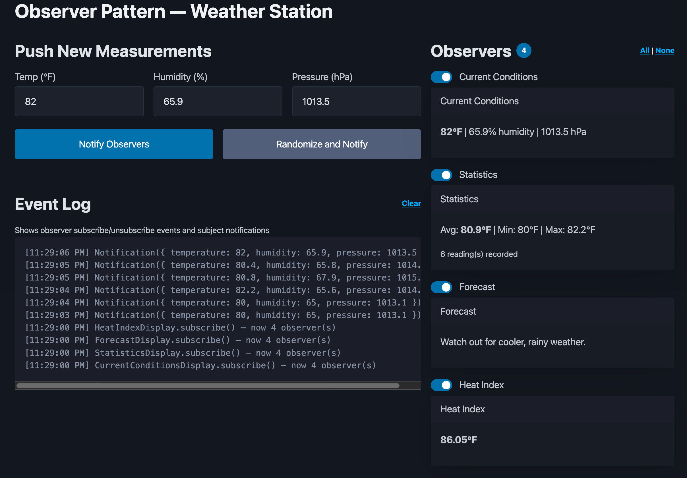

### Angular: RxJS Observables

Angular uses **RxJS** (Reactive Extensions for JavaScript) as its primary mechanism for handling asynchronous data and change notification. RxJS is Observer pattern + iterator pattern + functional composition.

A full, interactive Angular demo of the Weather Station is available at [`13-observer-pattern-demos/demo-3-angular/`](13-observer-pattern-demos/demo-3-angular/). The demo includes four observer components (current conditions, statistics, forecast, and heat index), live subscribe/unsubscribe toggles, an event log, and randomized data input. See the [README](13-observer-pattern-demos/demo-3-angular/README.md) for setup and run instructions.

The key code snippets from that demo follow.

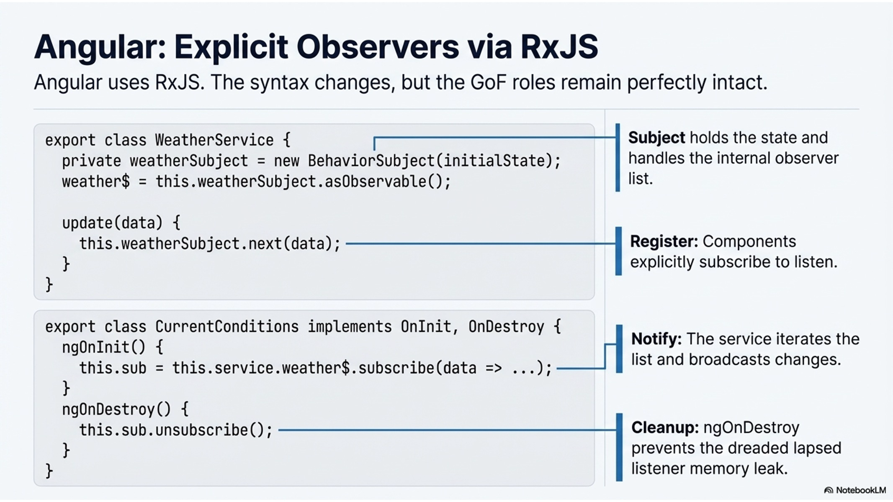

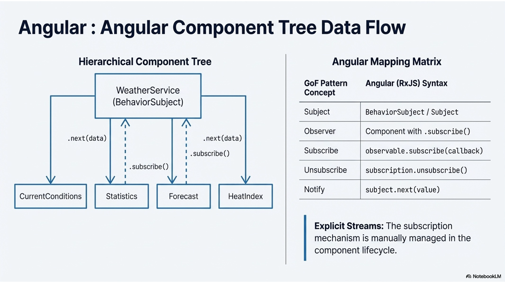

**The Subject: WeatherService**

The `BehaviorSubject` holds the current value and notifies all subscribers when `.next()` is called. The `asObservable()` call hides `.next()` from consumers, enforcing a read-only contract.

```typescript
// weather.service.ts (abbreviated — see demo for full source including
// subscriber count tracking, event logging, and log management)
@Injectable({ providedIn: 'root' })
export class WeatherService {
  private weatherSubject = new BehaviorSubject<WeatherData>({
    temperature: 0, humidity: 0, pressure: 0,
  });

  // Consumers subscribe to this — they cannot call .next()
  weather$: Observable<WeatherData> = this.weatherSubject.asObservable();

  updateMeasurements(temp: number, humidity: number, pressure: number): void {
    this.weatherSubject.next({ temperature: temp, humidity, pressure });
  }
}
```

**An Observer: CurrentConditionsComponent**

Each component subscribes in `ngOnInit()` and unsubscribes in `ngOnDestroy()` — the same lifecycle as `station.Subscribe(display)` and `station.Unsubscribe(display)` in the C# version.

```typescript
// current-conditions.component.ts (abbreviated — the demo also registers/
// unregisters with the event log for visualization purposes)
export class CurrentConditionsComponent implements OnInit, OnDestroy {
  data: WeatherData = { temperature: 0, humidity: 0, pressure: 0 };
  private subscription!: Subscription;

  constructor(private weatherService: WeatherService) {}

  ngOnInit(): void {
    this.subscription = this.weatherService.weather$.subscribe(
      (weather) => (this.data = weather)
    );
  }

  ngOnDestroy(): void {
    this.subscription.unsubscribe();
  }
}
```

**Key mapping to Observer pattern:**

| Observer Concept | Angular/RxJS Equivalent |
|-----------------|------------------------|
| Subject | `BehaviorSubject` / `Subject` |
| Observer | Component with `.subscribe()` |
| Subscribe | `observable.subscribe(callback)` |
| Unsubscribe | `subscription.unsubscribe()` |
| Notify | `subject.next(value)` |

**Component Tree and Data Flow**

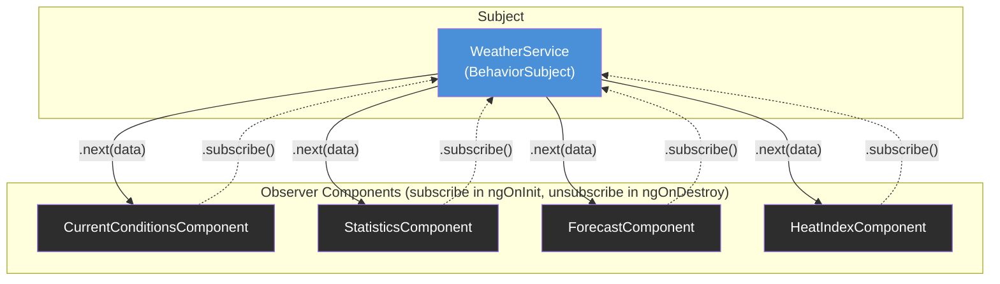
```mermaid
graph TD
    subgraph Subject
        WS["WeatherService<br/>(BehaviorSubject)"]
    end

    subgraph "Observer Components (subscribe in ngOnInit, unsubscribe in ngOnDestroy)"
        CC["CurrentConditionsComponent"]
        ST["StatisticsComponent"]
        FC["ForecastComponent"]
        HI["HeatIndexComponent"]
    end

    WS -- ".next(data)" --> CC
    WS -- ".next(data)" --> ST
    WS -- ".next(data)" --> FC
    WS -- ".next(data)" --> HI

    CC -. ".subscribe()" .-> WS
    ST -. ".subscribe()" .-> WS
    FC -. ".subscribe()" .-> WS
    HI -. ".subscribe()" .-> WS

    style WS fill:#4a90d9,color:#fff
    style CC fill:#2d2d2d,color:#fff
    style ST fill:#2d2d2d,color:#fff
    style FC fill:#2d2d2d,color:#fff
    style HI fill:#2d2d2d,color:#fff
```

Solid arrows show notification flow (`.next()` pushes data to all subscribers). Dashed arrows show the subscription relationship (each component calls `.subscribe()` on the shared `Observable`). Toggling a component off calls `.unsubscribe()` in `ngOnDestroy` and removes it from the notification list — the service never changes.

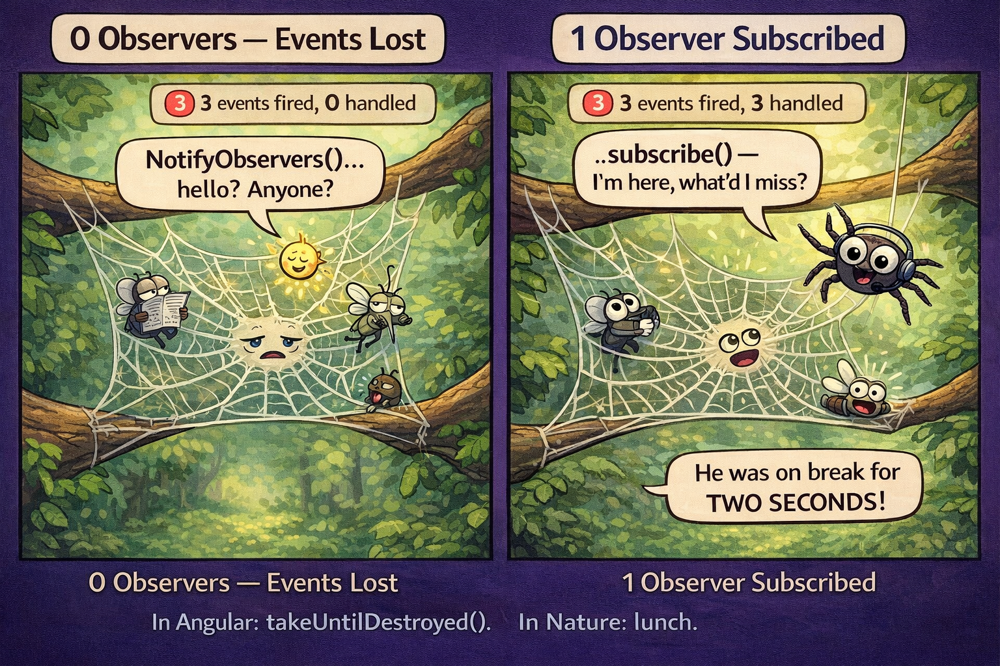

### React: State and Custom Hooks

React does not use a traditional Observer object, but the pattern is still present. React's state system *is* an observer mechanism: when state changes, every component that reads that state re-renders.

A full, interactive React demo of the Weather Station is available at [`13-observer-pattern-demos/demo-4-react/`](13-observer-pattern-demos/demo-4-react/). The demo includes four observer components (current conditions, statistics, forecast, and heat index), live mount/unmount toggles, an event log, and randomized data input. See the [README](13-observer-pattern-demos/demo-4-react/README.md) for setup and run instructions.

The key code snippets from that demo follow.

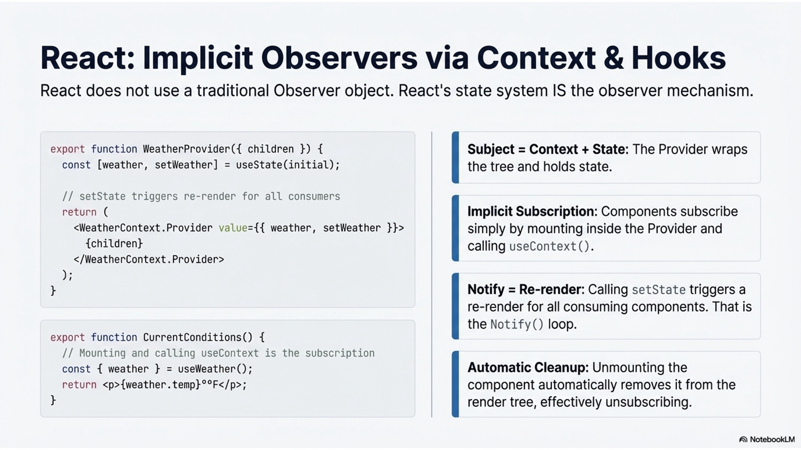

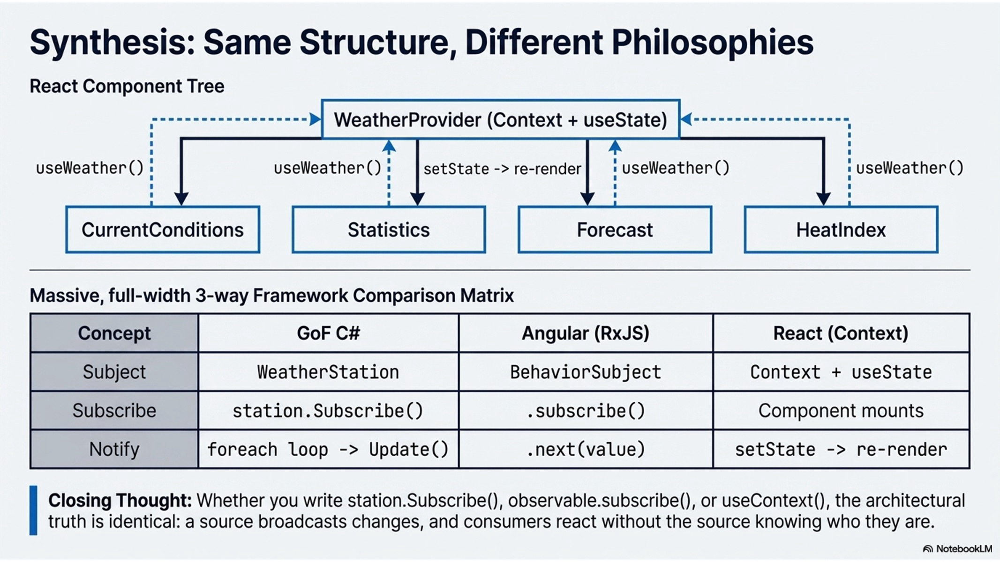

**The Subject: WeatherContext**

A `WeatherProvider` wraps the component tree. It holds state via `useState` and exposes it through Context. Any component that calls `useWeather()` re-renders when the state changes — that re-render *is* the notification.

```tsx
// WeatherContext.tsx (abbreviated — see demo for full source including
// subscriber count tracking, event logging, and log management)
const WeatherContext = createContext<WeatherContextType | null>(null);

export function WeatherProvider({ children }: { children: ReactNode }) {
  const [weather, setWeather] = useState<WeatherData>({
    temperature: 0, humidity: 0, pressure: 0,
  });

  const updateMeasurements = useCallback(
    (temp: number, humidity: number, pressure: number) => {
      // setState triggers re-render for all consuming components
      setWeather({ temperature: temp, humidity, pressure });
    }, []
  );

  return (
    <WeatherContext.Provider value={{ weather, updateMeasurements }}>
      {children}
    </WeatherContext.Provider>
  );
}

export function useWeather(): WeatherContextType {
  const ctx = useContext(WeatherContext);
  if (!ctx) throw new Error('useWeather must be inside WeatherProvider');
  return ctx;
}
```

**An Observer: CurrentConditions**

Components subscribe by mounting inside the Provider and calling `useWeather()`. They unsubscribe by unmounting — the `useEffect` cleanup runs. No manual `.subscribe()` or `.unsubscribe()` calls; React's component lifecycle handles it.

```tsx
// CurrentConditions.tsx (abbreviated — the demo also registers/
// unregisters with the event log for visualization purposes)
export function CurrentConditions() {
  const { weather, registerSubscriber, unregisterSubscriber } = useWeather();

  useEffect(() => {
    registerSubscriber('CurrentConditionsDisplay');
    return () => unregisterSubscriber('CurrentConditionsDisplay');
  }, [registerSubscriber, unregisterSubscriber]);

  return (
    <article>
      <header>Current Conditions</header>
      <p>{weather.temperature}°F | {weather.humidity}% humidity | {weather.pressure} hPa</p>
    </article>
  );
}
```

**Key mapping to Observer pattern:**

| Observer Concept | React Equivalent |
|-----------------|-----------------|
| Subject | Context + `useState` in `WeatherProvider` |
| Observer | Component that calls `useWeather()` |
| Subscribe | Component mounts inside Provider (`useEffect` runs) |
| Unsubscribe | Component unmounts (`useEffect` cleanup runs) |
| Notify | `setState` triggers re-render |

**Component Tree and Data Flow**

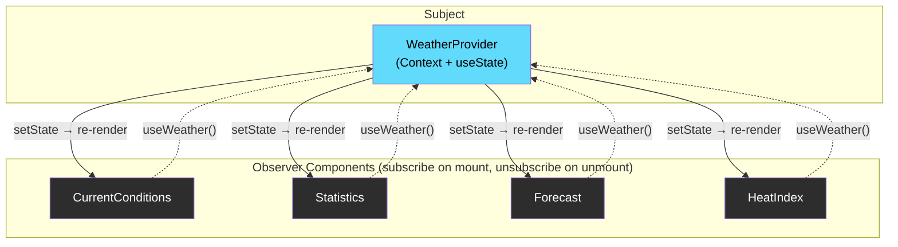
```mermaid
graph TD
    subgraph Subject
        WP["WeatherProvider<br/>(Context + useState)"]
    end

    subgraph "Observer Components (subscribe on mount, unsubscribe on unmount)"
        CC["CurrentConditions"]
        ST["Statistics"]
        FC["Forecast"]
        HI["HeatIndex"]
    end

    WP -- "setState → re-render" --> CC
    WP -- "setState → re-render" --> ST
    WP -- "setState → re-render" --> FC
    WP -- "setState → re-render" --> HI

    CC -. "useWeather()" .-> WP
    ST -. "useWeather()" .-> WP
    FC -. "useWeather()" .-> WP
    HI -. "useWeather()" .-> WP

    style WP fill:#61dafb,color:#000
    style CC fill:#2d2d2d,color:#fff
    style ST fill:#2d2d2d,color:#fff
    style FC fill:#2d2d2d,color:#fff
    style HI fill:#2d2d2d,color:#fff
```

Solid arrows show notification flow (`setState` triggers a re-render for every component consuming the context). Dashed arrows show the subscription relationship (each component calls `useWeather()` to read from the context). Unmounting a component removes it from the render tree — React stops re-rendering it, which is the equivalent of unsubscribing.

### The Shared Insight

Whether you write `station.Subscribe(display)` in C#, `observable.subscribe(callback)` in Angular, or `useContext(WeatherContext)` in React, the structural relationship is identical: a source of truth broadcasts changes, and consumers react without the source knowing who they are.

---

>  **EXAM 2 Material Ends Here 😀**

---

## 6. Observer Pattern vs Direct Coupling

### When to Use the Observer Pattern

Observer is not "better" by default. It is a tradeoff: you accept more infrastructure in exchange for less coupling and more growth room.

- The number of consumers **will grow** or is **unknown at design time**.
- Consumers have **different reactions** to the same event.
- You need **runtime subscribe/unsubscribe** (features, user preferences, A/B tests).
- The subject is a **library or framework** that shouldn't depend on application code.
- You need to **cross a process boundary** (with a message queue layer).

### When Direct Coupling Is Fine

- There is exactly **one consumer** and it will never change.
- The notification is **trivially simple** (e.g., incrementing a counter).
- Adding an interface and observer list would be **more code than the entire feature**.
- You are writing a **short script or prototype** where maintenance cost is zero.

### Decision Flow

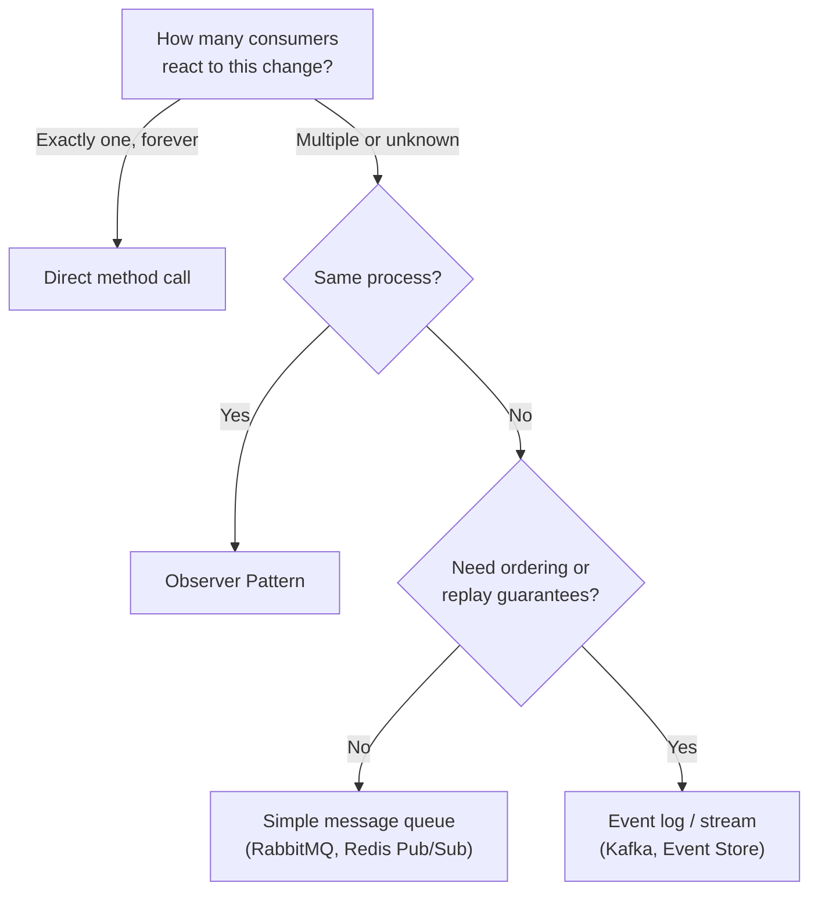
```mermaid
flowchart TD
    A["How many consumers<br>react to this change?"] -->|"Exactly one, forever"| B["Direct method call"]
    A -->|"Multiple or unknown"| C{"Same process?"}
    C -->|Yes| D["Observer Pattern"]
    C -->|No| E{"Need ordering or<br>replay guarantees?"}
    E -->|No| F["Simple message queue<br>(RabbitMQ, Redis Pub/Sub)"]
    E -->|Yes| G["Event log / stream<br>(Kafka, Event Store)"]
```

### Comparison Table

| Concern | Direct Coupling | Observer Pattern | Message Queue |
|---------|----------------|-----------------|---------------|
| Adding a new consumer | Modify the source | Register a new observer | Subscribe a new consumer |
| Removing a consumer | Modify the source | Unsubscribe | Unsubscribe |
| Runtime flexibility | None | Full | Full |
| Coupling direction | Source → consumer | Source → interface | Source → queue (no consumer knowledge) |
| Performance overhead | None | Minimal (list iteration) | Network + serialization |
| Cross-process | No | No | Yes |
| Error isolation | Shared | Shared (unless guarded) | Full (consumer crash is independent) |
| Testability | Hard (must mock all consumers) | Easy (mock observer interface) | Easy (mock queue or use in-memory bus) |

---

## 7. Decoupling with a Message Queue

### The Limitation of In-Process Observer

Sections 1-5 kept the subject and observers inside one running application. The next step is to keep the same publish/subscribe idea even after producer and consumers stop sharing memory.

The Observer pattern as shown so far works within a single process. The subject holds direct references to its observers and calls their methods synchronously. This means:

- Subject and observers must be in the **same process**.
- A slow observer **blocks** the subject (and all subsequent observers).
- If an observer throws an exception, it can **crash** the notification loop.
- You cannot add observers written in a **different language** or running on a **different machine**.

### Introducing the Message Queue

A **message queue** (also called a message broker) sits between the subject and the observers. The subject publishes events to the queue. Observers subscribe to the queue and consume events independently.

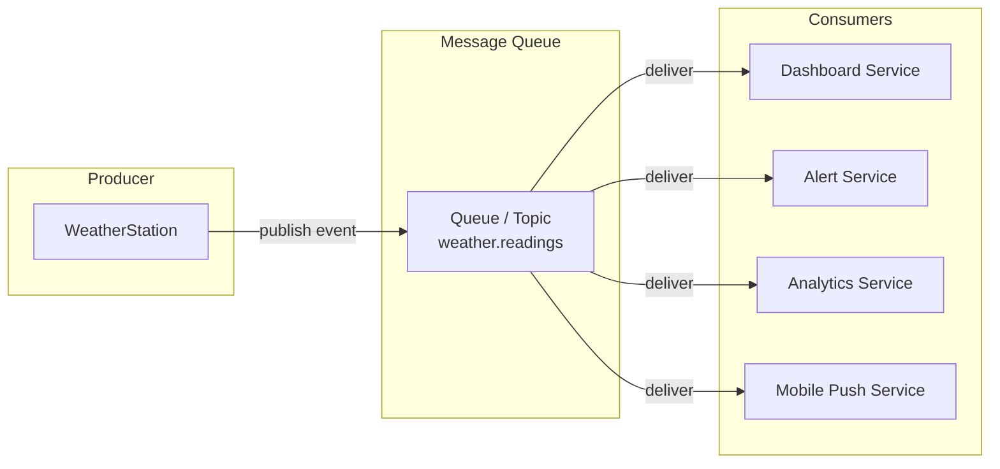
```mermaid
flowchart LR
    subgraph Producer
        WS[WeatherStation]
    end

    subgraph Message Queue
        Q[Queue / Topic<br>weather.readings]
    end

    subgraph Consumers
        C1[Dashboard Service]
        C2[Alert Service]
        C3[Analytics Service]
        C4[Mobile Push Service]
    end

    WS -->|publish event| Q
    Q -->|deliver| C1
    Q -->|deliver| C2
    Q -->|deliver| C3
    Q -->|deliver| C4
```

The subject (producer) and observers (consumers) are now **more loosely coupled**:

| In-Process Observer | Message Queue Observer |
|--------------------|----------------------|
| Same process | Different processes, different machines |
| Synchronous call | Asynchronous delivery |
| Subject blocks on slow observer | Queue buffers; consumers work at their own pace |
| Observer crash kills notification loop | Consumer crash doesn't affect producer |
| Same language required | Any language that speaks the queue protocol |
| Observer list in memory | Subscription managed by the broker |

They are not coupled by object references anymore, but they still share a **message contract**: event type, payload shape, and channel/topic name.

A **message queue** focuses on delivery to consumers, while an **event log** focuses on durable ordered history that consumers can replay later; students often group RabbitMQ and Kafka together, but they are optimized for different priorities.

### Bridge Example: An In-Process Event Bus

To illustrate the architectural shift without requiring RabbitMQ or Kafka setup, here is a simplified in-memory event bus. It demonstrates indirection and publish/subscribe structure, but it is still synchronous and in-process:

```csharp
// IEventBus.cs — the abstraction replacing direct observer references
public interface IEventBus
{
    void Publish<T>(T message);
    void Subscribe<T>(Action<T> handler);
}

// SimpleEventBus.cs — in-memory event bus
public class SimpleEventBus : IEventBus
{
    private readonly Dictionary<Type, List<Delegate>> _handlers = new();

    public void Publish<T>(T message)
    {
        if (_handlers.TryGetValue(typeof(T), out var handlers))
        {
            foreach (var handler in handlers)
                ((Action<T>)handler)(message);
        }
    }

    public void Subscribe<T>(Action<T> handler)
    {
        if (!_handlers.ContainsKey(typeof(T)))
            _handlers[typeof(T)] = new List<Delegate>();
        _handlers[typeof(T)].Add(handler);
    }
}

// WeatherReading.cs — the event (a simple record)
public record WeatherReading(float Temperature, float Humidity, float Pressure);

// WeatherStation.cs — producer: publishes to the bus, knows nothing about consumers
public class WeatherStation
{
    private readonly IEventBus _bus;

    public WeatherStation(IEventBus bus) => _bus = bus;

    public void SetMeasurements(float temp, float humidity, float pressure)
    {
        _bus.Publish(new WeatherReading(temp, humidity, pressure));
    }
}

// DashboardConsumer.cs — consumer: subscribes to the bus, knows nothing about the producer
public class DashboardConsumer
{
    public DashboardConsumer(IEventBus bus)
    {
        bus.Subscribe<WeatherReading>(reading =>
            Console.WriteLine(
                $"[Dashboard] {reading.Temperature}°F, " +
                $"{reading.Humidity}% humidity"));
    }
}

// AlertConsumer.cs — another consumer with different logic
public class AlertConsumer
{
    public AlertConsumer(IEventBus bus)
    {
        bus.Subscribe<WeatherReading>(reading =>
        {
            if (reading.Temperature > 100)
                Console.WriteLine($"[ALERT] Extreme heat: {reading.Temperature}°F!");
        });
    }
}

// Program.cs
var bus = new SimpleEventBus();

var station = new WeatherStation(bus);
var dashboard = new DashboardConsumer(bus);
var alerts = new AlertConsumer(bus);

station.SetMeasurements(80, 65, 1013.1f);
station.SetMeasurements(105, 30, 1008.0f);
```

What this example proves:

- `WeatherStation` depends on `IEventBus` and `WeatherReading`, not on any consumer class.
- Consumers depend on the bus and the event contract, not on the producer.
- The example does **not** yet provide durability, retries, network delivery, or true broker-managed subscriptions.
- For brevity, it also omits `Unsubscribe`; a production event bus still needs lifecycle management.

### Output

```text
[Dashboard] 80°F, 65% humidity
[Dashboard] 105°F, 30% humidity
[ALERT] Extreme heat: 105°F!
```

### The Architectural Progression

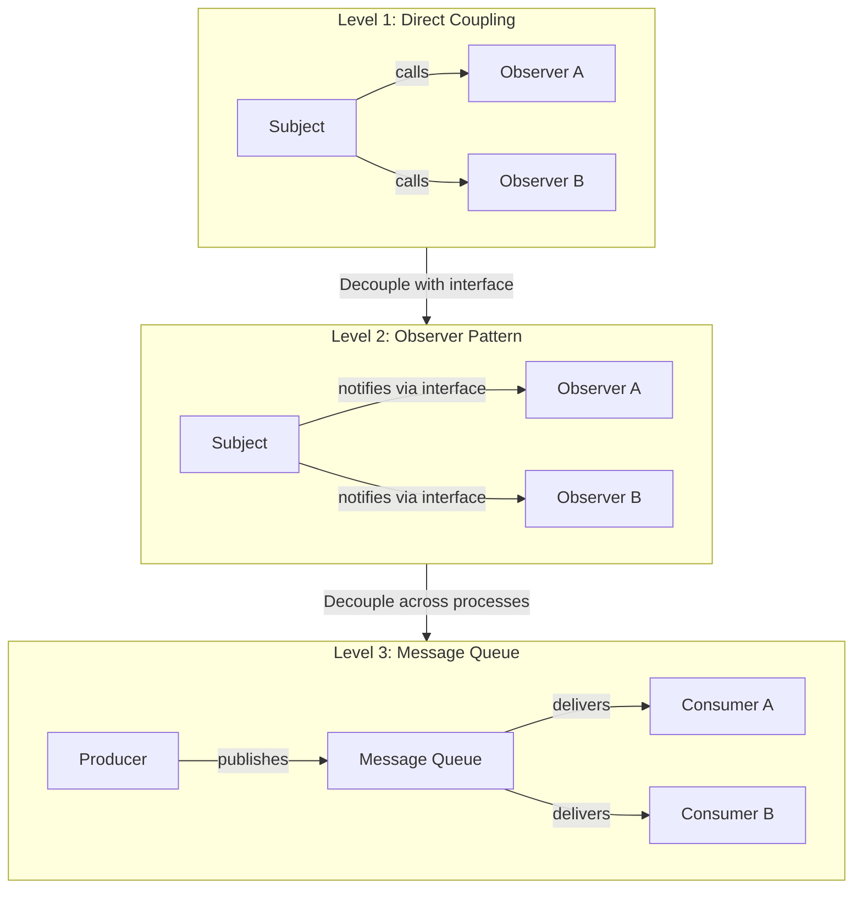
```mermaid
flowchart TD
    subgraph Level1 ["Level 1: Direct Coupling"]
        S1[Subject] -->|calls| O1A[Observer A]
        S1 -->|calls| O1B[Observer B]
    end

    subgraph Level2 ["Level 2: Observer Pattern"]
        S2[Subject] -->|notifies via interface| O2A[Observer A]
        S2 -->|notifies via interface| O2B[Observer B]
    end

    subgraph Level3 ["Level 3: Message Queue"]
        S3[Producer] -->|publishes| MQ[Message Queue]
        MQ -->|delivers| O3A[Consumer A]
        MQ -->|delivers| O3B[Consumer B]
    end

    Level1 -->|"Decouple with interface"| Level2
    Level2 -->|"Decouple across processes"| Level3
```

Each level removes a layer of coupling:
- **Level 1 → 2**: removes concrete class dependencies (the subject depends on an interface, not a class).
- **Level 2 → 3**: removes process-level coupling (the producer and consumers don't share memory, a runtime, or even a programming language).

### Real-World Message Queues

In production systems, the in-memory bus is replaced by a dedicated message broker:

| Technology | Model | Common Use Case |
|-----------|-------|----------------|
| **RabbitMQ** | Message queue with exchanges and routing | Microservice communication, task queues |
| **Apache Kafka** | Distributed event log | Event sourcing, stream processing, high-throughput pipelines |
| **Azure Service Bus** | Cloud-managed queue/topic | Enterprise integration on Azure |
| **AWS SNS + SQS** | Pub/sub (SNS) + queue (SQS) | Serverless event-driven architectures |
| **Redis Pub/Sub** | Lightweight in-memory pub/sub | Real-time notifications, cache invalidation |

The architectural principle is the same in every case: **the producer writes to a named channel, consumers read from it independently, and both sides depend on a shared message contract instead of direct references**.

> **Ousterhout:** "The most important technique for achieving simplicity is to eliminate special cases. A message queue eliminates the special case where subject and observer must be in the same process, use the same language, and run at the same speed." (*A Philosophy of Software Design*, Ch. 10).

---

## 8. Message Queue Observer Demo: Wacky Chat

The `demo-5-message-queue-chat` project turns Section 7 into something students can touch from their phones. It uses:

- **Angular** for the browser UI
- **ASP.NET Core (C#)** for the HTTP API and SSE bridge
- **RabbitMQ** for the broker
- **Server-Sent Events (SSE)** for pushing queued messages into each browser

> See the `demo-5-message-queue-chat` README file to start the Docker container.
> Once started, you can connect at http://localhost:8080/. 
> You can view the per-user message queues at http://localhost:15672/#/queues.

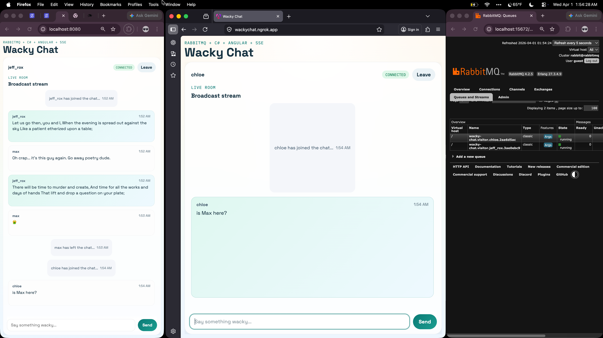

### Architectural Overview

Each browser joins with a unique handle. The ASP.NET Core back end creates one RabbitMQ queue for that visitor, binds it to the shared fanout exchange, and then keeps an SSE stream open for that visitor. When any user sends a chat message, the server publishes **one** event to the exchange. RabbitMQ copies that event into every connected visitor queue. The server then consumes each queue and forwards the deliveries to the correct browser over SSE.

Browsers do not speak AMQP directly, so the ASP.NET Core app bridges RabbitMQ deliveries into SSE.

This is the exact Observer idea from Section 7, but with the broker replacing the in-memory observer list:

- The **publisher** is the ASP.NET Core application.
- The **broker** is RabbitMQ.
- The **subscribers** are the per-visitor queue consumers.
- The **browser UI** observes the SSE stream, not RabbitMQ directly.

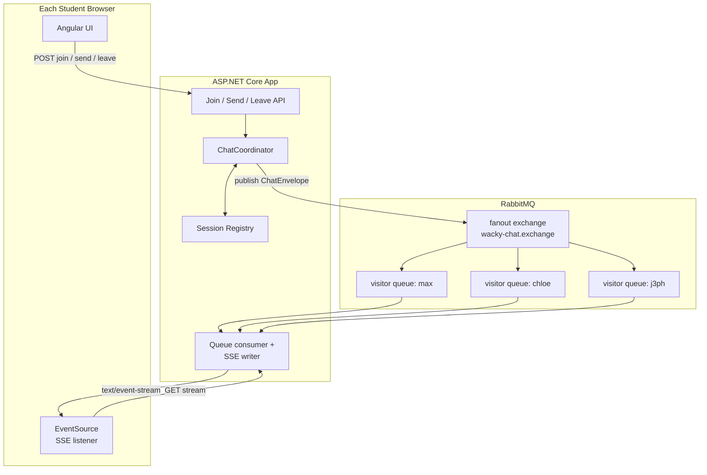
```mermaid
flowchart TB
    subgraph Broker["RabbitMQ"]
        EX["fanout exchange<br/>wacky-chat.exchange"]
        QA["visitor queue: max"]
        QB["visitor queue: chloe"]
        QC["visitor queue: j3ph"]
    end

    subgraph App["ASP.NET Core App"]
        API["Join / Send / Leave API"]
        COORD["ChatCoordinator"]
        REG["Session Registry"]
        SSE["Queue consumer +<br/>SSE writer"]
    end


    
        subgraph Browser["Each Student Browser"]
        UI["Angular UI"]
        ES["EventSource<br/>SSE listener"]
    end

    UI -->|POST join / send / leave| API
    ES -->|GET stream| SSE
    API --> COORD
    COORD <--> REG
    COORD -->|publish ChatEnvelope| EX
    EX --> QA
    EX --> QB
    EX --> QC
    QA --> SSE
    QB --> SSE
    QC --> SSE
    SSE -->|text/event-stream| ES
```

### Queue Topology: Why Fanout Matters

The important design choice is **one exchange, many queues**. The sender does **not** publish separately to Max, Chloe, and j3ph. It publishes once to the fanout exchange, and RabbitMQ duplicates the message into every bound visitor queue.

That gives us two useful teaching points:

- The producer does not know who is connected.
- Each visitor has an independent queue, so delivery to one browser is conceptually separate from delivery to another.

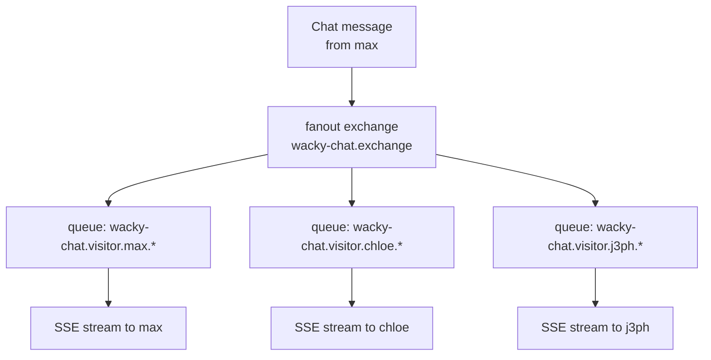
```mermaid
flowchart TD
    M["Chat message<br/>from max"]
    X["fanout exchange<br/>wacky-chat.exchange"]

    QA["queue: wacky-chat.visitor.max.*"]
    QB["queue: wacky-chat.visitor.chloe.*"]
    QC["queue: wacky-chat.visitor.j3ph.*"]

    SA["SSE stream to max"]
    SB["SSE stream to chloe"]
    SC["SSE stream to j3ph"]

    M --> X
    X --> QA
    X --> QB
    X --> QC

    QA --> SA
    QB --> SB
    QC --> SC
```

Because Max's own queue is also bound to the exchange, Max receives the same broadcast that Chloe and j3ph receive. That is why the sender sees their own message appear in the room without any special-case UI logic.

This demo is intentionally **live broadcast only**: it does not keep replayable chat history, so a late joiner sees new messages from the moment they connect, not earlier ones.

### Message Broadcast Sequence

This is the runtime path when one user sends a message to everyone:

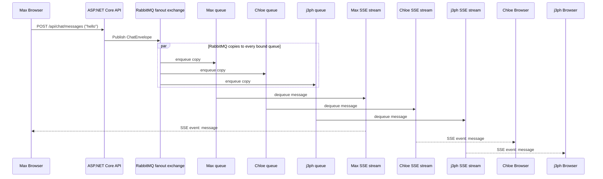
```mermaid
sequenceDiagram
    participant Max as Max Browser
    participant API as ASP.NET Core API
    participant X as RabbitMQ fanout exchange
    participant QA as Max queue
    participant QB as Chloe queue
    participant QC as j3ph queue
    participant SSEA as Max SSE stream
    participant SSEB as Chloe SSE stream
    participant SSEC as j3ph SSE stream
    participant Chloe as Chloe Browser
    participant J3PH as j3ph Browser

    Max->>API: POST /api/chat/messages ("hello")
    API->>X: Publish ChatEnvelope

    par RabbitMQ copies to every bound queue
        X->>QA: enqueue copy
        X->>QB: enqueue copy
        X->>QC: enqueue copy
    end

    QA->>SSEA: dequeue message
    QB->>SSEB: dequeue message
    QC->>SSEC: dequeue message

    SSEA-->>Max: SSE event: message
    SSEB-->>Chloe: SSE event: message
    SSEC-->>J3PH: SSE event: message
```

### How SSE Works

**Server-Sent Events (SSE)** is a simple browser feature for one-way server-to-client streaming over ordinary HTTP. The browser opens a long-lived `GET` request, the server keeps the response open, and the server writes small event frames such as:

```text
event: message
data: {"author":"max","text":"hello"}
```

The browser's `EventSource` object listens for those events and updates the UI as they arrive. Unlike WebSockets, SSE is one-way: the browser receives streamed events from the server, but it still sends joins and chat messages using normal HTTP requests.

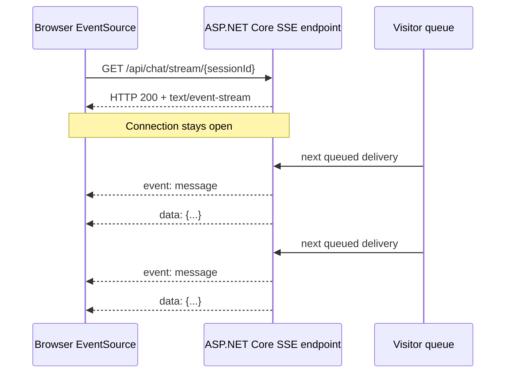
```mermaid
sequenceDiagram
    participant Browser as Browser EventSource
    participant App as ASP.NET Core SSE endpoint
    participant Queue as Visitor queue

    Browser->>App: GET /api/chat/stream/{sessionId}
    App-->>Browser: HTTP 200 + text/event-stream
    Note over App,Browser: Connection stays open

    Queue->>App: next queued delivery
    App-->>Browser: event: message
    App-->>Browser: data: {...}

    Queue->>App: next queued delivery
    App-->>Browser: event: message
    App-->>Browser: data: {...}
```

> **Deployment note:** WebSockets are also an outstanding solution for real-time systems, but they usually require more complex production deployment configuration, including concerns such as connection handling and [**sticky sessions**](https://dev.to/ably/challenges-of-scaling-websockets-3493) in load-balanced environments.


### What This Demo Makes Concrete

- **Observer in-process**: subject holds an observer list and calls `Update()`.
- **Observer with a broker**: producer publishes once, broker manages the fan-out, and consumers react independently.
- **SSE as the last mile**: the browser still experiences Observer-style updates, but it observes a server stream rather than a local object in memory.

In other words, Wacky Chat is a good demonstration bridging the concept of "objects notifying objects" to "systems notifying systems."

---

## 9. Anti-Patterns and Failure Modes

### Common Mistakes

| Smell | Description | Why It Is Risky |
|-------|------------|----------------|
| **Lapsed listener** | Observer is never unsubscribed after it is no longer needed | Memory leak. The subject holds a reference, preventing garbage collection. This is the #1 Observer bug. |
| **Notification storm** | Subject notifies on every property setter, even when multiple properties change together | Observers fire N times when they only needed to fire once. Wastes CPU and can cause UI flicker. |
| **Circular notification** | An observer's reaction writes back into the same subject (or another observed object), triggering another notification cycle | Infinite loop or stack overflow. |
| **Order dependence** | Code relies on observers being notified in a specific order | The pattern makes no ordering guarantee. Relying on order creates fragile, hidden coupling. |
| **God subject** | One subject accumulates dozens of event types, each with its own observer interface | Violates SRP. Split into multiple focused subjects. |
| **Ignoring thread safety** | Modifying the observer list while iterating it in a concurrent environment | `InvalidOperationException` (C#), `ConcurrentModificationException` (Java), or silent data corruption. |

### The Lapsed Listener in Detail

```csharp
// WRONG: observer is created, subscribed, and then forgotten
public void ShowTemporaryAlert(WeatherStation station)
{
    var alert = new HeatIndexDisplay();
    station.Subscribe(alert);

    // alert goes out of scope here, but station still holds a reference
    // The HeatIndexDisplay will never be garbage-collected
    // and will continue to receive notifications forever
}
```

The fix is straightforward: always pair subscribe with unsubscribe. In C#, you can use `IDisposable`:

```csharp
public class HeatIndexDisplay : IObserver, IDisposable
{
    private readonly ISubject _subject;

    public HeatIndexDisplay(ISubject subject)
    {
        _subject = subject;
        _subject.Subscribe(this);
    }

    public void Update(ISubject subject) { /* ... */ }

    public void Dispose()
    {
        _subject.Unsubscribe(this);
    }
}

// Usage with using statement guarantees cleanup
using (var alert = new HeatIndexDisplay(station))
{
    station.SetMeasurements(105, 30, 1008.0f);
} // Dispose() called here — observer is unsubscribed
```

### Avoiding Notification Storms

The bad version fires `Notify()` after each setter. The correct version stages all related state changes and then notifies once:

```csharp
// RIGHT: stage all changes, then notify once
public void SetMeasurements(float temp, float humidity, float pressure)
{
    Temperature = temp;   // don't notify here
    Humidity = humidity;   // don't notify here
    Pressure = pressure;   // don't notify here
    Notify();              // notify ONCE after all changes
}
```

When multiple properties change together, batch the changes and call `Notify()` once at the end. If observers truly need separate reactions, emit separate semantic events such as `TemperatureChanged` and `PressureChanged` instead of firing a generic notification multiple times.

> **Ousterhout:** "Each piece of design infrastructure added to a system, such as an interface, argument, function, class, or definition, adds complexity. In order for an element to provide a net gain against complexity, it must eliminate some complexity that would be present in its absence." (*A Philosophy of Software Design*, Ch. 6). Every notification is a piece of "infrastructure." Don't fire more of them than the observers need.

---

## 10. Relationship to Other Patterns

### Observer and State

The State pattern (Lecture 12) and Observer complement each other naturally. A state machine can *notify observers* when it transitions:

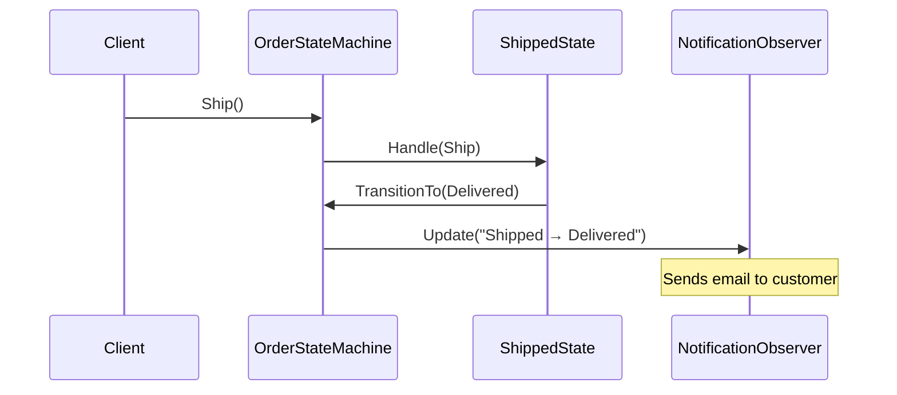
```mermaid
sequenceDiagram
    participant Client
    participant SM as OrderStateMachine
    participant State as ShippedState
    participant Obs as NotificationObserver

    Client->>SM: Ship()
    SM->>State: Handle(Ship)
    State->>SM: TransitionTo(Delivered)
    SM->>Obs: Update("Shipped → Delivered")
    Note over Obs: Sends email to customer
```

### Observer and Factory

A Factory ([Lecture 8](08-factory-singleton.md)) can create and register observers dynamically. Instead of hardcoding which observers subscribe, a factory reads configuration and wires them up at startup.

### Observer and Decorator

A Decorator ([Lecture 5](05-open-closed-principle-and-decorator.md)) can wrap an observer to add cross-cutting behavior (logging, error handling, metrics) without modifying the original observer:

```csharp
public class LoggingObserverDecorator : IObserver
{
    private readonly IObserver _inner;

    public LoggingObserverDecorator(IObserver inner) => _inner = inner;

    public void Update(ISubject subject)
    {
        Console.WriteLine($"[LOG] Observer {_inner.GetType().Name} notified");
        _inner.Update(subject);
    }
}
```

### Observer and Singleton

A Singleton event bus ([Lecture 8](08-factory-singleton.md)) is sometimes used when one application-wide bus coordinates publish/subscribe communication. Treat this as a separate decision from Observer itself: the pattern does **not** require global state, and testability is often better when the bus is injected instead.

---

## 11. Real-World Summary

### Practical Guidance

Observer is about **dependency direction**, not about adding fancy infrastructure for its own sake.

- **Start simple**: if you have one or two consumers that won't change, don't use Observer. Direct calls are clearer.
- **Graduate to Observer** when the consumer count is unknown, growing, or needs runtime flexibility.
- **Graduate to a message queue** when you need cross-process delivery, error isolation, or different consumer speeds.
- **Always unsubscribe**. Treat subscribe/unsubscribe like open/close on a file handle. Use `IDisposable`, `OnDestroy`, `useEffect` cleanup, or whatever your platform provides.
- **Batch notifications**. Notify once after a coherent set of changes, not once per property.
- **Don't rely on ordering**. If you need ordered processing, use a pipeline or chain, not Observer.

### Common Observer Pattern Misconceptions

| Claim | Reality |
|-------|---------|
| "Observer is only for UI" | Observer is used in logging, monitoring, event sourcing, microservice communication, and anywhere state change must propagate. |
| "Observer means event-driven architecture" | Observer is one mechanism in event-driven design. Event-driven architecture also includes event sourcing, CQRS, and choreography, which go well beyond the basic pattern. |
| "RxJS replaced Observer" | RxJS *implements* Observer (plus iterator, plus functional operators). It is Observer, not a replacement for it. |
| "React doesn't use Observer" | React state libraries and render updates rely on observer-style notifications. The framework hides most of the subscribe/notify mechanics. |
| "Message queues are a different pattern" | A brokered pub/sub system generalizes the same publish/subscribe relationship across process boundaries. The core idea is still "something changed, interested parties react." |

---

## Study Guide

### Core Definitions

- `Observer pattern`: a behavioral design pattern that defines a one-to-many dependency so that when one object changes state, all dependents are notified and updated automatically.
- `Subject (Observable/Publisher)`: the object that holds state and maintains a list of observers to notify when that state changes.
- `Observer (Subscriber/Listener)`: an object that registers with a subject and receives notifications when the subject's state changes.
- `Subscribe`: the act of an observer registering itself with a subject to receive future notifications.
- `Unsubscribe`: the act of an observer removing itself from a subject's notification list.
- `Push notification`: the subject sends changed data directly to observers as method arguments.
- `Pull notification`: the subject sends a reference to itself; observers query for the data they need.
- `Lapsed listener`: a memory leak caused by an observer that remains subscribed after it is no longer needed, preventing garbage collection.
- `Notification storm`: excessive notifications caused by the subject firing `Notify()` on every individual property change instead of batching.
- `Message queue/broker`: an intermediary that decouples publishers from subscribers, allowing cross-process, asynchronous, fault-tolerant event delivery.
- `Event bus`: an in-process publish/subscribe mechanism where producers and consumers interact through a shared bus rather than direct references.

### Boundary Checklist

- Can you add a new observer without modifying the subject? (If no, the pattern is not implemented correctly.)
- Can you remove an observer at runtime? (If no, you have compile-time coupling.)
- Does every `Subscribe` have a corresponding `Unsubscribe`? (If no, you likely have a lapsed listener leak.)
- Is `Notify()` called once per coherent state change, not once per property? (If no, you may have notification storms.)
- Does the subject depend only on the `IObserver` interface, never on concrete observer types? (If no, you have tight coupling.)

### SOLID Connections

| Principle | How Observer Applies |
|-----------|---------------------|
| **SRP** | The subject is responsible for state; each observer is responsible for its own reaction. |
| **OCP** | New observers can be added without modifying the subject. |
| **LSP** | Any class implementing `IObserver` can be substituted into the observer list. |
| **ISP** | The `IObserver` interface has a single method (`Update`), keeping it focused. |
| **DIP** | The subject depends on the `IObserver` abstraction, not on concrete classes. |

### Ousterhout Connections

| Ousterhout Concept | Lecture Section |
|-------------------|----------------|
| Deep modules | Section 2 — observers hide complex reactions behind a single `Update` method |
| Dependencies and complexity | Section 2 — Observer trades direct references for registration-based dependencies |
| Eliminating special cases | Section 7 — message queues eliminate the "same process" special case |
| Information hiding | Section 4 — each observer encapsulates its own logic; the subject knows nothing about it |
| Interface vs implementation | Section 3 — `ISubject`/`IObserver` interfaces keep the contract simple while implementations vary freely |

### Sample Exam Questions

1. What problem does the Observer pattern solve that direct method calls do not?
2. Explain the difference between push and pull notification in the Observer pattern.
3. What is a lapsed listener, and how do you prevent it?
4. A colleague says "We don't need Observer because we only have two displays." Under what circumstances would you agree? Under what circumstances would you disagree?
5. How does a message queue extend the Observer pattern? What new capabilities does it add?
6. Draw a class diagram showing a `TemperatureSensor` subject with three observers: `Display`, `Logger`, and `AlarmSystem`.
7. Explain how Angular's RxJS `BehaviorSubject` maps to the Observer pattern's roles.
8. Why does the Observer pattern not guarantee notification order, and what should you do if you need ordered processing?

### Scenario Drills

1. You are building a stock trading application. When a stock price changes, the portfolio view, the chart, and the alert system all need to update. Design the Observer structure.
2. Your weather station has 15 observers, and three of them take over a second each to process a notification. Users complain about sluggish updates. What is the problem and how do you fix it?
3. A junior developer registers observers in a loop but never unsubscribes them. After running for 24 hours, the application uses 8 GB of memory. Explain the bug and the fix.
4. Your microservice architecture has five services that need to react when an order is placed. The services are written in C#, Python, and Go. Can you use the in-process Observer pattern? What would you use instead?

### Scenario Drill Answers

1. **Stock trading**: Create an `IStockObserver` interface with `OnPriceChanged(string symbol, decimal price)`. The `StockFeed` subject maintains a `Dictionary<string, List<IStockObserver>>` keyed by symbol. `PortfolioView`, `ChartComponent`, and `AlertSystem` each implement `IStockObserver` and subscribe to the symbols they care about. This is multiple dispatch — one feed, many observers per symbol.

2. **Slow observers**: The subject calls observers synchronously, so a 1-second observer blocks the entire notification chain. Solutions: (a) move slow observers to background threads or use `Task.Run`, (b) introduce a message queue so slow consumers don't block the producer, or (c) have the subject notify asynchronously using `async`/`await`. The message queue approach (Section 7) is the most robust because it also provides error isolation.

3. **Memory leak**: This is the classic **lapsed listener** anti-pattern. Each loop iteration creates a new observer and subscribes it, but the subscription is never removed. The subject's observer list grows without bound, holding references to every observer ever created. Fix: implement `IDisposable` on observers, unsubscribe in `Dispose()`, and use `using` blocks or explicit cleanup when observers are no longer needed.

4. **Cross-language microservices**: The in-process Observer pattern cannot work because the services are in different processes and different languages. Use a **message queue** (RabbitMQ, Kafka, or a cloud equivalent). The order service publishes an `OrderPlaced` event to a topic. Each microservice subscribes to that topic and consumes events in its own language. This is Observer pattern at the architectural level, with the message broker replacing the in-memory observer list.

### Sample Exam Question Answers

1. **Problem solved**: Direct method calls create a compile-time dependency from the source to every consumer. Adding a new consumer requires modifying the source. Observer inverts this: the source depends on an interface, and consumers register themselves. New consumers can be added without touching the source code, satisfying the Open/Closed Principle.

2. **Push vs pull**: In push notification, the subject sends the changed data as arguments to the observer's `Update` method (e.g., `Update(temp, humidity, pressure)`). In pull notification, the subject sends a reference to itself (`Update(this)`), and the observer queries for what it needs via getters. Push is simpler for observers but couples the notification signature to the data shape. Pull is more flexible — the observer picks only the data it needs, and the subject can add new fields without changing the interface.

3. **Lapsed listener**: A lapsed listener occurs when an observer subscribes to a subject but is never unsubscribed after it is no longer needed. The subject's observer list holds a reference to the observer, preventing the garbage collector from reclaiming its memory. Over time, this causes a memory leak and wastes CPU (the subject keeps notifying dead observers). Prevention: treat subscribe/unsubscribe as a pair (like open/close). Use `IDisposable` in C#, `ngOnDestroy` in Angular, or cleanup functions in React's `useEffect`.

4. **Two displays — agree or disagree**: Agree if the two displays are stable, well-known, and unlikely to ever change (e.g., a tiny internal tool). In that case, Observer adds an interface and a list for no practical benefit. Disagree if (a) there is any chance a third display will be added, (b) the displays need to be swapped at runtime, or (c) the subject is part of a library that shouldn't depend on application-level display classes. The tipping point is not the number of observers today, but the *rate of change* and the *direction of dependencies*.

5. **Message queue extension**: A message queue places a broker between the subject (producer) and observers (consumers). This adds: (a) cross-process/cross-machine delivery, (b) asynchronous processing (consumers work at their own pace), (c) error isolation (a crashing consumer doesn't affect the producer), (d) language independence (any language that speaks the queue protocol can participate), and (e) buffering and, in some brokers, persistence/replay. The structural relationship — publish, subscribe, react — is the same as in-process Observer, but the coupling is reduced to a shared message format and queue address.

6. **Class diagram**: The diagram should show an `IObserver` interface with an `Update(subject)` method. `TemperatureSensor` implements `ISubject` (with `Subscribe`, `Unsubscribe`, `Notify`, and a `Temperature` property) and holds a `List<IObserver>`. `Display`, `Logger`, and `AlarmSystem` each implement `IObserver`. The aggregation arrow goes from `TemperatureSensor` to `IObserver` with `0..*` multiplicity.

7. **Angular RxJS mapping**: `BehaviorSubject` is the Subject — it holds the current value and notifies all subscribers when `.next()` is called. Components that call `.subscribe()` on the exposed `Observable` are the Observers. `subscribe()` maps to `Subscribe`, `unsubscribe()` maps to `Unsubscribe`, and `next(value)` maps to `Notify`. The `asObservable()` call hides the `next()` method from consumers, enforcing a read-only contract (consumers can observe but not publish).

8. **No ordering guarantee**: The Observer pattern iterates over a collection of observers and calls `Update` on each. The iteration order depends on the collection type (list insertion order, set hash order, etc.) and is not part of the pattern's contract. Relying on order creates hidden coupling between observers. If ordered processing is needed, use a **Chain of Responsibility** (each handler explicitly passes to the next) or a **pipeline** (stages process in a defined sequence). Alternatively, assign priorities to observers and sort the list before notification, but document this explicitly.

---

## Appendix 1: Idiomatic C# `event`/`delegate` and Java Listeners

The hand-rolled `ISubject`/`IObserver` implementation in Section 3 is the *textbook* version of the Observer pattern. It maps directly to the GoF class diagram and works identically in any OO language. But in practice, most C# developers never write that code — the language provides built-in support that automates the subscribe/unsubscribe/notify mechanics. Java, by contrast, has no equivalent keyword and relies on the hand-rolled approach (or framework-level tools).

This appendix walks through the same Weather Station example in idiomatic C# and idiomatic Java so you can recognize Observer in the wild regardless of which language you are reading.

---

### Part 1: C# — `event`, `delegate`, and `EventHandler<T>`

#### What `delegate` and `event` Are

A **delegate** in C# is a type-safe function pointer. It defines a method signature that any matching method can be assigned to:

```csharp
// Declares a delegate type: any method matching (float, float, float) → void
public delegate void WeatherChangedHandler(float temperature, float humidity, float pressure);
```

An **event** is a special member that wraps a delegate and restricts access:

- **Outside** the class: callers can only `+=` (subscribe) or `-=` (unsubscribe).
- **Inside** the class: the owning class can invoke the delegate (notify).

This is exactly the Observer pattern's access rules — observers can subscribe and unsubscribe, but only the subject can fire the notification.

#### The Weather Station with `event`

```csharp
// WeatherStation.cs — the Subject
public class WeatherStation
{
    // The event IS the observer list + subscribe/unsubscribe + notify mechanism
    public event EventHandler<WeatherChangedEventArgs>? WeatherChanged;

    public float Temperature { get; private set; }
    public float Humidity { get; private set; }
    public float Pressure { get; private set; }

    public void SetMeasurements(float temperature, float humidity, float pressure)
    {
        Temperature = temperature;
        Humidity = humidity;
        Pressure = pressure;

        // Notify all subscribers (null-conditional handles "no subscribers" safely)
        WeatherChanged?.Invoke(this, new WeatherChangedEventArgs(temperature, humidity, pressure));
    }
}

// WeatherChangedEventArgs.cs — the event data
public class WeatherChangedEventArgs : EventArgs
{
    public float Temperature { get; }
    public float Humidity { get; }
    public float Pressure { get; }

    public WeatherChangedEventArgs(float temperature, float humidity, float pressure)
    {
        Temperature = temperature;
        Humidity = humidity;
        Pressure = pressure;
    }
}
```

#### The Observers

```csharp
// CurrentConditionsDisplay.cs
public class CurrentConditionsDisplay
{
    // Subscribe in the constructor
    public CurrentConditionsDisplay(WeatherStation station)
    {
        station.WeatherChanged += OnWeatherChanged;
    }

    private void OnWeatherChanged(object? sender, WeatherChangedEventArgs e)
    {
        Console.WriteLine(
            $"[Current Conditions] {e.Temperature}°F, " +
            $"{e.Humidity}% humidity, {e.Pressure} hPa");
    }
}

// StatisticsDisplay.cs
public class StatisticsDisplay
{
    private readonly List<float> _temperatures = new();

    public StatisticsDisplay(WeatherStation station)
    {
        station.WeatherChanged += OnWeatherChanged;
    }

    private void OnWeatherChanged(object? sender, WeatherChangedEventArgs e)
    {
        _temperatures.Add(e.Temperature);
        float avg = _temperatures.Average();
        float min = _temperatures.Min();
        float max = _temperatures.Max();
        Console.WriteLine(
            $"[Statistics] Avg: {avg:F1}°F, Min: {min}°F, Max: {max}°F");
    }
}

// ForecastDisplay.cs
public class ForecastDisplay
{
    private float _lastPressure;
    private float _currentPressure;

    public ForecastDisplay(WeatherStation station)
    {
        station.WeatherChanged += OnWeatherChanged;
    }

    private void OnWeatherChanged(object? sender, WeatherChangedEventArgs e)
    {
        _lastPressure = _currentPressure;
        _currentPressure = e.Pressure;

        string forecast = _currentPressure > _lastPressure
            ? "Improving weather on the way!"
            : _currentPressure < _lastPressure
                ? "Watch out for cooler, rainy weather."
                : "More of the same.";

        Console.WriteLine($"[Forecast] {forecast}");
    }
}
```

#### Putting It Together

```csharp
// Program.cs
var station = new WeatherStation();

var currentDisplay = new CurrentConditionsDisplay(station);
var statsDisplay = new StatisticsDisplay(station);
var forecastDisplay = new ForecastDisplay(station);

Console.WriteLine("=== First Reading ===");
station.SetMeasurements(80, 65, 1013.1f);

Console.WriteLine("\n=== Second Reading ===");
station.SetMeasurements(82, 70, 1012.5f);
```

#### Output

```text
=== First Reading ===
[Current Conditions] 80°F, 65% humidity, 1013.1 hPa
[Statistics] Avg: 80.0°F, Min: 80°F, Max: 80°F
[Forecast] More of the same.

=== Second Reading ===
[Current Conditions] 82°F, 70% humidity, 1012.5 hPa
[Statistics] Avg: 81.0°F, Min: 80°F, Max: 82°F
[Forecast] Watch out for cooler, rainy weather.
```

#### What the `event` Keyword Eliminated

| Hand-Rolled (Section 3) | C# `event` |
|--------------------------|------------|
| `IObserver` interface | Not needed — any method matching the delegate signature works |
| `ISubject` interface | Not needed — `event` provides subscribe/unsubscribe automatically |
| `List<IObserver>` field | Managed internally by the delegate's invocation list |
| `Subscribe()` method | `+=` operator |
| `Unsubscribe()` method | `-=` operator |
| `Notify()` method | `WeatherChanged?.Invoke(...)` |
| `foreach` loop over observers | Handled by the delegate's multicast invocation |

The `event` keyword does not change the *pattern* — it automates the *plumbing*. The structural relationship (subject holds a list of callbacks, observers register and react) is identical.

#### Unsubscribing with `event`

Unsubscribing is critical to avoid lapsed listeners, just as in the hand-rolled version:

```csharp
public class ForecastDisplay : IDisposable
{
    private readonly WeatherStation _station;

    public ForecastDisplay(WeatherStation station)
    {
        _station = station;
        _station.WeatherChanged += OnWeatherChanged;
    }

    private void OnWeatherChanged(object? sender, WeatherChangedEventArgs e)
    {
        // ... forecast logic
    }

    public void Dispose()
    {
        _station.WeatherChanged -= OnWeatherChanged;
    }
}

// Usage
using (var forecast = new ForecastDisplay(station))
{
    station.SetMeasurements(80, 65, 1013.1f);
} // forecast.Dispose() called — unsubscribed from event
```

---

### Part 2: Java — Listener Interfaces and `PropertyChangeSupport`

Java has no `event` keyword. Java developers implement Observer using one of three approaches, each progressively more idiomatic.

#### Approach 1: Hand-Rolled Listener Interface (Most Common)

This is structurally identical to the hand-rolled C# version in Section 3, using Java naming conventions:

```java
// WeatherListener.java — the Observer interface
public interface WeatherListener {
    void onWeatherChanged(float temperature, float humidity, float pressure);
}

// WeatherStation.java — the Subject
import java.util.ArrayList;
import java.util.List;

public class WeatherStation {
    private final List<WeatherListener> listeners = new ArrayList<>();

    private float temperature;
    private float humidity;
    private float pressure;

    public void addListener(WeatherListener listener) {
        if (!listeners.contains(listener))
            listeners.add(listener);
    }

    public void removeListener(WeatherListener listener) {
        listeners.remove(listener);
    }

    public void setMeasurements(float temperature, float humidity, float pressure) {
        this.temperature = temperature;
        this.humidity = humidity;
        this.pressure = pressure;
        notifyListeners();
    }

    private void notifyListeners() {
        for (WeatherListener listener : listeners)
            listener.onWeatherChanged(temperature, humidity, pressure);
    }

    // Getters
    public float getTemperature() { return temperature; }
    public float getHumidity() { return humidity; }
    public float getPressure() { return pressure; }
}
```

```java
// CurrentConditionsDisplay.java
public class CurrentConditionsDisplay implements WeatherListener {
    @Override
    public void onWeatherChanged(float temperature, float humidity, float pressure) {
        System.out.printf("[Current Conditions] %.0f°F, %.0f%% humidity, %.1f hPa%n",
            temperature, humidity, pressure);
    }
}

// StatisticsDisplay.java
import java.util.ArrayList;
import java.util.List;

public class StatisticsDisplay implements WeatherListener {
    private final List<Float> temperatures = new ArrayList<>();

    @Override
    public void onWeatherChanged(float temperature, float humidity, float pressure) {
        temperatures.add(temperature);
        float avg = (float) temperatures.stream()
            .mapToDouble(Float::doubleValue).average().orElse(0);
        float min = temperatures.stream().min(Float::compareTo).orElse(0f);
        float max = temperatures.stream().max(Float::compareTo).orElse(0f);
        System.out.printf("[Statistics] Avg: %.1f°F, Min: %.0f°F, Max: %.0f°F%n",
            avg, min, max);
    }
}
```

```java
// Main.java
public class Main {
    public static void main(String[] args) {
        WeatherStation station = new WeatherStation();

        CurrentConditionsDisplay currentDisplay = new CurrentConditionsDisplay();
        StatisticsDisplay statsDisplay = new StatisticsDisplay();

        station.addListener(currentDisplay);
        station.addListener(statsDisplay);

        System.out.println("=== First Reading ===");
        station.setMeasurements(80, 65, 1013.1f);

        System.out.println("\n=== Second Reading ===");
        station.setMeasurements(82, 70, 1012.5f);
    }
}
```

#### Approach 2: Java Lambdas (Java 8+)

Because `WeatherListener` has a single method, it qualifies as a **functional interface**. This lets callers subscribe with a lambda instead of creating a named class:

```java
// Add @FunctionalInterface to document the intent
@FunctionalInterface
public interface WeatherListener {
    void onWeatherChanged(float temperature, float humidity, float pressure);
}

// Subscribe with lambdas — no named observer class needed
public class Main {
    public static void main(String[] args) {
        WeatherStation station = new WeatherStation();

        // Anonymous observer via lambda
        station.addListener((temp, humidity, pressure) ->
            System.out.printf("[Current Conditions] %.0f°F, %.0f%% humidity%n",
                temp, humidity));

        // Another anonymous observer
        station.addListener((temp, humidity, pressure) -> {
            if (temp > 100)
                System.out.printf("[ALERT] Extreme heat: %.0f°F!%n", temp);
        });

        station.setMeasurements(80, 65, 1013.1f);
        station.setMeasurements(105, 30, 1008.0f);
    }
}
```

This is the closest Java gets to C#'s delegate/event ergonomics. The tradeoff: lambda observers are harder to unsubscribe because you don't have a named reference to pass to `removeListener()` unless you save the lambda to a variable.

#### Approach 3: `PropertyChangeSupport` (Legacy)

Java's `java.beans` package includes `PropertyChangeSupport`, a utility that manages listener registration and fires `PropertyChangeEvent` objects. It is functional but verbose and considered dated:

```java
import java.beans.PropertyChangeListener;
import java.beans.PropertyChangeSupport;

public class WeatherStation {
    private final PropertyChangeSupport pcs = new PropertyChangeSupport(this);
    private float temperature;

    public void addPropertyChangeListener(PropertyChangeListener listener) {
        pcs.addPropertyChangeListener(listener);
    }

    public void removePropertyChangeListener(PropertyChangeListener listener) {
        pcs.removePropertyChangeListener(listener);
    }

    public void setTemperature(float temperature) {
        float old = this.temperature;
        this.temperature = temperature;
        pcs.firePropertyChange("temperature", old, temperature);
    }
}
```

`PropertyChangeSupport` is still found in legacy codebases and Swing applications, but modern Java projects typically prefer the hand-rolled listener interface or a framework event system (Spring `@EventListener`, Jakarta CDI events).

---

### Comparison: C# vs Java Observer Idioms

| Concern | C# (`event`/`delegate`) | Java (Listener Interface) |
|---------|------------------------|--------------------------|
| Language keyword for events | `event` | None |
| Subscribe syntax | `station.WeatherChanged += handler` | `station.addListener(observer)` |
| Unsubscribe syntax | `station.WeatherChanged -= handler` | `station.removeListener(observer)` |
| Fire notification | `WeatherChanged?.Invoke(this, args)` | `for (var l : listeners) l.onWeatherChanged(...)` |
| Observer list management | Automatic (delegate invocation list) | Manual (`List<Listener>` field) |
| Lambda support | Yes (delegates are inherently functional) | Yes (functional interfaces, Java 8+) |
| Standard library support | `EventHandler<T>`, `IObservable<T>` | `PropertyChangeSupport` (legacy), `Flow.Publisher` (Java 9+) |
| Boilerplate | Low — `event` handles plumbing | Moderate — must write add/remove/notify methods |

### The Takeaway

The Observer pattern is the same in both languages: a subject maintains a list of callbacks and invokes them when state changes. C# automates this with the `event` keyword — the compiler generates the backing delegate list, the `+=`/`-=` operators, and the access restrictions. Java requires you to write that infrastructure yourself (or lean on a framework). Neither approach changes the pattern's structure; they differ only in how much the language does for you.
