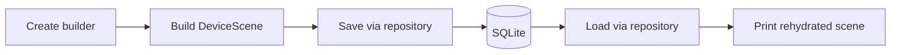

# Lecture 14 Companion Demos

This folder contains the companion demos for **Lecture 14: Repository and Builder Patterns**.

Both demos implement the same smart-home **Device Scenes** example:

- build a valid `DeviceScene`
- persist it through a repository abstraction
- reload it from SQLite
- print the rehydrated scene definition

The two implementations are intentionally parallel:

- [C# demo](./csharp-smart-home-scenes/README.md)
- [Java demo](./java-smart-home-scenes/README.md)

## What These Demos Teach

The demos isolate two design concerns:

- `Builder` controls complex object construction
- `Repository` hides SQLite behind a persistence boundary

This folder deliberately does **not** teach:

- scene execution behavior
- `Command`
- `Composite`

Those patterns are reserved for lecture 15.

## Shared Domain

Both implementations use the same vocabulary:

- `DeviceScene`
- `SceneAction`
- `SceneTarget`
- `SpecificDeviceTarget`
- `DeviceGroupTarget`

Both demos build the same example:

- `Evening Arrival`
- turn on a porch light by specific device id
- turn on all `Light` devices in `Living Room`
- set `Living Room` light brightness to `40`

## Shared Flow



## Demo Comparison

| Demo | Stack | Persistence | Run Style |
|---|---|---|---|
| C# | .NET 10 console app | `Microsoft.Data.Sqlite` | `dotnet run` or Docker |
| Java | Java 17 Maven console app | `sqlite-jdbc` | `mvn package` + `java -jar` or Docker |

## Quick Start

### C#

```bash
cd presentations/14-repository-and-builder-pattern-demos/csharp-smart-home-scenes
dotnet run
```

### Java

```bash
cd presentations/14-repository-and-builder-pattern-demos/java-smart-home-scenes
mvn -q -DskipTests package
java -jar target/lecture14-java-scenes.jar
```

## Docker

Each demo ships with its own `Dockerfile` and its own detailed README. Use the language-specific folders for exact commands and volume-mount examples.
