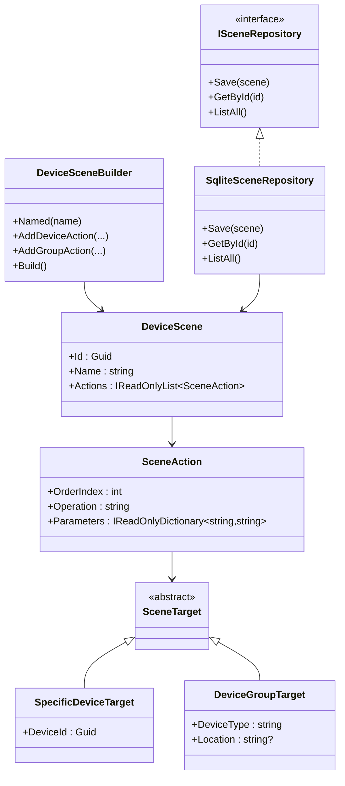
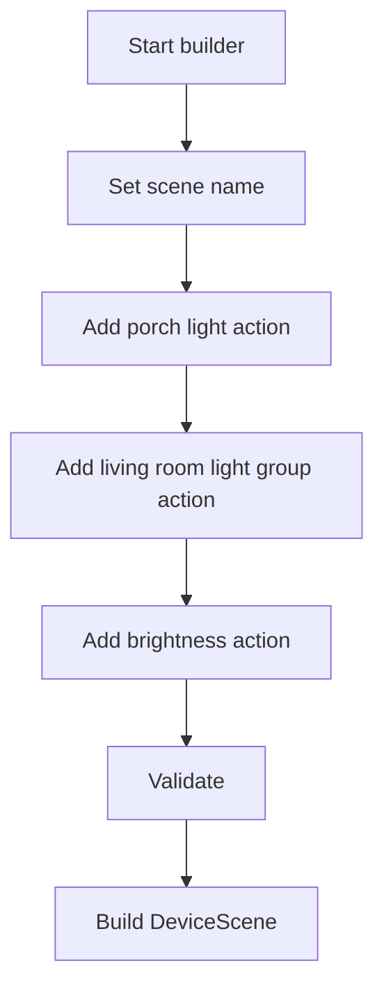
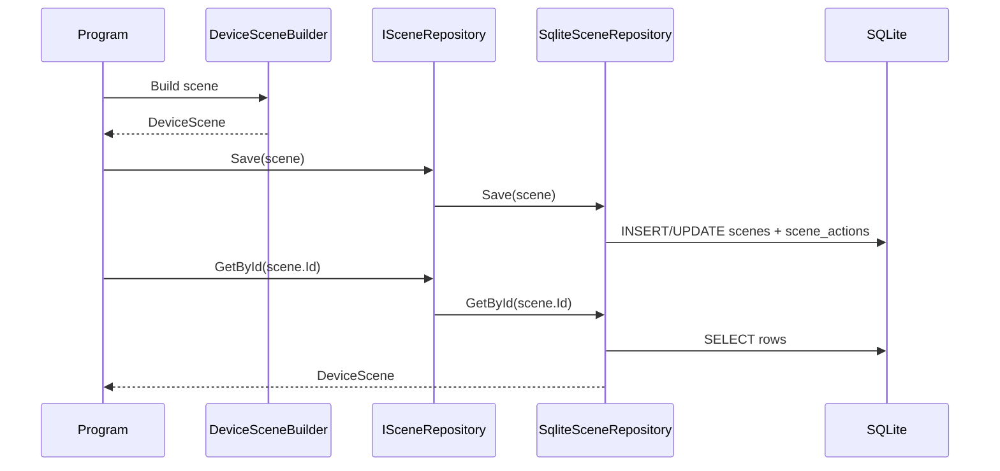
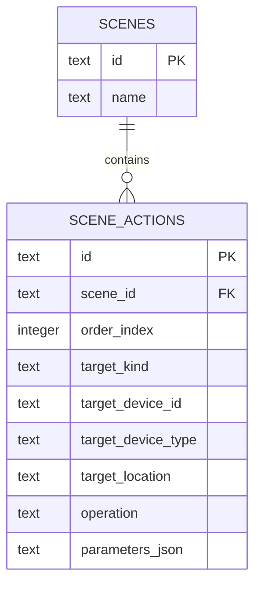

# C# Smart Home Device Scenes Demo

This demo is the C# companion for **Lecture 14: Repository and Builder Patterns**.

It demonstrates two separate design responsibilities in the same use case:

- `Builder` constructs a valid `DeviceScene`
- `Repository` persists and reloads that scene definition from SQLite

The domain matches the course project vocabulary:

- named scenes
- ordered scene actions
- specific-device targets
- group targets by device type and location

This demo intentionally stops at **scene definition construction and persistence**. It does **not** implement scene execution behavior, `Command`, or `Composite`.

## What the Demo Does

The program:

1. shows that the builder rejects an incomplete scene
2. builds an `Evening Arrival` scene
3. saves the scene through `ISceneRepository`
4. loads the scene back from SQLite
5. lists all persisted scenes

## Architecture



## Builder Flow



## Save / Load Sequence



## SQLite Schema



## How It Works

The builder is responsible for:

- requiring a scene name
- ensuring at least one action exists
- assigning action order when actions are added
- returning a finished `DeviceScene`

The repository is responsible for:

- creating the SQLite schema if needed
- storing the scene row and ordered action rows
- rehydrating a `DeviceScene` from the database

SQLite stays behind the repository boundary. The rest of the demo works with domain objects, not SQL rows.

## File Overview

- `Program.cs` program entrypoint and console output
- `Domain/` scene types and targets
- `Builder/` canonical builder interface plus fluent builder and director
- `Repository/` repository abstraction, SQLite implementation, and schema bootstrap
- `SmartHomeScenes.csproj` project file
- `Dockerfile` container build and run definition

## Run Locally

From this directory:

```bash
cd presentations/14-repository-and-builder-pattern-demos/csharp-smart-home-scenes
dotnet run
```

To store the database in a custom location:

```bash
cd presentations/14-repository-and-builder-pattern-demos/csharp-smart-home-scenes
SCENE_DB_PATH=./data/smart-home-scenes.db dotnet run
```

## Build and Run with Docker

From this directory:

```bash
cd presentations/14-repository-and-builder-pattern-demos/csharp-smart-home-scenes
docker build -t lecture14-csharp-scenes .
docker run --rm -v "$(pwd)/data:/data" lecture14-csharp-scenes
```

The mounted `data/` folder lets the SQLite database survive container recreation.

## Expected Output

```text
SMART HOME DEVICE SCENES DEMO (C#)
----------------------------------
1. Verifying that the builder rejects incomplete scenes...
   Expected validation error: Cannot build a DeviceScene without at least one action.

2. Building the Evening Arrival scene...
   Scene: Evening Arrival
   ...

4. Loading the scene back from SQLite...
   Scene: Evening Arrival
   ...
```
