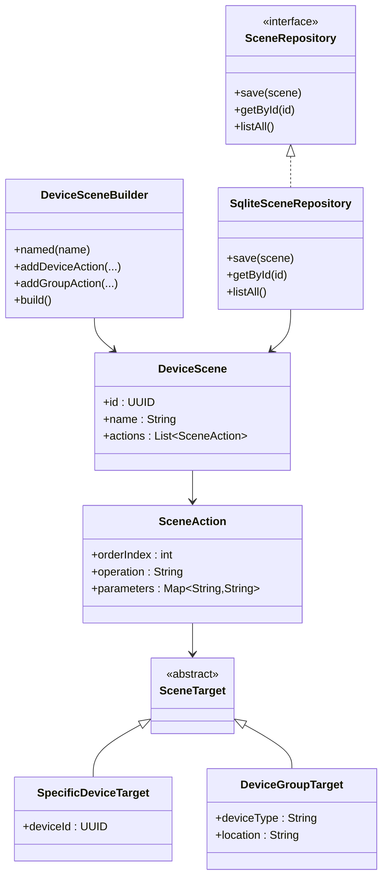
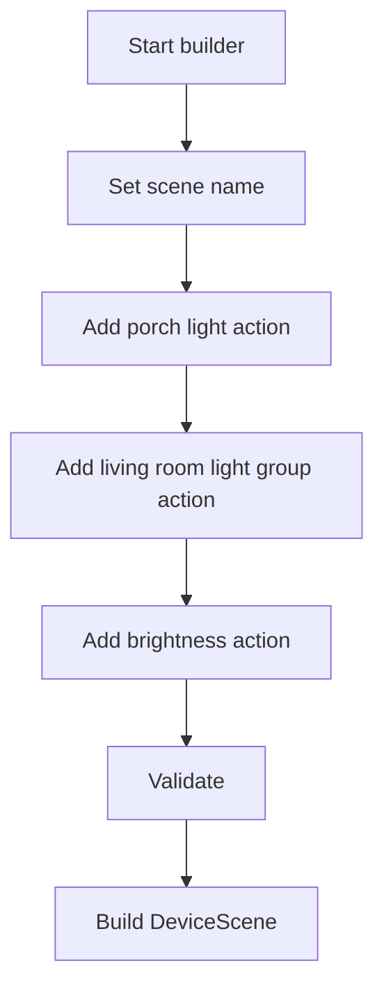
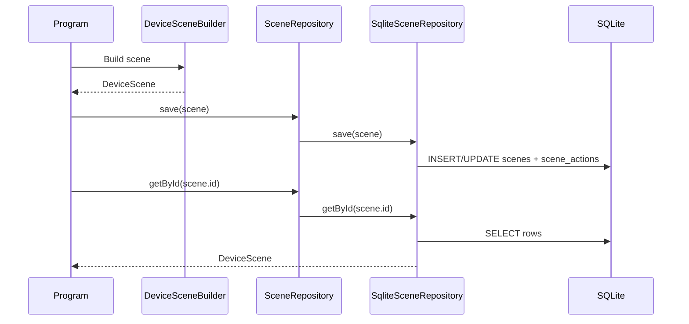
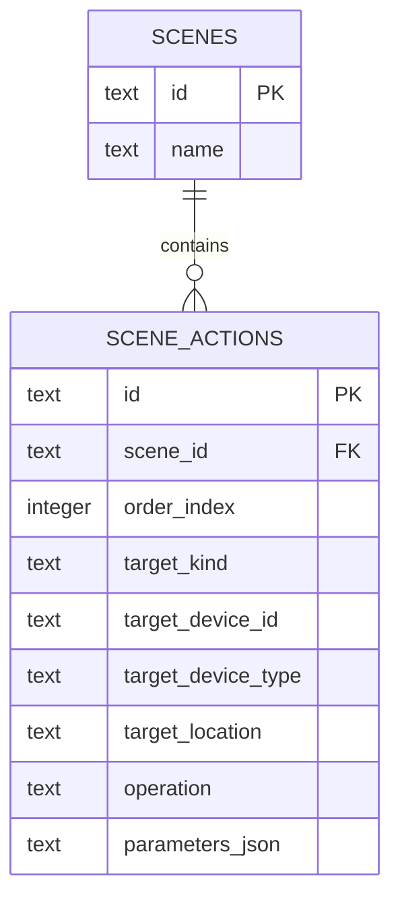

# Java Smart Home Device Scenes Demo

This demo is the Java companion for **Lecture 14: Repository and Builder Patterns**.

It mirrors the C# demo with the same domain language and the same console flow:

- build a valid `DeviceScene`
- save it through a repository abstraction
- reload it from SQLite
- print the rehydrated scene definition

This demo intentionally stays focused on **scene definition construction and persistence**. It does not implement execution behavior or cover `Command` / `Composite`.

## What the Demo Does

The program:

1. shows that the builder rejects an incomplete scene
2. builds an `Evening Arrival` scene
3. saves the scene through `SceneRepository`
4. loads the scene back from SQLite
5. lists all persisted scenes

## Architecture



## Builder Flow



## Save / Load Sequence



## SQLite Schema



## How It Works

The builder is responsible for:

- requiring a scene name
- ensuring at least one action exists
- preserving action order
- returning a finished `DeviceScene`

The repository is responsible for:

- creating the SQLite schema if needed
- storing the scene row and ordered action rows
- loading rows and rehydrating them into a `DeviceScene`

SQLite remains behind the repository boundary. Higher-level code asks for domain objects, not SQL rows.

## File Overview

- `src/main/java/.../Program.java` program entrypoint and console output
- `domain/` scene types and targets
- `builder/` canonical builder interface plus fluent builder and director
- `repository/` repository abstraction, SQLite implementation, schema bootstrap, and parameter serialization
- `pom.xml` Maven build
- `Dockerfile` container build and run definition

## Run Locally

From this directory:

```bash
cd presentations/14-repository-and-builder-pattern-demos/java-smart-home-scenes
mvn -q -DskipTests package
java -jar target/lecture14-java-scenes.jar
```

To store the database in a custom location:

```bash
cd presentations/14-repository-and-builder-pattern-demos/java-smart-home-scenes
mvn -q -DskipTests package
SCENE_DB_PATH=./data/smart-home-scenes.db java -jar target/lecture14-java-scenes.jar
```

## Build and Run with Docker

From this directory:

```bash
cd presentations/14-repository-and-builder-pattern-demos/java-smart-home-scenes
docker build -t lecture14-java-scenes .
docker run --rm -v "$(pwd)/data:/data" lecture14-java-scenes
```

The mounted `data/` folder lets the SQLite database survive container recreation.

## Expected Output

```text
SMART HOME DEVICE SCENES DEMO (JAVA)
------------------------------------
1. Verifying that the builder rejects incomplete scenes...
   Expected validation error: Cannot build a DeviceScene without at least one action.

2. Building the Evening Arrival scene...
   Scene: Evening Arrival
   ...

4. Loading the scene back from SQLite...
   Scene: Evening Arrival
   ...
```
