# Repository and Builder Patterns

### Building and Persisting Smart Home Device Scenes Without Tangling Construction and Storage

##### [Powerpoint Presentation](14-repository-and-builder-patterns.pptx) | [PDF](14-repository-and-builder-patterns.pdf)

---

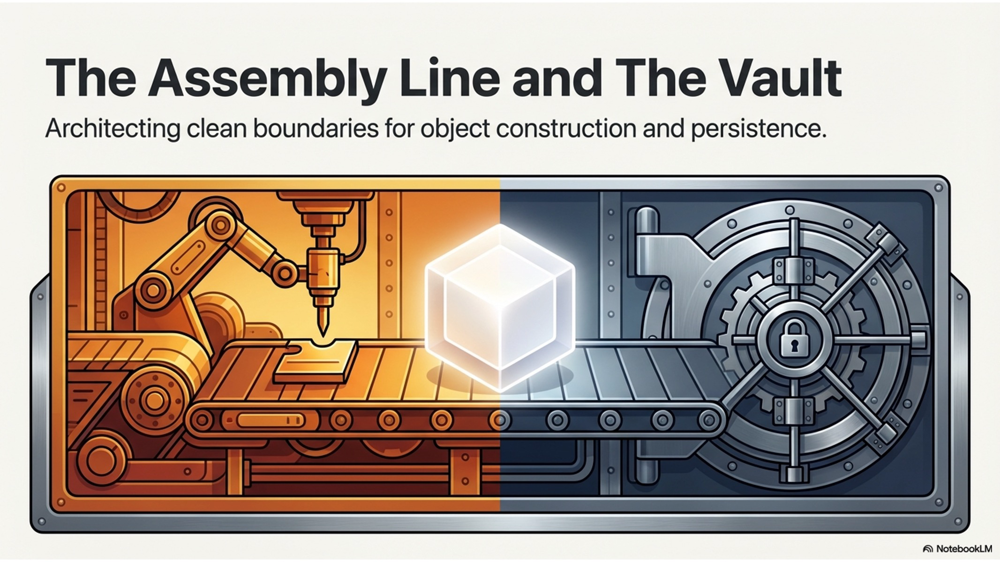

This lecture continues the smart-home thread introduced in the [semester project](../project/README.md) and uses the **Device Scenes** feature as a running example.

A scene is a named preset that stores an ordered list of device actions. A user might define:

- `Evening Arrival`
- `Movie Mode`
- `Lock Down`

Each scene is a definition, not an ad-hoc blob of UI input. It must be:

- constructed correctly
- stored durably
- loaded back faithfully

Those map to two different design problems: **construction** and **persistence**.

Lecture 14 answers:

> how do we construct a valid complex object cleanly, and how do we persist that object without letting SQL leak into the rest of the design?

The two patterns for today are:

- `Builder` for object construction
- `Repository` for persistence boundaries

This lecture intentionally does **not** teach `Command` or `Composite`. Those patterns are important to the full Device Scenes project feature, but they are deferred to Lecture 15. Here, we focus only on scene definition construction and scene definition persistence.

By the end of this lecture, students should be able to:

- explain when the Builder pattern is warranted
- distinguish canonical GoF Builder from pragmatic fluent builders
- explain what a Repository is and what problem it solves
- design a SQLite-backed repository without leaking SQL details into higher-level code
- model a scene definition as a clean domain object that can be built, saved, and reloaded

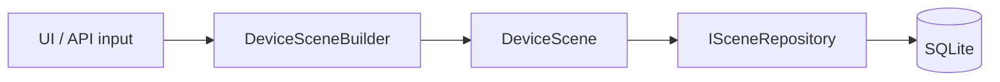
```mermaid
flowchart LR
    UI["UI / API input"] --> B[DeviceSceneBuilder]
    B --> S[DeviceScene]
    S --> R[ISceneRepository]
    R --> DB[(SQLite)]
```

---
## Table of Contents

- [1. The Problem: Complex Construction and Persistent Scene Definitions](#1-the-problem-complex-construction-and-persistent-scene-definitions)
- [2. The Builder Pattern](#2-the-builder-pattern)
- [3. Implementation Walkthrough: Building a Device Scene](#3-implementation-walkthrough-building-a-device-scene)
- [4. The Repository Pattern](#4-the-repository-pattern)
- [5. Implementation Walkthrough: SQLite Scene Repository](#5-implementation-walkthrough-sqlite-scene-repository)
- [6. Unified End-to-End Flow](#6-unified-end-to-end-flow)
- [7. Anti-Patterns and Failure Modes](#7-anti-patterns-and-failure-modes)
- [8. Relationship to Other Patterns](#8-relationship-to-other-patterns)
- [9. Real-World Summary](#9-real-world-summary)
- [Study Guide](#study-guide)
- [Appendix 1: SQLite Schema and Mapping Notes](#appendix-1-sqlite-schema-and-mapping-notes)
- [Appendix 2: Builder vs Factory and Object Initializers](#appendix-2-builder-vs-factory-and-object-initializers)
- [Appendix 3: Repository vs Unit of Work](#appendix-3-repository-vs-unit-of-work)
- [Appendix 4: Where Lecture 15 Extends This Example](#appendix-4-where-lecture-15-extends-this-example)

---
## 1. The Problem: Complex Construction and Persistent Scene Definitions

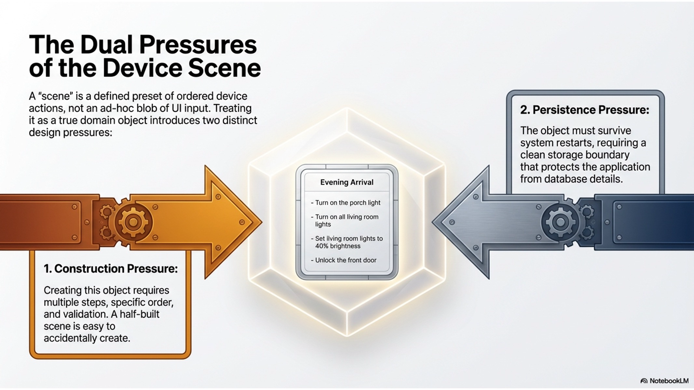

### Motivating Scenario

The [smart-home project](../project/README.md) allows the user to define named scenes. Consider:

- `Evening Arrival`
- turn on the porch light
- turn on all living room lights
- set living room lights to 40% brightness
- unlock the front door

Even in this trimmed-down example, a scene contains:

- a unique id
- a name
- an ordered list of actions
- action parameters
- multiple target types

That creates two separate design pressures:

1. **Construction pressure**: a half-built scene is easy to create accidentally.
2. **Persistence pressure**: the scene must survive restart, so the design needs a clean storage boundary.

### The Naive Construction Approach

The first mistake is usually to create a mutable object and fill in pieces wherever convenient:

```csharp
var scene = new DeviceScene();
scene.Name = "Evening Arrival";
scene.Actions.Add(new SceneAction(...));
scene.Actions.Add(new SceneAction(...));
// maybe more edits later...
```

This creates familiar problems:

- partially initialized objects escape
- required fields are easy to forget
- action ordering is implicit and fragile
- validation gets scattered across callers

### The Naive Persistence Approach

The second mistake is to mix SQL directly into higher-level orchestration:

```csharp
public void SaveScene(DeviceScene scene)
{
    using var connection = new SqliteConnection(_connectionString);
    connection.Open();

    // insert scene
    // insert actions
    // map parameters
    // handle ordering
}
```

This also has predictable problems:

- application logic becomes coupled to your persistence mechanism
- tests become harder to isolate
- storage concerns spread to services and controllers
- changing persistence details means editing many places

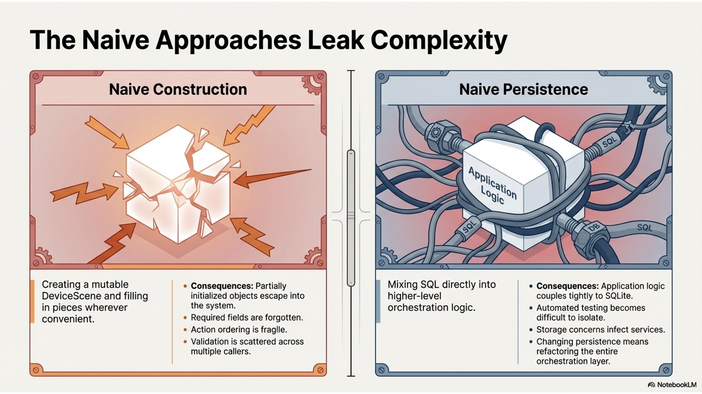

### The Design Goal

We want one pattern for each problem:

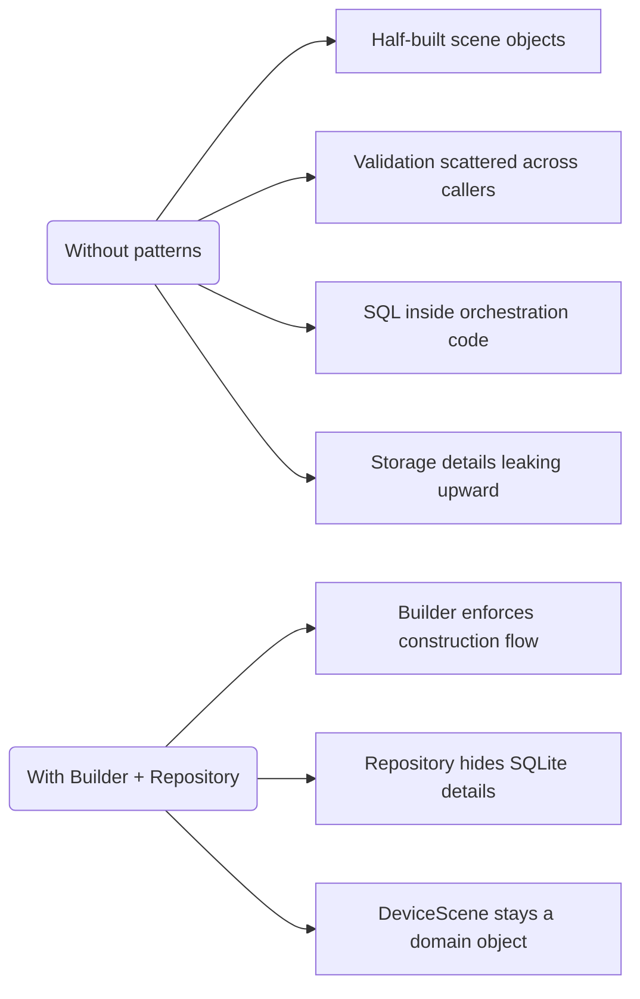
```mermaid
flowchart LR
    BAD("Without patterns") --> A[Half-built scene objects]
    BAD --> B[Validation scattered across callers]
    BAD --> C[SQL inside orchestration code]
    BAD --> D[Storage details leaking upward]

    GOOD("With Builder + Repository") --> E[Builder enforces construction flow]
    GOOD --> F[Repository hides SQLite details]
    GOOD --> G[DeviceScene stays a domain object]
```

### The Boundary We Care About

Lecture 14 is about the line between:

- constructing a scene definition
- storing and reloading a scene definition

It is **not** about how scenes execute across devices. That comes later.

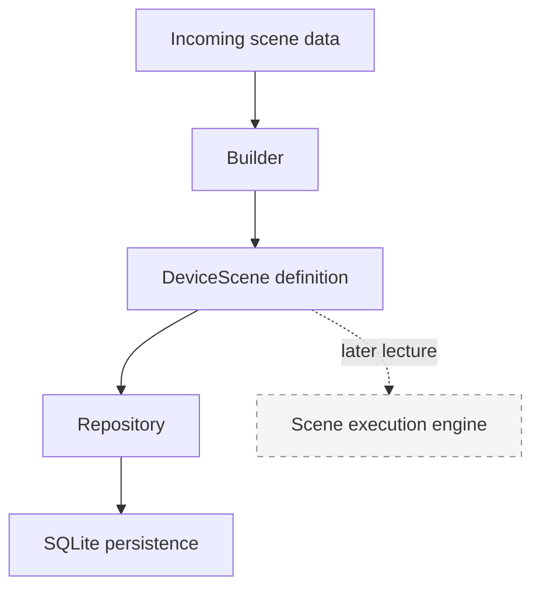
```mermaid
flowchart TB
    INPUT["Incoming scene data"] --> BUILDER["Builder"]
    BUILDER --> SCENE["DeviceScene definition"]
    SCENE --> REPO["Repository"]
    REPO --> SQLITE["SQLite persistence"]

    EXEC["Scene execution engine"]:::future

    SCENE -. later lecture .-> EXEC

    classDef future fill:#f5f5f5,stroke:#888,stroke-dasharray: 5 5;
```

---
## 2. The Builder Pattern

### What It Is

The Builder pattern is a **creational design pattern** (GoF, 1994) used when object construction:

- has multiple required steps
- has optional parts
- must occur in a controlled order
- should not expose a partially complete product

The core idea:

> Separate the process of constructing a complex object from the finished object itself.

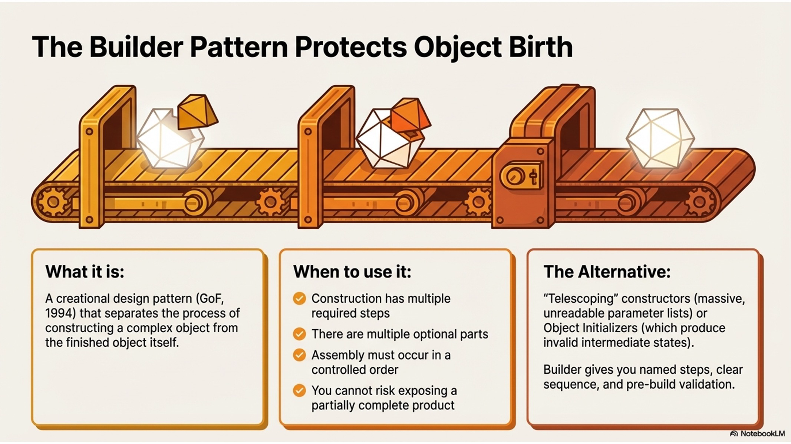

### Canonical GoF Builder Roles

The classical pattern has four roles:

1. **Product**: the object being built
2. **Builder interface**: defines construction steps
3. **Concrete builder**: implements those steps
4. **Director**: drives the construction sequence

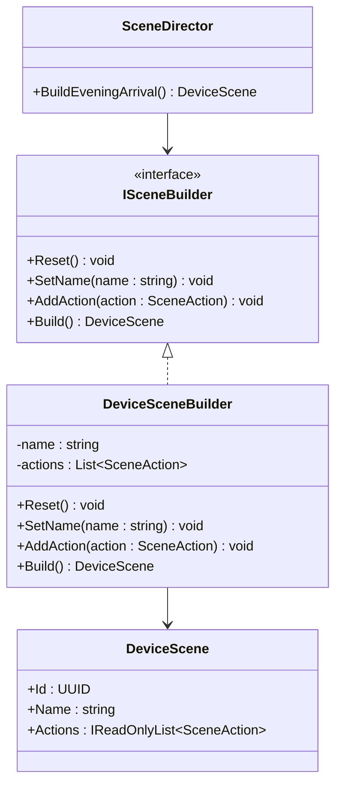
```mermaid
classDiagram
    class DeviceScene {
        +Id : UUID
        +Name : string
        +Actions : IReadOnlyList~SceneAction~
    }

    class ISceneBuilder {
        <<interface>>
        +Reset() void
        +SetName(name : string) void
        +AddAction(action : SceneAction) void
        +Build() DeviceScene
    }

    class DeviceSceneBuilder {
        -name : string
        -actions : List~SceneAction~
        +Reset() void
        +SetName(name : string) void
        +AddAction(action : SceneAction) void
        +Build() DeviceScene
    }

    class SceneDirector {
        +BuildEveningArrival() DeviceScene
    }

    ISceneBuilder <|.. DeviceSceneBuilder
    SceneDirector --> ISceneBuilder
    DeviceSceneBuilder --> DeviceScene
```

### Why Builder Exists

Builder is not for every object. It is a response to a particular kind of construction pain:

- constructors become long and positional
- object initializers produce invalid intermediate states
- required and optional inputs get mixed together
- callers repeat the same setup ritual over and over

### Builder vs Telescoping Constructors

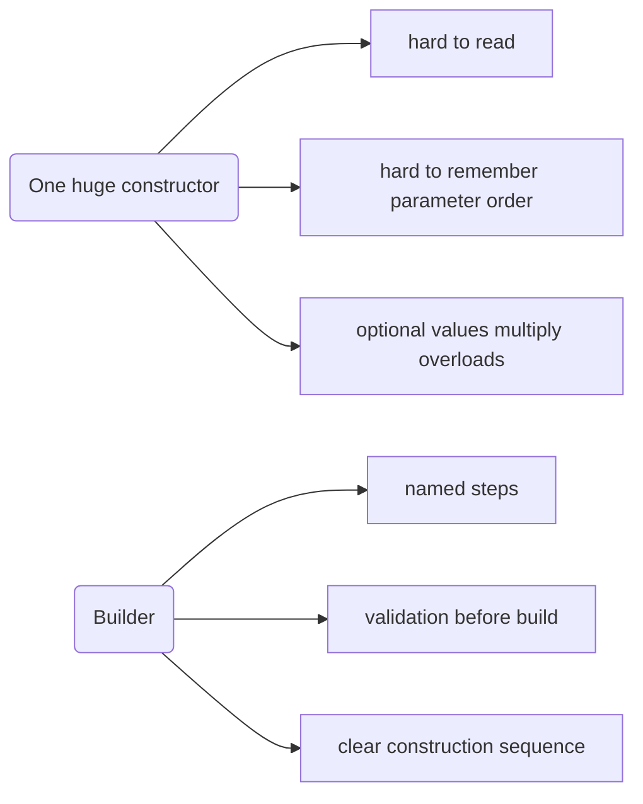
```mermaid
flowchart LR
    A("One huge constructor") --> B[hard to read]
    A --> C[hard to remember parameter order]
    A --> D[optional values multiply overloads]

    E("Builder") --> F[named steps]
    E --> G[validation before build]
    E --> H[clear construction sequence]
```

### Canonical Builder vs Pragmatic Fluent Builder

In production code, you will often see a more pragmatic fluent builder:

- method names are chainable
- the builder itself acts as the main orchestration surface
- a separate Director may exist only when there are reusable recipes

For this lecture:

- we teach the **canonical** version first so the roles are clear
- then we use a **fluent builder** for the actual running example

### A Director Is Optional in Practice

The `SceneDirector` is useful when the system has reusable canned configurations such as:

- `BuildMovieMode`
- `BuildLockDown`
- `BuildEveningArrival`

But many real codebases simply call the fluent builder directly.

That is not a betrayal of the pattern. It is a pragmatic simplification.

### A Note on Builder Reuse

The canonical GoF builder interface includes `Reset()` to allow the same builder instance to produce multiple products. In practice, fluent builders are typically single-use: you create one, call `Build()`, and discard it. If you need another product, create a new builder instance. The running example in this lecture follows that single-use convention.

### How Builder Relates to SOLID and Deep Modules

**SRP — Single Responsibility Principle.** Without Builder, construction logic scatters across every caller that creates a `DeviceScene`. Each caller repeats the same setup ritual, mixes validation with assembly, and becomes responsible for producing a valid object. The builder centralizes that responsibility: callers say *what* they want, the builder is responsible for *how* to assemble it correctly.

**OCP — Open/Closed Principle.** New construction scenarios (a new target type, a new optional parameter) can often be handled by adding a method to the builder without modifying the existing construction steps or the callers that use them. The builder absorbs construction variation so that existing call sites remain stable.

**LSP — Liskov Substitution Principle.** When the canonical GoF form uses an `ISceneBuilder` interface, any concrete builder can be substituted without breaking the director or calling code. The contract is the sequence of construction steps, not the implementation behind them.

**ISP — Interface Segregation Principle.** The builder exposes only construction operations to its callers. It does not expose persistence, execution, or internal state management. Callers see a focused surface: `Named(...)`, `AddDeviceAction(...)`, `AddGroupAction(...)`, `Build()`. Nothing else leaks through.

**DIP — Dependency Inversion Principle.** When a director or service depends on `ISceneBuilder` rather than `DeviceSceneBuilder`, higher-level code is decoupled from the concrete construction mechanism. This is more visible in the canonical GoF form than in a simple fluent builder, but the principle still applies: the abstraction defines the contract, not the implementation.

**Ousterhout's deep modules.** A well-designed builder is a deep module. Its interface is small — a handful of named methods — but it absorbs meaningful complexity underneath: ordering logic, step-level validation, cross-field invariant checks, and the final assembly of an immutable product. Callers get a simple surface that hides construction depth, which is exactly the deep module ideal.

---
## 3. Implementation Walkthrough: Building a Device Scene

### The Product

The scene definition itself is the product:

- `DeviceScene`
- `SceneAction`
- `SceneTarget`

This lecture uses two target types:

- `SpecificDeviceTarget`
- `DeviceGroupTarget`

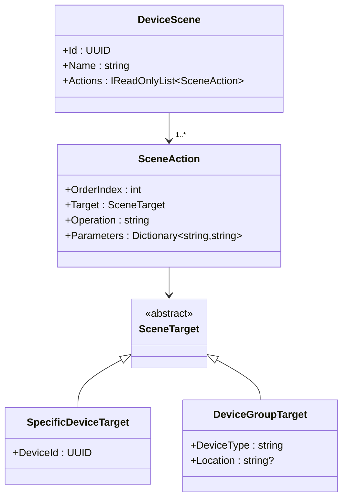
```mermaid
classDiagram
    class DeviceScene {
        +Id : UUID
        +Name : string
        +Actions : IReadOnlyList~SceneAction~
    }

    class SceneAction {
        +OrderIndex : int
        +Target : SceneTarget
        +Operation : string
        +Parameters : Dictionary~string,string~
    }

    class SceneTarget {
        <<abstract>>
    }

    class SpecificDeviceTarget {
        +DeviceId : UUID
    }

    class DeviceGroupTarget {
        +DeviceType : string
        +Location : string?
    }

    SceneTarget <|-- SpecificDeviceTarget
    SceneTarget <|-- DeviceGroupTarget
    DeviceScene --> "1..*" SceneAction
    SceneAction --> SceneTarget
```

### Why the Scene Is a Good Builder Example

A valid scene definition requires:

- a non-empty name
- at least one action
- actions stored in a stable order
- enough action data to be meaningful

That makes a scene a better Builder example than a trivial DTO.

### Fluent Builder Flow

The **fluent builder pattern** is a variation of the Builder pattern where object construction is expressed as a **chain of readable method calls**. Each builder step returns the builder itself, so object construction can be written as a readable chain of calls. It is called **fluent** because the API is designed to read almost like a sentence, with one call flowing into the next.

For example:

```
var report = new ReportBuilder()
    .WithTitle("Q1 Results")
    .WithAuthor("Jeff")
    .AddSection("Revenue")
    .AddSection("Customer Retention")
    .Build();
```

The variation from the original GoF builder pattern is returning the builder mechanism from every builder step.

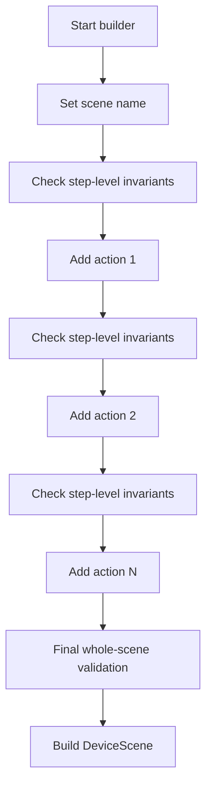
```mermaid
flowchart TB
    A[Start builder] --> B[Set scene name]
    B --> C[Check step-level invariants]
    C --> D[Add action 1]
    D --> E[Check step-level invariants]
    E --> F[Add action 2]
    F --> G[Check step-level invariants]
    G --> H[Add action N]
    H --> I[Final whole-scene validation]
    I --> J[Build DeviceScene]
```

### Running Example: `Evening Arrival`

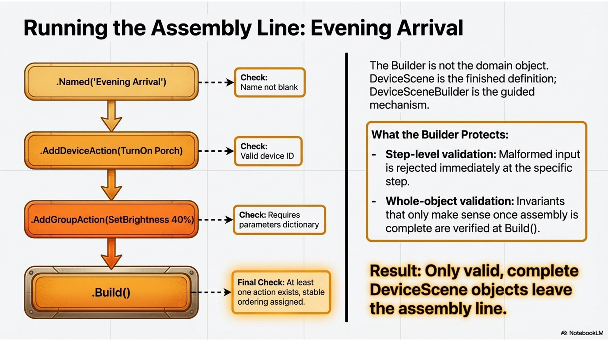

We will construct:

- scene name: `Evening Arrival`
- action 1: turn on porch light by specific device id
- action 2: turn on all lights in `Living Room`
- action 3: set brightness to `40` for all lights in `Living Room`
- action 4: unlock the front door by specific device id

This example is useful because it includes:

- a specific device target
- a group target
- parameterized actions
- meaningful action order

### Example Fluent Builder

```
using System;
using System.Collections.Generic;

public static class Program
{
    public static void Main()
    {
        var porchLightId = "device-101";
        var frontDoorLockId = "device-202";

        var scene = new DeviceSceneBuilder()
            .Named("Evening Arrival")
            .AddDeviceAction(
                deviceId: porchLightId,
                operation: "TurnOn")
            .AddGroupAction(
                deviceType: "Light",
                location: "Living Room",
                operation: "TurnOn")
            .AddGroupAction(
                deviceType: "Light",
                location: "Living Room",
                operation: "SetBrightness",
                parameters: new Dictionary<string, string> { ["brightness"] = "40" })
            .AddDeviceAction(
                deviceId: frontDoorLockId,
                operation: "Unlock")
            .Build();

        Console.WriteLine($"{scene.Name} has {scene.Actions.Count} actions.");
    }
}

public sealed class DeviceScene
{
    public string Name { get; }
    public IReadOnlyList<SceneAction> Actions { get; }

    public DeviceScene(string name, List<SceneAction> actions)
    {
        Name = name;
        Actions = actions.AsReadOnly();
    }
}

public sealed class SceneAction
{
    public string? DeviceId { get; init; }
    public string? DeviceType { get; init; }
    public string? Location { get; init; }
    public required string Operation { get; init; }
    public Dictionary<string, string> Parameters { get; init; } = new();
}

public sealed class DeviceSceneBuilder
{
    private string _name = "Unnamed Scene";
    private readonly List<SceneAction> _actions = new();

    public DeviceSceneBuilder Named(string name)
    {
        _name = name;
        return this;
    }

    public DeviceSceneBuilder AddDeviceAction(
        string deviceId,
        string operation,
        Dictionary<string, string>? parameters = null)
    {
        _actions.Add(new SceneAction
        {
            DeviceId = deviceId,
            Operation = operation,
            Parameters = parameters ?? new Dictionary<string, string>()
        });

        return this;
    }

    public DeviceSceneBuilder AddGroupAction(
        string deviceType,
        string location,
        string operation,
        Dictionary<string, string>? parameters = null)
    {
        _actions.Add(new SceneAction
        {
            DeviceType = deviceType,
            Location = location,
            Operation = operation,
            Parameters = parameters ?? new Dictionary<string, string>()
        });

        return this;
    }

    public DeviceScene Build()
    {
        return new DeviceScene(_name, new List<SceneAction>(_actions));
    }
}
```

The fluent API style — method chaining that reads like a sentence — appears in many libraries beyond builders. For example, the FluentValidation C# package uses it for building validation rules:

```
public sealed class SceneActionValidator : AbstractValidator<SceneAction>
{
    public SceneActionValidator()
    {
        RuleFor(x => x.Operation)
            .NotEmpty();

        RuleFor(x => x)
            .Must(x => x.IsDeviceAction ^ x.IsGroupAction)
            .WithMessage("Each action must be either a device action or a group action, but not both.");

        When(x => x.IsDeviceAction, () =>
        {
            RuleFor(x => x.DeviceId).NotEmpty();
            RuleFor(x => x.DeviceType).Empty();
            RuleFor(x => x.Location).Empty();
        });

        When(x => x.IsGroupAction, () =>
        {
            RuleFor(x => x.DeviceType).NotEmpty();
            RuleFor(x => x.Location).NotEmpty();
            RuleFor(x => x.DeviceId).Empty();
        });

        When(x => x.Operation == "SetBrightness", () =>
        {
            RuleFor(x => x.Parameters)
                .Must(p => p.ContainsKey("brightness"))
                .WithMessage("SetBrightness requires a 'brightness' parameter.");

            RuleFor(x => x.Parameters["brightness"])
                .Must(v => int.TryParse(v, out var n) && n >= 0 && n <= 100)
                .WithMessage("Brightness must be an integer from 0 to 100.");
        });
    }
}
```

### What the Builder Must Protect

The builder centralizes construction rules:

- name cannot be blank
- action list cannot be empty
- operations requiring parameters must have them
- ordering is assigned when actions are added

Some of that validation happens immediately at each step:

- reject a blank name when the caller sets it
- reject malformed or incomplete action input when the caller adds it

Then `Build()` performs a final whole-object check for invariants that only make sense once the full scene has been assembled.

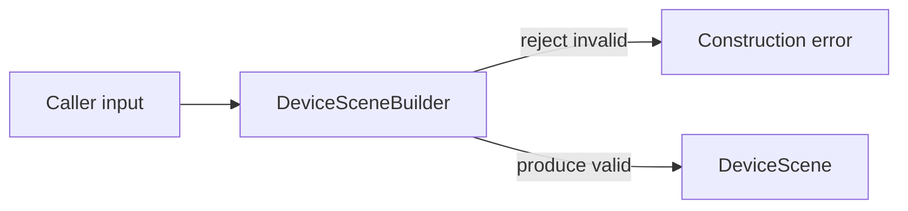
```mermaid
flowchart LR
    INPUT[Caller input] --> BUILDER[DeviceSceneBuilder]
    BUILDER -->|reject invalid| ERR[Construction error]
    BUILDER -->|produce valid| SCENE[DeviceScene]
```

### A Useful Mental Model

The builder is not the domain object.

- `DeviceScene` is the finished definition
- `DeviceSceneBuilder` is the guided construction mechanism

If those two ideas collapse into one mutable bag of setters, the pattern has not helped.

### Sequence Diagram: Build a Scene

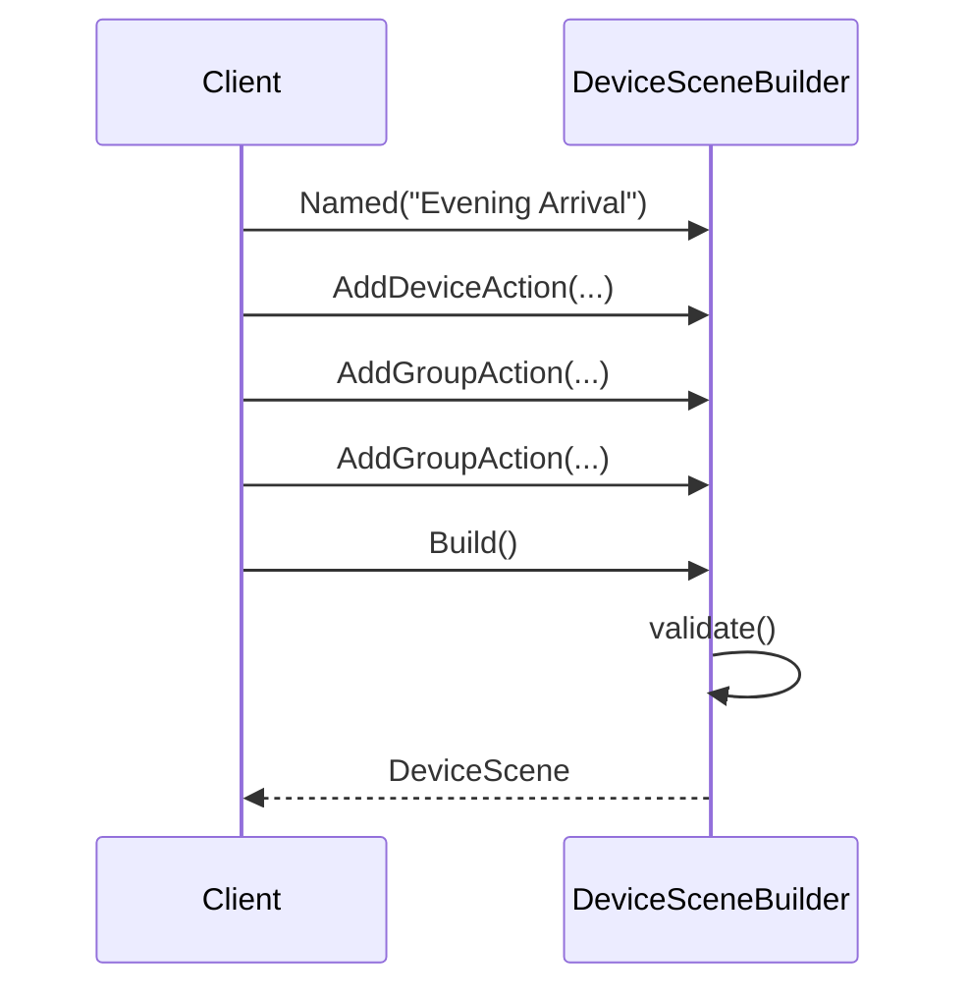
```mermaid
sequenceDiagram
    participant Client
    participant Builder as DeviceSceneBuilder

    Client->>Builder: Named("Evening Arrival")
    Client->>Builder: AddDeviceAction(...)
    Client->>Builder: AddGroupAction(...)
    Client->>Builder: AddGroupAction(...)
    Client->>Builder: Build()
    Builder->>Builder: validate()
    Builder-->>Client: DeviceScene
```

### Client-Server Builder: The Thin Client Hint Approach

In a web application, the builder pattern often spans two layers. A TypeScript client guides the user through scene construction, while a C# server validates the finished scene before persisting it.

This creates a practical tension: the construction rules must be enforced somewhere, but duplicating complex business logic across both layers is fragile and expensive to maintain.

The **thin client hint** approach resolves this by splitting responsibilities:

- **Client**: lightweight UX hints that prevent obviously invalid input
- **Server**: authoritative validation of the complete scene before persistence

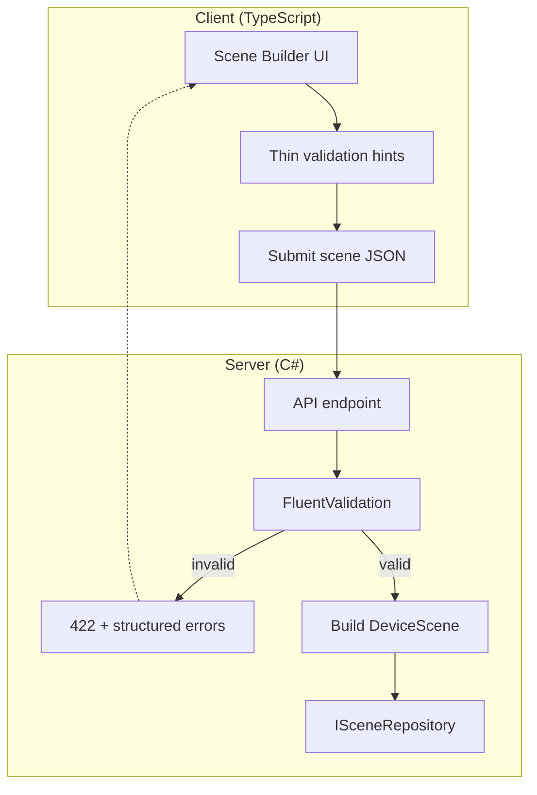
```mermaid
flowchart TB
    subgraph Client ["Client (TypeScript)"]
        UI["Scene Builder UI"] --> HINTS["Thin validation hints"]
        HINTS --> JSON["Submit scene JSON"]
    end

    subgraph Server ["Server (C#)"]
        API["API endpoint"] --> VALIDATE["FluentValidation"]
        VALIDATE -->|invalid| ERR["422 + structured errors"]
        VALIDATE -->|valid| BUILD["Build DeviceScene"]
        BUILD --> REPO["ISceneRepository"]
    end

    JSON --> API
    ERR -.-> UI
```

The key rule:

> The client helps the user avoid mistakes. The server enforces correctness. Only the server is trusted.

#### What the Client Owns

The client builder is a [UX affordance](https://medium.com/theymakedesign/what-is-affordance-in-ux-7429d8646cf8), not a trust boundary. It provides immediate feedback using simple structural checks — the kind that do not require business logic or domain knowledge.

```typescript
interface SceneActionInput {
  deviceId?: string;
  deviceType?: string;
  location?: string;
  operation: string;
  parameters?: Record<string, string>;
}

interface SceneInput {
  name: string;
  actions: SceneActionInput[];
}

function canSubmit(scene: SceneInput): string[] {
  const hints: string[] = [];
  if (!scene.name.trim()) {
    hints.push("Scene name is required.");
  }
  if (scene.actions.length === 0) {
    hints.push("At least one action is required.");
  }
  for (const action of scene.actions) {
    if (!action.operation.trim()) {
      hints.push("Each action must have an operation.");
    }
  }
  return hints;
}
```

These hints are **not** authoritative. They disable a submit button or show inline warnings. They do not duplicate server-side business rules like "SetBrightness requires a brightness parameter between 0 and 100."

#### What the Server Owns

The server is the **single source of truth** for all validation rules. In the following C# / FluentValidation example, the rules are declared once and applied to every incoming scene request.

```csharp
public class SceneActionInputValidator
    : AbstractValidator<SceneActionInput>
{
    public SceneActionInputValidator()
    {
        RuleFor(a => a.Operation)
            .NotEmpty()
            .WithMessage("Operation is required.");

        When(a => a.Operation == "SetBrightness", () =>
        {
            RuleFor(a => a.Parameters)
                .Must(p => p != null
                    && p.ContainsKey("brightness"))
                .WithMessage(
                    "SetBrightness requires a brightness parameter.");
        });

        RuleFor(a => a)
            .Must(a => !string.IsNullOrEmpty(a.DeviceId)
                || (!string.IsNullOrEmpty(a.DeviceType)
                    && !string.IsNullOrEmpty(a.Location)))
            .WithMessage(
                "Each action must target a specific device "
                + "or a device group.");
    }
}

public class CreateSceneRequestValidator
    : AbstractValidator<CreateSceneRequest>
{
    public CreateSceneRequestValidator()
    {
        RuleFor(r => r.Name)
            .NotEmpty()
            .WithMessage("Scene name is required.");

        RuleFor(r => r.Actions)
            .NotEmpty()
            .WithMessage("At least one action is required.");

        RuleForEach(r => r.Actions)
            .SetValidator(new SceneActionInputValidator());
    }
}
```

When validation fails, the server returns structured errors that the client can display next to the relevant fields:

```json
{
  "errors": [
    {
      "field": "Actions[2].Parameters",
      "message": "SetBrightness requires a brightness parameter."
    }
  ]
}
```

#### The Responsibility Split

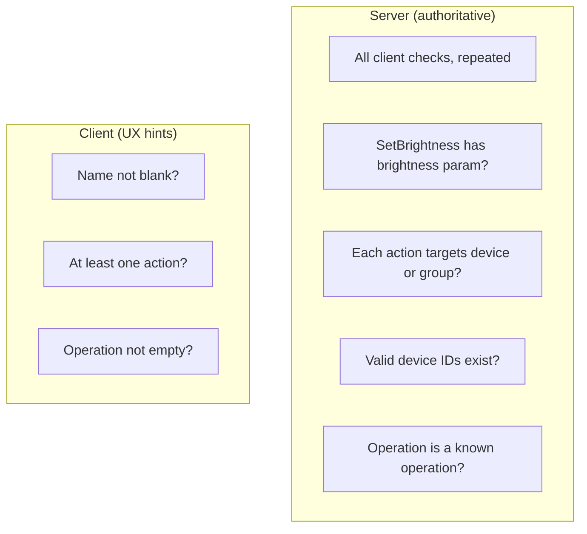
```mermaid
flowchart TB


    subgraph Server ["Server (authoritative)"]
        S1["All client checks, repeated"]
        S2["SetBrightness has brightness param?"]
        S3["Each action targets device or group?"]
        S4["Valid device IDs exist?"]
        S5["Operation is a known operation?"]
    end
    
        subgraph Client ["Client (UX hints)"]
        C1["Name not blank?"]
        C2["At least one action?"]
        C3["Operation not empty?"]
    end
```

The client checks are a **subset** of the server checks. They exist only to improve responsiveness. The server repeats every client check and adds the business rules that require domain knowledge or database access.

> *Never trust data arriving from the client. Always validate what the client submits.*

#### Why Not Duplicate All Rules on the Client?

It is tempting to keep both sides in perfect sync. In practice, that fails because:

- business rules change frequently and the client deployment may lag behind the server
- some rules require data the client does not have (e.g., "does this device ID exist?")
- complex cross-field rules are harder to express and test in two languages
- the client is untrusted — even perfect client validation can be bypassed

The thin client hint approach accepts a small UX tradeoff (some errors only appear after submit) in exchange for a much simpler, more maintainable architecture.

#### The Deeper Lesson

The Builder pattern and server-side validation solve **different problems**:

- the **builder** guides construction — it is a UX and design pattern
- the **validator** enforces trust — it is a security and correctness boundary

They look similar because they share rules. But their purposes are different, and recognizing that distinction prevents teams from treating duplication as inevitable.

### Companion Demos: Builder in Action

The companion demos build the `Evening Arrival` scene using a fluent builder in both C# and Java. Both demos construct the same scene, validate it at build time, and print the finished `DeviceScene`. Run them to see the builder pattern in working code:

- [C# demo](./14-repository-and-builder-pattern-demos/csharp-smart-home-scenes/README.md)
- [Java demo](./14-repository-and-builder-pattern-demos/java-smart-home-scenes/README.md)

---
## 4. The Repository Pattern

### What It Is

The Repository pattern provides a collection-like interface for retrieving and storing domain objects while hiding the persistence mechanism.

The key idea:

> Higher-level code should ask for domain objects, not assemble SQL and row mappings directly.

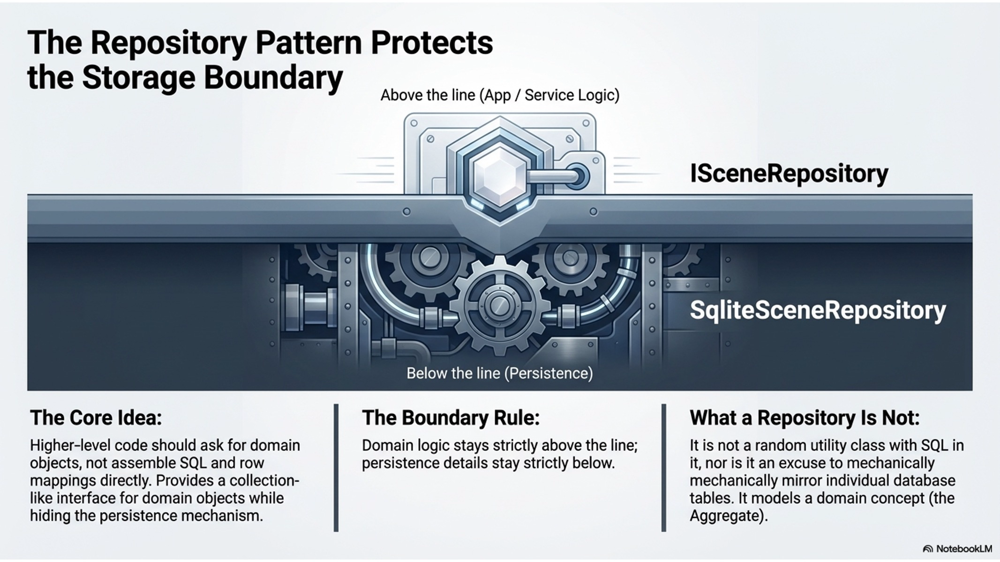

### The Boundary Rule

The repository boundary keeps:

- domain logic above the line
- persistence details below the line

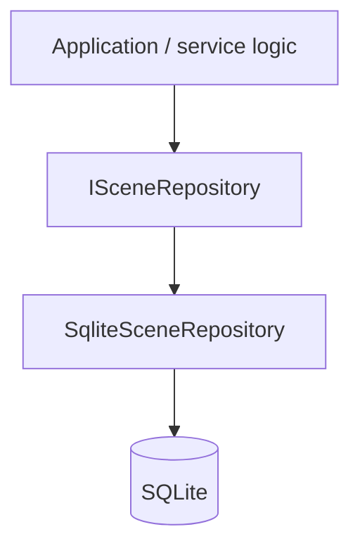
```mermaid
flowchart TB
    APP["Application / service logic"] --> REPO["ISceneRepository"]
    REPO --> SQLREPO["SqliteSceneRepository"]
    SQLREPO --> DB[(SQLite)]
```

### What a Repository Is Not

A repository is **not**:

- the domain object itself
- a random utility class with SQL in it
- an excuse to mirror tables mechanically
- a promise that no SQL exists

The repository exists to protect the rest of the design from persistence detail.

### Why Repository Fits the Scene Example

Scene definitions are:

- persisted across restart
- loaded by id
- listed for display

That maps naturally to a small repository interface:

- `Save(scene)`
- `GetById(id)`
- `ListAll()`

### Repository Is Not "One Per Table"

This is one of the most common misunderstandings of the pattern.

A repository should usually model a meaningful **domain concept** or **aggregate**, not a physical database table.

In this lecture:

- `DeviceScene` is the domain concept
- `scene_action` is a supporting storage detail

That means the right repository shape is:

- `ISceneRepository`

not:

- `IScenesTableRepository`
- `ISceneActionsTableRepository`

Those tables exist to support persistence. They are not the abstraction we want higher-level code to think in.

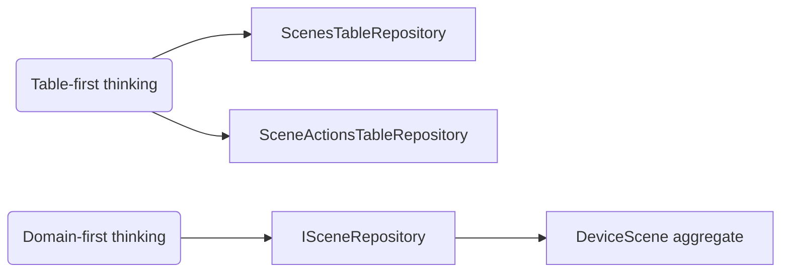
```mermaid
flowchart LR
    BAD("Table-first thinking") --> T1[ScenesTableRepository]
    BAD --> T2[SceneActionsTableRepository]

    GOOD("Domain-first thinking") --> R[ISceneRepository]
    R --> A[DeviceScene aggregate]
```

The practical rule:

> A repository models a meaningful domain boundary, not a table layout.

### Repository Class Diagram

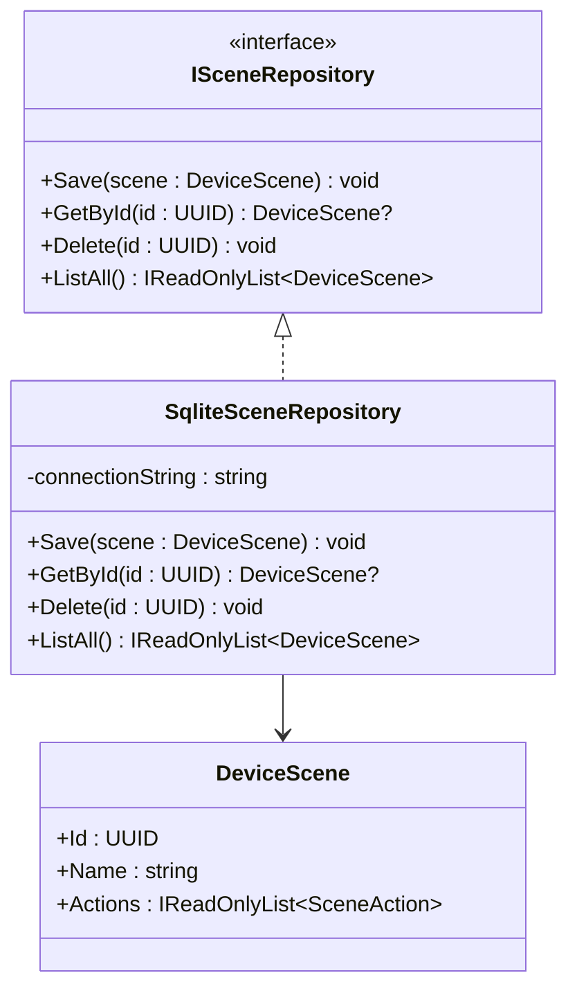
```mermaid
classDiagram
    class DeviceScene {
        +Id : UUID
        +Name : string
        +Actions : IReadOnlyList~SceneAction~
    }

    class ISceneRepository {
        <<interface>>
        +Save(scene : DeviceScene) void
        +GetById(id : UUID) DeviceScene?
        +Delete(id : UUID) void
        +ListAll() IReadOnlyList~DeviceScene~
    }

    class SqliteSceneRepository {
        -connectionString : string
        +Save(scene : DeviceScene) void
        +GetById(id : UUID) DeviceScene?
        +Delete(id : UUID) void
        +ListAll() IReadOnlyList~DeviceScene~
    }

    ISceneRepository <|.. SqliteSceneRepository
    SqliteSceneRepository --> DeviceScene
```

### Why Hide SQLite behind the Repository Pattern?

The rest of the system should not care whether scenes are stored in:

- SQLite
- JSON
- PostgreSQL
- an API

The application should care about scene definitions. The repository takes responsibility for mapping those definitions to storage.

This also makes testing easier: an `InMemorySceneRepository` can replace `SqliteSceneRepository` in unit tests, letting you verify application logic without touching a database.

### Repository as an Abstraction Boundary

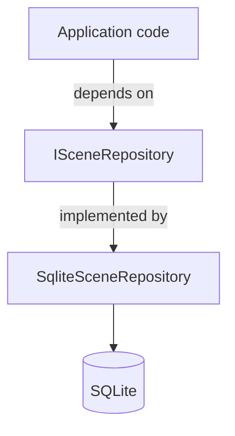
```mermaid
flowchart TB
    SERVICE["Application code"] -->|depends on| ABSTRACTION["ISceneRepository"]
    ABSTRACTION -->|implemented by| SQLITE["SqliteSceneRepository"]
    SQLITE --> DB[(SQLite)]
```

This is a direct application of dependency inversion:

- higher-level code depends on an abstraction
- low-level storage details implement that abstraction

### How Repository Relates to SOLID and Deep Modules

**SRP — Single Responsibility Principle.** The repository has one responsibility: provide a domain-shaped persistence boundary for an aggregate. It does not validate input (the builder or a validator does that), it does not execute scene behavior (that belongs to a different service), and it does not format data for screens (that is a query or presentation concern). When a repository starts absorbing unrelated work — query variation, reporting projections, caching policy — SRP is the signal that those concerns should move elsewhere.

**OCP — Open/Closed Principle.** The `ISceneRepository` interface is stable. When the application needs a new persistence backend — JSON files, PostgreSQL, an API — a new implementation class is added without modifying the interface or any code that depends on it. The abstraction is closed for modification; the set of implementations is open for extension.

**LSP — Liskov Substitution Principle.** Any implementation of `ISceneRepository` must honor the same contract: `Save` persists the full aggregate, `GetById` returns it faithfully or returns null, `Delete` removes it. An `InMemorySceneRepository` used in tests, a `SqliteSceneRepository` used in production, and a hypothetical `ApiSceneRepository` must all be interchangeable without surprising callers. If one implementation silently drops actions or ignores ordering, LSP is violated.

**ISP — Interface Segregation Principle.** The repository interface exposes only aggregate lifecycle operations: `Save`, `GetById`, `Delete`, and `ListAll`. It does not expose SQL, connection management, transaction control, or query-builder internals. Callers depend on a narrow, domain-facing surface. When query-heavy read scenarios emerge, ISP argues for a separate `ISceneQueryService` rather than bloating the repository interface — a point we develop further in the next section.

**DIP — Dependency Inversion Principle.** Application code depends on `ISceneRepository`, not on `SqliteSceneRepository`. The abstraction is owned by the domain layer; the implementation lives in the infrastructure layer. This is the classic DIP inversion: the higher-level module defines the interface, and the lower-level module conforms to it.

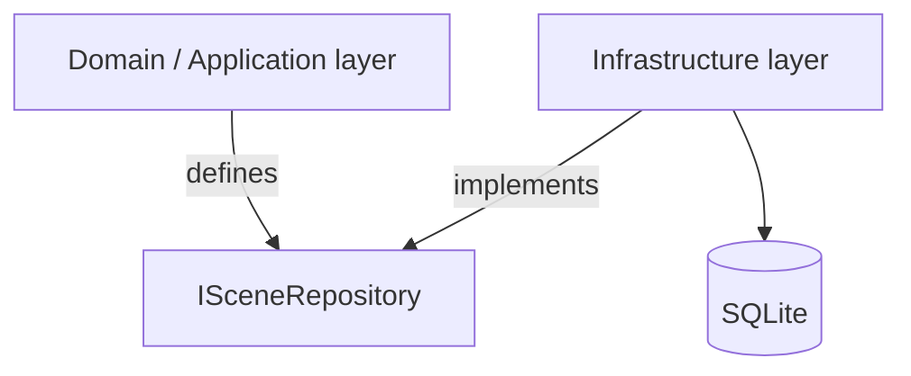
```mermaid
flowchart TB
    DOMAIN["Domain / Application layer"] -->|defines| IFACE["ISceneRepository"]
    INFRA["Infrastructure layer"] -->|implements| IFACE
    INFRA --> DB[(SQLite)]
```

**Ousterhout's deep modules.** The repository is one of the clearest examples of a deep module in everyday application design. Its interface is small — four methods — but behind that surface it manages SQL, joins, row mapping, transaction coordination, target type discrimination, parameter deserialization, and ordering reconstruction. Callers see `Save(scene)` and `GetById(id)`. They never see the choreography underneath. A shallow repository, by contrast, would push mapping details, connection lifecycle, or query fragments upward into the callers — exactly the leakage the pattern exists to prevent.

### Keeping Repositories Small and Deep

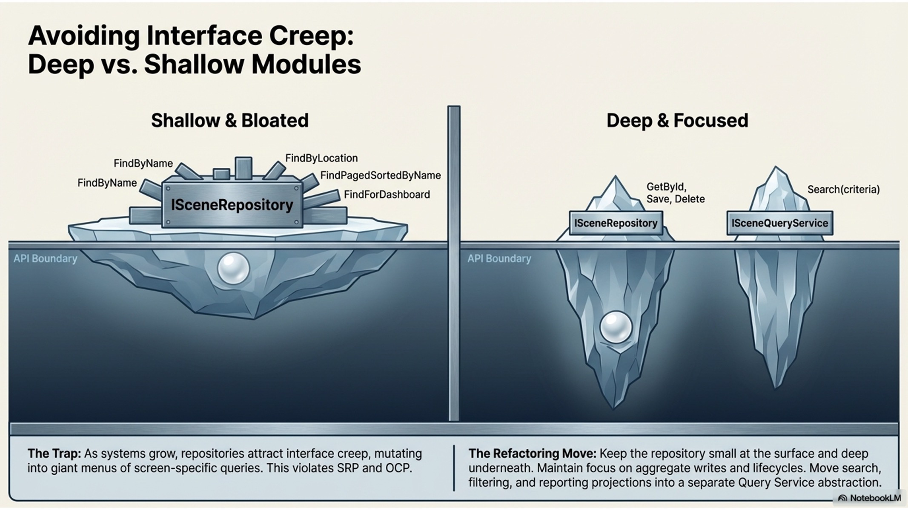

As systems grow, repositories often attract interface creep:

- another `FindBy...` method
- another filtered list
- another screen-specific query
- another reporting projection

This is where the SOLID principles described above start to erode in practice. The three most relevant signals are:

- `SRP` erosion: the repository stops being a persistence boundary and starts becoming a grab bag of query methods
- `OCP` erosion: every new screen or report forces a change to the same repository interface
- **depth erosion** (Ousterhout): the interface grows wide and shallow instead of staying small and deep

The practical goal is:

> keep the repository small at the surface and deep underneath

### Deep Module vs Shallow Module

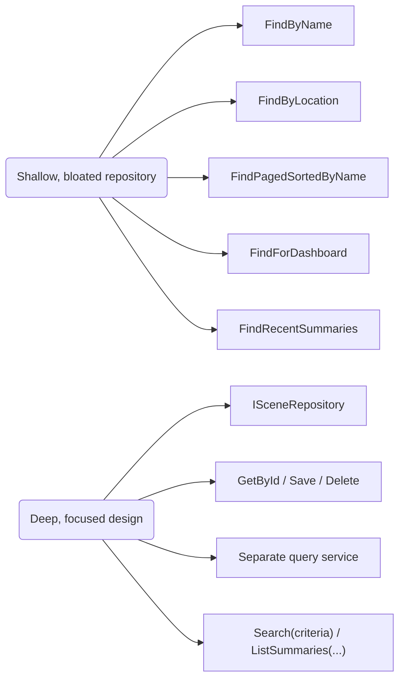
```mermaid
flowchart LR
    BAD("Shallow, bloated repository") --> B1[FindByName]
    BAD --> B2[FindByLocation]
    BAD --> B3[FindPagedSortedByName]
    BAD --> B4[FindForDashboard]
    BAD --> B5[FindRecentSummaries]

    GOOD("Deep, focused design") --> G1[ISceneRepository]
    GOOD --> G2[GetById / Save / Delete]
    GOOD --> G3[Separate query service]
    GOOD --> G4["Search(criteria) / ListSummaries(...)"]
```

On the left, the interface grows every time a caller wants a new read shape.

On the right:

- the repository stays focused on aggregate persistence
- query-heavy read cases move to a separate abstraction

That second design is usually closer to `SRP`, more stable under `OCP`, and much deeper in Ousterhout's sense.

### Before and After Interface Sketch

This is the practical shape of the refactor.

Before:

```csharp
public interface ISceneRepository
{
    DeviceScene? GetById(Guid id);
    void Save(DeviceScene scene);
    IReadOnlyList<DeviceScene> FindByName(string name);
    IReadOnlyList<DeviceScene> FindByLocation(string location);
    IReadOnlyList<SceneSummary> FindForDashboard();
    IReadOnlyList<SceneSummary> FindRecentSummaries();
}
```

After:

```csharp
public interface ISceneRepository
{
    DeviceScene? GetById(Guid id);
    void Save(DeviceScene scene);
    void Delete(Guid id);
}

public interface ISceneQueryService
{
    IReadOnlyList<SceneSummary> Search(SceneSearchCriteria criteria);
}
```

The point is not that these exact names are universal. The point is that:

- aggregate persistence stays in the repository
- query variation moves to a separate abstraction

### Warning Signs of Repository Interface Creep

Be suspicious when:

- the repository keeps gaining `FindBy...` methods
- method names start mirroring screens, reports, or dashboards instead of domain concepts
- the interface returns many different DTO or summary shapes instead of the aggregate
- sorting, filtering, and paging combinations begin to multiply
- adding a new screen means changing the same repository interface again
- the repository starts exposing SQL fragments, ORM query objects, or query-builder details upward

### When to Refactor

Refactor when:

- method count is growing faster than the actual domain model
- one repository is trying to serve both aggregate writes and ad hoc reporting
- query behavior is dominating the interface
- callers need many slight variants of the same read operation

The key smell is this:

> the repository stops looking like a domain boundary and starts looking like a menu of database queries

### Preferred Refactoring Moves

When that happens, the usual next step is **not** to keep adding methods.

Instead:

- keep the repository focused on aggregate lifecycle methods such as `GetById`, `Save`, and maybe `Delete`
- move search, filtering, summary views, and reporting reads into a separate query abstraction
- use a search-criteria or query object when filters vary widely
- let the repository return the aggregate, and let read-model/query services return projections when needed

For the scene example, that often means:

- `ISceneRepository` remains small
- a separate `ISceneQueryService` or `ISceneReadService` handles search-oriented reads

That keeps the write model and the read model from collapsing into one bloated interface.

---
## 5. Implementation Walkthrough: SQLite Scene Repository

### Minimal Schema

We only need to store **scene definitions**.

- one `scene` table
- one `scene_action` table for ordered actions

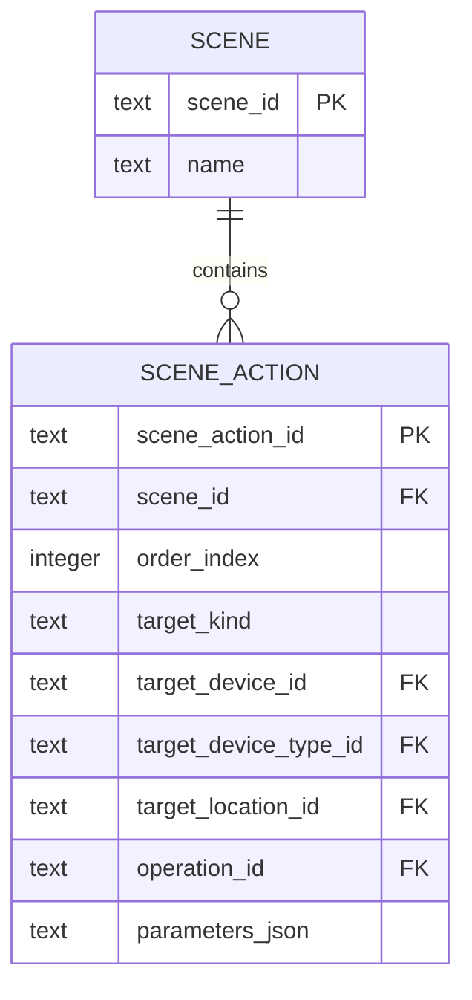
```mermaid
erDiagram
    SCENE ||--o{ SCENE_ACTION : contains

    SCENE {
        text scene_id PK
        text name
    }

    SCENE_ACTION {
        text scene_action_id PK
        text scene_id FK
        integer order_index
        text target_kind
        text target_device_id FK
        text target_device_type_id FK
        text target_location_id FK
        text operation_id FK
        text parameters_json
    }
```

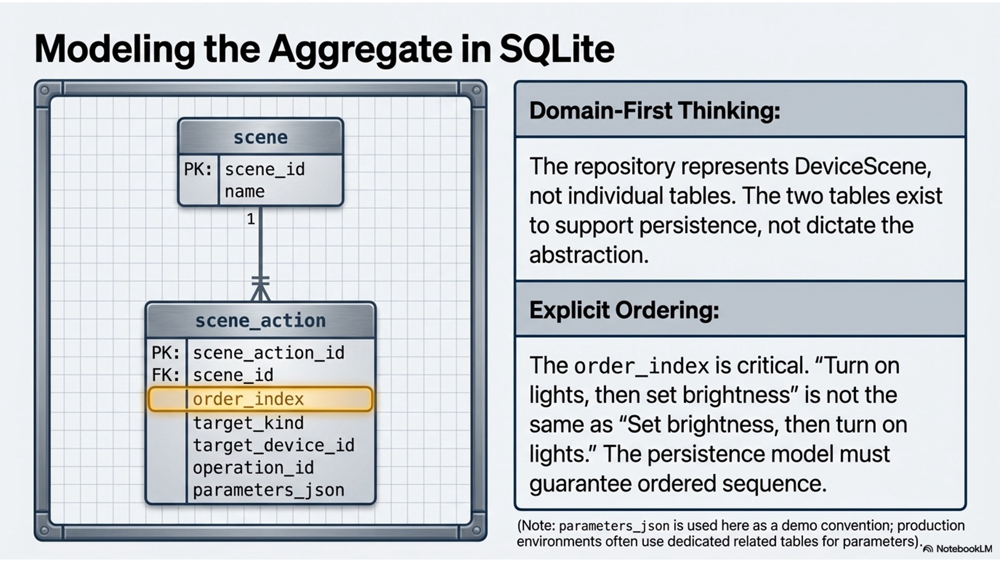

### Why Two Tables?

Because a scene has a one-to-many relationship with its actions.

If actions were packed into one giant string column, the repository would still work, but:

- querying would be opaque
- ordering would be harder to reason about
- the shape would stop teaching the underlying design clearly

One more important note before going further:

- `parameters_json` in this lecture is a **teaching and demo convention**, not the preferred long-term relational design. Storing parameters in JSON blocks in your database leads to query difficulties, serialization problems when property names change, lock-in to the JSON format, etc.

For a production-quality smart-home schema, action parameters are often better modeled in related tables that reflect the device type or action type more directly.

### Save Operation

Saving a scene typically means:

1. upsert the scene row
2. remove old action rows for that scene
3. insert the current ordered action list

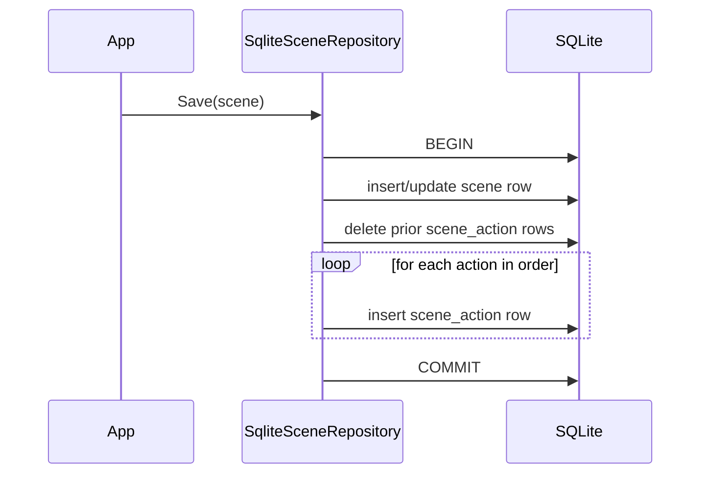
```mermaid
sequenceDiagram
    participant App
    participant Repo as SqliteSceneRepository
    participant DB as SQLite

    App->>Repo: Save(scene)
    Repo->>DB: BEGIN
    Repo->>DB: insert/update scene row
    Repo->>DB: delete prior scene_action rows
    loop for each action in order
        Repo->>DB: insert scene_action row
    end
    Repo->>DB: COMMIT
```

### Load Operation

Loading reverses the mapping:

1. read the scene row
2. read its action rows ordered by `order_index`
3. rebuild `SceneAction` objects
4. return a `DeviceScene`

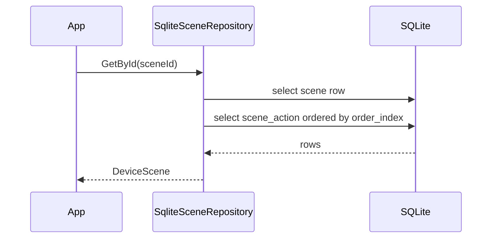
```mermaid
sequenceDiagram
    participant App
    participant Repo as SqliteSceneRepository
    participant DB as SQLite

    App->>Repo: GetById(sceneId)
    Repo->>DB: select scene row
    Repo->>DB: select scene_action ordered by order_index
    DB-->>Repo: rows
    Repo-->>App: DeviceScene
```

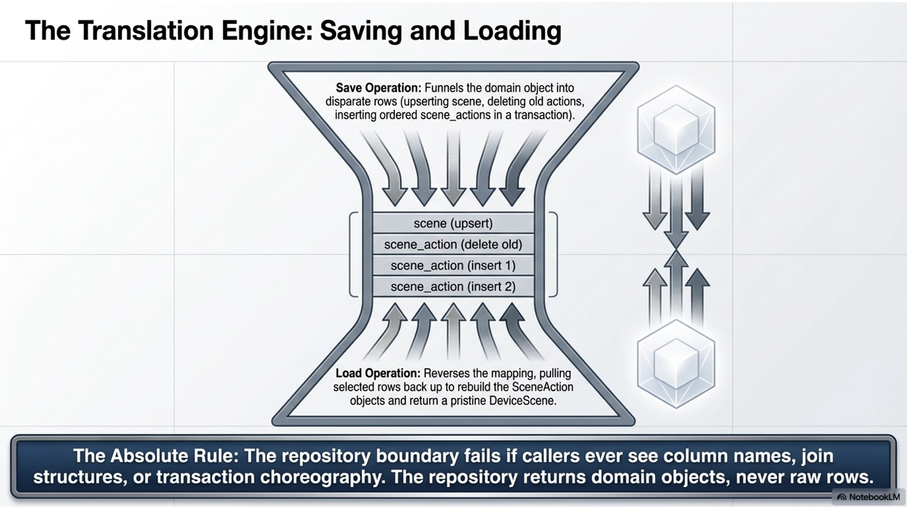

### Why Ordering Must Be Explicit

Scene action order matters.

These are not equivalent:

1. turn on living room lights
2. set brightness to 40

versus:

1. set brightness to 40
2. turn on living room lights

That is why `order_index` must be part of the persistence model.

### Repository Mapping View

```mermaid
flowchart LR
    SCENE["DeviceScene"] --> MAP1["map scene row"]
    SCENE --> MAP2["map action rows"]
    MAP1 --> DB1[(scene)]
    MAP2 --> DB2[(scene_action)]
```

### A Small But Important Rule

The repository returns **domain objects**, not raw database rows.

If callers need to know:

- column names
- join structure
- transaction choreography

then the repository boundary has failed.

### A Transaction Is Not the Same Thing as a Repository

In the `Save(scene)` example, the repository uses a transaction because saving a scene touches:

- the `scene` row
- the related `scene_action` rows

That does **not** make transaction coordination the main point of the Repository pattern.

The repository's job is still:

- present a domain-oriented abstraction
- hide SQLite details
- map storage rows to domain objects

Transaction coordination is a related concern. That idea leads to `Unit of Work`, which we will revisit in [Appendix 3: Repository vs Unit of Work](#appendix-3-repository-vs-unit-of-work).

### What the Example Scene Looks Like in the Tables

The ERD shows the structure. It is also useful to see what the saved rows actually look like for the `Evening Arrival` example.

Assume this scene:

- scene id: `scene-001`
- action 1: turn on porch light by device id `device-porch-light`
- action 2: turn on all `Light` devices in `Living Room`
- action 3: set brightness to `40` for all `Light` devices in `Living Room`
- action 4: unlock front door by device id `device-front-door-lock`

The `scene` table would contain one row:

| scene_id (PK) | name |
|---|---|
| `scene-001` | `Evening Arrival` |

The `scene_action` table would contain four ordered rows:

| scene_action_id (PK) | scene_id (FK) | order_index | target_kind | target_device_id (FK) | target_device_type_id (FK) | target_location_id (FK) | operation_id (FK) | parameters_json |
|---|---|---:|---|---|---|---|---|---|
| `action-001` | `scene-001` | 0 | `device` | `device-porch-light` | `NULL` | `NULL` | `op-turn-on` | `{}` |
| `action-002` | `scene-001` | 1 | `group` | `NULL` | `device-type-light` | `location-living-room` | `op-turn-on` | `{}` |
| `action-003` | `scene-001` | 2 | `group` | `NULL` | `device-type-light` | `location-living-room` | `op-set-brightness` | `{"brightness":"40"}` |
| `action-004` | `scene-001` | 3 | `device` | `device-front-door-lock` | `NULL` | `NULL` | `op-unlock` | `{}` |

Three important things become visible when you look at the rows this way:

- the repository stores one **scene definition** across two related tables
- `order_index` preserves action order explicitly
- target data uses foreign-key ID columns depending on whether the action points to a specific device or to a device group

This is exactly why the repository abstraction matters. Higher-level code should work with a `DeviceScene`, not with this row choreography directly.

### Built With Builder, Loaded From Repository

A common question is whether the repository should push loaded data back through the builder when reconstructing a `DeviceScene` from the database.

It should not. The builder and the repository produce the same type, but they serve different lifecycle stages:

- The **builder** constructs a *new* scene from untrusted input. It enforces invariants, rejects invalid data, and guarantees that the finished product is well-formed.
- The **repository** reconstructs a *previously validated* scene from trusted storage. The data was already validated when it was originally saved, so re-running construction guards is redundant.

The repository maps rows directly onto the domain classes that make up `DeviceScene`. It does not need the builder's step-by-step ceremony because the data has already earned its way past those checks.

```mermaid
flowchart LR

    subgraph Load["Loaded scene (trusted storage)"]
        DB[(SQLite)] --> REPO[SqliteSceneRepository]
        REPO -->|maps rows directly| SCENE2[DeviceScene]
    end
    
        subgraph New["New scene (untrusted input)"]
        INPUT[User / API input] --> BUILDER[DeviceSceneBuilder]
        BUILDER -->|validates and builds| SCENE1[DeviceScene]
    end
```

For example, this object dump shows a `DeviceScene` reconstructed by the repository — its properties are mapped from `scene` and `scene_action` rows without involving the builder:

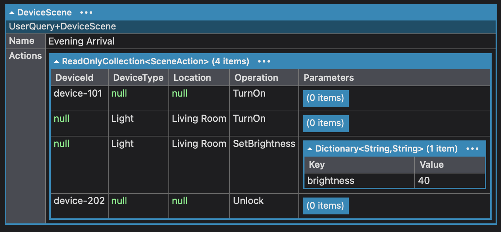

### Companion Demos: Repository in Action

The companion demos extend the builder example by saving the `Evening Arrival` scene through a SQLite-backed repository, reloading it by id, and printing the rehydrated `DeviceScene`. Both C# and Java demos implement the same flow — build, save, load, print:

- [C# demo](./14-repository-and-builder-pattern-demos/csharp-smart-home-scenes/README.md)
- [Java demo](./14-repository-and-builder-pattern-demos/java-smart-home-scenes/README.md)

---
## 6. Unified End-to-End Flow

### Putting the Patterns Together

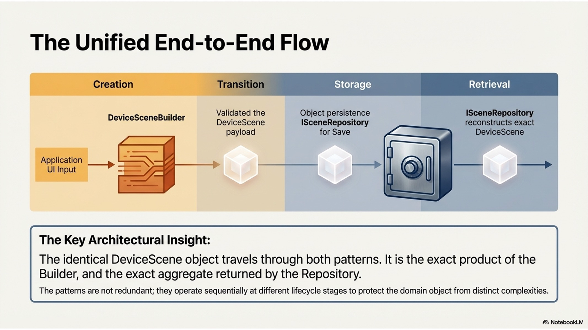

Builder and Repository solve different problems in the same use case:

- `Builder` constructs the scene definition
- `Repository` stores and reloads it

```mermaid
flowchart TB
    A[Start scene definition] --> B[Build DeviceScene]
    B --> C[Save through repository]
    C --> D[(SQLite)]
    D --> E[Load through repository]
    E --> F[Use DeviceScene in application]
```

### End-to-End Sequence

```mermaid
sequenceDiagram
    participant Client
    participant Builder as DeviceSceneBuilder
    participant Repo as ISceneRepository
    participant Sqlite as SqliteSceneRepository
    participant DB as SQLite

    Client->>Builder: Named("Evening Arrival")
    Client->>Builder: AddDeviceAction(...)
    Client->>Builder: AddGroupAction(...)
    Client->>Builder: Build()
    Builder-->>Client: DeviceScene
    Client->>Repo: Save(scene)
    Repo->>Sqlite: Save(scene)
    Sqlite->>DB: insert/update scene + scene_action rows
    Sqlite-->>Repo: done
    Repo-->>Client: done
    Client->>Repo: GetById(scene.Id)
    Repo->>Sqlite: GetById(scene.Id)
    Sqlite->>DB: select rows
    DB-->>Sqlite: rows
    Sqlite-->>Repo: DeviceScene
    Repo-->>Client: DeviceScene
```

### The Key Architectural Insight

The same `DeviceScene` object travels through both patterns:

- it is the **product** of the builder
- it is the **aggregate returned** by the repository

That does **not** make Builder and Repository redundant. It means they operate at different lifecycle stages of the same domain object.

### Why This Scales Better

- construction rules stay centralized
- persistence rules stay centralized
- higher-level code remains readable
- the scene definition stays understandable as a domain concept

---
## 7. Anti-Patterns and Failure Modes

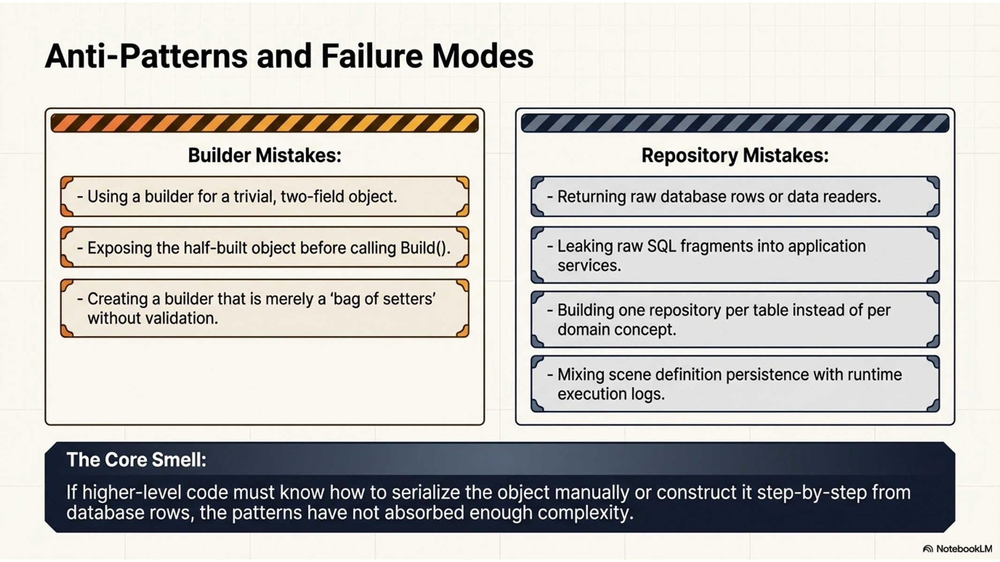

### Builder Mistakes

- using a builder for a trivial two-field object
- exposing the half-built object before `Build()`
- creating a builder that is only a bag of setters
- forgetting to validate required steps at build time

### Repository Mistakes

- returning raw rows or data readers
- leaking SQL strings into controllers or services
- making the repository mirror the database instead of the domain
- mixing unrelated persistence concerns into one repository
- turning the repository into a giant collection of screen-specific `FindBy...` methods
- using one repository per table instead of per domain concept

### Scene-Specific Mistakes

- storing action order only implicitly
- mixing scene definition persistence with execution logs
- treating target resolution as part of the repository instead of part of later execution logic

```mermaid
flowchart LR
    BAD("Failure modes") --> A[Builder returns invalid objects]
    BAD --> B[Repository leaks storage details]
    BAD --> C[Order not persisted]
    BAD --> D[Scene definition mixed with runtime concerns]
```

### The Smell to Notice

If the code that *uses* a scene must know how to:

- construct it step by step
- serialize it manually
- map it from rows

then the patterns have not absorbed enough complexity.

---
## 8. Relationship to Other Patterns

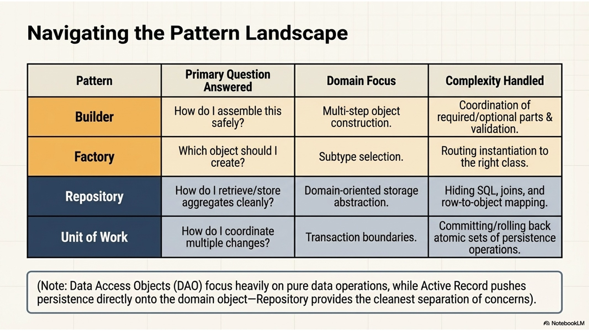

### Builder vs Factory

Use `Factory` when:

- object creation is simple
- the main issue is selecting a subtype

Use `Builder` when:

- the object is assembled in multiple steps
- required and optional parts must be coordinated

```mermaid
flowchart LR
    FACTORY(Factory) --> A[chooses what to create]
    BUILDER(Builder) --> B[controls how complex construction happens]
```

### Repository vs DAO / Active Record

`DAO` stands for **Data Access Object** and often focuses more directly on data access operations.

`Repository` emphasizes:

- domain language
- aggregate retrieval
- hiding persistence details behind a collection-like abstraction

`Active Record` pushes persistence operations onto the domain object itself.

Lecture 14 favors Repository because we want the scene definition to stay a domain concept, not become its own persistence API.

### Repository vs Unit of Work

These two ideas are related, but they are not the same pattern.

- `Repository` answers: how do I retrieve and store domain objects?
- `Unit of Work` answers: how do I coordinate a set of persistence changes as one transaction?

In this lecture, `Save(scene)` uses a transaction internally because the scene aggregate spans multiple rows. That is enough to expose the idea without making Unit of Work a main lecture topic.

### Builder and Repository in the Same Use Case

These patterns combine naturally:

- create complex object with `Builder`
- persist and retrieve it with `Repository`

They are complementary, not competing.

### What This Lecture Deliberately Leaves Out

This lecture stops at:

- scene definition construction
- scene definition storage

Later lectures will extend the same [smart-home project](../project/README.md) domain into other pattern problems.

---
## 9. Real-World Summary

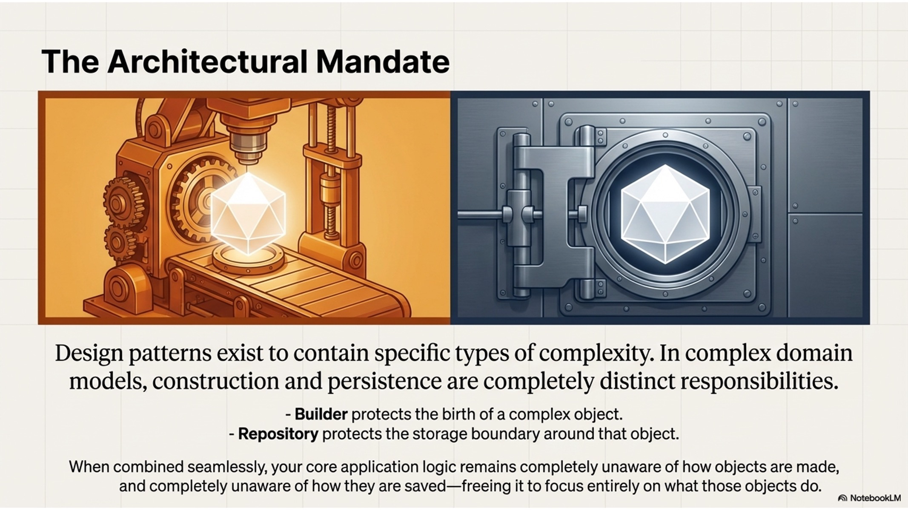

### Practical Guidance

- use `Builder` when object construction is complex enough that callers should not assemble the object ad hoc
- use `Repository` when domain code should not know database details
- keep the product object and the builder distinct
- keep the domain object and the storage mechanism distinct

Decision rule:

If you are loading and saving aggregates, think `Repository`. If you are supporting many filtered, sorted, paged, or projected reads, think separate query service.

### Common Misconceptions

- "Builder is just a fancy constructor."  
  Not quite. Its value is guided construction and validation.

- "Repository means no SQL exists."  
  False. SQL still exists; it is just pushed behind a boundary.

- "Every entity needs a builder."  
  No. Only complex construction justifies it.

- "Every table needs its own repository."  
  Not necessarily. Repositories should follow meaningful domain boundaries.

### The Main Rule to Remember

> Builder protects the *birth* of a complex object. Repository protects the *storage boundary* around that object.

---
## Study Guide

### Core Definitions

- **Builder pattern**: a creational pattern that separates complex object construction from the finished product
- **Director**: an object that orchestrates builder steps in the canonical GoF form
- **Repository pattern**: an abstraction that retrieves and stores domain objects while hiding persistence details
- **Aggregate**: a domain object or cluster of objects treated as one unit for retrieval and storage

### Fast Recall Diagram

```mermaid
flowchart TB
    INPUT[construction input] --> BUILDER[Builder]
    BUILDER --> SCENE[DeviceScene]
    SCENE --> REPO[Repository]
    REPO --> DB[(SQLite)]
```

### Boundary Checklist

- does the builder prevent incomplete scene definitions?
- does the repository return `DeviceScene` instead of row-shaped data?
- is action order persisted explicitly?
- are SQLite details hidden from higher-level code?
- is the repository organized around the `DeviceScene` concept rather than around individual tables?
- is the repository interface still small and stable, or is query creep pushing it past `SRP` and `OCP`?

### Sample Exam Questions

1. What problem does the Builder pattern solve better than a long constructor?
2. Why is `order_index` important in the scene example?
3. What responsibility belongs to a repository and what responsibility does not?
4. Why is returning raw SQL rows from a repository a design smell?
5. How can Builder and Repository cooperate in the same use case without overlapping responsibilities?
6. Why is a repository usually a domain abstraction rather than a table-by-table abstraction?
7. What are the signs that a repository interface has become too large, and what is the usual refactoring move?

### Scenario Drills

- You have a `DeviceScene` with many optional actions and target types, and callers keep creating invalid scenes. Which pattern helps first?
- You have scene definitions persisted in SQLite, and SQL has spread into controllers and services. Which pattern helps first?
- You only need to instantiate one tiny immutable value object with two fields. Is Builder appropriate?

### Scenario Drill Answers

- invalid complex construction: `Builder`
- SQL spread through application logic: `Repository`
- tiny simple immutable object: usually **no**, Builder is probably unnecessary

---
## Appendix 1: SQLite Schema and Mapping Notes

### Minimal DDL Sketch

```sql
CREATE TABLE IF NOT EXISTS scene (
    scene_id TEXT PRIMARY KEY,
    name TEXT NOT NULL
);

CREATE TABLE IF NOT EXISTS scene_action (
    scene_action_id TEXT PRIMARY KEY,
    scene_id TEXT NOT NULL,
    order_index INTEGER NOT NULL,
    target_kind TEXT NOT NULL,
    target_device_id TEXT NULL,
    target_device_type_id TEXT NULL,
    target_location_id TEXT NULL,
    operation_id TEXT NOT NULL,
    parameters_json TEXT NOT NULL,
    FOREIGN KEY (scene_id) REFERENCES scene(scene_id),
    FOREIGN KEY (target_device_id) REFERENCES devices(id),
    FOREIGN KEY (target_device_type_id) REFERENCES device_types(id),
    FOREIGN KEY (target_location_id) REFERENCES locations(id),
    FOREIGN KEY (operation_id) REFERENCES operations(id)
);
```

> **Note:** The foreign keys above reference tables (`devices`, `device_types`, `locations`, `operations`) that belong to the broader smart-home project schema but are not defined in this lecture. They are included here to show that columns like `target_device_id` and `operation_id` are typed identifiers with referential meaning, not arbitrary magic strings. The full project schema defines these tables; this lecture only focuses on the `scene` and `scene_action` tables.

### Rehydration Rule

When loading:

- select the scene row
- select child action rows ordered by `order_index`
- rebuild the `SceneTarget`
- deserialize parameters
- construct the final `DeviceScene`

---
## Appendix 2: Builder vs Factory and Object Initializers

### Builder vs Factory

Factories answer:

- *which object should I create?*

Builders answer:

- *how do I assemble this complex object safely?*

### Builder vs Object Initializer

Object initializers can be perfectly fine when:

- there are few fields
- there are no construction invariants
- partial initialization is not dangerous

Builder becomes attractive when:

- order matters
- validation matters
- multiple optional and required parts interact

### Short Rule of Thumb

If the caller has to remember a ritual, Builder may help.

---
## Appendix 3: Repository vs Unit of Work

### The Short Distinction

These two patterns are commonly mentioned together because both sit near persistence, but they solve different problems.

| Pattern | Main Question |
|---|---|
| `Repository` | How do I retrieve and store domain objects cleanly? |
| `Unit of Work` | How do I coordinate multiple persistence changes as one transaction? |

### Repository

Repository gives higher-level code a domain-shaped abstraction:

- `GetById`
- `ListAll`
- `Save`

It hides:

- SQL
- joins
- row mapping
- table choreography

### Unit of Work

Unit of Work tracks and coordinates a set of related changes so they can be committed or rolled back together.

Typical responsibilities:

- begin transaction
- collect changes
- commit once
- rollback on failure

### Why They Appear Together

A repository often *uses* transaction behavior internally.

For example, saving a `DeviceScene` may require:

1. updating `scene`
2. deleting prior `scene_action`
3. inserting current `scene_action`

Those steps should succeed or fail together.

That is transaction coordination. In larger systems, a separate Unit of Work abstraction may manage that coordination across multiple repositories.

### Why This Lecture Does Not Go Deep on Unit of Work

Lecture 14 is about:

- constructing scene definitions with Builder
- persisting scene definitions with Repository

That makes Unit of Work adjacent, but not central.

For this lecture, the important takeaway is:

> Repository gives you a domain-facing persistence boundary. Unit of Work coordinates the transaction behind or around that boundary.

---
## Appendix 4: Where Lecture 15 Extends This Example

Lecture 14 stops at:

- constructing a scene definition
- storing a scene definition

In the [smart-home project](../project/README.md), a scene is eventually more than stored data. It also becomes a behavior that can be applied to devices in order.

That next step raises different pattern questions, which are intentionally deferred to Lecture 15.

For this lecture, the only mental model students need is:

```mermaid
flowchart TB
    A[Build scene definition] --> B[Persist scene definition]
    B -. next lecture extends here .-> C[Execute scene behavior]
```

The point is architectural staging:

- first make the definition clean
- then make the storage boundary clean
- later address execution design
