# Command and Composite Patterns

### Executing and Structuring Smart Home Device Scenes

[Powerpoint Presentation](15-command-and-composite-patterns.pptx) | [PDF](15-command-and-composite-patterns.pdf) | [Video](15-command-and-composite-patterns.mp4)

---

[Lecture 14](14-repository-and-builder-patterns.md) answered:

> how do we construct a valid scene definition, and how do we persist it without leaking SQL?

That gave us Builder for construction and Repository for persistence. But a stored scene definition is inert — it does nothing until something interprets and executes it.

Lecture 15 answers a different question:

> how do we execute a scene against real devices, and how do we represent its tree of operations so that individual commands and groups of commands are treated uniformly?

The two patterns for today are:

- `Command` for encapsulating device operations as objects
- `Composite` for structuring those commands into executable trees

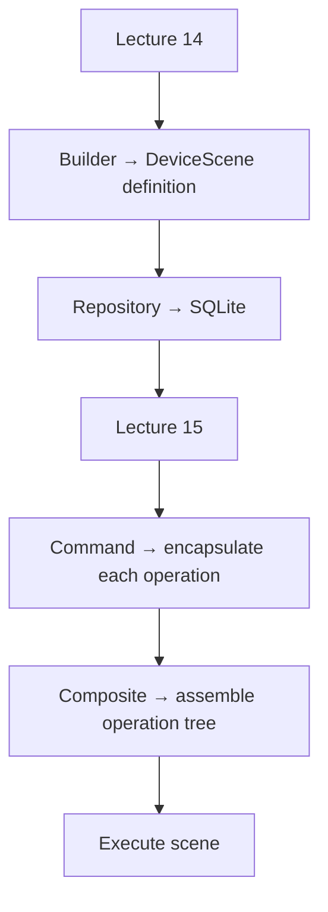
```mermaid
flowchart TB
    L14["Lecture 14"] --> BUILD["Builder → DeviceScene definition"]
    BUILD --> STORE["Repository → SQLite"]
    STORE --> L15["Lecture 15"]
    L15 --> CMD["Command → encapsulate each operation"]
    CMD --> COMP["Composite → assemble operation tree"]
    COMP --> EXEC["Execute scene"]
```

This lecture intentionally builds on the same `DeviceScene` domain from [Lecture 14](14-repository-and-builder-patterns.md). The scene definition is already built and persisted. Now we make it executable.

By the end of this lecture, students should be able to:

- explain when the Command pattern is warranted and when it adds unnecessary abstraction
- distinguish canonical GoF Command from modern lightweight alternatives
- explain what the Composite pattern is and what structural problem it solves
- combine Command and Composite to execute a tree of device operations
- recognize common real-world usages of both patterns on client and server
- design a scene execution engine using both patterns together

---
## Table of Contents

- [1. The Problem: Executing a Scene Definition](#1-the-problem-executing-a-scene-definition)
- [2. The Command Pattern](#2-the-command-pattern)
- [3. The Composite Pattern](#3-the-composite-pattern)
- [4. Combining Command and Composite for Scene Execution](#4-combining-command-and-composite-for-scene-execution)
- [5. Companion Demo: Angular Scene Executor](#5-companion-demo-angular-scene-executor)
- [6. Anti-Patterns and Failure Modes](#6-anti-patterns-and-failure-modes)
- [7. Relationship to Other Patterns](#7-relationship-to-other-patterns)
- [8. Real-World Summary](#8-real-world-summary)
- [Study Guide](#study-guide)
- [Appendix 1: Undo/Redo with Command](#appendix-1-undoredo-with-command)

---
## 1. The Problem: Executing a Scene Definition

[Lecture 14](14-repository-and-builder-patterns.md) produced a clean `DeviceScene` object — a name and an ordered list of `SceneAction` entries. Each action targets either a specific device or a device group and specifies an operation like `TurnOn`, `SetBrightness`, or `Unlock`.

That definition is data. It describes *what should happen*. It does not describe *how to make it happen*.

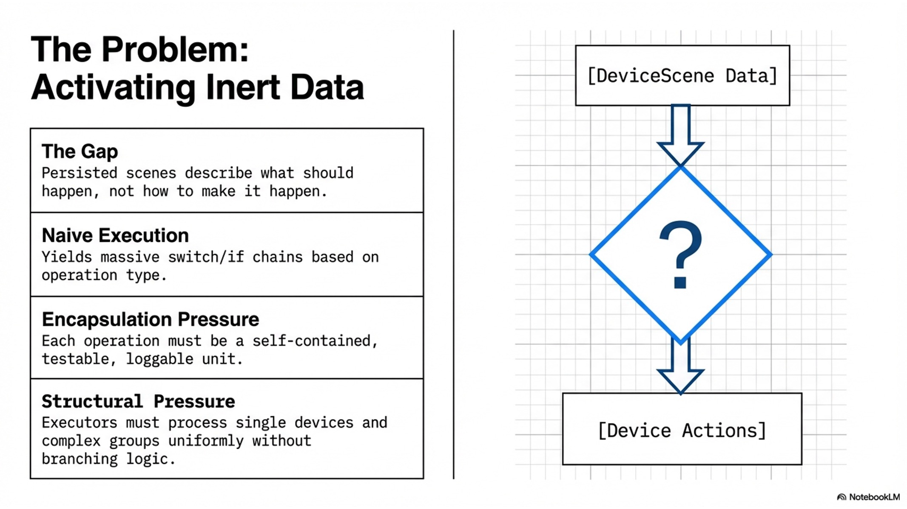

### The Naive Execution Approach

The first instinct is usually a method full of conditionals:

```csharp
public void ExecuteScene(DeviceScene scene)
{
    foreach (var action in scene.Actions)
    {
        var devices = ResolveTargets(action);
        foreach (var device in devices)
        {
            if (action.Operation == "TurnOn")
                device.TurnOn();
            else if (action.Operation == "SetBrightness")
                device.SetBrightness(int.Parse(action.Parameters["brightness"]));
            else if (action.Operation == "Unlock")
                device.Unlock();
            // ... more cases
        }
    }
}
```

This creates familiar problems:

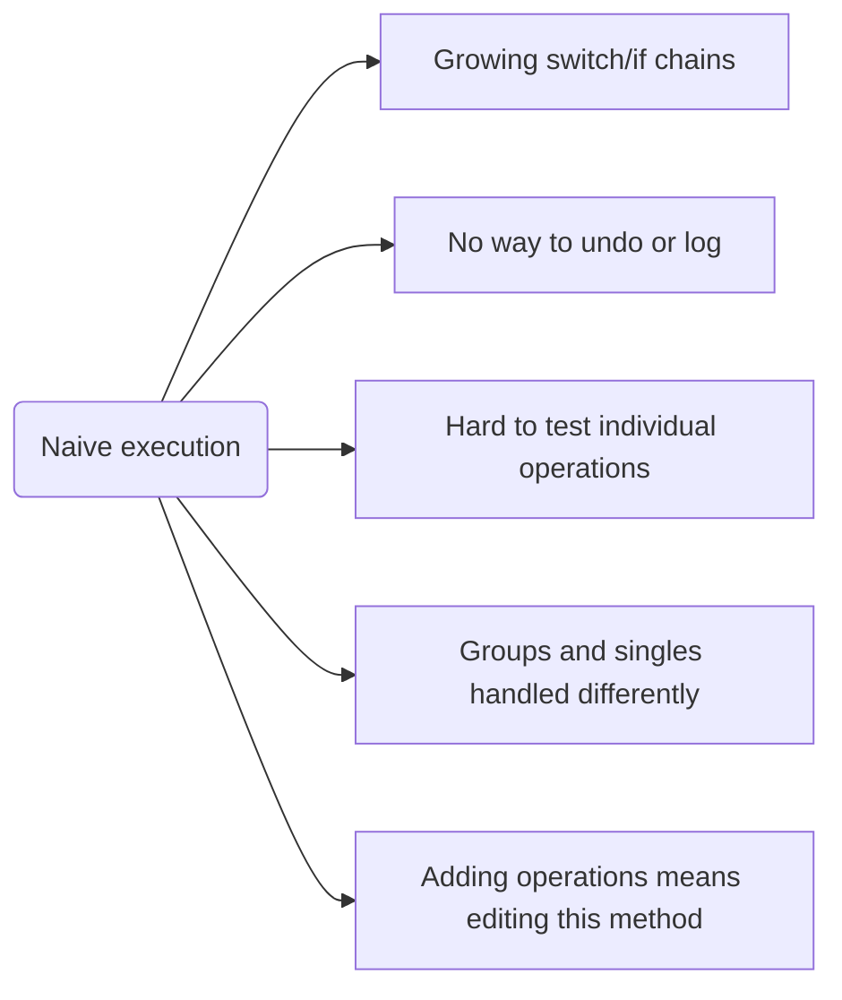
```mermaid
flowchart LR
    BAD("Naive execution") --> A["Growing switch/if chains"]
    BAD --> B["No way to undo or log"]
    BAD --> C["Hard to test individual operations"]
    BAD --> D["Groups and singles handled differently"]
    BAD --> E["Adding operations means editing this method"]
```

### Two Design Pressures

The scene execution problem has two distinct pressures:

1. **Encapsulation pressure**: each device operation should be a self-contained, testable, loggable unit — not a branch in a conditional chain.
2. **Structural pressure**: a scene contains individual device commands and group commands that expand at runtime. The executor should not care whether it is running one command or a tree of them.

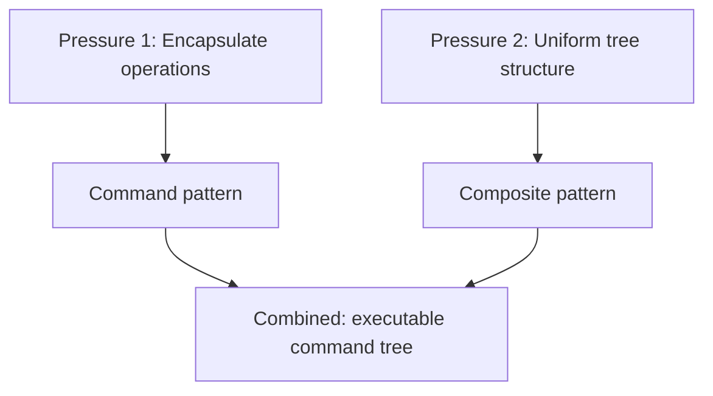
```mermaid
flowchart TB
    P1["Pressure 1: Encapsulate operations"] --> CMD["Command pattern"]
    P2["Pressure 2: Uniform tree structure"] --> COMP["Composite pattern"]
    CMD --> TOGETHER["Combined: executable command tree"]
    COMP --> TOGETHER
```

### The Design Goal

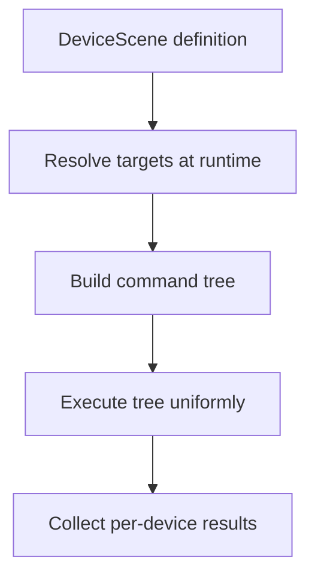
```mermaid
flowchart TB
    SCENE["DeviceScene definition"] --> RESOLVE["Resolve targets at runtime"]
    RESOLVE --> TREE["Build command tree"]
    TREE --> EXEC["Execute tree uniformly"]
    EXEC --> RESULTS["Collect per-device results"]
```

---
## 2. The Command Pattern

### What It Is

The Command pattern is a **behavioral design pattern** (GoF, 1994) that encapsulates a request as an object, allowing you to parameterize clients with different requests, queue operations, log them, and support undo.

The core idea:

> Turn an operation into an object so it can be stored, passed around, queued, logged, or undone.

### Canonical GoF Command Roles

The classical pattern has five roles:

1. **Command**: declares the execution interface
2. **ConcreteCommand**: binds a receiver to an action
3. **Receiver**: the object that performs the actual work
4. **Invoker**: asks the command to execute
5. **Client**: creates commands and associates them with receivers

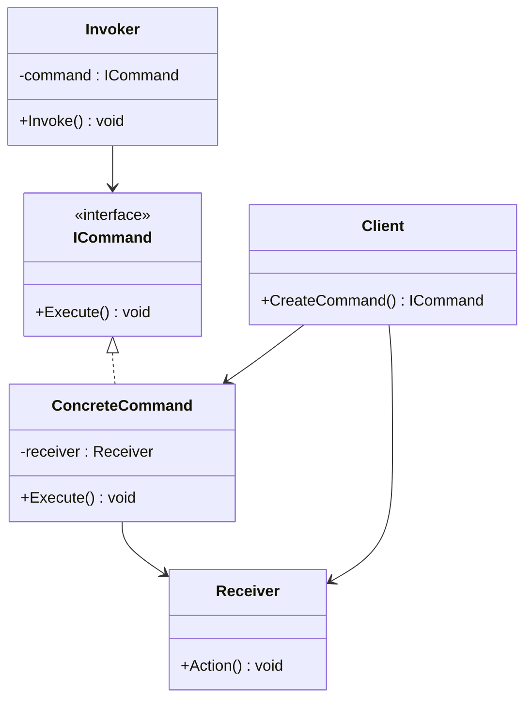
```mermaid
classDiagram
    class ICommand {
        <<interface>>
        +Execute() void
    }

    class ConcreteCommand {
        -receiver : Receiver
        +Execute() void
    }

    class Receiver {
        +Action() void
    }

    class Invoker {
        -command : ICommand
        +Invoke() void
    }

    class Client {
        +CreateCommand() ICommand
    }

    ICommand <|.. ConcreteCommand
    ConcreteCommand --> Receiver
    Invoker --> ICommand
    Client --> ConcreteCommand
    Client --> Receiver
```

### Canonical Command Sequence

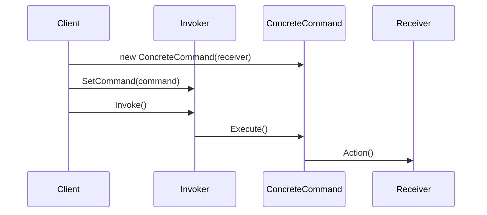
```mermaid
sequenceDiagram
    participant Client
    participant Invoker
    participant Command as ConcreteCommand
    participant Receiver

    Client->>Command: new ConcreteCommand(receiver)
    Client->>Invoker: SetCommand(command)
    Client->>Invoker: Invoke()
    Invoker->>Command: Execute()
    Command->>Receiver: Action()
```

### Scene Example: Command in C#

For the smart-home scene, the roles map naturally:

| GoF Role | Scene Role |
|---|---|
| Command | `IDeviceCommand` |
| ConcreteCommand | `TurnOnCommand`, `SetBrightnessCommand`, `UnlockCommand`, etc. |
| Receiver | The device's state machine context (from [Lecture 12](12-state-machine-pattern.md)) |
| Invoker | `SceneExecutor` |
| Client | The code that loads a scene definition and builds commands |

**Important connection to [Lecture 12](12-state-machine-pattern.md):** The [semester project](../project/README.md) requires that every device is governed by a formal state machine. Commands do not mutate device properties directly — they request transitions through the device's state machine context. The state machine validates the transition, rejects invalid ones, and returns a `TransitionResult`. The command translates that into a `CommandResult`.

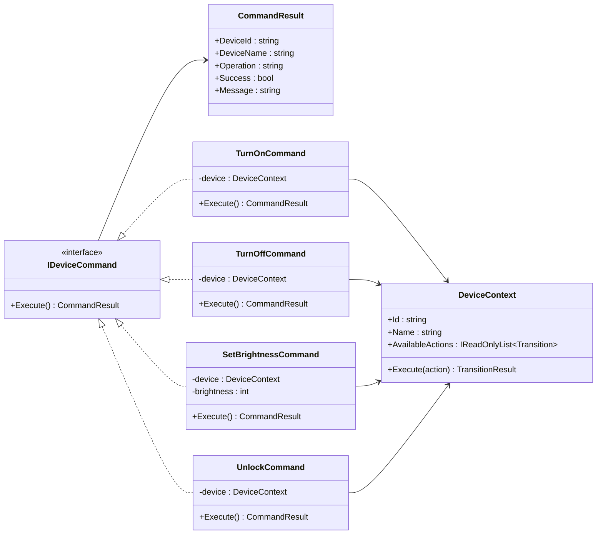
```mermaid
classDiagram
		direction LR
    class IDeviceCommand {
        <<interface>>
        +Execute() CommandResult
    }

    class CommandResult {
        +DeviceId : string
        +DeviceName : string
        +Operation : string
        +Success : bool
        +Message : string
    }

    class TurnOnCommand {
        -device : DeviceContext
        +Execute() CommandResult
    }

    class TurnOffCommand {
        -device : DeviceContext
        +Execute() CommandResult
    }

    class SetBrightnessCommand {
        -device : DeviceContext
        -brightness : int
        +Execute() CommandResult
    }

    class UnlockCommand {
        -device : DeviceContext
        +Execute() CommandResult
    }

    class DeviceContext {
        +Id : string
        +Name : string
        +AvailableActions : IReadOnlyList~Transition~
        +Execute(action) TransitionResult
    }

    IDeviceCommand <|.. TurnOnCommand
    IDeviceCommand <|.. TurnOffCommand
    IDeviceCommand <|.. SetBrightnessCommand
    IDeviceCommand <|.. UnlockCommand
    TurnOnCommand --> DeviceContext
    TurnOffCommand --> DeviceContext
    SetBrightnessCommand --> DeviceContext
    UnlockCommand --> DeviceContext
    IDeviceCommand --> CommandResult
```

The receiver is the device's state machine `DeviceContext` from [Lecture 12](12-state-machine-pattern.md) — not a raw device object with setter methods. Commands request transitions; the state machine decides whether they are valid.

### Example: TurnOnCommand

```csharp
public interface IDeviceCommand
{
    CommandResult Execute();
}

public sealed record CommandResult(
    string DeviceId,
    string DeviceName,
    string Operation,
    bool Success,
    string Message);

public sealed class TurnOnCommand : IDeviceCommand
{
    private readonly DeviceContext _device;

    public TurnOnCommand(DeviceContext device)
    {
        _device = device;
    }

    public CommandResult Execute()
    {
        // Delegate to the device's state machine — not a direct property setter.
        // The state machine validates the transition and returns a result.
        var transition = _device.Execute(DeviceAction.PowerOn);

        return new CommandResult(
            _device.Id,
            _device.Name,
            "TurnOn",
            Success: transition.Success,
            Message: transition.Message);
    }
}
```

The command does not check `_device.IsOn` or call `_device.TurnOn()`. It asks the state machine to execute the `PowerOn` action. The state machine knows whether that transition is valid from the current state:

- If the light is Off, the state machine transitions to On and returns success.
- If the light is already On, the state machine returns a no-op result (self-transition or rejection, depending on how the student defines their transitions).

This keeps the command thin — it translates a scene operation into a state machine action and wraps the result.

### Example: SetBrightnessCommand

```csharp
public sealed class SetBrightnessCommand : IDeviceCommand
{
    private readonly DeviceContext _device;
    private readonly int _brightness;

    public SetBrightnessCommand(DeviceContext device, int brightness)
    {
        _device = device;
        _brightness = brightness;
    }

    public CommandResult Execute()
    {
        // SetBrightness is a self-transition on the On state (On -> On).
        // The state machine validates that the light is On before applying.
        var transition = _device.Execute(
            DeviceAction.SetBrightness,
            new Dictionary<string, object> { ["brightness"] = _brightness });

        return new CommandResult(
            _device.Id,
            _device.Name,
            $"SetBrightness({_brightness})",
            Success: transition.Success,
            Message: transition.Success
                ? $"Brightness set to {_brightness}%"
                : transition.Message);
    }
}
```

If the light is Off, the state machine rejects the `SetBrightness` action because that transition is only valid from the On state. The command does not need to check — the state machine enforces the rule.

Each command is a self-contained unit. It knows its receiver (the device's state machine context) and its parameters. It can be tested, logged, and composed independently.

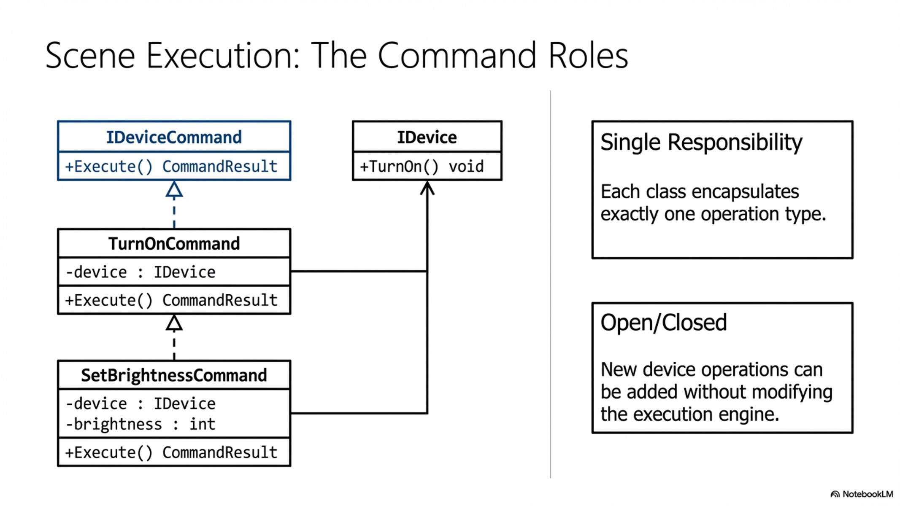

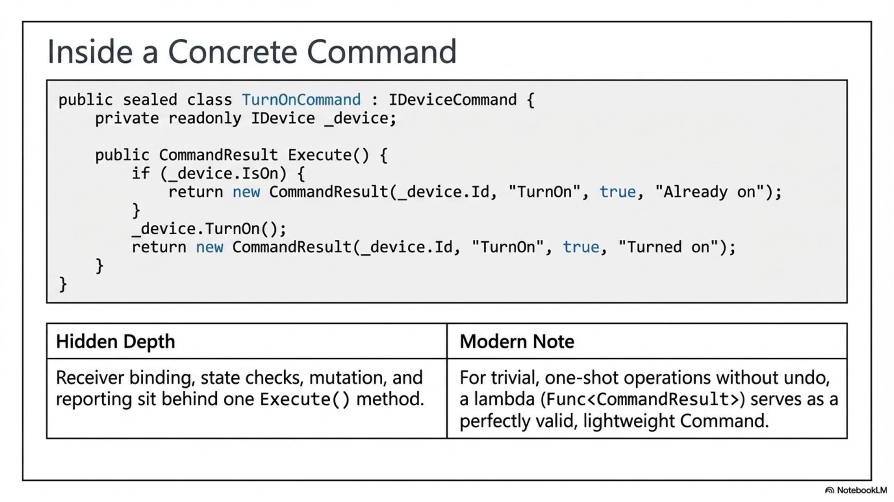

### Modern Usage: Commands as Lambdas

In modern C#, TypeScript, and Java, the Command pattern does not always require a full class hierarchy. When commands are simple and do not need undo, a lambda or delegate can serve the same role:

```csharp
// A command as a Func<CommandResult> instead of a class
Func<CommandResult> turnOnPorch = () =>
{
    porchLight.TurnOn();
    return new CommandResult(porchLight.Id, porchLight.Name,
        "TurnOn", true, "Turned on");
};
```

```typescript
// TypeScript equivalent
const turnOnPorch = (): CommandResult => {
  porchLight.turnOn();
  return { deviceId: porchLight.id, operation: 'TurnOn',
           success: true, message: 'Turned on' };
};
```

This is not a betrayal of the pattern. The GoF authors explicitly noted that Command can be as simple as a callback. The class-based form becomes valuable when you need:

- undo/redo
- serialization
- composite grouping
- rich logging or audit trails

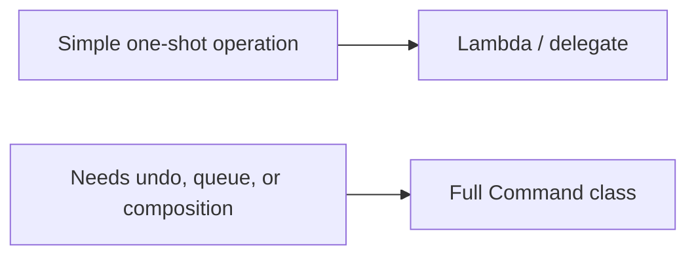
```mermaid
flowchart LR
    SIMPLE["Simple one-shot operation"] --> LAMBDA["Lambda / delegate"]
    COMPLEX["Needs undo, queue, or composition"] --> CLASS["Full Command class"]
```

### Common Real-World Usages

Command appears in many contexts beyond smart home scenes:

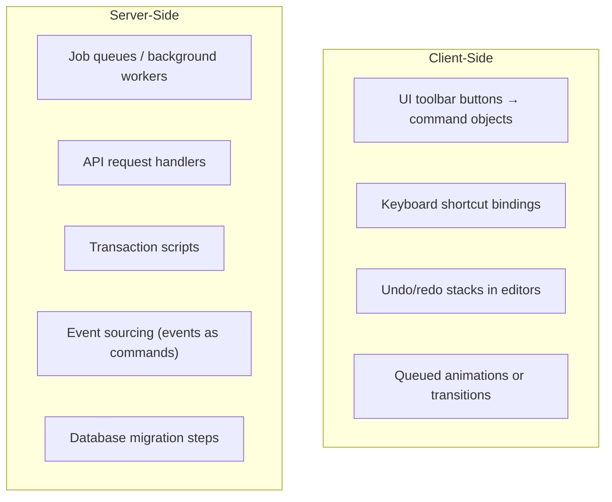
```mermaid
flowchart TB
    subgraph Client-Side
        C1["UI toolbar buttons → command objects"]
        C2["Keyboard shortcut bindings"]
        C3["Undo/redo stacks in editors"]
        C4["Queued animations or transitions"]
    end

    subgraph Server-Side
        S1["Job queues / background workers"]
        S2["API request handlers"]
        S3["Transaction scripts"]
        S4["Event sourcing (events as commands)"]
        S5["Database migration steps"]
    end
```

**Client-side examples:**
- **Text editors**: every keystroke or formatting change is a command object, enabling undo/redo
- **Drawing applications**: add shape, move shape, delete shape — each is a command pushed onto a history stack
- **UI frameworks**: button clicks dispatch command objects rather than calling methods directly, decoupling the UI from the action

**Server/API examples:**
- **Job queues**: background tasks are serialized command objects placed on a queue and executed by workers
- **CQRS**: the "C" in CQRS (Command Query Responsibility Segregation) separates write commands from read queries
- **Database migrations**: each migration step is a command with `Up()` and `Down()` methods

### When to Refactor to Command

Refactor toward Command when you see these signals:

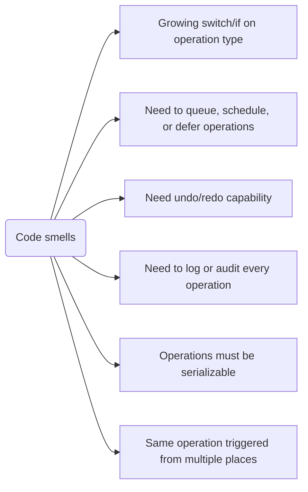
```mermaid
flowchart LR
    SMELL("Code smells") --> A["Growing switch/if on operation type"]
    SMELL --> B["Need to queue, schedule, or defer operations"]
    SMELL --> C["Need undo/redo capability"]
    SMELL --> D["Need to log or audit every operation"]
    SMELL --> E["Operations must be serializable"]
    SMELL --> F["Same operation triggered from multiple places"]
```

The practical test:

> If you need to treat an operation as a *thing* — something that can be stored, passed, queued, logged, composed, or undone — Command is likely the right pattern.

### When NOT to Use Command

Command adds abstraction. That abstraction has a cost. Do not use Command when:

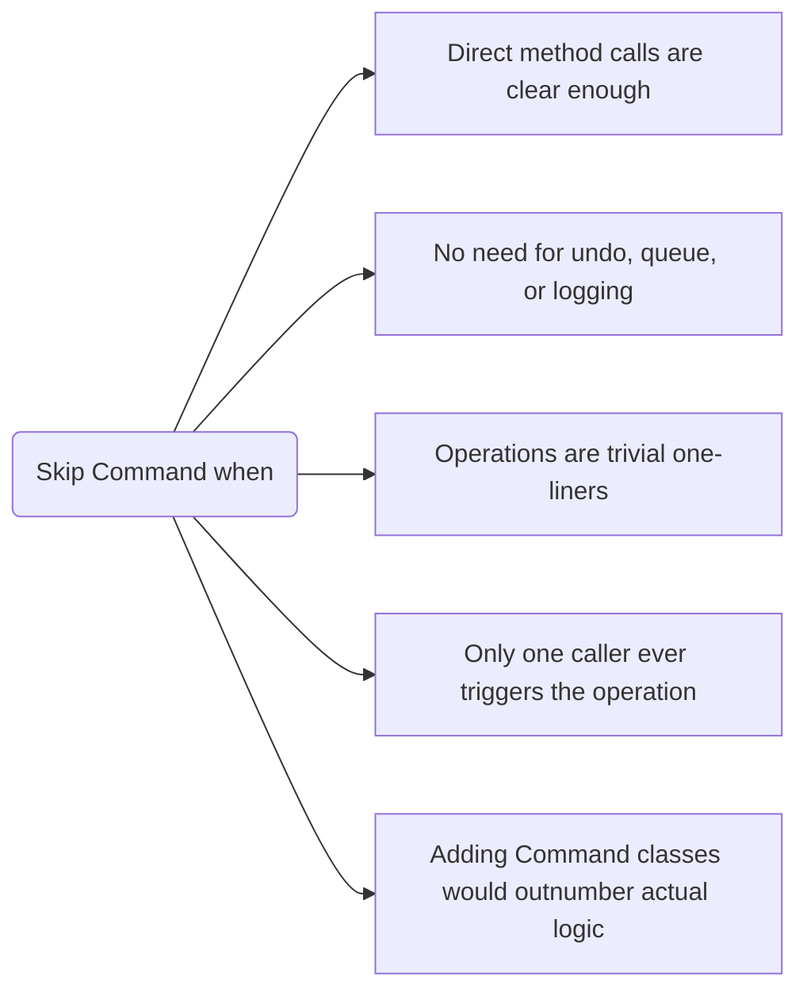
```mermaid
flowchart LR
    NO("Skip Command when") --> A["Direct method calls are clear enough"]
    NO --> B["No need for undo, queue, or logging"]
    NO --> C["Operations are trivial one-liners"]
    NO --> D["Only one caller ever triggers the operation"]
    NO --> E["Adding Command classes would outnumber actual logic"]
```

A practical guideline:

> If wrapping a method call in a Command class adds a file and a class but provides no new capability (no undo, no queuing, no composition, no logging), skip it. You can always refactor to Command later when the need emerges.

### How Command Relates to SOLID and Deep Modules

**SRP — Single Responsibility Principle.** Each command class has one responsibility: execute one specific operation on one specific receiver. `TurnOnCommand` turns things on. `SetBrightnessCommand` sets brightness. Without Command, these responsibilities merge into a large method with conditional branches — one method doing many things.

**OCP — Open/Closed Principle.** Adding a new device operation means adding a new command class. The invoker (`SceneExecutor`) does not change. The existing command classes do not change. The system is open for extension (new commands) and closed for modification (existing execution infrastructure).

**LSP — Liskov Substitution Principle.** Every `IDeviceCommand` implementation must honor the same contract: `Execute()` returns a `CommandResult`. The invoker does not know or care which concrete command it is executing. Substituting `TurnOnCommand` for `UnlockCommand` must not break the execution pipeline.

**ISP — Interface Segregation Principle.** The `IDeviceCommand` interface is minimal: one method. Callers depend only on the ability to execute. They do not depend on device-specific APIs, parameter parsing, or state management internals.

**DIP — Dependency Inversion Principle.** The invoker depends on `IDeviceCommand`, not on concrete command classes. The command factory (client) creates concrete commands and hands them to the invoker through the abstraction.

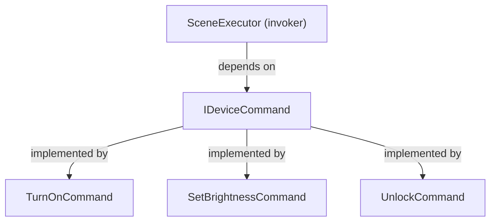
```mermaid
flowchart TB
    INVOKER["SceneExecutor (invoker)"] -->|depends on| IFACE["IDeviceCommand"]
    IFACE -->|implemented by| CMD1["TurnOnCommand"]
    IFACE -->|implemented by| CMD2["SetBrightnessCommand"]
    IFACE -->|implemented by| CMD3["UnlockCommand"]
```

**Ousterhout's deep modules.** A well-designed command is a deep module in miniature. Its interface is one method — `Execute()` — but underneath it encapsulates receiver binding, parameter validation, state checking, state mutation, and result reporting. The invoker sees only the simple surface. The depth is hidden inside each concrete command.

---
## 3. The Composite Pattern

### What It Is

The Composite pattern is a **structural design pattern** (GoF, 1994) that composes objects into tree structures to represent part-whole hierarchies. It lets clients treat individual objects and compositions of objects uniformly.

The core idea:

> Let a single object and a group of objects implement the same interface so that callers do not need to distinguish between them.

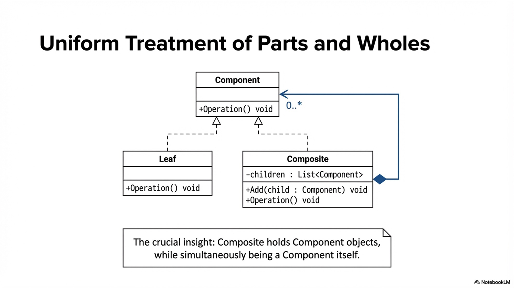

### Canonical GoF Composite Roles

The classical pattern has three roles:

1. **Component**: the common interface for both leaf and composite
2. **Leaf**: a terminal object with no children
3. **Composite**: an object that holds children (which can be leaves or other composites)

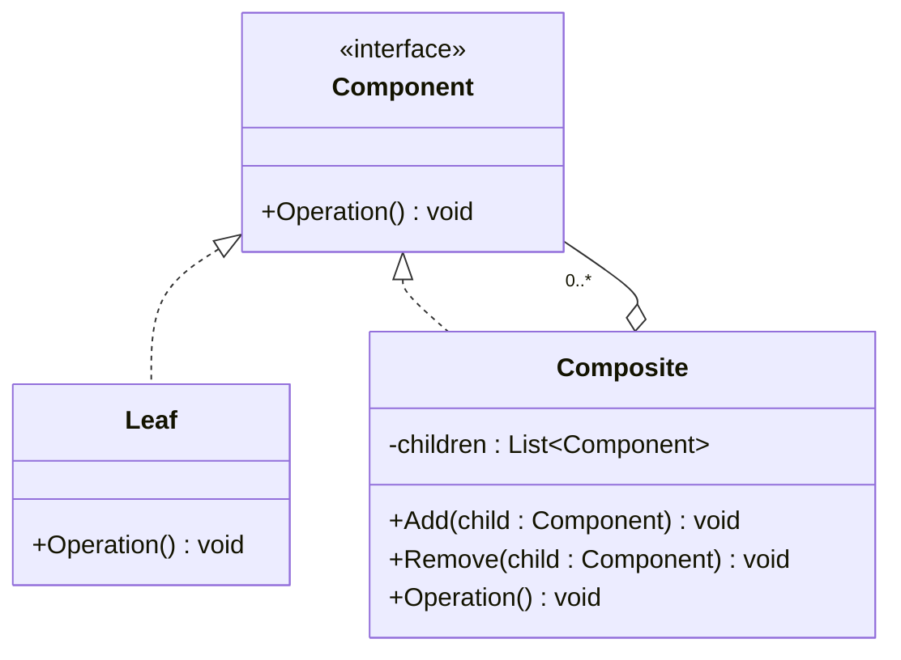
```mermaid
classDiagram
    class Component {
        <<interface>>
        +Operation() void
    }

    class Leaf {
        +Operation() void
    }

    class Composite {
        -children : List~Component~
        +Add(child : Component) void
        +Remove(child : Component) void
        +Operation() void
    }

    Component <|.. Leaf
    Component <|.. Composite
    Composite o-- "0..*" Component
```

The key structural insight: `Composite` holds a collection of `Component`, and `Composite` itself *is* a `Component`. This recursive composition is what allows arbitrary nesting.

### The Tree Mental Model

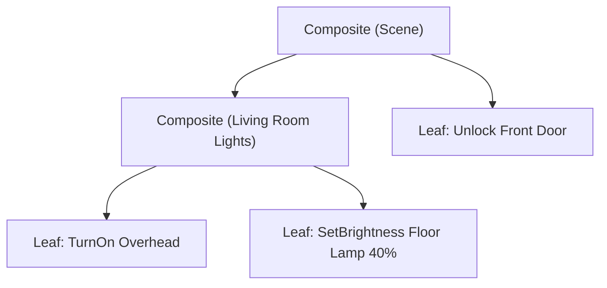
```mermaid
flowchart TB
    ROOT["Composite (Scene)"]
    ROOT --> G1["Composite (Living Room Lights)"]
    ROOT --> L3["Leaf: Unlock Front Door"]
    G1 --> L1["Leaf: TurnOn Overhead"]
    G1 --> L2["Leaf: SetBrightness Floor Lamp 40%"]
```

The executor calls `Execute()` on the root. The root delegates to its children. Composites delegate further. Leaves do the actual work. The caller never knows whether it is talking to one command or a hundred.

### Scene Example: Composite in C#

For the smart-home scene, the Composite maps directly onto the scene structure:

| GoF Role | Scene Role |
|---|---|
| Component | `IDeviceCommand` (same interface from the Command section) |
| Leaf | `TurnOnCommand`, `SetBrightnessCommand`, `UnlockCommand`, etc. |
| Composite | `CompositeCommand` — holds an ordered list of child commands |

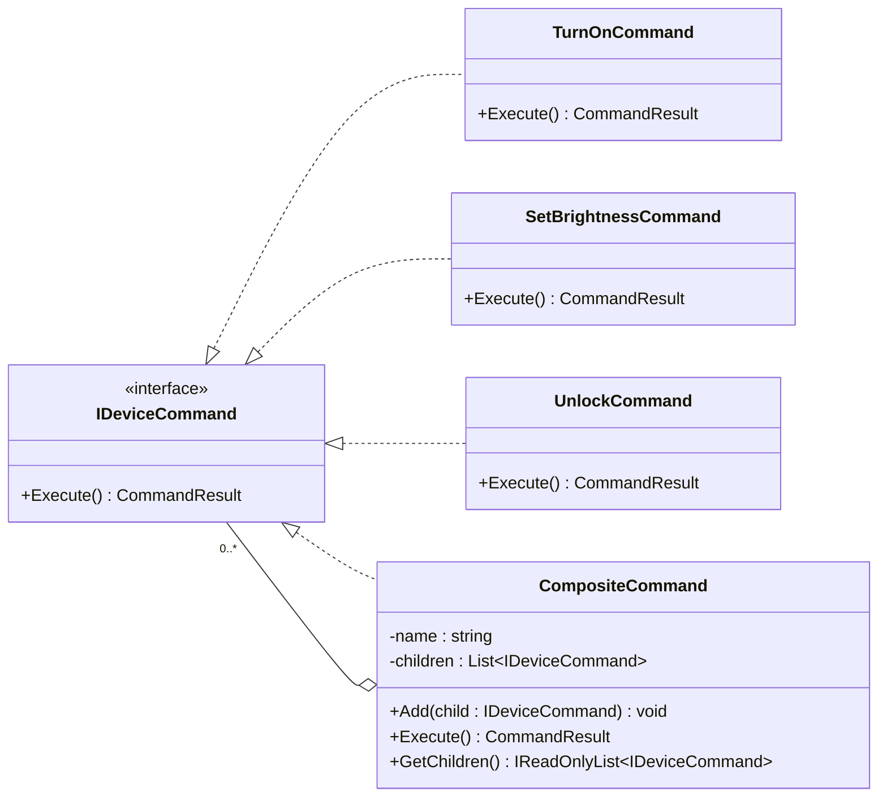
```mermaid
classDiagram
    direction LR
    class IDeviceCommand {
        <<interface>>
        +Execute() CommandResult
    }

    class TurnOnCommand {
        +Execute() CommandResult
    }

    class SetBrightnessCommand {
        +Execute() CommandResult
    }

    class UnlockCommand {
        +Execute() CommandResult
    }

    class CompositeCommand {
        -name : string
        -children : List~IDeviceCommand~
        +Add(child : IDeviceCommand) void
        +Execute() CommandResult
        +GetChildren() IReadOnlyList~IDeviceCommand~
    }

    IDeviceCommand <|.. TurnOnCommand
    IDeviceCommand <|.. SetBrightnessCommand
    IDeviceCommand <|.. UnlockCommand
    IDeviceCommand <|.. CompositeCommand
    CompositeCommand o-- "0..*" IDeviceCommand
```

Notice that `CompositeCommand` implements `IDeviceCommand`. This is the pattern's defining characteristic — the composite *is* a component.

### CompositeCommand Implementation

```csharp
public sealed class CompositeCommand : IDeviceCommand
{
    private readonly string _name;
    private readonly List<IDeviceCommand> _children = new();

    public CompositeCommand(string name)
    {
        _name = name;
    }

    public void Add(IDeviceCommand child)
    {
        _children.Add(child);
    }

    public IReadOnlyList<IDeviceCommand> Children => _children.AsReadOnly();

    public CommandResult Execute()
    {
        var results = new List<CommandResult>();

        foreach (var child in _children)
        {
            results.Add(child.Execute());
        }

        var allSucceeded = results.All(r => r.Success);
        var summary = $"{results.Count(r => r.Success)} succeeded, "
                    + $"{results.Count(r => !r.Success)} failed";

        return new CommandResult(
            DeviceId: _name,
            DeviceName: _name,
            Operation: "CompositeExecute",
            Success: allSucceeded,
            Message: summary);
    }
}
```

The key design point: `Execute()` iterates children and delegates. Each child may be a leaf command or another composite. The caller does not know or care.

### How Group Targets Expand at Runtime

In the [project specification](../project/README.md), a scene action can target a device group (e.g., "all lights in the Living Room"). That group is resolved **at execution time**, not at definition time:

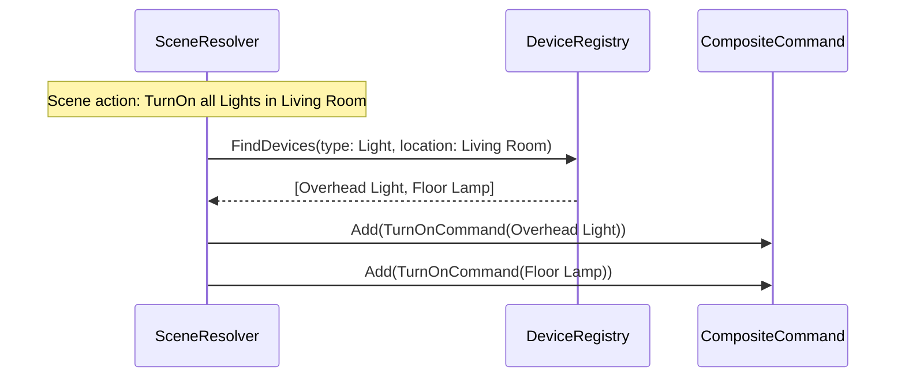
```mermaid
sequenceDiagram
    participant Resolver as SceneResolver
    participant Registry as DeviceRegistry
    participant Tree as CompositeCommand

    Note over Resolver: Scene action: TurnOn all Lights in Living Room

    Resolver->>Registry: FindDevices(type: Light, location: Living Room)
    Registry-->>Resolver: [Overhead Light, Floor Lamp]

    Resolver->>Tree: Add(TurnOnCommand(Overhead Light))
    Resolver->>Tree: Add(TurnOnCommand(Floor Lamp))
```

This means the command tree is built fresh each time a scene executes. A device added after the scene was created is automatically included because the group is resolved against the current device registry.

```csharp
public sealed class SceneResolver
{
    private readonly IDeviceRegistry _registry;

    public SceneResolver(IDeviceRegistry registry)
    {
        _registry = registry;
    }

    public CompositeCommand Resolve(DeviceScene scene)
    {
        var root = new CompositeCommand(scene.Name);

        foreach (var action in scene.Actions)
        {
            var devices = ResolveTargets(action);

            foreach (var device in devices)
            {
                root.Add(CreateCommand(device, action));
            }
        }

        return root;
    }

    private IReadOnlyList<DeviceContext> ResolveTargets(SceneAction action)
    {
        if (!string.IsNullOrEmpty(action.DeviceId))
        {
            var device = _registry.GetById(action.DeviceId);
            return device is not null ? [device] : [];
        }

        return _registry.FindByTypeAndLocation(
            action.DeviceType!, action.Location);
    }

    private IDeviceCommand CreateCommand(
        DeviceContext device, SceneAction action)
    {
        return action.Operation switch
        {
            "TurnOn" => new TurnOnCommand(device),
            "TurnOff" => new TurnOffCommand(device),
            "SetBrightness" => new SetBrightnessCommand(
                device,
                int.Parse(action.Parameters["brightness"])),
            "Unlock" => new UnlockCommand(device),
            "Lock" => new LockCommand(device),
            _ => throw new InvalidOperationException(
                $"Unknown operation: {action.Operation}")
        };
    }
}
```

### Visualizing the Composite Tree

The composite structure naturally maps to a tree visualization. For the `Evening Arrival` scene:

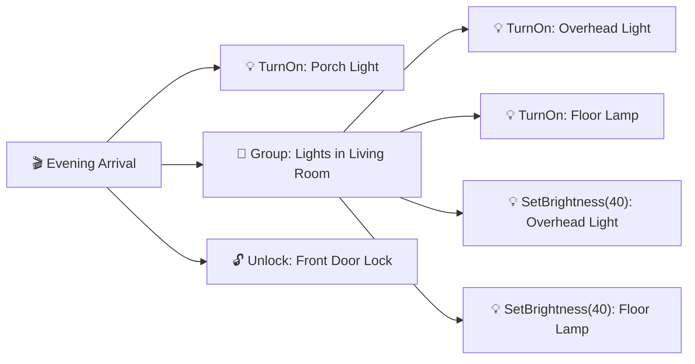
```mermaid
flowchart LR
    ROOT["🎬 Evening Arrival"]
    ROOT --> A1["💡 TurnOn: Porch Light"]
    ROOT --> G1["📁 Group: Lights in Living Room"]
    ROOT --> A4["🔓 Unlock: Front Door Lock"]
    G1 --> A2["💡 TurnOn: Overhead Light"]
    G1 --> A2b["💡 TurnOn: Floor Lamp"]
    G1 --> A3["💡 SetBrightness(40): Overhead Light"]
    G1 --> A3b["💡 SetBrightness(40): Floor Lamp"]
```

This tree representation is exactly what the companion Angular demo renders using PrimeNG's Tree component.

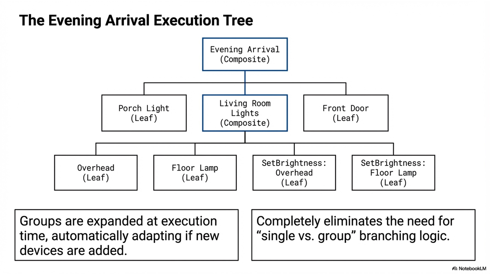

### Common Real-World Usages

Composite appears wherever you have tree-structured data that needs uniform treatment:

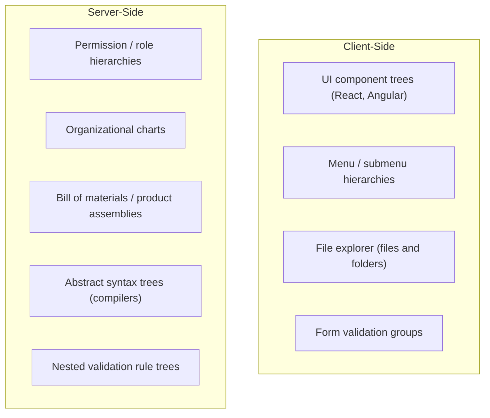
```mermaid
flowchart TB
    subgraph Client-Side
        C1["UI component trees (React, Angular)"]
        C2["Menu / submenu hierarchies"]
        C3["File explorer (files and folders)"]
        C4["Form validation groups"]
    end

    subgraph Server-Side
        S1["Permission / role hierarchies"]
        S2["Organizational charts"]
        S3["Bill of materials / product assemblies"]
        S4["Abstract syntax trees (compilers)"]
        S5["Nested validation rule trees"]
    end
```

**Client-side examples:**
- **UI component trees**: every modern UI framework (React, Angular, Vue) uses composite structure — a component renders children, which may be leaf elements or more components
- **File explorers**: a folder contains files (leaves) and other folders (composites) — the same "open," "delete," "move" operations apply to both
- **Menu systems**: a menu item may be a clickable leaf or a submenu composite

**Server/API examples:**
- **Permission systems**: a role may contain individual permissions (leaves) or other roles (composites), and `HasPermission()` walks the tree
- **Product assemblies**: a finished product contains parts (leaves) and sub-assemblies (composites), each with a cost and weight
- **Validation rules**: a validation group contains individual rules (leaves) and nested groups (composites), and `Validate()` collects all violations

### When to Refactor to Composite

Refactor toward Composite when you see these signals:

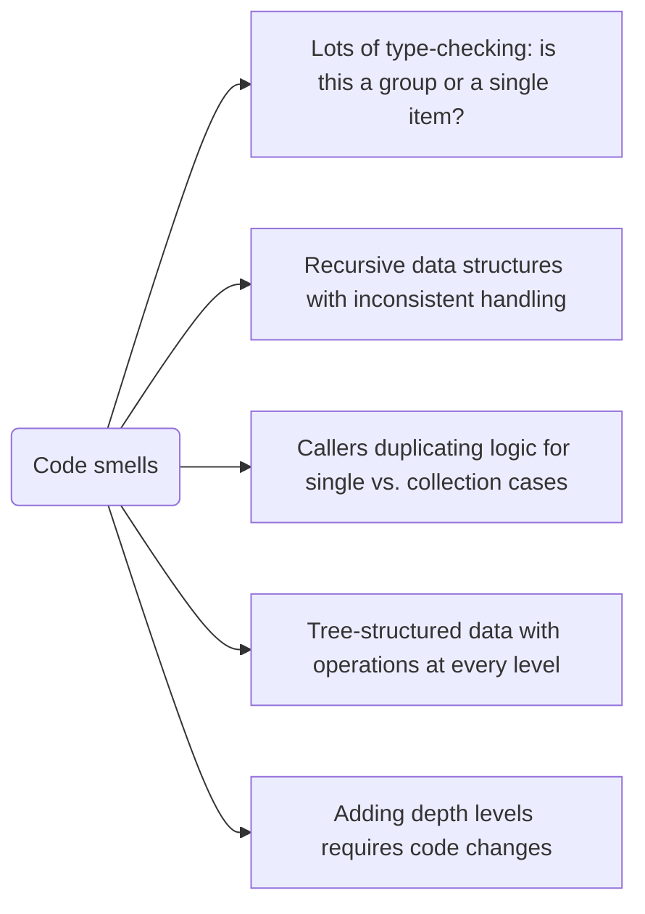
```mermaid
flowchart LR
    SMELL("Code smells") --> A["Lots of type-checking: is this a group or a single item?"]
    SMELL --> B["Recursive data structures with inconsistent handling"]
    SMELL --> C["Callers duplicating logic for single vs. collection cases"]
    SMELL --> D["Tree-structured data with operations at every level"]
    SMELL --> E["Adding depth levels requires code changes"]
```

The practical test:

> If your code repeatedly asks "is this one thing or a collection of things?" and branches on the answer, Composite can eliminate that distinction.

### When NOT to Use Composite

Composite adds structural complexity. Do not use Composite when:

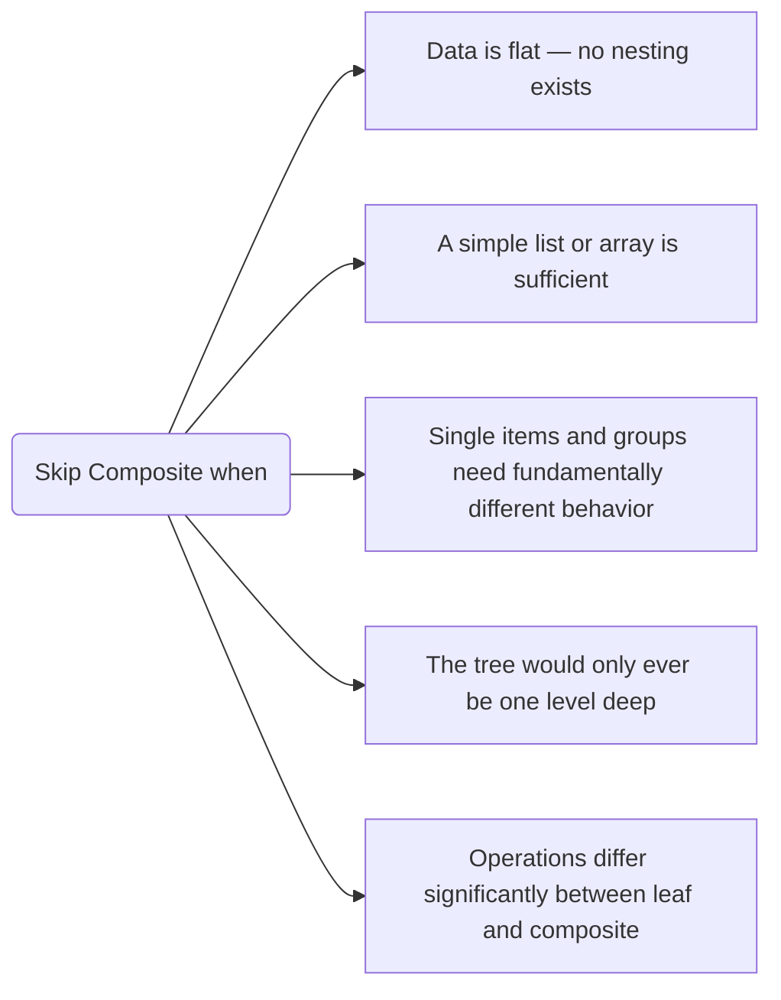
```mermaid
flowchart LR
    NO("Skip Composite when") --> A["Data is flat — no nesting exists"]
    NO --> B["A simple list or array is sufficient"]
    NO --> C["Single items and groups need fundamentally different behavior"]
    NO --> D["The tree would only ever be one level deep"]
    NO --> E["Operations differ significantly between leaf and composite"]
```

A practical guideline:

> If a `List<T>` with a `foreach` loop handles your use case, adding a Composite hierarchy is over-engineering. Composite earns its place when the nesting is real and the uniform interface eliminates meaningful conditional logic.

### How Composite Relates to SOLID and Deep Modules

**SRP — Single Responsibility Principle.** Each leaf command has one responsibility: execute one operation. The composite has one responsibility: delegate to children and aggregate results. Without Composite, these responsibilities collapse into a single method that must know how to handle both individual items and groups.

**OCP — Open/Closed Principle.** New leaf types (new device commands) can be added without modifying the composite. New composite types (if you needed different aggregation strategies) can be added without modifying leaves. The tree structure is open for extension at every level.

**LSP — Liskov Substitution Principle.** The composite *is* a component. Any code that works with `IDeviceCommand` works with `CompositeCommand` just as well as with `TurnOnCommand`. This substitutability is the entire point of the pattern.

**ISP — Interface Segregation Principle.** The component interface (`IDeviceCommand`) exposes only what callers need: `Execute()`. Tree management methods (`Add`, `Remove`, `GetChildren`) live on the composite, not on the component interface. Leaves are not forced to implement tree management operations they do not need.

**DIP — Dependency Inversion Principle.** The invoker depends on `IDeviceCommand`, not on `CompositeCommand` or any leaf class. The tree structure is an implementation detail hidden behind the component abstraction.

**Ousterhout's deep modules.** The composite is a deep module. Its interface is identical to a leaf — one `Execute()` method — but behind that surface it manages a collection of children, iterates them, aggregates results, and handles partial failure. Callers see the same simple surface whether they are executing one command or an entire scene tree.

---
## 4. Combining Command and Composite for Scene Execution

### The Full Architecture

Command and Composite complement each other naturally in the scene execution problem:

- **Command** encapsulates each device operation as a self-contained object
- **Composite** structures those commands into a tree that can be executed uniformly

```mermaid
flowchart TB
    subgraph Definition ["Scene Definition (from Lecture 14)"]
        SCENE["DeviceScene"]
        ACTIONS["SceneAction list"]
        SCENE --> ACTIONS
    end

    subgraph Execution ["Scene Execution (Lecture 15)"]
        RESOLVE["Resolve targets"]
        BUILD["Build command tree"]
        EXEC["Execute composite"]
        RESULTS["Collect results"]
        RESOLVE --> BUILD --> EXEC --> RESULTS
    end

    ACTIONS --> RESOLVE
```

### End-to-End Sequence: Executing `Evening Arrival`

```mermaid
sequenceDiagram
    participant API as API / Service
    participant Repo as ISceneRepository
    participant Resolver as SceneResolver
    participant Registry as DeviceRegistry
    participant Tree as CompositeCommand
    participant SM as Device State Machines

    API->>Repo: GetById(sceneId)
    Repo-->>API: DeviceScene

    API->>Resolver: Resolve(scene)

    Note over Resolver,Registry: Action 1: TurnOn device-porch-light
    Resolver->>Registry: GetById("device-porch-light")
    Registry-->>Resolver: Porch Light
    Resolver->>Tree: Add(TurnOnCommand(Porch Light))

    Note over Resolver,Registry: Action 2: TurnOn all Lights in Living Room
    Resolver->>Registry: FindByTypeAndLocation("Light", "Living Room")
    Registry-->>Resolver: [Overhead, Floor Lamp]
    Resolver->>Tree: Add(TurnOnCommand(Overhead))
    Resolver->>Tree: Add(TurnOnCommand(Floor Lamp))

    Note over Resolver,Registry: Action 3: SetBrightness(40) all Lights in Living Room
    Resolver->>Registry: FindByTypeAndLocation("Light", "Living Room")
    Registry-->>Resolver: [Overhead, Floor Lamp]
    Resolver->>Tree: Add(SetBrightnessCommand(Overhead, 40))
    Resolver->>Tree: Add(SetBrightnessCommand(Floor Lamp, 40))

    Note over Resolver,Registry: Action 4: Unlock device-front-door
    Resolver->>Registry: GetById("device-front-door")
    Registry-->>Resolver: Front Door Lock
    Resolver->>Tree: Add(UnlockCommand(Front Door Lock))

    Resolver-->>API: CompositeCommand (7 children)

    API->>Tree: Execute()
    loop For each child command
        Tree->>SM: command.Execute() → state machine transition
        SM-->>Tree: TransitionResult → CommandResult
    end
    Tree-->>API: Aggregate CommandResult
```

### Partial Failure Handling

The [project specification](../project/README.md) requires that scene execution **continues on partial failure**:

> When a scene is executed, each action is applied in order. If an individual action fails (e.g., a device is already in the target state), execution continues — the scene does not abort on partial failure. The response reports the outcome of each action.

This maps cleanly to the composite's `Execute()` implementation: iterate all children, collect all results, report per-device outcomes.

```csharp
// Inside CompositeCommand.Execute()
foreach (var child in _children)
{
    // Each child executes independently — no short-circuit
    results.Add(child.Execute());
}
```

The result structure after executing `Evening Arrival`:

```mermaid
flowchart LR
    ROOT["Evening Arrival — 6 succeeded, 1 already on"]
    ROOT --> R1["✅ Porch Light: Turned on"]
    ROOT --> R2["✅ Overhead Light: Turned on"]
    ROOT --> R3["✅ Floor Lamp: Turned on"]
    ROOT --> R4["✅ Overhead Light: Brightness → 40%"]
    ROOT --> R5["✅ Floor Lamp: Brightness → 40%"]
    ROOT --> R6["⊘ Front Door: Already unlocked"]
```

### The SceneExecutor: Putting It Together

```csharp
public sealed class SceneExecutor
{
    private readonly ISceneRepository _repository;
    private readonly SceneResolver _resolver;

    public SceneExecutor(
        ISceneRepository repository,
        SceneResolver resolver)
    {
        _repository = repository;
        _resolver = resolver;
    }

    public SceneExecutionResult Execute(Guid sceneId)
    {
        var scene = _repository.GetById(sceneId)
            ?? throw new InvalidOperationException(
                $"Scene {sceneId} not found");

        var commandTree = _resolver.Resolve(scene);
        var result = commandTree.Execute();

        return new SceneExecutionResult(
            SceneName: scene.Name,
            Result: result);
    }
}
```

### How This Connects to [Lecture 14](14-repository-and-builder-patterns.md)

The full scene lifecycle now spans four patterns across two lectures:

```mermaid
flowchart TB
    subgraph Lecture14 ["Lecture 14"]
        B["Builder"] --> S["DeviceScene"]
        S --> R["Repository"]
        R --> DB[(SQLite)]
    end

    subgraph Lecture15 ["Lecture 15"]
        DB --> LOAD["Load from Repository"]
        LOAD --> RESOLVE["Resolve targets"]
        RESOLVE --> CMD["Build Command tree"]
        CMD --> EXEC["Execute Composite"]
    end
```

Each pattern owns one phase:

| Pattern | Phase | Responsibility |
|---|---|---|
| Builder | Construction | Assemble a valid scene definition |
| Repository | Persistence | Store and reload scene definitions |
| Command | Encapsulation | Wrap each device operation as an object |
| Composite | Structure | Organize commands into an executable tree |

---
## 5. Companion Demo: Angular Scene Executor

The companion demo implements the Command and Composite patterns in a working Angular application. It uses fake device data and scene definitions loaded from a JSON file — no backend required.

- [Demo README and setup instructions](./15-command-and-composite-pattern-demos/angular-smart-home-scenes/README.md)

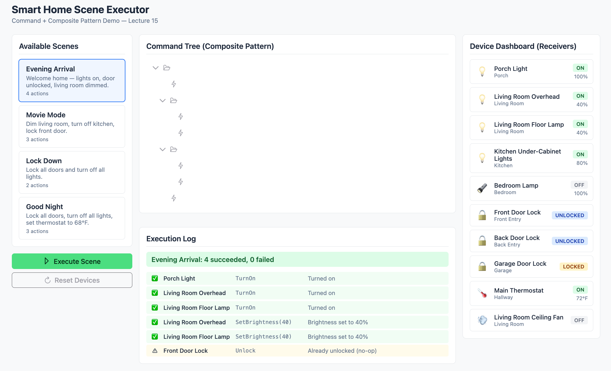

### What the Demo Shows

The demo brings together everything from Sections 2–4 in running TypeScript code:

```mermaid
flowchart TB
    JSON["scene-data.json"] --> LOAD["Load scenes & devices"]
    LOAD --> LIST["Scene List (select a scene)"]
    LIST --> TREE["Composite Tree (PrimeNG Tree)"]
    LIST --> EXEC["Execute button"]
    EXEC --> CMD["Build & run command tree"]
    CMD --> LOG["Execution Log (per-device results)"]
    CMD --> DASH["Device Dashboard (updated states)"]
```

| Demo Feature | Pattern Demonstrated |
|---|---|
| Each device operation is a class implementing `IDeviceCommand` | Command |
| `CompositeCommand` holds children and delegates `execute()` | Composite |
| PrimeNG Tree visualizes the command tree | Composite (tree structure) |
| Group actions resolve to individual device commands at runtime | Runtime target resolution |
| Execution continues on partial failure | Partial failure tolerance |
| Device dashboard updates after execution | Commands mutating receiver state |

### Key TypeScript Excerpts

The TypeScript implementation mirrors the C# patterns from the lecture. The command interface:

```typescript
export interface IDeviceCommand {
  /** Execute this command and return the result. */
  execute(): CommandResult;

  /** Human-readable label for tree display. */
  readonly label: string;
}
```

A leaf command:

```typescript
export class TurnOnCommand implements IDeviceCommand {
  readonly label: string;

  constructor(private readonly device: Device) {
    this.label = `TurnOn: ${device.name}`;
  }

  execute(): CommandResult {
    if (this.device.state === 'on') {
      return {
        deviceId: this.device.id,
        deviceName: this.device.name,
        operation: 'TurnOn',
        success: true,
        message: 'Already on',
      };
    }

    this.device.state = 'on';
    return {
      deviceId: this.device.id,
      deviceName: this.device.name,
      operation: 'TurnOn',
      success: true,
      message: 'Turned on',
    };
  }
}
```

The composite:

```typescript
export class CompositeCommand implements IDeviceCommand {
  readonly label: string;
  private readonly children: IDeviceCommand[] = [];

  constructor(name: string) {
    this.label = name;
  }

  add(child: IDeviceCommand): void {
    this.children.push(child);
  }

  getChildren(): readonly IDeviceCommand[] {
    return this.children;
  }

  execute(): CommandResult {
    const results = this.children.map((c) => c.execute());
    const succeeded = results.filter((r) => r.success).length;
    const failed = results.filter((r) => !r.success).length;

    return {
      deviceId: this.label,
      deviceName: this.label,
      operation: 'CompositeExecute',
      success: failed === 0,
      message: `${succeeded} succeeded, ${failed} failed`,
    };
  }
}
```

### PrimeNG Tree Visualization

The demo uses PrimeNG's `p-tree` component to render the composite structure. The command tree is converted to PrimeNG's `TreeNode` format:

```typescript
function toTreeNodes(command: IDeviceCommand): TreeNode {
  if (command instanceof CompositeCommand) {
    return {
      label: command.label,
      icon: 'pi pi-folder',
      expanded: true,
      children: command.getChildren().map(toTreeNodes),
    };
  }

  return {
    label: command.label,
    icon: 'pi pi-bolt',
    leaf: true,
  };
}
```

This maps the Composite pattern's recursive structure directly to the tree widget's recursive node structure — the same part-whole uniformity the pattern provides in code is visible in the UI.

### Running the Demo

```bash
cd presentations/15-command-and-composite-pattern-demos/angular-smart-home-scenes
npm install
ng serve
```

Open `http://localhost:4200` to interact with the scene executor.

---
## 6. Anti-Patterns and Failure Modes

### Command Mistakes

```mermaid
flowchart LR
    BAD("Command anti-patterns") --> A["Commands that know too much about other commands"]
    BAD --> B["Giant command classes that do multiple things"]
    BAD --> C["Using Command for trivial operations that need no encapsulation"]
    BAD --> D["Forgetting to capture pre-state when undo is needed"]
    BAD --> E["Commands that depend on execution order but have no ordering mechanism"]
```

- **God command**: a single command class that handles many operations with internal branching — this is just a disguised switch statement
- **Over-wrapping**: creating a `PrintHelloCommand` class to wrap `Console.WriteLine("Hello")` — the abstraction costs more than the code it replaces
- **Bypassing the state machine**: a command that sets `device.State = "on"` directly instead of calling `device.Execute(DeviceAction.PowerOn)` — this skips validation, breaks transition rules, and defeats the purpose of having a state machine
- **Stateless undo**: implementing `Undo()` without capturing the state needed to reverse the operation

### Composite Mistakes

```mermaid
flowchart LR
    BAD("Composite anti-patterns") --> A["Forcing tree structure on flat data"]
    BAD --> B["Leaf and composite with fundamentally different interfaces"]
    BAD --> C["Putting tree management methods on the component interface"]
    BAD --> D["Deep nesting when a flat list would suffice"]
    BAD --> E["Composite that leaks its children to callers who modify them"]
```

- **Forced hierarchy**: using Composite for a flat collection of items that never nest — a `List<T>` is simpler and clearer
- **Interface pollution**: putting `Add()` and `Remove()` on the `IDeviceCommand` interface so leaves must throw `NotImplementedException` — this violates ISP
- **Leaky composite**: exposing `Children` as a mutable list so callers can modify the tree behind the composite's back

### Scene-Specific Mistakes

- resolving group targets at definition time instead of execution time (stale device lists)
- coupling the command tree structure to the persistence model (the tree is an execution concept, not a storage concept)
- mixing execution results into the scene definition (the definition describes intent, not outcomes)

### The Smell to Notice

If execution code still contains branches like:

```csharp
if (action.IsGroup)
    // handle group differently
else
    // handle single device
```

then the Composite pattern has not done its job. The entire point is to eliminate that distinction.

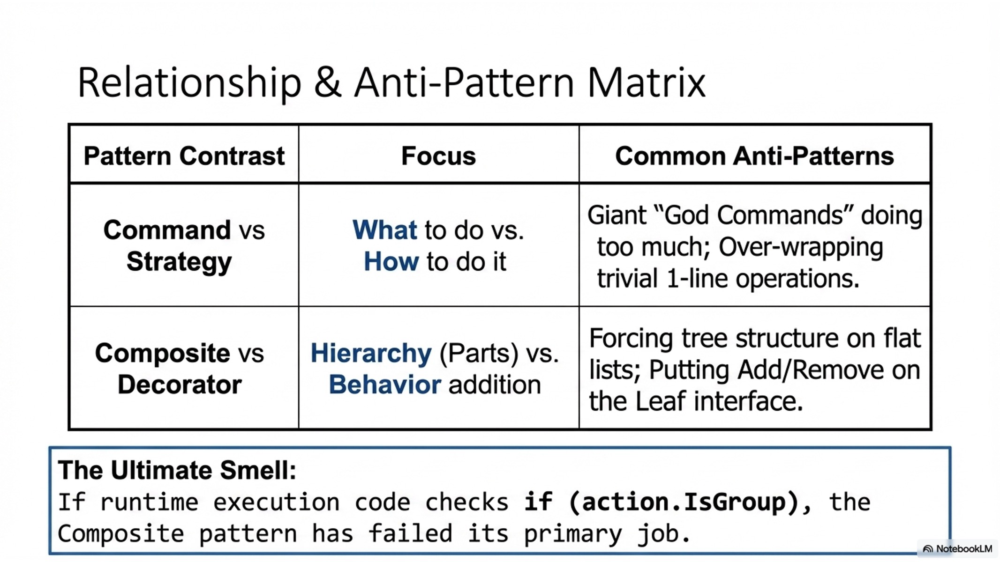

---
## 7. Relationship to Other Patterns

### Command vs Strategy

Both encapsulate behavior behind an interface. The difference is intent:

```mermaid
flowchart LR
    CMD["Command"] --> A["Encapsulates a request as an object"]
    CMD --> B["Focus: what to do (and possibly undo)"]
    CMD --> C["Often queued, logged, or composed"]

    STRAT["Strategy"] --> D["Encapsulates an algorithm variation"]
    STRAT --> E["Focus: how to do something"]
    STRAT --> F["Swapped to change behavior"]
```

**Command** answers: *do this specific thing*. **Strategy** answers: *use this approach for a general capability*.

### Composite vs Decorator

Both use recursive composition. The difference is purpose:

```mermaid
flowchart LR
    COMP["Composite"] --> A["Structures objects into trees"]
    COMP --> B["Uniform treatment of leaf and group"]
    COMP --> C["Focus: part-whole hierarchy"]

    DEC["Decorator"] --> D["Wraps a single object to add behavior"]
    DEC --> E["One wrapper per concern"]
    DEC --> F["Focus: adding responsibilities without subclassing"]
```

**Composite** answers: *how do I treat one thing and a group of things the same way?*  
**Decorator** answers: *how do I add behavior to an object without changing its class?*

### Tie Back to [Lecture 14](14-repository-and-builder-patterns.md): Builder and Repository

The four patterns across lectures 14 and 15 form a complete lifecycle:

```mermaid
flowchart TB
    B["Builder"] -->|produces| S["DeviceScene"]
    S -->|stored by| R["Repository"]
    R -->|loaded by| RESOLVE["Resolver"]
    RESOLVE -->|builds| CMD["Command tree"]
    CMD -->|structured as| COMP["Composite"]
    COMP -->|executed by| EXEC["SceneExecutor"]
```

Each pattern solves one problem cleanly. None tries to solve the others' problems.

### Command + Composite = Macro Command

The combination of Command and Composite is sometimes called the **Macro Command** pattern. A macro command is a composite that treats a group of commands as a single command. This is exactly what `CompositeCommand` does in the scene execution example.

This combination is one of the GoF's original motivating examples for Composite:

> "The Composite pattern lets you build up a macro command from simple commands."

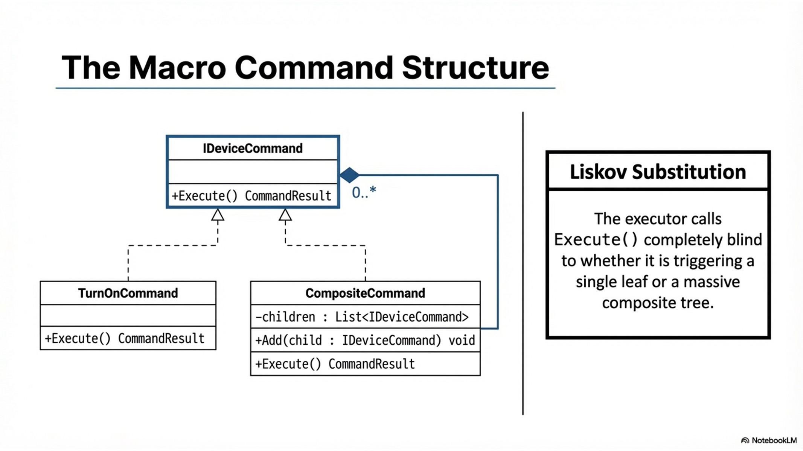

---
## 8. Real-World Summary

### Practical Guidance

- use **Command** when you need to treat an operation as an object — for queuing, logging, undo, or composition
- use **Composite** when you have tree-structured data and want uniform treatment of leaf and group
- the combination of Command + Composite is powerful for batch operations, macro commands, and scene execution
- start without these patterns when the code is simple, and refactor toward them when the complexity warrants it

### Decision Table

```mermaid
flowchart LR
    Q1{"Do you need to encapsulate<br/>operations as objects?"}
    Q1 -->|Yes| CMD["Consider Command"]
    Q1 -->|No| Q2{"Is a direct method<br/>call sufficient?"}
    Q2 -->|Yes| SKIP1["Skip Command"]

    Q3{"Do you have<br/>part-whole hierarchy?"}
    Q3 -->|Yes| COMP["Consider Composite"]
    Q3 -->|No| Q4{"Is a flat list<br/>sufficient?"}
    Q4 -->|Yes| SKIP2["Skip Composite"]
```

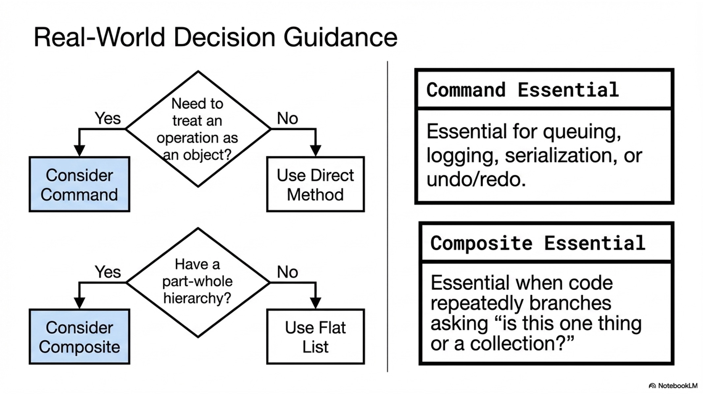

### Common Misconceptions

- "Command is just a wrapper around a method call."  
  It *can* be. But its value appears when you need undo, queuing, logging, or composition. Without those needs, it is indeed over-engineering.

- "Composite means everything has to be a tree."  
  No. Composite is for when tree structure already exists in the domain. Forcing tree structure onto flat data is an anti-pattern.

- "Command and Composite always go together."  
  They combine well, but each stands on its own. You can use Command without Composite (single operations with undo). You can use Composite without Command (UI component trees, file systems).

### The Main Rules to Remember

> **Command** turns operations into objects so they can be passed, stored, queued, logged, composed, or undone.

> **Composite** lets a group of things look like a single thing so callers stop branching on "is this one or many?"

---
## Study Guide

### Core Definitions

- **Command pattern**: a behavioral pattern that encapsulates a request as an object, allowing parameterization, queuing, logging, and undo
- **Invoker**: the object that triggers command execution without knowing what the command does
- **Receiver**: the object that performs the actual work when a command executes
- **Composite pattern**: a structural pattern that composes objects into tree structures for uniform treatment of individuals and groups
- **Leaf**: a terminal node in a composite tree with no children
- **Composite**: a node that holds children and delegates operations to them
- **Macro Command**: a composite command that executes a group of commands as a single unit

### Fast Recall Diagram

```mermaid
flowchart TB
    SCENE["DeviceScene definition"] --> RESOLVE["Resolve targets"]
    RESOLVE --> TREE["Command tree (Composite)"]
    TREE --> LEAF1["Leaf: TurnOnCommand"]
    TREE --> LEAF2["Leaf: SetBrightnessCommand"]
    TREE --> LEAF3["Leaf: UnlockCommand"]
    TREE --> EXEC["Execute()"]
    EXEC --> RESULTS["Per-device results"]
```

### Boundary Checklist

- does each command class encapsulate exactly one operation?
- does the composite delegate to children without knowing their concrete types?
- are group targets resolved at execution time, not definition time?
- can a new device operation be added without modifying the executor or existing commands?
- does the composite continue on partial failure and collect per-device results?
- is the command tree an execution concept separate from the persistence model?

### Sample Exam Questions

1. What problem does the Command pattern solve that a direct method call does not?
2. Name the five roles in the canonical GoF Command pattern and explain how they map to the scene execution example.
3. What is the defining structural characteristic of the Composite pattern?
4. Why does the project specification require group target resolution at execution time rather than definition time?
5. How do Command and Composite combine to form a macro command? What advantage does this provide?
6. When would you choose *not* to use the Command pattern?
7. Why is it important that `CompositeCommand` implements `IDeviceCommand` rather than being a separate type?
8. How does partial failure handling in scene execution demonstrate the Composite pattern's value?

### Scenario Drills

- You have a growing switch statement that dispatches device operations by string name. Which pattern helps first?
- You need to support undo for device operations. Which pattern helps, and what additional state must each command capture?
- Your scene execution code branches on "is this a single device or a group?" at every level. Which pattern eliminates this?
- A teammate proposes putting `Add()` and `Remove()` on the `IDeviceCommand` interface. What SOLID principle does this violate?

### Scenario Drill Answers

- growing switch on operation type: **Command** — each operation becomes its own class
- undo support: **Command** with state capture — each command stores pre-execution state in a field and implements `Undo()`
- branching on single vs. group: **Composite** — both implement the same interface
- `Add()`/`Remove()` on the component interface: violates **ISP** — leaves are forced to implement tree management they do not need

---
## Appendix 1: Undo/Redo with Command

This appendix explores Command's undo/redo capability using a **drawing application** example rather than the scene domain. For a thorough treatment of this topic, see the Command pattern chapter in *Head First Design Patterns* (Freeman & Robson).

### The Drawing App Domain

A simple drawing application supports three operations:

- add a shape to the canvas
- move a shape to a new position
- delete a shape from the canvas

Each operation must be undoable and redoable.

### Command Interface with Undo

```csharp
public interface IDrawCommand
{
    void Execute();
    void Undo();
    string Description { get; }
}
```

### Concrete Commands

```csharp
public sealed class AddShapeCommand : IDrawCommand
{
    private readonly Canvas _canvas;
    private readonly Shape _shape;

    public string Description => $"Add {_shape.Type} at ({_shape.X}, {_shape.Y})";

    public AddShapeCommand(Canvas canvas, Shape shape)
    {
        _canvas = canvas;
        _shape = shape;
    }

    public void Execute() => _canvas.Add(_shape);
    public void Undo() => _canvas.Remove(_shape);
}

public sealed class MoveShapeCommand : IDrawCommand
{
    private readonly Shape _shape;
    private readonly int _newX;
    private readonly int _newY;
    private int _previousX;
    private int _previousY;

    public string Description
        => $"Move {_shape.Type} from ({_previousX},{_previousY}) to ({_newX},{_newY})";

    public MoveShapeCommand(Shape shape, int newX, int newY)
    {
        _shape = shape;
        _newX = newX;
        _newY = newY;
    }

    public void Execute()
    {
        _previousX = _shape.X;
        _previousY = _shape.Y;
        _shape.X = _newX;
        _shape.Y = _newY;
    }

    public void Undo()
    {
        _shape.X = _previousX;
        _shape.Y = _previousY;
    }
}

public sealed class DeleteShapeCommand : IDrawCommand
{
    private readonly Canvas _canvas;
    private readonly Shape _shape;

    public string Description => $"Delete {_shape.Type}";

    public DeleteShapeCommand(Canvas canvas, Shape shape)
    {
        _canvas = canvas;
        _shape = shape;
    }

    public void Execute() => _canvas.Remove(_shape);
    public void Undo() => _canvas.Add(_shape);
}
```

### The Undo/Redo Mechanism

The undo/redo mechanism uses two stacks:

```mermaid
classDiagram
    class CommandHistory {
        -undoStack : Stack~IDrawCommand~
        -redoStack : Stack~IDrawCommand~
        +ExecuteCommand(cmd : IDrawCommand) void
        +Undo() void
        +Redo() void
        +CanUndo : bool
        +CanRedo : bool
    }

    class IDrawCommand {
        <<interface>>
        +Execute() void
        +Undo() void
        +Description : string
    }

    CommandHistory --> "0..*" IDrawCommand
```

```csharp
public sealed class CommandHistory
{
    private readonly Stack<IDrawCommand> _undoStack = new();
    private readonly Stack<IDrawCommand> _redoStack = new();

    public bool CanUndo => _undoStack.Count > 0;
    public bool CanRedo => _redoStack.Count > 0;

    public void ExecuteCommand(IDrawCommand command)
    {
        command.Execute();
        _undoStack.Push(command);
        _redoStack.Clear(); // new action invalidates redo history
    }

    public void Undo()
    {
        if (!CanUndo) return;

        var command = _undoStack.Pop();
        command.Undo();
        _redoStack.Push(command);
    }

    public void Redo()
    {
        if (!CanRedo) return;

        var command = _redoStack.Pop();
        command.Execute();
        _undoStack.Push(command);
    }
}
```

### Undo/Redo Sequence

```mermaid
sequenceDiagram
    participant User
    participant History as CommandHistory
    participant Cmd as IDrawCommand
    participant Canvas

    User->>History: ExecuteCommand(AddShape)
    History->>Cmd: Execute()
    Cmd->>Canvas: Add(circle)
    History->>History: Push to undo stack

    User->>History: ExecuteCommand(MoveShape)
    History->>Cmd: Execute()
    Cmd->>Canvas: Move circle to (50,50)
    History->>History: Push to undo stack

    User->>History: Undo()
    History->>History: Pop from undo stack
    History->>Cmd: Undo()
    Cmd->>Canvas: Move circle back to (0,0)
    History->>History: Push to redo stack

    User->>History: Redo()
    History->>History: Pop from redo stack
    History->>Cmd: Execute()
    Cmd->>Canvas: Move circle to (50,50)
    History->>History: Push to undo stack
```

### The Key Insight: Commands Must Capture State

For undo to work, each command must capture enough state to reverse its operation:

| Command | State to Capture |
|---|---|
| AddShape | Reference to the shape (so it can be removed) |
| MoveShape | Previous position (so it can move back) |
| DeleteShape | Reference to the shape (so it can be re-added) |

If a command does not capture pre-execution state, `Undo()` has nothing to work with.

### When Undo/Redo Is NOT Worth the Cost

Undo/redo is powerful, but it adds real complexity. Every command must capture pre-execution state, the history stacks consume memory proportional to the number of operations, and the undo logic must perfectly mirror the forward logic — a subtle source of bugs.

```mermaid
flowchart LR
    GOOD("Good fit for undo/redo") --> A["Interactive user-facing tools"]
    GOOD --> B["Text editors, drawing apps, form builders"]
    GOOD --> C["Operations the user expects to reverse"]

    BAD("Poor fit for undo/redo") --> D["Backend service operations"]
    BAD --> E["Fire-and-forget jobs or event pipelines"]
    BAD --> F["Operations with external side effects (emails, payments, API calls)"]
```

The practical rule:

> Undo/redo is warranted for **user-facing interactive tools** where the user expects to experiment and reverse mistakes. It is rarely appropriate for backend service operations, where compensating transactions, event sourcing, or saga patterns are better answers to the reversal problem.

If you find yourself adding `Undo()` to commands that send emails, charge credit cards, or write to external systems, reconsider. Those operations are not reversible in the undo/redo sense — they require domain-specific compensation logic that does not fit neatly into a history stack.

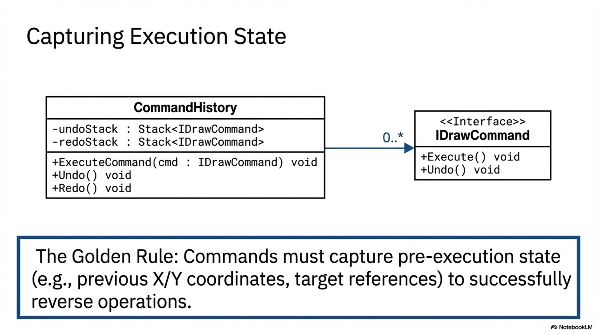

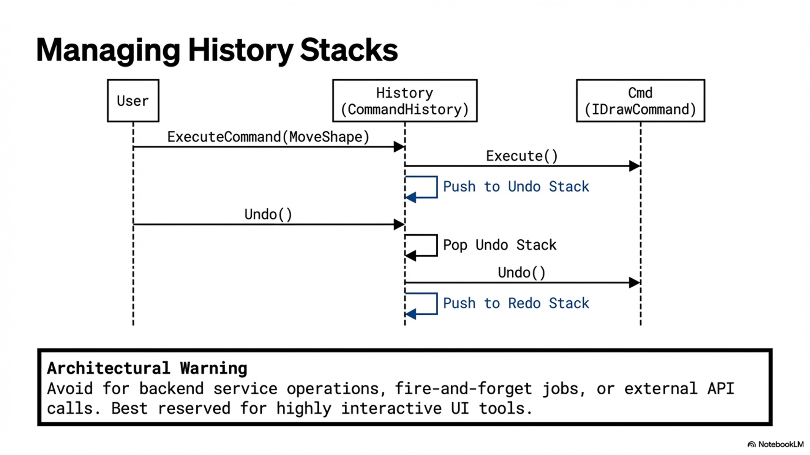

### Further Reading

The undo/redo variant of Command is covered in depth in:

- *Head First Design Patterns* (Freeman & Robson) — Chapter 6: The Command Pattern
- *Design Patterns: Elements of Reusable Object-Oriented Software* (GoF) — Command pattern section

The *Head First* treatment is particularly accessible and includes a remote control example that builds from simple commands to undo and macro commands.
