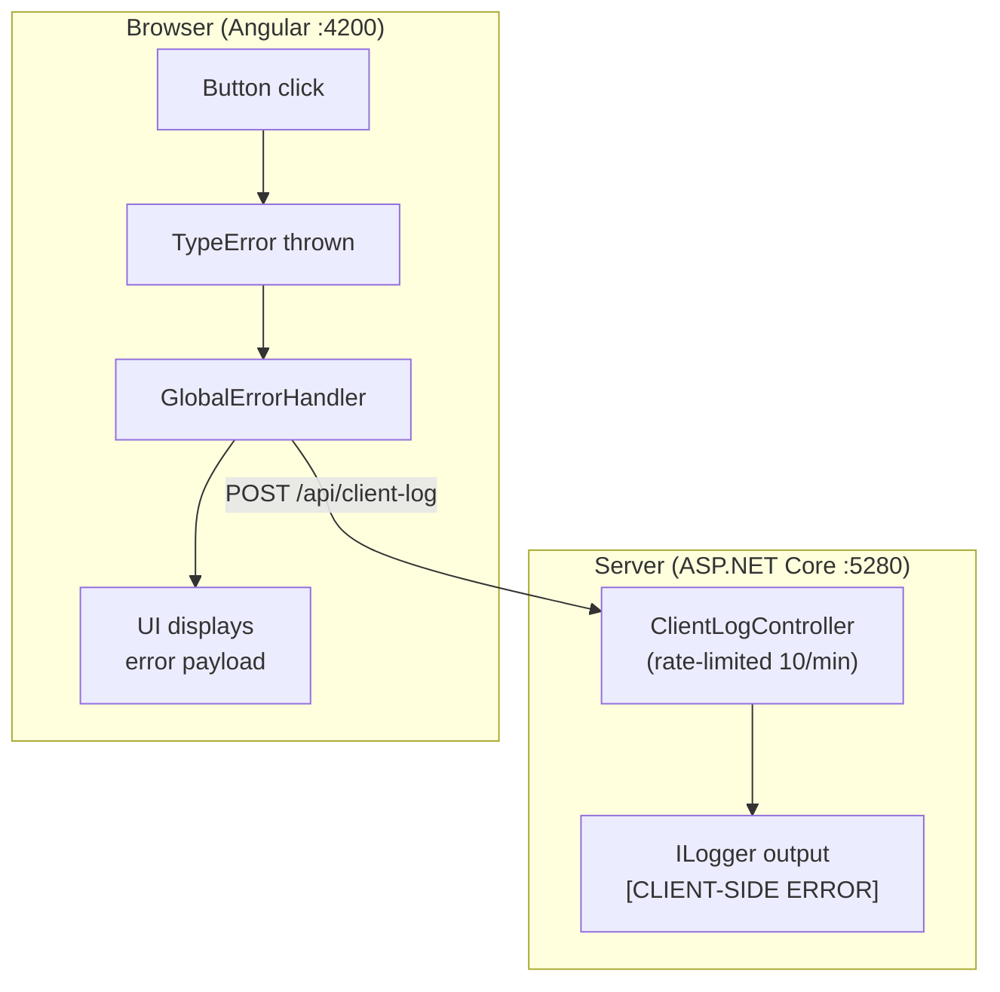
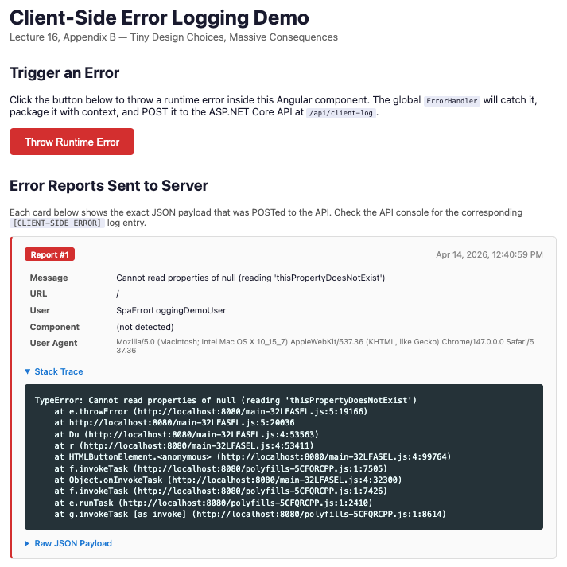
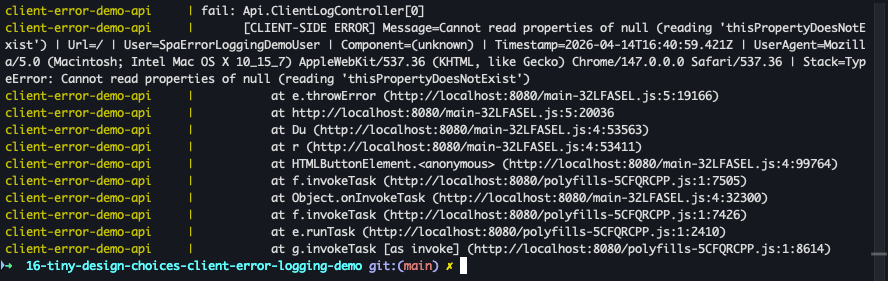
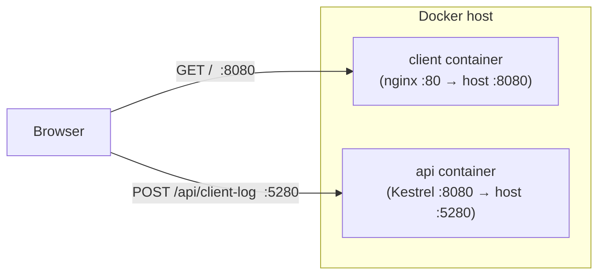

# Client-Side Error Logging Demo

Lecture 16, Appendix B — Tiny Design Choices, Massive Consequences

Demonstrates how runtime errors in an Angular SPA can be captured, packaged with context, and forwarded to an ASP.NET Core API for server-side logging.

## Architecture



#### Angular Demo UI



#### API Demo Console Output



## Running the Demo

Two options — pick whichever fits your setup.

### Option A — Docker (recommended)

Only prerequisite: [Docker Desktop](https://www.docker.com/products/docker-desktop/) (or Docker Engine + Compose).

```bash
docker compose up --build
```

This builds and starts both containers:

| Container | Host port | Container port | What runs |
|---|---|---|---|
| `client-error-demo-client` | 8080 | 80 | nginx serving production Angular build |
| `client-error-demo-api` | 5280 | 8080 | ASP.NET Core API |

Open http://localhost:8080 and click **Throw Runtime Error**. The API container's stdout (visible in the `docker compose` terminal) will show the `[CLIENT-SIDE ERROR]` log entry.

To stop and clean up:

```bash
docker compose down
```

### Option B — Local Dev Servers

Prerequisites:

- .NET 10+ SDK
- Node.js 18+ and npm
- Angular CLI (`npm install -g @angular/cli`)

Open two terminals:

```bash
# Terminal 1 — API (port 5280)
cd Api
dotnet run
```

```bash
# Terminal 2 — Angular client (port 4200)
cd client
ng serve
```

Open http://localhost:4200 and click **Throw Runtime Error**.

## What to Look For

- The Angular UI will display the error report payload that was sent to the server.
- The API's console output (or the `docker compose` logs) will show a `[CLIENT-SIDE ERROR]` log entry with the full details.

## Docker Architecture Notes



The Angular code runs in the **browser**, not inside the client container — so it calls the API at `http://localhost:5280` (the host-mapped port), **not** at the internal Docker service name. The API's CORS policy allows both `http://localhost:4200` (dev server) and `http://localhost:8080` (containerized client).
