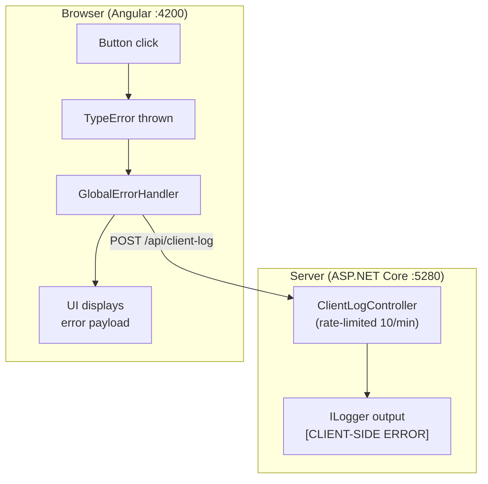

# Client-Side Error Logging Demo

Lecture 16, Appendix B — Tiny Design Choices, Massive Consequences

Demonstrates how runtime errors in an Angular SPA can be captured, packaged with context, and forwarded to an ASP.NET Core API for server-side logging.

## Architecture



## Prerequisites

- .NET 8+ SDK
- Node.js 18+ and npm
- Angular CLI (`npm install -g @angular/cli`)

## Running the Demo

Open two terminals:

### Terminal 1 — API (port 5280)

```bash
cd Api
dotnet run
```

### Terminal 2 — Angular Client (port 4200)

```bash
cd client
ng serve
```

Open http://localhost:4200 and click **Throw Runtime Error**.

- The Angular UI will display the error report payload that was sent to the server.
- The API terminal will show a `[CLIENT-SIDE ERROR]` log entry with the full details.
