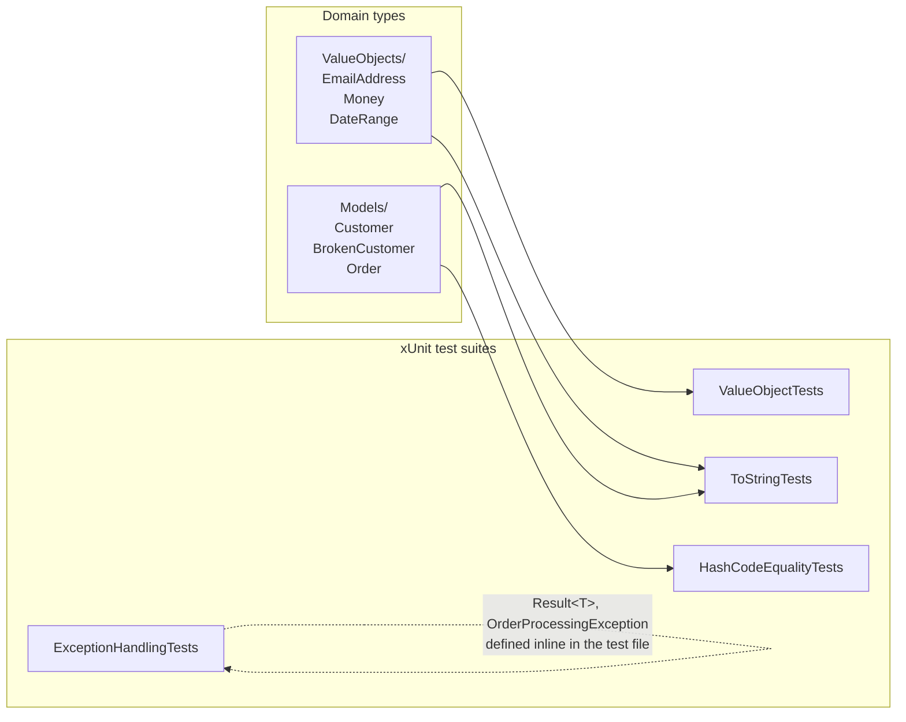

# Tiny Design Choices Demo

Companion xUnit project for [Lecture 16 — Tiny Design Choices, Massive Consequences](../16-tiny-design-choices.md).

Each test class demonstrates one of the four topics from the lecture. The tests are designed to be read as examples — each one shows a specific correct behavior or the bug that happens when a rule is broken. Read the test name, the arrange/act/assert, and the comments together.

## What It Demonstrates

| Topic | Test Class | What You'll Learn |
|---|---|---|
| Value Objects & Primitive Obsession | `ValueObjectTests` | Validation at construction, value equality, immutability, invariants |
| ToString Overrides | `ToStringTests` | Default output is useless; overrides appear in logs, interpolation, assertions |
| GetHashCode & Equality | `HashCodeEqualityTests` | Correct vs. broken hash codes, the "phantom lost object" bug in HashSet/Dictionary |
| Exception Handling | `ExceptionHandlingTests` | Control-flow anti-patterns, stack-trace preservation, custom exceptions |

## Architecture



The domain types live outside the `Tests/` folder so they can be reused across test classes. Each test class targets **one** lecture topic so you can run (or read) them independently.

## Prerequisites

- .NET 10+ SDK (`dotnet --version` should print 10.x or higher)

## Running the Tests

```bash
cd TinyDesignChoicesDemo
dotnet test
```

Expected result: **34 passing tests, 0 failing.**

### Seeing the Narrated Output

Every test writes a short, annotated story to its output stream — input values, computed hash codes, exception types and messages, before/after state, expected-vs-actual. To see it, run with the detailed console logger:

```bash
dotnet test --logger "console;verbosity=detailed"
```

For a single test (the flagship phantom-bug demo):

```bash
dotnet test --logger "console;verbosity=detailed" \
  --filter "BrokenCustomer_LostInHashSet_AfterMutation"
```

Sample output:

```
*** DEMONSTRATING THE 'PHANTOM LOST OBJECT' BUG ***
Inserted BrokenCustomer(Id=1, Name=Alice) into HashSet (hash = -416835904).
Set count: 1
Mutated Name → now BrokenCustomer(Id=1, Name=Alice Smith) (hash = -580253946).
Hash CHANGED: -416835904 → -580253946   (BrokenCustomer includes Name in GetHashCode).
Set still has 1 item — the object is physically there.
But set.Contains(alice)? False   (FALSE — looking in wrong bucket!)
This is the silent bug: the object exists in the set but cannot be found.
```

Read the output alongside the test source — each test is designed to be a short, self-explanatory walkthrough of one concept.

Run a single topic:

```bash
dotnet test --filter "FullyQualifiedName~ValueObjectTests"
dotnet test --filter "FullyQualifiedName~ToStringTests"
dotnet test --filter "FullyQualifiedName~HashCodeEqualityTests"
dotnet test --filter "FullyQualifiedName~ExceptionHandlingTests"
```

## Important Code to Read

### 1. Value Objects — `ValueObjects/EmailAddress.cs`

A `sealed record` that validates at construction and normalizes to lowercase. Attempting to create an `EmailAddress` with no `@` throws — so any `EmailAddress` instance in the rest of your program is guaranteed to be valid.

Pay attention to:
- **`EmailAddress_NormalizesToLowerCase`** — validation transforms input, not just rejects it
- **`EmailAddress_EqualByValue`** — two instances with the same value are `==`, even though they are separate objects
- **`Money_CannotAddDifferentCurrencies`** — shows how value objects enforce domain invariants (you cannot add USD to EUR)
- **`DateRange_SafeAsDictionaryKey`** — immutable value objects are safe hash-based collection keys

### 2. GetHashCode Bug — `Models/Customer.cs` vs `Models/BrokenCustomer.cs`

This is the most important pair of files in the project. Compare them side by side:

- **`Customer`**: `GetHashCode` returns `Id.GetHashCode()` — based only on the **immutable** `Id` field. Safe to mutate `Name` after insertion.
- **`BrokenCustomer`**: `GetHashCode` returns `HashCode.Combine(Id, Name)` — includes the **mutable** `Name` field. Mutating `Name` after insertion breaks lookup.

Then run `HashCodeEqualityTests`:

- **`Customer_StableInHashSet_AfterMutation`** — correct behavior: object still findable after mutation
- **`BrokenCustomer_LostInHashSet_AfterMutation`** — the phantom bug: the object is physically still in the set (`set.Count == 1`) but `set.Contains(alice)` returns `false`
- **`BrokenCustomer_SetCountStillShowsObject`** — makes the phantom behavior explicit

This is the kind of bug that is nearly impossible to diagnose from symptoms alone. Running these tests makes it concrete.

### 3. ToString — `Models/Order.cs` vs `OrderWithoutToString`

Two nearly identical classes, one with a `ToString` override and one without. The test `Order_WithoutOverride_ShowsTypeName` asserts that the default output is literally just `TinyDesignChoicesDemo.Models.OrderWithoutToString` — nothing useful for debugging. Compare to `Order_WithOverride_ShowsUsefulInfo` to see what a good override looks like.

### 4. Exception Handling — `Tests/ExceptionHandlingTests.cs`

Six paired tests showing anti-patterns vs. correct patterns:

- **`Bad_UsingExceptionsForControlFlow`** / **`Good_UsingTryParse`** — why `TryParse` is the right tool for expected invalid input
- **`Bad_LosingStackTrace`** / **`Good_PreservingStackTrace`** — why you always pass the inner exception when wrapping
- **`CustomException_CarriesDomainContext`** — custom exception types carry structured data (`OrderId`) the caller can act on

The file also defines `OrderProcessingException` and a minimal `Result<T>` record inline at the bottom to keep the demo self-contained.

## Suggested Reading Order

1. Start with the lecture: [16-tiny-design-choices.md](../16-tiny-design-choices.md)
2. Read `ValueObjects/EmailAddress.cs` — the cleanest example of the pattern
3. Run `dotnet test` and watch all 36 tests pass
4. Open `Models/Customer.cs` and `Models/BrokenCustomer.cs` side by side, then read `HashCodeEqualityTests.cs` to see the phantom bug in action
5. Scan `ExceptionHandlingTests.cs` to see the anti-patterns and their fixes as runnable assertions

## Project Layout

```
TinyDesignChoicesDemo/
├── TinyDesignChoicesDemo.csproj   # net10.0, xunit, nullable enabled
├── ValueObjects/
│   ├── EmailAddress.cs            # validating string wrapper
│   ├── Money.cs                   # amount + currency invariant
│   └── DateRange.cs               # start ≤ end invariant
├── Models/
│   ├── Order.cs                   # ToString override + OrderWithoutToString
│   └── Customer.cs                # Customer (correct) + BrokenCustomer (phantom bug)
└── Tests/
    ├── ValueObjectTests.cs        # 14 tests
    ├── ToStringTests.cs           #  6 tests
    ├── HashCodeEqualityTests.cs   #  8 tests
    └── ExceptionHandlingTests.cs  #  6 tests
```
