# Tiny Design Choices, Massive Consequences

### Four Habits That Separate Fragile Code from Professional-Grade Systems

##### [Powerpoint Presentation](16-tiny-design-choices.pptx) | [PDF](16-tiny-design-choices.pdf) | [Video](16-tiny-design-choices.mp4)

---

Every production outage has a root cause. Sometimes it is a missing feature or a broken algorithm, but surprisingly often the cause — or the reason it took so long to diagnose — is something small: a raw `string` where a type should have been, a hash code that silently shifted after insertion, a swallowed exception that hid the real failure for months, or a default `ToString` that turned an incident into a three-hour debugging session because nobody could tell which object was in the failing log line.

These are not exotic design problems. They are **tiny choices** that developers make dozens of times per day, usually on autopilot. Some of them — primitive obsession, broken hash codes, swallowed exceptions — cause the bug itself. Others — like a missing `ToString` override — do not cause bugs, but they make every bug in your codebase harder to see, harder to log, and harder to fix. Either way, the consequences are disproportionately large: data corruption, phantom bugs, security leaks, and hours of wasted debugging time.

This lecture examines four of these choices:

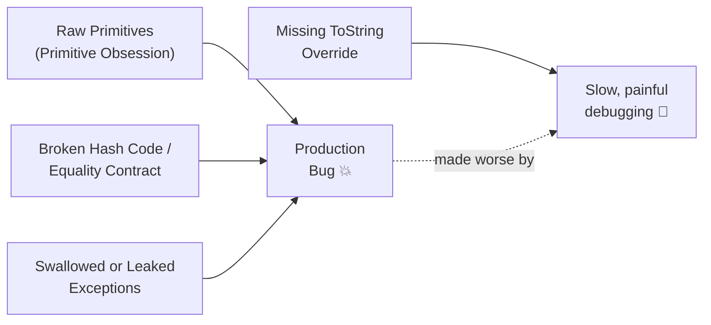

Each topic is self-contained, but they reinforce each other. Value objects solve primitive obsession **and** give you a natural place for `ToString` and `GetHashCode`. Proper equality contracts prevent phantom collection bugs. Good exception handling keeps error information where it belongs — in the server log, not in the client response.

These choices sit alongside the architectural patterns from earlier lectures rather than replacing them. Value objects live in the domain layer from [Lecture 11](11-mvc-di-srv-domain.md), are constructed by the builders from [Lecture 14](14-repository-and-builder-patterns.md), cross the repository boundary also defined there, and serve as the parameters carried by commands in [Lecture 15](15-command-and-composite-patterns.md). A robust architecture depends on both: the big structural decisions **and** the tiny habits that keep the small pieces correct.

> The difference between a junior developer and a senior one is not the patterns they know — it is the small habits they have internalized.

---
## Table of Contents

- [1. Value Objects and the Primitive Obsession Anti-Pattern](#1-value-objects-and-the-primitive-obsession-anti-pattern)
- [2. Overriding ToString (and Its Equivalents)](#2-overriding-tostring-and-its-equivalents)
- [3. GetHashCode, hashCode, and the Equality Contract](#3-gethashcode-hashcode-and-the-equality-contract)
- [4. Exception Handling Done Right](#4-exception-handling-done-right)
- [5. Connecting the Dots](#5-connecting-the-dots)
- [Appendix A: Language Comparison Quick Reference](#appendix-a-language-comparison-quick-reference)
- [Appendix B: Logging Client-Side Errors on the Server](#appendix-b-logging-client-side-errors-on-the-server)

---
## 1. Value Objects and the Primitive Obsession Anti-Pattern

### The Bug

A support ticket arrives: *"Customer received someone else's order confirmation email."*

After hours of investigation, the team finds this method signature:

```csharp
// C#
public void SendConfirmation(string email, string orderId, string customerId)
{
    // ...
}
```

Somewhere upstream, a caller swapped the arguments:

```csharp
SendConfirmation(customer.Id, order.Id, customer.Email); // compiles fine, runs wrong
```

The compiler cannot help. Every parameter is a `string`. The type system sees no difference between an email address, an order ID, and a customer ID. This is **primitive obsession**.

### What Is Primitive Obsession?

Primitive obsession is a code smell where domain concepts are represented using built-in primitive types (`string`, `int`, `double`) instead of small, purpose-built types. Symptoms include:

- **Method signatures full of strings**: `void Register(string name, string email, string phone)`
- **Validation scattered everywhere**: The same email regex appears in six different files
- **Meaningless comparisons**: Nothing stops you from comparing an email to a phone number
- **Silent corruption**: Invalid values propagate unchecked until they cause damage far from the source

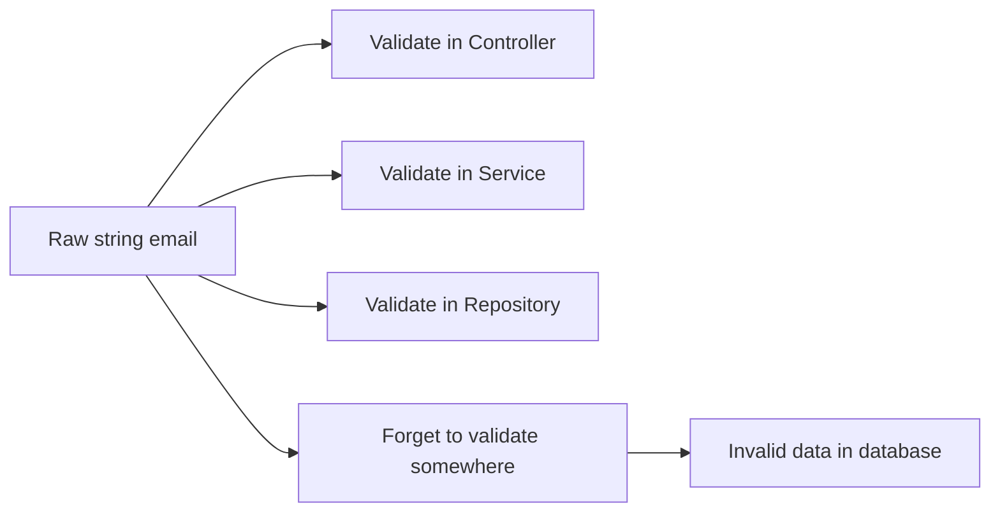

### Value Objects as the Cure

A **value object** is a small, immutable type that:

1. **Wraps** a primitive (or a small group of primitives)
2. **Validates** at construction — if it exists, it is valid
3. **Compares by value** — two `EmailAddress` objects with the same address are equal
4. **Is immutable** — once created, it cannot change

> If it exists, it is valid. If two instances hold the same data, they are equal. If you need a different value, create a new instance.

### EmailAddress — Three Languages

**C#** — using a `record` for automatic value equality:

```csharp
public sealed record EmailAddress
{
    public string Value { get; }

    public EmailAddress(string value)
    {
        if (string.IsNullOrWhiteSpace(value))
            throw new ArgumentException("Email cannot be empty.", nameof(value));
        if (!value.Contains('@'))
            throw new ArgumentException($"'{value}' is not a valid email.", nameof(value));

        Value = value.Trim().ToLowerInvariant();
    }

    public override string ToString() => Value;
}
```

**Java** — using a `record` (Java 16+):

```java
public record EmailAddress(String value) {

    public EmailAddress {
        if (value == null || value.isBlank())
            throw new IllegalArgumentException("Email cannot be empty.");
        if (!value.contains("@"))
            throw new IllegalArgumentException("'" + value + "' is not a valid email.");
        value = value.trim().toLowerCase();
    }

    @Override
    public String toString() {
        return value;
    }
}
```

**TypeScript** — using an immutable class with a factory method:

```typescript
export class EmailAddress {
    private constructor(public readonly value: string) {}

    static create(raw: string): EmailAddress {
        if (!raw || !raw.trim())
            throw new Error("Email cannot be empty.");
        if (!raw.includes("@"))
            throw new Error(`'${raw}' is not a valid email.`);
        return new EmailAddress(raw.trim().toLowerCase());
    }

    equals(other: EmailAddress): boolean {
        return this.value === other.value;
    }

    toString(): string {
        return this.value;
    }
}
```

Now the original bug is impossible:

```csharp
public void SendConfirmation(EmailAddress email, OrderId orderId, CustomerId customerId)
{
    // swapping arguments is now a compile-time error
}
```

### Money — A Value Object With Multiple Fields

Value objects are not limited to wrapping a single primitive. `Money` wraps an amount and a currency, and its invariant prevents mixing currencies:

```csharp
// C#
public sealed record Money(decimal Amount, string Currency)
{
    public Money Add(Money other)
    {
        if (Currency != other.Currency)
            throw new InvalidOperationException(
                $"Cannot add {Currency} to {other.Currency}.");
        return this with { Amount = Amount + other.Amount };
    }

    public override string ToString() => $"{Amount:F2} {Currency}";
}
```

```java
// Java
public record Money(BigDecimal amount, String currency) {

    public Money add(Money other) {
        if (!currency.equals(other.currency()))
            throw new IllegalArgumentException(
                "Cannot add " + currency + " to " + other.currency());
        return new Money(amount.add(other.amount()), currency);
    }

    @Override
    public String toString() {
        // Always pass a RoundingMode — setScale(2) alone throws
        // ArithmeticException when the amount has more than 2 decimal places.
        return amount.setScale(2, RoundingMode.HALF_UP) + " " + currency;
    }
}
```

```typescript
// TypeScript
export class Money {
    private constructor(
        public readonly amount: number,
        public readonly currency: string
    ) {}

    static of(amount: number, currency: string): Money {
        return new Money(amount, currency);
    }

    add(other: Money): Money {
        if (this.currency !== other.currency)
            throw new Error(`Cannot add ${this.currency} to ${other.currency}`);
        return Money.of(this.amount + other.amount, this.currency);
    }

    toString(): string {
        return `${this.amount.toFixed(2)} ${this.currency}`;
    }
}
```

### DateRange — An Invariant Between Two Fields

```csharp
// C#
public sealed record DateRange
{
    public DateOnly Start { get; }
    public DateOnly End { get; }

    public DateRange(DateOnly start, DateOnly end)
    {
        if (start > end)
            throw new ArgumentException(
                $"Start ({start}) must not be after End ({end}).");
        Start = start;
        End = end;
    }

    public bool Contains(DateOnly date) => date >= Start && date <= End;

    public override string ToString() => $"{Start} to {End}";
}
```

> C# records do not support a Java-style compact validation block. Validate in an explicit constructor and assign the properties yourself, or use a static factory method that throws before calling the generated constructor.

### Validation at the Boundary

The key insight is that validation happens **once**, at construction. Everything downstream can trust the type:

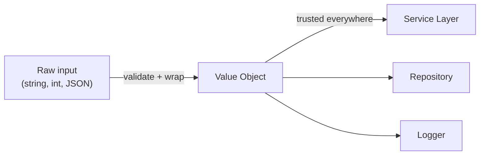

Compare this to the earlier diagram where validation was scattered. The value object creates a **trust boundary**: raw input enters on the left, validated domain types flow to the right.

### When NOT to Wrap

Not every primitive needs a value object. Guidelines:

| Wrap it | Leave it primitive |
|---|---|
| It has validation rules | It is a loop counter or array index |
| It appears in method signatures alongside other same-typed values | It is purely internal to a single method |
| It has domain meaning (email, currency, temperature) | It is a simple flag or configuration toggle |
| Getting it wrong causes a bug far from the source | Misuse would be caught immediately |

### Library Recommendations

You do not always need to build value objects from scratch:

- **C#**: [ValueOf](https://github.com/mcintyre321/ValueOf) — a lightweight base class that handles equality, `ToString`, and comparison boilerplate
- **Java**: [Immutables](https://immutables.github.io/) for day-to-day productivity with annotation-driven code generation; [jMolecules](https://github.com/xmolecules/jmolecules) if your team wants to emphasize DDD vocabulary and design intent
- **TypeScript**: No dominant library exists. Use **branded types** for compile-time safety with zero runtime overhead, and **immutable classes** with `readonly` fields and factory methods for runtime validation

#### TypeScript Branded Types

TypeScript's structural type system means two types with the same shape are interchangeable. Branded types add a phantom property to create nominal typing at compile time:

```typescript
type EmailAddress = string & { readonly __brand: unique symbol };
type CustomerId = string & { readonly __brand: unique symbol };

function createEmail(raw: string): EmailAddress {
    if (!raw.includes("@")) throw new Error("Invalid email");
    return raw as EmailAddress;
}

function createCustomerId(raw: string): CustomerId {
    return raw as CustomerId;
}

// Now the compiler catches swapped arguments:
function sendConfirmation(email: EmailAddress, id: CustomerId): void { /* ... */ }

const email = createEmail("alice@example.com");
const id = createCustomerId("CUST-42");

sendConfirmation(email, id);  // ✅ compiles
sendConfirmation(id, email);  // ❌ compile error
```

This costs nothing at runtime — the brand exists only in the type system.

### SOLID Connection

- **SRP**: Validation logic lives inside the value object, not scattered across controllers, services, and repositories
- **OCP**: Adding a new validation rule (e.g., blocking disposable email domains) changes only the `EmailAddress` class, not every caller
- **DIP**: Higher-level code depends on the abstraction (`EmailAddress`) rather than the raw primitive (`string`)

> **See it run**: [`Tests/ValueObjectTests.cs`](16-tiny-design-choices-demo/) — normalization at construction (`EmailAddress` lowercases its input), value-based equality between separate object references, the `Money.Add(usd, eur)` invariant rejecting currency mixing, and an immutable `DateRange` used safely as a `Dictionary` key.

### The Debugging Session That Didn't Have to Be Painful

A developer is debugging an order processing failure. The log file reads:

```
[ERROR] Failed to process order: MyApp.Models.Order
```

That is the **entire** error message. The default `ToString` returned the type name and nothing else. The bug itself is somewhere else in the code — maybe a bad input, maybe a race condition — but the missing `ToString` override is what turned a five-minute investigation into a two-hour one. The developer now has to reproduce the failure, attach a debugger, and inspect the object manually. If this happened in production at 3 AM, that is not an option.

> A missing `ToString` override does not cause defects. It amplifies the cost of every defect you already have, and it slows down the normal work of understanding your own running code.

### Why ToString Matters

`ToString` (C#), `toString` (Java), and `toString` (TypeScript/JavaScript) are called in more places than most developers realize:

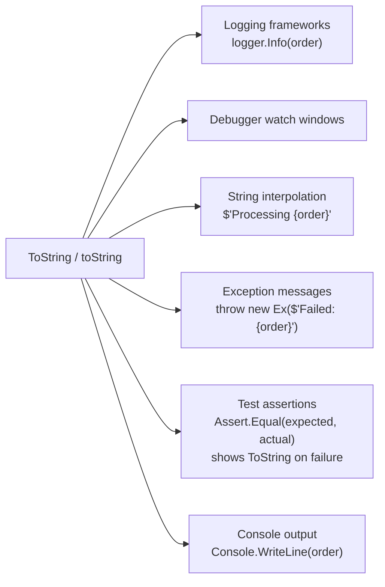

A good `ToString` override improves **every one** of these scenarios for free.

### The Default Is Almost Always Useless

| Language | Default ToString Output |
|---|---|
| C# (class) | `MyApp.Models.Order` (fully qualified type name) |
| C# (record) | `Order { Id = 42, Status = Pending }` (auto-generated, actually useful) |
| Java (class) | `Order@3f2a1b7c` (type name + hash code in hex) |
| Java (record) | `Order[id=42, status=Pending]` (auto-generated, actually useful) |
| TypeScript | `[object Object]` (completely useless) |

Records in C# and Java generate a useful `ToString` automatically. For everything else, you must override it yourself.

### Examples in All Three Languages

**C#**:

```csharp
public class Order
{
    public int Id { get; init; }
    public string Status { get; set; }
    public decimal Total { get; init; }
    public DateTime CreatedAt { get; init; }

    public override string ToString()
        => $"Order(Id={Id}, Status={Status}, Total={Total:C}, Created={CreatedAt:yyyy-MM-dd})";
}
```

**Java**:

```java
public class Order {
    private final int id;
    private String status;
    private final BigDecimal total;
    private final LocalDate createdAt;

    @Override
    public String toString() {
        return String.format("Order(Id=%d, Status=%s, Total=%s, Created=%s)",
            id, status, total, createdAt);
    }
}
```

**TypeScript**:

```typescript
class Order {
    constructor(
        public readonly id: number,
        public status: string,
        public readonly total: number,
        public readonly createdAt: Date
    ) {}

    toString(): string {
        return `Order(Id=${this.id}, Status=${this.status}, ` +
               `Total=${this.total.toFixed(2)}, Created=${this.createdAt.toISOString().slice(0, 10)})`;
    }
}
```

Now the log reads:

```
[ERROR] Failed to process order: Order(Id=42, Status=Pending, Total=$125.00, Created=2026-04-10)
```

The developer can immediately see which order failed, its status, and when it was created — without attaching a debugger.

### What to Include and What to Exclude

| Include | Exclude |
|---|---|
| Identity fields (ID, name, key) | Passwords, tokens, API keys |
| Current state (status, phase) | Full credit card numbers (mask to last 4) |
| Small distinguishing attributes | Large collections (show count instead) |
| Timestamps relevant to debugging | Entire nested object graphs |

**Rule of thumb**: Include enough to identify the object in a log line. Exclude anything sensitive or anything that would make the output span multiple lines.

### Sensitive Data Warning

```csharp
// ❌ DANGEROUS — leaks credentials to logs
public override string ToString()
    => $"User(Email={Email}, Password={Password}, SSN={Ssn})";

// ✅ SAFE — masks sensitive fields
public override string ToString()
    => $"User(Email={Email}, Password=***, SSN=***-**-{Ssn[^4..]})";
```

> Never put secrets in ToString. Anything in ToString **will** end up in a log file eventually.

### Connection to Value Objects

Value objects from Section 1 especially benefit from good `ToString` overrides. When an `EmailAddress` appears in a log, you want to see `alice@example.com`, not `MyApp.ValueObjects.EmailAddress`. All of the value object examples in Section 1 included a `ToString` override for exactly this reason.

> **See it run**: [`Tests/ToStringTests.cs`](16-tiny-design-choices-demo/) — side-by-side demo of `Order` (overridden) vs `OrderWithoutToString` (default, shows only the type name), and how `$"Processing {order}"` string interpolation picks up the override automatically.

---
## 3. GetHashCode, hashCode, and the Equality Contract

### The Bug

A developer adds a `Customer` object to a `HashSet`, then updates the customer's name. Later, a lookup reports the customer is not in the set — even though it was never removed:

```csharp
var customers = new HashSet<Customer>();
var alice = new Customer { Id = 1, Name = "Alice" };
customers.Add(alice);

alice.Name = "Alice Smith"; // mutate after insertion

Console.WriteLine(customers.Contains(alice)); // false! 😱
```

The object is still **in** the set. It is sitting in a bucket determined by its **original** hash code. But the lookup uses the **new** hash code, which maps to a different bucket. The object is effectively lost.

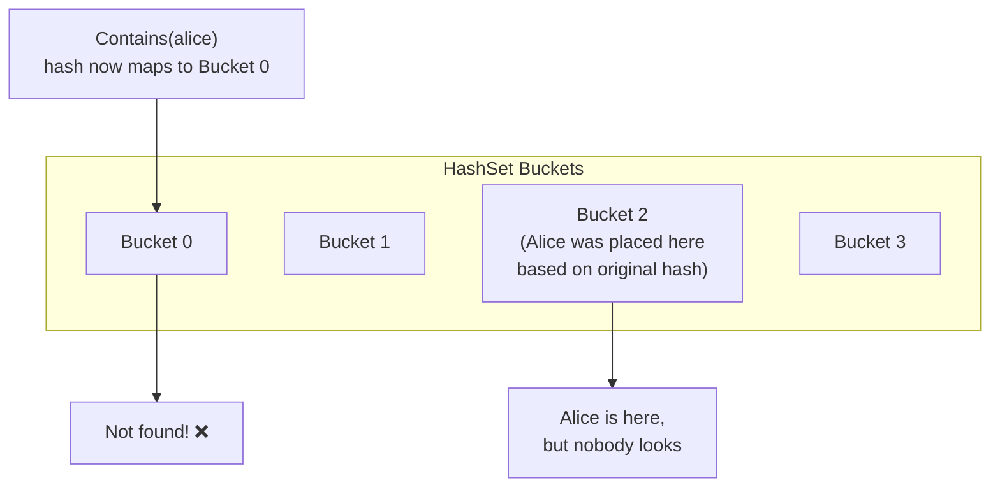

This is one of the most insidious bugs in object-oriented programming because it is completely silent. No exception, no warning, no crash — just wrong behavior.

### What Is a Hash Code?

A hash code is an integer computed from an object's data. Its purpose is to quickly sort objects into **buckets** so that hash-based collections (`Dictionary`, `HashMap`, `HashSet`) can find them in near-constant time instead of scanning every element.

Think of it like a library filing system. Instead of searching every shelf for a book, you compute a shelf number from the book's title. To find the book later, you recompute the shelf number and go directly there. The shelf number is the hash code.

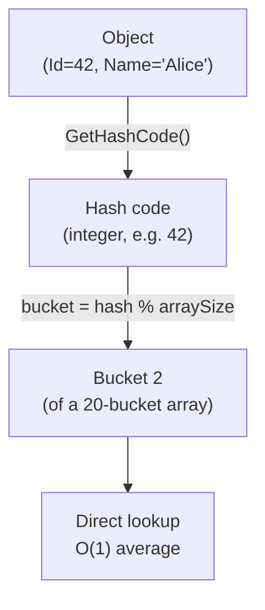

#### A Naive Hash Code Example

At its simplest, a hash function takes the fields that define equality and combines them into a single integer. Here is a deliberately simple implementation to illustrate the mechanics:

```csharp
// C# — naive hash code for a Point with two fields
public class Point
{
    public int X { get; }
    public int Y { get; }

    public Point(int x, int y) { X = x; Y = y; }

    public override int GetHashCode()
    {
        // Multiply the first field by a prime, then add the second.
        // The prime (31) spreads values across the integer range
        // and reduces the chance that (3,7) and (7,3) hash the same.
        return X * 31 + Y;
    }

    public override bool Equals(object? obj)
        => obj is Point other && X == other.X && Y == other.Y;
}
```

```java
// Java — same idea
public class Point {
    private final int x, y;

    public Point(int x, int y) { this.x = x; this.y = y; }

    @Override
    public int hashCode() {
        return x * 31 + y;   // same prime-multiply-and-add approach
    }

    @Override
    public boolean equals(Object obj) {
        if (!(obj instanceof Point other)) return false;
        return x == other.x && y == other.y;
    }
}
```

**Why 31?** It is a small odd prime. Multiplying by a prime before adding the next field reduces the number of collisions — cases where two different objects land in the same bucket. The number 31 is a convention (Java's `String.hashCode()` uses it), but any small prime works. A minor performance bonus: JIT compilers can rewrite `i * 31` as `(i << 5) - i` — a shift and a subtract — which is why 31 stuck as the traditional choice.

**In practice, do not write your own hash function.** Use the built-in combiners:

| Language | Recommended Approach |
|---|---|
| C# | `HashCode.Combine(field1, field2, ...)` |
| Java | `Objects.hash(field1, field2, ...)` |
| TypeScript | No built-in — use primitive keys or serialize to a string |

```csharp
// C# — production-quality hash code
public override int GetHashCode() => HashCode.Combine(X, Y);
```

```java
// Java — production-quality hash code
@Override
public int hashCode() { return Objects.hash(x, y); }
```

These built-in methods handle null fields, use better bit-mixing algorithms, and are tested against real-world collision rates. The naive example above is for understanding only.

#### How a Hash-Based Collection Uses the Hash Code

When you call `dictionary[key] = value`, the collection does two things:

1. **Compute the bucket**: `bucket = key.GetHashCode() % bucketCount`
2. **Store the entry** in that bucket (along with the key and value)

When you later call `dictionary[key]` to retrieve:

1. **Recompute the bucket**: `bucket = key.GetHashCode() % bucketCount`
2. **Search that bucket** using `Equals` to find the exact match

This is why the equality contract and the hash code contract are inseparable. The hash code narrows the search to one bucket; `Equals` confirms the exact match within that bucket.

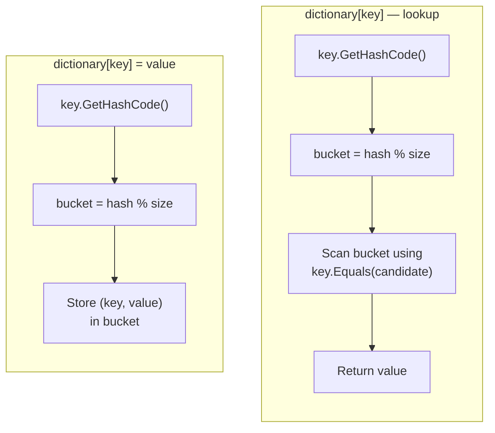

If two different objects produce different hash codes but are considered `Equal`, the lookup will search the **wrong bucket** and never find the stored entry. This is why the contract exists.

### The Equality Contract

Every object-oriented language defines a contract for equality that implementations must follow. The rules are the same across languages:

| Rule | Meaning |
|---|---|
| **Reflexive** | `a.equals(a)` is always `true` |
| **Symmetric** | If `a.equals(b)` then `b.equals(a)` |
| **Transitive** | If `a.equals(b)` and `b.equals(c)` then `a.equals(c)` |
| **Consistent** | Calling `equals` multiple times returns the same result (if the object has not changed) |
| **Null-safe** | `a.equals(null)` is always `false` |

### The Hash Code Contract

The hash code contract sits on top of the equality contract:

1. **If two objects are equal, they MUST have the same hash code.** Violating this breaks every hash-based collection (HashMap, HashSet, Dictionary).
2. **If two objects are NOT equal, they SHOULD have different hash codes.** This is not required, but identical hash codes for different objects cause collisions that degrade performance from O(1) to O(n).
3. **The hash code MUST NOT change while the object is in a hash-based collection.** This is the bug from the opening example.

> Equal objects **must** hash the same. Unequal objects **should** hash differently. Hash codes **must not** change while the object is stored in a hash-based collection.

### C# — Equals and GetHashCode

```csharp
public class Customer : IEquatable<Customer>
{
    public int Id { get; init; }
    public string Name { get; set; }

    public override bool Equals(object? obj) => Equals(obj as Customer);

    public bool Equals(Customer? other)
    {
        if (other is null) return false;
        if (ReferenceEquals(this, other)) return true;
        return Id == other.Id;
    }

    public override int GetHashCode() => Id.GetHashCode();

    public static bool operator ==(Customer? left, Customer? right)
        => Equals(left, right);

    public static bool operator !=(Customer? left, Customer? right)
        => !Equals(left, right);
}
```

Key decisions:
- Equality is based on `Id` only, not on mutable fields like `Name`
- `GetHashCode` uses the same field(s) as `Equals`
- `IEquatable<T>` avoids boxing for value type comparisons
- Operator overloads (`==`, `!=`) delegate to `Equals` for consistency

### Java — equals and hashCode

```java
public class Customer {
    private final int id;
    private String name;

    @Override
    public boolean equals(Object obj) {
        if (this == obj) return true;
        if (!(obj instanceof Customer other)) return false;
        return id == other.id;
    }

    @Override
    public int hashCode() {
        return Objects.hash(id);
    }
}
```

Java's `Objects.hash()` is a convenience method that handles null-safe hashing of multiple fields. For a single `int` field, `Integer.hashCode(id)` is slightly more efficient.

### TypeScript — No Built-In Contract

TypeScript (and JavaScript) has no `hashCode` equivalent and no overridable `equals`. Object identity uses reference equality (`===`), and there is no way to override it for `Map` or `Set`:

```typescript
const map = new Map<{id: number}, string>();

const key1 = { id: 1 };
const key2 = { id: 1 }; // same data, different reference

map.set(key1, "Alice");
console.log(map.get(key2)); // undefined — different reference!
```

**Workarounds** for TypeScript:
1. Use primitive keys (string or number) instead of object keys
2. Serialize to a string key: `map.set(JSON.stringify(key), value)`
3. Implement a custom collection that uses an `equals` method

```typescript
// Use a string-keyed Map for value-based lookup
class CustomerMap {
    private map = new Map<string, Customer>();

    set(customer: Customer): void {
        this.map.set(String(customer.id), customer);
    }

    get(id: number): Customer | undefined {
        return this.map.get(String(id));
    }
}
```

This is a fundamental limitation of JavaScript's object model. The language simply does not support value-based hashing or equality for object keys.

### Records Solve This Automatically

Both C# and Java `record` types generate correct `Equals`, `GetHashCode` / `equals`, `hashCode` implementations automatically based on all declared fields:

**C#**:
```csharp
public record Customer(int Id, string Name);

var a = new Customer(1, "Alice");
var b = new Customer(1, "Alice");

Console.WriteLine(a == b);          // true (value equality)
Console.WriteLine(a.GetHashCode() == b.GetHashCode()); // true
```

**Java**:
```java
public record Customer(int id, String name) {}

var a = new Customer(1, "Alice");
var b = new Customer(1, "Alice");

System.out.println(a.equals(b));    // true
System.out.println(a.hashCode() == b.hashCode()); // true
```

> If your class is a value object (immutable, compared by value), use a `record`. You get correct equality, hash codes, and `ToString` for free.

### When to Override

| Type of Class | Override? | Equality Based On |
|---|---|---|
| **Value Object** (EmailAddress, Money) | Always | All fields (they are all immutable) |
| **Entity** (Customer, Order) | Usually | Identity field (ID) only |
| **DTO / Data Transfer Object** | Rarely | Typically not needed — use records if you want value equality |
| **Service / Controller** | Never | Reference equality is correct — there should be only one instance |

### The Immutability Connection

This ties directly back to Section 1. Value objects are immutable, which means:
- Their hash codes never change after construction
- They are safe to use as dictionary keys and set members
- The bug from the opening of this section is **impossible** with immutable value objects

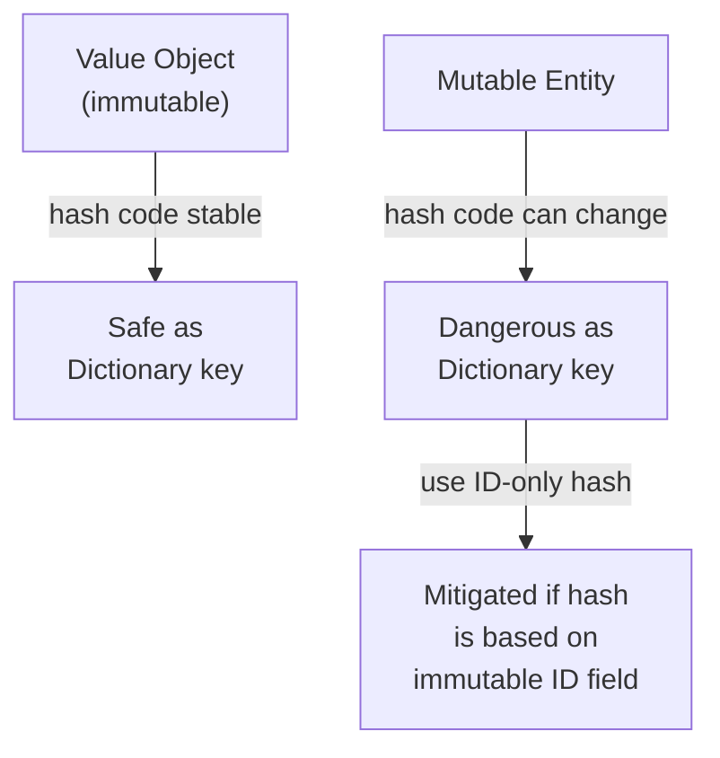

### Common Mistakes

The first three mistakes are **correctness bugs** — they cause your program to return wrong answers. The last two are stylistic issues that cause confusion but rarely data corruption.

1. **Overriding `Equals` without `GetHashCode`**: The compiler warns you (C#) or your IDE flags it (Java), but developers sometimes ignore the warning. This **will** break hash-based collections.

2. **Including mutable fields in `GetHashCode`**: The opening bug of this section. Only include fields that do not change after construction.

3. **Treating hash codes as stable identifiers**: Hash codes for the same data are **not** guaranteed to be the same across different CPU architectures, runtime versions, or even different process runs. In .NET, `string.GetHashCode()` is deliberately randomized per process by default (since .NET Core). Java's `String.hashCode()` algorithm is contractually fixed, but most other types make no such promise. **Never use hash codes as database keys, cache keys persisted to disk, or any identifier that must survive beyond the current process.** They are ephemeral, in-memory optimization values — nothing more.

4. **Inconsistent `Equals` and `GetHashCode`**: If `Equals` uses `Id` and `Name`, but `GetHashCode` uses only `Id`, then two objects with the same `Id` but different `Name` will hash the same but not be equal. This is technically legal but causes confusing behavior and poor performance.

5. **Forgetting operator overloads in C#**: If you override `Equals` but not `==`, then `a.Equals(b)` returns `true` but `a == b` returns `false` (reference comparison). This is a common source of test failures.

> **See it run**: [`Tests/HashCodeEqualityTests.cs`](16-tiny-design-choices-demo/) — the flagship "phantom lost object" bug in `BrokenCustomer_LostInHashSet_AfterMutation` prints the before/after hash codes and shows `set.Count == 1` while `set.Contains(alice) == false`. Compare `Models/Customer.cs` (correct, hash based on immutable `Id`) with `Models/BrokenCustomer.cs` (broken, hash includes mutable `Name`) to see the difference side-by-side.

---
## 4. Exception Handling Done Right

### The Bug

A user reports that their payment was charged but the order was never created. The team searches the logs and finds — nothing. No error, no warning, no trace. After days of investigation, they discover this code:

```csharp
try
{
    var order = CreateOrder(cart);
    chargePayment(order);
    sendConfirmation(order);
}
catch (Exception)
{
    // TODO: handle this later
}
```

The exception was **swallowed**. The payment succeeded, the confirmation threw an exception, and the catch block silently ate it. The order was never saved. The customer was charged for nothing.

> Swallowing an exception is not "handling" it. It is **hiding** it. And hidden bugs do not go away — they compound.

### The Golden Rule

Exceptions are for **exceptional** circumstances — situations that the normal flow of the program cannot or should not handle. They are not a control flow mechanism.

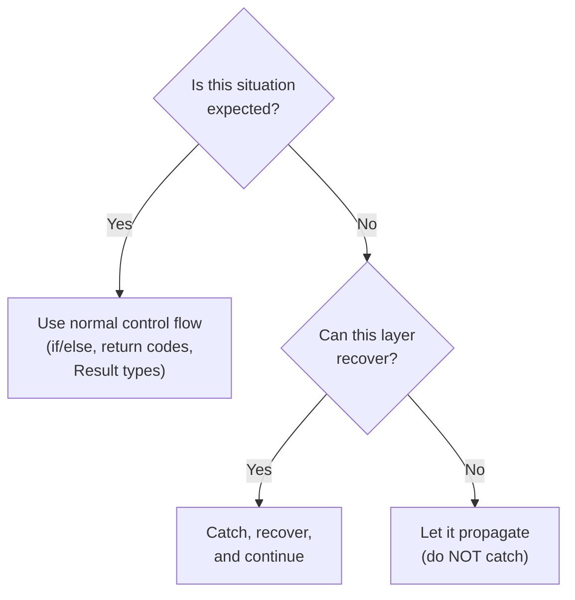

### Anti-Pattern 1: Swallowing Exceptions

```csharp
// ❌ C# — exception swallowed
try { Process(order); }
catch (Exception) { }
```

```java
// ❌ Java — exception swallowed
try { process(order); }
catch (Exception e) { }
```

```typescript
// ❌ TypeScript — exception swallowed
try { process(order); }
catch (e) { }

// ✅ TypeScript — at minimum, log it and let it propagate if you cannot recover
try { process(order); }
catch (e) {
    logger.error("Order processing failed", e);
    throw e;
}
```

**Why it is dangerous**: The failure is completely invisible. No log, no alert, no trace. The system continues in a corrupted state.

**The fix**: At minimum, log the exception. Better yet, only catch what you can actually handle.

### Anti-Pattern 2: Exceptions as Control Flow

```csharp
// ❌ C# — using exceptions for expected cases
public int ParseAge(string input)
{
    try
    {
        return int.Parse(input);
    }
    catch (FormatException)
    {
        return -1; // using exception as a fancy if-statement
    }
}

// ✅ C# — using TryParse for expected cases
public int ParseAge(string input)
{
    return int.TryParse(input, out var age) ? age : -1;
}
```

```java
// ❌ Java — using exceptions for expected cases
public int parseAge(String input) {
    try {
        return Integer.parseInt(input);
    } catch (NumberFormatException e) {
        return -1;
    }
}

// ✅ Java — checking before parsing
public OptionalInt parseAge(String input) {
    if (input == null || !input.matches("\\d+"))
        return OptionalInt.empty();
    return OptionalInt.of(Integer.parseInt(input));
}
```

```typescript
// ❌ TypeScript — using exceptions for expected cases
function parseAge(input: string): number {
    try {
        const age = JSON.parse(input);
        if (typeof age !== "number") throw new Error();
        return age;
    } catch {
        return -1;
    }
}

// ✅ TypeScript — checking before parsing
function parseAge(input: string): number | undefined {
    const age = Number(input);
    return Number.isFinite(age) ? age : undefined;
}
```

**Why it is dangerous**: Exceptions are expensive (stack trace capture), make control flow hard to follow, and hide the difference between expected and unexpected situations.

> If you can check for a condition before it happens, do not use exceptions to detect it after it happens.

### Anti-Pattern 3: Catching Too Broadly

```csharp
// ❌ C# — catches everything, including OutOfMemoryException
try { Process(order); }
catch (Exception ex) { logger.Error(ex, "Processing failed"); }

// ✅ C# — catches only what you can handle
try { Process(order); }
catch (PaymentGatewayException ex) { logger.Error(ex, "Payment failed for order {OrderId}", order.Id); }
catch (InventoryException ex) { logger.Error(ex, "Stock unavailable for order {OrderId}", order.Id); }
```

```java
// ❌ Java — catches everything
try { process(order); }
catch (Exception e) { logger.error("Processing failed", e); }

// ✅ Java — catches specific exceptions
try { process(order); }
catch (PaymentGatewayException e) { logger.error("Payment failed for order {}", order.getId(), e); }
catch (InventoryException e) { logger.error("Stock unavailable for order {}", order.getId(), e); }
```

```typescript
// ❌ TypeScript — catches everything
try { process(order); }
catch (e) { logger.error("Processing failed", e); }

// ✅ TypeScript — narrow the catch using instanceof
try { process(order); }
catch (e) {
    if (e instanceof PaymentGatewayError) {
        logger.error(`Payment failed for order ${order.id}`, e);
    } else if (e instanceof InventoryError) {
        logger.error(`Stock unavailable for order ${order.id}`, e);
    } else {
        throw e;  // let anything unexpected propagate
    }
}
```

**Why it is dangerous**: Catching `Exception` catches everything — including `NullPointerException`, `StackOverflowException`, and other bugs that you should **not** be suppressing.

### Anti-Pattern 4: Losing the Stack Trace

```csharp
// ❌ C# — loses the original stack trace
try { Process(order); }
catch (Exception ex) { throw new ApplicationException("Processing failed: " + ex.Message); }

// ✅ C# — preserves the original stack trace
try { Process(order); }
catch (Exception ex) { throw new ApplicationException("Processing failed", ex); }

// ✅ C# — rethrow without wrapping (preserves everything)
try { Process(order); }
catch (Exception ex)
{
    logger.Error(ex, "Processing failed");
    throw; // rethrows with original stack trace
}
```

```java
// ❌ Java — loses the original stack trace
try { process(order); }
catch (Exception e) { throw new RuntimeException("Processing failed: " + e.getMessage()); }

// ✅ Java — preserves the original stack trace
try { process(order); }
catch (Exception e) { throw new RuntimeException("Processing failed", e); }
```

```typescript
// ❌ TypeScript — loses the original stack trace
try { process(order); }
catch (e) { throw new Error("Processing failed"); }

// ✅ TypeScript — preserves the original error as cause (ES2022+)
try { process(order); }
catch (e) { throw new Error("Processing failed", { cause: e }); }
```

> When rethrowing, always pass the original exception as the inner exception or cause. The stack trace is the most valuable debugging information you have.

### The `finally` Block: Guaranteed Cleanup

All three languages provide a `finally` block that runs **no matter what** happens inside the `try` or `catch`:

- Code in the `try` completed normally? → `finally` runs.
- An exception was thrown and caught? → `finally` runs after the `catch`.
- An exception was thrown and **not** caught? → `finally` runs on the way out, before the exception propagates.
- The `catch` block itself threw a new exception? → `finally` still runs.
- A `return` statement executed inside `try` or `catch`? → `finally` still runs before the method actually returns.

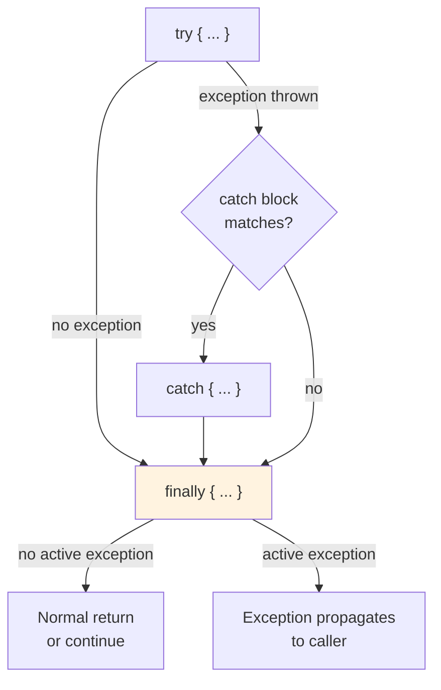

This guarantee is what makes `finally` essential for cleanup: closing file handles, releasing database connections, unlocking mutexes, restoring UI state. If you do this work at the end of the `try` block instead, you lose the guarantee — an exception will skip past it.

#### The Bug `finally` Prevents

```csharp
// ❌ C# — cleanup is skipped when Process throws
var connection = Open();
Process(connection);    // throws → next line never runs
connection.Close();     // connection leaks forever
```

```csharp
// ✅ C# — cleanup runs whether Process throws or not
var connection = Open();
try
{
    Process(connection);
}
finally
{
    connection.Close();   // runs on every path out
}
```

The same pattern in the other two languages:

```java
// ✅ Java
var connection = open();
try {
    process(connection);
} finally {
    connection.close();
}
```

```typescript
// ✅ TypeScript
const connection = open();
try {
    process(connection);
} finally {
    connection.close();
}
```

#### Rules for `finally`

1. **Do not throw from `finally`** unless you absolutely must. A `finally` block that throws **replaces** any in-flight exception, hiding the original failure. If cleanup can fail, catch inside the `finally` and log it.
2. **Do not `return` from `finally`**. A `return` statement in a `finally` block silently swallows any in-flight exception — one of the most confusing bugs in the language. The compiler allows it; static analyzers (and your teammates) will yell at you.
3. **Keep `finally` short and deterministic**. It is not the place for business logic. Only release what you acquired in the `try`.

> `finally` runs. Always. Use it for anything that absolutely *must* happen — closing a resource, releasing a lock, restoring state — regardless of whether the work succeeded or blew up.

### Best Practice: Custom Exception Types

Create domain-specific exception types when the caller needs to distinguish between different failure modes:

```csharp
// C#
public class OrderProcessingException : Exception
{
    public string OrderId { get; }

    public OrderProcessingException(string orderId, string message, Exception? inner = null)
        : base(message, inner)
    {
        OrderId = orderId;
    }
}
```

```java
// Java
public class OrderProcessingException extends RuntimeException {
    private final String orderId;

    public OrderProcessingException(String orderId, String message, Throwable cause) {
        super(message, cause);
        this.orderId = orderId;
    }

    public String getOrderId() { return orderId; }
}
```

```typescript
// TypeScript
export class OrderProcessingError extends Error {
    constructor(
        public readonly orderId: string,
        message: string,
        options?: { cause?: unknown }
    ) {
        super(message, options);
        this.name = "OrderProcessingError";
    }
}
```

> **Why assign `this.name`?** `Error` subclasses in JavaScript do **not** automatically set `name` to the subclass name — without the explicit assignment, stack traces and `toString()` output show `Error: ...` instead of `OrderProcessingError: ...`, making logs harder to scan and filter.

### Never Return Exceptions to Untrusted Clients

This is a security concern as much as a design concern. A raw exception sent to a client leaks implementation details:

```json
{
    "error": "System.Data.SqlClient.SqlException: Invalid column name 'user_pwd'.\n   at System.Data.SqlClient.SqlConnection.OnError(SqlException exception)...",
    "stackTrace": "   at MyApp.Repositories.UserRepository.FindByEmail(String email) in /src/Repos/UserRepository.cs:line 42\n   at MyApp.Controllers.AuthController.Login(LoginRequest req) in /src/Controllers/AuthController.cs:line 18"
}
```

This response tells an attacker your database schema, your file paths, your class names, and which line of code failed. That is a roadmap for exploitation.

**The rule**: Log the full exception server-side. Return a sanitized message to the client.

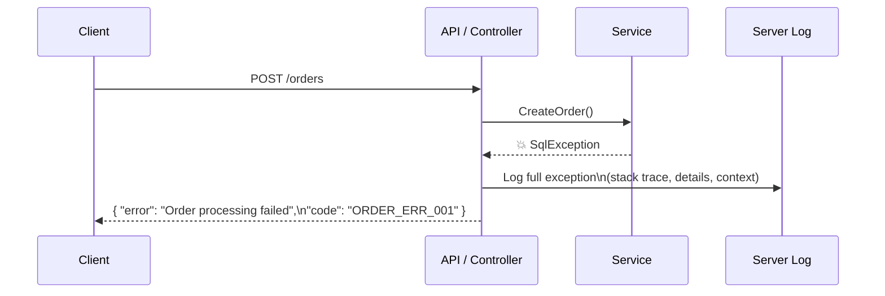

**C# — ASP.NET Exception-Handling Middleware**:

```csharp
public class GlobalExceptionHandler : IExceptionHandler
{
    private readonly ILogger<GlobalExceptionHandler> _logger;

    public GlobalExceptionHandler(ILogger<GlobalExceptionHandler> logger)
    {
        _logger = logger;
    }

    public async ValueTask<bool> TryHandleAsync(
        HttpContext context, Exception exception, CancellationToken ct)
    {
        // Log the full exception server-side
        _logger.LogError(exception, "Unhandled exception for {Method} {Path}",
            context.Request.Method, context.Request.Path);

        // Return a sanitized response to the client
        context.Response.StatusCode = StatusCodes.Status500InternalServerError;
        await context.Response.WriteAsJsonAsync(new
        {
            error = "An internal error occurred. Please try again later.",
            code = "INTERNAL_ERROR",
            traceId = context.TraceIdentifier // safe to share for support tickets
        }, ct);

        return true;
    }
}
```

**Java — Spring @ControllerAdvice**:

```java
@ControllerAdvice
public class GlobalExceptionHandler {
    private static final Logger log = LoggerFactory.getLogger(GlobalExceptionHandler.class);

    @ExceptionHandler(Exception.class)
    public ResponseEntity<Map<String, String>> handleAll(Exception ex, HttpServletRequest req) {

        // Log the full exception server-side
        log.error("Unhandled exception for {} {}", req.getMethod(), req.getRequestURI(), ex);

        // Return a sanitized response to the client
        return ResponseEntity
            .status(HttpStatus.INTERNAL_SERVER_ERROR)
            .body(Map.of(
                "error", "An internal error occurred. Please try again later.",
                "code", "INTERNAL_ERROR"
            ));
    }
}
```

**TypeScript — Express Error-Handling Middleware**:

```typescript
import { ErrorRequestHandler } from "express";

export const globalErrorHandler: ErrorRequestHandler = (err, req, res, _next) => {

    // Log the full exception server-side
    console.error(`Unhandled exception for ${req.method} ${req.path}`, err);

    // Return a sanitized response to the client
    res.status(500).json({
        error: "An internal error occurred. Please try again later.",
        code: "INTERNAL_ERROR",
    });
};

// In your Express app setup — must be registered AFTER all routes:
// app.use(globalErrorHandler);
```

### Connection to Value Objects

Value objects that validate at construction prevent many exceptions downstream. If an `EmailAddress` cannot exist in an invalid state, then no downstream code needs to catch `InvalidEmailException`. The exception is thrown at the boundary, once, when the raw input is first converted to a value object. Everything after that point can trust the type.

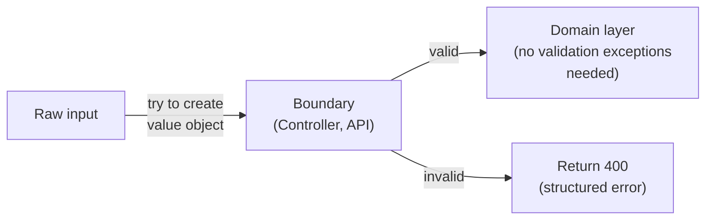

> **See it run**: [`Tests/ExceptionHandlingTests.cs`](16-tiny-design-choices-demo/) — paired anti-pattern vs. correct tests. `Bad_UsingExceptionsForControlFlow` times 10,000 throw/catches to show the measurable cost of exceptions-as-branching. `Bad_LosingStackTrace` vs. `Good_PreservingStackTrace` prints the `InnerException` in both cases so you can see what gets lost. `CustomException_CarriesDomainContext` shows structured data on a custom exception (`OrderId`) so the caller does not have to parse a message string.

---
## 5. Connecting the Dots

These four topics are not isolated. They form a reinforcing cycle of good design habits:

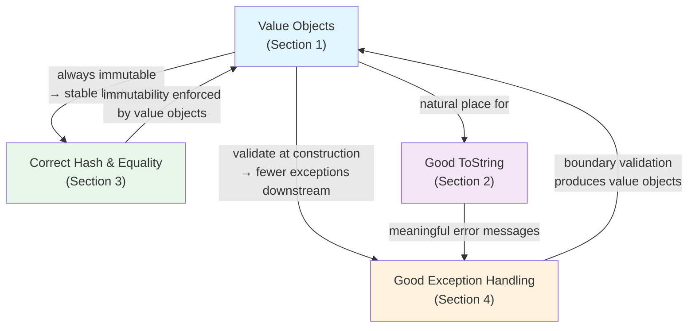

1. **Value objects eliminate primitive obsession** and move validation to construction. This reduces the number of exception paths in your domain layer.

2. **Value objects are immutable**, which means their hash codes are stable. They are always safe to use as dictionary keys and set members.

3. **Value objects benefit most from ToString overrides** because they appear frequently in logs, error messages, and debugger displays.

4. **Good exception handling at the boundary** is where you reject invalid input and create value objects. Everything downstream can trust the types it receives.

5. **Sanitized exception responses** protect your implementation details from clients, while server-side logging with good `ToString` output makes debugging possible.

6. **Client-side errors are invisible unless you log them back to the server.** Section 4 covers sanitizing server errors sent to clients, but the reverse problem is equally important: runtime errors in the browser never reach your server logs unless you explicitly capture and forward them. [Appendix B](#appendix-b-logging-client-side-errors-on-the-server) walks through a practical Angular + ASP.NET Core approach.

> Professional code validates at the boundary, communicates through ToString, respects the equality contract, and reserves exceptions for the truly exceptional.

### Seeing It All Run — the Companion Unit Test Demo

The four topics in this lecture are easier to **internalize** by watching them fail and succeed than by reading about them. The companion project — [Tiny Design Choices Demo (xUnit)](16-tiny-design-choices-demo/) — is a small .NET 10 test suite where every test writes a short, narrated story to the console as it runs. You see the actual exception type and message when a value object rejects bad input. You see hash code values before and after a mutation, alongside the paradox of a `HashSet` that reports `Count == 1` but `Contains(x) == false`. You see the measured cost of using exceptions for control flow (10,000 throw/catches timed in milliseconds).

Worth reviewing because:

- **Every test is a runnable example of a concept from this lecture**, not an abstract unit test. Read the test name, the source, and the output together — each one is a ~20-line walkthrough.
- **The phantom "lost object" bug** is made concrete. `BrokenCustomer` and `Customer` sit side-by-side in the `Models/` folder so you can diff a correct implementation against a broken one.
- **The whole suite runs in under half a second** (34 tests total), so you can scan all four topics in one sitting rather than studying them in isolation.
- **The README walks you through a suggested reading order** — which files to open first and how to filter the output down to a single story at a time.

> If you only read the lecture, you will have concepts. If you also run the tests with `--logger "console;verbosity=detailed"`, you will have muscle memory. Pick a topic that felt abstract, run just those tests, and watch the output.

#### Sample Unit Test Demo Console Output

```
  Passed TinyDesignChoicesDemo.Tests.ExceptionHandlingTests.CustomException_CarriesDomainContext [< 1 ms]
  Standard Output Messages:
 Custom exceptions carry structured domain data the caller can act on.
   ex.Message = "Payment gateway timeout"
   ex.OrderId = "ORD-42"   ← no string parsing required
 A generic Exception would force the caller to parse the message — fragile and error-prone.


  Passed TinyDesignChoicesDemo.Tests.HashCodeEqualityTests.Customer_SameHashCodeWhenEqual [< 1 ms]
  Standard Output Messages:
 Contract: equal objects MUST have equal hash codes.
   a.GetHashCode() = 1
   b.GetHashCode() = 1
   Match? True


  Passed TinyDesignChoicesDemo.Tests.ExceptionHandlingTests.Bad_LosingStackTrace [< 1 ms]
  Standard Output Messages:
 ❌ Anti-pattern: wrapping an exception without passing it as inner.
   Outer:           ApplicationException: Wrapped: Original error
   InnerException:  (null — original trace LOST)
   The debugger now shows only the wrapper's stack — original failure location is gone.
```


---
## Appendix A: Language Comparison Quick Reference

### Value Objects

| Feature | C# | Java | TypeScript |
|---|---|---|---|
| Recommended type | `record` | `record` (16+) | Immutable class + factory |
| Equality | Auto-generated by `record` | Auto-generated by `record` | Manual `equals()` method |
| Immutability | `init` properties, `readonly` | Fields are final in records | `readonly` properties |
| Compile-time type safety | Strong (nominal typing) | Strong (nominal typing) | Branded types for nominal |
| Library | ValueOf | Immutables, jMolecules | None dominant |

### ToString

| Feature | C# | Java | TypeScript |
|---|---|---|---|
| Override syntax | `override string ToString()` | `@Override public String toString()` | `toString(): string` |
| Default for classes | Fully qualified type name | `ClassName@hashHex` | `[object Object]` |
| Default for records | All properties shown | All components shown | N/A (no built-in records) |
| String interpolation | `$"text {obj}"` calls ToString | `"text " + obj` calls toString | `` `text ${obj}` `` calls toString |

### Equality and Hash Codes

| Feature | C# | Java | TypeScript |
|---|---|---|---|
| Equality method | `Equals(object)` + `IEquatable<T>` | `equals(Object)` | No standard protocol |
| Hash code method | `GetHashCode()` | `hashCode()` | No built-in equivalent |
| Auto-generated by records | Yes | Yes | N/A |
| Hash-based collections | `Dictionary<K,V>`, `HashSet<T>` | `HashMap<K,V>`, `HashSet<T>` | `Map<K,V>`, `Set<T>` (reference-based for objects) |
| Operator overload | `==` and `!=` can be overridden | Not available | Not available |

### Exception Handling

| Feature | C# | Java | TypeScript |
|---|---|---|---|
| Checked exceptions | No | Yes (controversial) | No |
| Chained cause | `new Ex(msg, innerException)` | `new Ex(msg, cause)` | `new Error(msg, { cause })` (ES2022) |
| Rethrow preserving stack | `throw;` (no argument) | `throw e;` (rethrows same object) | `throw e;` |
| Global handler (web) | `IExceptionHandler` middleware | `@ControllerAdvice` | Express error middleware |

---
## Appendix B: Logging Client-Side Errors on the Server

This appendix walks through a practical approach to forwarding client-side runtime errors to the server log. The example uses Angular for the SPA and ASP.NET Core for the API, but the pattern applies to any frontend/backend combination. A working demo of everything described below is available in the companion project: [Client-Side Error Logging Demo](16-tiny-design-choices-client-error-logging-demo/README.md).

### The Blind Spot

Section 4 covered how to sanitize server exceptions before returning them to clients. But there is an equally dangerous blind spot running in the opposite direction: **runtime errors that occur in the browser never appear in your server logs.** A `TypeError`, a failed API deserialization, or an unhandled promise rejection crashes the user's experience — and you never know it happened.

If your error logging strategy only covers the server, you are flying blind on the client.

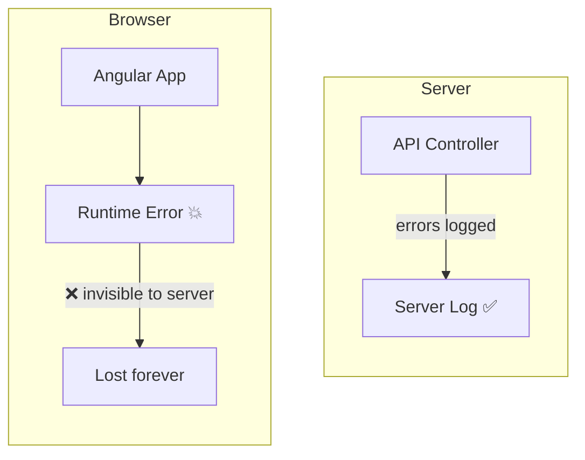

The fix is straightforward: capture client-side errors, package them with enough context to be actionable, and forward them to a lightweight server endpoint that writes them to the same log infrastructure.

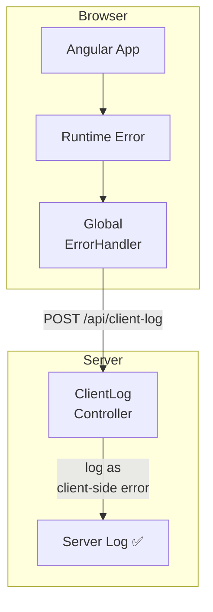

### Step 1: Capture Errors in Angular

Angular provides a global `ErrorHandler` interface. By replacing the default handler, you can intercept every unhandled error in the application — component errors, service errors, unhandled promise rejections — in one place.

```typescript
// client-error.model.ts
export interface ClientErrorReport {
    message: string;
    stack?: string;
    url: string;           // browser path when the error occurred
    user?: string;         // authenticated user, if known
    timestamp: string;     // ISO 8601
    userAgent: string;     // browser and OS for reproduction
}
```

```typescript
// global-error-handler.ts
import { ErrorHandler, Injectable, Injector } from "@angular/core";
import { Router } from "@angular/router";
import { ClientLogService } from "./client-log.service";
import { AuthService } from "./auth.service";
import { ClientErrorReport } from "./client-error.model";

@Injectable()
export class GlobalErrorHandler implements ErrorHandler {

    // Use Injector to avoid circular dependency with Router and HTTP
    constructor(private injector: Injector) {}

    handleError(error: unknown): void {
        // Still log to the browser console for local debugging
        console.error(error);

        const router = this.injector.get(Router);
        const auth = this.injector.get(AuthService);
        const logService = this.injector.get(ClientLogService);

        const report: ClientErrorReport = {
            message: error instanceof Error ? error.message : String(error),
            stack: error instanceof Error ? error.stack : undefined,
            url: router.url,
            user: auth.currentUser?.email,
            timestamp: new Date().toISOString(),
            userAgent: navigator.userAgent,
        };

        logService.reportError(report);
    }
}
```

```typescript
// client-log.service.ts
import { Injectable } from "@angular/core";
import { HttpClient } from "@angular/common/http";
import { ClientErrorReport } from "./client-error.model";

@Injectable({ providedIn: "root" })
export class ClientLogService {

    private readonly endpoint = "/api/client-log";

    constructor(private http: HttpClient) {}

    reportError(report: ClientErrorReport): void {
        // Fire-and-forget — do not let a logging failure cascade
        this.http.post(this.endpoint, report).subscribe({
            error: () => console.warn("Failed to report client error to server."),
        });
    }
}
```

Register the handler in your application config:

```typescript
// app.config.ts (or app.module.ts)
import { ErrorHandler } from "@angular/core";
import { GlobalErrorHandler } from "./global-error-handler";

export const appConfig = {
    providers: [
        { provide: ErrorHandler, useClass: GlobalErrorHandler },
        // ... other providers
    ],
};
```

### Step 2: Receive and Log on the Server (ASP.NET Core)

The server endpoint receives the error report and writes it to the application log. Two important design decisions:

1. **Tag the log entry clearly as a client-side error** so it is not confused with server exceptions during triage.
2. **Rate-limit the endpoint** to prevent a misbehaving client (or an attacker) from flooding your log infrastructure.

```csharp
// ClientErrorReport.cs
public sealed record ClientErrorReport(
    string Message,
    string? Stack,
    string Url,
    string? User,
    string Timestamp,
    string UserAgent
);
```

```csharp
// ClientLogController.cs
using Microsoft.AspNetCore.Mvc;
using Microsoft.AspNetCore.RateLimiting;

[ApiController]
[Route("api/client-log")]
public class ClientLogController : ControllerBase
{
    private readonly ILogger<ClientLogController> _logger;

    public ClientLogController(ILogger<ClientLogController> logger)
    {
        _logger = logger;
    }

    [HttpPost]
    [EnableRateLimiting("client-log")]
    public IActionResult Post([FromBody] ClientErrorReport report)
    {
        // Tag clearly as CLIENT-SIDE so server log searches can distinguish it
        _logger.LogError(
            "[CLIENT-SIDE ERROR] Message={Message} | Url={Url} | User={User} | " +
            "Timestamp={Timestamp} | UserAgent={UserAgent} | Stack={Stack}",
            report.Message,
            report.Url,
            report.User ?? "(anonymous)",
            report.Timestamp,
            report.UserAgent,
            report.Stack ?? "(no stack trace)");

        // Return 204 — no content needed
        return NoContent();
    }
}
```

#### Rate Limiting

**What is rate limiting?** A rate limiter is a server-side gatekeeper that counts how many requests arrive in a given time window and rejects anything above a configured threshold, typically with an HTTP 429 (Too Many Requests) response. The limiter sits in front of your endpoint and runs **before** the controller, so rejected requests consume almost no server resources.

**Why is it critical for a client-log endpoint?** An endpoint that writes to the server log on every request is a uniquely dangerous target if it is left open. Three realistic failure modes illustrate the risk:

1. **The buggy client bomb.** An error inside an Angular component's `ngOnInit` throws on every render. If that component is on a dashboard that auto-refreshes every few seconds, a single user can generate thousands of identical error reports per minute. Without rate limiting, each report is a log write, disk I/O, and possibly an alert page to the on-call engineer. One user's broken component can DDoS your own logging pipeline.

2. **The runaway loop.** An error handler that itself throws (for example, trying to read `error.message` on a value that is not an `Error` instance) re-enters the global handler, which tries to report **that** error, which throws again. Without rate limiting, this infinite loop is bounded only by network speed and the user's CPU.

3. **The malicious attacker.** The endpoint is public by design — the browser can reach it without authentication, because it has to work even when the user is logged out. An attacker who discovers `/api/client-log` can script millions of POSTs to exhaust disk space on the log volume, fill up log-aggregation service quotas (which are billed per GB), or trigger alerting rules so loudly that real incidents get lost in the noise. This is a classic application-layer DDoS.

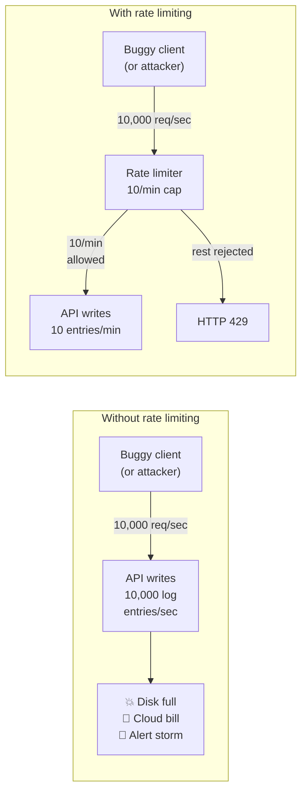

A basic fixed-window rate limiter prevents abuse without blocking legitimate error reports:

```csharp
// In Program.cs
using System.Threading.RateLimiting;

builder.Services.AddRateLimiter(options =>
{
    options.AddFixedWindowLimiter("client-log", limiter =>
    {
        limiter.PermitLimit = 10;              // max 10 requests
        limiter.Window = TimeSpan.FromMinutes(1); // per 1-minute window
        limiter.QueueLimit = 0;                // reject immediately when full
    });

    options.RejectionStatusCode = StatusCodes.Status429TooManyRequests;
});

// ... later in the pipeline
app.UseRateLimiter();
```

This allows 10 error reports per minute. In a real production system, you would **partition** the limiter so one noisy client does not use up the quota for everyone else — the usual partition key is the client IP address for anonymous traffic and the authenticated user ID when available. You would also typically return a `Retry-After` header so well-behaved clients back off automatically.

> Any endpoint a browser can reach without authentication needs a rate limiter. The client-log endpoint is a double hazard: it is unauthenticated **and** it writes to your log pipeline on every successful request. Assume it will be abused, and cap it before it hurts you.

### Step 3: Include Context That Makes Errors Actionable

A stack trace alone is rarely enough to reproduce a client-side bug. The error report should include contextual data that answers the questions a developer will ask during triage:

| Field | Why It Matters |
|---|---|
| `message` | What went wrong |
| `stack` | Where in the code it happened |
| `url` | What page/route the user was on — critical for reproducing the error |
| `user` | Which user hit the bug — is it one user or widespread? |
| `timestamp` | When it happened — correlate with server logs and deployments |
| `userAgent` | Which browser and OS — is it browser-specific? |

You can extend the report with additional fields as needed:

```typescript
export interface ClientErrorReport {
    message: string;
    stack?: string;
    url: string;
    user?: string;
    timestamp: string;
    userAgent: string;
    // Optional extensions:
    appVersion?: string;       // correlate with deployments
    componentName?: string;    // which Angular component threw
    additionalContext?: Record<string, unknown>; // route params, feature flags, etc.
}
```

### Source Maps: Readable Stack Traces

By default, production Angular builds are minified and bundled. A stack trace from production looks like this:

```
TypeError: Cannot read properties of undefined (reading 'name')
    at main.3f2a1b.js:1:28473
    at main.3f2a1b.js:1:31290
```

This is nearly useless. **Source maps** are files that map minified code back to the original TypeScript source. With source maps, the same error becomes:

```
TypeError: Cannot read properties of undefined (reading 'name')
    at OrderSummaryComponent.getCustomerName (order-summary.component.ts:42:18)
    at OrderSummaryComponent.ngOnInit (order-summary.component.ts:28:12)
```

#### Source Map Best Practices

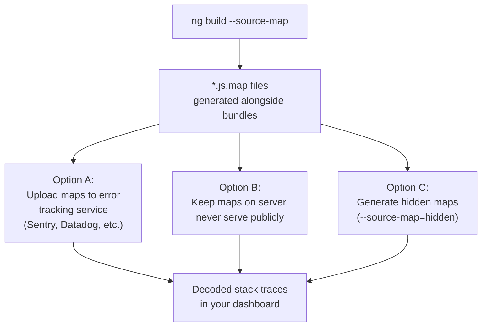

- **Generate source maps in production builds**: Use `ng build --source-map` or set `"sourceMap": true` in `angular.json`. Angular 15+ also supports `"hidden"` source maps that are generated but not linked from the bundle, preventing public access.
- **Do NOT serve source maps publicly**: They expose your original source code. Upload them to your error tracking service or store them on the server for internal use only.
- **Map stack traces server-side or in your error dashboard**: Services like Sentry, Datadog, and Rollbar automatically apply uploaded source maps to incoming error reports, giving you readable stack traces without exposing source maps to end users.

### Responsibility Split

The client and server each have a distinct role. The client is responsible for capturing the error and its context. The server is responsible for durable logging, rate limiting, and integration with alerting.

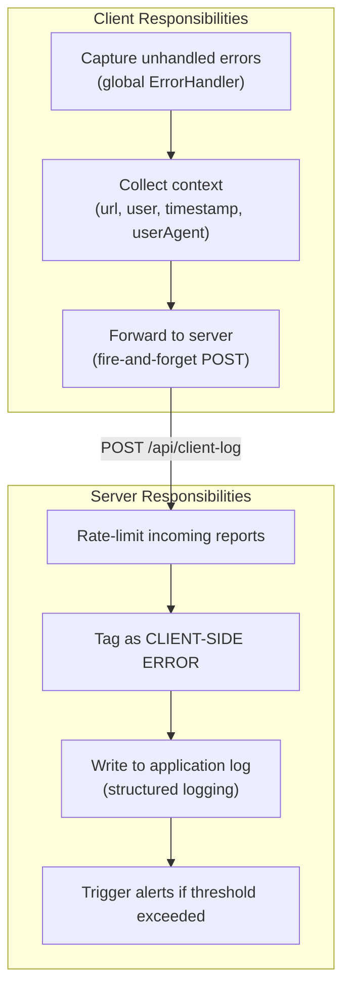

| Concern | Client | Server |
|---|---|---|
| Error capture | Global `ErrorHandler` intercepts all unhandled errors | — |
| Context collection | Browser path, user, timestamp, userAgent | — |
| Transport | HTTP POST, fire-and-forget | Receives and validates payload |
| Rate limiting | — | Fixed-window limiter (e.g., 10/min) |
| Durable logging | — | Writes to structured log with `[CLIENT-SIDE ERROR]` tag |
| Alerting | — | Threshold-based alerts (e.g., spike in client errors after a deploy) |
| Source map decoding | — | Map minified stacks to original source (via uploaded maps) |
