# Smart Home Simulator

The Smart Home Simulator is a semester project for SWE 4743 Object-Oriented Design. The application simulates a smart home environment where users can monitor and control various household devices through a web-based interface. The project emphasizes rigorous application of OO design principles, SOLID architecture, and formal state machine modeling.

Students will implement a full-stack application consisting of a modern single-page application (SPA) front end communicating with a RESTful back-end API. The project serves as a vehicle for demonstrating mastery of object-oriented design patterns, clean architecture, and software engineering best practices.

**This project is designed to be a portfolio piece.** The technology stack, architecture patterns, testing practices, and delivery pipeline mirror what you will encounter in industry. When you interview for internships or your first full-time role, this project -- complete with a working demo, clean repository, Loom walkthrough, and documented design decisions -- is exactly the kind of work that sets you apart from candidates who can only show coursework. Treat it accordingly.

[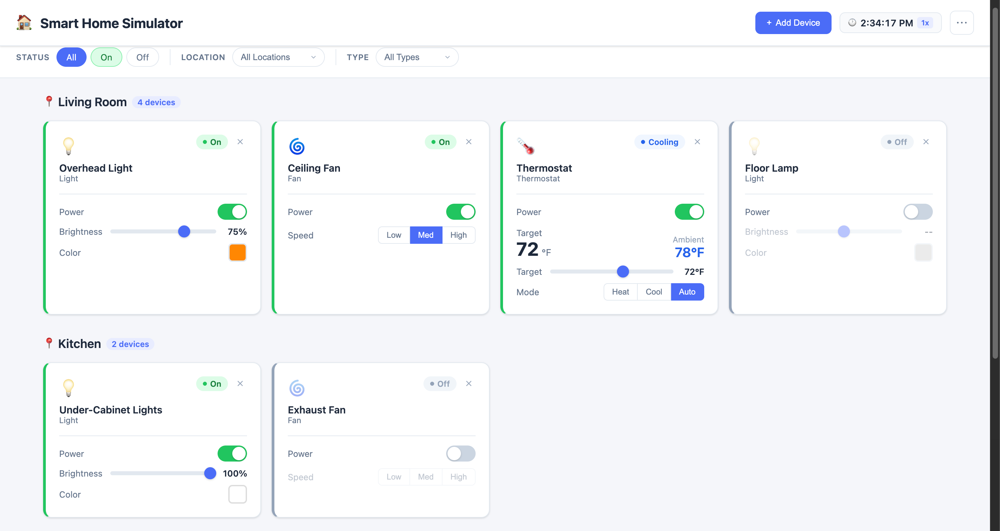](mockups/dashboard.html)

### Mandatory Requirements for All Teams

Sections 1 through 6 describe the requirements all teams must implement, whether a team of 1 or a team of 6.

### Extra Credit

Section 7 describes extra credit opportunities. There are 6 extra credit options, each worth up to 5 additional points.

### Teams Greater than 2 People Must Convert Extra Credit into Additional Mandatory Requirements 

That teams larger than 2 people *must* select one extra credit option for *each* team member above 2 (for example, a team of 4 must select at least 2 extra credit options). Mandatory extra credit options do *not* add points. 

Teams larger than 2 can still earn extra credit. For example, a team of four selecting 4 extra credit options can add 10% of their score.

See [Section 8 -- Delivery Checklist](#8-delivery-checklist) to verify completeness, and [Section 9 -- Grading Criteria](#9-grading-criteria) for the detailed rubric.

## Table of Contents

- [1. Functional Requirements](#1-functional-requirements)
  - [1.1 Device Types](#11-device-types)
  - [1.2 Device Metadata](#12-device-metadata)
  - [1.3 Environment Simulation](#13-environment-simulation)
  - [1.4 Simulation Settings](#14-simulation-settings)
- [2. Technical Requirements](#2-technical-requirements)
  - [2.1 Technology Stack](#21-technology-stack)
  - [2.2 Persistence](#22-persistence)
  - [2.3 State Machines](#23-state-machines)
  - [2.4 API Design](#24-api-design)
  - [2.5 Repository Structure](#25-repository-structure)
- [3. User Interface Requirements](#3-user-interface-requirements)
  - [3.1 Device Dashboard](#31-device-dashboard)
  - [3.2 Filtering](#32-filtering)
  - [3.3 Device Controls](#33-device-controls)
  - [3.4 Responsive / Mobile-Friendly Design](#34-responsive--mobile-friendly-design)
  - [3.5 Device Management](#35-device-management)
- [4. Design Requirements](#4-design-requirements)
  - [4.1 Separation of Concerns](#41-separation-of-concerns)
  - [4.2 SOLID Principles](#42-solid-principles)
  - [4.3 Dependency Injection](#43-dependency-injection)
  - [4.4 Abstraction Quality](#44-abstraction-quality)
  - [4.5 Design Pattern Identification](#45-design-pattern-identification)
  - [4.6 Validation Strategy](#46-validation-strategy)
  - [4.7 Error Handling Contract](#47-error-handling-contract)
- [5. Development Requirements](#5-development-requirements)
  - [5.1 Testing](#51-testing)
- [6. Delivery Requirements](#6-delivery-requirements)
  - [6.1 Setup and Run Instructions](#61-setup-and-run-instructions)
  - [6.2 Docker](#62-docker)
  - [6.3 Local Development (Optional Documentation)](#63-local-development-optional-documentation)
  - [6.4 Video Deliverables](#64-video-deliverables)
  - [6.5 Team Policy](#65-team-policy)

- [7. Extra Credit](#7-extra-credit)
  - [7.1 Object Relational Mapper (ORM)](#71-object-relational-mapper-orm)
  - [7.2 Server-Sent Events (SSE)](#72-server-sent-events-sse)
  - [7.3 LLM Natural Language Control via MCP](#73-llm-natural-language-control-via-mcp)
  - [7.4 JWT Authentication](#74-jwt-authentication)
  - [7.5 Device Scenes](#75-device-scenes)
  - [7.6 CI/CD Pipeline](#76-cicd-pipeline)
- [8. Delivery Checklist](#8-delivery-checklist)
- [9. Grading Criteria](#9-grading-criteria)
  - [9.1 Mandatory Requirements](#91-mandatory-requirements-100)
  - [9.2 Extra Credit](#92-extra-credit-5-each)
- [10. Glossary](#10-glossary)
- [Appendix A: AI Prompts for Code Review and Test Generation](#appendix-a-ai-prompts-for-code-review-and-test-generation)
- [Appendix B: AI Prompts for Extra Credit Code Review](#appendix-b-ai-prompts-for-extra-credit-code-review)

---

## 1. Functional Requirements

### 1.1 Device Types

The simulator supports the following device types. Each device type is governed by a formal state machine with defined states and transitions.

Devices fall into two categories:

- **Powered devices** -- Have an explicit Off/On power state. The device's functional substates (e.g., brightness, speed, heating mode) are only meaningful when the device is On. Examples: Light, Fan, Thermostat.
- **Latch devices** -- Are always energized and have no power state. Their state machine operates entirely at the substate level (e.g., locked/unlocked). These devices are always considered "on" for filtering purposes. Examples: Door Lock.

**Note:** In a production smart home system, devices would also track an "online/connected" state to indicate whether the physical device is reachable on the network. This simulator does not require online/connected tracking -- all devices are assumed to be always reachable. Adding connectivity state would introduce complexity that is outside the scope of this project.

#### 1.1.1 Light

| Property | Detail |
|---|---|
| States | Off, On |
| Attributes | Brightness (10% to 100%), Color (RGB value) |
| Transitions | Off -> On, On -> Off, On -> On (set brightness, set color) |
| Controls | Toggle power, set brightness, set color |
| "On" condition | State is On |

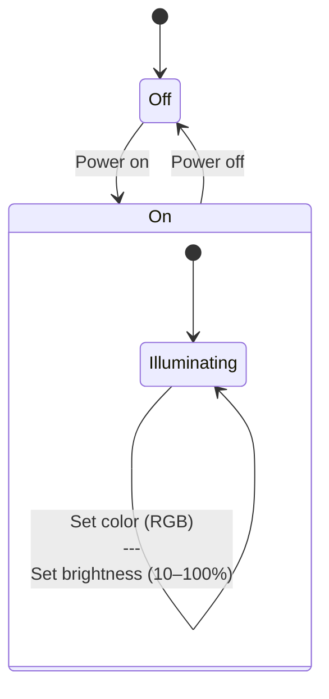

- Brightness is an integer percentage clamped to the range [10, 100].
- Color is represented as an RGB value (e.g., `#FF8800` or `{ r, g, b }`).
- Brightness and color may only be changed while the light is On.
- **Settings are retained when powered off.** If a light is set to 75% brightness and orange, then turned off and back on, it returns to 75% brightness and orange.

#### 1.1.2 Fan

| Property | Detail |
|---|---|
| States | Off, On |
| Attributes | Speed (Low, Medium, High) |
| Transitions | Off -> On, On -> Off |
| Controls | Toggle power, set speed |
| "On" condition | State is On |

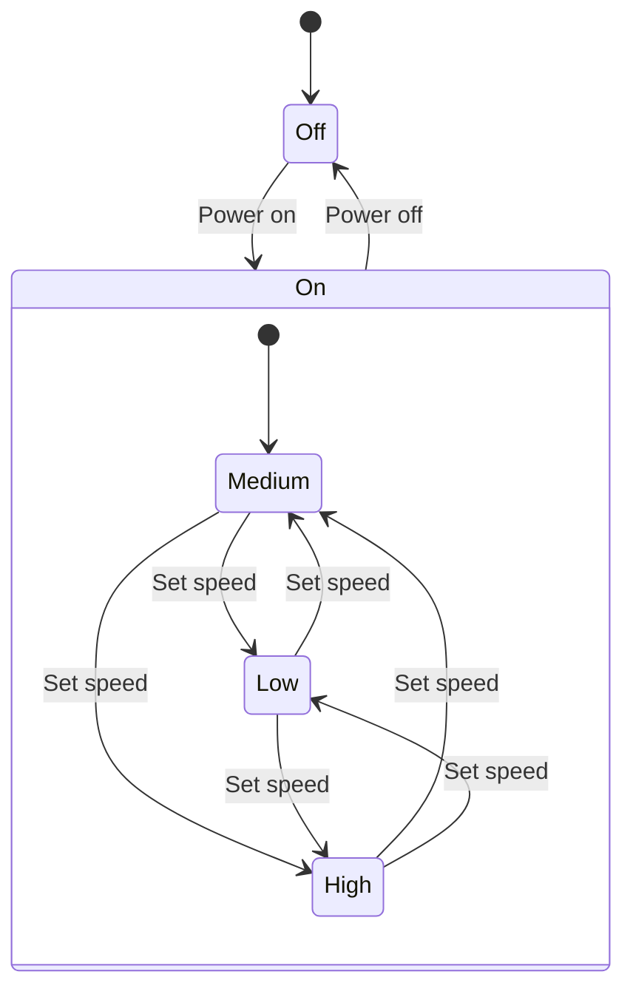

- Speed may only be changed while the fan is On.
- Default speed when turning on is Medium (if no prior speed is persisted).
- **Speed is retained when powered off.** If a fan is set to High, then turned off and back on, it returns to High.

#### 1.1.3 Thermostat

| Property | Detail |
|---|---|
| States | Off, Idle, Heating, Cooling |
| Attributes | Mode (Heat, Cool, Auto), Desired Temperature, Ambient Temperature |
| Transitions | Off -> Idle (on power-on), Idle -> Heating, Idle -> Cooling, Heating -> Idle, Cooling -> Idle, any -> Off |
| Controls | Toggle power, set mode, set desired temperature |
| "On" condition | State is Heating or Cooling |

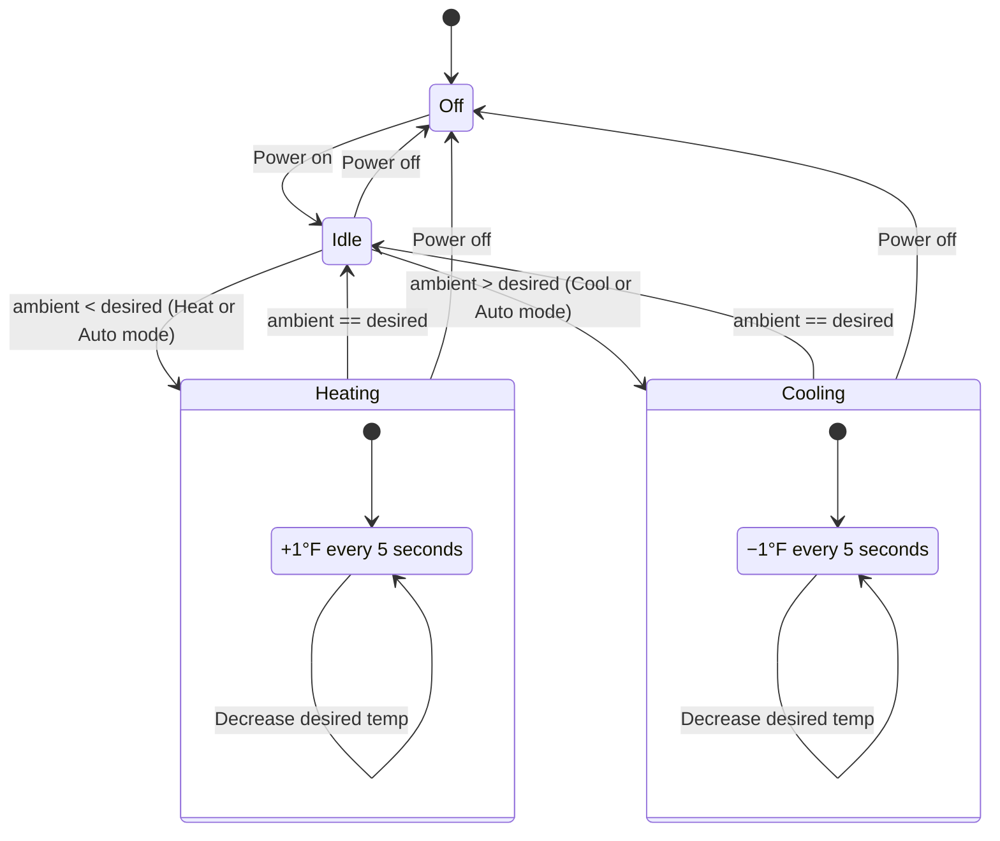

- Desired temperature is clamped to the range [60, 80] (Fahrenheit).
- **Modes:**
  - **Heat** -- System may only heat. Transitions to Heating when ambient < desired.
  - **Cool** -- System may only cool. Transitions to Cooling when ambient > desired.
  - **Auto** -- System automatically heats or cools based on ambient vs. desired temperature.
- **Temperature simulation:** While in the Heating or Cooling state, the ambient temperature changes by 1 degree every 5 seconds toward the desired temperature. When ambient equals desired, the thermostat transitions to Idle.
- A thermostat in Idle state is **not** considered "on" for UI filtering purposes.
- **Invariant:** There may be only **one thermostat per location**. The API must enforce this constraint when registering a new thermostat and return an appropriate error if violated.

#### 1.1.4 Door Lock (Latch Device)

| Property | Detail |
|---|---|
| Category | Latch (always energized, no power state) |
| States | Locked, Unlocked |
| Transitions | Locked -> Unlocked, Unlocked -> Locked |
| Controls | Toggle lock |
| "On" condition | Always on |

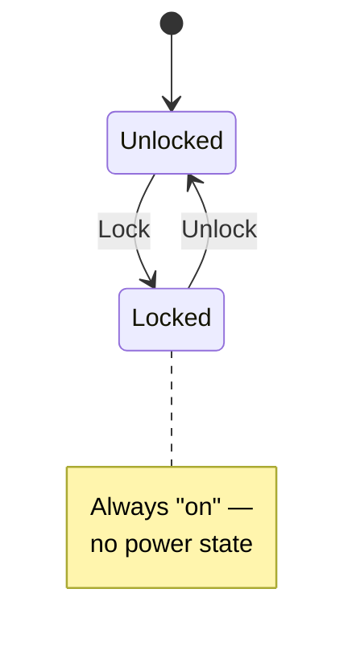

- Door locks are **latch devices** -- they have no Off state and are always considered "on" for UI filtering purposes.
- The lock's state (Locked/Unlocked) represents the device's substate, not a power condition.

### 1.2 Device Metadata

Every device has the following metadata:

| Field | Type | Description |
|---|---|---|
| `id` | UUID / GUID | Unique identifier |
| `name` | string | Human-readable device name (e.g., "Living Room Overhead") |
| `location` | string | Room or area (e.g., "Kitchen", "Master Bedroom") |
| `type` | enum | Light, Fan, Thermostat, DoorLock |

### 1.3 Environment Simulation

Each location that contains a thermostat has an **ambient temperature** that represents the external or environmental temperature of that room. This ambient temperature drives the thermostat's behavior -- it is what the thermostat "sees" and reacts to.

- The ambient temperature for each thermostat's location is configurable via the API and the UI.
- **Example scenario:** A reviewer sets the ambient temperature of the "Living Room" to 90°F. The thermostat (in Cool or Auto mode, with a desired temperature of 72°F) detects that the ambient temperature exceeds the desired temperature, transitions to Cooling, and begins reducing the ambient temperature by 1 degree every 5 seconds until it reaches 72°F, at which point it transitions to Idle.
- The ambient temperature is persisted alongside device state and survives application restart.
- When a thermostat is Off, changes to the ambient temperature are still tracked but do not trigger state transitions. When the thermostat is powered on, it evaluates the current ambient temperature against the desired temperature and transitions accordingly.

The environment simulation is what makes the thermostat meaningful -- without it, the thermostat has no external stimulus to react to.

### 1.4 Simulation Settings

The UI must provide a **simulation settings panel** (accessible from the header) with the following controls:

| Setting | Description |
|---|---|
| **Ambient temperature per location** | Set the ambient temperature for each location that contains a thermostat. This is the primary mechanism for driving thermostat behavior during testing and demos. |
| **Simulation speed** | A multiplier (1x, 2x, 5x, 10x) that controls the thermostat tick rate. At 1x the thermostat changes 1°F every 5 seconds. At 10x it changes 1°F every 0.5 seconds. This allows reviewers to observe thermostat behavior without long waits. The current simulation clock and active speed multiplier are displayed in the header. The clock advances faster when the multiplier is above 1x, providing a clear visual indicator that the simulation is accelerated. |
| **Reset all devices** | Returns all devices to their factory default states (powered devices Off, door locks Unlocked, thermostats Off with default temperatures). Persisted state is overwritten. Useful for testing and grading. |

- Simulation settings are exposed via the API as well (e.g., `PUT /api/simulation/speed`, `POST /api/simulation/reset`).
- The simulation speed setting does **not** need to be persisted -- it can default to 1x on application restart.

## 2. Technical Requirements

### 2.1 Technology Stack

#### 2.1.1 Front End

The UI will be implemented using one of the following frameworks (student's choice):

- [**Angular**](https://angular.dev) (latest stable)
- [**React**](https://react.dev) (latest stable)

#### 2.1.2 Component Library

The UI must use a commercial or open-source component library for layout, form controls, data display, and theming. Hand-rolled HTML/CSS for standard UI elements is not acceptable. All of the libraries below are available at no cost and will ensure your project looks great on both desktop and mobile devices. Commercial component libraries provide massive productivity enhancements and help you avoid wasting valuable time.

**Recommended:**

- [**PrimeNG**](https://primeng.org) (Angular) -- rich component set with built-in theming, data tables, form controls, and layout primitives
- [**PrimeReact**](https://primereact.org) (React) -- same breadth of components as PrimeNG for the React ecosystem

The Prime libraries are recommended because they offer a wider range of components out of the box, which reduces the amount of custom UI work required.

*These are only recommended because Jeff is familiar with them... PrimeNG is used at his company. The primary reason for using a component library is to save you time.*

**Other component library options...**

| Library | Framework | Notes |
|---|---|---|
| [**NG-ZORRO**](https://ng.ant.design) | Angular | Ant Design for Angular. Large component set, strong enterprise adoption. |
| [**Clarity**](https://clarity.design) | Angular | VMware's design system. Enterprise-focused, battle-tested at scale. |
| [**Taiga UI**](https://taiga-ui.dev) | Angular | Modern, well-designed. Strong accessibility support. |
| [**Ant Design**](https://ant.design) | React | One of the most widely used React component libraries globally. Massive component catalog. |
| [**Chakra UI**](https://chakra-ui.com) | React | Excellent accessibility, clean API, strong community. |
| [**Mantine**](https://mantine.dev) | React | Modern, feature-rich, includes hooks library. |
| [**shadcn/ui**](https://ui.shadcn.com) | React | Copy-into-project components built on Radix primitives. Highly customizable. |

#### 2.1.3 Back End

The API will be implemented using one of the following frameworks (student's choice):

- [**C# / .NET**](https://dotnet.microsoft.com/en-us/download) (dotnet 10, Web API)
- [**Java / Spring Boot**](https://spring.io/projects/spring-boot/) (JDK 21+ LTS)

**Java-specific requirements:**

- **Maven** must be used as the build system.
- Use [**Spring Initializr**](https://start.spring.io) to bootstrap the project with the correct dependencies.

#### 2.1.4 API Tooling

| Tool | Purpose |
|---|---|
| [**Swagger / OpenAPI**](https://swagger.io/specification/) | API documentation and interactive exploration ([Swashbuckle for .NET](https://github.com/domaindrivendev/Swashbuckle.AspNetCore), [SpringDoc for Java](https://springdoc.org)) |
| [**Bruno**](https://www.usebruno.com) | API endpoint testing (collections committed to the repository) |

### 2.2 Persistence

#### 2.2.1 Storage Medium

Device configuration and state must be persisted using one of the following (student's choice):

| Option | Detail |
|---|---|
| **JSON file** | A structured JSON file read at startup and written on state change |
| **SQLite database** | A local SQLite database accessed through an ORM (extra credit -- see Section 7.1) |

The application must ship with **pre-configured seed data** so the reviewer has a working system immediately on first run. The seed data must include:

- Multiple **lights** across at least two locations (varying brightness and color)
- Multiple **fans** across at least two locations
- Multiple **door locks** across at least two locations
- At least one **thermostat** with a configured desired temperature and ambient temperature

This ensures the reviewer can immediately see a populated dashboard, test filtering by location and device type, and observe the thermostat simulation without first having to manually register devices.

#### 2.2.2 State Persistence

- The full device configuration (metadata + current state + attributes) is loaded on application startup.
- All state changes are written back to the persistence medium so they **survive an application restart**.
- State machines must support **dehydration** (serializing current state to the persistence medium) and **rehydration** (restoring a state machine to a previously persisted state on startup).

### 2.3 State Machines

#### 2.3.1 Formal State Machine Implementation

- Each device type must implement a formal state machine with explicitly defined states and transitions.
- Invalid transitions must be rejected (not silently ignored).
- The state machine infrastructure should be **generic and reusable** -- adding a new device type should require defining its states and transitions, not modifying the state machine engine.

#### 2.3.2 Dehydration and Rehydration

- State machines must be serializable to and deserializable from the chosen persistence medium.
- On startup, each device's state machine is restored to its last known state, including all attribute values (brightness, speed, temperature, etc.).

### 2.4 API Design

#### 2.4.1 RESTful Endpoints

The back-end API must expose RESTful endpoints for:

| Endpoint Category | Examples |
|---|---|
| **List devices** | `GET /api/devices` with optional query filters (location, type, state) |
| **Get device** | `GET /api/devices/{id}` |
| **Register device** | `POST /api/devices` with type, name, and location in the request body |
| **Remove device** | `DELETE /api/devices/{id}` |
| **Control device** | `PUT /api/devices/{id}/state` or `POST /api/devices/{id}/commands` |
| **Set ambient temperature** | `PUT /api/locations/{location}/ambient-temperature` with temperature in the request body |
| **Device metadata** | As needed for filtering, grouping, and display |

Specific endpoint design is left to the student, but must follow REST conventions and return appropriate HTTP status codes.

**CORS (Cross-Origin Resource Sharing):** Since the front end and back end run as separate services (separate Docker containers, separate ports), the browser will block API requests unless the back end is configured to allow cross-origin requests. You **must** configure CORS middleware in your API to allow requests from the front-end origin. This is a common stumbling point -- if your UI loads but API calls fail silently, CORS is almost certainly the issue.

- **.NET:** Use `builder.Services.AddCors()` and `app.UseCors()` in `Program.cs`
- **Spring Boot:** Use `@CrossOrigin` annotations or a global `WebMvcConfigurer` bean

#### 2.4.2 API Documentation

The API must be documented using [**Swagger / OpenAPI**](https://swagger.io/specification/):

- **.NET:** [Swashbuckle](https://github.com/domaindrivendev/Swashbuckle.AspNetCore) or [NSwag](https://github.com/RicoSuter/NSwag)
- **Java:** [SpringDoc OpenAPI](https://springdoc.org)

The Swagger UI must be accessible when the application is running (e.g., at `/swagger`). All endpoints, request/response schemas, and error responses must be documented. The API specification serves as a formal contract between the front end and back end.

#### 2.4.3 API Testing with Bruno

The project must include a [**Bruno**](https://www.usebruno.com) collection that exercises all API endpoints. Bruno is an open-source, git-friendly API client that stores collections as plain files.

- The Bruno collection must be committed to the repository (e.g., in a `/bruno` or `/api-tests` directory).
- The collection must include requests for every endpoint: listing, getting, registering, removing, and controlling devices, as well as retrieving command history.
- Requests should include example request bodies and demonstrate both success and error cases.
- The collection serves as both a testing tool during development and a deliverable for grading -- the instructor will use it to exercise the API.

#### 2.4.4 Device Command History

The API must maintain an **audit log** of operations performed on each device. Each log entry records:

| Field | Description |
|---|---|
| Timestamp | When the operation occurred |
| Device ID | Which device was affected |
| Operation | What was done (e.g., "power on", "set brightness to 80", "lock") |

- The audit log is persisted alongside device state and survives application restart.
- The API exposes an endpoint to retrieve the command history for a device (e.g., `GET /api/devices/{id}/history`).
- The UI displays a recent activity feed or per-device history view.

### 2.5 Repository Structure

The repository must follow a clean, organized structure consistent with industry conventions. The front end and back end are **sibling directories** at the repository root -- do not nest one inside the other. This keeps build tooling, CI pipelines, and Dockerfiles cleanly separated.

All repositories must include:

| File/Directory | Purpose |
|---|---|
| `README.md` | Project introduction, setup instructions, Loom video links, design pattern catalog |
| `.gitignore` | Language-appropriate ignores for build artifacts, dependencies, IDE files, and environment secrets |
| `docker-compose.yml` | Orchestrates all services (front end, back end, database, etc.) |
| `frontend/` | The SPA application (Angular or React) |
| `bruno/` | Bruno API test collection |

#### 2.5.1 C# / .NET Repository

```
├── README.md
├── .gitignore
├── docker-compose.yml
├── SmartHome.sln
├── backend/
│   ├── src/
│       ├── SmartHome.Api/              # Web API project (controllers, middleware)
│       │   ├── SmartHome.Api.csproj
│       │   ├── Dockerfile
│       │   ├── Controllers/
│       │   └── Program.cs
│       ├── SmartHome.Domain/           # Domain models, state machines, interfaces
│       │   └── SmartHome.Domain.csproj
│       └── SmartHome.Infrastructure/   # Persistence, external services
│           └── SmartHome.Infrastructure.csproj
├── data/                                 # Application storage
│   ├── devices.json                      # JSON persistence (option A)
│   └── smarthome.db                      # SQLite database (option B, ORM extra credit)
├── tests/
│   ├── SmartHome.Api.Tests/
│   │   └── SmartHome.Api.Tests.csproj
│   └── SmartHome.Domain.Tests/
│       └── SmartHome.Domain.Tests.csproj
├── frontend/
│   ├── Dockerfile
│   ├── package.json
│   ├── package-lock.json
│   └── src/
└── bruno/
```

- The `.sln` file lives at the repository root and references all `.csproj` files.
- Source projects go in `src/` with separate projects for API, Domain, and Infrastructure.
- Test projects go in `tests/` mirroring `src/` with a `.Tests` suffix.
- The `data/` directory holds the application's persistent storage. Use **either** a JSON file (option A) or a SQLite database (option B, ORM extra credit) -- not both. This directory should be mapped as a Docker volume so data survives container restarts. The seed data file (JSON) or initial migration (SQLite) populates this on first run.
- `.gitignore` must exclude: `bin/`, `obj/`, `*.user`, `.vs/`, `node_modules/`, `dist/`, `.angular/cache/`, `data/smarthome.db`. The seed JSON file (`data/devices.json`) **should** be committed so the application ships with initial data.
- Commit `package-lock.json` (or `pnpm-lock.yaml`).

#### 2.5.2 Java / Spring Boot Repository

```
├── README.md
├── .gitignore
├── docker-compose.yml
├── pom.xml                           # Parent POM (aggregator)
├── backend/
│   ├── pom.xml                       # Spring Boot module
│   ├── Dockerfile
│   └── src/
│       ├── main/
│       │   ├── java/
│       │   │   └── com/example/smarthome/
│       │   │       ├── controller/
│       │   │       ├── service/
│       │   │       ├── domain/
│       │   │       ├── repository/
│       │   │       └── SmartHomeApplication.java
│       │   └── resources/
│       │       └── application.yml
│       └── test/
│           └── java/
│               └── com/example/smarthome/
├── data/                                 # Application storage
│   ├── devices.json                      # JSON persistence (option A)
│   └── smarthome.db                      # SQLite database (option B, ORM extra credit)
├── frontend/
│   ├── Dockerfile
│   ├── package.json
│   ├── package-lock.json
│   └── src/
└── bruno/
```

- The parent `pom.xml` at the repository root uses `<packaging>pom</packaging>` and declares `backend/` (and optionally `frontend/`) as modules.
- Source code follows the Maven standard directory layout: `src/main/java/` and `src/test/java/`.
- Tests live alongside source in `backend/src/test/java/` mirroring the main package structure.
- The `data/` directory holds the application's persistent storage. Use **either** a JSON file (option A) or a SQLite database (option B, ORM extra credit) -- not both. This directory should be mapped as a Docker volume so data survives container restarts. The seed data file (JSON) or initial migration (SQLite) populates this on first run.
- `.gitignore` must exclude: `target/`, `*.class`, `.idea/`, `*.iml`, `.settings/`, `.project`, `.classpath`, `node_modules/`, `dist/`, `data/smarthome.db`. The seed JSON file (`data/devices.json`) **should** be committed so the application ships with initial data.
- Commit the Maven wrapper (`mvnw`, `.mvn/`) and `package-lock.json`.

#### 2.5.3 Front-End Directory (Angular or React)

The `frontend/` directory is a standalone SPA project, independent of the back-end build system.

**Angular:**
```
frontend/
├── Dockerfile
├── package.json
├── package-lock.json
├── angular.json
├── tsconfig.json
├── src/
│   ├── app/
│   │   ├── components/
│   │   ├── services/
│   │   ├── models/
│   │   └── app.module.ts (or app.config.ts for standalone)
│   ├── assets/
│   ├── environments/
│   └── index.html
└── karma.conf.js (or jest.config.ts)
```

**React:**
```
frontend/
├── Dockerfile
├── package.json
├── package-lock.json
├── vite.config.ts (or next.config.js)
├── tsconfig.json
├── src/
│   ├── components/
│   ├── services/
│   ├── models/
│   ├── App.tsx
│   └── main.tsx
├── public/
└── vitest.config.ts (or jest.config.ts)
```

For both frameworks: `package.json` lives at the root of `frontend/`. All front-end dependencies, scripts, and configuration are self-contained within this directory.

**Environment configuration:** The front end needs to know the back-end API URL, and this URL differs between environments (e.g., `http://localhost:5000` during local development vs. `http://api:8080` inside Docker). Use environment files or build-time configuration to manage this:

- **Angular:** `src/environments/environment.ts` and `environment.prod.ts`
- **React (Vite):** `.env` and `.env.production` files with `VITE_API_URL`

Avoid hard-coding the API URL anywhere in your source code.

## 3. User Interface Requirements

### 3.1 Device Dashboard

- The UI displays all devices grouped by **location**.
- Within each location group, devices are listed by **name**.
- Each device displays its current state and relevant attributes.
- Devices considered "on" (see Section 1.1, "On" condition per device type) are visually distinguished.
- The dashboard must include a link to configure the simulation, including the current temperature of the locations containing thermostats (which the thermostats will mutate) and the simulation tick rate (which affects the speed at which the thermostats affect the ambient temperature of each location).

### Example Desktop and Mobile UI

> These are examples generated by Claude Code. Your UI may vary. 

[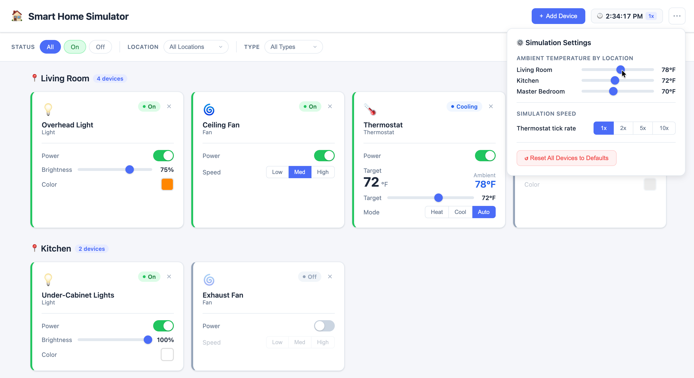](mockups/dashboard.html)

> The desktop UI example also shows the environment settings for adjusting the ambient temperature to demonstrate the thermostat device(s).

[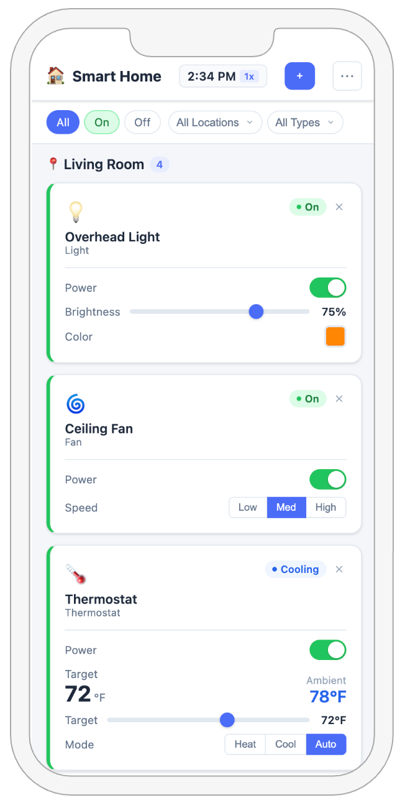](mockups/dashboard-mobile.html)

The demo files for these examples are located in the `mockups/` folder.

### 3.2 Filtering

The dashboard supports the following filters (combinable):

| Filter | Behavior |
|---|---|
| **On** | Show only devices in an "on" state (includes all latch devices, powered devices that are active) |
| **Off** | Show only powered devices that are currently off (latch devices are never "off") |
| **Location** | Show only devices in a selected location |
| **Device Type** | Show only devices of a selected type |

### 3.3 Device Controls

- Each device on the dashboard exposes inline controls appropriate to its type.
- Controls reflect the current state and update in real time (or near-real-time) upon state changes.
- Invalid operations (e.g., dimming a light that is off) are prevented by the UI.

### 3.4 Responsive / Mobile-Friendly Design

The UI must be **mobile-friendly** and usable on both desktop and mobile screen sizes. A smart home controller is the type of application a user is likely to operate from their phone.

- The layout must adapt to small screens using responsive design (CSS media queries, flexbox/grid, or the component library's responsive utilities).
- Device cards, controls, filters, and navigation must remain usable on a typical mobile viewport (375px width and up).
- This is not a request for a separate mobile app -- the same SPA must work well at all screen sizes.

### 3.5 Device Management

- The UI provides the ability to **register a new device** by specifying its type, name, and location. The new device is initialized in its default state (e.g., Off for powered devices, Unlocked for a door lock).
- The UI provides the ability to **remove an existing device** with a confirmation prompt. Removal deletes the device and its persisted state.

## 4. Design Requirements

### 4.1 Separation of Concerns

The back end must properly separate responsibilities across layers:

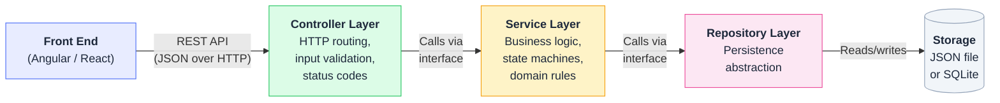

Each layer has a single responsibility and depends only on the layer below it via abstractions (interfaces), never on concrete implementations:

- **Controller / HTTP Layer** -- Handles request/response mapping, input validation, HTTP status codes, and routing. Controllers must remain thin and delegate all business logic to the service layer.
- **Service / Domain Layer** -- Contains all business logic, state machine orchestration, and domain rules. Services operate on domain models and are independent of HTTP concerns.
- **Repository Layer** -- Abstracts persistence behind an interface. The service layer never interacts with the storage medium directly.

### 4.2 SOLID Principles

All classes, namespaces, packages, and modules must demonstrate adherence to SOLID principles:

| Principle | Requirement |
|---|---|
| **Single Responsibility (SRP)** | Each class has one reason to change. Controllers do not contain business logic. Services do not contain persistence logic. |
| **Open-Closed (OCP)** | New device types can be added without modifying existing device infrastructure. State machines are extensible by design. |
| **Liskov Substitution (LSP)** | All device subtypes are safely substitutable for their base type or interface. No subclass violates the contract of its parent. |
| **Interface Segregation (ISP)** | Clients depend only on the interfaces they use. Device capabilities are modeled through focused, cohesive interfaces (e.g., a door lock does not implement a dimming interface). |
| **Dependency Inversion (DIP)** | High-level modules depend on abstractions, not concretions. All service and repository dependencies are injected via the framework's DI container. |

### 4.3 Dependency Injection

- All dependencies must be registered in and resolved from the framework's built-in DI container (.NET `IServiceCollection` or Spring `ApplicationContext`).
- **Anti-patterns such as Service Locator are prohibited.** Classes must not resolve their own dependencies from the container.

### 4.4 Abstraction Quality

- All interfaces and abstract classes must include clear, meaningful documentation comments explaining their purpose and contract.
- Abstractions must follow Ousterhout's **deep module** concept: present a simple, narrow interface to consumers while encapsulating significant complexity internally. Complexity is pushed down into implementations, not leaked upward to callers.

### 4.5 Design Pattern Identification

Students must consciously identify and apply recognized design patterns where the project naturally demands them.

#### Required Patterns (all teams)

These patterns are inherent to the core requirements. Every team must implement and document them.

| Pattern | Application | Why It's Required |
|---|---|---|
| **State** | Device state machines | Each device type has formally defined states and transitions. The State pattern encapsulates state-specific behavior and makes transitions explicit. |
| **Factory** | Device creation by type | The system must create different device types (Light, Fan, Thermostat, DoorLock) from a registration request. A Factory centralizes creation logic and supports OCP -- adding a new device type should not require modifying existing creation code. |
| **Strategy** | Thermostat heating/cooling/auto mode behavior | The thermostat's three modes (Heat, Cool, Auto) each define different rules for when to start heating or cooling. The Strategy pattern allows the mode to be selected at runtime without conditional branching in the thermostat logic. |

#### Required Patterns (conditional on extra credit)

These patterns become required when the corresponding extra credit feature is implemented.

| Pattern | Application | Required When |
|---|---|---|
| **Observer** | State change notification -- the back end notifies all connected UI clients when device state changes | SSE extra credit (Section 7.2) |
| **Command** | Device operations encapsulated as objects -- enables audit logging, undo potential, and scene composition | Scenes extra credit (Section 7.5) |
| **Composite** | A scene composes multiple command objects into a single executable unit that can span devices and locations | Scenes extra credit (Section 7.5) |

#### Additional Patterns

Students are not limited to the patterns above. The following are examples of patterns that may arise naturally depending on implementation choices. Identify and document any additional patterns wherever they are applied.

| Pattern | Potential Application |
|---|---|
| **Repository** | Abstracting persistence behind an interface so the service layer is independent of the storage medium. **Strongly recommended for all teams** -- see Section 7.1.2 for a detailed pseudocode example, which applies equally to JSON persistence. |
| **Decorator** | Adding cross-cutting behavior (logging, validation, caching) to services without modifying them |
| **Singleton** *(via DI container)* | Managing shared state such as the SSE event broadcaster or thermostat simulation timer |
| **Template Method** | Defining a common device lifecycle (initialize, validate transition, apply state, persist) with device-specific steps overridden by subclasses |
| **Adapter** | Wrapping an external API (e.g., an LLM provider or identity provider) behind an internal interface |

The goal is to demonstrate that patterns are chosen deliberately to solve specific design problems, not applied superficially. Each pattern documented must include: the pattern name, where it is implemented (class/file references), and a brief rationale explaining why this pattern was the right choice for the problem.

### 4.6 Validation Strategy

**Never trust data from the browser.** Even though this project does not implement authentication or security controls, all data arriving at the API must be validated server-side. The UI may provide client-side validation for user experience, but client-side validation is **not a substitute** for server-side validation -- a browser's requests can always be forged or tampered with.

Input validation must be handled consistently and at the correct architectural layer:

- **Controller layer** -- Validates HTTP-level concerns: required fields present, correct data types, well-formed requests. Returns `400 Bad Request` for malformed input.
- **Service/domain layer** -- Validates business rules: brightness within [10, 100], temperature within [60, 80], valid state transitions. Returns domain-specific errors.
- Validation logic must **not** be scattered or duplicated across layers. Each validation concern belongs to exactly one layer.

**Recommended validation libraries:**

| Framework | Library | Notes |
|---|---|---|
| .NET | [**FluentValidation**](https://docs.fluentvalidation.net) | Fluent API for building strongly-typed validation rules. Separates validation logic from models. |
| Spring Boot | [**Jakarta Bean Validation (Hibernate Validator)**](https://hibernate.org/validator/) | Annotation-based validation (`@NotNull`, `@Min`, `@Max`, etc.) built into Spring Boot. |

Using a validation library keeps validation rules declarative, testable, and consistent. Avoid hand-written `if/else` validation scattered throughout controllers or services.

### 4.7 Error Handling Contract

The API must return errors in a **consistent, structured format** across all endpoints. The required format is [RFC 9457](https://datatracker.ietf.org/doc/html/rfc9457) Problem Details (`application/problem+json`), which supersedes the now-obsolete RFC 7807. See [this accessible overview](https://swagger.io/blog/problem-details-rfc9457-doing-api-errors-well/) for a practical introduction.

RFC 9457 Problem Details defines a standard JSON structure for error responses with these fields:

| Field | Required | Description |
|---|---|---|
| `type` | Yes | A URI that identifies the error type (e.g., `https://example.com/problems/duplicate-device`) |
| `title` | Yes | A short, human-readable summary (e.g., "Duplicate device") |
| `status` | Yes | The HTTP status code (e.g., `409`) |
| `detail` | Recommended | A human-readable explanation specific to this occurrence of the problem |
| `instance` | Optional | A URI identifying this specific occurrence (useful for log correlation) |

Both .NET and Spring Boot have built-in support for RFC 9457:

| Framework | Implementation | Reference |
|---|---|---|
| **.NET** | Built-in `ProblemDetails` class and `Results.Problem()`. Configure with `builder.Services.AddProblemDetails()`. | [Problem Details for ASP.NET Core APIs](https://www.milanjovanovic.tech/blog/problem-details-for-aspnetcore-apis) |
| **Spring Boot** | Built-in `ProblemDetail` class and `@ExceptionHandler` with `ResponseEntityExceptionHandler`. | [Spring MVC REST Error Handling](https://docs.spring.io/spring-framework/reference/web/webmvc/mvc-ann-rest-exceptions.html) |

Error handling must be implemented as a cross-cutting concern (e.g., exception middleware or global error handler), not as ad-hoc try/catch blocks in individual controllers.

**Never leak implementation details to the client.** Raw exceptions, stack traces, internal class names, database error messages, and connection strings must **never** appear in API responses. Leaked internals provide attackers with a roadmap of the system -- table names, column names, framework versions, file paths, and query structure all help an attacker craft targeted exploits. Even in an unauthenticated application like this one, building the habit of guarding internal details is essential.

**Example -- what NOT to return:**

```json
{
  "error": "Microsoft.Data.Sqlite.SqliteException: SQLite Error 19: 'UNIQUE constraint failed: Devices.Id'. Query: INSERT INTO Devices (Id, Name, Location, Type, State) VALUES (@p0, @p1, @p2, @p3, @p4) at SmartHome.Repositories.DeviceRepository.Add(Device device) in /src/Repositories/DeviceRepository.cs:line 47"
}
```

This single error message reveals the database engine (SQLite), table and column names (`Devices.Id`, `Name`, `Location`, `Type`, `State`), the ORM parameterization style, the internal namespace and class structure (`SmartHome.Repositories.DeviceRepository`), and the exact file path and line number. An attacker now has a detailed picture of the system's internals.

**Instead, return:**

```json
{
  "type": "https://example.com/problems/duplicate-device",
  "title": "Duplicate device",
  "status": 409,
  "detail": "A device with this ID already exists."
}
```

The full exception is logged server-side where administrators can review it. The client receives only what it needs to understand and respond to the problem.

- Error responses sent to the client must contain a **user-friendly message** that describes the problem in terms the consumer can act on.
- Internal details (exception type, stack trace, SQL errors, etc.) must be **logged server-side** for administrative review and debugging -- not returned in the response body.
- In development mode, frameworks may display detailed errors by default. Ensure the production/Docker configuration suppresses these details.

## 5. Development Requirements

### 5.1 Testing

All integration and unit tests -- both back end and front end -- **may be generated by AI**. The use of AI tools for test generation is explicitly permitted and encouraged.

#### 5.1.1 Unit Tests

- **State machine transitions** -- Every valid transition is tested. Every invalid transition is tested and confirmed to be rejected.
- **Boundary conditions** -- Light brightness (10, 100, and out-of-range values), thermostat temperature (60, 80, and out-of-range values), fan speed values.
- **Service/domain logic** -- Business rules are tested independently of HTTP and persistence concerns.
- **Device creation and removal** -- Factory or creation logic produces correctly initialized devices.
- **Invariants** -- Registering a second thermostat in a location that already has one is rejected.

#### 5.1.2 Integration Tests

- **API contract** -- Each endpoint returns correct status codes and response shapes for both success and error cases.
- **Persistence round-trip** -- A device's state survives dehydration and rehydration (write, restart, read back).
- **Thermostat simulation** -- The temperature changes over time toward the desired temperature and the thermostat transitions to Idle when the target is reached.

#### 5.1.3 Front-End Tests

- **Component rendering** -- Device controls render correctly for each device type and state.
- **Filter behavior** -- Filtering by on/off, location, and device type shows the correct subset of devices.
- **Invalid input prevention** -- The UI prevents submission of out-of-range or invalid values.

## 6. Delivery Requirements

Your repository's README must include:

- Short introduction<br>
  *What does the application do?*
- Setup and Run instructions<br>*The goal is to clone-and-go with as little setup as possible from Docker and the command line. Engineers reviewing your solution should not need an IDE to run it.*
- Video Walkthroughs and Demonstrations<br>*Demonstrate your running application (critical in case I cannot get it to run) and perform an architecture walk-through (do not just read code - explain it!).*

### 6.1 Setup and Run Instructions

The goal is **clone-and-go**: a reviewer should be able to clone the repository and have the application running with minimal effort. 

The repository must include clear, step-by-step instructions (in the README or a dedicated `SETUP.md`) covering:

- **Prerequisites** -- Only Docker and Docker Compose should be required. If any other tooling is needed (e.g., an API key for the LLM extra credit), it must be explicitly documented including how to apply it to the runtime environment.
- **How to build and run from the CLI** -- The exact commands needed to start the application. Ideally a single `docker compose up` command.
- **How to access the application** -- The URL(s) for the UI, API, and Swagger documentation once running.
- **How to run tests** -- The exact commands to execute the back-end and front-end test suites.
- **How to use the Bruno collection** -- Where the collection is located and how to open it.
- **Test credentials** -- If JWT authentication is implemented, pre-configured test user credentials must be documented.

### 6.2 Docker

The entire application must be runnable locally using **Docker**.

- The project must include a `docker-compose.yml` (or equivalent) that builds and starts all required services (front end, back end, and any database or identity provider if applicable).
- A reviewer must be able to clone the repository and run the application with a single `docker compose up` command.
- The Docker configuration must not require the reviewer to install framework-specific tooling (e.g., .NET SDK, JDK, Node.js) on their host machine -- all build and runtime dependencies are handled inside containers.
- On first run, the application must be **fully seeded and ready to use** -- no manual migration commands, no manual data imports.

### 6.3 Local Development 

Document how to run the front end and back end outside of Docker for local development (e.g., `dotnet run`, `mvn spring-boot:run`, `npm start`). This helps teammates who prefer to develop without rebuilding containers on every change.

### 6.4 Video Deliverables

The team must produce **two Loom videos** and include the links in the project README. Create a free account at [loom.com](https://www.loom.com).

#### 6.4.1 Application Demo Video

A walkthrough of the **working application** demonstrating:

- The device dashboard with devices grouped by location
- Filtering by on/off, location, and device type
- Controlling each device type (light, fan, thermostat, door lock)
- Registering a new device and removing an existing device
- The thermostat environment simulation (setting ambient temperature and watching the thermostat react)
- The device command history / activity feed
- Any extra credit features the team implemented

#### 6.4.2 Architecture Tour Video

A tour of the **codebase and architecture** covering:

- Project structure and layer organization (controllers, services, repositories/persistence)
- How SOLID principles are applied (with specific examples from the code)
- The state machine implementation and how new device types can be added
- Design patterns used and where they appear
- How dehydration/rehydration works
- How validation and error handling are structured
- Any architectural decisions the team is particularly proud of

Each video should be **5--10 minutes**. These videos serve as both a grading aid and practice for the kind of technical presentations expected in industry.

### 6.5 Team Policy

#### 6.5.1 Team Size

- The base team size is **1 or 2 developers**.
- A team may add additional developers **only if** the team also commits to implementing an extra credit feature for each additional member.
- The **maximum team size is 6**.

**A warning about large teams:** As team size increases, coordination overhead grows dramatically. The number of communication channels in a team follows the formula **N × (N - 1) / 2** -- a team of 2 has 1 channel, a team of 4 has 6, and a team of 6 has 15. Larger teams spend proportionally more time coordinating and less time building. Choose your team size carefully -- a focused team of 3 will almost always outperform a disorganized team of 6.

| Team Size | Communication Channels |
|---|---|
| 2 | 1 |
| 3 | 3 |
| 4 | 6 |
| 5 | 10 |
| 6 | 15 |

#### 6.5.2 Extra Credit and Team Size Trade-Off

When an extra credit feature is adopted to justify a larger team, that feature becomes a **mandatory requirement** for the team -- it is no longer extra credit.

| Team Size | Requirements |
|---|---|
| 1--2 | All core requirements (Sections 1--6) |
| 3 | All core requirements + 1 extra credit feature becomes mandatory |
| 4 | All core requirements + 2 extra credit features become mandatory |
| 5 | All core requirements + 3 extra credit features become mandatory |
| 6 | All core requirements + 4 extra credit features become mandatory |

Available extra credit features: **ORM** (Section 7.1), **SSE** (Section 7.2), **LLM/MCP** (Section 7.3), **JWT Authentication** (Section 7.4), **Scenes** (Section 7.5), **CI/CD** (Section 7.6).

A team of 6 adopts 4 features as mandatory, leaving 2 still available for extra credit.

#### 6.5.3 Examples

- A team of 2 implements all core requirements. All six extra credit features are optional.
- A team of 3 chooses to implement Scenes. Scenes is now mandatory for this team and no longer earns extra credit. The remaining five features are available for extra credit.
- A team of 4 must adopt 2 extra credit features as mandatory (e.g., ORM and SSE). The remaining four features are still available for extra credit.
- A team of 5 must adopt 3 extra credit features as mandatory. The remaining three features are still available for extra credit.
- A team of 6 must adopt 4 extra credit features as mandatory. The remaining two features are still available for extra credit.

#### 6.5.4 Dysfunctional Teams and Member Removal

If a team is not functioning effectively, team members may be **removed ("fired")** from the team under the following rules:

- Any team member may be removed by a majority decision of the remaining team members, or by instructor intervention.
- **Removal is not permitted during the final two weeks of the semester.** Teams must resolve conflicts or seek instructor mediation before that deadline.
- A removed member must either:
  - **Work independently** (team of 1), or
  - **Join with other removed members** to form a new team.
- The original team's scope requirements are **not reduced** after a member is removed. If the team adopted extra credit features to justify their original size, those features remain mandatory. Learning to effectively work in teams (including picking outstanding teammates) is a critical skill.
- The removed member's new team (solo or reformed) is held to the standard requirements for their new team size.

## 7. Extra Credit

Each extra credit feature is worth **+5%**. Teams that adopt extra credit features to justify a larger team size (see Section 6.5.2) must implement those features as mandatory requirements -- they no longer earn bonus points.

**Extra credit options:**

- [7.1 Object Relational Mapper (ORM)](#71-object-relational-mapper-orm)
- [7.2 Server-Sent Events (SSE)](#72-server-sent-events-sse)
- [7.3 LLM Natural Language Control via MCP](#73-llm-natural-language-control-via-mcp)
- [7.4 JWT Authentication](#74-jwt-authentication)
- [7.5 Device Scenes](#75-device-scenes)
- [7.6 CI/CD Pipeline](#76-cicd-pipeline)

---

### 7.1 Object Relational Mapper (ORM)

Using an ORM instead of a JSON file for persistence earns extra credit:

- **.NET:** Entity Framework Core
- **Java:** Hibernate / Spring Data JPA

#### 7.1.1 Automatic Seeding on Startup

The database migration that seeds the initial device configuration **must run automatically** on application startup. The reviewer should not need to manually run migration commands -- `docker compose up` must produce a fully seeded, ready-to-use application.

**Seeding must be idempotent** -- if the database has already been seeded (e.g., from a previous run), the seed migration must not execute again or duplicate data.

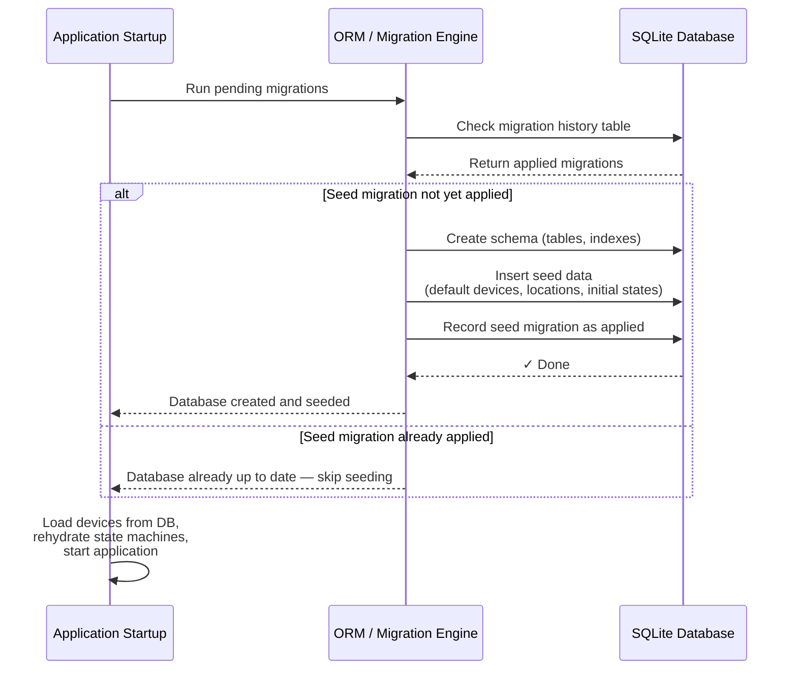

#### 7.1.2 Repository Pattern

All ORM / database calls **must** be wrapped behind the **Repository pattern**. The service layer depends on a repository abstraction (interface), never on the ORM directly. This keeps the domain logic decoupled from persistence and makes it testable with mock repositories.

**Pseudocode -- `IDeviceRepository` interface and implementation:**

```
// Abstraction (interface) — the service layer depends on this
interface IDeviceRepository
    GetAll(filters?) → List<Device>
    GetById(id) → Device?
    Add(device) → Device
    Update(device) → Device
    Delete(id) → void

// Implementation — wraps the ORM, hidden behind the interface
class DeviceRepository implements IDeviceRepository

    constructor(dbContext)
        this.db = dbContext

    GetAll(filters?)
        query = db.Devices
        if filters.location   → query = query.Where(d => d.Location == filters.location)
        if filters.type       → query = query.Where(d => d.Type == filters.type)
        return query.ToList()

    GetById(id)
        return db.Devices.Find(id)

    Add(device)
        db.Devices.Add(device)
        db.SaveChanges()
        return device

    Update(device)
        db.Devices.Update(device)
        db.SaveChanges()
        return device

    Delete(id)
        device = db.Devices.Find(id)
        if device == null → throw NotFound
        db.Devices.Remove(device)
        db.SaveChanges()
```

- The `IDeviceRepository` interface is registered in the DI container; the service layer receives it via constructor injection.
- The ORM `DbContext` (EF Core) or `EntityManager` (Hibernate) is **never** injected directly into services or controllers.
- This pattern also supports the Open-Closed Principle -- switching from SQLite to PostgreSQL requires only a new repository implementation, not changes to the service layer.

### 7.2 Server-Sent Events (SSE)

The API may expose an SSE endpoint (e.g., `GET /api/devices/events`) that pushes device state change events to all connected UI clients in real time. This enables multiple users viewing the dashboard simultaneously to see the same device state without manual refresh.

- When any device state changes (user action, thermostat simulation tick, etc.), the server emits an event to all connected SSE clients.
- The UI subscribes to the SSE stream on load and updates the dashboard reactively as events arrive.
- Events should include enough information for the client to update its local state (e.g., device ID, new state, changed attributes).
- The SSE connection should handle reconnection gracefully (the `EventSource` API provides this by default).

**Sequence diagram -- two clients observing the same state change:**

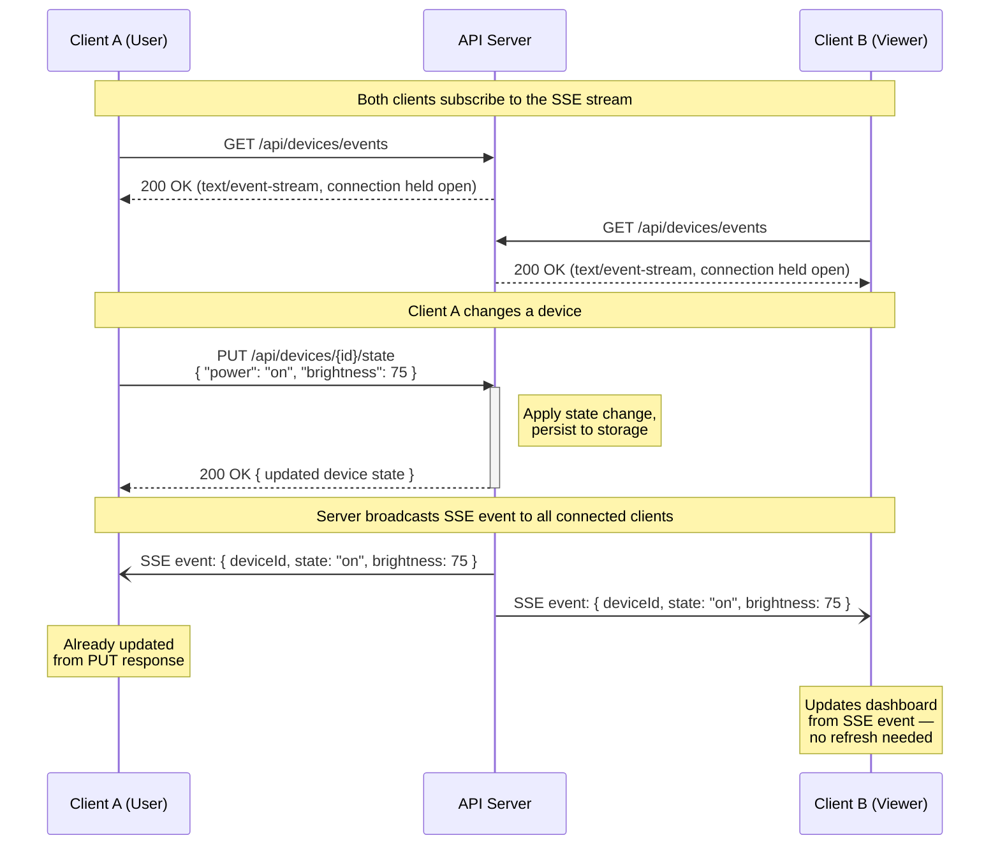

In this flow, Client A turns on a light and gets the response directly. Client B -- which could be on a different device or browser tab -- receives the same state change via the SSE stream and updates its UI automatically. The server broadcasts state change events to **all** connected SSE clients whenever any device state changes, regardless of the source (user action, thermostat simulation, scene execution, etc.).

**Implementation references:**

> The libraries below are suggestions to get you started. You choose what is best for your project.

| Layer | Technology | Library / Approach | Link |
|---|---|---|---|
| **Server** | .NET (latest LTS) | Built-in SSE support (`TypedResults.ServerSentEvents` with `IAsyncEnumerable`) -- no additional NuGet packages required | [ASP.NET Core SSE documentation](https://learn.microsoft.com/en-us/aspnet/core/fundamentals/server-sent-events) |
| **Server** | .NET (older versions) | Lib.AspNetCore.ServerSentEvents -- middleware-based SSE with client tracking and keepalive | [NuGet](https://www.nuget.org/packages/Lib.AspNetCore.ServerSentEvents) |
| **Server** | Spring Boot (MVC) | `SseEmitter` -- included in `spring-boot-starter-web`, no additional Maven dependencies needed. Manage emitters in a thread-safe collection. | [Baeldung -- SSE in Spring](https://www.baeldung.com/spring-server-sent-events) |
| **Server** | Spring Boot (Reactive) | `Flux<ServerSentEvent<T>>` -- requires `spring-boot-starter-webflux`. Non-blocking, handles backpressure. | [Maven](https://mvnrepository.com/artifact/org.springframework.boot/spring-boot-starter-webflux) |
| **Client** | Angular | Native `EventSource` API wrapped in a service, or [**ngx-sse-client**](https://www.npmjs.com/package/ngx-sse-client) if you need Angular `HttpClient` interceptor integration (e.g., for JWT auth) | [npm](https://www.npmjs.com/package/ngx-sse-client) |
| **Client** | React | Native `EventSource` API in a `useEffect` hook, or [**eventsource-parser**](https://www.npmjs.com/package/eventsource-parser) combined with `fetch()` for custom headers / auth | [npm](https://www.npmjs.com/package/eventsource-parser) |

For simple, unauthenticated SSE, the native browser `EventSource` API is sufficient on both Angular and React. The third-party libraries above are only needed when you require custom headers (e.g., JWT bearer tokens) or HTTP methods other than GET.

### 7.3 LLM Natural Language Control via MCP

The application may implement an MCP (Model Context Protocol) server that exposes smart home device operations as tools, along with a prompt UI in the front end that allows the user to control devices using natural language.

**Requirements:**

- The back end implements an **MCP server** that exposes device operations (e.g., turn on/off, set brightness, lock/unlock, set temperature) as MCP tools.
- The UI provides a **chat/prompt input** where the user can type natural language commands (e.g., "turn on all of the lights", "set the thermostat to 72", "lock the front door").
- An LLM interprets the user's intent and invokes the appropriate MCP tools to fulfill the request.
- Results and confirmations are displayed back to the user in the chat interface.

**LLM Policy:**

- The LLM **must be a real, commercially available model** -- simulation or hard-coded responses are not permitted.
- Acceptable LLM providers include:
  - **OpenAI** (GPT-4, GPT-4o, etc.)
  - **Anthropic** (Claude)
  - **Self-hosted open-source model** (e.g., LLaMA running in a container on a cloud provider such as DigitalOcean)
- The team is **responsible for any costs incurred**, including providing a working API key to the instructor for testing and grading.

**Sequence diagram -- natural language command via LLM and MCP:**

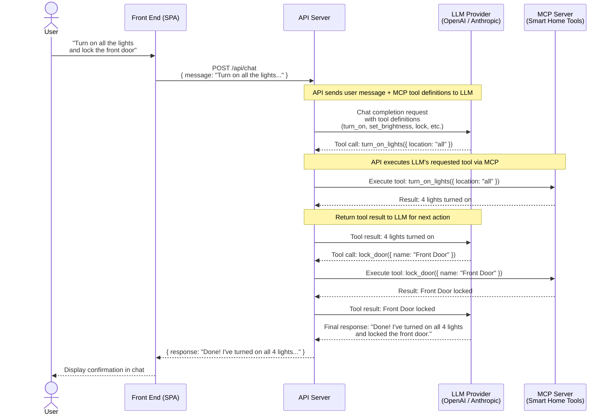

In this flow, the LLM acts as the reasoning layer -- it interprets the user's natural language intent, determines which MCP tools to call and in what order, and composes a human-friendly response from the results. The API server orchestrates the conversation loop between the LLM and the MCP server, executing tool calls as the LLM requests them. Multiple tool calls may occur in a single user message (as shown above with lights + lock).

**MCP specification and libraries:**

The [Model Context Protocol](https://modelcontextprotocol.io) is an open standard (now governed by the Linux Foundation) that allows LLMs to discover and invoke tools exposed by an MCP server.

> The libraries below are suggestions to get you started. You choose what is best for your project.

| Layer | Technology | Library | Link |
|---|---|---|---|
| **MCP Server** | .NET | Official C# SDK -- `ModelContextProtocol` (main package) or `ModelContextProtocol.AspNetCore` (HTTP transport) | [GitHub](https://github.com/modelcontextprotocol/csharp-sdk) / [NuGet](https://www.nuget.org/packages/ModelContextProtocol) |
| **MCP Server** | Spring Boot | Official Java SDK -- `io.modelcontextprotocol.sdk:mcp` | [GitHub](https://github.com/modelcontextprotocol/java-sdk) / [Maven](https://mvnrepository.com/artifact/io.modelcontextprotocol.sdk/mcp) |
| **MCP Server** | Spring Boot (with Spring AI) | Spring AI MCP starters -- `spring-ai-starter-mcp-server` (STDIO), `spring-ai-mcp-server-webmvc-spring-boot-starter` (servlet) | [Spring AI MCP Docs](https://docs.spring.io/spring-ai/reference/api/mcp/mcp-server-boot-starter-docs.html) |

The C# SDK is co-maintained with Microsoft. The Java SDK is co-maintained with the Spring AI team. Both are at v1.x GA and fully compliant with the MCP specification.

### 7.4 JWT Authentication

The application may implement JWT-based authentication using an external identity provider. API endpoints are protected and require a valid JWT bearer token. The UI handles the login flow and passes the token with each request.

**Requirements:**

- The back end validates JWT tokens issued by the identity provider and rejects unauthenticated requests with `401 Unauthorized`.
- The UI redirects unauthenticated users to the identity provider's login page and handles the token lifecycle (acquisition, storage, refresh, logout).
- At least one test user account must be pre-configured for the reviewer to log in. Credentials must be provided to the instructor.
- User registration (self-registration or registration by an existing user) is **not required**. Pre-configured test accounts are sufficient.

**Acceptable identity providers** (open-source or free-tier recommended):

| Provider | Notes |
|---|---|
| [**Keycloak**](https://www.keycloak.org) | Open source, self-hosted. Recommended -- the instructor's company uses Keycloak with good success. Can run as a Docker container alongside the application. |
| [**Auth0**](https://auth0.com) | Free tier available. Cloud-hosted. |
| [**Microsoft Entra ID**](https://www.microsoft.com/en-us/security/business/identity-access/microsoft-entra-id) | Free tier available for development. |

If the identity provider can be containerized (e.g., Keycloak), it should be included in the `docker-compose.yml` so the reviewer can run the full stack with authentication without creating external accounts.

**Sequence diagram -- JWT authentication flow with Keycloak:**

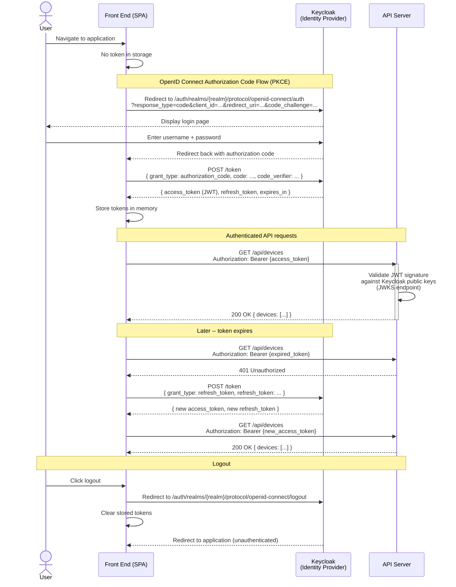

This diagram shows the complete lifecycle: initial login via OpenID Connect Authorization Code flow with PKCE (the recommended flow for SPAs), API requests with bearer tokens, the API validating the JWT against the identity provider's public keys, token refresh when the access token expires, and logout. The API server **never sees the user's password** -- authentication is fully delegated to the identity provider.

### 7.5 Device Scenes

The application may implement **scenes** -- named presets that execute a batch of device operations in a single action. Scenes allow the user to control multiple devices across multiple locations at once.

**Examples:**

| Scene | Actions |
|---|---|
| "Good Night" | Lock all doors, turn off all lights, set thermostat to 68°F |
| "Movie Night" | Dim living room lights to 20%, turn off kitchen lights, lock front door |
| "Welcome Home" | Unlock front door, turn on hallway and kitchen lights to 100% |
| "All Lights Off" | Turn off every light in the house regardless of location |

**Requirements:**

- A scene has a **name** and an ordered list of **actions**. Each action targets a specific device (by ID) or a device group (by type, location, or both) and specifies the desired operation (e.g., "turn off", "set brightness to 50", "lock").
- Scenes can **span locations** -- a single scene can target devices across the entire house.
- Actions that target a group (e.g., "all lights") are resolved at execution time, so newly added devices are automatically included.
- The user can **create, edit, delete, and execute** scenes through the UI.
- Scenes are **persisted** and survive application restart.
- The API exposes endpoints for scene CRUD and execution (e.g., `GET /api/scenes`, `POST /api/scenes`, `POST /api/scenes/{id}/execute`).
- When a scene is executed, each action is applied in order. If an individual action fails (e.g., a device is already in the target state), execution continues -- the scene does not abort on partial failure. The response reports the outcome of each action.
- Scene execution is recorded in the device command history (Section 2.4.4) for each affected device.

**Design requirement:** Scenes **must** be implemented using the **Composite** and **Command** patterns. A scene is a composite command containing an ordered list of device commands. Each device operation is encapsulated as a command object, and the scene composes them into a single executable unit. This is not optional -- the design pattern usage is part of the grading criteria for this feature. Students must document this in their design pattern identification (Section 4.5).

**Sequence diagram -- executing the "All Lights On" scene:**

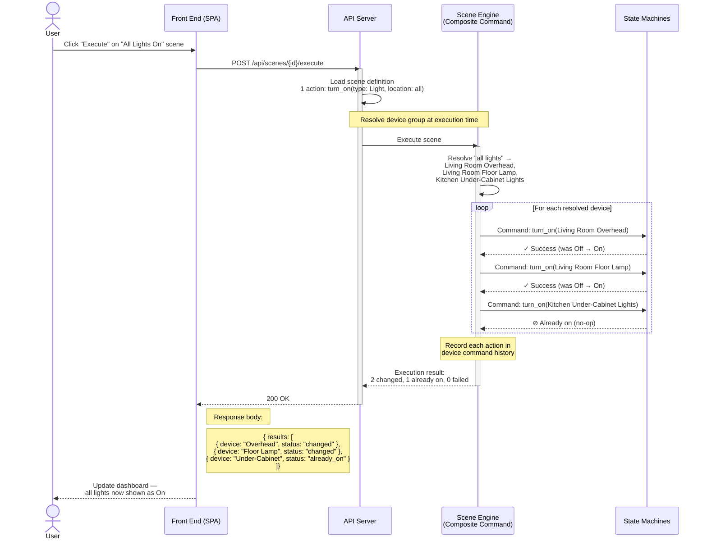

This diagram illustrates several key design points:

- **Runtime resolution** -- The scene targets "all lights" as a group, not specific device IDs. The group is resolved at execution time, so a light added after the scene was created is automatically included.
- **Composite pattern** -- The scene is a single executable unit composed of individual device commands.
- **Command pattern** -- Each device operation (turn on) is encapsulated as a command object executed against the device's state machine.
- **Partial failure tolerance** -- The Kitchen Under-Cabinet Lights were already on. The scene continues executing rather than aborting, and the response reports the outcome per device.
- **Audit trail** -- Each command is recorded in the device command history (Section 2.4.4).

### 7.6 CI/CD Pipeline

The project may implement a **CI/CD pipeline** using a platform such as [**GitHub Actions**](https://docs.github.com/en/actions), [**GitLab CI**](https://docs.gitlab.com/ee/ci/), or a similar service.

**Pipeline requirements (minimum):**

- **On every push / pull request:**
  - Lint / static analysis
  - Build the back end and front end
  - Run unit tests
  - Run integration tests
- **On merge to main:**
  - Build Docker images
  - Deploy to a cloud hosting target

**Deployment target:**

The team must deploy the application to a cloud provider. The team is **responsible for any costs incurred**. Low-cost and free-tier providers are recommended:

| Provider | Notes |
|---|---|
| [**Oracle Cloud Free Tier**](https://www.oracle.com/cloud/free/) | Always-free ARM instances (up to 4 OCPUs, 24 GB RAM). Generous for a student project. |
| [**Fly.io**](https://fly.io) | Free tier includes small VMs. Simple Docker-based deployment. |
| [**Render**](https://render.com) | Free tier for web services. Docker support. |
| [**Railway**](https://railway.app) | Free trial credits. Simple GitHub integration. |
| [**DigitalOcean**](https://www.digitalocean.com) | $200 free credit for students via GitHub Education. |
| [**AWS**](https://aws.amazon.com/free/) | Free tier (12 months). More complex but industry-standard. |

The deployed URL must be documented in the project README so the reviewer can access the live application.

**Sequence diagram -- CI/CD pipeline on push and merge:**

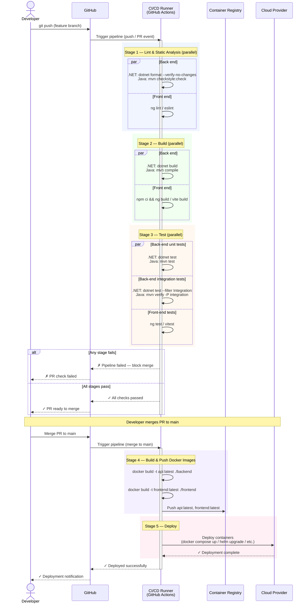

This pipeline demonstrates the expected stages:

- **On push / PR** (Stages 1--3): Lint, build, and test run in parallel where possible to minimize pipeline duration. If any stage fails, the PR is blocked from merging.
- **On merge to main** (Stages 4--5): Docker images are built and pushed to a container registry, then deployed to the cloud hosting target.
- Back-end and front-end steps run **in parallel** within each stage since they are independent build targets -- this is why the repository structure (Section 2.5) keeps them as sibling directories.

**Video requirement:** If the CI/CD extra credit is implemented, the team must produce an additional **5-minute Loom video** demonstrating the pipeline. The video should show the pipeline configuration, walk through a code check-in triggering the pipeline, and show the build, test, and deployment stages completing successfully. Include the Loom link in the project README alongside the other video deliverables.

## 8. Delivery Checklist

Use this checklist to verify your project is complete before submission. Every item corresponds to a mandatory requirement from Sections 1 to 6.

### Functional Requirements (Section 1)

- [ ] Light device: power on/off, brightness (10 to 100%), color (RGB), settings retained on power cycle
- [ ] Fan device: power on/off, speed (Low/Medium/High), settings retained on power cycle
- [ ] Thermostat device: power on/off, modes (Heat/Cool/Auto), desired temperature (60 to 80°F), ambient temperature tracking
- [ ] Thermostat simulation: ambient temperature changes 1°F every 5 seconds toward desired, transitions to Idle when reached
- [ ] Thermostat invariant: only one thermostat per location, enforced by the API
- [ ] Door Lock device: lock/unlock (latch device, always "on", no power state)
- [ ] Device metadata: each device has id, name, location, and type
- [ ] Environment simulation: ambient temperature per location configurable via API and UI
- [ ] Simulation settings panel: ambient temperature per location, speed multiplier (1x/2x/5x/10x), reset all devices
- [ ] Simulation clock displayed in header, advances with speed multiplier

### Technical Requirements (Section 2)

**Technology Stack:**
- [ ] Front end built with Angular or React (latest stable)
- [ ] Component library used (PrimeNG, PrimeReact, or approved alternative)
- [ ] Back end built with .NET (latest LTS) or Spring Boot (latest stable, JDK 21+)
- [ ] Java projects use Maven as build system
- [ ] Swagger / OpenAPI documentation accessible at runtime (e.g., `/swagger`)
- [ ] Bruno collection committed to repository covering all endpoints (success and error cases)

**Persistence:**
- [ ] Device configuration and state persisted (JSON file or SQLite)
- [ ] Pre-configured seed data: multiple lights, fans, and locks across 2+ locations, at least one thermostat
- [ ] State survives application restart
- [ ] State machines support dehydration and rehydration

**State Machines:**
- [ ] Each device type has a formal state machine with defined states and transitions
- [ ] Invalid transitions are rejected (not silently ignored)
- [ ] State machine infrastructure is generic and reusable

**API Design:**
- [ ] RESTful endpoints for: list, get, register, remove, control devices, set ambient temperature
- [ ] CORS configured to allow front-end requests
- [ ] Device command history (audit log) persisted and exposed via API
- [ ] Consistent error response format (RFC 9457 Problem Details)
- [ ] No leaked implementation details in error responses

**Repository Structure:**
- [ ] Front end and back end are sibling directories at the repository root
- [ ] `README.md`, `.gitignore`, `docker-compose.yml`, `frontend/`, `bruno/` all present
- [ ] Repository follows the conventions for your chosen stack (Section 2.5)
- [ ] Front-end environment configuration uses environment files (not hard-coded API URLs)

### User Interface Requirements (Section 3)

- [ ] Device dashboard groups devices by location, lists by name
- [ ] "On" devices visually distinguished from "off" devices
- [ ] Filtering: On, Off, Location, Device Type (combinable)
- [ ] Inline controls for each device type (toggle, slider, buttons, etc.)
- [ ] Controls disabled when not applicable (e.g., brightness when light is off)
- [ ] Responsive / mobile-friendly (usable at 375px width)
- [ ] Register new device (type, name, location)
- [ ] Remove existing device (with confirmation)
- [ ] Activity feed or per-device command history view

### Design Requirements (Section 4)

- [ ] Separation of concerns: Controller -> Service -> Repository -> Storage
- [ ] Controllers are thin (no business logic)
- [ ] Services contain no persistence logic
- [ ] All SOLID principles demonstrated
- [ ] All dependencies injected via framework DI container (no Service Locator)
- [ ] Interfaces and abstract classes have documentation comments
- [ ] Abstractions follow deep module concept
- [ ] Design patterns implemented and documented: State, Factory, Strategy (at minimum)
- [ ] Design pattern catalog in README (pattern name, class/file references, rationale)
- [ ] Server-side validation on all API inputs (validation library used)
- [ ] Consistent error handling (global error handler, no ad-hoc try/catch)
- [ ] No stack traces, SQL errors, or class names in API responses

### Development Requirements (Section 5)

- [ ] Unit tests: state machine transitions (valid and invalid)
- [ ] Unit tests: boundary conditions (brightness, temperature, speed)
- [ ] Unit tests: service/domain logic independent of HTTP
- [ ] Unit tests: device creation and removal via factory
- [ ] Unit tests: thermostat one-per-location invariant
- [ ] Integration tests: API contract (status codes, response shapes)
- [ ] Integration tests: persistence round-trip (dehydration/rehydration)
- [ ] Integration tests: thermostat simulation
- [ ] Front-end tests: component rendering, filter behavior, input validation

### Delivery Requirements (Section 6)

- [ ] Setup instructions in README or SETUP.md (prerequisites, build/run commands, URLs, test commands)
- [ ] `docker compose up` starts the entire application
- [ ] No framework-specific tooling required on host machine
- [ ] Application fully seeded and ready to use on first run
- [ ] Loom video: application demo (5 to 10 minutes)
- [ ] Loom video: architecture tour (5 to 10 minutes)
- [ ] Loom video links included in README
- [ ] Team size and extra credit selections documented

## 9. Grading Criteria

### 9.1 Mandatory Requirements (100%)

All teams are graded on the following categories. These correspond to Sections 1--6 of this specification.

| Category | Weight | Key Evaluation Points |
|---|---|---|
| **OO Design & Implementation** | 40% | See detailed rubric below |
| **UI** | 20% | See detailed rubric below |
| **Documentation & Delivery** | 20% | See detailed rubric below |
| **Persistence** | 10% | See detailed rubric below |
| **Testing** | 10% | See detailed rubric below |

#### OO Design & Implementation (40%)

| Area | Expectations |
|---|---|
| **SOLID Principles** | SRP: Controllers are thin, services contain no persistence logic. OCP: New device types can be added without modifying existing infrastructure. LSP: Device subtypes are safely substitutable. ISP: Focused interfaces (a lock doesn't implement dimming). DIP: All dependencies injected via the DI container. |
| **Design Patterns** | State, Factory, and Strategy patterns correctly implemented and documented. Pattern catalog in README maps each pattern to specific classes/files with rationale. Patterns are chosen deliberately, not applied superficially. |
| **Separation of Concerns** | Clear layering: Controller -> Service -> Repository -> Storage. No business logic in controllers. No persistence logic in services. No HTTP concerns in domain models. |
| **Dependency Injection** | All service and repository dependencies registered in the framework's DI container. No Service Locator anti-pattern. No `new` for service classes inside other services. |
| **State Machines** | Each device type has a formally defined state machine. Invalid transitions are rejected. The state machine infrastructure is generic and reusable -- adding a device type means defining states and transitions, not modifying the engine. |
| **Validation** | Server-side validation on all API inputs. Controller layer validates HTTP concerns (400 for malformed). Service layer validates business rules (brightness 10 to 100, temp 60--80). Validation library used (FluentValidation or Jakarta Bean Validation). |
| **Error Handling** | Consistent error response format (RFC 9457 Problem Details). No leaked implementation details (stack traces, SQL errors, class names). Errors logged server-side. Global error handler, not ad-hoc try/catch. |
| **API Design** | RESTful conventions followed. Appropriate HTTP status codes. Swagger/OpenAPI documentation accessible at runtime. Bruno collection covers all endpoints with success and error cases. |
| **Code Quality** | Meaningful comments on all interfaces and abstractions. Clear naming conventions. Deep modules (simple interfaces, complex internals). |

#### UI (20%)

| Area | Expectations |
|---|---|
| **Component Library** | A recognized component library is used (not hand-rolled HTML/CSS). Components are used consistently throughout the application. |
| **Device Dashboard** | Devices grouped by location, listed by name. "On" devices visually distinguished. All four device types display correctly with appropriate controls. |
| **Filtering** | On/Off, Location, and Device Type filters work correctly and can be combined. Latch devices are always included in "On" filter and excluded from "Off" filter. |
| **Device Controls** | Each device type has working inline controls. Controls disabled when not applicable (e.g., brightness slider when light is off). Real-time or near-real-time state updates. |
| **Device Management** | Register new device (type, name, location). Remove device with confirmation. Thermostat one-per-location invariant enforced. |
| **Responsive Design** | Usable on both desktop and mobile (375px+). Layout adapts using responsive techniques. Controls remain functional at all sizes. |
| **Simulation Settings** | Ambient temperature per location configurable. Simulation speed multiplier works. Simulation clock displayed in header. Reset all devices works. |

#### Documentation & Delivery (20%)

| Area | Expectations |
|---|---|
| **README** | Clear introduction explaining the project. Setup instructions (prerequisites, build/run commands, URLs). Design pattern catalog with class/file references and rationale. |
| **Docker** | `docker compose up` starts the entire application with no additional steps. No framework-specific tooling required on host. Application fully seeded and ready to use on first run. |
| **Loom Videos** | Application demo video (5--10 min): walks through all device types, filtering, thermostat simulation, command history. Architecture tour video (5--10 min): covers project structure, SOLID examples, state machines, patterns, dehydration/rehydration. |
| **Repository Structure** | Follows the conventions in Section 2.5. Front end and back end are sibling directories. Clean `.gitignore`. Bruno collection committed. |
| **Bruno Collection** | Covers all endpoints. Includes example request bodies. Demonstrates both success and error cases. |

#### Persistence (10%)

| Area | Expectations |
|---|---|
| **State Survival** | Device state survives application restart. All attributes (brightness, speed, temperature, lock state) are correctly restored. |
| **Dehydration / Rehydration** | State machines serialize to and deserialize from the storage medium. On startup, each device's state machine is restored to its last known state. |
| **Seed Data** | Application ships with pre-configured devices across multiple locations. Reviewer sees a populated dashboard on first run. |
| **Command History** | Audit log persists across restarts. History endpoint returns operations in chronological order. |

#### Testing (10%)

| Area | Expectations |
|---|---|
| **Unit Tests** | State machine transitions (valid and invalid). Boundary conditions (brightness 10/100, temperature 60/80). Service/domain logic independent of HTTP. Device creation via factory. Thermostat one-per-location invariant. |
| **Integration Tests** | API contract (status codes, response shapes). Persistence round-trip (write, restart, read back). Thermostat simulation (temperature changes toward target). |
| **Front-End Tests** | Component rendering per device type. Filter behavior. Invalid input prevention. |

AI-generated tests are permitted and encouraged.

### 9.2 Extra Credit (+5% each)

Each extra credit feature is worth **+5%** on top of the mandatory 100%. 

Extra credit features adopted to satisfy the team size policy (Section 6.5.2) are graded as mandatory requirements and **do not earn bonus points**.

#### ORM (+5%)

| Area | Expectations |
|---|---|
| **ORM Usage** | EF Core (.NET) or Hibernate/Spring Data JPA (Java) correctly configured. Entity mappings are clean and follow conventions. |
| **Automatic Seeding** | Database migration runs automatically on startup. Seed data is inserted on first run only (idempotent). No manual migration commands required. |
| **Repository Pattern** | All ORM calls wrapped behind a repository interface. Services depend on the interface, never on the ORM directly. |

#### SSE (+5%)

| Area | Expectations |
|---|---|
| **SSE Endpoint** | Server pushes state change events to all connected clients. Events include device ID, new state, and changed attributes. |
| **Multi-Client Sync** | A state change from one client is reflected on another client's UI without refresh. |
| **Reconnection** | SSE connection handles disconnects and reconnects gracefully. |
| **Observer Pattern** | State change notification implemented using the Observer pattern. Documented in pattern catalog. |

#### LLM / MCP (+5%)

| Area | Expectations |
|---|---|
| **MCP Server** | Device operations exposed as MCP tools. Tools are discoverable and correctly defined. |
| **Chat UI** | Prompt input in the front end. Results and confirmations displayed in a chat interface. |
| **Real LLM** | Uses a real LLM (OpenAI, Anthropic, or self-hosted). No simulation or hard-coded responses. |
| **Multi-Step Reasoning** | LLM can handle commands that require multiple tool calls (e.g., "turn on all lights and lock the door"). |
| **API Key** | Working API key provided to the instructor for testing. |

#### JWT Authentication (+5%)

| Area | Expectations |
|---|---|
| **Token Validation** | API validates JWT tokens against the identity provider's public keys. Unauthenticated requests return 401. |
| **Login Flow** | UI redirects to identity provider, handles token acquisition, storage, and refresh. |
| **Containerized Provider** | Identity provider (e.g., Keycloak) runs in Docker alongside the application if possible. |
| **Test Credentials** | Pre-configured test user documented. Reviewer can log in without creating an account. |

#### Scenes (+5%)

| Area | Expectations |
|---|---|
| **Scene CRUD** | Create, edit, delete, and execute scenes via UI and API. Scenes persisted across restart. |
| **Cross-Location** | Scenes can target devices across multiple locations. Group targets (e.g., "all lights") resolved at execution time. |
| **Partial Failure** | Scene continues executing if an individual action fails. Per-action results reported. |
| **Command + Composite Patterns** | Scene implemented as a composite command. Individual device operations are command objects. Documented in pattern catalog. |
| **Audit Trail** | Scene execution recorded in device command history for each affected device. |

#### CI/CD (+5%)

| Area | Expectations |
|---|---|
| **Pipeline Configuration** | Pipeline defined in GitHub Actions, GitLab CI, or similar. Triggers on push/PR and merge to main. |
| **Lint + Build + Test** | All three stages run on every push. Back end and front end built and tested independently. Failures block merge. |
| **Docker Build + Deploy** | On merge to main: Docker images built, pushed, and deployed to a cloud provider. |
| **Deployed Application** | Live URL documented in README. Application accessible to the reviewer. |
| **Loom Video** | 5-minute video demonstrating the pipeline: configuration, trigger, stages completing. |

## 10. Glossary

| Term | Definition |
|---|---|
| **Ambient Temperature** | The simulated current temperature as tracked by a thermostat |
| **Audit Log** | A persistent record of operations performed on devices, capturing what was done, to which device, and when |
| **Bruno** | An open-source, git-friendly API client for testing HTTP endpoints. Collections are stored as plain files and committed to the repository |
| **CI/CD** | Continuous Integration / Continuous Deployment -- an automated pipeline that builds, tests, and deploys code on every push |
| **Command Pattern** | A behavioral design pattern that encapsulates a request as an object, allowing parameterization, queuing, and logging of operations |
| **Composite Pattern** | A structural design pattern that composes objects into tree structures so individual objects and compositions can be treated uniformly |
| **Dehydration** | Serializing a state machine's current state and context to a persistence medium |
| **Deep Module** | An abstraction that provides a simple interface while hiding significant internal complexity (Ousterhout) |
| **DI Container** | The framework-provided dependency injection container used to register and resolve service dependencies |
| **JWT (JSON Web Token)** | A compact, URL-safe token format used for transmitting authentication and authorization claims between parties |
| **MCP (Model Context Protocol)** | A protocol that allows LLMs to discover and invoke tools exposed by an MCP server, enabling natural language interaction with external systems |
| **[RFC 9457](https://datatracker.ietf.org/doc/html/rfc9457) Problem Details** | The current standard for representing machine-readable error responses in HTTP APIs (`application/problem+json`). Supersedes the obsolete RFC 7807. |
| **Rehydration** | Restoring a state machine to a previously persisted state from a persistence medium |
| **Scene** | A named preset that executes a batch of device operations (commands) in a single action, potentially spanning multiple locations |
| **Server-Sent Events (SSE)** | A standard HTTP mechanism where the server pushes events to clients over a long-lived connection. Unlike WebSockets, SSE is unidirectional (server to client) and uses standard HTTP |
| **Service Locator** | An anti-pattern where classes resolve their own dependencies from a global registry rather than receiving them via injection |
| **State Machine** | A model of computation with a finite set of states, transitions between those states triggered by events, and actions associated with transitions |
| **Swagger / OpenAPI** | A specification and toolset for describing, documenting, and testing RESTful APIs |

## Appendix A: AI Prompts for Code Review and Test Generation

The following prompts are designed to be used with an LLM (ChatGPT, Claude, etc.) to review your code against this specification and to generate tests. Copy the prompt, paste it into your LLM, and attach or paste the relevant source files.

For best results, also provide the LLM with the requirements from this document (or a link to the raw README) so it has full context.

> Note: Include the URL to this document for the AI to use as context. Even better, [use the URL to the raw markdown file README.md](https://raw.githubusercontent.com/jeff-adkisson/swe-4743-spring-2026-oo-design/refs/heads/main/project/README.md). Markdown provides outstanding context to an AI agent.

**Prompt index:**

- **A.1 Code Review Prompts**
  - [Back-End API Code Review](#back-end-api-code-review)
  - [Front-End Code Review](#front-end-code-review)
- **A.2 Test Generation Prompts**
  - [Back-End Unit Test Generation](#back-end-unit-test-generation)
  - [Front-End Test Generation](#front-end-test-generation)
- **A.3 Code Quality Prompts**
  - [API Contract Validation](#api-contract-validation)
  - [Security Review](#security-review)
  - [Dockerfile Review](#dockerfile-review)
  - [Design Pattern Verification](#design-pattern-verification)
- **A.4 Delivery Verification Prompt**
  - [Delivery Checklist Verification](#delivery-checklist-verification)

### A.1 Code Review Prompts

#### Back-End API Code Review

```
You are a senior software engineer reviewing a student's back-end API for a Smart Home
Simulator project. The API is built with [.NET / Spring Boot] (adjust as needed).

Review the attached source files against these criteria and provide specific,
actionable feedback organized by category:

**Architecture & Separation of Concerns:**
- Are controllers thin? Do they only handle HTTP concerns (routing, status codes,
  request/response mapping)?
- Is all business logic in the service layer?
- Is persistence abstracted behind repository interfaces?
- Are there any cases where layers are leaking responsibilities?

**SOLID Principles:**
- SRP: Does each class have a single reason to change?
- OCP: Can a new device type be added without modifying existing classes?
- LSP: Are device subtypes safely substitutable for their base type?
- ISP: Are interfaces focused? Does a door lock implement any interfaces it shouldn't?
- DIP: Are all dependencies injected via constructor injection from the DI container?
  Is there any use of the Service Locator anti-pattern or manual instantiation of
  services?

**State Machines:**
- Is the state machine implementation generic and reusable?
- Are invalid transitions explicitly rejected (not silently ignored)?
- Does dehydration/rehydration correctly persist and restore all device state?

**Design Patterns:**
- Are State, Factory, and Strategy patterns correctly implemented?
- Are patterns solving real problems, or applied superficially?

**Validation:**
- Is server-side validation present on all API inputs?
- Is validation in the correct layer (HTTP validation in controllers,
  business rules in services)?
- Is a validation library used (FluentValidation / Jakarta Bean Validation)?

**Error Handling:**
- Is there a global error handler (middleware / exception handler)?
- Do error responses follow RFC 9457 Problem Details format?
- Are implementation details (stack traces, SQL errors, class names) hidden from
  the client?
- Are errors logged server-side?

**API Design:**
- Do endpoints follow REST conventions?
- Are HTTP status codes used correctly (200, 201, 400, 401, 404, 409, 500)?
- Is the Swagger/OpenAPI documentation complete?

For each issue found, cite the specific file and line, explain why it's a problem,
and suggest a concrete fix.
```

#### Front-End Code Review

```
You are a senior front-end engineer reviewing a student's SPA for a Smart Home
Simulator project. The UI is built with [Angular / React] (adjust as needed)
using [PrimeNG / PrimeReact / other component library].

Review the attached source files against these criteria and provide specific,
actionable feedback organized by category:

**Component Architecture:**
- Are components focused and single-responsibility?
- Is business logic separated from presentation (services vs. components)?
- Are API calls centralized in service classes, not scattered across components?

**Device Dashboard:**
- Are devices grouped by location and listed by name?
- Are "on" devices visually distinguished from "off" devices?
- Do all four device types (Light, Fan, Thermostat, Door Lock) display correctly
  with appropriate controls?

**Filtering:**
- Do On/Off/Location/Device Type filters work correctly?
- Can filters be combined?
- Are latch devices (door locks) always included in "On" and excluded from "Off"?

**Device Controls:**
- Are controls disabled when not applicable (e.g., brightness slider when light
  is off)?
- Do controls reflect current state in real time?
- Is input validation present (brightness 10-100, temperature 60-80)?

**Responsive Design:**
- Does the layout work at 375px width (mobile)?
- Are touch targets appropriately sized?
- Is the component library's responsive utilities used effectively?

**State Management:**
- How is device state managed? Is it clean and predictable?
- Are API calls handled with proper loading and error states?
- Is the API URL configured via environment files (not hard-coded)?

**Code Quality:**
- Is TypeScript used effectively (proper types, no excessive `any`)?
- Are there unused imports, dead code, or console.log statements?
- Is the component library used consistently (not mixed with hand-rolled HTML)?

For each issue found, cite the specific file and line, explain why it's a problem,
and suggest a concrete fix.
```

### A.2 Test Generation Prompts

#### Back-End Unit Test Generation

```
You are a senior software engineer. Generate comprehensive unit tests for the
attached Smart Home Simulator back-end code. The project uses
[.NET with xUnit / Java with JUnit 5] (adjust as needed).

Generate tests for each of the following categories. Each test should have a
descriptive name following the pattern: MethodName_Scenario_ExpectedResult.

**State Machine Tests:**
- Light: Off -> On, On -> Off (valid). On -> On, Off -> Off (invalid, reject).
- Fan: Off -> On, On -> Off (valid). Speed changes while On. Speed change while
  Off (reject).
- Thermostat: Off -> Idle -> Heating -> Idle, Off -> Idle -> Cooling -> Idle
  (valid). Direct Off -> Heating (invalid). Mode changes while in any active state.
- Door Lock: Locked -> Unlocked, Unlocked -> Locked (valid).
- Settings retention: Light brightness/color survive Off->On cycle. Fan speed
  survives Off->On cycle.

**Boundary Condition Tests:**
- Light brightness: 10 (min, valid), 100 (max, valid), 9 (below min, reject),
  101 (above max, reject), 0 (reject), negative values (reject).
- Thermostat desired temperature: 60 (min, valid), 80 (max, valid), 59 (reject),
  81 (reject).
- Fan speed: Low, Medium, High (valid). Invalid string (reject).

**Service Layer Tests:**
- Device creation via factory: correct type returned for each device type.
- Device registration: valid device created with default state.
- Device removal: device deleted, no longer retrievable.
- Thermostat invariant: registering a second thermostat in a location that already
  has one is rejected.

**Validation Tests:**
- Missing required fields return 400.
- Invalid data types return 400.
- Out-of-range values return appropriate errors.

**Command History Tests:**
- Operations are recorded with correct timestamp, device ID, and description.
- History retrieval returns operations in chronological order.

Use mocks for repository dependencies. Do not hit a real database.
Generate the complete test file(s) ready to compile and run.
```

#### Front-End Test Generation

```
You are a senior front-end engineer. Generate comprehensive tests for the
attached Smart Home Simulator front-end code. The project uses
[Angular with Jasmine/Karma / React with Vitest/Jest] (adjust as needed).

Generate tests for each of the following categories:

**Component Rendering Tests:**
- Light card: renders correctly when On (shows brightness slider, color picker).
  Renders correctly when Off (controls disabled).
- Fan card: renders correctly when On (shows speed buttons with active state).
  Renders correctly when Off (speed buttons disabled).
- Thermostat card: renders correctly in each state (Off, Idle, Heating, Cooling).
  Shows target and ambient temperature. Mode buttons reflect current mode.
- Door Lock card: renders correctly in Locked and Unlocked states.

**Filter Tests:**
- "All" filter shows all devices.
- "On" filter shows only devices in an "on" state (includes all door locks).
- "Off" filter shows only powered devices that are off (excludes door locks).
- Location filter shows only devices in the selected location.
- Device Type filter shows only devices of the selected type.
- Filters combine correctly (e.g., "On" + "Living Room" shows only on devices
  in the living room).

**Input Validation Tests:**
- Brightness slider is clamped to 10-100.
- Temperature input is clamped to 60-80.
- Device registration requires name, location, and type.

**Device Management Tests:**
- Register device form submits correctly and new device appears.
- Remove device shows confirmation dialog. Confirm deletes device. Cancel keeps it.

**API Integration Tests (with mocked HTTP):**
- Device list loads on component mount.
- Controlling a device sends the correct API request.
- Error responses display appropriate user-facing messages.

Use the testing framework's mocking capabilities for HTTP calls.
Generate the complete test file(s) ready to compile and run.
```

### A.3 Code Quality Prompts

#### API Contract Validation

```
You are a senior software engineer. I am providing two things:

1. My Swagger / OpenAPI specification (or the auto-generated JSON/YAML from my
   running application)
2. My controller source files

Compare the two and identify any discrepancies:

- Endpoints that exist in the code but are missing from the Swagger documentation
- Endpoints documented in Swagger that don't exist in the code
- Request/response schemas that don't match between the documentation and the
  actual code (mismatched property names, types, or required fields)
- Missing or incorrect HTTP status codes (e.g., a controller returns 404 but
  Swagger only documents 200 and 400)
- Missing or incomplete request body / query parameter documentation

For each discrepancy, state which side is correct (or if it's ambiguous) and
provide the specific fix needed to bring them into alignment.
```

#### Security Review

```
You are a security-focused software engineer reviewing a student's Smart Home
Simulator API. This is not a penetration test -- it's a code-level review for
common security mistakes.

Review the attached source files for the following issues:

**Error Response Leakage:**
- Do any error responses expose stack traces, SQL errors, internal class names,
  file paths, or database schema details?
- Is there a global error handler that sanitizes exceptions before returning
  them to the client?

**Input Validation:**
- Are all API inputs validated server-side?
- Are there any endpoints that accept user input and pass it directly to a
  database query, file path, or system command without validation?
- Are numeric ranges enforced (brightness 10-100, temperature 60-80)?

**CORS Configuration:**
- Is CORS configured? Is it overly permissive (e.g., AllowAnyOrigin in
  production)?

**Secrets in Source Code:**
- Are there any API keys, connection strings, passwords, or tokens hard-coded
  in source files, Docker files, or configuration files that should be in
  environment variables or a secrets manager?
- Is the .gitignore properly configured to exclude .env files, user secrets,
  and IDE credentials?

**Docker Security:**
- Are containers running as root when they don't need to?
- Are there unnecessary packages or tools in the production image?

For each issue found, rate the severity (High / Medium / Low), cite the specific
file and line, and provide a concrete fix.
```

#### Dockerfile Review

```
You are a DevOps engineer reviewing Dockerfiles and a docker-compose.yml for
a student's Smart Home Simulator project.

Review the attached files for best practices and provide specific, actionable
feedback:

**Dockerfile Best Practices:**
- Are multi-stage builds used to keep the production image small (build stage
  vs. runtime stage)?
- Is a .dockerignore file present? Does it exclude node_modules, bin/obj,
  target/, .git, and IDE files?
- Are layers ordered for optimal caching (dependencies installed before source
  code copied)?
- Are unnecessary build tools excluded from the final image?
- Is the container running as a non-root user?
- Are EXPOSE ports documented?

**docker-compose.yml Best Practices:**
- Does `docker compose up` start everything needed (front end, back end,
  database if applicable)?
- Are service dependencies declared with `depends_on`?
- Are ports mapped correctly and not conflicting?
- Are environment variables used for configuration (not hard-coded values)?
- Is a health check defined for services that need startup time?
- Are volumes used appropriately for persistent data (database files)?

**First-Run Experience:**
- Will the application be fully seeded and ready to use on first
  `docker compose up`?
- Are database migrations (if ORM is used) applied automatically?

For each issue found, cite the specific file and line, explain the impact, and
provide the corrected code.
```

#### Design Pattern Verification

```
You are a software architect reviewing a student's implementation of design
patterns in a Smart Home Simulator project.

I will provide source files that I believe implement the following pattern:
[State / Factory / Strategy / Observer / Command / Composite]
(specify which pattern you want reviewed)

Evaluate the implementation against these criteria:

**Pattern Correctness:**
- Does the code correctly implement the named pattern as defined by the
  Gang of Four (or the accepted modern variant)?
- Are the key participants present (e.g., for State: Context, State interface,
  Concrete States)?
- Does the pattern solve the problem it's intended to solve, or is it applied
  superficially (i.e., the classes are named after the pattern but the behavior
  doesn't match)?

**SOLID Alignment:**
- Does the pattern implementation support the Open-Closed Principle (e.g., can
  a new device type / state / strategy be added without modifying existing code)?
- Are interfaces properly segregated?
- Are dependencies injected rather than hard-coded?

**Common Mistakes:**
- Is there a "god class" that undermines the pattern (e.g., a switch statement
  that selects behavior instead of letting the pattern dispatch)?
- Is state being managed in the wrong place?
- Are there missing transitions, unhandled states, or implicit assumptions?

**Improvement Suggestions:**
- How could this implementation be made more robust or extensible?
- Are there edge cases the current implementation doesn't handle?

Provide specific feedback referencing the actual classes and methods in the code.
Do not rewrite the implementation -- point out issues and let the student fix them.
```

### A.4 Delivery Verification Prompt

#### Delivery Checklist Verification

```
You are a teaching assistant verifying a student's Smart Home Simulator project
against the mandatory delivery checklist. I will provide the project's source
files and README.

Go through every item below and report PASS, FAIL, or UNABLE TO VERIFY for each.
For any FAIL, explain specifically what is missing or incorrect. For UNABLE TO
VERIFY, explain what you would need to check it (e.g., "requires running the
application").

**Functional Requirements:**
- [ ] Light device: power on/off, brightness (10-100%), color (RGB), settings
      retained on power cycle
- [ ] Fan device: power on/off, speed (Low/Medium/High), settings retained on
      power cycle
- [ ] Thermostat device: power on/off, modes (Heat/Cool/Auto), desired
      temperature (60-80°F), ambient temperature tracking
- [ ] Thermostat simulation: ambient temp changes 1°F per tick toward desired,
      transitions to Idle when reached
- [ ] Thermostat invariant: only one thermostat per location enforced by API
- [ ] Door Lock device: lock/unlock, latch device (always "on", no power state)
- [ ] Device metadata: id, name, location, type on every device
- [ ] Environment simulation: ambient temperature per location configurable via
      API and UI
- [ ] Simulation settings: ambient temp per location, speed multiplier
      (1x/2x/5x/10x), reset all devices
- [ ] Simulation clock in header

**Technical Requirements:**
- [ ] Front end: Angular or React with a component library
- [ ] Back end: .NET or Spring Boot
- [ ] Java projects use Maven
- [ ] Swagger/OpenAPI accessible at runtime
- [ ] Bruno collection committed to repository with all endpoints
- [ ] Persistence: JSON file or SQLite
- [ ] Seed data: multiple lights, fans, locks across 2+ locations, at least
      one thermostat
- [ ] State survives restart (dehydration/rehydration)
- [ ] State machines: formal, generic, reusable, invalid transitions rejected
- [ ] RESTful API endpoints: list, get, register, remove, control, set ambient temp
- [ ] CORS configured
- [ ] Command history (audit log) persisted and exposed via API
- [ ] Consistent error response format, no leaked implementation details
- [ ] Repository structure: front end and back end as sibling directories,
      README, .gitignore, docker-compose.yml, bruno/

**User Interface:**
- [ ] Dashboard groups by location, lists by name
- [ ] "On" devices visually distinguished
- [ ] Filtering: On, Off, Location, Device Type (combinable)
- [ ] Inline controls per device type, disabled when not applicable
- [ ] Responsive/mobile-friendly (375px+)
- [ ] Register new device, remove existing device with confirmation
- [ ] Activity feed or per-device history

**Design Requirements:**
- [ ] Separation of concerns: Controller -> Service -> Repository -> Storage
- [ ] SOLID principles demonstrated
- [ ] DI container used, no Service Locator
- [ ] Interfaces/abstractions have documentation comments
- [ ] Design patterns: State, Factory, Strategy implemented and documented
- [ ] Pattern catalog in README with class/file references and rationale
- [ ] Server-side validation with a validation library
- [ ] Global error handler, consistent error format, no leaked internals

**Development Requirements:**
- [ ] Unit tests: state machines, boundaries, services, factory, invariants
- [ ] Integration tests: API contract, persistence round-trip, thermostat sim
- [ ] Front-end tests: component rendering, filters, input validation

**Delivery Requirements:**
- [ ] Setup instructions (prerequisites, build/run, URLs, test commands)
- [ ] `docker compose up` starts everything
- [ ] No host tooling required
- [ ] Fully seeded on first run
- [ ] Loom video: application demo (5-10 min)
- [ ] Loom video: architecture tour (5-10 min)
- [ ] Loom links in README

At the end, provide a summary: total items passed, failed, and unable to verify.
List the top 3 most critical items to fix before submission.
```

## Appendix B: AI Prompts for Extra Credit Code Review

The following prompts review your extra credit implementations against the requirements in Section 7. Use the prompt that matches the extra credit feature you implemented.

**Prompt index:**

- [B.1 ORM Code Review](#b1-orm-code-review)
- [B.2 SSE Code Review](#b2-sse-code-review)
- [B.3 LLM / MCP Code Review](#b3-llm--mcp-code-review)
- [B.4 JWT Authentication Code Review](#b4-jwt-authentication-code-review)
- [B.5 Scenes Code Review](#b5-scenes-code-review)
- [B.6 CI/CD Pipeline Code Review](#b6-cicd-pipeline-code-review)

### B.1 ORM Code Review

```
You are a senior software engineer reviewing a student's ORM implementation
for a Smart Home Simulator project. The project uses
[Entity Framework Core / Hibernate with Spring Data JPA] (adjust as needed).

Review the attached source files against these criteria:

**Entity Configuration:**
- Are entity classes cleanly mapped (proper annotations or fluent configuration)?
- Are relationships (if any) correctly defined?
- Are column types, lengths, and constraints appropriate?
- Is the device state machine state stored in a way that supports
  dehydration/rehydration?

**Automatic Seeding:**
- Does the database migration run automatically on application startup?
- Is seeding idempotent (does not duplicate data if run again)?
- Does the seed data include multiple lights, fans, and locks across 2+
  locations and at least one thermostat?
- Can a reviewer run `docker compose up` and get a fully seeded database
  with no manual steps?

**Repository Pattern:**
- Are all ORM/database calls wrapped behind repository interfaces?
- Does the service layer depend on the repository interface, never on the
  ORM DbContext/EntityManager directly?
- Is the DbContext/EntityManager injected only into the repository
  implementation?
- Are CRUD operations (create, read, update, delete) implemented correctly?
- Are queries using the ORM's query capabilities (LINQ / JPQL / Criteria)
  rather than raw SQL?

**Migration Management:**
- Are migrations committed to the repository?
- Is the migration history clean (no unnecessary or duplicate migrations)?

For each issue found, cite the specific file, explain the problem, and
provide a concrete fix.
```

### B.2 SSE Code Review

```
You are a senior software engineer reviewing a Server-Sent Events (SSE)
implementation for a Smart Home Simulator project. The project uses
[.NET / Spring Boot] on the back end and [Angular / React] on the front end
(adjust as needed).

Review the attached source files against these criteria:

**Server-Side SSE:**
- Is there an SSE endpoint (e.g., GET /api/devices/events) that returns
  Content-Type: text/event-stream?
- Does the server maintain a collection of connected clients and broadcast
  events to all of them?
- Are disconnected clients cleaned up properly (no memory leaks)?
- Are events emitted for all state changes: user actions, thermostat
  simulation ticks, device registration/removal?

**Event Payload:**
- Do events include enough information for the client to update its local
  state (device ID, new state, changed attributes)?
- Is the event format consistent and well-structured (JSON)?

**Client-Side SSE:**
- Does the UI subscribe to the SSE stream on load using EventSource or
  an equivalent library?
- Does the UI update the dashboard reactively when events arrive (no
  manual refresh)?
- Is reconnection handled gracefully (EventSource auto-reconnects, but
  is there any additional logic needed)?

**Observer Pattern:**
- Is the Observer pattern used to decouple state change producers from
  SSE event broadcasting?
- Is the Observer pattern documented in the design pattern catalog?

**Multi-Client Verification:**
- If Client A changes a device, does Client B see the update via SSE
  without refreshing?

For each issue found, cite the specific file, explain the problem, and
provide a concrete fix.
```

### B.3 LLM / MCP Code Review

```
You are a senior software engineer reviewing an LLM/MCP integration for a
Smart Home Simulator project. The project uses
[.NET / Spring Boot] on the back end and [Angular / React] on the front end
(adjust as needed).

Review the attached source files against these criteria:

**MCP Server:**
- Is the MCP server implemented using the official SDK
  (ModelContextProtocol for .NET / io.modelcontextprotocol.sdk for Java)?
- Are device operations exposed as MCP tools (turn on/off, set brightness,
  lock/unlock, set temperature, etc.)?
- Are tool definitions clear and well-described so the LLM can understand
  what each tool does and what parameters it accepts?
- Are tool results returned in a format the LLM can interpret?

**LLM Integration:**
- Is a real LLM used (OpenAI, Anthropic, or self-hosted)? No simulated
  or hard-coded responses?
- Is the API key stored securely (environment variable, not hard-coded)?
- Does the integration support multi-step reasoning (e.g., "turn on all
  lights and lock the door" requires multiple tool calls)?
- Is the conversation loop correctly implemented: send message -> receive
  tool calls -> execute tools -> return results -> get final response?

**Chat UI:**
- Does the front end have a chat/prompt input for natural language commands?
- Are results and confirmations displayed in a chat interface?
- Is the UI responsive and usable?
- Are errors from the LLM or MCP tools displayed to the user gracefully?

**Error Handling:**
- What happens if the LLM returns an invalid tool call?
- What happens if a tool execution fails (e.g., device not found)?
- Are LLM API errors (rate limits, timeouts) handled gracefully?

For each issue found, cite the specific file, explain the problem, and
provide a concrete fix.
```

### B.4 JWT Authentication Code Review

```
You are a senior software engineer reviewing a JWT authentication
implementation for a Smart Home Simulator project. The project uses
[.NET / Spring Boot] on the back end, [Angular / React] on the front end,
and [Keycloak / Auth0 / Entra ID] as the identity provider
(adjust as needed).

Review the attached source files against these criteria:

**Back-End Token Validation:**
- Does the API validate JWT tokens on every protected request?
- Is the token validated against the identity provider's public keys
  (JWKS endpoint), not a hard-coded secret?
- Do unauthenticated requests return 401 Unauthorized?
- Is the token validation middleware/filter configured globally (not
  repeated per controller)?
- Are token claims (expiration, issuer, audience) validated?

**Front-End Authentication Flow:**
- Does the UI use the Authorization Code flow with PKCE (recommended
  for SPAs)?
- Are tokens stored securely (in memory preferred, not localStorage)?
- Does the UI attach the Bearer token to every API request (via an
  HTTP interceptor or equivalent)?
- Is token refresh handled automatically when the access token expires?
- Does logout redirect to the identity provider's logout endpoint and
  clear local tokens?

**Identity Provider Configuration:**
- Is the identity provider containerized in docker-compose.yml
  (if using Keycloak)?
- Is at least one test user pre-configured?
- Are test credentials documented in the README?
- Are client IDs and secrets stored in environment variables (not
  hard-coded)?

**Security Concerns:**
- Are tokens transmitted only over HTTPS (or localhost for development)?
- Is CORS configured to only allow the front-end origin?
- Are there any endpoints that should be protected but aren't?
- Are there any endpoints that should be public (e.g., health check)
  but require auth?

For each issue found, cite the specific file, explain the problem, and
provide a concrete fix.
```

### B.5 Scenes Code Review

```
You are a senior software engineer reviewing a Device Scenes implementation
for a Smart Home Simulator project. The project uses
[.NET / Spring Boot] on the back end and [Angular / React] on the front end
(adjust as needed).

Review the attached source files against these criteria:

**Command Pattern:**
- Is each device operation (turn on, set brightness, lock, etc.)
  encapsulated as a command object?
- Do command objects implement a common interface (e.g., ICommand with
  an Execute method)?
- Are commands self-contained (they carry all the information needed
  to execute)?

**Composite Pattern:**
- Is a scene implemented as a composite command containing an ordered
  list of device commands?
- Can the composite be executed as a single unit?
- Is the Composite pattern correctly applied (a scene and an individual
  command share the same interface)?

**Scene Functionality:**
- Can scenes span multiple locations (e.g., "turn off all lights in
  the entire house")?
- Are group targets (e.g., "all lights") resolved at execution time
  (so newly added devices are included)?
- Does the scene continue executing if an individual action fails
  (partial failure tolerance)?
- Does the execution response report the outcome per action
  (changed / already in state / failed)?

**Scene CRUD:**
- Can scenes be created, edited, deleted, and executed via the API?
- Are scenes persisted and do they survive application restart?
- Does the UI provide controls for scene CRUD and execution?

**Audit Trail:**
- Is each action within a scene execution recorded in the device
  command history?
- Can the history show that an action was triggered by a scene
  (not a direct user action)?

**Pattern Documentation:**
- Are Command and Composite patterns documented in the design pattern
  catalog with class/file references and rationale?

For each issue found, cite the specific file, explain the problem, and
provide a concrete fix.
```

### B.6 CI/CD Pipeline Code Review

```
You are a DevOps engineer reviewing a CI/CD pipeline for a Smart Home
Simulator project. The pipeline uses
[GitHub Actions / GitLab CI] (adjust as needed).

Review the attached pipeline configuration files against these criteria:

**Pipeline Triggers:**
- Does the pipeline trigger on push and pull request to feature branches?
- Does the deployment stage trigger only on merge to main?
- Are triggers correctly scoped (not running deploy on every PR)?

**Build Stage:**
- Are the back end and front end built independently?
- Do they run in parallel where possible?
- Is the build reproducible (pinned dependency versions, lock files used)?

**Lint / Static Analysis:**
- Is linting configured for the back end
  (dotnet format / checkstyle / spotbugs)?
- Is linting configured for the front end (eslint / ng lint)?
- Do lint failures block the pipeline?

**Test Stage:**
- Are unit tests run on every push?
- Are integration tests run on every push?
- Are front-end tests run on every push?
- Do test failures block merge?
- Is test output / coverage reported in the pipeline summary?

**Docker Build & Push:**
- Are Docker images built for both front end and back end?
- Are images tagged appropriately (e.g., commit SHA or semantic version)?
- Are images pushed to a container registry?
- Are multi-stage Dockerfiles used to keep images small?

**Deployment:**
- Is the application deployed to a cloud provider on merge to main?
- Is the deployed URL documented in the README?
- Is the deployment automated (no manual steps)?
- Are secrets (API keys, registry credentials) stored in the CI/CD
  platform's secret management (not in the pipeline file)?

**Pipeline Performance:**
- Are dependencies cached between runs (npm cache, NuGet cache,
  Maven cache)?
- Is the total pipeline duration reasonable (under 10 minutes)?
- Are stages ordered correctly (lint before build before test)?

**Loom Video:**
- Is there a 5-minute Loom video showing the pipeline configuration,
  a code check-in triggering it, and all stages completing?

For each issue found, cite the specific file/line in the pipeline
configuration, explain the problem, and provide a concrete fix.
```
